<div align="center">

# Sai ATLAS

**A desktop home for parallel coding agents.**<br>
**让对话、代码与并行 Agent 工作尽在眼前。**

<a href="https://github.com/nornzach/oh-my-pi-gui/releases"></a>
<a href="https://github.com/nornzach/oh-my-pi-gui/releases"></a>
<a href="./LICENSE"></a>


[English](#english) · [中文](#中文) · [Releases / 下载](https://github.com/nornzach/oh-my-pi-gui/releases)

</div>

---

## English

Keep the conversation, code changes, and agent activity in one place. Review a diff while another session works in its own Git worktree, compare two sessions in a split view, or open a tool-free Chat to think through an idea.

Sai ATLAS is the AI assistant for SAI OS, a desktop GUI built on the [omp](https://github.com/can1357/oh-my-pi) coding agent. The Electron app bundles its own agent: **users of the DMG, NSIS, and portable packages do not need to install omp, Bun, or Node separately.** It complements the TUI and shares the usual `~/.omp` configuration and sessions.

[Features](#en-features) · [What's new in 0.9.10](#en-recent) · [Gallery](#en-gallery) · [Install](#en-install) · [Shortcuts](#en-shortcuts) · [Development](#en-development) · [Help](#en-help) · [Releasing](#en-release)

> **v0.9.10 showcase.** The improvements below are included in v0.9.10, with the bundled agent updated to omp 18.3.0. [GitHub Releases](https://github.com/nornzach/oh-my-pi-gui/releases) is authoritative for available downloads and release contents.

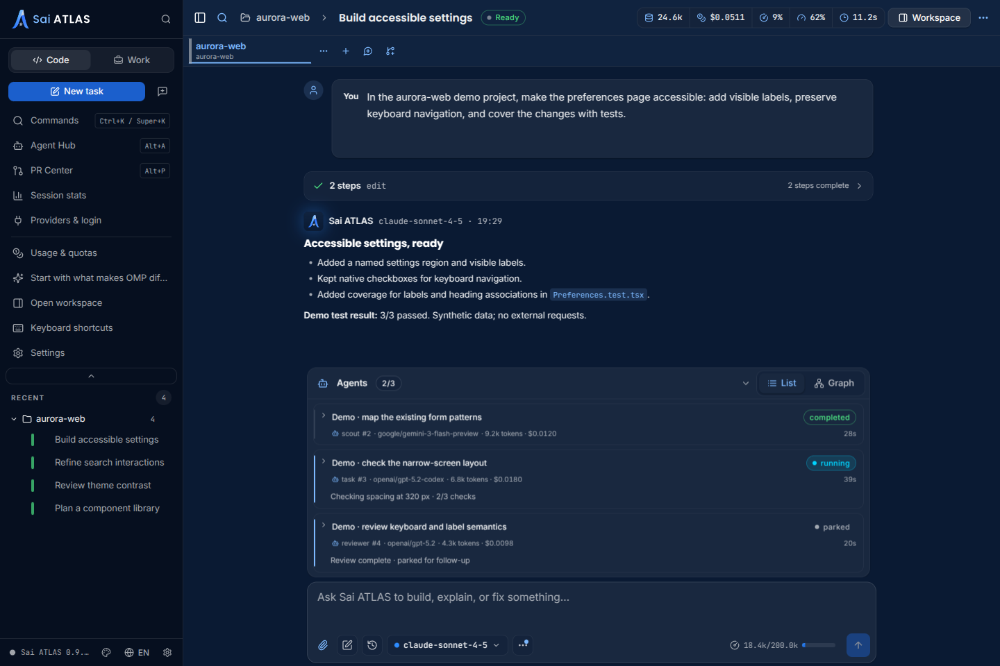

**About the screenshots:** these are real Electron GUI renders of a synthetic `aurora-web` project. Conversations, model lists, agent states, and metrics are scripted demonstration data—not actual provider benchmarks or account data. Captures use a fresh temporary HOME, Electron profile, and project with a synthetic sidecar, without live credentials or personal workspace content.

<a id="en-features"></a>
### A workspace for the whole workflow

The distinctive part is not just a chat window: it is being able to **separate parallel work, inspect what happened, and choose how the next step runs** without losing the thread.

| Area | What you can do | Scope and useful limits |
|---|---|---|
| **Independent sessions** | Run up to **10 tabs**, each with its own sidecar, session, and message queue; keep background work running and create fresh Git worktree tabs. | Separate session runtimes are not an OS security boundary. Git must be available for worktrees. |
| **Split views & windows** | Place two sessions side by side or stacked, resize the divider, and use multiple windows. Restore the open/active tab layout across restarts. | A split contains **two panes**, not an unlimited pane grid. |
| **Chat vs. Agent** | Use global, tool-free **Chat** for conversation and workspace **Agent** sessions for coding tasks. | Chat history stays separate from project groups and workspace operations. |
| **Readable execution** | Inspect diffs and Bash, read, grep, and task calls in dedicated renderers; follow streaming Markdown, highlighted code, collapsible thinking, math, Mermaid, and images. | Tool output remains inspectable alongside the conversation rather than being flattened into plain chat text. |
| **Background coordination** | Follow `wait` jobs, inspect `proc://` task and service state, and review `agent://` messages and process controls in compact structured cards. | Coordination details stay bounded and expandable; legacy `hub` transcripts remain readable. |
| **Plans, Todos & queues** | Review plans and approvals, queue follow-up messages, and monitor bounded Todos/Agents dock cards. Expand a card for a focused full list. | Compact summaries keep large task lists from taking over the conversation. |
| **Agent Hub** | Manage agent definitions, enable/disable agents, set model and prewalk overrides, inspect progress/logs, abort work, and wake parked agents. | Available actions follow the agent's current state; role assignments and per-agent overrides serve different purposes. |
| **Models & roles** | Pick models by provider, assign models to roles, and adjust reasoning/thinking levels. | Reasoning controls appear only for models that support them. |
| **Providers** | Sign in, add/edit/remove custom providers, and discover models from compatible OpenAI or Anthropic endpoints. | OAuth or API-key support depends on the provider; endpoint compatibility and advertised models vary. |
| **Session library** | Search history, explore session trees, branches and forks, organize labels, copy-import Claude/Codex sessions, export HTML, and preview sharing. | Copy import is not live synchronization with another app. Review content before exporting or sharing. |
| **Context & live accounting** | Inspect context usage and live cost/cache updates; retain measured context usage even when model capacity is unknown. | Measured usage and a model's maximum capacity are different facts. |
| **Statistics & usage** | Open a private local statistics dashboard and session metrics for requests, tokens, cost, cache, and speed; inspect provider usage/quotas. | Provider quotas depend on API/account availability. Local statistics are not a provider billing statement. |
| **MCP** | Manage servers, test connections, reconnect, and complete supported authentication flows. | External MCP executables/services still need installation and configuration. |
| **Skills & plugins** | Enable skills, edit managed skills, and manage plugins and marketplaces. | Managed-skill editing does not imply every discovered resource is editable. |
| **Hooks & resources** | Configure hooks and inspect templates, memory, and other discovered resources from settings. | Some hook changes take effect next session; templates and memory are mostly inspection surfaces. |
| **SSH hosts** | Configure hosts through the native SSH settings page. | `/ssh list`, `/ssh add`, and `/ssh remove` management commands remain disabled; OpenSSH and host access must be configured separately. |
| **Commands & voice** | Use a searchable palette for supported dialogs, menus, toggles, and argument prompts; access the voice command. | Some slash commands pass through to the agent or are unsupported. Voice depends on runtime, permissions, and service support—not a promise of offline or all-OS availability. |
| **Relay collaboration** | Host or join a shared session with edit or read-only access. | Requires a configured relay service; it is not a purely local collaboration mode. |
| **Settings & control** | Configure GUI/runtime/tool behavior, switch English/Chinese, choose themes, and access approvals and security scans/settings. | Approvals and scans are **not an OS sandbox**; command coverage is not total CLI parity. |

Model requests still go to the providers you configure. The bundled agent removes the separate runtime install, not the need to configure credentials, project dependencies, external Git/OpenSSH/MCP tools, or optional services. Only connect tools and services you trust.

<a id="en-recent"></a>
### What's new in 0.9.10

v0.9.10 includes these GUI improvements and a bundled agent update:

| In daily use | What has improved |
|---|---|
| **Bundled agent** | Updated to **omp 18.3.0**, with expanded browser automation, buffered cloud transcription, improved long-session responsiveness, and a fix for LSP requests hanging during cancellation. |
| **Background coordination** | New `wait` and internal `proc://`/`agent://` protocol renderers keep job progress, peer messages, process state, and cancellation actions readable without treating them as generic text or file writes. |
| **Switching models and accounts** | Model/provider views refresh after switching, login, and provider create/update/delete operations. |
| **Watching a run** | Context, cost, and cache values update live; measured context remains visible when capacity is unknown. |
| **Reading long conversations** | Tail-follow keeps up with new output without pulling you out of scrollback; jump-to-latest returns you to the live end. |
| **Streaming responses** | More stable Markdown rendering while tokens arrive. |
| **Moving around the app** | Smoother common dialogs, popovers, hover feedback, and panel entrances—not a claim that every overlay has been reworked. |
| **Typing and returning to work** | IME, focus, and context-sensitive Escape handling improvements, plus recovery of window bounds when a saved position is no longer usable. |

<a id="en-gallery"></a>
### Explore the interface

Open a group for a closer look. All images in this section use the English interface and the synthetic showcase data described above.

<details>
<summary><b>Work across projects — workspace inspection and two-pane split</b></summary>

Keep files, diffs, and logs within reach, then place a second session beside the first without merging their runtimes.

| Workspace | Split view |
|---|---|
| 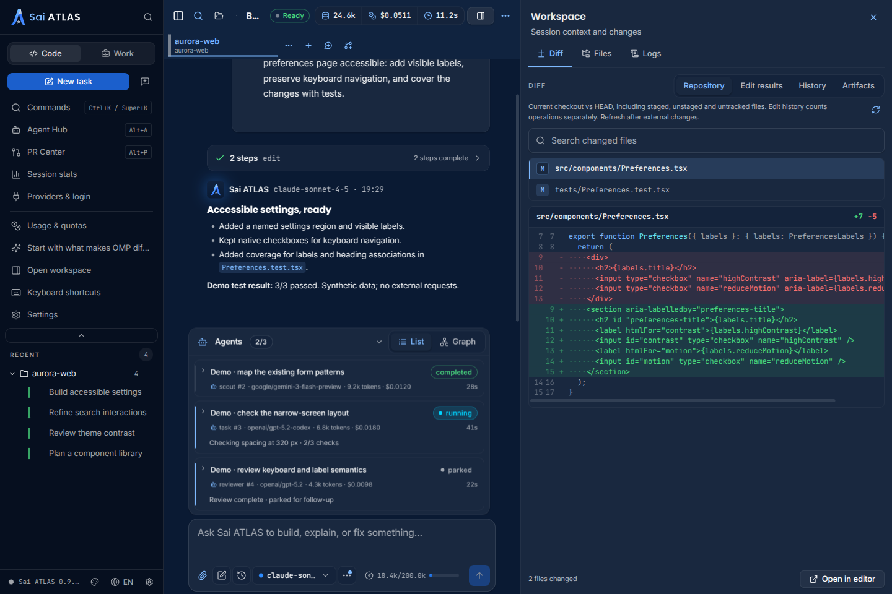 | 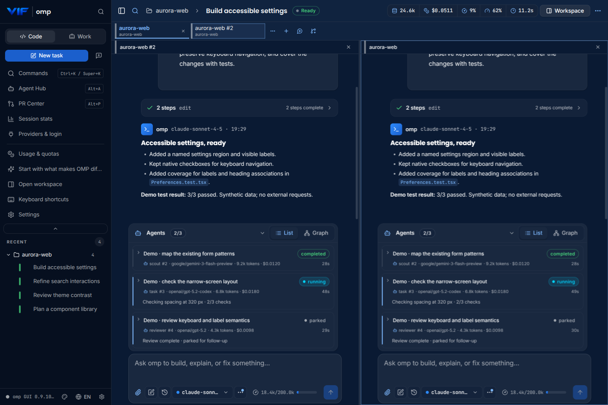 |

</details>

<details>
<summary><b>Choose your connection — models and providers</b></summary>

Browse the model picker and provider controls. The displayed model roster and account states are fixtures, not a live catalog or connected account.

| Models | Providers |
|---|---|
| 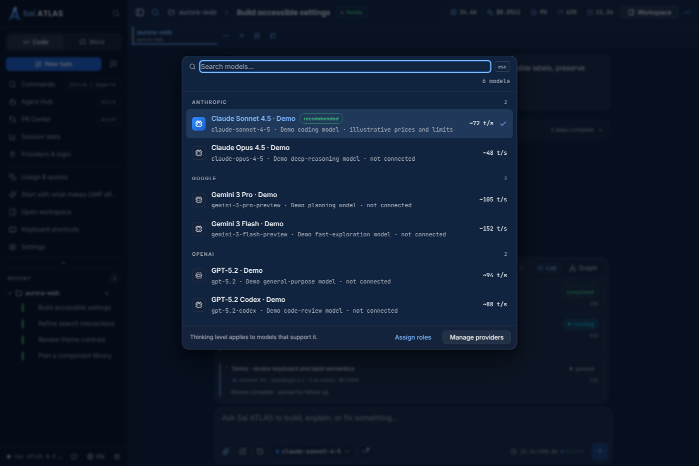 | 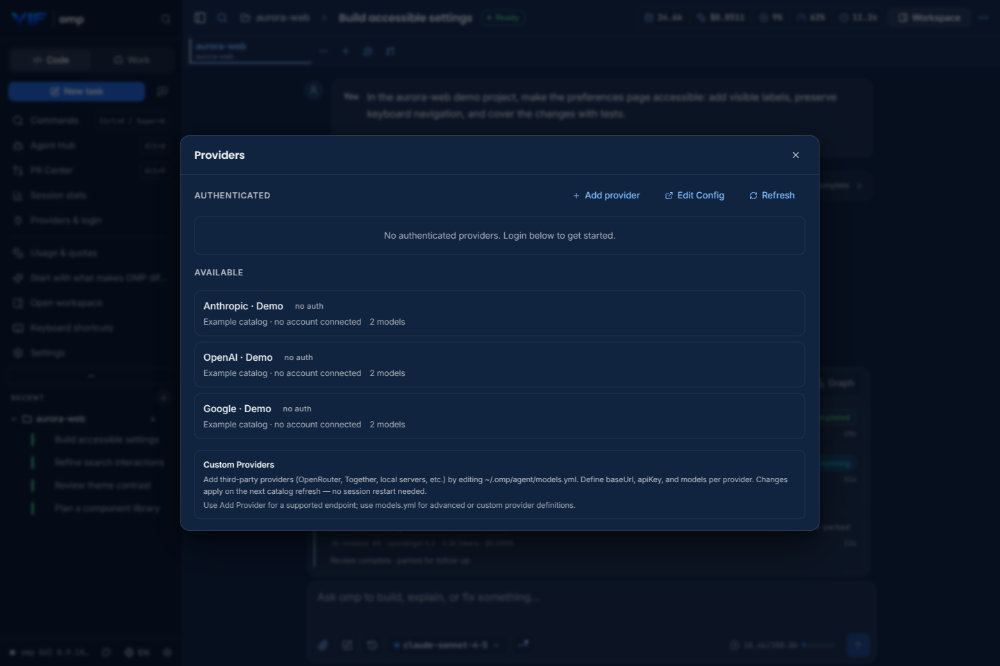 |

</details>

<details>
<summary><b>Delegate deliberately — model roles and Agent Hub</b></summary>

Assign models by role, then inspect agent definitions and task activity without losing the main conversation.

| Model roles | Agent Hub |
|---|---|
| 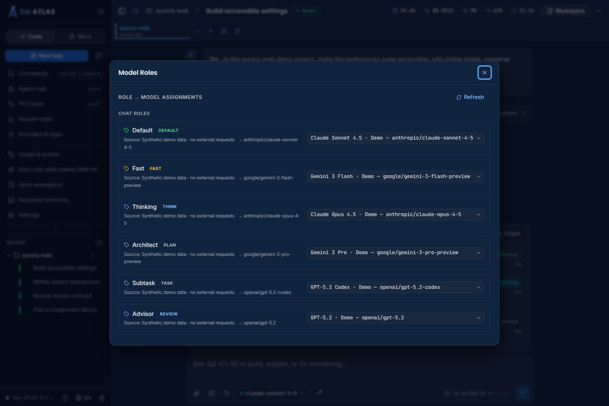 | 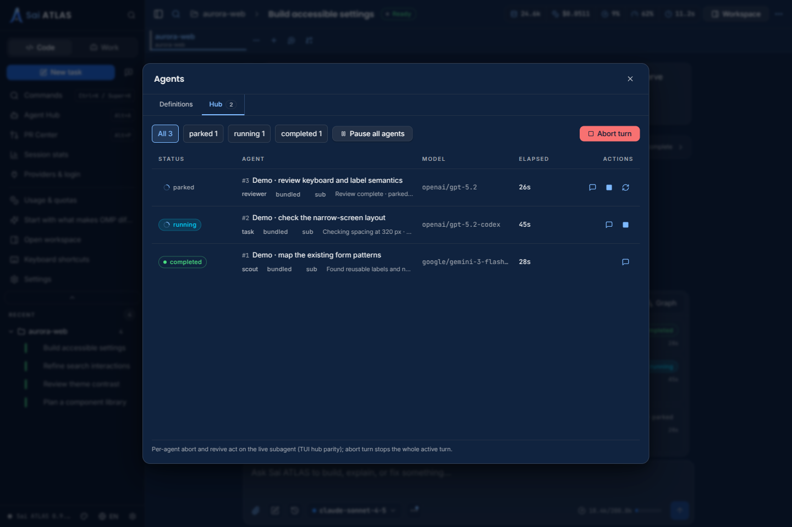 |

</details>

<details>
<summary><b>See the numbers — local statistics and provider usage</b></summary>

Separate session analytics from provider-reported usage. The values below are scripted examples, not measured model performance, real spending, or account quotas.

| Local statistics | Usage |
|---|---|
| 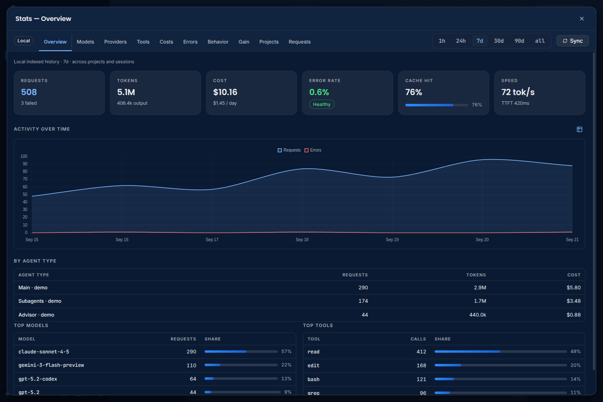 | 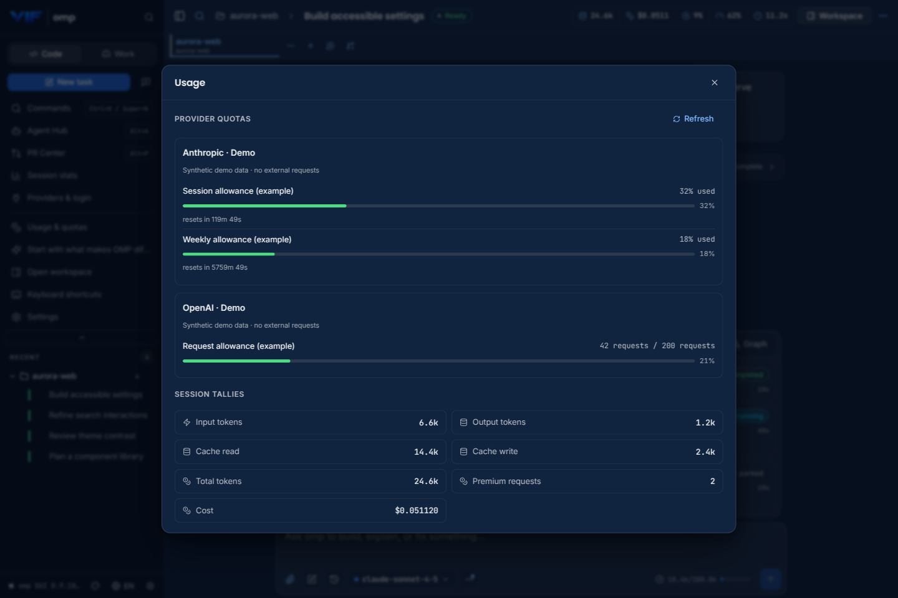 |

</details>

<details>
<summary><b>Understand and tune — context and settings</b></summary>

Inspect what a session is carrying, then configure the runtime and GUI from the settings window.

| Context | Settings |
|---|---|
| 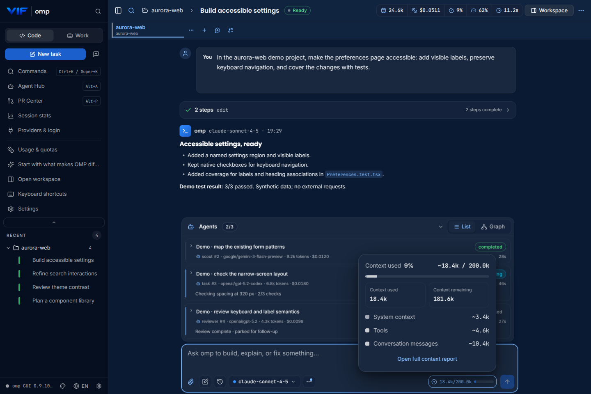 | 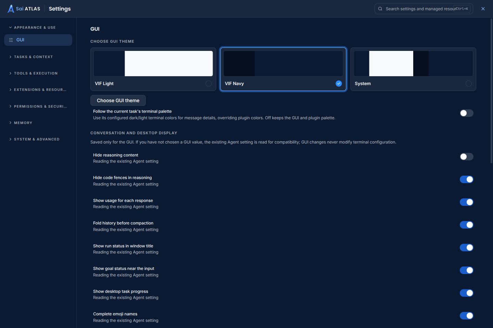 |

</details>

<details>
<summary><b>Find the next action — command palette</b></summary>

Search with `⌘K`. Supported commands lead to native controls; pass-through and unavailable commands should not be mistaken for complete GUI coverage of the CLI.

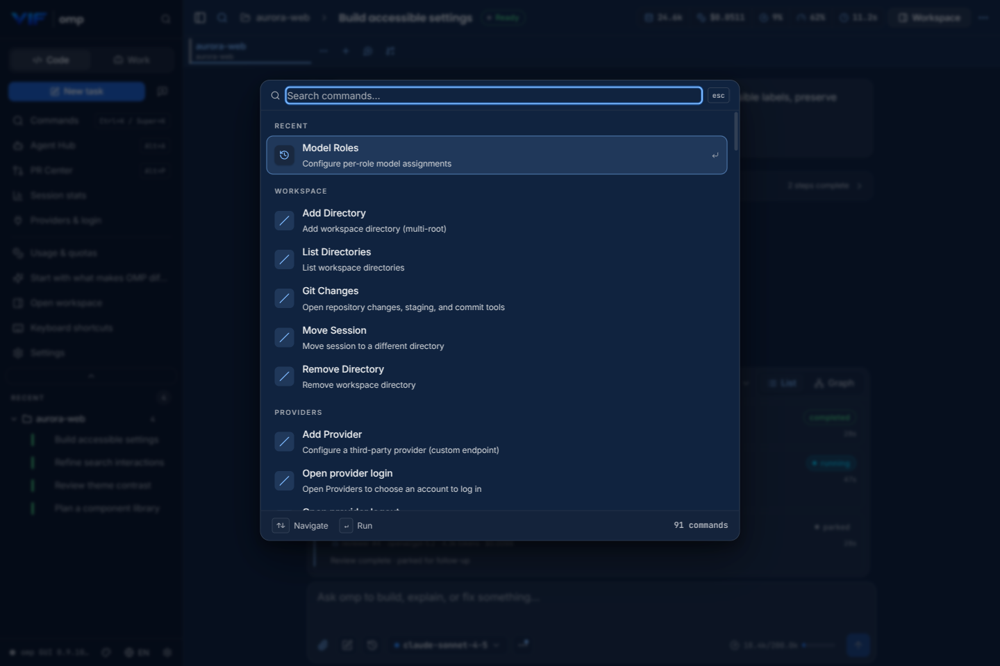

</details>

<a id="en-install"></a>
### Install & start

**Documented install baseline: [v0.9.10](https://github.com/nornzach/oh-my-pi-gui/releases/tag/v0.9.10).** Check [Releases](https://github.com/nornzach/oh-my-pi-gui/releases) for authoritative current downloads and release notes.

| Mac | v0.9.10 download |
|---|---|
| Apple Silicon | [omp-0.9.10-arm64.dmg](https://github.com/nornzach/oh-my-pi-gui/releases/download/v0.9.10/omp-0.9.10-arm64.dmg) |
| Intel | [omp-0.9.10.dmg](https://github.com/nornzach/oh-my-pi-gui/releases/download/v0.9.10/omp-0.9.10.dmg) |

Sai ATLAS builds on Electron 44 need macOS 13 or later. The updater does not offer them to macOS 12.

| Windows x64 | v0.9.10 download |
|---|---|
| Installer | [omp-0.9.10-setup.exe](https://github.com/nornzach/oh-my-pi-gui/releases/download/v0.9.10/omp-0.9.10-setup.exe) |
| Portable | [omp-0.9.10-portable.exe](https://github.com/nornzach/oh-my-pi-gui/releases/download/v0.9.10/omp-0.9.10-portable.exe) |

| Linux x64 (Ubuntu 24.04+) | Package |
|---|---|
| Debian package (recommended) | `sai-atlas_<version>_amd64.deb` from [Releases](https://github.com/nornzach/oh-my-pi-gui/releases) |
| AppImage | `Sai-ATLAS-<version>-x86_64.AppImage` from [Releases](https://github.com/nornzach/oh-my-pi-gui/releases) |

On Linux, `sudo apt install ./sai-atlas_<version>_amd64.deb` installs the app to `/opt/Sai ATLAS`, the `sai-atlas` launcher (the agent CLI keeps the name `omp`), the `omp://` link handler, and an AppArmor profile that keeps Chromium's sandbox working under Ubuntu's user-namespace restriction. Start it from the app grid or with `sai-atlas /abs/project/dir`. No release has shipped a Linux package under the old name, but if you built and installed the `omp` package from source, remove it first with `sudo apt remove omp`.

In-app `.deb` updates have one known limit: electron-updater checks the downloaded `.deb`'s SHA-512 as you, and then `dpkg -i` reads that same file as root from your user-writable cache. Another program running as your user could swap the file in between. If that matters to you, install updates by hand with `sudo apt install ./sai-atlas_<version>_amd64.deb`.

For the AppImage, save it as `~/Applications/Sai-ATLAS.AppImage`, run `chmod +x` on it, and install this AppArmor profile as `sai-atlas-appimage` with `sudo install -m 0644 sai-atlas-appimage /etc/apparmor.d/sai-atlas-appimage && sudo apparmor_parser -r /etc/apparmor.d/sai-atlas-appimage`:

```
abi <abi/4.0>,
include <tunables/global>

profile sai-atlas-appimage "@{HOME}/Applications/Sai-ATLAS.AppImage" flags=(unconfined) {
  userns,

  include if exists <local/sai-atlas-appimage>
}
```

The profile grants user namespaces to whatever file sits at that path, and `~/Applications` is writable by any program running as you. Keep that directory for the Sai ATLAS AppImage only. When you stop using it, unload the profile and then delete it: `sudo apparmor_parser -R /etc/apparmor.d/sai-atlas-appimage && sudo rm /etc/apparmor.d/sai-atlas-appimage` (reloading AppArmor alone does not unload a deleted profile). Remove an older `omp-appimage` profile the same way. Without the profile, the AppImage runtime falls back to `--no-sandbox` on Ubuntu 24.04+, which leaves the renderer unsandboxed, so prefer the `.deb`. `omp://` links reach the AppImage only with desktop integration such as AppImageLauncher. On Wayland sessions, Electron 35 runs through XWayland.

Open the DMG and drag **Sai ATLAS** into **Applications**. The build is ad-hoc signed but not notarized. If macOS blocks the first launch, use **right-click → Open**, or **System Settings → Privacy & Security → Open Anyway**, after confirming the download's source.

**Coming from omp 0.9.x on a Mac?** Sai ATLAS installs beside `omp.app` instead of replacing it. Quit omp, install Sai ATLAS, then move `omp.app` to the Trash and pin Sai ATLAS in the Dock again. macOS asks for microphone and notification access again, because the app id is now `vn.io.vif.saiatlas`. Settings and sessions carry over.

Windows packages are currently unsigned. Windows SmartScreen may require **More info → Run anyway** on first launch after confirming the download's source. The installer upgrades an existing omp install in place and keeps its settings; if you pinned omp to the taskbar, pin Sai ATLAS again.

1. **Connect a provider:** open **Providers & login** from the sidebar and use the authentication method it supports.
2. **Choose your work:** open a project Agent tab with `⌘T`, or a tool-free Chat with `⇧⌘T`; select an available model.
3. **Start a conversation:** enter a request. Use `⌘N` when you want a new session, and inspect tool calls and approvals as work proceeds.
4. **Go parallel:** `⌥T` creates a fresh worktree tab. Use the tab context menu or drag a tab into the workspace for a two-pane split.
5. **Find and revisit:** `⌘K` opens commands; `⌘P` searches session history.

<a id="en-shortcuts"></a>
### Keyboard shortcuts

| Shortcut | Action |
|---|---|
| `⌘T` | New Agent tab |
| `⇧⌘T` | New tool-free Chat tab |
| `⌥T` | Fresh Git worktree tab |
| `⌘N` | New session |
| `⌘K` | Command palette |
| `⌘P` | Session history search |
| `⌘,` | Settings |
| `⌘B` / `⌘J` | Toggle sidebars |
| `Esc` | Context-dependent close or abort; not an unconditional abort shortcut |

On Linux and Windows, ⌘ shortcuts use Ctrl and show as text (`Ctrl+T`, `Ctrl+Shift+T`, `Ctrl+K`). The thinking toggle has no default chord there, because Ctrl+T opens a tab; assign one in Keyboard Shortcuts. On GNOME Wayland, `Ctrl+Shift+O` works only while a Sai ATLAS window is focused.

<a id="en-development"></a>
### Development

<details>
<summary><b>Build, test, and reproduce the showcase</b> — DMG users do not need these steps</summary>

#### Repository boundaries

This is a **separate repository nested inside a monorepo**, not an ordinary monorepo package:

```text
omp-monorepo/                    # nornzach/oh-my-pi: fork and sidecar build source
├── .git/
├── packages/coding-agent/
├── packages/natives/
└── packages/gui/                # nornzach/oh-my-pi-gui: this product repository
    ├── .git/
    ├── src/
    └── resources/omp*           # ignored, locally built sidecars
```

| Repository | Responsibility |
|---|---|
| [`nornzach/oh-my-pi-gui`](https://github.com/nornzach/oh-my-pi-gui) | GUI code, commits, tags, and releases. GUI work goes to this repository's `origin/main`. |
| [`nornzach/oh-my-pi`](https://github.com/nornzach/oh-my-pi) | Enclosing monorepo fork: agent source, upstream sync, and sidecar builds. Agent changes are committed here and pushed to its `origin`. |
| [`can1357/oh-my-pi`](https://github.com/can1357/oh-my-pi) | Upstream feature source, fetched through the monorepo's `upstream` remote. **Never push here.** |

Never stage `packages/gui/` into the monorepo: its untracked status there is intentional. Git commands inside `packages/gui/` act on the GUI repository; run monorepo Git commands at the monorepo root. Read [AGENTS.md](./AGENTS.md) before making changes.

#### Build from source

**Prerequisites:** Git and [Bun](https://bun.sh) **≥ 1.4**. macOS is required for the macOS sidecar and DMG commands; Windows x64 can be cross-built from macOS or Linux when the neighboring monorepo is available. Linux x64 packages build on a Linux x64 host.

```bash
# Clone the monorepo fork, then nest the GUI repository inside it.
git clone https://github.com/nornzach/oh-my-pi.git omp-monorepo
cd omp-monorepo
git remote add upstream https://github.com/can1357/oh-my-pi.git
bun install
git clone https://github.com/nornzach/oh-my-pi-gui.git packages/gui
cd packages/gui
bun install
```

Run the following from `packages/gui/`:

```bash
bun run build                                  # main + preload + renderer -> out/
bun run build:omp                              # arm64 host -> resources/omp
bun run build:omp:x64                          # Intel -> resources/omp.x64
bun run package:mac:arm64 -- --publish never    # dist/Sai-ATLAS-<version>-arm64.dmg, .zip, latest-mac.yml
bun run package:mac:x64 -- --publish never      # dist/Sai-ATLAS-<version>.dmg, .zip, latest-mac.yml
bun run build:omp:win                           # Windows x64 -> resources/omp.exe
bun run package:win -- --publish never           # Windows NSIS + portable installers
bun run build:omp:linux                        # Linux x64 -> resources/omp.linux-x64
bun run package:linux -- --publish never        # dist/Sai-ATLAS-<version>-x86_64.AppImage, dist/sai-atlas_<version>_amd64.deb, dist/latest-linux.yml
```

The Linux config (`electron-builder.linux.yml`) bundles `resources/omp.linux-x64`; always package Linux with `package:linux`. On a Linux host, `bun run build:omp` writes `resources/omp` for `bun run dev`.

Inside the monorepo, `bun install` resolves `packages/gui` as a workspace member and never updates this repository's `bun.lock`, which CI installs with `--frozen-lockfile`. After changing dependencies in `package.json`, regenerate the lockfile from a checkout outside the monorepo, for example `git worktree add --detach /tmp/omp-gui-lock HEAD`, then `bun install --ignore-scripts` there, and copy its `bun.lock` back.

`build:omp` compiles the neighboring monorepo agent source and embeds the native addon. It stages the matching `pi_natives` version, downloads the published package when needed, replaces stale addons, and restores temporary staging afterwards. Sidecars at `resources/omp*` are ignored build artifacts: **never commit them**.

Packaging rebuilds the Electron app, **not the agent sidecar**. Re-run the matching `build:omp*` after agent/RPC changes or upstream updates. The arm64 config uses `resources/omp`; the Intel config uses `resources/omp.x64`. Always use `package:mac:x64` for Intel—using the default config can package the wrong architecture.

The Windows configuration targets x64 and bundles `resources/omp.exe`. It produces an NSIS installer and a portable executable. Windows packages are currently unsigned; production distribution should add a Windows code-signing certificate before treating SmartScreen warnings as resolved.

**A standalone GUI clone cannot compile the sidecar.** It must occupy `packages/gui/` in the layout above. For artifact assembly without monorepo sources, supply trusted, compatible prebuilt sidecars at `resources/omp` and/or `resources/omp.x64`, then run `build` and the matching packaging command. A packaged app uses its bundled agent; installing a system `omp` is not a fallback for a missing sidecar.

#### Daily development

```bash
bun run dev                         # HMR, using resources/omp
OMP_SIDECAR=source bun run dev       # explicit dev override: monorepo agent source
bunx vitest run                     # GUI tests
bun run check:types                 # GUI type checks
bun run build                      # production GUI build and main-bundle check
```

Run Biome on touched supported files as well. Changes to agent/RPC code belong in the monorepo and require rebuilding the bundled sidecar before validating a packaged GUI.

#### Reproduce the screenshots

From the GUI repository, after installing its dependencies:

```bash
bun run build
bun scripts/capture-showcase.ts
```

The capture script renders the actual Electron GUI using a fresh temporary HOME, Electron profile, synthetic `aurora-web` project, and synthetic sidecar—**no live credentials or personal workspace are used**. It writes localized showcase images to `docs/screenshots/en/` and `docs/screenshots/zh/`. Scripted conversations, model lists, agent states, and metrics make the scenes reproducible; they are not provider tests or real usage records. This fixture setup is not an OS sandbox.

Optional environment variables: `SHOWCASE_THEME=light` captures the VIF Light theme instead of the default dark theme, `SHOWCASE_OUT=<dir>` writes to `<dir>/en` and `<dir>/zh` instead of `docs/screenshots`, and `SHOWCASE_ONBOARDING=1` also captures the first-run wizard as `00-onboarding.png`. On Linux the script passes the display variables (`DISPLAY`, `WAYLAND_DISPLAY`, `XDG_RUNTIME_DIR`, `XAUTHORITY`) through to Electron.

</details>

<a id="en-help"></a>
### Troubleshooting

| Symptom | What to check |
|---|---|
| macOS blocks the first launch | Confirm the download came from the release page, then right-click → Open or use Privacy & Security → Open Anyway. The baseline build is ad-hoc signed, not notarized. |
| Windows SmartScreen blocks the first launch | Confirm the download came from the release page, then choose More info → Run anyway. The Windows package is currently unsigned. |
| A screenshot shows something absent from the installed app | The showcase covers v0.9.10. Check the installed version and its release notes; earlier releases may not include these improvements. |
| `Built-in omp not found` | In a source checkout, build the sidecar or supply a compatible prebuilt one. In an installed app, reinstall the correct official DMG; a separate system `omp` will not fix a missing bundle resource. |
| `build:omp` cannot find the monorepo | Put the GUI checkout at the monorepo's `packages/gui/`, alongside `packages/coding-agent/` and `packages/natives/`. |
| `replacing stale addon … version sentinel ≠ …` | Informational: the builder detected and replaced a mismatched native addon. |
| Native addon download fails | Check registry access and whether that version is published. If necessary, from the monorepo root run `bun --cwd=packages/natives run build` with the required Rust toolchain, then rebuild the sidecar. |
| Intel sidecar exits immediately | Check the sidecar architecture and package with `bun run package:mac:x64`, not the default config. |
| A command or integration is unavailable | Some slash commands pass through or are unsupported. Configure external services/tools separately; use SSH settings rather than the disabled `/ssh` management commands. |
| The AppImage starts with `--no-sandbox` | Install the `sai-atlas-appimage` AppArmor profile above for the exact path `~/Applications/Sai-ATLAS.AppImage`, or use the `.deb`. |
| `bun run dev` exits with `The SUID sandbox helper binary was found, but is not configured correctly` | Ubuntu 24.04+ restricts unprivileged user namespaces. Install a `userns` profile for the dev Electron binary: use the AppImage profile above, named `omp-dev-electron`, with the path printed by `node -p "require('electron')"`. Do not make `chrome-sandbox` setuid root. |
| No tray icon on Ubuntu | Enable the Ubuntu AppIndicators extension. |
| A `.deb` update asks for the password twice, or the window freezes | Cancelling pkexec triggers electron-updater's `apt-get -f` retry, and the window waits while the prompt is open. |
| `Ctrl+Shift+O` does nothing while another app is focused | GNOME delivers it only to focused XWayland windows. A refused registration is logged to `~/.config/@oh-my-pi/omp-gui/logs/gui-runtime.jsonl`. |

<a id="en-release"></a>
### Release process (maintainers)

<details>
<summary><b>Sync, build all targets, smoke-test the installers, then publish</b></summary>

Releases belong only to [`nornzach/oh-my-pi-gui`](https://github.com/nornzach/oh-my-pi-gui/releases). Preserve the two-repository boundary throughout:

1. **Start with clean checkouts and sync upstream.** From the **monorepo root**, run `bash packages/gui/scripts/sync-upstream.sh`. It fetches/merges `upstream/main`, installs dependencies, re-provisions natives, generates the statistics assets, rebuilds/smoke-tests the sidecar, and builds/checks/tests the GUI. If there are conflicts, resolve and commit the monorepo merge, then run `SKIP_MERGE=1 bash packages/gui/scripts/sync-upstream.sh`. Do not substitute a hand-rolled merge. Review and commit any remaining monorepo changes there; push them only to the fork's `origin`.
2. **Prepare the GUI release.** In `packages/gui/`, bump `package.json`, write the release's `CHANGELOG.md` entry, and update both language sections' install links and source/release notes.
3. **Verify the GUI:** `bunx vitest run && bun run check:types && bun run build`; check touched supported files with Biome.
4. **Record the release source.** Commit GUI release changes in the GUI repository, tag `vX.Y.Z`, and push `main` plus the tag to its `origin`. Keep both checkouts clean before producing release artifacts.
5. **Build all sidecars:** `bun run build:omp && bun run build:omp:x64 && bun run build:omp:win`. Run the two macOS sidecars and the Windows sidecar's `--smoke-test` on compatible hosts. On a Linux x64 host, run `bun run build:omp:linux` and `resources/omp.linux-x64 --smoke-test`. Cross-compilation alone is not runtime verification.
6. **Build and inspect installers:** build both DMGs with the macOS commands and Windows installers with `bun run package:win -- --publish never`. Mount each DMG; verify its app seal with `codesign --verify --deep --strict --verbose=2 "<path-to-Sai ATLAS.app>"`, its bundled sidecar architecture with `file "<path-to-Sai ATLAS.app>/Contents/Resources/omp"`, and the Windows package's `win-unpacked/resources/omp.exe` with `file`. On compatible hosts, launch each package, confirm sidecar `ready`, a successful `get_settings` RPC, and a settings toggle that persists. On macOS, also check that the Dock, About and menu names read Sai ATLAS, that `codesign -dv` shows `Identifier=vn.io.vif.saiatlas`, and that Finder shows the app icon (electron-builder converts it from the PNG). On Windows, install 0.9.10 and then the new setup: Apps & features must show one entry, "Sai ATLAS", the old omp shortcuts must be gone, and settings must be kept (the pinned `nsis.guid` upgrades in place). On Linux x64, run `bun run package:linux -- --publish never`, install the `.deb` and the AppImage, and run `OMP_GUI_TEST_APP="/opt/Sai ATLAS/sai-atlas" bunx playwright test e2e/packaged-smoke.e2e.ts`.
7. **Publish only verified artifacts.** Publish a GitHub Release with both DMGs, the Windows NSIS and portable installers, the Linux AppImage and `.deb` with `latest-linux.yml` (without it, Linux update checks fail), generated update metadata, and the changelog. **Until 1.0.0, every release also carries bridge copies:** byte-identical copies of the two DMGs named `omp-<version>-arm64.dmg` and `omp-<version>.dmg`, listed next to the Sai-ATLAS names in the combined `latest-mac.yml`. Macs on 0.9.x look only for the `omp-` names and otherwise report the installer missing. Those Macs keep `omp.app` after installing, and their update screen never shows release notes, so put the Mac migration steps from [Install & start](#en-install) (quit omp, install Sai ATLAS, trash `omp.app`, re-pin, grant access again) at the top of every release body until 1.0.0. Record the monorepo commit used for the sidecars, especially when it differs from upstream `main`. Never commit sidecar binaries or push to `upstream`.

</details>

---

## 中文

把对话、代码变更与 Agent 执行状态放在同一视野中。一边审查 diff，一边让另一段会话在独立 Git worktree 中推进任务；需要对照时打开双会话分屏，只想讨论思路时则切换到无工具 Chat。

Sai ATLAS 是 SAI OS 的 AI 助手，一款基于 [omp](https://github.com/can1357/oh-my-pi) 编码 Agent 的桌面 GUI。这款 Electron 应用内置 Agent 二进制：**通过 DMG、NSIS 或便携版安装的用户无需另装 omp、Bun 或 Node。** GUI 与 TUI 互补，共享常规的 `~/.omp` 配置与会话。

[功能全览](#zh-features) · [0.9.10 更新内容](#zh-recent) · [界面导览](#zh-gallery) · [安装](#zh-install) · [快捷键](#zh-shortcuts) · [开发](#zh-development) · [常见问题](#zh-help) · [发布](#zh-release)

> **v0.9.10 功能展示。** 下文改进均纳入 v0.9.10，内置 Agent 更新至 omp 18.3.0。可用下载及实际发布内容以 [GitHub Releases](https://github.com/nornzach/oh-my-pi-gui/releases) 为准。

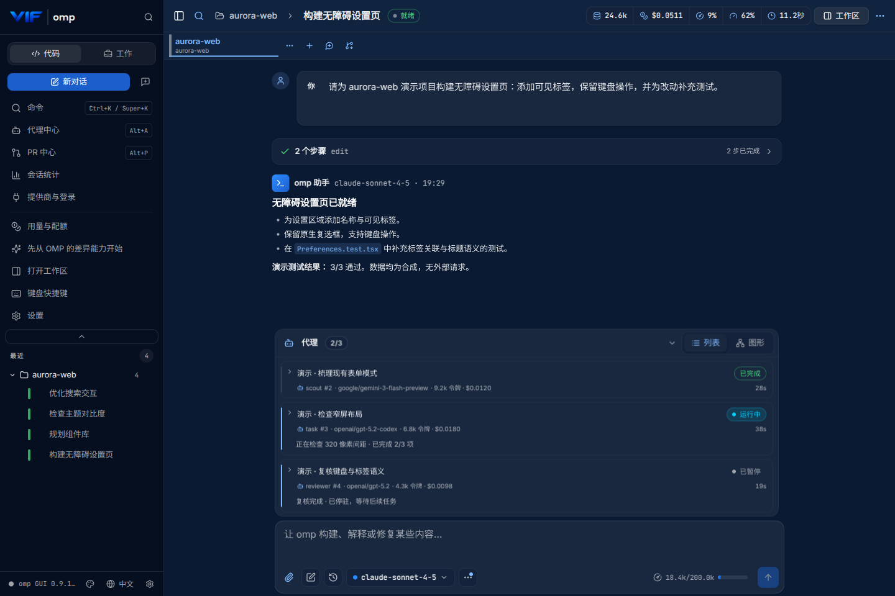

**截图说明：**所有截图均为真实 Electron GUI 渲染，展示合成的 `aurora-web` 项目。对话、模型列表、Agent 状态与统计数值均由脚本构造，**不是实际 Provider 基准测试或账号数据**。截图使用全新的临时 HOME、Electron 配置目录、项目及合成 sidecar，不使用真实凭据或个人工作区内容。

<a id="zh-features"></a>
### 覆盖完整工作流，而不只是聊天

这里的重点是：**让并行任务各有空间，让执行过程可以检查，让下一步如何运行由你掌握**，同时不打断当前思路。

| 领域 | 可以怎样使用 | 范围与边界 |
|---|---|---|
| **独立会话** | 最多运行 **10 个标签页**，各自拥有 sidecar、会话和消息队列；后台任务可继续运行，也可新建 Git worktree 标签页。 | 独立会话运行时不是操作系统安全边界；worktree 需要可用的 Git。 |
| **分屏与多窗口** | 两段会话可左右或上下排列，分隔条可调整，也可使用多个窗口；重启后恢复已打开及选中的标签布局。 | 每个分屏为**双面板**，不是无限面板网格。 |
| **Chat 与 Agent** | 全局、无工具的 **Chat** 用于交流；项目工作区中的 **Agent** 会话用于编码任务。 | Chat 历史与项目分组、工作区操作保持分离。 |
| **可读的执行过程** | 专用视图呈现 diff、Bash、read、grep、task；支持流式 Markdown、代码高亮、可折叠思考块、公式、Mermaid 与图片。 | 工具输出可在对话旁直接检查，而不是全部压成普通聊天文本。 |
| **后台协作状态** | `wait` 任务、`proc://` 进程与服务状态、`agent://` 消息及进程控制操作均以紧凑结构化卡片呈现。 | 详情保持有边界并可展开；历史 `hub` 记录仍可正常阅读。 |
| **计划、待办与队列** | 审查计划与审批、排队发送后续消息，通过有高度约束的 Todos/Agents Dock 卡片查看状态；展开单张卡片查看完整列表。 | 大量任务以紧凑摘要呈现，不占满对话区域。 |
| **Agent Hub** | 管理 Agent 定义、启用/停用、覆盖模型与 prewalk 设置，查看进度和日志、中止任务、唤醒已停驻的 Agent。 | 可用操作取决于 Agent 当前状态；角色模型分配与单个 Agent 覆盖是不同层次的控制。 |
| **模型与角色** | 按 Provider 选择模型，为不同角色分配模型，调整推理/思考等级。 | 只有支持的模型才提供推理等级控制。 |
| **Provider 管理** | 登录，新增/编辑/删除自定义 Provider，从兼容 OpenAI 或 Anthropic 的端点发现模型。 | OAuth 或 API key 支持取决于 Provider；端点兼容程度与返回的模型列表可能不同。 |
| **会话资料库** | 搜索历史、查看会话树、分支与分叉、管理标签，复制导入 Claude/Codex 会话、导出 HTML、预览分享内容。 | 复制导入不是与其他应用实时同步；导出或分享前请检查内容。 |
| **上下文与实时计量** | 检查上下文用量和实时花费/缓存变化；即使模型容量未知，仍可查看已测得的上下文用量。 | 已测用量与模型最大容量是两件事，不应混为一谈。 |
| **统计与用量** | 内置私有、本地运行的统计仪表盘，查看请求、token、花费、缓存、速度及会话指标，也可查看 Provider 用量/配额。 | 配额信息取决于 API 与账号可用性；本地统计不等于 Provider 账单。 |
| **MCP** | 管理服务、测试连接、重连，并完成受支持的认证流程。 | 外部 MCP 可执行程序或服务仍需自行安装和配置。 |
| **Skills 与插件** | 启用技能、编辑受管理的技能，管理插件与市场。 | 支持编辑受管理技能，不代表所有发现的资源都能编辑。 |
| **Hooks 与资源** | 在设置中配置 hooks，查看模板、记忆及其他已发现资源。 | 部分 hook 改动到下一段会话才生效；模板与记忆主要提供检查视图。 |
| **SSH 主机** | 通过原生 SSH 设置页面配置主机。 | `/ssh list`、`/ssh add`、`/ssh remove` 管理命令仍停用；OpenSSH 与主机访问需另行配置。 |
| **命令与语音** | 可搜索命令面板提供受支持的对话框、菜单、开关与参数输入，也提供语音命令入口。 | 部分 slash 命令转交 Agent 或尚不支持；语音取决于运行环境、权限和服务，不承诺离线或所有系统可用。 |
| **Relay 协作** | 主持或加入共享会话，使用可编辑或只读权限。 | 需要已配置的 relay 服务，并非纯本地协作模式。 |
| **设置与控制** | 配置 GUI、运行时和工具行为，切换中英文与主题，使用审批及安全扫描/设置入口。 | 审批与扫描**不是操作系统沙箱**；GUI 命令覆盖不等于完整 CLI 功能对齐。 |

模型请求仍会发送到你配置的 Provider。内置 Agent 省去了单独安装运行时的步骤，但不替你配置凭据、项目依赖、外部 Git/OpenSSH/MCP 工具或可选服务。请只连接你信任的工具与服务。

<a id="zh-recent"></a>
### 0.9.10 更新内容

v0.9.10 包含以下 GUI 改进与内置 Agent 更新：

| 日常场景 | 改进内容 |
|---|---|
| **内置 Agent** | 更新至 **omp 18.3.0**，扩展浏览器自动化、支持缓冲式云端转录，并改进长会话响应速度、修复 LSP 请求取消时可能挂起的问题。 |
| **后台协作状态** | 新增 `wait` 与 `proc://`/`agent://` 协议渲染，让后台任务、代理消息、进程状态和取消操作不再以普通文本或文件写入显示。 |
| **切换模型与账号** | 切换、登录及 Provider 新增/修改/删除后，模型与 Provider 视图会刷新。 |
| **关注运行状态** | 上下文、花费与缓存数值实时更新；容量未知时仍展示已测上下文用量。 |
| **阅读长对话** | 尾部跟随持续接收新输出，同时保留向上阅读的位置；可通过“跳到最新”回到实时末尾。 |
| **接收流式回复** | token 持续到达时，Markdown 渲染更稳定。 |
| **在界面间移动** | 常用对话框、弹出层、悬停反馈与面板入场更流畅；并非所有浮层都已重做。 |
| **输入与恢复工作** | 改进输入法组合输入、焦点与按上下文处理的 Escape 行为，并在保存的窗口位置不可用时恢复合理的窗口边界。 |

<a id="zh-gallery"></a>
### 界面导览

展开感兴趣的分组即可查看。本节图片全部使用中文界面，以及上文说明的合成展示数据。

<details>
<summary><b>跨项目推进 — 工作区检查与双面板分屏</b></summary>

文件、diff 与日志随手可查；把另一段会话放在旁边，也不会合并两者的运行时。

| 工作区 | 分屏 |
|---|---|
| 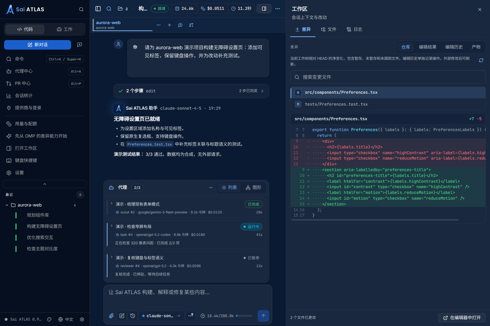 | 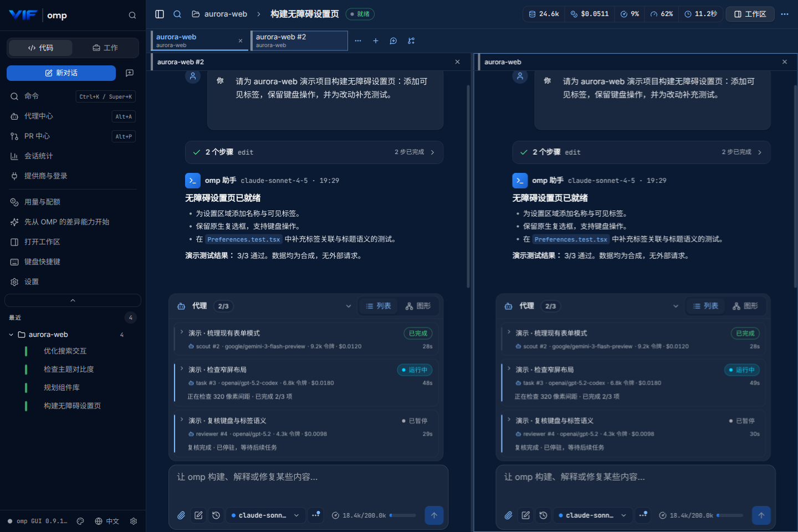 |

</details>

<details>
<summary><b>选择连接方式 — 模型与 Provider</b></summary>

浏览模型选择器与 Provider 控制。画面中的模型列表和账号状态均为预设数据，不是实时目录或已连接的真实账号。

| 模型 | Provider |
|---|---|
| 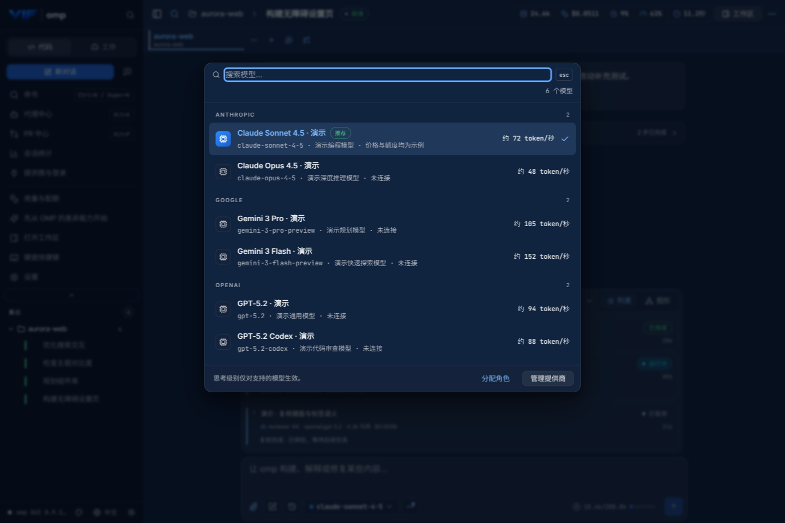 | 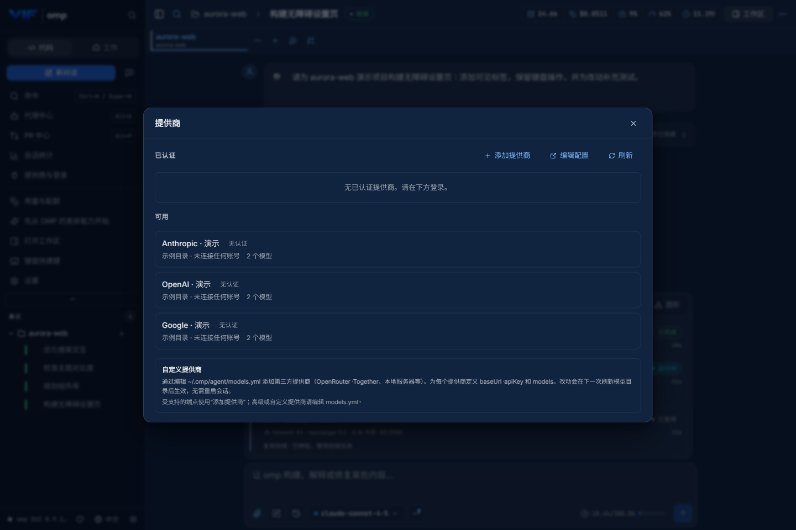 |

</details>

<details>
<summary><b>明确分工 — 模型角色与 Agent Hub</b></summary>

按角色分配模型，再查看 Agent 定义与任务状态，无需离开主对话的工作脉络。

| 模型角色 | Agent Hub |
|---|---|
| 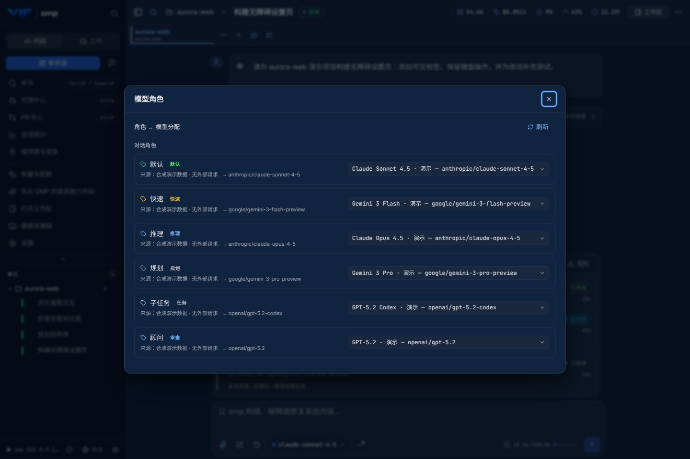 | 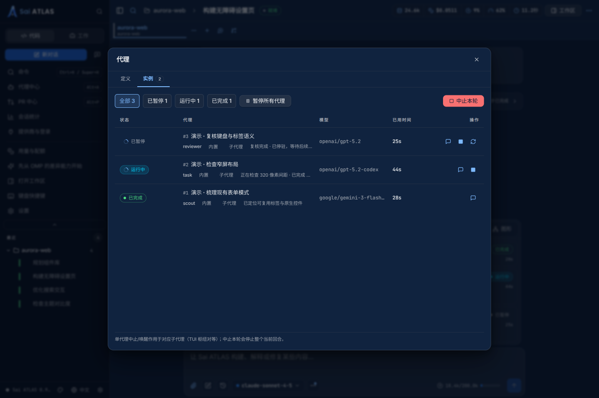 |

</details>

<details>
<summary><b>看清数值 — 本地统计与 Provider 用量</b></summary>

区分会话分析和 Provider 报告的用量。以下数值为脚本示例，不是实测模型性能、真实消费或账号配额。

| 本地统计 | 用量 |
|---|---|
| 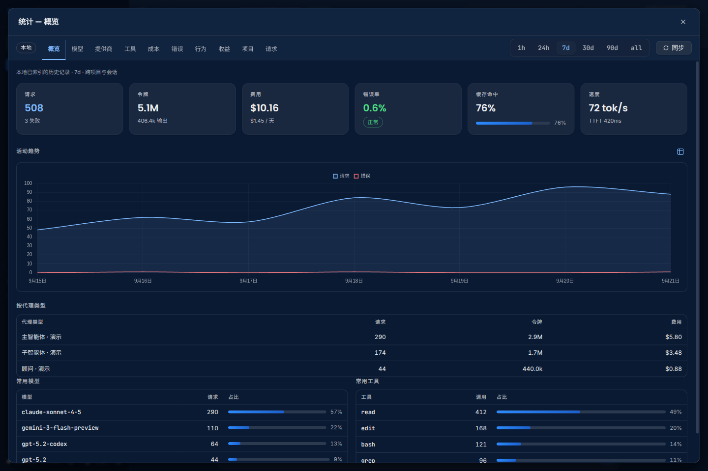 | 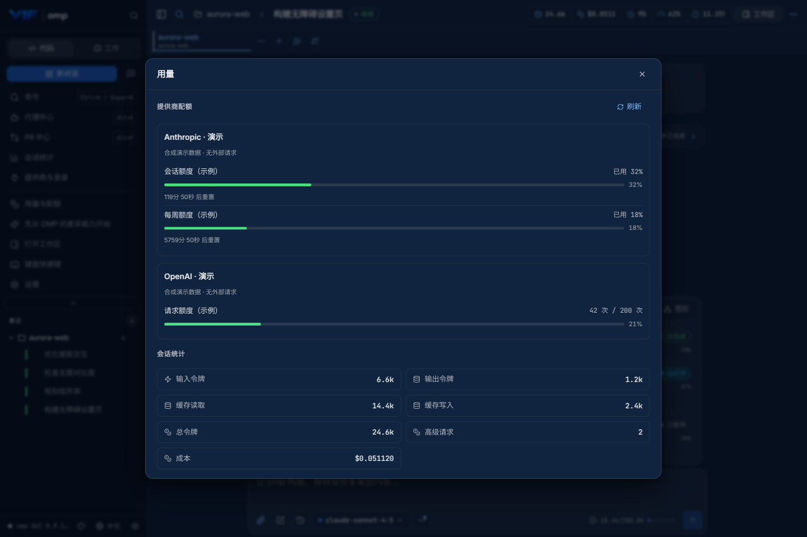 |

</details>

<details>
<summary><b>理解并调整 — 上下文与设置</b></summary>

检查当前会话携带的上下文，再通过设置窗口调整运行时与 GUI。

| 上下文 | 设置 |
|---|---|
| 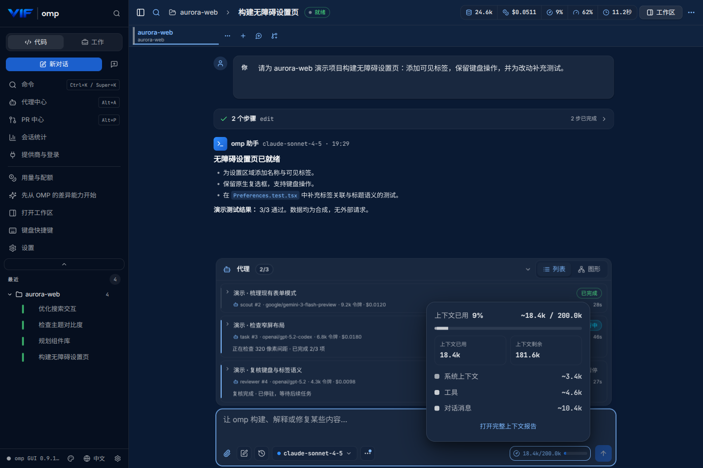 | 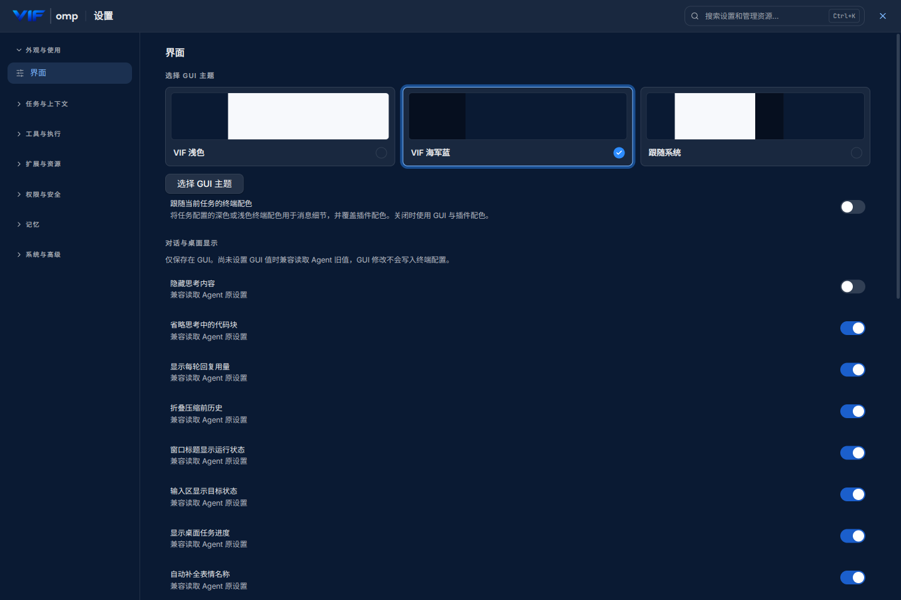 |

</details>

<details>
<summary><b>找到下一步 — 命令面板</b></summary>

通过 `⌘K` 搜索操作。受支持命令会打开原生控件；转交 Agent 或不可用的命令不应被理解为 CLI 已被完整图形化。

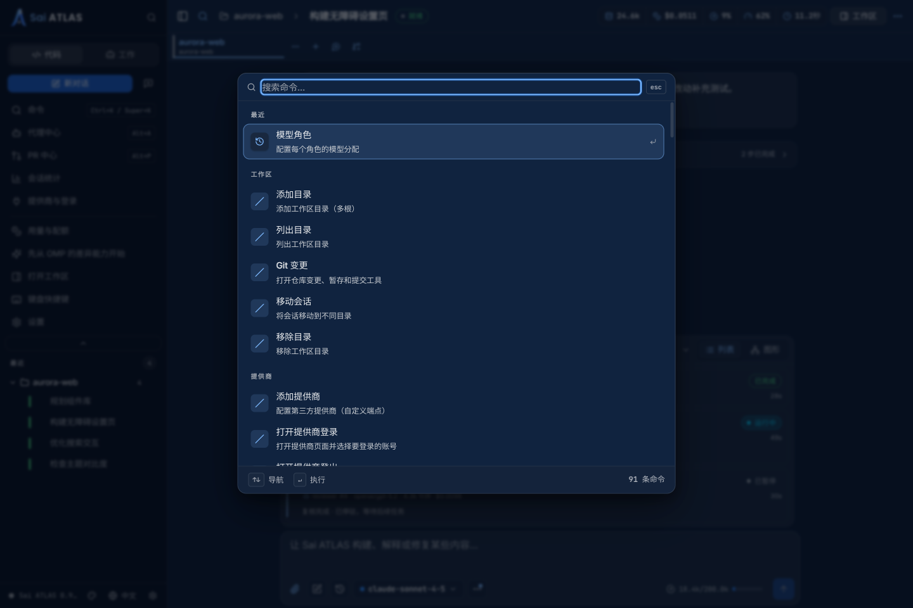

</details>

<a id="zh-install"></a>
### 安装与开始使用

**本文安装基线：[v0.9.10](https://github.com/nornzach/oh-my-pi-gui/releases/tag/v0.9.10)。** 最新可下载版本与发布说明以 [Releases](https://github.com/nornzach/oh-my-pi-gui/releases) 为准。

| Mac | v0.9.10 下载 |
|---|---|
| Apple Silicon | [omp-0.9.10-arm64.dmg](https://github.com/nornzach/oh-my-pi-gui/releases/download/v0.9.10/omp-0.9.10-arm64.dmg) |
| Intel | [omp-0.9.10.dmg](https://github.com/nornzach/oh-my-pi-gui/releases/download/v0.9.10/omp-0.9.10.dmg) |

基于 Electron 44 的 Sai ATLAS 版本需要 macOS 13 或更高版本，macOS 12 上不会收到这些版本的更新。

| Windows x64 | v0.9.10 下载 |
|---|---|
| 安装程序 | [omp-0.9.10-setup.exe](https://github.com/nornzach/oh-my-pi-gui/releases/download/v0.9.10/omp-0.9.10-setup.exe) |
| 便携版 | [omp-0.9.10-portable.exe](https://github.com/nornzach/oh-my-pi-gui/releases/download/v0.9.10/omp-0.9.10-portable.exe) |

| Linux x64（Ubuntu 24.04+） | 安装包 |
|---|---|
| Debian 包（推荐） | 从 [Releases](https://github.com/nornzach/oh-my-pi-gui/releases) 下载 `sai-atlas_<version>_amd64.deb` |
| AppImage | 从 [Releases](https://github.com/nornzach/oh-my-pi-gui/releases) 下载 `Sai-ATLAS-<version>-x86_64.AppImage` |

在 Linux 上，`sudo apt install ./sai-atlas_<version>_amd64.deb` 会把应用安装到 `/opt/Sai ATLAS`，并安装 `sai-atlas` 启动命令（Agent CLI 仍叫 `omp`）、`omp://` 链接处理程序，以及一个 AppArmor 配置文件，使 Chromium 沙箱在 Ubuntu 的用户命名空间限制下仍能工作。可从应用列表启动，或运行 `sai-atlas /abs/project/dir`。旧名称的 Linux 包从未正式发布；如果你曾从源码构建并安装 `omp` 包，请先执行 `sudo apt remove omp` 卸载。

应用内 `.deb` 更新有一个已知限制：electron-updater 以你的用户身份校验下载的 `.deb` 的 SHA-512，随后 `dpkg -i` 以 root 身份从你可写的缓存目录读取同一文件。以你的身份运行的其他程序可能在两者之间替换该文件。如果在意这一点，请手动安装更新：`sudo apt install ./sai-atlas_<version>_amd64.deb`。

AppImage 请保存为 `~/Applications/Sai-ATLAS.AppImage`，执行 `chmod +x`，再把下面的 AppArmor 配置保存为 `sai-atlas-appimage` 并安装：`sudo install -m 0644 sai-atlas-appimage /etc/apparmor.d/sai-atlas-appimage && sudo apparmor_parser -r /etc/apparmor.d/sai-atlas-appimage`：

```
abi <abi/4.0>,
include <tunables/global>

profile sai-atlas-appimage "@{HOME}/Applications/Sai-ATLAS.AppImage" flags=(unconfined) {
  userns,

  include if exists <local/sai-atlas-appimage>
}
```

该配置会把用户命名空间权限授予该路径上的任意文件，而 `~/Applications` 可被以你身份运行的任何程序写入。请只把该目录用于 Sai ATLAS AppImage。不再使用时先卸载配置再删除：`sudo apparmor_parser -R /etc/apparmor.d/sai-atlas-appimage && sudo rm /etc/apparmor.d/sai-atlas-appimage`（仅重新加载 AppArmor 不会卸载已删除的配置）。旧的 `omp-appimage` 配置也按同样方式移除。没有该配置时，AppImage 运行时在 Ubuntu 24.04+ 上会退回 `--no-sandbox`，渲染进程将不受沙箱保护，因此推荐使用 `.deb`。`omp://` 链接只有在桌面集成（例如 AppImageLauncher）下才会送达 AppImage。在 Wayland 会话中，Electron 35 通过 XWayland 运行。

打开 DMG，把 **Sai ATLAS** 拖入**应用程序**。构建采用 ad-hoc 签名，未经 Apple 公证。如果 macOS 拦截首次启动，请先确认下载来源，再使用**右键 → 打开**，或**系统设置 → 隐私与安全性 → 仍要打开**。

**Mac 上从 omp 0.9.x 升级？** Sai ATLAS 会装在 `omp.app` 旁边，而不是替换它。请先退出 omp，安装 Sai ATLAS，再把 `omp.app` 移到废纸篓，并在程序坞中重新固定 Sai ATLAS。由于应用 ID 变为 `vn.io.vif.saiatlas`，macOS 会再次请求麦克风与通知权限。设置与会话都会保留。

Windows 包当前未签名。首次启动前请确认下载来源；Windows SmartScreen 可能需要点击**更多信息 → 仍要运行**。安装程序会就地升级已安装的 omp 并保留设置；如果你把 omp 固定在任务栏，请重新固定 Sai ATLAS。

1. **连接 Provider：**从侧栏打开**提供商与登录**，使用该服务支持的认证方式。
2. **选择工作方式：**`⌘T` 新建项目 Agent 标签页，或 `⇧⌘T` 打开无工具 Chat；选择可用模型。
3. **开始对话：**输入请求。需要新会话时使用 `⌘N`，执行过程中检查工具调用并处理审批。
4. **并行推进：**`⌥T` 新建 worktree 标签页；使用标签右键菜单，或把标签拖入工作区，打开双面板分屏。
5. **查找与回顾：**`⌘K` 浏览命令，`⌘P` 搜索会话历史。

<a id="zh-shortcuts"></a>
### 快捷键

| 快捷键 | 操作 |
|---|---|
| `⌘T` | 新建 Agent 标签页 |
| `⇧⌘T` | 新建无工具 Chat 标签页 |
| `⌥T` | 新建 Git worktree 标签页 |
| `⌘N` | 新建会话 |
| `⌘K` | 命令面板 |
| `⌘P` | 会话历史搜索 |
| `⌘,` | 设置 |
| `⌘B` / `⌘J` | 切换侧栏 |
| `Esc` | 按当前上下文关闭界面或中止执行，不是无条件中止快捷键 |

在 Linux 和 Windows 上，⌘ 快捷键改用 Ctrl，并以文字显示（`Ctrl+T`、`Ctrl+Shift+T`、`Ctrl+K`）。思考开关在这些平台上没有默认快捷键，因为 Ctrl+T 用于新建标签页；可在键盘快捷键中自行指定。在 GNOME Wayland 上，`Ctrl+Shift+O` 仅在 Sai ATLAS 窗口获得焦点时生效。

<a id="zh-development"></a>
### 开发

<details>
<summary><b>构建、测试与复现展示截图</b> — DMG 用户无需执行这些步骤</summary>

#### 仓库边界

这是**嵌套在 monorepo 内的独立仓库**，不是普通的 monorepo 包：

```text
omp-monorepo/                    # nornzach/oh-my-pi：fork 与 sidecar 构建源
├── .git/
├── packages/coding-agent/
├── packages/natives/
└── packages/gui/                # nornzach/oh-my-pi-gui：本产品仓库
    ├── .git/
    ├── src/
    └── resources/omp*           # 本地构建、不入库的 sidecar
```

| 仓库 | 职责 |
|---|---|
| [`nornzach/oh-my-pi-gui`](https://github.com/nornzach/oh-my-pi-gui) | GUI 代码、提交、标签与发布；GUI 工作推送到本仓库的 `origin/main`。 |
| [`nornzach/oh-my-pi`](https://github.com/nornzach/oh-my-pi) | 外层 monorepo fork：提供 Agent 源码、同步上游与构建 sidecar；Agent 改动在这里提交并推送到它的 `origin`。 |
| [`can1357/oh-my-pi`](https://github.com/can1357/oh-my-pi) | 上游功能来源，通过 monorepo 的 `upstream` 拉取；**绝不向其推送。** |

不要把 `packages/gui/` 暂存到 monorepo；它在外层显示为未跟踪是刻意的安排。在 `packages/gui/` 中运行 Git 命令操作的是 GUI 仓库；monorepo Git 命令应在 monorepo 根目录运行。修改前请阅读 [AGENTS.md](./AGENTS.md)。

#### 从源码构建

**前置条件：**Git、[Bun](https://bun.sh) **≥ 1.4**。macOS sidecar 与 DMG 命令需要 macOS；Windows x64 sidecar 可以在 macOS 或 Linux 上交叉构建，但仍需相邻的 monorepo。Linux x64 安装包需在 Linux x64 宿主上构建。

```bash
# 克隆 monorepo fork，再将 GUI 仓库嵌套其中。
git clone https://github.com/nornzach/oh-my-pi.git omp-monorepo
cd omp-monorepo
git remote add upstream https://github.com/can1357/oh-my-pi.git
bun install
git clone https://github.com/nornzach/oh-my-pi-gui.git packages/gui
cd packages/gui
bun install
```

在 `packages/gui/` 下执行：

```bash
bun run build                                  # 主进程 + preload + 渲染层 -> out/
bun run build:omp                              # arm64 宿主 -> resources/omp
bun run build:omp:x64                          # Intel -> resources/omp.x64
bun run package:mac:arm64 -- --publish never    # dist/Sai-ATLAS-<版本>-arm64.dmg、.zip、latest-mac.yml
bun run package:mac:x64 -- --publish never      # dist/Sai-ATLAS-<版本>.dmg、.zip、latest-mac.yml
bun run build:omp:win                           # Windows x64 -> resources/omp.exe
bun run package:win -- --publish never           # Windows NSIS + portable 安装包
bun run build:omp:linux                        # Linux x64 -> resources/omp.linux-x64
bun run package:linux -- --publish never        # dist/Sai-ATLAS-<版本>-x86_64.AppImage、dist/sai-atlas_<版本>_amd64.deb、dist/latest-linux.yml
```

Linux 配置（`electron-builder.linux.yml`）打包 `resources/omp.linux-x64`；Linux 必须使用 `package:linux` 打包。在 Linux 宿主上，`bun run build:omp` 会为 `bun run dev` 生成 `resources/omp`。

在 monorepo 内，`bun install` 会把 `packages/gui` 当作 workspace 成员解析，不会更新本仓库的 `bun.lock`，而 CI 使用 `--frozen-lockfile` 安装。修改 `package.json` 依赖后，请在 monorepo 之外的检出中重新生成锁文件，例如 `git worktree add --detach /tmp/omp-gui-lock HEAD`，在其中运行 `bun install --ignore-scripts`，再把生成的 `bun.lock` 复制回来。

`build:omp` 编译相邻的 monorepo Agent 源码并嵌入原生插件。它会准备匹配版本的 `pi_natives`，需要时下载已发布的包，替换旧插件，并在结束后还原临时准备的文件。`resources/omp*` 是被忽略的构建产物，**绝不能提交入库**。

打包会重新构建 Electron 应用，**不会重新构建 Agent sidecar**。Agent/RPC 源码或上游更新后，先运行匹配的 `build:omp*`。arm64 配置使用 `resources/omp`，Intel 配置使用 `resources/omp.x64`。Intel 必须使用 `package:mac:x64`，默认配置可能装入错误架构。

Windows 配置目标为 x64，并将 `resources/omp.exe` 放入应用包；它会生成 NSIS 安装程序与便携版可执行文件。Windows 包当前未签名，正式分发前应配置 Windows 代码签名证书。

**单独克隆 GUI 仓库无法编译 sidecar。**它必须位于上述结构的 `packages/gui/`。如仅组装产物、没有 monorepo 源码，可在 `resources/omp` 和/或 `resources/omp.x64` 放入可信且兼容的预编译 sidecar，再执行 `build` 与对应的打包命令。已打包应用使用内置 Agent；另装系统 `omp` 不能替代缺失的 sidecar。

#### 日常开发

```bash
bun run dev                         # HMR，使用 resources/omp
OMP_SIDECAR=source bun run dev       # 显式开发覆盖：使用 monorepo Agent 源码
bunx vitest run                     # GUI 测试
bun run check:types                 # GUI 类型检查
bun run build                      # GUI 生产构建与主进程 bundle 检查
```

同时用 Biome 检查修改过且受其支持的文件。Agent/RPC 改动归属 monorepo；验证打包 GUI 前，需要重新构建内置 sidecar。

#### 复现截图

在 GUI 仓库安装依赖后运行：

```bash
bun run build
bun scripts/capture-showcase.ts
```

截图脚本使用全新的临时 HOME、Electron 配置目录、合成 `aurora-web` 项目与合成 sidecar，渲染真实 Electron GUI，**不使用真实凭据或个人工作区**。本地化图片输出到 `docs/screenshots/en/` 与 `docs/screenshots/zh/`。对话、模型列表、Agent 状态和指标由脚本构造，便于复现；它们不是 Provider 测试或真实使用记录。这套展示数据环境不是操作系统沙箱。

可选环境变量：`SHOWCASE_THEME=light` 截取 VIF 浅色主题（默认深色）；`SHOWCASE_OUT=<目录>` 输出到 `<目录>/en` 与 `<目录>/zh`，不写入 `docs/screenshots`；`SHOWCASE_ONBOARDING=1` 额外截取首次运行向导 `00-onboarding.png`。在 Linux 上，脚本会把显示相关变量（`DISPLAY`、`WAYLAND_DISPLAY`、`XDG_RUNTIME_DIR`、`XAUTHORITY`）传给 Electron。

</details>

<a id="zh-help"></a>
### 常见问题

| 现象 | 检查方式 |
|---|---|
| macOS 拦截首次启动 | 确认来自发布页后，右键 → 打开，或通过隐私与安全性 → 仍要打开。基线版本为 ad-hoc 签名，未经公证。 |
| Windows SmartScreen 拦截首次启动 | 确认来自发布页后，点击更多信息 → 仍要运行。Windows 包当前未签名。 |
| 截图中的功能在已安装应用中不存在 | 本展示对应 v0.9.10；请检查已安装版本及其发布说明，较早版本可能不包含这些改进。 |
| `Built-in omp not found` | 源码检出中需构建或放入兼容 sidecar；已安装应用请重新安装正确的官方 DMG。另装系统 `omp` 无法补齐包内资源。 |
| `build:omp` 找不到 monorepo | 将 GUI 放在 monorepo 的 `packages/gui/`，与 `packages/coding-agent/`、`packages/natives/` 同级。 |
| `replacing stale addon … version sentinel ≠ …` | 提示信息：构建器发现并替换了版本不匹配的原生插件。 |
| 原生插件下载失败 | 检查 registry 访问及该版本是否已发布。必要时安装所需 Rust 工具链，在 monorepo 根目录运行 `bun --cwd=packages/natives run build`，然后重建 sidecar。 |
| Intel sidecar 立即退出 | 检查 sidecar 架构，并使用 `bun run package:mac:x64` 打包，不要使用默认配置。 |
| 命令或集成不可用 | 部分 slash 命令转交 Agent 或尚未支持。外部工具和服务需另行配置；SSH 管理使用设置页面，而非已停用的 `/ssh` 管理命令。 |
| AppImage 以 `--no-sandbox` 启动 | 为确切路径 `~/Applications/Sai-ATLAS.AppImage` 安装上文的 `sai-atlas-appimage` AppArmor 配置，或改用 `.deb`。 |
| `bun run dev` 报错 `The SUID sandbox helper binary was found, but is not configured correctly` | Ubuntu 24.04+ 限制了非特权用户命名空间。为开发用 Electron 二进制安装一个 `userns` 配置：沿用上文的 AppImage 配置，命名为 `omp-dev-electron`，路径改为 `node -p "require('electron')"` 输出的路径。不要把 `chrome-sandbox` 设为 setuid root。 |
| Ubuntu 上没有托盘图标 | 启用 Ubuntu AppIndicators 扩展。 |
| `.deb` 更新要求输入两次密码，或窗口卡住 | 取消 pkexec 会触发 electron-updater 的 `apt-get -f` 重试，提示框打开期间窗口会等待。 |
| 其他应用获得焦点时 `Ctrl+Shift+O` 无效 | GNOME 只把它传给获得焦点的 XWayland 窗口。注册被拒绝时会记录到 `~/.config/@oh-my-pi/omp-gui/logs/gui-runtime.jsonl`。 |

<a id="zh-release"></a>
### 发布流程（维护者）

<details>
<summary><b>同步、构建全部目标、烟测安装包，再发布</b></summary>

发布只属于 [`nornzach/oh-my-pi-gui`](https://github.com/nornzach/oh-my-pi-gui/releases)，全程保持两个仓库的边界：

1. **从干净检出开始并同步上游。**在 **monorepo 根目录**执行 `bash packages/gui/scripts/sync-upstream.sh`。脚本拉取/合并 `upstream/main`、安装依赖、准备原生插件、生成统计资源、重建并烟测 sidecar，再构建、检查和测试 GUI。冲突需在 monorepo 中解决并提交合并，然后运行 `SKIP_MERGE=1 bash packages/gui/scripts/sync-upstream.sh`。不要用手动拼装的 merge 流程替代。检查并在 monorepo 中提交其余改动，只推送到 fork 的 `origin`。
2. **准备 GUI 发布。**在 `packages/gui/` 提升 `package.json` 版本，撰写本次发布的 `CHANGELOG.md`，更新两种语言的安装链接与源码/发布说明。
3. **验证 GUI：**`bunx vitest run && bun run check:types && bun run build`，并用 Biome 检查修改过且受其支持的文件。
4. **记录发布源码。**GUI 发布改动在 GUI 仓库提交，打 `vX.Y.Z` 标签，向它的 `origin` 推送 `main` 与标签。生成发布产物前保持两个检出干净。
5. **构建全部 sidecar：**`bun run build:omp && bun run build:omp:x64 && bun run build:omp:win`。在兼容宿主上运行两个 macOS sidecar 与 Windows sidecar 的 `--smoke-test`；在 Linux x64 宿主上运行 `bun run build:omp:linux` 与 `resources/omp.linux-x64 --smoke-test`。交叉编译成功不等于运行验证通过。
6. **构建并检查安装包：**按 macOS 命令构建两个 DMG，按 `bun run package:win -- --publish never` 构建 Windows 安装包。逐个挂载 DMG，用 `codesign --verify --deep --strict --verbose=2 "<path-to-Sai ATLAS.app>"` 验证应用签名封装，用 `file "<path-to-Sai ATLAS.app>/Contents/Resources/omp"` 检查内置 sidecar 架构，并用 `file` 检查 Windows 包的 `win-unpacked/resources/omp.exe`。在兼容宿主上启动各平台应用，确认 sidecar `ready`、`get_settings` RPC 成功，以及设置开关可以持久化。在 macOS 上还需确认程序坞、“关于”与菜单中的名称均为 Sai ATLAS，`codesign -dv` 显示 `Identifier=vn.io.vif.saiatlas`，且访达能显示应用图标（由 electron-builder 从 PNG 转换）。在 Windows 上先安装 0.9.10 再运行新安装程序：“应用和功能”中只能有一个名为 “Sai ATLAS” 的条目，旧的 omp 快捷方式应已移除，设置应保留（固定的 `nsis.guid` 使其就地升级）。在 Linux x64 上运行 `bun run package:linux -- --publish never`，安装 `.deb` 与 AppImage，再运行 `OMP_GUI_TEST_APP="/opt/Sai ATLAS/sai-atlas" bunx playwright test e2e/packaged-smoke.e2e.ts`。
7. **只发布验证过的产物。**GitHub Release 附带两个 DMG、Windows NSIS 与便携版安装包、Linux AppImage 与 `.deb` 及 `latest-linux.yml`（缺少它，Linux 更新检查会失败）、更新元数据和 changelog。**1.0.0 之前的每次发布还要附带桥接副本：**两个 DMG 的逐字节相同副本，命名为 `omp-<version>-arm64.dmg` 与 `omp-<version>.dmg`，并与 Sai-ATLAS 名称一起列入合并后的 `latest-mac.yml`。0.9.x 的 Mac 只查找 `omp-` 名称，否则会报告缺少安装包。这些 Mac 安装后仍会保留 `omp.app`，且其更新界面从不显示发布说明，因此 1.0.0 之前每次发布说明的开头都要写上[安装与开始使用](#zh-install)中的 Mac 迁移步骤（退出 omp、安装 Sai ATLAS、把 `omp.app` 移到废纸篓、重新固定、再次授权）。记录构建 sidecar 使用的 monorepo commit，尤其在其不同于上游 `main` 时。绝不提交 sidecar 二进制，也不向 `upstream` 推送。

</details>

---

<div align="center">
Built on <a href="https://github.com/can1357/oh-my-pi">oh-my-pi</a> · GUI releases at <a href="https://github.com/nornzach/oh-my-pi-gui/releases">nornzach/oh-my-pi-gui</a><br>
基于 oh-my-pi · TUI 与 GUI 共存，共享 <code>~/.omp</code>
</div>
