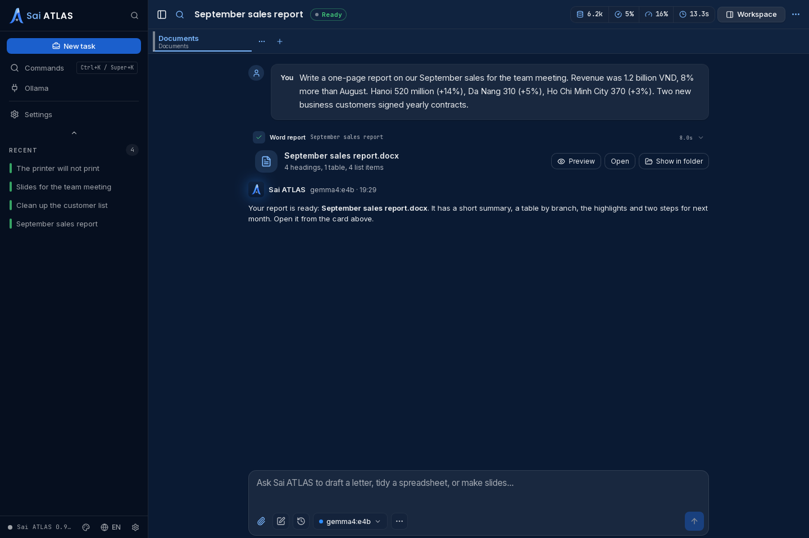
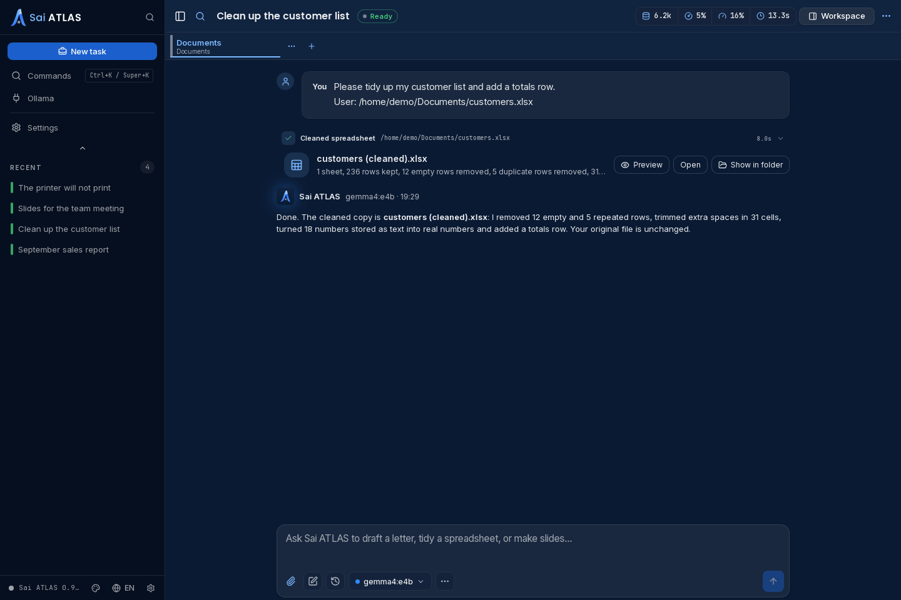
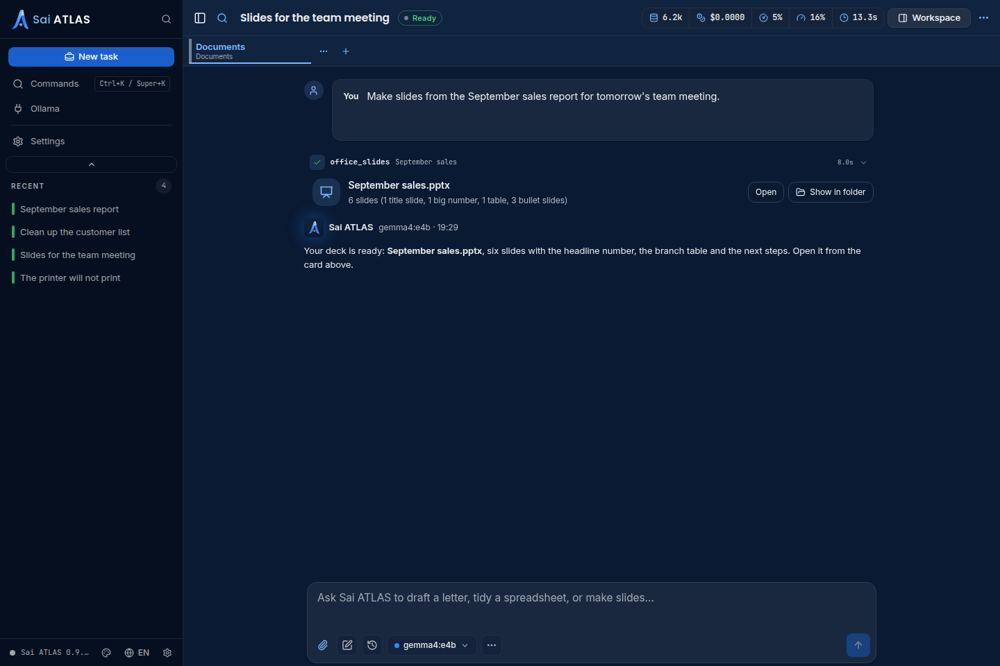

<div align="center">

# Sai ATLAS

**The private AI assistant for everyday work on SAI OS.**

<a href="https://github.com/tung491/oh-my-pi-gui/releases"></a>
<a href="https://github.com/tung491/oh-my-pi-gui/releases"></a>
<a href="./LICENSE"></a>


English · [Tiếng Việt](./README.vi.md) · [Releases](https://github.com/tung491/oh-my-pi-gui/releases)

</div>

---

Your files and conversations stay on this computer. Sai ATLAS goes online only to download models and updates.

Sai ATLAS is an AI assistant for people who want help with ordinary office work, not a tool for programmers. Ask in English or Vietnamese and it answers in the same language.

- **Private.** No account and no sign-in. What you write and the files you work on are not sent anywhere.
- **Local.** The AI model runs on this computer through [Ollama](https://ollama.com). Sai ATLAS uses only an Ollama running on this computer, never one on another machine or a cloud service.
- **Word reports.** Describe a report or paste your notes, and Sai ATLAS writes a Word document (`.docx`).
- **Spreadsheet clean-up.** Give it an Excel, LibreOffice or CSV spreadsheet and it makes a tidy copy: extra spaces, empty and repeated rows and numbers stored as text are fixed, and it can add a totals row. Your original file is never changed.
- **Slides.** Turn a report or an outline into a PowerPoint deck (`.pptx`).
- **Help with your computer.** On SAI OS it checks Wi-Fi, sound, printers, the screen, Bluetooth, storage, Vietnamese typing and updates, explains what it found in plain words, and offers one fix at a time for you to approve.
- **Your work stays yours.** New files go to **Documents > Sai ATLAS**. Sai ATLAS never edits or deletes your own files, and every change it makes to the computer waits for your approval.
- **Ready to install.** Every package carries everything it needs; there is nothing else to set up apart from Ollama.

[Install](#en-install) · [Ollama](#en-ollama) · [Shortcuts](#en-shortcuts) · [Help](#en-help) · [Development](#en-development) · [Releasing](#en-release)

| A Word report | A cleaned spreadsheet | A slide deck |
|---|---|---|
|  |  |  |

The screenshots show the real app with a scripted demonstration conversation; no real documents or accounts were used.

<a id="en-install"></a>
## Install & start

**Documented install baseline: [v0.9.10](https://github.com/nornzach/oh-my-pi-gui/releases/tag/v0.9.10).** Check [Releases](https://github.com/tung491/oh-my-pi-gui/releases) for authoritative current downloads and release notes.

| Mac | v0.9.10 download |
|---|---|
| Apple Silicon | [omp-0.9.10-arm64.dmg](https://github.com/nornzach/oh-my-pi-gui/releases/download/v0.9.10/omp-0.9.10-arm64.dmg) |
| Intel | [omp-0.9.10.dmg](https://github.com/nornzach/oh-my-pi-gui/releases/download/v0.9.10/omp-0.9.10.dmg) |

Sai ATLAS builds on Electron 44 need macOS 13 or later. The updater does not offer them to macOS 12.

| Linux x64 (Ubuntu 24.04+) | Package |
|---|---|
| Debian package (recommended) | `sai-atlas_<version>_amd64.deb` from [Releases](https://github.com/tung491/oh-my-pi-gui/releases) |
| AppImage | `Sai-ATLAS-<version>-x86_64.AppImage` from [Releases](https://github.com/tung491/oh-my-pi-gui/releases) |

On Linux, Sai ATLAS needs Ubuntu 24.04 or later (glibc 2.39). `sudo apt install ./sai-atlas_<version>_amd64.deb` installs the `sai-atlas` launcher at `/usr/bin/sai-atlas` (the agent CLI keeps the name `omp`), the bundled agent at `/usr/lib/Sai ATLAS/omp` (off `PATH`), the `omp://` link handler, and a compatibility link at `/opt/Sai ATLAS/sai-atlas`, the path older versions started from. The package depends on `bubblewrap` and `xdg-dbus-proxy`, which run the WebKit sandbox; the sandbox is always on, and no AppArmor profile is shipped or needed. Registering `omp://` uses `desktop-file-utils` and `xdg-utils`, which `apt install` adds as recommended packages and `dpkg -i` skips. Start it from the app grid or with `sai-atlas /abs/project/dir`. No release has shipped a Linux package under the old name, but if you built and installed the `omp` package from source, remove it first with `sudo apt remove omp`.

In-app `.deb` updates download the package to `~/.cache/@oh-my-pi/omp-gui/updates/`, check its SHA-512 against the release feed, ask for your password once, and install it with `apt-get install --no-remove`. apt resolves the dependencies before it changes anything and never removes other packages to make room. When it cannot resolve them, the installed version stays and the update banner shows the command to run by hand (`sudo apt install <path-to-the-package>`). The SHA-512 check runs as you, and apt then reads the same file as root from that user-writable cache, so another program running as your user could swap the file in between. If that matters to you, install updates by hand with `sudo apt install ./sai-atlas_<version>_amd64.deb`.

For the AppImage, run `chmod +x` on it and start it. It needs `libwebkit2gtk-4.1-0` on the host (stock Ubuntu GNOME desktops have it; otherwise `sudo apt install libwebkit2gtk-4.1-0`), which also brings `bubblewrap` and `xdg-dbus-proxy`. The WebKit sandbox is always on here too and needs no AppArmor profile. Dictation and speech playback reach the microphone and speakers through the PulseAudio socket, which Ubuntu's stock `pipewire-pulse` provides. A started AppImage registers itself as the `omp://` handler when `desktop-file-utils` and `xdg-utils` are installed, and in-app updates replace the file in place. In the AppImage on Ubuntu 26.04, spell checking in text fields does not work; the `.deb` has it.

Sai ATLAS runs natively on Wayland; start it with `GDK_BACKEND=x11 sai-atlas` to use XWayland. On Wayland the compositor decides where each window goes, so the quick-entry bar may not be centred or kept on top. Under XWayland, global shortcuts fire only while a Sai ATLAS window is focused. Startup needs the standard `XDG_RUNTIME_DIR` (`/run/user/<uid>`), which every desktop login session sets; the WebKit sandbox cannot start without it.

Input methods: if Vietnamese input through ibus or fcitx5 does not work in the composer or the quick-entry bar on native Wayland, start Sai ATLAS with `GDK_BACKEND=x11`.

**Migrating from 0.9.16 on Linux.** Linux builds now run on Tauri and the system's WebKitGTK instead of Electron, and 0.9.16 moves to them through its own updater. Settings and sessions carry over.

- Updating from 0.9.16 on a desktop without GNOME, or any machine where `dpkg -s libwebkit2gtk-4.1-0` fails: run `sudo apt install libwebkit2gtk-4.1-0` first.
- If Sai ATLAS is missing after the update: `sudo apt --fix-broken install`, or download the package and run `sudo apt install ./sai-atlas_0.9.17_amd64.deb`.
- If Sai ATLAS does not reopen by itself after an update, start the new `.AppImage` once by hand; its file name now carries the version.
- The first start after the update shows the local-model welcome screen once more; what you choose there is remembered from then on.
- Replace `--ozone-platform=x11` in launchers and scripts with the environment variable `GDK_BACKEND=x11`. The copy that reopens by itself after the update can take its environment from your systemd user session rather than from a terminal.
- The AppImage no longer needs the `sai-atlas-appimage` AppArmor profile. Unload it, then delete it: `sudo apparmor_parser -R /etc/apparmor.d/sai-atlas-appimage && sudo rm /etc/apparmor.d/sai-atlas-appimage` (reloading AppArmor alone does not unload a deleted profile). Remove an older `omp-appimage` profile the same way.

Open the DMG and drag **Sai ATLAS** into **Applications**. The build is ad-hoc signed but not notarized. If macOS blocks the first launch, use **right-click → Open**, or **System Settings → Privacy & Security → Open Anyway**, after confirming the download's source.

**Coming from omp 0.9.x on a Mac?** Sai ATLAS installs beside `omp.app` instead of replacing it. Quit omp, install Sai ATLAS, then move `omp.app` to the Trash and pin Sai ATLAS in the Dock again. macOS asks for microphone and notification access again, because the app id is now `vn.io.vif.saiatlas`. Settings and sessions carry over.

<a id="en-ollama"></a>
## Ollama and your first task

Sai ATLAS runs its models locally through [Ollama](https://ollama.com), so install Ollama first. On the first launch a welcome screen shows this machine's memory and graphics, whether Ollama is running, and up to three Gemma 4 models (E2B, E4B and 26B A4B, labelled minimal, recommended and maximum) picked to fit this machine.

- **Ollama not running or not installed:** on Linux the screen shows the exact command and runs it after the system password prompt, either **Start Ollama** (restarts `ollama.service`) or **Install Ollama** (the official `ollama.com/install.sh` installer). On macOS it links to ollama.com/download; start Ollama, then choose **Check again**.
- **Ollama stays offline:** on Linux, installing or starting Ollama from the welcome screen also sets `OLLAMA_NO_CLOUD=1` for the Ollama service (in `/etc/systemd/system/ollama.service.d/sai-atlas.conf`), which turns off Ollama's cloud models and its background check with ollama.com. To do the same for an Ollama that is already running, run `sudo systemctl edit ollama.service`, add `Environment="OLLAMA_NO_CLOUD=1"` under `[Service]`, then run `sudo systemctl restart ollama.service`.
- **Download** a model on its card and watch the progress bar. **Cancel** stops the download, and a later **Download** resumes it.
- **Get started** makes the chosen model the default for this and new sessions. **Set up later** closes the screen until the next launch; **Run setup again** in the Ollama window reopens it.

Ollama follows `OLLAMA_BASE_URL` or `OLLAMA_HOST` when set, the same rule the agent uses. The address must point at this computer (`127.0.0.1`, `localhost` or `::1`); with an Ollama on another machine, no model is listed and the model chooser says Sai ATLAS only uses Ollama running on this computer.

1. **Get a local model:** finish the welcome screen, or open **Ollama** from the sidebar to download a model and choose **Use as default**.
2. **Start a task:** choose **New task** in the sidebar, or pick one of the suggestions on the empty screen: a Word report, a spreadsheet clean-up, slides from a report, or help with your computer.
3. **Attach a file** when the job needs one, such as the spreadsheet to clean or the report to turn into slides, and say what you want in your own words.
4. **Approve the steps:** Sai ATLAS asks before it creates a file or changes a setting. When it is done, open the result from the card in the conversation.

<a id="en-shortcuts"></a>
## Keyboard shortcuts

| Shortcut | Action |
|---|---|
| `⌘T` | New tab |
| `⌘N` | New session |
| `⌘K` | Command palette |
| `⌘,` | Settings |
| `⌘/` | List every shortcut |
| `⌘B` / `⌘J` | Toggle sidebars |
| `⇧⌘O` | Show or hide the window |
| `⌃⇧Space` (macOS) / `Ctrl+Shift+Space` | Quick entry: ask from any app (rebindable, can be turned off) |
| `Esc` | Close the open dialog, or stop the running answer |

On Linux, ⌘ shortcuts use Ctrl and show as text (`Ctrl+T`, `Ctrl+K`). Change any of them in Settings → Keyboard Shortcuts.

**Quick entry** opens a small bar over whatever app you are in. Type and press Enter: the message starts a new task in the main window, which comes to the front. Shift+Enter adds a line. Esc or clicking away closes the bar and keeps the draft. A message that cannot be delivered, for example when too many tabs are open, stays in the bar with the reason.

On GNOME Wayland with the `.deb`, the first launch asks you to allow both global shortcuts. GNOME then owns the keys: change or remove them in Settings → Apps → Sai ATLAS → Global Shortcuts. A chord changed in Sai ATLAS applies after a restart, when GNOME asks again; turning quick entry off takes effect at once. Without the portal (an AppImage without desktop integration, wlroots compositors such as Sway, or a declined dialog), bind `sai-atlas --quick-entry` as a custom keyboard shortcut, or the AppImage's path followed by `--quick-entry` for the AppImage; on Sway, `bindsym ctrl+shift+space exec sai-atlas --quick-entry`.

<a id="en-help"></a>
## Troubleshooting

| Symptom | What to check |
|---|---|
| No model is listed | Check that Ollama runs on this computer and has a model (`ollama list`). Sai ATLAS ignores an Ollama on another machine, even when `OLLAMA_HOST` points at it. |
| macOS blocks the first launch | Confirm the download came from the release page, then right-click → Open or use Privacy & Security → Open Anyway. The baseline build is ad-hoc signed, not notarized. |
| `Built-in omp not found` | In a source checkout, build the sidecar or supply a compatible prebuilt one. In an installed app, reinstall the correct official DMG; a separate system `omp` will not fix a missing bundle resource. |
| `build:omp` cannot find the monorepo | Put the GUI checkout at the monorepo's `packages/gui/`, alongside `packages/coding-agent/` and `packages/natives/`. |
| `replacing stale addon … version sentinel ≠ …` | Informational: the builder detected and replaced a mismatched native addon. |
| Native addon download fails | Check registry access and whether that version is published. If necessary, from the monorepo root run `bun --cwd=packages/natives run build` with the required Rust toolchain, then rebuild the sidecar. |
| Intel sidecar exits immediately | Check the sidecar architecture and package with `bun run package:mac:x64`, not the default config. |
| The AppImage exits at once, naming a missing library such as `libEGL.so.1` | Install `libwebkit2gtk-4.1-0`. The AppImage relies on the graphics libraries and sandbox tools that package brings. |
| Startup fails with `Failed to fully launch dbus-proxy` | Start Sai ATLAS from a desktop login session, which sets `XDG_RUNTIME_DIR=/run/user/<uid>`; shells opened with `su`, remote logins and cron jobs often lack it. |
| `bun run dev` exits with `The SUID sandbox helper binary was found, but is not configured correctly` | Ubuntu 24.04+ restricts unprivileged user namespaces. Install the `omp-dev-electron` profile from [Daily development](#daily-development). Do not make `chrome-sandbox` setuid root. |
| No tray icon on Ubuntu | Enable the Ubuntu AppIndicators extension. |
| A `.deb` update says Sai ATLAS can't ask for administrator access | The running copy was started in a way that blocks the password prompt, for example by the previous version's updater. Quit and reopen Sai ATLAS, then install again; the update downloads again. |
| A `.deb` update shows a `sudo apt install …` command instead of installing | apt could not resolve the packages the update needs, so nothing changed. Run the command in a terminal to see why and install it. |
| Quick entry or `Ctrl+Shift+O` does nothing while another app is focused | On GNOME Wayland, use the `.deb` and allow the shortcuts when asked; if you declined, allow or reset them in Settings → Apps → Sai ATLAS. Without the portal, bind `sai-atlas --quick-entry` as a custom shortcut. Settings → Keyboard Shortcuts shows the quick-entry status, and a refused registration is logged to `~/.config/@oh-my-pi/omp-gui/logs/gui-runtime.jsonl`. |

<a id="en-development"></a>
## Development

<details>
<summary><b>Build, test, and reproduce the screenshots</b> — people who install a package do not need these steps</summary>

### Repository boundaries

This is a **separate repository nested inside a monorepo**, not an ordinary monorepo package:

```text
omp-monorepo/                    # nornzach/oh-my-pi: fork and sidecar build source
├── .git/
├── packages/coding-agent/
├── packages/natives/
└── packages/gui/                # tung491/oh-my-pi-gui: this product repository
    ├── .git/
    ├── src/
    └── resources/omp*           # ignored, locally built sidecars
```

| Repository | Responsibility |
|---|---|
| [`tung491/oh-my-pi-gui`](https://github.com/tung491/oh-my-pi-gui) | GUI code, commits, tags, and releases. GUI work goes to this repository's `origin/main`. |
| [`nornzach/oh-my-pi`](https://github.com/nornzach/oh-my-pi) | Enclosing monorepo fork: agent source, upstream sync, and sidecar builds. Agent changes are committed here and pushed to its `origin`. |
| [`can1357/oh-my-pi`](https://github.com/can1357/oh-my-pi) | Upstream feature source, fetched through the monorepo's `upstream` remote. **Never push here.** |

Never stage `packages/gui/` into the monorepo: its untracked status there is intentional. Git commands inside `packages/gui/` act on the GUI repository; run monorepo Git commands at the monorepo root. Read [AGENTS.md](./AGENTS.md) before making changes.

### Build from source

**Prerequisites:** Git and [Bun](https://bun.sh) **≥ 1.4**. macOS is required for the macOS sidecar and DMG commands. Linux x64 packages build on a Linux x64 host with Docker.

```bash
# Clone the monorepo fork, then nest the GUI repository inside it.
git clone https://github.com/nornzach/oh-my-pi.git omp-monorepo
cd omp-monorepo
git remote add upstream https://github.com/can1357/oh-my-pi.git
bun install
git clone https://github.com/tung491/oh-my-pi-gui.git packages/gui
cd packages/gui
bun install
```

Run the following from `packages/gui/`:

```bash
bun run build                                  # main + preload + renderer -> out/
bun run build:omp                              # arm64 host -> resources/omp
bun run build:omp:x64                          # Intel -> resources/omp.x64
bun run package:mac:arm64 -- --publish never    # dist/Sai-ATLAS-<version>-arm64.dmg, .zip, latest-mac.yml
bun run package:mac:x64 -- --publish never      # dist/Sai-ATLAS-<version>.dmg, .zip, latest-mac.yml
bun run build:omp:linux                        # Linux x64 -> resources/omp.linux-x64
bun run package:linux                           # AppImage + .deb -> src-tauri/target-linux-2404/x86_64-unknown-linux-gnu/release/bundle/
```

Linux packages are built from the Tauri shell in `src-tauri/`. `package:linux` runs `scripts/tauri-linux-build.sh`, which builds the AppImage and the `.deb` inside an `ubuntu:24.04` container, so the libraries the AppImage bundles need no newer glibc than Ubuntu 24.04's; the finalize scripts in `src-tauri/linux/` refuse anything newer. It stages `resources/omp.linux-x64` as the bundled agent (`scripts/stage-tauri-sidecar.ts`). The update feed `latest-linux.yml` is written at release time by `scripts/release-feeds.ts`. On a Linux host, `bun run build:omp` writes `resources/omp` for `bun run dev` and `bun run dev:tauri`.

To build or run the Tauri shell on the host (`bun run dev:tauri`, the Rust tests), install rustup without letting it edit `PATH` (scripts read cargo from `~/.cargo/bin`, see `scripts/rust-pins.env`, because a distro `cargo` can shadow it), the toolchain channel in `src-tauri/rust-toolchain.toml`, `tauri-cli` 2, and the WebKitGTK build and sandbox packages that CI's `tauri-linux` job also installs:

```bash
curl --proto '=https' --tlsv1.2 -sSf https://sh.rustup.rs | sh -s -- -y --no-modify-path
~/.cargo/bin/rustup default stable
~/.cargo/bin/cargo install tauri-cli --version "^2" --locked
sudo apt-get install -y libwebkit2gtk-4.1-dev libjavascriptcoregtk-4.1-dev libsoup-3.0-dev librsvg2-dev libgtk-3-dev libayatana-appindicator3-dev libxdo-dev build-essential gstreamer1.0-pipewire gstreamer1.0-plugins-good bubblewrap xdg-dbus-proxy
```

To try Wayland global shortcuts from `bun run dev:tauri` or `bun run dev`, the portal needs a desktop entry for the app id: create `~/.local/share/applications/vn.io.vif.saiatlas.desktop` with `Name=Sai ATLAS` and an `Exec=` line that runs your dev launcher. It shadows the `.deb`'s entry of the same id, so delete it before testing an installed `.deb`.

Inside the monorepo, `bun install` resolves `packages/gui` as a workspace member and never updates this repository's `bun.lock`, which CI installs with `--frozen-lockfile`. After changing dependencies in `package.json`, regenerate the lockfile from a checkout outside the monorepo, for example `git worktree add --detach /tmp/omp-gui-lock HEAD`, then `bun install --ignore-scripts` there, and copy its `bun.lock` back.

`build:omp` compiles the neighboring monorepo agent source and embeds the native addon. It stages the matching `pi_natives` version, downloads the published package when needed, replaces stale addons, and restores temporary staging afterwards. Sidecars at `resources/omp*` are ignored build artifacts: **never commit them**.

Packaging rebuilds the Electron app, **not the agent sidecar**. Re-run the matching `build:omp*` after agent/RPC changes or upstream updates. The arm64 config uses `resources/omp`; the Intel config uses `resources/omp.x64`. Always use `package:mac:x64` for Intel—using the default config can package the wrong architecture.

**A standalone GUI clone cannot compile the sidecar.** It must occupy `packages/gui/` in the layout above. For artifact assembly without monorepo sources, supply trusted, compatible prebuilt sidecars at `resources/omp` and/or `resources/omp.x64`, then run `build` and the matching packaging command. A packaged app uses its bundled agent; installing a system `omp` is not a fallback for a missing sidecar.

### Daily development

```bash
bun run dev                         # HMR, using resources/omp
OMP_SIDECAR=source bun run dev       # explicit dev override: monorepo agent source
bun run dev:tauri -- --user-data-dir=$(mktemp -d)   # Tauri shell (Linux), throwaway profile
bunx vitest run                     # GUI tests
bun run check:types                 # GUI type checks
bun run build                      # production GUI build and main-bundle check
```

Run Biome on touched supported files as well. Changes to agent/RPC code belong in the monorepo and require rebuilding the bundled sidecar before validating a packaged GUI.

On Ubuntu 24.04+, Electron's `bun run dev` needs a `userns` AppArmor profile for the dev Electron binary, because Ubuntu restricts unprivileged user namespaces; `bun run dev:tauri` needs none. Save this as `omp-dev-electron`, with the path printed by `node -p "require('electron')"`, and load it with `sudo install -m 0644 omp-dev-electron /etc/apparmor.d/omp-dev-electron && sudo apparmor_parser -r /etc/apparmor.d/omp-dev-electron`. Do not make `chrome-sandbox` setuid root.

```
abi <abi/4.0>,
include <tunables/global>

profile omp-dev-electron "/path/printed/by/node" flags=(unconfined) {
  userns,

  include if exists <local/omp-dev-electron>
}
```

### Reproduce the screenshots

From the GUI repository, after installing its dependencies:

```bash
bun run build
scripts/virtual-display.sh run -- bun scripts/capture-showcase.ts
```

The capture script renders the real Electron GUI with a fresh temporary HOME and profile and a scripted stand-in for the agent, so **no live model, credentials or personal files are used**. It plays three office tasks (a Word report, a spreadsheet clean-up and a slide deck) and writes the shots to the `en` and `vi` folders under `docs/screenshots`. The conversations are demonstration data, not real model output.

Optional environment variables: `SHOWCASE_THEME=light` captures the VIF Light theme instead of the default dark theme, `SHOWCASE_OUT=<dir>` writes to `<dir>/en` and `<dir>/vi` instead of `docs/screenshots`, and `SHOWCASE_ONBOARDING=1` also captures the first-run welcome screen as `00-onboarding.png`. On Linux the script passes the display variables (`DISPLAY`, `WAYLAND_DISPLAY`, `XDG_RUNTIME_DIR`, `XAUTHORITY`) through to Electron.

</details>

<a id="en-release"></a>
## Release process (maintainers)

<details>
<summary><b>Sync, build all targets, smoke-test the installers, then publish</b></summary>

Releases belong only to [`tung491/oh-my-pi-gui`](https://github.com/tung491/oh-my-pi-gui/releases). Preserve the two-repository boundary throughout:

1. **Start with clean checkouts and sync upstream.** From the **monorepo root**, run `bash packages/gui/scripts/sync-upstream.sh`. It fetches/merges `upstream/main`, installs dependencies, re-provisions natives, generates the statistics assets, rebuilds/smoke-tests the sidecar, and builds/checks/tests the GUI. If there are conflicts, resolve and commit the monorepo merge, then run `SKIP_MERGE=1 bash packages/gui/scripts/sync-upstream.sh`. Do not substitute a hand-rolled merge. Review and commit any remaining monorepo changes there; push them only to the fork's `origin`.
2. **Prepare the GUI release.** In `packages/gui/`, bump `package.json` and `src-tauri/Cargo.toml` to the same version (a packaging test fails when they differ), write the release's `CHANGELOG.md` entry, and update the install links and release notes in both `README.md` and `README.vi.md`.
3. **Verify the GUI:** `bunx vitest run && bun run check:types && bun run build`; check touched supported files with Biome.
4. **Record the release source.** Commit GUI release changes in the GUI repository, tag `vX.Y.Z`, and push `main` plus the tag to its `origin`. Keep both checkouts clean before producing release artifacts.
5. **Build all sidecars:** `bun run build:omp && bun run build:omp:x64`. Run each macOS sidecar's `--smoke-test` on a compatible Mac. On a Linux x64 host, run `bun run build:omp:linux` and `resources/omp.linux-x64 --smoke-test`. Cross-compilation alone is not runtime verification.
6. **Build and inspect installers:** build both DMGs with the macOS commands. Mount each DMG; verify its app seal with `codesign --verify --deep --strict --verbose=2 "<path-to-Sai ATLAS.app>"` and its bundled sidecar architecture with `file "<path-to-Sai ATLAS.app>/Contents/Resources/omp"`. On compatible hosts, launch each package, confirm sidecar `ready`, a successful `get_settings` RPC, and a settings toggle that persists. On macOS, also check that the Dock, About and menu names read Sai ATLAS, that `codesign -dv` shows `Identifier=vn.io.vif.saiatlas`, and that Finder shows the app icon (electron-builder converts it from the PNG). On Linux x64, run `bun run package:linux` with `SAI_ATLAS_UPDATE_BASE` unset, so the binaries read this repository's release feed. Then run `bash scripts/tauri-deb-smoke.sh <deb>`, which installs the `.deb` in a clean Ubuntu 24.04 container and runs `e2e-tauri/packaged-smoke.e2e.ts` against it there, `OMP_E2E_FAKE_MIC=1 bash scripts/tauri-deb-smoke.sh <deb>` for the microphone and playback probe, and `bash scripts/tauri-wm-geometry-check.sh <deb>` (Docker required for all three). Then install the `.deb` and the AppImage on the host. On each package, press the quick-entry chord and send one prompt.
7. **Publish only verified artifacts.** Run `bun scripts/release-feeds.ts --version <version> --linux <bundle-dir> --electron-mac-feed <dir>/latest-mac.yml`: it copies the Linux bundles into `dist-release/` under their published names, writes `latest-linux.yml` for both packages, and copies the Electron feed with the files it lists. Create the GitHub Release as a draft, upload every asset, then publish; a release missing an asset breaks update checks. Publish it with both DMGs, the Linux AppImage and `.deb` with `latest-linux.yml` (without it, Linux update checks fail), generated update metadata, and the changelog. **Until 1.0.0, every release also carries bridge copies:** byte-identical copies of the two DMGs named `omp-<version>-arm64.dmg` and `omp-<version>.dmg`, listed next to the Sai-ATLAS names in the combined `latest-mac.yml`. Macs on 0.9.x look only for the `omp-` names and otherwise report the installer missing. The combined `latest-mac.yml` must also carry `minimumSystemVersion: 22.0.0` (Darwin 22 is macOS 13; electron-builder does not write it), and `bun run check:mac-update-floor <path-to-latest-mac.yml>` must pass before you publish; the release body says the previous release is the last one for macOS 12. Those Macs keep `omp.app` after installing, and their update screen never shows release notes, so put the Mac migration steps from [Install & start](#en-install) (quit omp, install Sai ATLAS, trash `omp.app`, re-pin, grant access again) at the top of every release body until 1.0.0. Record the monorepo commit used for the sidecars, especially when it differs from upstream `main`. Never commit sidecar binaries or push to `upstream`.

</details>
