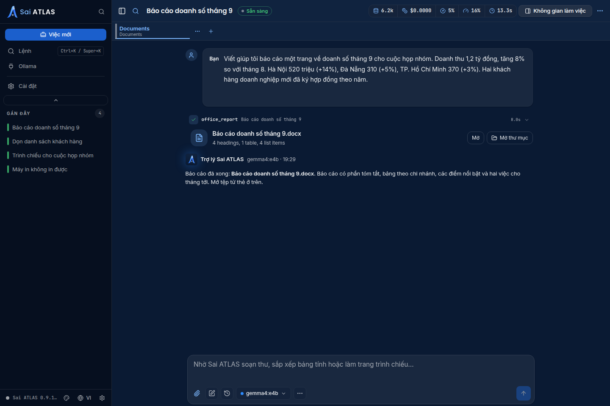
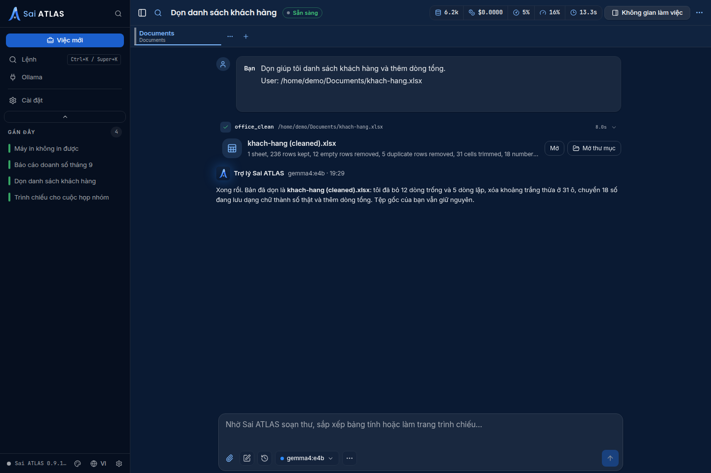
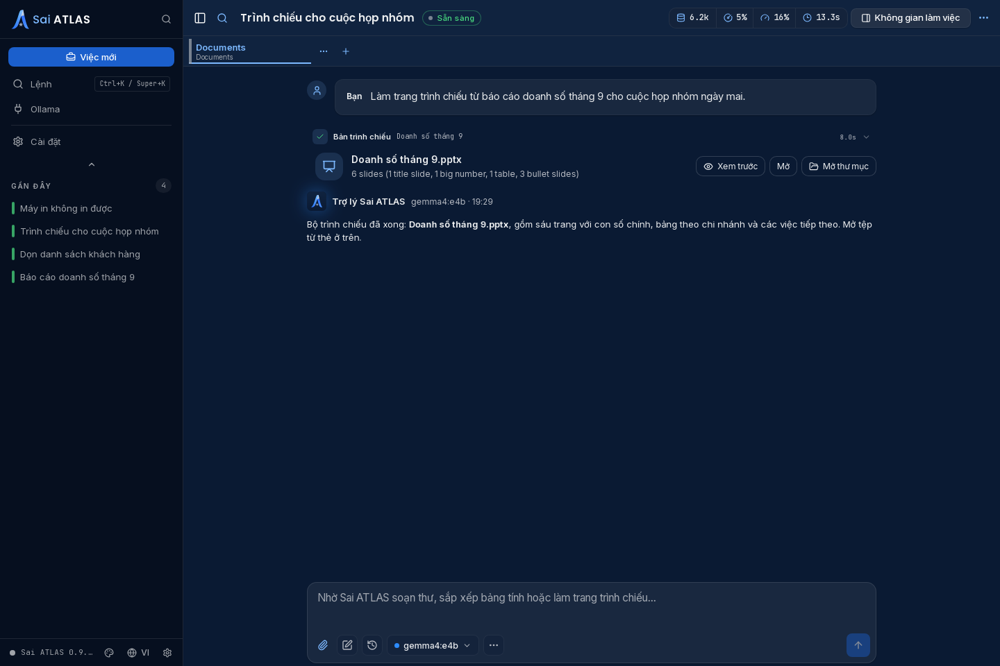

<div align="center">

# Sai ATLAS

**Trợ lý AI riêng tư cho công việc hằng ngày trên SAI OS.**

<a href="https://github.com/tung491/oh-my-pi-gui/releases"></a>
<a href="https://github.com/tung491/oh-my-pi-gui/releases"></a>
<a href="./LICENSE"></a>


[English](./README.md) · Tiếng Việt · [Bản phát hành](https://github.com/tung491/oh-my-pi-gui/releases)

</div>

---

Tệp và cuộc trò chuyện của bạn luôn ở trên máy tính này. Sai ATLAS chỉ kết nối mạng để tải mô hình và bản cập nhật.

Sai ATLAS là trợ lý AI giúp bạn làm những việc văn phòng thường ngày, không phải công cụ dành cho lập trình viên. Bạn hỏi bằng tiếng Việt hay tiếng Anh, Sai ATLAS trả lời bằng đúng ngôn ngữ đó.

- **Riêng tư.** Không cần tài khoản, không cần đăng nhập. Những gì bạn viết và các tệp bạn làm việc không được gửi đi đâu cả.
- **Chạy ngay trên máy.** Mô hình AI chạy trên máy tính này qua [Ollama](https://ollama.com). Sai ATLAS chỉ dùng Ollama chạy trên máy tính này, không bao giờ dùng Ollama trên máy khác hay dịch vụ đám mây.
- **Báo cáo Word.** Mô tả bản báo cáo hoặc dán ghi chú của bạn, Sai ATLAS sẽ viết thành tài liệu Word (`.docx`).
- **Dọn dẹp bảng tính.** Đưa cho Sai ATLAS một bảng tính Excel, LibreOffice hoặc CSV, nó sẽ tạo một bản sao gọn gàng: bỏ khoảng trắng thừa, bỏ dòng trống và dòng lặp, sửa số bị lưu thành chữ, và có thể thêm dòng tổng. Tệp gốc của bạn không bao giờ bị thay đổi.
- **Trang trình chiếu.** Biến một bản báo cáo hoặc dàn ý thành bộ trình chiếu PowerPoint (`.pptx`).
- **Hỗ trợ máy tính.** Trên SAI OS, Sai ATLAS kiểm tra Wi-Fi, âm thanh, máy in, màn hình, Bluetooth, dung lượng ổ đĩa, gõ tiếng Việt và cập nhật, giải thích kết quả bằng lời dễ hiểu, rồi đề xuất từng cách sửa một để bạn đồng ý.
- **Công việc của bạn là của bạn.** Tệp mới được lưu vào **Tài liệu > Sai ATLAS** (Documents > Sai ATLAS). Sai ATLAS không bao giờ sửa hay xóa tệp của bạn, và mọi thay đổi trên máy đều chờ bạn đồng ý.
- **Cài là dùng.** Mỗi gói cài đặt đã có sẵn mọi thứ cần thiết; ngoài Ollama, bạn không phải cài thêm gì.

[Cài đặt](#vi-install) · [Ollama](#vi-ollama) · [Phím tắt](#vi-shortcuts) · [Khắc phục sự cố](#vi-help) · [Phát triển](#vi-development) · [Phát hành](#vi-release)

| Báo cáo Word | Bảng tính đã dọn | Bộ trình chiếu |
|---|---|---|
|  |  |  |

Ảnh chụp là ứng dụng thật với một cuộc trò chuyện minh họa được dựng sẵn; không dùng tài liệu hay tài khoản thật nào.

<a id="vi-install"></a>
## Cài đặt và bắt đầu

**Bản cài đặt được mô tả ở đây: [v0.9.10](https://github.com/nornzach/oh-my-pi-gui/releases/tag/v0.9.10).** Xem [Bản phát hành](https://github.com/tung491/oh-my-pi-gui/releases) để có bản tải và ghi chú phát hành mới nhất.

| Mac | Tải v0.9.10 |
|---|---|
| Apple Silicon | [omp-0.9.10-arm64.dmg](https://github.com/nornzach/oh-my-pi-gui/releases/download/v0.9.10/omp-0.9.10-arm64.dmg) |
| Intel | [omp-0.9.10.dmg](https://github.com/nornzach/oh-my-pi-gui/releases/download/v0.9.10/omp-0.9.10.dmg) |

Các bản Sai ATLAS dựng trên Electron 44 cần macOS 13 trở lên. Trình cập nhật không đưa các bản này cho macOS 12.

| Linux x64 (Ubuntu 24.04+) | Gói cài đặt |
|---|---|
| Gói Debian (khuyên dùng) | `sai-atlas_<version>_amd64.deb` trong [Bản phát hành](https://github.com/tung491/oh-my-pi-gui/releases) |
| AppImage | `Sai-ATLAS-<version>-x86_64.AppImage` trong [Bản phát hành](https://github.com/tung491/oh-my-pi-gui/releases) |

Trên Linux, Sai ATLAS cần Ubuntu 24.04 trở lên (glibc 2.39). Lệnh `sudo apt install ./sai-atlas_<version>_amd64.deb` cài trình khởi chạy `sai-atlas` tại `/usr/bin/sai-atlas` (công cụ dòng lệnh của agent vẫn tên là `omp`), agent đi kèm tại `/usr/lib/Sai ATLAS/omp` (không nằm trong `PATH`), trình xử lý liên kết `omp://`, và một liên kết tương thích tại `/opt/Sai ATLAS/sai-atlas`, đường dẫn mà các phiên bản cũ khởi động. Gói phụ thuộc vào `bubblewrap` và `xdg-dbus-proxy`, hai gói chạy hộp cát (sandbox) của WebKit; hộp cát luôn bật và không cần hồ sơ AppArmor nào. Việc đăng ký `omp://` dùng `desktop-file-utils` và `xdg-utils`, được `apt install` cài thêm như gói khuyến nghị còn `dpkg -i` thì bỏ qua. Mở ứng dụng từ lưới ứng dụng hoặc bằng `sai-atlas /đường/dẫn/thư/mục`. Chưa bản phát hành nào có gói Linux dưới tên cũ, nhưng nếu bạn đã tự dựng và cài gói `omp` từ mã nguồn, hãy gỡ nó trước bằng `sudo apt remove omp`.

Khi cập nhật gói `.deb` ngay trong ứng dụng, gói được tải về `~/.cache/@oh-my-pi/omp-gui/updates/`, kiểm tra SHA-512 theo nguồn cập nhật của bản phát hành, hỏi mật khẩu của bạn một lần, rồi cài bằng `apt-get install --no-remove`. apt giải quyết các gói phụ thuộc trước khi thay đổi bất cứ thứ gì và không bao giờ gỡ gói khác để lấy chỗ. Nếu không giải quyết được, phiên bản đang cài được giữ nguyên và thanh cập nhật hiện lệnh để bạn tự chạy (`sudo apt install <đường-dẫn-tới-gói>`). Bước kiểm tra SHA-512 chạy dưới tài khoản của bạn, sau đó apt đọc lại chính tệp đó với quyền root từ thư mục bộ nhớ đệm mà tài khoản của bạn ghi được, nên một chương trình khác chạy dưới tài khoản của bạn có thể tráo tệp ở giữa hai bước. Nếu điều đó quan trọng với bạn, hãy tự cài bản cập nhật bằng `sudo apt install ./sai-atlas_<version>_amd64.deb`.

Với AppImage, chạy `chmod +x` cho tệp rồi mở nó. AppImage cần `libwebkit2gtk-4.1-0` trên máy (Ubuntu GNOME mặc định đã có; nếu chưa, chạy `sudo apt install libwebkit2gtk-4.1-0`), gói này cũng kéo theo `bubblewrap` và `xdg-dbus-proxy`. Hộp cát WebKit ở đây cũng luôn bật và không cần hồ sơ AppArmor. Đọc chính tả và phát giọng nói dùng micro và loa qua socket PulseAudio do `pipewire-pulse` mặc định của Ubuntu cung cấp. AppImage khi chạy sẽ tự đăng ký làm trình xử lý `omp://` nếu đã cài `desktop-file-utils` và `xdg-utils`, và bản cập nhật trong ứng dụng thay tệp tại chỗ. Trong AppImage trên Ubuntu 26.04, kiểm tra chính tả trong ô nhập không hoạt động; gói `.deb` thì có.

Sai ATLAS chạy trực tiếp trên Wayland; mở bằng `GDK_BACKEND=x11 sai-atlas` để dùng XWayland. Trên Wayland, trình quản lý cửa sổ tự quyết định vị trí từng cửa sổ, nên thanh nhập nhanh có thể không nằm giữa màn hình hoặc không luôn ở trên cùng. Dưới XWayland, phím tắt toàn cục chỉ hoạt động khi một cửa sổ Sai ATLAS đang được chọn. Khi khởi động cần biến chuẩn `XDG_RUNTIME_DIR` (`/run/user/<uid>`), mọi phiên đăng nhập màn hình đều đặt biến này; thiếu nó thì hộp cát WebKit không khởi động được.

Bộ gõ: nếu gõ tiếng Việt qua ibus hoặc fcitx5 không hoạt động trong ô soạn tin hoặc thanh nhập nhanh trên Wayland, hãy mở Sai ATLAS bằng `GDK_BACKEND=x11`.

**Chuyển từ 0.9.16 trên Linux.** Các bản Linux giờ chạy trên Tauri và WebKitGTK của hệ thống thay vì Electron, và 0.9.16 chuyển sang qua trình cập nhật của chính nó. Cài đặt và các phiên làm việc được giữ nguyên.

- Cập nhật từ 0.9.16 trên máy không dùng GNOME, hoặc bất kỳ máy nào mà `dpkg -s libwebkit2gtk-4.1-0` báo lỗi: chạy `sudo apt install libwebkit2gtk-4.1-0` trước.
- Nếu Sai ATLAS biến mất sau khi cập nhật: chạy `sudo apt --fix-broken install`, hoặc tải gói về rồi chạy `sudo apt install ./sai-atlas_0.9.17_amd64.deb`.
- Nếu Sai ATLAS không tự mở lại sau khi cập nhật, hãy tự mở tệp `.AppImage` mới một lần; tên tệp giờ có kèm số phiên bản.
- Lần mở đầu tiên sau khi cập nhật sẽ hiện lại màn hình chào mừng chọn mô hình trên máy một lần nữa; lựa chọn của bạn ở đó được ghi nhớ từ đó về sau.
- Thay `--ozone-platform=x11` trong các trình khởi chạy và script bằng biến môi trường `GDK_BACKEND=x11`. Bản tự mở lại sau khi cập nhật có thể lấy biến môi trường từ phiên systemd của người dùng thay vì từ cửa sổ dòng lệnh.
- AppImage không còn cần hồ sơ AppArmor `sai-atlas-appimage`. Gỡ nạp rồi xóa nó: `sudo apparmor_parser -R /etc/apparmor.d/sai-atlas-appimage && sudo rm /etc/apparmor.d/sai-atlas-appimage` (chỉ nạp lại AppArmor thì không gỡ được hồ sơ đã xóa). Gỡ hồ sơ `omp-appimage` cũ hơn theo cùng cách.

Mở tệp DMG và kéo **Sai ATLAS** vào **Applications**. Bản dựng được ký ad-hoc nhưng chưa được Apple công chứng (notarize). Nếu macOS chặn lần mở đầu tiên, sau khi xác nhận nguồn tải, hãy dùng **chuột phải → Open**, hoặc **System Settings → Privacy & Security → Open Anyway**.

**Chuyển từ omp 0.9.x trên Mac?** Sai ATLAS được cài bên cạnh `omp.app` chứ không thay thế nó. Thoát omp, cài Sai ATLAS, rồi chuyển `omp.app` vào Thùng rác và ghim lại Sai ATLAS vào Dock. macOS sẽ hỏi lại quyền dùng micro và thông báo, vì mã ứng dụng giờ là `vn.io.vif.saiatlas`. Cài đặt và các phiên làm việc được giữ nguyên.

<a id="vi-ollama"></a>
## Ollama và việc đầu tiên

Sai ATLAS chạy mô hình ngay trên máy qua [Ollama](https://ollama.com), vì vậy hãy cài Ollama trước. Ở lần mở đầu tiên, màn hình chào mừng cho biết bộ nhớ và card đồ họa của máy, Ollama có đang chạy hay không, và tối đa ba mô hình Gemma 4 (E2B, E4B và 26B A4B, ghi là tối thiểu, khuyên dùng và tối đa) được chọn cho vừa với máy này.

- **Ollama chưa chạy hoặc chưa được cài:** trên Linux, màn hình hiện đúng lệnh cần chạy và chạy nó sau khi hỏi mật khẩu hệ thống, hoặc **Khởi động Ollama** (`systemctl start ollama.service`) hoặc **Cài đặt Ollama** (trình cài đặt chính thức `ollama.com/install.sh`). Trên macOS, màn hình dẫn tới ollama.com/download; hãy mở Ollama rồi chọn **Kiểm tra lại**.
- Bấm nút tải trên thẻ của một mô hình và theo dõi thanh tiến độ. **Hủy** dừng việc tải, và lần tải sau sẽ tải tiếp.
- **Bắt đầu** đặt mô hình đã chọn làm mặc định cho phiên này và các phiên mới. **Thiết lập sau** đóng màn hình cho tới lần mở sau; **Chạy lại thiết lập** trong cửa sổ Ollama mở lại nó.

Ollama dùng `OLLAMA_BASE_URL` hoặc `OLLAMA_HOST` nếu được đặt, cùng quy tắc với agent. Địa chỉ phải trỏ tới chính máy tính này (`127.0.0.1`, `localhost` hoặc `::1`); nếu Ollama chạy trên máy khác, sẽ không có mô hình nào được liệt kê và ô chọn mô hình cho biết Sai ATLAS chỉ dùng Ollama chạy trên máy tính này.

1. **Có một mô hình trên máy:** hoàn tất màn hình chào mừng, hoặc mở **Ollama** từ thanh bên để tải mô hình và chọn **Đặt làm mặc định**.
2. **Bắt đầu một việc:** chọn **Việc mới** ở thanh bên, hoặc chọn một gợi ý trên màn hình trống: báo cáo Word, dọn dẹp bảng tính, trang trình chiếu từ báo cáo, hoặc hỗ trợ máy tính.
3. **Đính kèm tệp** khi việc cần đến, ví dụ bảng tính cần dọn hoặc báo cáo cần chuyển thành trang trình chiếu, rồi nói điều bạn muốn bằng lời của mình.
4. **Đồng ý từng bước:** Sai ATLAS hỏi trước khi tạo tệp hoặc thay đổi cài đặt. Khi xong, mở kết quả từ thẻ trong cuộc trò chuyện.

<a id="vi-shortcuts"></a>
## Phím tắt

| Phím tắt | Tác dụng |
|---|---|
| `⌘T` | Thẻ mới |
| `⌘N` | Phiên mới |
| `⌘K` | Bảng lệnh |
| `⌘,` | Cài đặt |
| `⌘/` | Xem mọi phím tắt |
| `⌘B` / `⌘J` | Ẩn/hiện thanh bên |
| `⇧⌘O` | Ẩn/hiện cửa sổ |
| `⌃⇧Space` (macOS) / `Ctrl+Shift+Space` | Nhập nhanh: hỏi từ bất kỳ ứng dụng nào (đổi được phím, tắt được) |
| `Esc` | Đóng hộp thoại đang mở, hoặc dừng câu trả lời đang chạy |

Trên Linux, phím ⌘ được thay bằng Ctrl và hiện dưới dạng chữ (`Ctrl+T`, `Ctrl+K`). Đổi bất kỳ phím nào trong Cài đặt → Phím tắt bàn phím.

**Nhập nhanh** mở một thanh nhỏ phía trên ứng dụng bạn đang dùng. Gõ rồi nhấn Enter: tin nhắn bắt đầu một việc mới trong cửa sổ chính, và cửa sổ này hiện lên trước. Shift+Enter xuống dòng. Esc hoặc bấm ra ngoài sẽ đóng thanh và giữ bản nháp. Tin nhắn không gửi được, ví dụ khi đang mở quá nhiều thẻ, vẫn nằm trong thanh kèm lý do.

Trên GNOME Wayland với gói `.deb`, lần mở đầu tiên sẽ hỏi bạn cho phép cả hai phím tắt toàn cục. Sau đó GNOME quản lý các phím này: đổi hoặc bỏ chúng trong Settings → Apps → Sai ATLAS → Global Shortcuts. Phím đổi trong Sai ATLAS có hiệu lực sau khi khởi động lại, khi GNOME hỏi lại; tắt nhập nhanh thì có hiệu lực ngay. Khi không có portal (AppImage chưa tích hợp với màn hình, trình quản lý cửa sổ wlroots như Sway, hoặc bạn đã từ chối hộp thoại), hãy gán `sai-atlas --quick-entry` làm phím tắt tùy chỉnh, hoặc đường dẫn tới AppImage kèm `--quick-entry` nếu dùng AppImage; trên Sway: `bindsym ctrl+shift+space exec sai-atlas --quick-entry`.

<a id="vi-help"></a>
## Khắc phục sự cố

| Hiện tượng | Cần kiểm tra |
|---|---|
| Không có mô hình nào được liệt kê | Kiểm tra Ollama đang chạy trên máy tính này và đã có mô hình (`ollama list`). Sai ATLAS bỏ qua Ollama trên máy khác, kể cả khi `OLLAMA_HOST` trỏ tới nó. |
| macOS chặn lần mở đầu tiên | Xác nhận tệp được tải từ trang phát hành, rồi dùng chuột phải → Open hoặc Privacy & Security → Open Anyway. Bản dựng được ký ad-hoc, chưa được công chứng. |
| `Built-in omp not found` | Trong bản mã nguồn, hãy dựng sidecar hoặc đặt sẵn một sidecar tương thích. Trong ứng dụng đã cài, hãy cài lại đúng tệp DMG chính thức; cài `omp` riêng trên hệ thống không bù được tài nguyên bị thiếu trong gói. |
| `build:omp` không tìm thấy monorepo | Đặt bản GUI tại `packages/gui/` của monorepo, cạnh `packages/coding-agent/` và `packages/natives/`. |
| `replacing stale addon … version sentinel ≠ …` | Chỉ là thông báo: công cụ dựng đã phát hiện và thay một addon gốc không khớp phiên bản. |
| Tải addon gốc thất bại | Kiểm tra quyền truy cập registry và phiên bản đó đã được phát hành chưa. Nếu cần, từ thư mục gốc của monorepo chạy `bun --cwd=packages/natives run build` với bộ công cụ Rust phù hợp, rồi dựng lại sidecar. |
| Sidecar Intel thoát ngay | Kiểm tra kiến trúc của sidecar và đóng gói bằng `bun run package:mac:x64`, không dùng cấu hình mặc định. |
| AppImage thoát ngay, báo thiếu thư viện như `libEGL.so.1` | Cài `libwebkit2gtk-4.1-0`. AppImage dựa vào thư viện đồ họa và công cụ hộp cát mà gói này mang theo. |
| Khởi động lỗi `Failed to fully launch dbus-proxy` | Mở Sai ATLAS từ một phiên đăng nhập màn hình, phiên này đặt `XDG_RUNTIME_DIR=/run/user/<uid>`; cửa sổ dòng lệnh mở bằng `su`, đăng nhập từ xa và tác vụ cron thường thiếu biến này. |
| `bun run dev` thoát với `The SUID sandbox helper binary was found, but is not configured correctly` | Ubuntu 24.04+ hạn chế user namespace không đặc quyền. Cài hồ sơ `omp-dev-electron` trong phần [Phát triển hằng ngày](#phát-triển-hằng-ngày). Không đặt setuid root cho `chrome-sandbox`. |
| Không thấy biểu tượng ở khay hệ thống trên Ubuntu | Bật tiện ích mở rộng Ubuntu AppIndicators. |
| Cập nhật `.deb` báo Sai ATLAS không thể xin quyền quản trị | Bản đang chạy được mở theo cách chặn hộp thoại mật khẩu, ví dụ bởi trình cập nhật của phiên bản trước. Thoát rồi mở lại Sai ATLAS, sau đó cài lại; bản cập nhật sẽ được tải lại. |
| Cập nhật `.deb` hiện lệnh `sudo apt install …` thay vì tự cài | apt không giải quyết được các gói mà bản cập nhật cần, nên chưa có gì thay đổi. Chạy lệnh đó trong cửa sổ dòng lệnh để xem lý do và cài đặt. |
| Nhập nhanh hoặc `Ctrl+Shift+O` không có tác dụng khi đang dùng ứng dụng khác | Trên GNOME Wayland, dùng gói `.deb` và cho phép các phím tắt khi được hỏi; nếu đã từ chối, cho phép hoặc đặt lại chúng trong Settings → Apps → Sai ATLAS. Khi không có portal, gán `sai-atlas --quick-entry` làm phím tắt tùy chỉnh. Cài đặt → Phím tắt bàn phím hiện trạng thái của nhập nhanh, và lần đăng ký bị từ chối được ghi vào `~/.config/@oh-my-pi/omp-gui/logs/gui-runtime.jsonl`. |

<a id="vi-development"></a>
## Phát triển

<details>
<summary><b>Dựng, kiểm thử và chụp lại ảnh màn hình</b> — người chỉ cài gói không cần các bước này</summary>

### Ranh giới kho mã

Đây là **một kho mã riêng nằm lồng trong một monorepo**, không phải một gói thông thường của monorepo:

```text
omp-monorepo/                    # nornzach/oh-my-pi: bản fork và nguồn dựng sidecar
├── .git/
├── packages/coding-agent/
├── packages/natives/
└── packages/gui/                # tung491/oh-my-pi-gui: kho mã của sản phẩm này
    ├── .git/
    ├── src/
    └── resources/omp*           # bị bỏ qua, sidecar dựng tại máy
```

| Kho mã | Trách nhiệm |
|---|---|
| [`tung491/oh-my-pi-gui`](https://github.com/tung491/oh-my-pi-gui) | Mã GUI, commit, tag và bản phát hành. Công việc trên GUI được đẩy lên `origin/main` của kho này. |
| [`nornzach/oh-my-pi`](https://github.com/nornzach/oh-my-pi) | Bản fork monorepo bao ngoài: mã nguồn agent, đồng bộ upstream và dựng sidecar. Thay đổi của agent được commit ở đây và đẩy lên `origin` của nó. |
| [`can1357/oh-my-pi`](https://github.com/can1357/oh-my-pi) | Nguồn tính năng upstream, lấy về qua remote `upstream` của monorepo. **Không bao giờ đẩy lên đây.** |

Không bao giờ đưa `packages/gui/` vào monorepo: việc nó không được monorepo theo dõi là có chủ ý. Lệnh Git chạy trong `packages/gui/` tác động lên kho GUI; chạy lệnh Git của monorepo ở thư mục gốc monorepo. Đọc [AGENTS.md](./AGENTS.md) trước khi thay đổi.

### Dựng từ mã nguồn

**Yêu cầu:** Git và [Bun](https://bun.sh) **≥ 1.4**. Cần macOS để dựng sidecar và DMG cho macOS. Gói Linux x64 được dựng trên máy Linux x64 có Docker.

```bash
# Clone bản fork monorepo, rồi đặt kho GUI lồng bên trong.
git clone https://github.com/nornzach/oh-my-pi.git omp-monorepo
cd omp-monorepo
git remote add upstream https://github.com/can1357/oh-my-pi.git
bun install
git clone https://github.com/tung491/oh-my-pi-gui.git packages/gui
cd packages/gui
bun install
```

Chạy các lệnh sau trong `packages/gui/`:

```bash
bun run build                                  # main + preload + renderer -> out/
bun run build:omp                              # máy arm64 -> resources/omp
bun run build:omp:x64                          # Intel -> resources/omp.x64
bun run package:mac:arm64 -- --publish never    # dist/Sai-ATLAS-<version>-arm64.dmg, .zip, latest-mac.yml
bun run package:mac:x64 -- --publish never      # dist/Sai-ATLAS-<version>.dmg, .zip, latest-mac.yml
bun run build:omp:linux                        # Linux x64 -> resources/omp.linux-x64
bun run package:linux                           # AppImage + .deb -> src-tauri/target-linux-2404/x86_64-unknown-linux-gnu/release/bundle/
```

Gói Linux được dựng từ vỏ Tauri trong `src-tauri/`. `package:linux` chạy `scripts/tauri-linux-build.sh`, dựng AppImage và `.deb` bên trong một container `ubuntu:24.04`, nên các thư viện AppImage mang theo không cần glibc mới hơn của Ubuntu 24.04; các script hoàn thiện trong `src-tauri/linux/` từ chối mọi thứ mới hơn. Script đặt `resources/omp.linux-x64` làm agent đi kèm (`scripts/stage-tauri-sidecar.ts`). Nguồn cập nhật `latest-linux.yml` được `scripts/release-feeds.ts` ghi lúc phát hành. Trên máy Linux, `bun run build:omp` ghi `resources/omp` cho `bun run dev` và `bun run dev:tauri`.

Để dựng hoặc chạy vỏ Tauri trên máy (`bun run dev:tauri`, các bài kiểm thử Rust), hãy cài rustup mà không để nó sửa `PATH` (các script đọc cargo từ `~/.cargo/bin`, xem `scripts/rust-pins.env`, vì `cargo` của bản phân phối có thể che mất nó), kênh toolchain trong `src-tauri/rust-toolchain.toml`, `tauri-cli` 2, và các gói dựng WebKitGTK cùng gói hộp cát mà job `tauri-linux` của CI cũng cài:

```bash
curl --proto '=https' --tlsv1.2 -sSf https://sh.rustup.rs | sh -s -- -y --no-modify-path
~/.cargo/bin/rustup default stable
~/.cargo/bin/cargo install tauri-cli --version "^2" --locked
sudo apt-get install -y libwebkit2gtk-4.1-dev libjavascriptcoregtk-4.1-dev libsoup-3.0-dev librsvg2-dev libgtk-3-dev libayatana-appindicator3-dev libxdo-dev build-essential gstreamer1.0-pipewire gstreamer1.0-plugins-good bubblewrap xdg-dbus-proxy
```

Để thử phím tắt toàn cục trên Wayland từ `bun run dev:tauri` hoặc `bun run dev`, portal cần một mục desktop cho mã ứng dụng: tạo `~/.local/share/applications/vn.io.vif.saiatlas.desktop` với `Name=Sai ATLAS` và một dòng `Exec=` chạy trình khởi chạy dev của bạn. Mục này che mục cùng mã của gói `.deb`, nên hãy xóa nó trước khi thử một gói `.deb` đã cài.

Trong monorepo, `bun install` coi `packages/gui` là một thành viên workspace và không bao giờ cập nhật `bun.lock` của kho này, tệp mà CI cài bằng `--frozen-lockfile`. Sau khi đổi dependency trong `package.json`, hãy tạo lại lockfile từ một bản checkout nằm ngoài monorepo, ví dụ `git worktree add --detach /tmp/omp-gui-lock HEAD`, rồi chạy `bun install --ignore-scripts` ở đó và chép `bun.lock` của nó về.

`build:omp` biên dịch mã nguồn agent của monorepo bên cạnh và nhúng addon gốc. Nó đặt đúng phiên bản `pi_natives`, tải gói đã phát hành khi cần, thay các addon cũ, rồi dọn phần dàn dựng tạm sau đó. Sidecar tại `resources/omp*` là sản phẩm dựng bị bỏ qua: **không bao giờ commit chúng**.

Đóng gói dựng lại ứng dụng Electron, **không dựng lại sidecar của agent**. Chạy lại `build:omp*` tương ứng sau khi đổi agent/RPC hoặc cập nhật upstream. Cấu hình arm64 dùng `resources/omp`; cấu hình Intel dùng `resources/omp.x64`. Luôn dùng `package:mac:x64` cho Intel — dùng cấu hình mặc định có thể đóng gói sai kiến trúc.

**Một bản clone GUI đứng riêng không biên dịch được sidecar.** Nó phải nằm tại `packages/gui/` theo bố cục ở trên. Để đóng gói mà không có mã nguồn monorepo, hãy đặt sẵn các sidecar dựng sẵn đáng tin cậy và tương thích tại `resources/omp` và/hoặc `resources/omp.x64`, rồi chạy `build` và lệnh đóng gói tương ứng. Ứng dụng đã đóng gói dùng agent đi kèm; cài `omp` trên hệ thống không thay thế được sidecar bị thiếu.

### Phát triển hằng ngày

```bash
bun run dev                         # HMR, dùng resources/omp
OMP_SIDECAR=source bun run dev       # ghi đè khi phát triển: dùng mã nguồn agent của monorepo
bun run dev:tauri -- --user-data-dir=$(mktemp -d)   # vỏ Tauri (Linux), hồ sơ dùng một lần
bunx vitest run                     # kiểm thử GUI
bun run check:types                 # kiểm tra kiểu GUI
bun run build                      # dựng GUI bản chính thức và kiểm tra gói main
```

Chạy thêm Biome trên các tệp được hỗ trợ mà bạn đã sửa. Thay đổi mã agent/RPC thuộc về monorepo và cần dựng lại sidecar đi kèm trước khi kiểm tra một GUI đã đóng gói.

Trên Ubuntu 24.04+, `bun run dev` của Electron cần một hồ sơ AppArmor `userns` cho tệp Electron dùng khi phát triển, vì Ubuntu hạn chế user namespace không đặc quyền; `bun run dev:tauri` thì không cần. Lưu nội dung sau thành `omp-dev-electron`, với đường dẫn do `node -p "require('electron')"` in ra, rồi nạp bằng `sudo install -m 0644 omp-dev-electron /etc/apparmor.d/omp-dev-electron && sudo apparmor_parser -r /etc/apparmor.d/omp-dev-electron`. Không đặt setuid root cho `chrome-sandbox`.

```
abi <abi/4.0>,
include <tunables/global>

profile omp-dev-electron "/path/printed/by/node" flags=(unconfined) {
  userns,

  include if exists <local/omp-dev-electron>
}
```

### Chụp lại ảnh màn hình

Trong kho GUI, sau khi đã cài dependency:

```bash
bun run build
scripts/virtual-display.sh run -- bun scripts/capture-showcase.ts
```

Script chụp ảnh chạy GUI Electron thật với HOME và hồ sơ tạm mới, cùng một agent giả lập theo kịch bản, nên **không dùng mô hình thật, thông tin đăng nhập hay tệp cá nhân nào**. Nó chạy ba việc văn phòng (báo cáo Word, dọn dẹp bảng tính và bộ trình chiếu) và ghi ảnh vào `docs/screenshots/en/` và `docs/screenshots/vi/`. Các cuộc trò chuyện là dữ liệu minh họa, không phải kết quả thật của mô hình.

Biến môi trường tùy chọn: `SHOWCASE_THEME=light` chụp với giao diện VIF Light thay vì giao diện tối mặc định, `SHOWCASE_OUT=<dir>` ghi vào `<dir>/en` và `<dir>/vi` thay vì `docs/screenshots`, và `SHOWCASE_ONBOARDING=1` chụp thêm màn hình chào mừng lần đầu thành `00-onboarding.png`. Trên Linux, script chuyển các biến màn hình (`DISPLAY`, `WAYLAND_DISPLAY`, `XDG_RUNTIME_DIR`, `XAUTHORITY`) cho Electron.

</details>

<a id="vi-release"></a>
## Quy trình phát hành (dành cho người bảo trì)

<details>
<summary><b>Đồng bộ, dựng mọi bản, chạy thử bộ cài, rồi phát hành</b></summary>

Bản phát hành chỉ thuộc về [`tung491/oh-my-pi-gui`](https://github.com/tung491/oh-my-pi-gui/releases). Luôn giữ ranh giới giữa hai kho mã:

1. **Bắt đầu với các bản checkout sạch và đồng bộ upstream.** Từ **thư mục gốc monorepo**, chạy `bash packages/gui/scripts/sync-upstream.sh`. Script lấy về và merge `upstream/main`, cài dependency, chuẩn bị lại natives, tạo tài nguyên thống kê, dựng lại và chạy thử sidecar, rồi dựng, kiểm tra và kiểm thử GUI. Nếu có xung đột, hãy giải quyết và commit lần merge của monorepo, rồi chạy `SKIP_MERGE=1 bash packages/gui/scripts/sync-upstream.sh`. Không tự merge thay cho script. Xem lại và commit các thay đổi còn lại của monorepo ở đó; chỉ đẩy chúng lên `origin` của bản fork.
2. **Chuẩn bị bản phát hành GUI.** Trong `packages/gui/`, nâng `package.json` và `src-tauri/Cargo.toml` lên cùng một phiên bản (một bài kiểm thử đóng gói báo lỗi khi chúng khác nhau), viết mục `CHANGELOG.md` của bản phát hành, và cập nhật liên kết cài đặt cùng ghi chú phát hành trong cả `README.md` lẫn `README.vi.md`.
3. **Kiểm tra GUI:** `bunx vitest run && bun run check:types && bun run build`; kiểm tra các tệp được hỗ trợ đã sửa bằng Biome.
4. **Ghi lại nguồn của bản phát hành.** Commit các thay đổi phát hành GUI trong kho GUI, gắn tag `vX.Y.Z`, rồi đẩy `main` cùng tag lên `origin` của kho. Giữ cả hai bản checkout sạch trước khi tạo sản phẩm phát hành.
5. **Dựng mọi sidecar:** `bun run build:omp && bun run build:omp:x64`. Chạy `--smoke-test` của từng sidecar macOS trên một máy Mac tương thích. Trên máy Linux x64, chạy `bun run build:omp:linux` và `resources/omp.linux-x64 --smoke-test`. Chỉ biên dịch chéo thôi thì chưa phải là kiểm tra khi chạy thật.
6. **Dựng và kiểm tra bộ cài:** dựng cả hai DMG bằng các lệnh macOS. Gắn từng DMG; kiểm tra chữ ký ứng dụng bằng `codesign --verify --deep --strict --verbose=2 "<path-to-Sai ATLAS.app>"` và kiến trúc sidecar đi kèm bằng `file "<path-to-Sai ATLAS.app>/Contents/Resources/omp"`. Trên máy tương thích, mở từng gói, xác nhận sidecar `ready`, một lệnh RPC `get_settings` thành công, và một công tắc cài đặt được lưu lại. Trên macOS, kiểm tra thêm rằng Dock, About và tên menu đều ghi Sai ATLAS, `codesign -dv` hiện `Identifier=vn.io.vif.saiatlas`, và Finder hiện biểu tượng ứng dụng (electron-builder chuyển nó từ tệp PNG). Trên Linux x64, chạy `bun run package:linux` khi chưa đặt `SAI_ATLAS_UPDATE_BASE`, để các tệp chạy đọc nguồn cập nhật của kho này. Sau đó chạy `bash scripts/tauri-deb-smoke.sh <deb>`, script cài `.deb` vào một container Ubuntu 24.04 sạch và chạy `e2e-tauri/packaged-smoke.e2e.ts` trên đó, `OMP_E2E_FAKE_MIC=1 bash scripts/tauri-deb-smoke.sh <deb>` để thử micro và phát âm thanh, và `bash scripts/tauri-wm-geometry-check.sh <deb>` (cả ba đều cần Docker). Rồi cài `.deb` và AppImage trên máy. Với từng gói, nhấn phím tắt nhập nhanh và gửi một yêu cầu.
7. **Chỉ phát hành sản phẩm đã kiểm tra.** Chạy `bun scripts/release-feeds.ts --version <version> --linux <bundle-dir> --electron-mac-feed <dir>/latest-mac.yml`: script chép các gói Linux vào `dist-release/` dưới tên phát hành, ghi `latest-linux.yml` cho cả hai gói, và chép nguồn cập nhật Electron cùng các tệp nó liệt kê. Tạo GitHub Release ở dạng nháp, tải lên mọi tệp, rồi mới phát hành; một bản phát hành thiếu tệp sẽ làm hỏng việc kiểm tra cập nhật. Phát hành với cả hai DMG, AppImage và `.deb` của Linux kèm `latest-linux.yml` (thiếu nó, Linux không kiểm tra được cập nhật), siêu dữ liệu cập nhật đã tạo, và changelog. **Cho tới bản 1.0.0, mỗi bản phát hành còn kèm các bản sao chuyển tiếp:** bản sao giống hệt từng byte của hai DMG, tên `omp-<version>-arm64.dmg` và `omp-<version>.dmg`, được liệt kê cạnh các tên Sai-ATLAS trong tệp `latest-mac.yml` gộp. Các máy Mac chạy 0.9.x chỉ tìm tên `omp-` và nếu không thấy sẽ báo thiếu bộ cài. Tệp `latest-mac.yml` gộp cũng phải có `minimumSystemVersion: 22.0.0` (Darwin 22 là macOS 13; electron-builder không ghi dòng này), và `bun run check:mac-update-floor <path-to-latest-mac.yml>` phải đạt trước khi phát hành; nội dung bản phát hành nói rằng bản trước là bản cuối cùng cho macOS 12. Các máy Mac đó vẫn giữ `omp.app` sau khi cài, và màn hình cập nhật của chúng không bao giờ hiện ghi chú phát hành, nên hãy đặt các bước chuyển đổi cho Mac trong phần [Cài đặt và bắt đầu](#vi-install) (thoát omp, cài Sai ATLAS, bỏ `omp.app` vào Thùng rác, ghim lại, cấp lại quyền) lên đầu nội dung mỗi bản phát hành cho tới 1.0.0. Ghi lại commit monorepo đã dùng để dựng sidecar, nhất là khi nó khác `main` của upstream. Không bao giờ commit tệp sidecar hay đẩy lên `upstream`.

</details>
