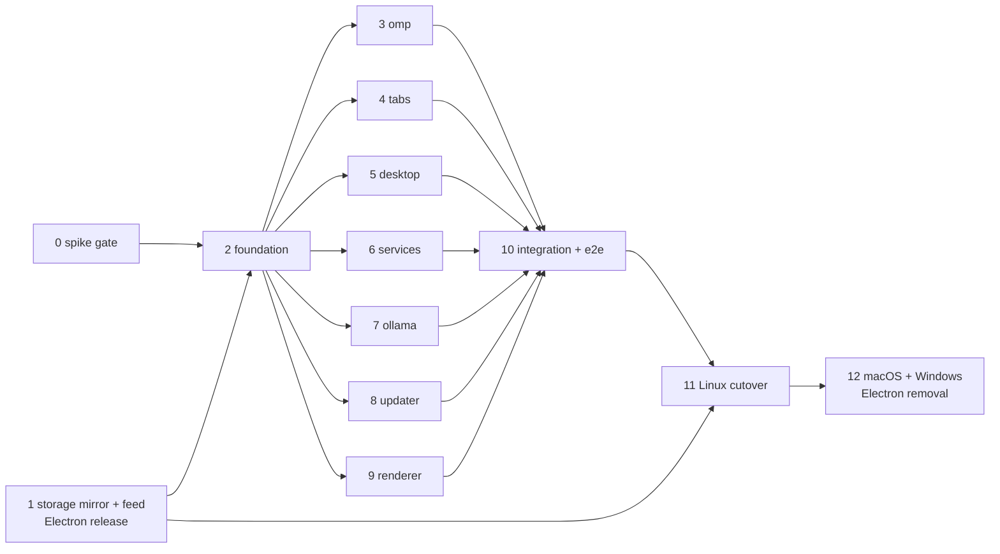

# Swap Electron for Tauri (Rust)

## Outcome

Sai ATLAS runs on a Tauri 2 Rust core with the OS webview (WebKitGTK first, then WKWebView and WebView2) instead of Electron. These stay as they are: the React renderer, `window.omp` (`src/shared/ipc-types.ts:985`), the `omp` sidecar, the profile at `<appData>/@oh-my-pi/omp-gui`, the app identity (`vn.io.vif.saiatlas`), the release asset names and the yml update feeds. Installed builds move to Tauri through their own updater. The goal is a smaller shell: Phase 0 required the Tauri shell at ≤ 60% of the packaged Electron shell's PSS, while per-tab sidecar memory does not change. That gate was waived by the user on 2026-10-04: the measured shell is 72–75 % at idle, and total memory is lower than Electron's in every row (`reports/parity-report.md`) (`plans/reports/research-261002-1224-rust-port-footprint.md`). Linux switches first (Phase 11). macOS and Windows switch, and Electron is removed, in Phase 12.

## Decisions

| Topic | Decision | Source |
|---|---|---|
| Do it | Swap Electron for Tauri | User, 2026-10-02 |
| Main-process logic | Full Rust port, no Node/Bun helper process; port by test (each TS `it()` gets a Rust twin with an `assert`) | kongming counsel |
| Contracts | Runtime-free `AppCtx` with port traits (`src-tauri/src/ports.rs`), so every module is tested with fakes; snapshots via `cargo public-api`. Every port is built as `X::new(ctx: CtxRef)` (`CtxRef = Weak<AppCtx>`, `Arc::new_cyclic` in `lib.rs::build_ctx`), every port trait has `as_any` so handlers reach their module's state, and module tests install their real port with `testing::fake_ctx_cyclic` | Red team #4, #5; Phase 2 contract review (Task 2.9b) |
| Bridge | Shared `createOmpApi(port, platform)` and `createQuickEntryApi(port, platform)` in `src/shared/bridge/`; `omp_invoke` with per-page `seq` and an ordered per-window dispatcher; synchronous-admission handlers (`Reply::Ready`/`Later`); one `Channel` per page with JS fan-out; synchronous bootstrap init script `bridge::bootstrap_script(ctx, caller)` | kongming counsel; red team #6, #7 |
| Blob downloads | Same-origin `blob:` download navigations are allowed, and `webview::build_window` registers `.on_download(...)`, which routes the download through `Host::save_dialog`. No channel is added; LogPanel's "Export logs" stays as it is (Phase 9 Task 9.3 checks it) | Controller, 2026-10-02 (Phase 2 code review M8) |
| Linux sidecar location | The packaged Linux sidecar is a bundle resource at `/usr/lib/Sai ATLAS/omp` (deb) and `$APPDIR/usr/lib/Sai ATLAS/omp` (AppImage), never `/usr/bin/omp`, which would put a GUI-pinned `omp` on `PATH` and collide with any package that owns that path. macOS and Windows keep the sidecar beside the executable (`externalBin`). Phase 8 packages it; `paths::resolve_bundled_omp()` on `tauri/foundation` (`fe94ddf`) searches the resource directory first, then macOS `Resources`, then the executable's directory | Phase 2 contract review; controller, 2026-10-02 |
| Webview security | One foundation helper builds every window: WebKitGTK sandbox, navigation lock, shared data dir, media/spelling hooks, header CSP, minimal capabilities | Red team #1, #13 |
| Coexistence | Tauri lives in `src-tauri/` beside Electron. Electron ships Linux until Phase 11 and macOS/Windows until Phase 12. | User (Linux first), 2026-10-02 |
| Release route | Publish from `tung491/oh-my-pi-gui`. Installed Sai ATLAS builds were hand-shared files; Phase 1 repoints their feed and is handed out the same way. | User, 2026-10-02 |
| Updates | Port the yml-feed updater to Rust; no Tauri updater plugin | User, 2026-10-02 |
| Renderer storage | Mirror the five localStorage keys into `prefs.json` (Phase 1), plus a one-time Chromium LevelDB import for installs that skip it (Phase 6) | User, 2026-10-02 |
| Dictation | The Linux cutover is blocked until dictation works in the Tauri build. `MediaRecorder` is unusable on Ubuntu's WebKitGTK 2.52.6 (S4), so `src/renderer/lib/voice.ts` captures PCM with WebAudio: an `AudioWorklet` served as a static file from the app origin (`src/renderer/public/`, `'self'`), `ScriptProcessorNode` as the capability fallback while Electron ships, one Float32 accumulator into the existing 16 kHz resample and PCM16 WAV encode. No `cpal`, no voice channel, no `gstreamer1.0-plugins-bad`. Phase 9 Task 9.2 owns it and lands on `main` before Phase 2 branches. | User, 2026-10-02; kongming counsel; S4 |
| Sidecar supervisor | GUI → supervisor (re-exec of the GUI binary with the reserved argv `--omp-supervise`, handled in `main.rs` before `tauri::Builder`; `setsid`, `PR_SET_CHILD_SUBREAPER`, `PR_SET_PDEATHSIG=SIGTERM`, a `socketpair` control channel whose EOF is the primary parent-death signal) → omp (own process group, stdio inherited, no frame relay) → tool children. Shutdown: SIGTERM omp, 5 s grace, SIGKILL omp's group, sweep reparented orphans ≤ 2 s, exit with omp's status. Windows: Job Object `KILL_ON_JOB_CLOSE`, no supervisor. macOS: supervisor plus kqueue `NOTE_EXIT` and a `proc_listchildpids` snapshot. The S7b gate is a Rust test (Phase 3) and a packaged-smoke case (Phase 10). The shell handles SIGTERM/SIGINT through Tauri's exit path. Frozen in Phase 2, implemented in Phase 3, OS branches in Phase 12. | S7b; kongming counsel; user, 2026-10-02 |
| WebKit sandbox hook | `webview::install_sandbox_hook()` overrides the `WebKitWebContext` GObject `constructed` vfunc once (`std::sync::Once`) before `tauri::Builder`, so every context is sandboxed before its first web process; `build_window` asserts `is_sandbox_enabled()` and exits if false; Phase 10 asserts `Seccomp:\t2` on every `WebKitWebProcess`. No AppArmor rule on Ubuntu 26.04. `.deb` depends on `bubblewrap` and `xdg-dbus-proxy`. | S14; kongming counsel |
| App identity | `src-tauri/src/product.rs` (frozen) mirrors `src/shared/product.ts`, guarded by a test; on Linux `main.rs` calls `glib::set_prgname(Some(APP_ID))` and `glib::set_application_name(PRODUCT_NAME)` before GTK init; `tauri.conf.json` sets `app.enableGTKAppId: true`; the desktop entry comes from a `desktopTemplate` with `StartupWMClass=vn.io.vif.saiatlas`. | S11; kongming counsel |
| Quick-entry bar | Equal `min_inner_size`/`max_inner_size` of 680×168 and no `resizable(false)` (which yields 680×200 on GTK); background `#0a1a33`. Mutter ignores always-on-top on Wayland, and the tray has no left-click: both accepted. S5 (chord on screen) and S8 (icon and menu click) are re-verified by a human in Phase 5. | S6/S5/S8 human checks; user, 2026-10-02 |
| Window construction | `webview::build_window(app, WindowSpec)`: the frozen foundation applies a caller-supplied spec first and the security settings last, so Phase 5 varies windows without editing a frozen file | kongming Phase 0/1 checkpoint |
| Bridge generation | The page chooses its generation id and sends it on `omp_attach` and every `omp_invoke`; the reorder buffer skips a missing `seq` after 2 s; responses are never chunked (S3: 64 MiB in 227 ms) | kongming Phase 0/1 checkpoint; S3 |
| Toolchain | Scripts resolve `~/.cargo/bin` explicitly (the distro `/usr/bin/cargo` shadows rustup on PATH) and fail loudly without `cargo tauri`; `cargo-public-api` and its nightly are pinned in `scripts/rust-pins.env`, shared with CI | kongming Phase 0/1 checkpoint |
| Not ported | `renderer-recovery.ts` ASAR logic, `editable-context-menu.ts`, `pin-user-data.ts`, Chromium locale-pak rules | kongming counsel; reasons in Phase 2 |

## Phases

| # | Phase | Module | Depends on | Effort | Status |
|---|---|---|---|---|---|
| 0 | [Go/no-go spike on the Linux reference machine](./phase-00-go-no-go-spike.md) | — | — | 3d | Pending |
| 1 | [Mirror renderer storage and repoint the Electron update feed](./phase-01-renderer-storage-write-through.md) | — | — | 2d | Pending |
| 2 | [Tauri foundation, bridge and frozen contracts](./phase-02-tauri-foundation-contracts.md) | foundation | 0, 1 | 7d | Pending |
| 3 | [omp child processes](./phase-03-omp-processes.md) | omp | 2 | 7d | Pending |
| 4 | [Sidecar pool, tabs and RPC routing](./phase-04-sidecar-pool-tabs.md) | tabs | 2 | 6d | Pending |
| 5 | [Windows, quick entry, shortcuts, tray, menu, deep links, quit guard](./phase-05-windows-desktop-integration.md) | desktop | 2 | 8d | Pending |
| 6 | [Sessions, files, dialogs, system actions, logs, prefs](./phase-06-data-system-services.md) | services | 2 | 6d | Pending |
| 7 | [Ollama services](./phase-07-ollama-services.md) | ollama | 2 | 4d | Pending |
| 8 | [Updater, bundles, release feeds, CI](./phase-08-updater-packaging-ci.md) | updater | 2 | 7d | Pending |
| 9 | [Renderer compatibility with WebKit and WebView2](./phase-09-renderer-webkit-compat.md) | renderer | 2 | 3d | Pending |
| 10 | [Integration, e2e migration, visual pass and Linux parity](./phase-10-integration-e2e-parity.md) | — | 3–9 | 12d | Pending |
| 11 | [Linux cutover release](./phase-11-linux-cutover-release.md) | — | 1, 10 | 3d | Pending |
| 12 | [macOS and Windows cutover, then Electron removal](./phase-12-macos-windows-cutover-electron-removal.md) Windows is out of scope since 2026-10-05 (everyday-work rebrand, R13): skip every Windows step. The macOS Tauri bundle must ship resources/assistant-pack beside the omp sidecar the way the Linux bundle does (see the rebrand plan's spawn contract) before macOS switches to Tauri. | — | 11 | 8d | Pending |

## Execution rules

- Phases 0 and 1 can run at the same time (Phase 0 changes no repo file). Phase 2 starts after Phase 0 is GO, Phase 1 is merged, and Phase 9 Task 9.2 (WebAudio voice capture) is merged to `main`: that task runs out of band before the wave because Electron needs it, Phase 5 Task 5.3b verifies dictation in a Tauri window during the wave, and every worktree inherits it from the branch point. The rest of Phase 9 runs in the wave.
- Phases 3 to 9 run in parallel, each in its own worktree branched from the final `tauri/foundation` commit: `../worktrees/tauri-<module>` on branch `tauri/<module>`.
- Ownership is disjoint and enforced by `scripts/check-module.sh <module>`. Frozen for the whole wave: `src-tauri/Cargo.toml`, `Cargo.lock`, `build.rs`, `src/{main,lib,ctx,ports,bridge,webview,prefs,paths,product,i18n,runtime_log,testing,test_hooks}.rs`, `src/omp/supervisor.rs`'s `run` signature, `rust-toolchain.toml`, `tests/**`, `scripts/rust-pins.env`, `scripts/check-module.sh`, `scripts/check-test-parity.ts`, `scripts/tauri-dev.ts`, `capabilities/*`, `contracts/*`, `src/shared/**`, `src/preload/**`, `src/renderer/boot/**`, `src/renderer/main.tsx`, `src/renderer/quick-entry/main.tsx`, `src/renderer/global.d.ts`, `src/renderer/index.html`, `electron.vite.config.ts`, `vite.*.ts`, `package.json` dependencies, `bun.lock`, every Electron file under `src/main/**` (except the CI assertions in `src/main/packaging-config.test.ts`, which `updater` owns), and `e2e/**`.
- Every wave module follows the frozen wiring listed once in Phase 3 → Wave rules → "Frozen wiring": `CtxRef` constructors, `as_any` for handler state, the init and seven-step shutdown order in `lib.rs`, spawning through `Handle::try_current()` or `tauri::async_runtime::spawn` from any main-thread path, `'static` futures queued before return, and `testing::fake_ctx_cyclic` tests.
- `unsafe` is allowed in three files only, each with a `// SAFETY:` comment: `webview.rs` (the GObject `constructed` override and the webkit2gtk hooks), `omp/manager.rs` (the `pre_exec` that dups the control channel to fd 3) and `omp/supervisor.rs` (the one `OwnedFd::from_raw_fd(3)` that takes that channel). No gate scans for it, so Phase 3 Task 3.6 checks the omp count with `grep`, and every other wave module has none.
- Dependency versions are frozen in `src-tauri/Cargo.toml` for the wave: `reqwest` 0.12 (features `json`, `stream`, `rustls-tls`; 0.13 renamed `rustls-tls`), every Tauri plugin at `"2"` (crates.io's latest for several plugins is a Tauri 3 alpha; never bump them), `tauri-nspanel = "2"` from crates.io (2.1.0; macOS only and unverified until Phase 12), `ashpd` 0.11 with only its `tokio` feature, `tokio` `test-util` and `tauri` `test` as dev-only features. A wave phase that needs another crate or feature has found a plan bug (Failure Protocol).
- Merge order (Phase 10): omp → tabs → services → desktop → ollama → updater → renderer, with `cargo test` and `bunx vitest run` green after each merge.
- **Sidecar binaries.** This checkout is not inside the monorepo, so `build:omp*` runs only in the monorepo's clone of this repo at `/home/tung491/WORK/oh-my-pi/packages/gui`. Check out the commit you need there, build one target at a time (the build patches the shared monorepo while it runs), and copy `resources/omp*` into the checkout or worktree that needs them. Every phase that runs the agent first checks `test -x resources/omp`.
- **Processes.** Every app run uses a throwaway profile (`bun run dev:tauri -- --user-data-dir=$(mktemp -d)`) and the per-worktree dev port from `scripts/tauri-dev.ts`. On "address in use", stop the stale owner you started; never pick another port. Stop what you started before ending a phase or removing a worktree.
- **Protect the installed baseline.** `sai-atlas 0.9.15` (`/opt/Sai ATLAS`, `/usr/share/applications/vn.io.vif.saiatlas.desktop`) and the real profile `~/.config/@oh-my-pi/omp-gui` are the Phase 10/11 handover baseline. During the wave:
  - Nobody runs `dpkg -i` or `apt install` of a Sai ATLAS package.
  - Nobody installs `~/.local/share/applications/vn.io.vif.saiatlas.desktop`. If a portal check truly needs one, remove it before reporting.
  - Nobody writes into the real profile. Record the mtimes of `prefs.json` and `logs/gui-runtime.jsonl` at the start and end of each phase; they must match.
  - `omp/supervisor.rs` never calls `runtime_log`: it runs without `--user-data-dir`, so a log call would land in the real profile.
- **Wave worktrees** were created from `10cf8a5`.
  - Each Rust worktree has a pre-warmed `src-tauri/target/debug` and a built `out/renderer-tauri`. Rebuild the latter with `bun run build:renderer:tauri` after renderer changes; `generate_context!` needs it.
  - Run cargo with `CARGO_BUILD_JOBS=8`, and run release builds under `nice -n 10`.
  - Manual on-screen checks are batched into one session with the user. Executors record them as NEEDS-HUMAN with exact steps instead of waiting.
- **Completion check per phase:**
  - The tree is clean; the diff stays inside owned paths; `git diff 10cf8a5 -- src-tauri/contracts` is empty.
  - `check-module.sh <m>`, the full `cargo test --all-features` and `check-test-parity.ts <m>` all pass.
  - The module has no `todo!`, `unimplemented!` or `#[ignore]`, and no `tauri_plugin_` call or cross-module `downcast_ref` outside `ctx.host`, except the two extension traits Phase 5 prescribes because the frozen `Host` has no such surface: `tauri_plugin_global_shortcut::GlobalShortcutExt` and `tauri_plugin_deep_link::DeepLinkExt`, both in `desktop`.
  - No leftover `omp`, `--omp-supervise`, fixture or port-518x processes remain.
  - The baseline above is untouched.
  - The controller trial-merges each finished branch into a scratch `tauri/integration` branch in the Phase 10 order and runs `cargo test --all-features` after each merge.
- Checkpoint: if the wave takes more than 1.5× its estimate (about 45 days combined), stop and ask the user before continuing.
- Executors: the strongest available model runs Phases 0 and 2, plus Task 8.2 (root-run installs). Sonnet-class executors may run the rest under each phase's Failure Protocol.
- Cargo: `/usr/bin/cargo` (distro 1.93.1) shadows rustup's `~/.cargo/bin/cargo` on this machine. Every script that runs cargo puts `~/.cargo/bin` first on `PATH` from `scripts/rust-pins.env` and fails loudly when `cargo tauri` is missing; never fix this by editing the user's shell profile.

## Acceptance criteria

- [ ] Phase 0 verdict is GO, with S1, S2 (≤ 60%), S3, S7, S7b and S14 passing (done 2026-10-02). Dictation works in the Tauri build through WebAudio PCM capture: `grep -rn MediaRecorder src/renderer` prints nothing, Phase 5 Task 5.3b records a transcript with the sandbox on, and the Phase 10 visual pass row "voice dictation" is PASS.
- [ ] The Phase 1 release is published on `tung491/oh-my-pi-gui` and handed to the installed users.
- [x] `cargo test --manifest-path src-tauri/Cargo.toml --all-features` passes, including `--test channels` (94 channels, each with exactly one owner and a registered handler). Verified on `tauri/integration` `ae1d96e`, 2026-10-05.
- [x] `bun scripts/check-test-parity.ts <module>` passes for foundation and the six Rust modules (verified at `ae1d96e`, 2026-10-05).
- [ ] `bunx vitest run`, `bun run check:types` and `bun run test:e2e:tauri` pass, and `e2e-tauri/check-twins.ts` passes (same titles, no fewer assertions).
- [ ] The Linux visual pass has no FAIL. Every WebKit web process runs sandboxed (`Seccomp: 2`, nested namespace). The footprint table shows the Tauri shell at ≤ 60% of the Electron shell's PSS (waived by the user 2026-10-04; measured 72–75 % at idle, total memory lower in every row). The packaged smoke proves a `kill -9` of the shell leaves no `omp` or tool child within 10 s, and the quick-entry bar measures 680×168.
- [ ] A baseline Linux install updates to the Tauri build on its own (AppImage and .deb), with one instance running and settings intact. Passed on 2026-10-05: the AppImage on the host's virtual display, the `.deb` in a container. The host `.deb` run through the `systemd-run` route is pending the user.
- [ ] After Phase 12, macOS and Windows pass their host checks, and no Electron dependency, config, source or script reference remains.

## Risks

| Risk | Mitigation |
|---|---|
| WebKitGTK on NVIDIA + Wayland (this machine) renders blank or crashes | Phase 0 S1 hard gate; env workarounds in `main.rs` only under the conditions S1 proved |
| The WebKitGTK sandbox hook stops working after a wry or WebKitGTK upgrade | The `constructed` override is proven (S14: `Seccomp: 2`, nested `NSpid`, UI renders); `build_window` asserts `is_sandbox_enabled()` and exits, and the Phase 10 smoke checks every web process, so a regression fails loudly |
| Sidecar and tool children survive a hard kill of the shell | Supervisor topology (S7b proven, 0.11 s); Rust tests in Phase 3 and the packaged-smoke case in Phase 10 |
| Linux global shortcuts (the plugin is X11-only) | ashpd GlobalShortcuts portal with host Registry registration (Phase 5) |
| Microphone in WebKitGTK | `MediaRecorder` is unusable (S4), so dictation uses WebAudio PCM capture, proven in the spike (1.5 s of real PCM → 16 kHz WAV, worklet from a same-origin file under the sandbox); media hooks stay; the cutover is still blocked until Phase 5 Task 5.3b passes |
| Installed builds never see the Phase 1 release | It is handed out like the original builds; the LevelDB import covers storage for any that skip it |
| Weaker executors drift from contracts | Frozen traits and API snapshots, owned-path diff gate, test parity with assertions, Failure Protocol in every phase |
| No macOS/Windows host | Those OSes stay on Electron until Phase 12, which requires the hosts |
| A Tauri release breaks users | `pre-tauri-linux`/`electron-final` tags; the shared yml feeds and profile allow a rollback release |

## Validation Log

### Session 1 — 2026-10-02
Questions asked: 8 (4 during the red-team review, 4 in validation).

| Topic | Question | Answer |
|---|---|---|
| Red team | Apply the 15 accepted findings? | Apply all |
| Release route | Which repo publishes, and which installs move? | `tung491/oh-my-pi-gui`; migrate installed Sai ATLAS builds |
| Updater | yml port or Tauri updater plugin? | Port the yml updater |
| OS scope | Which OSes switch first? | Linux only first |
| Distribution | How did installed builds reach users? | Hand-shared `.deb`/`.AppImage` files |
| LevelDB | Import Chromium localStorage for installs that skip the mirror? | Add the import |
| Footprint | S2 threshold | ≤ 60% |
| Voice | If S4 fails | Block the Linux cutover until it works |

Propagated to: plan.md, Phases 0, 1, 2, 3, 5, 6, 7, 8, 10, 11, 12 (new).

### Session 2 — 2026-10-02 (execution)

- **Phase 1 release published 2026-10-02:** [v0.9.15](https://github.com/tung491/oh-my-pi-gui/releases/tag/v0.9.15) on `tung491/oh-my-pi-gui`, Linux only (AppImage, `.deb`, `latest-linux.yml`). Phase 11 may start on 2026-10-09 at the earliest.
- **Version:** the user did not know the highest hand-shared build, so 0.9.15 was chosen above every version on either feed (`nornzach` latest is 0.9.14; this repo's `package.json` was 0.9.10).
- **Upstream sync skipped for this release:** the sidecar comes from monorepo `411f2721`, which already contains the Ollama `num_ctx` change. The release body records it.
- **Hand-out pending (user):** builds older than 0.9.15 poll the old feed, so the files must still be handed to the installed users. macOS and Windows have no 0.9.15 build; they move when their hosts are available.
- **Phase 0 verdict: GO** ([spike report](./reports/spike-report.md)). All six hard gates pass. S1 was confirmed on screen by a portal screenshot after the session was unlocked, and S7b passes only with the supervisor process.
- **Accepted soft-gate degradations (user, 2026-10-02):**
  - Dictation moves from `MediaRecorder` to WebAudio PCM capture. `MediaRecorder` is unusable on Ubuntu's WebKitGTK 2.52.6; the `cpal` fallback is dropped.
  - On Wayland, the quick-entry bar does not stay above other windows, because Mutter ignores always-on-top.
  - The tray icon has no left-click action.
- **S5 and S8 on-screen checks deferred (user, 2026-10-02):** Phase 5 re-checks both on the real app.
- **Quick-entry Send button (user request, 2026-10-02):** `2b0b698` adds a Send button to `QuickEntryBar.tsx`. Phases 5 and 9 port the bar with it.
- **Quick-entry chord (user, 2026-10-03):** keep `Ctrl+Shift+Space` as the default.
  - On this machine, GNOME's `switch-input-source` already owns it, and the portal reports such a chord as bound even though mutter never grabs it.
  - The desktop module detects a GNOME keybinding conflict before binding and reports it through the existing "refused" notice. Electron 0.9.15 has the same blind spot.
- **Dev `omp://` registration (user, 2026-10-03):** only packaged builds register the system `omp://` handler; debug and e2e builds never do. This supersedes Task 5.7 step 1.
  - Reason: a debug build registered itself without `--user-data-dir`, so an `omp://` link opened the user's real profile. The profile was restored from the verified prefs copy; only the last window position was lost.
- **Native dialogs have no parent window on Linux (foundation change, 2026-10-03).**
  - What happened: Export logs aborted the app. tao 0.37.1 `window.rs:951` wraps `gdk_wayland_window_get_wl_surface` in `NonNull::new_unchecked`, and GTK nulls the surface of a hidden window.
  - The fix: `TauriHost` no longer passes a dialog parent on Linux. This costs nothing, because rfd's GTK3 backend ignores the parent.
  - Phase 10 checks: run a debug-build Wayland smoke (hide the window, open a parented dialog, the app stays alive).
  - Phase 11 follow-up: consider the plugin's `xdg-portal` backend.
  - Open question: in the same crash, a tokio worker panicked first with "Cannot start a runtime from within a runtime". The next Export test runs with `RUST_BACKTRACE=1` to name its caller.
- **Quit guard covers last-window close and shell commands (2026-10-03):** this goes beyond Electron, which guards neither. The user expected the dialog in both cases.
  - On Linux and Windows, closing the last window while work runs vetoes the close and shows the dialog. This supersedes Task 5.8 step 2's assumption that `ExitRequested(None)` would cover it: Tauri delivers the window-destroyed event first, and tabs are already released by then.
  - A running composer `!` or `$` command counts as working for the guard.
  - Open item: closing a non-last window still ends its working tabs without asking, the same as in Electron.
- **Wave status (2026-10-03):** Phases 3–9 are complete on their branches. Every branch is merged into `tauri/integration`, whose full Rust suite has 658 tests plus 2 channel tests.
- **Human on-screen session on `tauri/integration` (2026-10-03, GNOME 50 Wayland, debug build, throwaway profile):**

  | Check | Result |
  |---|---|
  | Quick entry, via Send and via Enter | PASS |
  | Conflict warning for `Ctrl+Shift+Space` | PASS |
  | Chord the user rebound to `Ctrl+Space` | PASS |
  | Tray New Session (works; Wayland refuses focus) | PASS |
  | Deep link, delivered once | PASS |
  | Window restore, including maximized | PASS |
  | Export logs, one dialog per click, no `.part` left | PASS |
  | SIGTERM clean exit | PASS (515 ms) |
  | `kill -9` orphan sweep | PASS (283 ms) |
  | Quit guard, window close and tray Quit with a running `!` command; Keep working, then Quit anyway | PASS |
  | Dictation | NOT RUN: no STT backend; still blocks the Linux cutover |

- **Defects found and fixed during the session:**
  - In the foundation:
    - Wayland dialog-parent abort;
    - duplicate download handling.
  - In `services`: log-watcher self-deadlock, which also hung SIGTERM.
  - In `desktop`:
    - tray lock deadlock;
    - window-size drift;
    - dev `omp://` registration;
    - double deep-link delivery;
    - chord-conflict detection;
    - last-window quit guard.
  - In `tabs`: `!` and `$` commands counted as working.
  - On `main`: model-name font consistency (`830fa67`).
  - Reports are in `plans/reports/` under `debugger-261003-*` and `fullstack-developer-261003-*`.
- **Open for Phase 10:**
  - Re-run the S5 check on a chord GNOME doesn't own.
  - When GNOME binds a different chord, report that chord instead of "refused".
  - Add a debug-build Wayland smoke for parented dialogs.
  - Add `clippy::significant_drop_in_scrutinee` to the frozen `Cargo.toml`.
  - The CI gate base for pull requests.
  - Closing a non-last window still ends its working tabs without asking.
- **Phase 10 start (kongming checkpoint, 2026-10-03): GO.**
  - `tauri/integration` is promoted as the Phase 10 branch. Task 10.1 steps 1-2 are satisfied by the controller's trial merges: a `git merge-tree` replay of the plan's merge order from `tauri/foundation` gives a tree identical to `tauri/integration`'s.
  - Module worktrees removed (Task 10.1 step 4); the branches are kept.
  - WebDriver: on Ubuntu 26.04 the package is `webkitgtk-webdriver`, not `webkit2gtk-driver`.
  - Execution order:
    1. Stage A, sequential: clippy lock lints, clipboard `spawn_blocking`, the barrier fix, `tauri-driver`, and the `e2e-hooks` binary.
    2. Stage B, two parallel lanes: the reach-in inventory and hooks; the wdio harness and spec ports.
    3. Stage C, sequential, with the user: footprint, visual pass, packaged smoke, handover.
  - Handover ordering, so the only `.deb` baseline survives:
    1. Back up the real profile.
    2. AppImage handover.
    3. Deb handover. This is the first install of a Tauri `.deb`.
    4. Packaged smoke and visual pass, run on what the handover installed.
    5. Self-update.
  - Deferred, not cutover blockers:
    - the CI gate base (to Phase 11);
    - reporting GNOME's chosen chord;
    - closing a non-last window ends its tabs. Electron does the same; this is a product decision, not a defect.
- **Phase 10 Stages A and B (2026-10-03/04): done on `tauri/integration`, not pushed.**
  - Stage A added the clippy lock lints and fixed 12 long lock holds, none of them a deadlock. It also moved the clipboard read to `spawn_blocking`, fixed the barrier race, installed `tauri-driver` 2.1.0 and built the e2e binary. Report: `reports/fullstack-developer-261003-1403-phase-10-stage-a.md`.
  - Task 10.2: 34 reach-ins are mapped in `e2e-tauri/reach-ins.json`, with new hooks `test:runtime`, `test:calls` and `test:barrier-waiters` and richer `test:fault` scripts. e2e-hooks builds honour `OMP_BUNDLED_OMP`; shipped builds never read it. Report: `reports/fullstack-developer-261003-1425-phase-10-test-hooks.md`.
  - Task 10.3:
    - The wdio harness, `check-twins.ts` (9 files, 44 tests, every twin matches), `csp.e2e.ts` and the Electron Send-button twin are in.
    - `bun run test:e2e:tauri` passes all 9 spec files. `performance` is env-gated and `runtime`'s legacy-core test is gated, as on Electron.
    - `packaged-smoke` is written (`bun run test:e2e:tauri:packaged`, `wdio.packaged.conf.ts`) but has not run; it waits for the handover install.
    - Reports: `reports/fullstack-developer-261003-1426-phase-10-wdio-harness.md` and `reports/fullstack-developer-261003-1643-phase-10-spec-ports.md`.
  - Defects found and fixed:
    - Every embedded-asset build showed a blank main window: the navigation lock rejected `tauri://localhost` with an empty path.
    - Auto-follow pulled the reader back down while a reply streamed (both shells).
    - The Behavior stats page called the renamed `/api/stats/behavior` endpoint (both shells).
    - `omp stats` outlived a killed app; it now runs under the supervisor.
    - The test sidecar sent a 9.6 MB line where the real agent splits large replies into chunks.
    - "Remove global override" never worked: the agent rejected `set_setting` with an undefined value. Fixed in the monorepo, `f674c994` local, and cherry-picked onto the fork's `main` as local branch `fix/rpc-unset-setting` (`8f713fb619`). tung491 has no push access to `nornzach/oh-my-pi`, and the user chose to keep the fix local for now (2026-10-04), so only this machine's sidecar builds carry it until the next release sync. The sidecars were rebuilt from the nested `oh-my-pi/packages/gui` checkout; the previous binaries are kept in the session scratchpad.
  - The user accepted the corrections to stale Playwright originals under `e2e/**`: `real-core`'s welcome dialog, and `deep-audit`'s stray Escape and macOS-only shortcut label. The test sidecar also splits large replies now.
  - The ChatStream auto-follow fix and the Behavior stats fix also belong on `main` for the Electron release.
- **Checkpoint (2026-10-04 06:45 KST, user shut down). Resume from here.**
  - `tauri/integration` tip `e4f4193`, in worktree `../worktrees/tauri-integration`. Nothing is pushed.
  - All 9 Tauri spec files pass. On Electron, `quick-entry` passes 9/9 and `real-core` passes. `deep-audit` failed both times at `e2e/deep-audit.e2e.ts:910`: Escape inside a command-palette submenu closes the whole palette.
  - A debugger was stopped mid-verification. Its uncommitted fix sits in the worktree: `CommandPalette.tsx` moves its key handling to a document listener, because the level switch unmounts the focused row and focus lands on `<body>`. It also adds a test in `CommandPalette.test.tsx` and steps in `e2e-tauri/deep-audit.e2e.ts`. It is unverified, and it is unknown whether the debugger consulted kongming.
  - Copy of that diff: `../worktrees/.checkpoint-sai-atlas-261004/palette-escape-wip.patch`; evidence in `palette-debug/`.
  - Next steps:
    1. Resume the palette fix. Have kongming review the WIP diff first. Then run vitest, Electron `bunx playwright test e2e/deep-audit.e2e.ts` and Tauri `bun run test:e2e:tauri -- --spec e2e-tauri/deep-audit.e2e.ts` (rebuild the renderer and the e2e binary first). Commit.
    2. Hold the kongming checkpoint for Stages A and B.
    3. Run Stage C with the user, in the handover order above.
  - Backups that used to live in the session scratchpad (`/tmp`, wiped on reboot) are now in `../worktrees/.checkpoint-sai-atlas-261004/`:
    - `stray-profile-backup/`, including the 4 test sessions moved out of `~/.omp`;
    - `mimeapps.list.pre-human`;
    - `s10/prefs-copy.json` (real prefs sha `62e0b512…`);
    - the pre-fix sidecars `omp*.before-unset-fix`;
    - `wave-check.sh`, `trial-merge.sh` and `pss.sh`.
  - Baseline at checkpoint:
    - real `prefs.json` mtime is `2026-10-02 18:18:23`;
    - `sai-atlas 0.9.15` is installed;
    - there is no user desktop entry;
    - no test processes are running.
  - Sidecars in `resources/` were rebuilt at 05:09 with the local agent fix.
- **Resumed 2026-10-04 07:41.**
  - The palette fix landed as `db4a139`, on kongming's advice. The twin probe and an unrelated hover-scroll change were dropped. The cause: Escape reached no handler, so the palette stayed stuck in the submenu.
  - Electron and Tauri deep-audit pass. The full `test:e2e:tauri` passes 9/9 on the virtual display (`scripts/virtual-display.sh`).
  - **Kongming checkpoint for Stages A and B: GO for Stage C.**
    - The `bridge.rs` hook dispatch and the `paths.rs` override are confirmed e2e-hooks-only.
    - Accepted: the hard-kill twin checks four pgreps, `omp stats` included.
  - **User decisions:**
    - **Keep the host install** for Stage C, rejecting kongming's container route: the deb handover installs the first Tauri `.deb` on this machine.
    - **Release Electron 0.9.16 now**, carrying the Phase 10 Electron fixes cherry-picked to `main`: `87aa3ad`, `6d2bd69`, `24744b0`, `3fc046b` (`stats.rs` dropped from the cherry-pick), `f8a3244`, `0e4f2dc` and `610ca37`. The repo's container smoke and virtual-display tooling is committed as `8458730`.
    - Consequences:
      - the Tauri cutover is ≥ 0.9.17;
      - Stage C test bundles are A = 0.9.17 and B = 0.9.18, plain versions, built with `SAI_ATLAS_UPDATE_BASE=http://127.0.0.1:8765`, so neither is a release artifact;
      - the handover baseline becomes 0.9.16 once it is released and installed on the host.
  - **Stage C notes from kongming:**
    - A Linux release build calls `register_all()` on every start. That writes `~/.local/share/applications/sai-atlas-handler.desktop` and repoints `x-scheme-handler/omp` in `~/.config/mimeapps.list` (to the AppImage path when run as one). Back both up before any host run of a release AppImage and restore them after.
    - Release builds ignore `OMP_BUNDLED_OMP`, so the footprint turn uses the same prompt and model on the real sidecar. `pss.sh` must classify the sidecar by exe basename `omp`, not by `--mode rpc` in argv.
    - Dictation still needs an STT backend; it is the last cutover blocker.
- **Electron 0.9.16 released, 2026-10-04.** Commit `618fcf5`, tag `v0.9.16`; Linux AppImage, `.deb` and `latest-linux.yml`.
  - The upstream sync was skipped. The sidecar is monorepo `411f2721` plus the local `f674c994`, and the release body says so.
  - Before publishing:
    - vitest passed 1888 and `check:types` and the build were clean;
    - Playwright on the virtual display passed 13 with 1 skipped (`quick-entry`, `auto-follow`, `real-core`, `deep-audit`, `runtime`), plus the known worker-teardown timeout from `omp stats` surviving `app.exit(0)`;
    - `bash scripts/deb-smoke.sh` passed 7/7 in the container.
  - After publishing, the feed's `latest-linux.yml` reads `0.9.16` and CI is green on `618fcf5`.
  - The host check is the user updating the installed 0.9.15 in the app, then the quick-entry chord and one prompt. Once that passes, 0.9.16 is the handover baseline.
- **Stage C, 2026-10-04 afternoon.**
  - **The Tauri AppImage could not start on the host.** It aborted at web-process launch with "Failed to start dbus proxy: Failed to spawn child process ././/bin/bwrap".
    - Cause: tauri-bundler's linuxdeploy GTK plugin rewrites every `/usr` in the bundled `libwebkit2gtk-4.1.so.0` to `././`. With the working directory at `$APPDIR/usr`, WebKit then looks for `bwrap` and `xdg-dbus-proxy` inside the AppImage and binds the AppDir's `usr/lib` over `/lib` in the sandbox.
    - Ruled out: disabling the sandbox (the app's exit-70 guard forbids it), bundling `bwrap` (AppArmor grants user namespaces only to `/usr/bin/bwrap`), and patching only the two executable paths.
    - Fix (kongming, verified by hand, then automated in `9c4a10b`): `src-tauri/linux/finalize-appimage.ts` reverts every relocated string and relocates only the WebKit helper directory again, then repacks with a pinned appimagetool. `package:tauri:linux` runs it after `finalize-deb.ts`. The repacked 0.9.17 starts on the virtual display with `WebKitWebProcess` under `bwrap` and `Seccomp: 2`.
    - New requirements: the build host needs `squashfs-tools`, and a host running the AppImage needs `libwebkit2gtk-4.1-0` (which brings `bubblewrap` and `xdg-dbus-proxy`). Both go into the Phase 11 README amendment; the AppImage then needs no AppArmor profile.
    - Still open: an `ubuntu:24.04` container run decides whether the bundled 26.04 GTK stack works there. If it does not, the fallback is an AppImage without the bundled GTK/WebKit stack, and dropping the AppImage becomes a user decision.
  - **Product bug fixed (`6fac468`).** A release build claimed `omp://` before any web process ran, so the crashing AppImage had already rewritten `sai-atlas-handler.desktop` and the mimeapps default. Registration now happens once, on the first renderer `omp_attach`. `PageLoadEvent::Finished` was rejected because WebKitGTK reports failed loads as finished. The handler bracket was restored after the crash.
  - **Tooling fix on `main` (`e0d28b5`).** `scripts/virtual-display.sh run` now sets `GDK_BACKEND=x11`. A session that exports `GDK_BACKEND=wayland` sent GTK windows to the real desktop.
  - **Footprint.** The Tauri rows are measured from the 0.9.17 `.deb` unpacked with `dpkg-deb -x`: system WebKit, the real sidecar, the throwaway profile. One AppImage 1-tab-idle row follows the rebuild as a delta. Rebuilds wait until the footprint runs finish, so they cannot skew PSS.
  - **S2 footprint gate: FAIL, waived by the user (2026-10-04).** The first pass gave 76 % (1 tab idle). Kongming judged the failure real but not yet defensible, so the full protocol ran: fresh profiles, focused and unfocused states, three launches, a first turn, post-turn idle, plus two rendering experiments. Results: Tauri shell 75.4 % unfocused, 72.0 % focused, 66.1 % post-turn, 101 % at the peak of a turn. At integer scale 1 on the virtual display it is 91 %. Neither CPU rendering nor disabled compositing comes near 60 %, and the structural floor is about 70 %. Total memory is lower with Tauri in every row. After seeing this, the user chose to relax the gate and bypass it ("can relex the s2 gate", "bypass it"). The ≤ 60 % line in the Outcome and the acceptance criteria no longer blocks the cutover; the evidence is in `reports/parity-report.md`.
  - **Update handover, unattended on the virtual display.** The Electron 0.9.16 AppImage → Tauri 0.9.17 AppImage handover: PASS (settings and tabs kept). The Tauri AppImage self-update 0.9.17 → 0.9.18: PASS, with one defect: the relaunched process inherits the old runtime's keepalive pipe, so the old mount lives until the app quits. The `.deb` handover and the `.deb` self-update need sudo and wait for the user.
  - **AppImage container matrix (`reports/appimage-container-matrix.md`).** Ubuntu 26.04 with `libwebkit2gtk-4.1-0`: PASS, sandboxed. Ubuntu 24.04: FAIL. The bundled libraries from the 26.04 build host need glibc 2.42–2.43, and `build-bundles.sh` only checked the main binary.
  - **Build-host decision (kongming; within the plan's stated 24.04+ floor, so not a user decision).** Linux bundles are built in an `ubuntu:24.04` container (`scripts/tauri-linux-build`). Both finalize scripts enforce a glibc 2.39 floor on every ELF, so a wrong build host fails the build. 24.04-updates ships the same WebKitGTK 2.52.6, and its pristine library keeps the finalize step's invariants. The relaunch fix closes fds ≥ 3 in the relaunch child and scrubs the old mount from its cwd and environment. A startup close-on-exec sweep was rejected: the supervisor and sidecar run from the mount and must keep it alive if the GUI is hard-killed.
  - **Open for Phase 11:** the AppImage's `GST_PLUGIN_SYSTEM_PATH_1_0` points at a missing bundled GStreamer directory, so dictation's microphone capture may fail in the AppImage (the `.deb` is unaffected). Verify on a host AppImage run, then choose between bundling the media framework and documenting "dictation needs the .deb".
- **Stage C, 2026-10-04 evening (unattended, per the user's "proceed unattended until the end").**
  - **24.04 build verified.** The bundles built in the `ubuntu:24.04` container at `c623b75` top out at `GLIBC_2.39` across every bundled ELF, and the WebKit library keeps the finalize step's invariants. AppImage container matrix: (a) 26.04 PASS, (c) 24.04 PASS, both sandboxed (`reports/appimage-container-matrix.md`). The 24.04 portability regression is closed.
  - **AppImage self-update relaunch re-run on the fixed build: PASS.** The old mount was gone at +0.51 s and the old FUSE runtime at +1.02 s. The new process holds only its own keepalive pipe, and its environment has no old-mount references. The open Phase 11 item is confirmed: the AppImage's GStreamer path is empty ("appsink not found").
  - **Visual pass (Task 10.4): no FAIL rows.** 20 PASS, 4 PENDING-USER (dictation, tray, the Wayland global shortcut, notifications) and 2 accepted degradations (`reports/renderer-visual-pass.md`).
  - **Linux window size defect, found by the visual pass (Failure Protocol, kongming).** tao 0.37.1 seeds the cached outer size with the window position until the first configure, so the decoration correction opened every Linux main window at `2 × target − position`. The fix (`baea5a6`, review follow-up `e2caf7e`):
    - the decoration is measured against the requested size, with plausibility ceilings;
    - on Linux the correction is applied once at the first configure, with a main-thread catch-up for windows built off the main thread, and is skipped for maximized or fullscreen windows;
    - sub-minimum rects are never saved.
    The runtime log now records the bundle version (`e824b79`). The real GNOME Wayland size check is PENDING-USER (script in `reports/parity-report.md`).
  - **Packaged smoke: 8/8 PASS** in a clean Ubuntu 24.04 container with a real `apt install` (`scripts/tauri-deb-smoke.sh`, `3f6af10`). That includes the S7b hard kill (no sidecar or tool child within 10 s) and the Wayland app id. Follow-up: a sandbox that starts and then fails makes WebKit abort instead of the app exiting 70; it still fails closed.
  - **Footprint verdict unchanged:** S2 FAIL, waived by the user.
- **Stage C, 2026-10-05 (unattended). Update handover fixed on both formats; final bundles at `tauri/integration` `ae1d96e`, not pushed.**
  - **`.deb` handover failed at first (Failure Protocol, `reports/kongming-deb-handover-advice.md`).** After `dpkg -i`, electron-updater calls `app.relaunch()`, so Electron started the Tauri binary as its relaunch helper and waited forever for one byte on fd 3. Processes started that way also carry `NoNewPrivs: 1`, so the next `pkexec` fails.
    - The fix is `c5a1f59`, `2c0d840` and `fa5302f`:
      - the binary answers the `--type=relauncher` protocol: it writes the byte, waits up to 60 s for the parent to exit, and launches with no arguments;
      - the launch escapes `no_new_privs` through `systemd-run --user` (unit `app-vn.io.vif.saiatlas@…`), and falls back to a direct launch;
      - updater and Ollama installs under `no_new_privs` ask for a reopen instead of failing in `pkexec`.
    - Container runs `run2` and `run3`: PASS, including the self-update and three negative protocol cases.
  - **The earlier AppImage handover PASS was provisional: it ran the extracted `AppRun`, a non-production path.** On a directly launched `.AppImage`, nothing restarted. Kongming (`reports/kongming-appimage-handover-advice.md`) proved why: Chromium's relauncher sets `no_new_privs`, so the setuid `fusermount3` cannot mount the new image (exit 127). Every Electron→Electron AppImage update since 0.9.15 has the same defect.
    - The fix is `d477387`, review follow-up `73ab0e2`. The Tauri install child runs without `no_new_privs` and schedules a host waiter. The waiter relaunches only after Electron spawns its relauncher helper, so install-on-quit stays closed.
    - Final run on the production path: PASS on the `systemd-run` route and the direct route, install-on-quit stayed closed, and the Tauri self-update still passes.
  - **Window-size regression from the review follow-up.** Under openbox, restored windows grew by one frame per launch. Fixed in `7b0391a` and `675922c` (`reports/kongming-window-size-regression-advice.md`). `scripts/tauri-wm-geometry-check.sh` (`a115ce2`) now asserts the geometry under a real reparenting window manager.
  - **Final gates at `ae1d96e`:**
    - 754 Rust lib tests plus the integration suites, and vitest 1968;
    - packaged smoke 8/8;
    - the openbox geometry check;
    - the `.deb` handover regression;
    - the AppImage handover.
  - **New follow-ups:**
    - the app aborts at startup when `XDG_RUNTIME_DIR` is unset or outside `/run/user/<uid>`;
    - stopping the handover unit (and so logout) gives the handed-over AppImage a `SIGBUS` instead of a clean shutdown;
    - helper and install-child log lines report the crate version 0.9.15.
  - **Still host-only:** the `systemd-run` success route for the `.deb` and its `pkexec` prompt, the real GNOME Wayland window-size check, tray, the Wayland global shortcut, dictation and notifications.
  - **0.9.15 installs take the same path.** v0.9.15 and v0.9.16 differ only in the `package.json` version line (Electron 44.4.5 and electron-updater ^6.8.9 on both). So the handover proven from 0.9.16 also applies to installs still on 0.9.15.
  - **Phase 10 close (kongming checkpoint, `reports/kongming-phase-10-close-advice.md`): GO to present Task 10.6.** Phase 10 is done except for one host sitting, which must happen before Task 11.4.
    - **Host sitting:**
      - dictation in the installed `.deb`, the user's own cutover blocker;
      - the GNOME Wayland window size;
      - the `.deb` handover on the `systemd-run` route with the next `pkexec` prompt;
      - tray, the Wayland chord and notifications on the release build;
      - a `KillMode` check of the unit stop.
    - **Phase 11 batch, one rebuild and one regression pass before the tag:**
      - `KillMode=mixed` and `TimeoutStopSec=15` on the `systemd-run` unit;
      - create `~/.local/share/applications` before writing the `omp://` handler;
      - deduplicate the `.deb` `Depends`;
      - bump `src-tauri/Cargo.toml` with `package.json`, plus a guard test;
      - the AppImage GStreamer decision, after the host microphone test;
      - replace the CI foundation gate;
      - container handover cases with a populated session and with a profile that needs the LevelDB import.
    - **Documented only:**
      - startup needs a standard `XDG_RUNTIME_DIR` (any logind session has one);
      - the update downloads again after a reopen;
      - a sandbox that starts and then fails aborts instead of exiting 70.
- **Task 10.6 Linux cutover decision (user, 2026-10-05).**
  - **Cutover:** Linux switches to Tauri in 0.9.17. The condition is that the host sitting passes before Task 11.4; a dictation FAIL means hold.
  - **AppImage:** ship the auto-reopen waiter and the release-note safety net ("if Sai ATLAS does not reopen after the update, start the new `.AppImage` once by hand").
  - **No bridge Electron release.**
  - **"Set up later":** accepted as is. The local-assistant prompt shows once after the handover and is remembered from then on.
- **Phase 11 pre-release batch (2026-10-05, started at the user's request).**
  - **Merged into `tauri/integration`:**
    - `82bc55b`: the relaunch unit uses `KillMode=mixed` and `TimeoutStopSec=15`. On the host, a default unit stop killed both the Tauri and the Electron AppImage with `SIGBUS`; with these properties both stop cleanly.
    - `1b77c9d`: the `.deb` declares `desktop-file-utils` and `xdg-utils` and drops the duplicate depends. The `omp://` registration error came from the missing `update-desktop-database`, not a missing applications directory: the deep-link plugin creates that directory itself.
    - `3d164ac`: the crate version equals `package.json`'s, with a guard test.
    - `3cecab3`: CI runs whole-tree parity and API-snapshot checks instead of the merge-base gate.
  - **Extra container handover cases on `ae1d96e`: PASS.** A populated session survives the handover, and the LevelDB import restores renderer storage (`reports/parity-report.md`).
  - **AppImage dictation.** Using the host's GStreamer works on 24.04 but stops the app from starting on 26.04: host GStreamer 1.28 needs GLib 2.82+, and the AppImage bundles 2.80.
    - Kongming (`reports/kongming-appimage-gstreamer-advice.md`): bundle a curated plugin set that matches the bundled 1.24 core. That is six capture plugins and four playback plugins, plus the libpulse client and a private `GST_REGISTRY`. Audio reaches the host through the PulseAudio socket, which is the only route the WebKit sandbox allows.
    - Electron's AppImage uses the host's libpulse, so leaving AppImage dictation broken would be a regression.
  - **User decisions (2026-10-05):**
    - AppImage dictation gates 0.9.17 if its fake-microphone container rows pass by the regression pass. Otherwise 0.9.17 ships with the release-note line "dictation needs the .deb" and the fix moves to 0.9.18.
    - Bundle the playback plugins too, so speak works.
    - Accept the AppImage growing by about 3–4 MB.
  - **AppImage audio fixed (`344294e`..`899ac58`, merged): the fake-microphone probe passes.**
    - The AppImage bundles 11 GStreamer plugins and keeps its own registry under the app cache.
      - `interleave` was added to the advised 10: without `deinterleave`, the MediaStream reached the page silent (rms 0).
      - The image is 2.32 MB larger, and the newest glibc symbol it needs is `GLIBC_2.38`.
    - The probe passes on 24.04 and 26.04 with the sandbox on:
      - one audio input, the AudioContext running, rms 0.567;
      - playback ends;
      - the web process mounts only the pulse socket, the plugin folder and its registry folder;
      - the shared `~/.cache/gstreamer-1.0` is untouched.
    - Both controls fail as they should: the previous AppImage, and the new one with its plugins moved aside.
    - The `.deb` passes the same probe in the smoke container, the first test of its microphone path.
    - Per the user's gate, AppImage dictation ships in 0.9.17, pending the host check with a real microphone.
    - **New follow-up:** on 26.04 the AppImage's bundled spell-check library cannot load the host's spell-check add-ons ("undefined symbol"). This predates the audio fix.
  - **Regression pass at `899ac58`:**
    - **Passed:**
      - all four AppImage runs, with a clean unit stop (no `SIGBUS`), `appVersion` 0.9.17 in the logs, and no GStreamer errors;
      - packaged smoke 8/8;
      - the fake-microphone probe on the `.deb` and on the AppImage on 24.04 and 26.04;
      - the openbox geometry check (its image now preinstalls the new depends, `24a8731`).
    - **Failed: the `.deb` handover removed the app (Failure Protocol; `deb-handover/run5-899ac58/`).** The harness image lacked `desktop-file-utils`, then newly in Depends, and had no apt lists.
      - Electron 0.9.16's updater runs `dpkg -i`, which left 0.9.17 unconfigured, then `apt-get install -f -y`, which removed `sai-atlas`. The relaunch found no binary.
      - Any Depends entry missing from a machine whose apt cannot fetch it triggers this. Earlier runs passed only because the image modelled a stock desktop.
  - **Kongming (`reports/kongming-deb-depends-handover-advice.md`):**
    - **Hard Depends cut to what the binary cannot start without:** WebKitGTK 4.1, GTK, bubblewrap, xdg-dbus-proxy, and the tray library as `libayatana-appindicator3-1 | libappindicator3-1`. The alternation also stops apt swapping out 0.9.16's recommended `libappindicator3-1`.
    - **Moved to Recommends:** `desktop-file-utils`, `xdg-utils` and the two GStreamer packages.
    - **Tauri updater:** installs with a single `pkexec apt-get install -y --no-remove -- <deb>` and never uses `-f`.
    - Stock Ubuntu 24.04/26.04 desktop manifests, and the user's host, contain every hard dependency, so `dpkg -i` configures at once. A networked non-stock machine completes through `apt-get -f`. Only a machine with neither WebKitGTK 4.1 nor working apt lists can still lose the package; the README will carry the recovery command.
    - No bridge release and no `Pre-Depends`: the user's earlier "no bridge" stands. It would flip if a SAI OS image lacks WebKitGTK 4.1 or runs offline.
  - **Implemented (`6775975`, `272b6fe`, `9ef58a9`, plus `ed9c281` for the install-failure log line) and verified at `9ef58a9`.**
    - `.deb` handover gate rows PASS: the stock desktop completes in `dpkg -i` alone, and the networked non-stock machine completes with no package removed.
    - The Tauri updater asks for privileges once, and with an uninstallable dependency it keeps the old version and shows the manual command.
    - Smoke 8/8, the microphone probe and the geometry check pass.
    - Residual risk: a machine with neither WebKitGTK 4.1 nor apt lists still loses the package under 0.9.16's updater. The Phase 11 docs must carry the pre-step and the recovery command (`sudo apt install libwebkit2gtk-4.1-0` before updating on a non-GNOME desktop; `sudo apt --fix-broken install` or `sudo apt install ./sai-atlas_0.9.17_amd64.deb` afterwards).
- **Pre-release batch closed (kongming checkpoint, `reports/kongming-pre-release-batch-close-advice.md`, 2026-10-05).**
  - **Complete:** checklist items 4–10, as amended, are done, and nothing blocks Task 11.2.
  - **No AppImage re-run needed:** the evidence at `899ac58` still holds at `9ef58a9`, because that diff touches only the `.deb` side.
  - **Two log-only commits, unit-tested, carried by the release build:**
    - `ed9c281`: a failed install writes apt's output to the runtime log.
    - `453f76d`: a successful LevelDB import logs the key names, never the values.
  - **Phase 11 file updated:**
    - the earliest tag is 2026-10-09;
    - `package:linux` is the container build;
    - CI must run on the pushed branch before the merge;
    - the Task 11.3 content, including the verbatim residual-risk and AppImage-reopen lines;
    - the feed-base check;
    - the final container pass (step 4a) and the host sitting (step 4b) on the release bundles;
    - the release goes out as a draft first.
  - **User decisions (2026-10-05):**
    - AppImage spell checking on 26.04 gets a release note in 0.9.17 and a fix in 0.9.18. The bundled enchant 2.3.3 cannot load the host's 2.8 providers; the fix bundles `enchant_hunspell.so` and patches the module path to the same length.
    - The rule that drops a startup tab whose only action is a `!` command stays as is; 0.9.16 behaves the same.
- **Tasks 11.1–11.3 (2026-10-05), on local branch `tauri/linux-cutover`, not pushed.**
  - **11.1:** local tag `pre-tauri-linux` = `e0d28b5` (the last Electron-Linux `main`). Not pushed.
  - **11.2:**
    - `main` + `--no-ff` merge of `tauri/integration` (`01cdfc0`).
    - `789e129` removes `electron-builder.linux.yml`, `scripts/deb-smoke.sh` and `scripts/deb-smoke/`, points `package:linux` at `scripts/tauri-linux-build.sh`, and adds a packaging guard that no `electron-builder*.yml` carries a `linux` key.
    - `805c40e` fixes an e2e race, waiting for Abort to disappear (kongming advice after a failed run).
    - Verify: vitest 1990/1990, check:types, `bun run build`, `build:renderer:tauri`, cargo test, clippy, parity (7 modules), snapshots, and Tauri e2e 9/9 on two consecutive runs.
  - **11.3:** README (English and 中文), the AGENTS.md "Linux (Tauri) packaging" subsection, and the CHANGELOG `[Unreleased]` section with the three verbatim migration lines. Merged into the cutover branch as `7677ba1`; vitest 1990/1990 and check:types pass after the merge.
  - **Open before merging into `main`:**
    - Push `tauri/linux-cutover` for the first `tauri-linux` CI run (needs user approval).
    - The host sitting must confirm the IME `GDK_BACKEND=x11` sentence, plus the systemd-environment and AppImage `omp://` claims, which are sourced only from code.
  - `plan/04-tech-stack.md` keeps its old `package:linux` example: it is a historical design record, and its whole scripts block predates the migration.
- **Local `main` fast-forwarded to `tauri/linux-cutover` (`7677ba1`), user instruction, 2026-10-05.** Not pushed. The branch was pushed for its first CI run (run `37261685659`); `origin/main` stays at `e0d28b5` until that run is green and the user approves the push.
- **Phase 12 deferred (user decision, 2026-10-05).** macOS and Windows stay on Electron, and Electron is not removed. This plan closes after Task 11.4; Phase 12 resumes only when the user reopens it, and it still needs the macOS and Windows hosts.
 The monorepo's local `main` is `f674c994` and its branch `fix/rpc-unset-setting` is `8f713fb619`. Its `bun.lock` modification predates this work; leave it alone.
- **Verify:** the Task 1.7 curl prints `1`. `e2e/packaged-smoke.e2e.ts` passed 7/7 against the installed `.deb` after publishing; before publishing, the update-check case reported "No published versions on GitHub", which showed the build already reads the new feed. CI is green on `main` and `v0.9.15`. The old Phase 11 (cutover plus removal) split into Phase 11 (Linux) and Phase 12 (macOS, Windows, removal).

## Red Team Review

### Session — 2026-10-02
**Reviewers:** Security Adversary, Failure Mode Analyst, Assumption Destroyer, Scope & Complexity Critic (4 lenses, 40 raw findings, all with file:line evidence).
**Findings after dedup:** 15 (15 accepted pending user review, 0 rejected).
**Severity breakdown:** 3 Critical, 8 High, 4 Medium.

| # | Finding | Severity | Disposition | Applied To |
|---|---------|----------|-------------|------------|
| 1 | Linux WebKitGTK web-process sandbox is opt-in and off in wry; Electron's sandbox is a tested invariant (`e2e/packaged-smoke.e2e.ts:139-156`) | Critical | Accept | Phases 0, 2, 8, 10 |
| 2 | 0.9.x update bridge breaks at install time: AppImage `execFileSync` blocks on a Tauri child that ignores `APPIMAGE_EXIT_AFTER_INSTALL`; deb relaunch targets a deleted path (`updater.ts:225-232,368`) | Critical | Accept | Phases 2, 8, 10 |
| 3 | Release route and migrating population are unpinned: origin is `tung491/oh-my-pi-gui` with no releases, feeds point at `nornzach` (v0.9.14, omp identity) | Critical | Accept; user decision | plan, Phases 1, 8, 10, 11 |
| 4 | Frozen contracts are incomplete and the snapshot cannot detect drift (missing `kind_for`, `session_owner_is_live`, `release_window`, event enum, batcher API; first-line-only grep) | High | Accept | Phases 2–8 |
| 5 | `AppCtx` holds a Wry `AppHandle` and concrete modules, so tests cannot use mock runtimes or fakes; dispatch tests hit `todo!()` | High | Accept | Phases 0, 2–8 |
| 6 | Bridge lifecycle: async subscribe races and leaks, subscriptions survive reloads, replay and DeepLinkBuffer semantics lost, fire-and-forget `send` loses ordering | High | Accept | Phase 2 |
| 7 | Electron's single-threaded main process ordering is lost: prefs read-merge-write races, unordered `send`, out-of-order stdin writes (`ipc.ts:906-907`) | High | Accept | Phases 2, 4, 6 |
| 8 | Window identity changes from numbers to labels and breaks `IpcSessionOwner.winId: number` (`ipc-types.ts:910-926`, `use-session-switch.ts:196-198`) | High | Accept | Phases 2, 4, 5 |
| 9 | Sidecar shutdown: `kill_on_drop` SIGKILLs and skips the agent's SIGTERM teardown; no signal crate frozen; window close leaks a window's sidecars; quit ordering unowned (`sidecar.ts:614-622`, `sidecar-pool.ts:232-234`, `index.ts:396-555`) | High | Accept | Phases 0, 2, 3, 4, 5 |
| 10 | e2e: 34 main-process reach-ins, not 15, including handler replacement and fault injection; test hooks must not ship in release builds | High | Accept | Phases 2, 10 |
| 11 | Shared plugins (dialog, opener, notification, clipboard, global-shortcut) have no single owner; `process`/`os` plugins have no consumer | High | Accept | Phase 2 |
| 12 | Single-instance lock keys on the app id, not the profile, so throwaway e2e/dev profiles hand off to the user's real app | High | Accept | Phases 2, 5, 10 |
| 13 | Security surface underspecified: capability permission list, subscription scope, CSP meta vs header (`connect-src 'self'` blocks IPC), Electron-only entitlements, bootstrap script encoding, navigation allowlist looser than Electron's, real file-read contract misdescribed, root deb install command | Medium | Accept | Phases 2, 5, 6, 8 |
| 14 | Behavior regressions in ports: system proxy on Linux/Windows, GPU name from Chromium, Ollama install progress broadcast, health check after ready, quick-entry storage sharing, `isBlockedMenuChord` | Medium | Accept | Phases 3, 4, 5, 7 |
| 15 | Plan mechanics: channel regex misses `updater:getStatus`; `it.each` ignored by parity; module naming (`updater` vs `packaging`); foundation parity file; Phase 2 must depend on Phase 1; owned-path gaps (deep-link scheme, `mac-update-floor.ts`, `bun.lock`); sidecar source missing in worktrees; Phase 11 deletes files that kept scripts import | Medium | Accept | plan, Phases 1, 2, 5, 8, 10, 11 |

### Whole-Plan Consistency Sweep
- Files reread: plan.md and all 13 phase files (phase-00 … phase-12).
- Decision deltas checked: 23 (15 red-team findings, 8 validation answers).
- Reconciled stale references: 14. These were the `packaging` module key → `updater`, `mock_builder` dispatch tests → `bridge::dispatch_for_test` with fakes, label-based caller ids → `WindowId`, `emit_to_window(label…)`, the dialog-memory JSON file (not a real file), `tauri-plugin-updater`/`process`/`os` deps, the S13 harness gate, the e2e reach-in count (15 → 34), the Phase 11 removal scope (split into 11 and 12), the nornzach feed, the quick-entry transparent window (it is opaque), the window-guard duplication in Phase 5, the "update all" deep-link replay, and the Phase 9 ownership of the HTML entries.
- Unresolved contradictions: 0.
- Checks run: `ak plan validate` → valid; every phase has one literal `## Failure Protocol`; every phase link in the table resolves.
