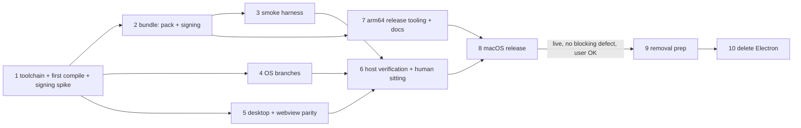

# Sai ATLAS on Tauri for macOS (arm64), then remove Electron

Parent plan: [`plans/261002-1441-tauri-shell-migration/plan.md`](../261002-1441-tauri-shell-migration/plan.md). This plan replaces its Phase 12 ([`phase-12-macos-windows-cutover-electron-removal.md`](../261002-1441-tauri-shell-migration/phase-12-macos-windows-cutover-electron-removal.md)). Everything about Windows in that phase is dropped.

Handover: this plan is written for a Sonnet-class executor (`--advice --tdd`). Every task has a mechanical Verify, and every phase carries its own Failure Protocol. Stopping on a failed Verify is intended behavior, not a stall.

## Outcome

The macOS arm64 build of Sai ATLAS is the Tauri app from `src-tauri/`. It ships in the first release after 0.9.17 (normally 0.9.18) as `Sai-ATLAS-<V>-arm64.dmg`, `Sai-ATLAS-<V>-arm64.zip` and the bridge copy `omp-<V>-arm64.dmg`, all listed in an arm64-only `latest-mac.yml` with `minimumSystemVersion: 22.4.0`. In the packaged app the bundled sidecar is `Contents/MacOS/omp`, signed with only its JIT entitlements plus `disable-library-validation` (Task 1.7: the hardened ad-hoc sidecar cannot load its extracted native addon without it). The assistant pack is at `Contents/Resources/assistant-pack`. Every session loads it, and a `kill -9` of the app leaves no `omp` or supervisor behind. After that release is live and the user confirms it has no blocking defect, Electron, electron-builder, electron-vite, `src/main/**`, `src/preload/**` and the Playwright suite are deleted. AGENTS.md and the README then describe one Tauri app on Linux and macOS.

## Decisions

| Topic | Decision | Source |
|---|---|---|
| Scope and order | Cut macOS over first. Remove Electron last, and only after the macOS Tauri release is live with no blocking defect. | User, 2026-10-08 (1) |
| Architecture | arm64 only. No Intel DMG or ZIP, no `build:omp:x64`, no `package:tauri:mac:x64`. `latest-mac.yml` lists arm64 assets only. AGENTS.md's release flow is rewritten to match. | User, 2026-10-08 (2) |
| Sidecar source | Clone `nornzach/oh-my-pi` to `~/WORK/oh-my-pi`, nest this GUI repo at `~/WORK/oh-my-pi/packages/gui`, build `resources/omp` there with `bun run build:omp`, then copy it into this worktree. | User, 2026-10-08 (3) |
| Population | Fresh installs only. No macOS build was ever published from this repo, so no Electron→Tauri self-update handover is tested on macOS (the parent's Task 12.2 step 4 is dropped). The `omp-<V>-arm64.dmg` bridge copy stays until 1.0.0. | User, 2026-10-08 (4); `gh release view` |
| Release timing | macOS Tauri ships in the first release after 0.9.17, not inside 0.9.17. | User, 2026-10-08 (5) |
| Windows | Out of scope. Skip every Windows step. | User, 2026-10-05 (6) |
| Signing | Ad-hoc (`-`), with hardened runtime and no notarization, as Electron did (`electron-builder.yml` `identity: "-"`, `hardenedRuntime: true`, `notarize: false`). The host has no signing identity. | Host fact; parity with Electron |
| Entitlements | The app carries only `src-tauri/macos/app.entitlements` (audio-input). The sidecar carries only `src-tauri/macos/omp.entitlements` (allow-jit, allow-unsigned-executable-memory), plus `disable-library-validation` if and only if Task 1.7 shows the ad-hoc sidecar cannot load its native addon without it. The Tauri bundler signs the sidecar with the app's entitlements, so a finalize step re-signs the sidecar, then the app, then rebuilds the DMG from the re-signed app. | Planner; parent Task 12.2 |
| DMG | `tauri.macos.conf.json` builds only the `.app`. `src-tauri/macos/finalize-app.ts` re-signs it and makes the DMG with `hdiutil` (with an `/Applications` link), named the way Tauri names it, so `scripts/release-feeds.ts` finds it unchanged. | Planner, KISS: no edits to Tauri's bundle_dmg flow |
| ZIP | Made by the existing `macZip` in `scripts/release-feeds.ts` (`ditto -c -k --sequesterRsrc --keepParent`) from the finalized `.app`. | Existing code `scripts/release-feeds.ts:133-152` |
| Pack location | `resources/assistant-pack/` → `Contents/Resources/assistant-pack/` via the macOS sidecar overlay, so the code seal covers it. `resolve_pack_dir` learns the `Contents/MacOS` → `Contents/Resources` rule. | Scout gap 1 |
| Sidecar lifetime on macOS | Supervisor plus kqueue `EVFILT_PROC`/`NOTE_EXIT` on the GUI pid as a second parent-death signal, and a recursive descendant snapshot of omp (`proc_listchildpids`) taken before each kill, whose survivors are SIGKILLed after the group kill. The Linux tests run on macOS unchanged except for their process-table helpers. | Parent decision "Sidecar supervisor" |
| Proxy | `scutil --proxy`: HTTPS proxy first, then HTTP. A PAC-only setup gets no proxy and one runtime-log line. | Parent Task 12.1 |
| GPU and RAM | GPU name from `system_profiler SPDisplaysDataType -json`. RAM from `sysctl -n hw.memsize`, because `sysinfo_totalmem` returns 0 off Linux (`src-tauri/src/ollama/hardware.rs:157-160`), so `read_machine` returns `None` on every Mac today. | Parent Task 12.1; planner finding |
| Webview profile isolation | wry ignores `data_directory` on macOS, so on macOS 14 and later each window also gets `data_store_identifier` = the first 16 bytes of SHA-256 of its webview data dir. Throwaway profiles then never share renderer storage with a real install. The API needs macOS 14, so on 13.x (floor 13.3) every profile shares WebKit's default store: an accepted limit. | Planner finding; user rule "protect the real environment" |
| Quick entry | Keep `tauri-nspanel` 2.1.0 if it builds. Register its plugin, add the Mission Control collection behavior, and drop every app-menu action that reaches `on_menu_id` while the bar is focused (edit items and ⌘Q never reach it). If it does not build, use the parent's fallback (plain always-on-top window) and record that. | Parent Task 12.1 step 5; scout gap 5 |
| macOS GUI verification | tauri-driver cannot drive WKWebView. Automated checks run from outside the packaged app through a new `scripts/tauri-mac-smoke.ts`: bundle layout, signatures, Info.plist, the pack check against the bundled sidecar, launch and process tree, single instance per profile, and the hard-kill sweep. Page-level and OS-UI checks are NEEDS-HUMAN rows, batched into one sitting (Phase 6). | Planner |
| Floor | Keep macOS 13.3 (Safari 16.4 WebKit). Raise `MAC_UPDATE_FLOOR` to `22.4.0` with its test. No macOS 13 host exists to test on: an accepted risk. | Parent Task 12.2 step 3 |
| Port-by-test gates after removal | When `src/main/**` is deleted, parity entries whose TypeScript file is gone are dropped from `src-tauri/contracts/*.parity.json`. The Playwright twin check (`e2e-tauri/check-twins.ts`) is deleted. Rust tests that read Electron sources either move to the kept copy (pack module, tray mark) or are deleted where their other side no longer exists (i18n table mirror). | Planner |

## Phases

| # | Phase | Depends on | Effort | Status |
|---|---|---|---|---|
| 1 | [Toolchain, sidecar, first macOS compile and signing spike](./phase-01-toolchain-sidecar-first-compile.md) | — | 1.5d | Completed |
| 2 | [A packaged .app with the pack and signed sidecar](./phase-02-bundle-pack-signing.md) | 1 | 1.5d | Completed |
| 3 | [macOS packaged smoke harness](./phase-03-macos-smoke-harness.md) | 2 | 1d | Pending |
| 4 | [OS branches: supervisor, proxy, GPU and RAM](./phase-04-os-branches.md) | 1 | 1.5d | Pending |
| 5 | [Desktop and webview parity](./phase-05-desktop-webview-parity.md) | 1 | 1.5d | Pending |
| 6 | [Host verification and the human sitting](./phase-06-host-verification.md) | 3, 4, 5 | 1d | Pending |
| 7 | [arm64-only release tooling and docs](./phase-07-release-tooling-docs.md) | 2 | 1d | Pending |
| 8 | [macOS release](./phase-08-macos-release.md) | 6, 7 | 0.5d | Pending |
| 9 | [Electron removal: move what stays](./phase-09-removal-prep.md) | 8 + user confirmation | 1.5d | Pending |
| 10 | [Electron removal: delete and rename](./phase-10-electron-removal.md) | 9 | 1.5d | Pending |

File ownership (no two phases that may run at the same time touch the same file):

| Phase | Owns |
|---|---|
| 2 | `src-tauri/src/omp/assistant_pack.rs`, `src-tauri/macos/*`, `src-tauri/tauri.macos.conf.json`, `scripts/stage-tauri-sidecar.ts`, `scripts/tauri-packaging-config.test.ts`, `scripts/finalize-app.test.ts`, `package.json` scripts |
| 3 | `scripts/tauri-mac-smoke.ts`, `scripts/tauri-mac-smoke.test.ts` |
| 4 | `src-tauri/src/omp/supervisor.rs`, `src-tauri/src/omp/proxy.rs`, `src-tauri/src/ollama/hardware.rs`, `src-tauri/src/omp/test_support.rs`, the tests in `src-tauri/src/omp/manager.rs` and `src-tauri/src/omp/shell_env.rs` (Task 4.2b) |
| 5 | `src-tauri/src/lib.rs`, `src-tauri/src/webview.rs`, `src-tauri/src/paths.rs`, `src-tauri/src/desktop/{windows,menu,quick_entry_core}.rs` |
| 7 | `scripts/release-feeds.ts`, `scripts/release-feeds.test.ts`, `scripts/mac-update-floor.ts`, `scripts/mac-update-floor.test.ts`, `scripts/tauri-packaging-config.test.ts` (asset-name test only, after Phase 2 is merged), `AGENTS.md`, `README.md`, `README.vi.md`, `CHANGELOG.md`, `site/index.html` |

Phases 4 and 5 own disjoint files and may run one after the other or at the same time. There is one Mac, so they run as two lanes (decided at the Phase 1 checkpoint): lane A runs Phase 2, then Phase 7, in the main worktree; lane B runs Phase 4, then Phase 5, in one side worktree on branch `tung491/tauri_macos-core` with its own cargo target. Merge order: 2, 4, 5, then 7 when ready. After the last merge, run the full regression gate on the integrated branch and repeat Task 2.9. Each lane appends to the host log only under its own `## Phase N` heading.

## Execution rules

- **Working copy.** Do all work in `/Users/tung491/orca/workspaces/oh-my-pi-gui/tauri_macos` on branch `tung491/tauri_macos`, except lane B (Phases 4 and 5), which works in its side worktree and merges back. Every git command runs there and acts on the GUI repo. Never commit GUI paths into the monorepo at `~/WORK/oh-my-pi`.
- **Cargo.** Run every cargo command with rustup's cargo first on PATH: `export PATH="$HOME/.cargo/bin:$PATH"` in the shell that runs it (see `scripts/rust-pins.env`). Never edit the user's shell profile. All `cargo` commands in this plan use `--manifest-path src-tauri/Cargo.toml` from the repo root.
- **Sidecar route.** Build `resources/omp` only in `~/WORK/oh-my-pi/packages/gui` with `bun run build:omp`, then copy it to `<worktree>/resources/omp`. Build one target at a time: the build patches the shared monorepo while it runs. Every task that runs the agent first checks `test -x resources/omp`. Never commit `resources/omp*`.
- **Protect the user.**
  - Every app run uses a throwaway profile and agent dir: `P=$(mktemp -d); <app>/Contents/MacOS/sai-atlas --user-data-dir="$P/profile"` with `PI_CODING_AGENT_DIR="$P/agent"` in its environment. When a run goes through `open`, pass `--env PI_CODING_AGENT_DIR="$P/agent"` and `--args --user-data-dir="$P/profile"`.
  - Never copy a build into `/Applications`, and never run a build from there. Packaged apps stay under `src-tauri/target/` or a `mktemp -d` folder.
  - Never touch `~/Library/Application Support/@oh-my-pi/omp-gui`. Task 1.1 records that it does not exist, and every phase ends by checking that it still does not exist.
  - Paths a packaged run creates under the bundle id: `~/Library/WebKit/vn.io.vif.saiatlas`, `~/Library/Caches/vn.io.vif.saiatlas`, `~/Library/HTTPStorages/vn.io.vif.saiatlas`, `~/Library/Saved Application State/vn.io.vif.saiatlas.savedState`, and LaunchServices plus TCC entries. These belong to test builds only, because Task 1.1 records that none existed before. Phase 6 Task 6.4 removes them, unregisters the test apps with `lsregister -u`, and resets TCC with `tccutil reset Microphone vn.io.vif.saiatlas`.
- **Processes.** Track every process you start (command, PID). Stop what you started before a phase ends: `pkill -TERM -f "<exact app path>/Contents/MacOS/sai-atlas"` scoped to the exact path, never a bare `pkill sai-atlas`. At phase end, `pgrep -fl "omp --mode rpc-ui"` and `pgrep -fl -- "--omp-supervise"` must print nothing that you started.
- **Manual checks.** The executor cannot do on-screen checks alone (TCC microphone prompt, quick entry over a full-screen app, the global chord, tray, notifications, `omp://` clicks, a settings toggle in the UI). Record each one as `NEEDS-HUMAN` with exact steps in `reports/macos-parity.md`. Do not wait for them: Phase 6 batches them into one sitting with the user.
- **Commits.** Commit to this GUI repo in conventional-commit form, without AI references, plan IDs, phase numbers or audit labels in messages, code comments or test names. One commit per task group that leaves every gate green.
- **Pushing, tagging, releasing.** `git push`, `git tag` pushes, `gh release create/upload/edit` and anything that publishes require the user's explicit go-ahead at that moment. Ask, quoting the exact command, and wait.
- **Reports.** The executor writes run evidence to `plans/261008-0341-tauri-macos-cutover/reports/macos-host-log.md` (tool versions, commits, decisions taken at decision points) and `plans/261008-0341-tauri-macos-cutover/reports/macos-parity.md` (one line per check: `macOS <check name>: PASS|FAIL|NEEDS-HUMAN`).
- **Regression gate** (named in each phase, run from the repo root on this Mac):
  1. `cargo clippy --manifest-path src-tauri/Cargo.toml --all-targets --all-features -- -D warnings` exits 0
  2. `cargo test --manifest-path src-tauri/Cargo.toml --all-features` exits 0
  3. `for p in src-tauri/contracts/*.parity.json; do bun scripts/check-test-parity.ts "$(basename "$p" .parity.json)" || exit 1; done` exits 0
  4. `bash scripts/check-module.sh snapshots` exits 0 and prints `check-module snapshots: PASS`
  5. `bunx vitest run` exits 0
  6. `bun run check:types` exits 0
  7. `bunx biome check <files touched in the phase>` exits 0

## Acceptance criteria

- [ ] `cargo tauri --version` prints `tauri-cli 2.12.1` on the Mac (Phase 1).
- [ ] `grep -rn "is not implemented on this OS" src-tauri/src` prints nothing (Phase 4).
- [ ] The regression gate passes on the Mac at the end of Phases 1, 2, 4, 5, 7, 9 and 10, and CI (`.github/workflows/ci.yml`) is green on the pushed branch.
- [ ] `bun run package:tauri:mac:arm64` exits 0 and leaves exactly one `.app` in `src-tauri/target/aarch64-apple-darwin/release/bundle/macos/` and one `.dmg` in `…/bundle/dmg/` (Phase 2).
- [ ] `bun scripts/tauri-mac-smoke.ts "<app>"` prints `tauri-mac-smoke: PASS` with zero `FAIL` lines (Phases 3 and 6).
- [ ] `grep -c ": FAIL$" plans/261008-0341-tauri-macos-cutover/reports/macos-parity.md` prints `0`, and `grep -c ": NEEDS-HUMAN$"` prints `0` after the sitting (Phase 6).
- [ ] `package.json` has no `build:omp:x64` and no `package:tauri:mac:x64`. `scripts/release-feeds.ts` has no `--mac-x64` option (Phases 2, 7).
- [ ] The published `latest-mac.yml` for `<V>` lists exactly `Sai-ATLAS-<V>-arm64.zip`, `Sai-ATLAS-<V>-arm64.dmg` and `omp-<V>-arm64.dmg`, carries `minimumSystemVersion: 22.4.0`, and passes `bun run check:mac-update-floor` (Phase 8).
- [ ] Every host-log `gated:` line that names an `omp::manager` or `omp::shell_env` test has a matching `ungated:` line (Phase 4 Task 4.2b).
- [ ] After Phase 10: `git ls-files | grep -E "^(src/main|src/preload|e2e)/|electron-builder|electron\.vite|playwright\.config"` prints nothing, and `grep -E "\"(electron|electron-builder|electron-vite|electron-store|electron-updater|electron-log|@playwright/test)\"" package.json` prints nothing.

## Risks

| Risk | L × I | Mitigation |
|---|---|---|
| `tauri-nspanel` 2.1.0 fails to build against Tauri 2.12, or panics at `to_panel` without its plugin | M × H | Task 1.6 compiles it first. Task 5.3 registers `tauri_nspanel::init()`. The documented fallback is a plain always-on-top window. |
| The ad-hoc, hardened Bun sidecar cannot load its native addon or JIT, so every session fails | M × H | Task 1.7 spike signs the real sidecar and runs the pack check before any packaging work. `disable-library-validation` is added only on evidence. |
| The Tauri bundler signs the sidecar with the app entitlements | H × H | `src-tauri/macos/finalize-app.ts` re-signs the sidecar, then the app, and the smoke harness asserts each entitlement set exactly |
| Never-compiled `cfg(target_os = "macos")` code and tests that assume Linux fail on first compile | H × M | Phase 1 compiles and tests first, before any porting. Per-error fixes follow the stated rule, and Linux-by-design tests are gated, never deleted. |
| WKWebView refuses `getUserMedia` (no permission delegate, or the custom scheme is not a secure context) | M × H | Task 5.5 checks wry's delegate in source, and the Phase 6 sitting records a dictation transcript. A failure escalates through the Failure Protocol, and the release waits. |
| Test runs register the test `.app` with LaunchServices for `omp://` and leave TCC or WebKit state under the real bundle id | H × M | No real install exists (Task 1.1). Task 6.4 cleans all of it and records the result. |
| A release with only macOS assets breaks Linux updates (`latest/download/latest-linux.yml` 404s) | M × H | Phase 8 requires the same-version Linux assets from the Linux host before publishing. The draft is published only with every asset. |
| macOS 13.x users (the floor) are untested | M × M | Accepted, and stated in the release notes. A user report on 13.x is a blocking-defect candidate before removal. |
| API snapshots generated on Linux differ on macOS because of target-specific items | L × M | New helpers are `pub(crate)`. A snapshot diff on the Mac stops the phase (Failure Protocol), and CI on Linux stays the authority. |
| Electron removal breaks a kept script or test that reads `src/main/**` | H × H | Phase 9 moves every kept dependency while Electron still exists (enumerated with file:line). Phase 10 deletes only after a grep shows zero references, and the `electron-final` tag gives a rollback. |

## Rollback

- Phases 1–7: revert the phase's commits (`git revert <sha>`). Nothing has shipped.
- Phase 8: until the user publishes, delete the draft. After publishing, mark the release a pre-release only with the user's go-ahead, so `latest/download` falls back to the previous release, then fix forward with a higher version. Since no Mac ever received a macOS build from this repo, there is no Electron macOS build to fall back to.
- Phases 9–10: `git revert` the removal commits, or branch from the `electron-final` tag Task 9.1 creates.

## Validation Log

### Session 1 — 2026-10-08 (planning)

| Topic | Question | Answer |
|---|---|---|
| Scope | Remove Electron after the macOS cutover? | Yes: cutover, then removal as the last phases |
| Architecture | Which Mac architectures ship? | arm64 only |
| Sidecar | Where does the sidecar come from on this Mac? | Clone `nornzach/oh-my-pi` to `~/WORK/oh-my-pi`, nest this repo at `packages/gui` |
| Population | Are there Electron Sai ATLAS Mac installs to hand over? | No: fresh installs only |
| Timing | When does macOS ship? | The first release after 0.9.17 |
| Linux assets | Who builds the same-version Linux packages the macOS release must carry? | The user, on the Linux host (Phase 8 Task 8.3 step 5 waits for them) |
| Showcase | Port or delete `scripts/capture-showcase.ts`? | Delete (Phase 10 Task 10.5) |
| Floor | No macOS 13.x host to test the 13.3 floor | Accept the risk; a 13.x report is a blocking defect before removal |

Propagated to: plan.md (Decisions, Risks), Phases 1, 5, 8, 10.

## Plan selection (`--ultra`)

Five independent candidate plans were written from one evidence packet (`reports/ultra-evidence-packet.md`) and scored blind by the `kongming` verifier against `reports/ultra-rubric.md` (`reports/kongming-ultra-verdict.md`). This plan is the winning candidate, materialized unchanged, then amended by the red-team pass below.

ultra: picked=4/5 margin=high unanimous=yes rejected_all=no

## Red Team Review

### Session — 2026-10-08
Source: the verifier's defect list for the winner (11 items, each with file:line evidence), cross-checked against the four other candidates. All accepted.

| # | Finding | Applied to |
|---|---|---|
| 1 | `e2e/sidecar-fixture.ts:5` imports the RPC limits from `src/main/rpc-bridge`; moving the fixture alone breaks `check:types` after removal | Phase 9 inventory, Task 9.5 step 4 (`src/shared/rpc-limits.ts`) |
| 2 | CSP tests are at `src/main/packaging-config.test.ts:279/285/340`, not the stale `361-437` | Phase 9 inventory, Task 9.6 |
| 3 | The descendant snapshot missed the path where omp exits on its own | Phase 4 Tasks 4.1 (new test), 4.2 (500 ms refresh arm) |
| 4 | Host Bun 1.3.14 is below the repo's 1.4 floor | Phase 1 Task 1.1b (check, ask before upgrading) |
| 5 | `cargo update -p tauri-nspanel` fails after the dependency is removed | Phase 1 Task 1.6 (plain `cargo check`) |
| 6 | `set_collection_behaviour` takes a typed bitflag, not an `i32` | Phase 5 Tasks 5.1 (fact 1), 5.3 |
| 7 | `data_store_identifier` needs macOS 14 while the floor is 13.3 | Phase 5 Task 5.6 (unconditional version guard); Decisions |
| 8 | `site/index.html` still offers an Intel DMG | Phase 7 Task 7.5b; ownership table |
| 9 | The accelerator-mapping chord guard was heavier than needed | Phase 5 Task 5.4 rewritten as a focus + menu-id guard; Decisions |
| 10 | A committed test would read a plan report | Phase 2 Task 2.3 step 4 |
| 11 | Smaller: keep `ports.rs:848`; ask before `tccutil reset`; `check-module.sh:107`; why dropping `--electron-mac-feed` is safe; tao `set_focus` fact | Phases 9, 6, 10, 7, 5 |
| 12 | `scripts/tauri-dev.ts:86` probes the dev port with `ss`, so the "port in use" guard never fires on macOS (carried over from another candidate) | Phase 1 Task 1.8b |

### Whole-Plan Consistency Sweep
- `ak plan validate` passes; every phase file has one Failure Protocol block; every `./phase-*.md` link in this file resolves.
- Stale references removed: `blocks_menu_accelerators…`/`accelerator_of…` tests, the five-fact count (now six), `cargo update -p`, the `361-437` range, `check-module.sh:105`.
- Unresolved contradictions: 0.
