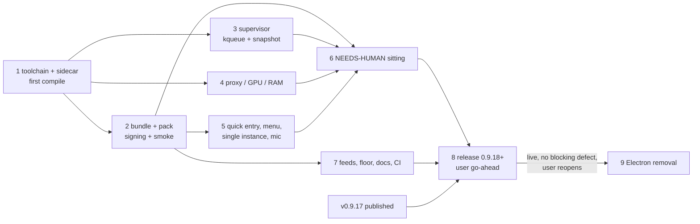

=== FILE: plan.md ===
---
title: "Move Sai ATLAS on macOS to Tauri, then remove Electron"
description: "Build, sign, verify and ship the existing Tauri 2 core as the arm64 macOS app in the first release after 0.9.17, then delete Electron from the repo once that release is live."
status: pending
priority: P1
effort: 11d
branch: tung491/tauri_macos
tags: [infra, macos, tauri, release, refactor]
created: 2026-10-08
---

# Move Sai ATLAS on macOS to Tauri, then remove Electron

## Outcome

The arm64 macOS DMG and ZIP of Sai ATLAS come from the Tauri 2 core in `src-tauri/`, ad-hoc signed with the hardened runtime, with the `omp` sidecar in `Contents/MacOS/omp` (signed with `src-tauri/macos/omp.entitlements`) and the assistant pack in `Contents/Resources/assistant-pack`. Every macOS-only code path that was never compiled now compiles, passes clippy and the test suite on this Mac, and the remaining placeholders (system proxy, GPU name, total RAM, supervisor orphan sweep) have real macOS implementations. The app ships in the first release after 0.9.17, with `latest-mac.yml` listing only arm64 assets and `minimumSystemVersion: 22.4.0`. When that release is live with no blocking defect and the user reopens the work, Electron, electron-builder, electron-vite, the preload, `src/main/**` and every script that depended on them are deleted.

This plan replaces Phase 12 of the parent plan: [`plans/261002-1441-tauri-shell-migration/`](../261002-1441-tauri-shell-migration/plan.md) ([Phase 12](../261002-1441-tauri-shell-migration/phase-12-macos-windows-cutover-electron-removal.md)). Its Decisions table, frozen-wiring rules and Validation Log still apply where this plan does not override them.

## Decisions

| Topic | Decision | Source |
|---|---|---|
| Scope | macOS cutover first; Electron removal is the last phase, gated on the macOS Tauri release being live with no blocking defect | User, 2026-10-08 |
| Architecture | arm64 only. No Intel DMG/ZIP, no `build:omp:x64`, no `package:tauri:mac:x64`. `latest-mac.yml` lists arm64 assets only. AGENTS.md's release flow is rewritten to match | User, 2026-10-08 |
| Sidecar source | Clone `nornzach/oh-my-pi` to `~/WORK/oh-my-pi`, nest `tung491/oh-my-pi-gui` at `~/WORK/oh-my-pi/packages/gui`, run `bun run build:omp` there, copy `resources/omp` into the worktree that needs it | User, 2026-10-08 |
| Population | Fresh installs only. This repo never published a macOS build (v0.9.15 and v0.9.16 carry Linux assets only). No Electron→Tauri self-update handover is tested on macOS. The `omp-<version>-arm64.dmg` bridge copy stays until 1.0.0 | User, 2026-10-08 |
| Release timing | macOS Tauri ships in the first release after 0.9.17 (0.9.18 or later). Nothing from this plan merges to `main` before v0.9.17 is published | User, 2026-10-08 |
| Windows | Out of scope; every Windows step of the parent Phase 12 is dropped | User, 2026-10-05 |
| Signing | Ad-hoc (`signingIdentity: "-"`), hardened runtime on, no notarization, as the Electron build did (`electron-builder.yml` `identity: "-"`, `hardenedRuntime: true`, `notarize: false`). The host has no signing identity | Host fact, 2026-10-08 |
| Bundle layout | Sidecar stays `externalBin` (`Contents/MacOS/omp`). The pack is a bundle resource (`Contents/Resources/assistant-pack`), because non-code files under `Contents/MacOS` break the code-signature seal. `resolve_pack_dir` learns the `../Resources/assistant-pack` candidate for a sidecar inside `Contents/MacOS` | Planner; scout gap 1 |
| Signing route | `cargo tauri build --bundles app` builds the `.app`; a new `src-tauri/macos/finalize-app.ts` re-signs the sidecar with `omp.entitlements` and the app with `app.entitlements` (both `--options runtime`), verifies the seal, then builds the DMG with `hdiutil`. `scripts/release-feeds.ts` already zips the `.app` with `ditto` (`macZip`, `scripts/release-feeds.ts:133-152`). Reason: Tauri's bundler gives the sidecar no entitlements of its own, and signing after the DMG is built would leave the DMG holding a stale app | Planner (mirrors `src-tauri/linux/finalize-*.ts`) |
| macOS GUI verification | tauri-driver cannot drive WKWebView. The automated layer is `scripts/tauri-mac-smoke.ts`: static bundle checks (Info.plist, entitlements, seal, pack files), sidecar `--smoke-test`, the pack-load check, a throwaway-profile launch that must keep a supervised `omp --mode rpc-ui` alive, single-instance per profile, and the `kill -9` no-survivor gate. Everything that needs eyes or TCC is batched into one NEEDS-HUMAN sitting (Phase 6) | Planner |
| Sidecar lifetime on macOS | Supervisor plus kqueue `EVFILT_PROC`/`NOTE_EXIT` on the GUI pid, and a recursive `proc_listchildpids` snapshot of omp's descendants taken before the kill; every survivor is SIGKILLed after the group kill | Parent plan Decisions (Sidecar supervisor) |
| Proxy / GPU / RAM | Proxy from `scutil --proxy` (PAC-only → no proxy plus one log line); GPU from `system_profiler SPDisplaysDataType -json`; total RAM from `sysctl -n hw.memsize` (today `sysinfo_totalmem` returns 0 off Linux, so `read_machine` returns `None` on a Mac: `src-tauri/src/ollama/hardware.rs:144-162`, `:245-248`) | Parent plan Task 12.1; planner finding |
| Quick entry | Keep `tauri-nspanel` 2.1.0 if it builds against Tauri 2.12.1; otherwise fall back to the plain always-on-top window and record it. Port Electron's "the bar swallows app-menu chords" as a menu-dispatch guard in `src-tauri/src/desktop/menu.rs` | Parent plan Task 12.1 step 5; planner |
| Tray mark after removal | `scripts/gen-icons.ts` writes `src-tauri/icons/tray-mark.ts` instead of `src/main/tray-mark.ts`, and `src-tauri/src/desktop/app_icons.rs:14` `include_str!`s the new path. This keeps the existing parser and hash check, which is simpler than the parent plan's switch to an `.rgba` file | Planner (deviation from parent Task 12.4 step 2, smaller change) |
| Test parity after removal | Delete every `src-tauri/contracts/*.parity.json` entry whose `ts` file is under `src/main/`; the three `src/shared/` entries keep `scripts/check-test-parity.ts` meaningful for `ollama` | Planner |

## Phases

| # | Phase | Depends on | Effort | Status |
|---|---|---|---|---|
| 1 | [Toolchain, sidecar and the first macOS compile](./phase-01-toolchain-sidecar-first-compile.md) | — | 1d | Pending |
| 2 | [A signed bundle that launches and spawns the sidecar](./phase-02-bundle-pack-signing-smoke.md) | 1 | 2d | Pending |
| 3 | [Sidecar lifetime on macOS (supervisor)](./phase-03-sidecar-lifetime-macos.md) | 1 | 1d | Pending |
| 4 | [System probes: proxy, GPU name, total RAM](./phase-04-system-probes-macos.md) | 1 | 0.5d | Pending |
| 5 | [Desktop parity: quick entry, menu, single instance, microphone](./phase-05-desktop-parity-macos.md) | 2 | 1.5d | Pending |
| 6 | [NEEDS-HUMAN sitting on the packaged app](./phase-06-needs-human-sitting.md) | 2, 3, 4, 5 | 0.5d | Pending |
| 7 | [Feeds, floor, docs and CI for arm64-only Tauri on macOS](./phase-07-feeds-docs-ci.md) | 2 | 1d | Pending |
| 8 | [Release the first macOS Tauri build](./phase-08-release.md) | 6, 7, v0.9.17 published | 1d | Pending |
| 9 | [Electron removal](./phase-09-electron-removal.md) | 8 live, no blocking defect, user reopens | 2.5d | Pending |



Phases 3 and 4 may run in parallel with Phase 2 (disjoint files, see each phase's target files). Phase 5 waits for Phase 2 because it extends `scripts/tauri-mac-smoke.ts`. A single executor runs them in table order.

### File ownership

| Phase | Owns (only this phase edits these) |
|---|---|
| 1 | `src-tauri/Cargo.toml`/`Cargo.lock` (only for the nspanel fallback), any file a first-compile fix needs (listed in the phase report) |
| 2 | `src-tauri/macos/sidecar.conf.json`, `src-tauri/tauri.macos.conf.json`, `src-tauri/macos/finalize-app.ts` (new), `scripts/finalize-mac-app.test.ts` (new), `scripts/tauri-mac-smoke.ts` (new), `src-tauri/src/omp/assistant_pack.rs`, `scripts/stage-tauri-sidecar.ts`, `package.json` scripts, `scripts/tauri-packaging-config.test.ts`, `.gitignore` |
| 3 | `src-tauri/src/omp/supervisor.rs` |
| 4 | `src-tauri/src/omp/proxy.rs`, `src-tauri/src/ollama/hardware.rs` |
| 5 | `src-tauri/src/desktop/windows.rs`, `src-tauri/src/desktop/menu.rs`, `scripts/tauri-mac-smoke.ts` (adds cases), `src-tauri/src/webview.rs` (only if Task 5.4 requires it) |
| 6 | `plans/261008-0341-tauri-macos-cutover/reports/macos-parity-report.md` (new) |
| 7 | `scripts/release-feeds.ts`, `scripts/release-feeds.test.ts`, `scripts/mac-update-floor.ts`, `scripts/mac-update-floor.test.ts`, `scripts/tauri-packaging-config.test.ts`, `.github/workflows/ci.yml`, `AGENTS.md`, `README.md`, `CHANGELOG.md` |
| 8 | `package.json` `version`, `src-tauri/Cargo.toml` `version`, `src-tauri/Cargo.lock`, `CHANGELOG.md`, `README.md` install links |
| 9 | everything Electron (listed in the phase) |

## Execution rules

- **Where to work.** Everything runs in this worktree: `/Users/tung491/orca/workspaces/oh-my-pi-gui/tauri_macos`, branch `tung491/tauri_macos`. The monorepo clone at `~/WORK/oh-my-pi` exists only to build the sidecar (Phase 1, Phase 8).
- **Cargo prefix.** Every `cargo` command in this plan runs in a shell that first ran `source scripts/rust-pins.env && export PATH="$CARGO_HOME_BIN:$PATH"`. Write them as one line: `source scripts/rust-pins.env && export PATH="$CARGO_HOME_BIN:$PATH" && cargo …`. Every cargo build or test needs `out/renderer-tauri` (built by `bun run build:renderer:tauri`; rebuild after renderer changes).
- **Sidecar build route.** `resources/omp` and `resources/omp.*` are gitignored build artifacts; never commit them. Build them only in `~/WORK/oh-my-pi/packages/gui` with `bun run build:omp`, one build at a time (it patches the monorepo while it runs), then `cp ~/WORK/oh-my-pi/packages/gui/resources/omp resources/omp`. Every phase that runs the agent first checks `test -x resources/omp`.
- **Throwaway profiles, always.** Every app launch passes `--user-data-dir=<fresh mktemp -d>` and the env `PI_CODING_AGENT_DIR=<another fresh mktemp -d>`. Without the second one the sidecar reads and writes the real `~/.omp/agent` (`src-tauri/src/paths.rs:144-149`).
- **Protect the user's machine.**
  - Never copy a build into `/Applications`, never write `~/Library/Application Support/@oh-my-pi/omp-gui`, never touch the user's `omp.app` or its `~/.omp`.
  - Launching a `.app` registers it with LaunchServices, which can claim the `omp://` scheme. After every launch of a built `.app`, unregister it: `/System/Library/Frameworks/CoreServices.framework/Frameworks/LaunchServices.framework/Support/lsregister -u "<path to Sai ATLAS.app>"`. `scripts/tauri-mac-smoke.ts` does this itself.
  - The microphone grant from the human sitting is removed at its end with `tccutil reset Microphone vn.io.vif.saiatlas`, after the user agrees.
  - `bun upgrade`, Homebrew installs and anything else that changes the user's global tools need the user's approval first (Phase 1 Task 1.1 names the cases).
- **Processes.** Track every process you start (command, PID). Before ending a phase, `pgrep -fl "sai-atlas|--omp-supervise|omp --mode rpc-ui"` must list nothing you started. Stop with SIGTERM first, SIGKILL only if it ignores it. Never kill a process you did not start: filter by the profile you created (`ps -Eww -p <pid>` shows the `PI_CODING_AGENT_DIR` it runs with).
- **Commits.** Commit to this GUI repo only, on `tung491/tauri_macos`, with conventional commit messages, without AI references, without plan IDs, phase numbers or finding codes (also never in code comments or test names). Commit at the end of each task group the phase names. Push only with the user's explicit approval at that moment.
- **Publishing.** Tags, pushes to `main`, GitHub Releases and asset uploads each need the user's explicit go-ahead at that moment (Phase 8, Phase 9).
- **Merging to main.** Nothing from this plan merges to `main` until `gh release view v0.9.17 -R tung491/oh-my-pi-gui --json isDraft -q .isDraft` prints `false` (the Linux cutover release is published). Before that, the branch stays a branch.
- **Regression gate (run at the end of every code phase, all must pass):**
  1. `bun run check:types` exits 0.
  2. `bunx vitest run` exits 0.
  3. `source scripts/rust-pins.env && export PATH="$CARGO_HOME_BIN:$PATH" && cargo clippy --manifest-path src-tauri/Cargo.toml --all-targets --all-features -- -D warnings` exits 0.
  4. `source scripts/rust-pins.env && export PATH="$CARGO_HOME_BIN:$PATH" && cargo test --manifest-path src-tauri/Cargo.toml --all-features` exits 0 and its last `test result:` line says `0 failed`.
  5. `for m in foundation omp tabs desktop services ollama updater; do bun scripts/check-test-parity.ts $m || exit 1; done` exits 0.
  6. `bash scripts/check-module.sh snapshots` exits 0. A snapshot diff means a `pub` API changed; that is a Failure Protocol stop, not a snapshot regeneration.
  7. `bunx biome check <every file you touched>` exits 0.
- **Executor model.** A Sonnet-class executor may run every phase under its Failure Protocol. Phase 6 needs the user at the keyboard. Phases 8 and 9 stop for user approval where marked.

## Acceptance criteria

- [ ] `grep -n 'not implemented on this OS' src-tauri/src/omp/proxy.rs src-tauri/src/ollama/hardware.rs` prints no line that a macOS build compiles (each remaining match sits under `#[cfg(not(any(target_os = "linux", target_os = "macos")))]` or in a non-Linux, non-Darwin runtime branch, checked by Phase 4 Task 4.4).
- [ ] On this Mac, the regression gate (Execution rules, items 1-7) passes on the final branch commit.
- [ ] `bun run package:tauri:mac:arm64` exits 0 and produces `src-tauri/target/aarch64-apple-darwin/release/bundle/macos/Sai ATLAS.app` and exactly one `src-tauri/target/aarch64-apple-darwin/release/bundle/dmg/Sai ATLAS_<version>_aarch64.dmg`.
- [ ] `bun scripts/tauri-mac-smoke.ts "src-tauri/target/aarch64-apple-darwin/release/bundle/macos/Sai ATLAS.app"` exits 0 and its last line is `mac smoke: <N> passed, 0 failed` with N ≥ 14.
- [ ] `grep -cE '^macOS [a-z0-9 -]+: PASS$' plans/261008-0341-tauri-macos-cutover/reports/macos-parity-report.md` prints at least `12`, and `grep -cE ': FAIL$' plans/261008-0341-tauri-macos-cutover/reports/macos-parity-report.md` prints `0`.
- [ ] `bun scripts/release-feeds.ts --version <v> --mac-arm64 <bundle dir> --linux <linux bundle dir>` writes a `latest-mac.yml` whose `files[].url` are exactly `Sai-ATLAS-<v>-arm64.zip`, `Sai-ATLAS-<v>-arm64.dmg`, `omp-<v>-arm64.dmg`, with `minimumSystemVersion: 22.4.0`, and `bun run check:mac-update-floor dist-release/latest-mac.yml` exits 0.
- [ ] `grep -cE 'package:mac:x64|build:omp:x64|omp-<version>\.dmg' AGENTS.md README.md` prints `0` for both files.
- [ ] The release (0.9.18 or later) is published on `tung491/oh-my-pi-gui` with the arm64 DMG, its bridge copy, the arm64 ZIP, `latest-mac.yml` and the Linux assets plus `latest-linux.yml`.
- [ ] After Phase 9: `git ls-files | grep -cE '^(src/main/|src/preload/|electron|e2e/|playwright\.config)'` prints `0`, `grep -c '"electron' package.json` prints `0`, and the regression gate plus `bun run build` and `bun run test:e2e:tauri` (on the Linux host) pass.

## Risks

| Risk | Likelihood × Impact | Mitigation |
|---|---|---|
| macOS-only Rust code never compiled (nspanel 2.1.0 API, `set_badge_label`, deep-link, shortcut plugin on macOS) fails to build | High × High | Phase 1 compiles first, with a pre-agreed nspanel fallback; every other fix is listed in the phase report |
| Bun-compiled sidecar crashes under the hardened runtime without JIT entitlements | Medium × High | `finalize-app.ts` signs it with `omp.entitlements`; the smoke runs `Contents/MacOS/omp --smoke-test` from the signed bundle |
| Packaged app finds no assistant pack (`resolve_pack_dir` looks in `Contents/MacOS`) | Certain today × High | Phase 2 Task 2.1 red test, then the `../Resources/assistant-pack` candidate; the smoke checks a live supervised sidecar |
| Tool children survive a hard kill (orphans reparent to launchd; inherited control fd keeps the channel open) | Medium × High | Phase 3 kqueue `NOTE_EXIT` plus descendant snapshot; supervisor tests ported to macOS; smoke `kill -9` case |
| WKWebView never grants the microphone, or prompts every session | Medium × Medium | Phase 5 Task 5.4 checks wry 0.57's media-capture delegate; Phase 6 checks dictation by hand; if WebKit prompts per session, the user decides whether that ships |
| Launching test builds hijacks the user's `omp://` handler or writes the real profile | Medium × Medium | Throwaway profile and agent dir on every launch; `lsregister -u` after each launch; no install into `/Applications` |
| The first macOS Tauri release breaks Linux updaters (a release without `latest-linux.yml` breaks `latest/download`) | Medium × High | Phase 8 publishes only a draft that holds both Linux and macOS assets; the Linux bundles come from the Linux host |
| Gatekeeper blocks the ad-hoc, non-notarized app on first launch | Certain × Low | README already documents right-click → Open / Open Anyway; Phase 7 keeps it |
| Merging before v0.9.17 ships disturbs the Linux release | Low × High | Merge rule in Execution rules |
| Electron removal deletes something a kept script still imports | Medium × Medium | Phase 9 Task 9.2 moves every importer first (`scripts/build-bundled-omp.ts:44`, `scripts/check-assistant-pack.ts:29`, `e2e-tauri/onboarding.e2e.ts:4`, `e2e/sidecar-fixture.ts:5`, four `e2e/desktop-prefs` importers, `src-tauri/src/desktop/app_icons.rs:14`) and greps for leftovers |

## Rollback

- Phases 1-7: the work is on `tung491/tauri_macos`; drop the branch or revert its commits. Nothing is published.
- Phase 8: until the user publishes, delete the draft release. After publishing, Mac users never had an Electron Sai ATLAS from this repo, so rollback is a follow-up release; Linux users are unaffected because the Linux assets are the same as a normal release.
- Phase 9: the user approves tagging the last Electron commit `electron-final` before deletion; `git revert` of the removal commits, or a branch from `electron-final`, restores Electron.

## Unresolved questions

1. Who builds the Linux bundles for the first release that carries the macOS Tauri build (it must carry `latest-linux.yml`), and how do they reach this Mac (Phase 8 Task 8.3 assumes the user copies the Linux `bundle/` directory over)?
2. If WKWebView asks for the microphone on every launch instead of once (Phase 5 Task 5.4), does that ship, or does it block the release?
3. `scripts/capture-showcase.ts` drives Electron through Playwright: port it to WebdriverIO or delete it in Phase 9?
4. Bun on this Mac is 1.3.14 while README and CI pin 1.4.2: may Phase 1 run `bun upgrade` to 1.4.2?

=== FILE: phase-01-toolchain-sidecar-first-compile.md ===
---
phase: 1
title: "Toolchain, sidecar and the first macOS compile"
status: pending
priority: P1
effort: "1d"
dependencies: []
---

# Phase 1: Toolchain, sidecar and the first macOS compile

## Goal

This Mac can build the Tauri app: `cargo tauri` 2.12.1 is installed, the arm64 sidecar and the assistant pack exist in the worktree, and the whole crate (all targets, all features) passes clippy and `cargo test` on macOS for the first time.

## Context

- No `cfg(target_os = "macos")` code has ever compiled; every earlier gate ran on Linux (scout inventory, "Cargo").
- `tauri-nspanel = "2"` (locked 2.1.0) is used at `src-tauri/src/desktop/windows.rs:1026-1035` with `window.to_panel()`, `panel.set_style_mask`, `panel.set_hides_on_deactivate`.
- The tauri-cli pin is `TAURI_CLI_VERSION=2.12.1` in `scripts/tauri-linux-build/Dockerfile:60`; `cargo-public-api` 0.52.0 and `nightly-2026-10-01` are pinned in `scripts/rust-pins.env`.
- Supervisor tests are `#[cfg(all(test, target_os = "linux"))]` (`src-tauri/src/omp/supervisor.rs:334`), so they do not run here until Phase 3.

## Tasks

### Task 1.1: Check and install the toolchain
- Goal: `cargo tauri`, `cargo public-api` and the pinned nightly are available; Bun meets the README floor.
- Target files and symbols: none in the repo; `~/.cargo/bin/cargo-tauri`, `~/.cargo/bin/cargo-public-api`.
- Steps:
  1. Run `bun --version`. If it prints a version below `1.4.0`, STOP and ask the user: "Bun is <version>; README and CI pin 1.4.2. May I run `bun upgrade --version 1.4.2`?" Run it only after a yes.
  2. Run `source scripts/rust-pins.env && export PATH="$CARGO_HOME_BIN:$PATH" && cargo install tauri-cli --version 2.12.1 --locked`.
  3. Run `source scripts/rust-pins.env && export PATH="$CARGO_HOME_BIN:$PATH" && cargo install cargo-public-api --version 0.52.0 --locked`.
  4. Run `~/.cargo/bin/rustup toolchain install nightly-2026-10-01 --profile minimal`.
- Success criteria: all three tools report their pinned versions.
- Verify: `source scripts/rust-pins.env && export PATH="$CARGO_HOME_BIN:$PATH" && cargo tauri --version` prints `tauri-cli 2.12.1`; `cargo public-api --version` prints a line containing `0.52.0`; `~/.cargo/bin/rustup run nightly-2026-10-01 rustc --version` exits 0; `bun --version` prints `1.4.` or higher.

### Task 1.2: Clone the monorepo with the GUI repo nested
- Goal: `~/WORK/oh-my-pi/packages/gui` is a checkout of `tung491/oh-my-pi-gui` inside a checkout of `nornzach/oh-my-pi`, as AGENTS.md "Nested Checkout Layout" describes.
- Target files and symbols: `~/WORK/oh-my-pi/` (outside this repo).
- Steps:
  1. If `~/WORK/oh-my-pi` exists, run `git -C ~/WORK/oh-my-pi remote get-url origin`; it must print `https://github.com/nornzach/oh-my-pi.git` (or the `git@github.com:` form). If it prints anything else, STOP and ask the user.
  2. Otherwise run `mkdir -p ~/WORK && git clone https://github.com/nornzach/oh-my-pi.git ~/WORK/oh-my-pi`.
  3. Add the upstream remote for later syncs: `git -C ~/WORK/oh-my-pi remote add upstream https://github.com/can1357/oh-my-pi.git` (skip if `git -C ~/WORK/oh-my-pi remote` already lists `upstream`). Never push to it.
  4. If `~/WORK/oh-my-pi/packages/gui` does not exist, run `git clone https://github.com/tung491/oh-my-pi-gui.git ~/WORK/oh-my-pi/packages/gui`.
  5. Run `cd ~/WORK/oh-my-pi && bun install`, then `cd ~/WORK/oh-my-pi/packages/gui && bun install`.
- Success criteria: both checkouts exist with their own `.git`, and dependencies are installed.
- Verify: `git -C ~/WORK/oh-my-pi/packages/gui remote get-url origin` prints a URL containing `tung491/oh-my-pi-gui`, and `test -d ~/WORK/oh-my-pi/packages/coding-agent && echo ok` prints `ok`.

### Task 1.3: Build the arm64 sidecar and copy it here
- Goal: `resources/omp` in this worktree is a working arm64 sidecar built from the monorepo with every `patches/omp/*.patch` applied.
- Target files and symbols: `resources/omp` (gitignored), `~/WORK/oh-my-pi/packages/gui/resources/omp`.
- Steps:
  1. Run `cd ~/WORK/oh-my-pi/packages/gui && bun run build:omp`. It applies the five patches, stages `pi_natives`, compiles, and reverts the patches.
  2. Run `git -C ~/WORK/oh-my-pi status --porcelain -- packages/coding-agent packages/natives` and confirm it prints nothing (the patches were reverted).
  3. Run `cp ~/WORK/oh-my-pi/packages/gui/resources/omp resources/omp && chmod 755 resources/omp` from this worktree.
  4. Record the monorepo commit: `git -C ~/WORK/oh-my-pi rev-parse HEAD`. Write it into the Phase 1 completion note (it goes into the release notes in Phase 8).
- Success criteria: the binary is arm64 Mach-O and passes its own smoke test.
- Verify: `file resources/omp` output contains `Mach-O 64-bit executable arm64`; `resources/omp --smoke-test` exits 0; step 2's command printed nothing.

### Task 1.4: Build the assistant pack and the renderer
- Goal: `resources/assistant-pack/` and `out/renderer-tauri/` exist, so cargo can build and the pack check can run.
- Target files and symbols: `resources/assistant-pack/` (built by `scripts/build-assistant-pack.ts`), `out/renderer-tauri/`.
- Steps:
  1. Run `bun install` in this worktree.
  2. Run `bun run build:pack`.
  3. Run `bun run build:renderer:tauri`.
  4. Run `bun scripts/check-assistant-pack.ts resources/omp resources/assistant-pack`.
- Success criteria: the pack holds every file `ASSISTANT_PACK_FILES` lists (`src-tauri/src/omp/assistant_pack.rs:10-20`) and the sidecar loads it.
- Verify: `test -f resources/assistant-pack/config.yml && test -f resources/assistant-pack/skills/sai-os-helpdesk/SKILL.md && test -f out/renderer-tauri/index.html && echo ok` prints `ok`; step 4 exits 0.

### Task 1.5: First macOS check, with the nspanel decision
- Goal: `cargo check` succeeds for `aarch64-apple-darwin` with all features.
- Target files and symbols: `src-tauri/Cargo.toml` (`[target.'cfg(target_os = "macos")'.dependencies] tauri-nspanel`), `src-tauri/src/desktop/windows.rs:1026-1035`, any file the compiler names.
- Steps:
  1. Run `source scripts/rust-pins.env && export PATH="$CARGO_HOME_BIN:$PATH" && cargo check --manifest-path src-tauri/Cargo.toml --target aarch64-apple-darwin --all-targets --all-features 2>&1 | tee "$TMPDIR/first-check.txt"`.
  2. If every error is inside the `tauri-nspanel` crate, or is in `windows.rs:1026-1035` and names a `tauri_nspanel` item: read the crate's real API with `source scripts/rust-pins.env && export PATH="$CARGO_HOME_BIN:$PATH" && cargo metadata --manifest-path src-tauri/Cargo.toml --format-version 1 | python3 -c 'import json,sys; print([p["manifest_path"] for p in json.load(sys.stdin)["packages"] if p["name"]=="tauri-nspanel"][0])'` and `grep -rn "pub fn \|macro_rules!\|pub trait" <that crate dir>/src`. If the crate offers a way to convert a `WebviewWindow` into a panel and set its style mask, rewrite only the block at `windows.rs:1026-1035` to that API (same behavior: non-activating style mask bit `1 << 7`, `hides_on_deactivate` false). If the crate itself does not compile against Tauri 2.12.1, apply the fallback: delete the `[target.'cfg(target_os = "macos")'.dependencies]` section from `src-tauri/Cargo.toml`, delete the `#[cfg(target_os = "macos")]` block at `windows.rs:1026-1035`, leave the `#[cfg(not(target_os = "macos"))]` `remove_menu` block at `windows.rs:1022-1025` as it is, and run `cargo check` once so `Cargo.lock` drops the crate. Record "nspanel: fallback (plain always-on-top window)" or "nspanel: kept" in the completion note.
  3. For any other error, fix only what the compiler names, in the smallest way that keeps Linux behavior identical (for example a missing `use` under `cfg(target_os = "macos")`, an unused variable on macOS). List every file and line you changed in the completion note. If a fix would change behavior on Linux, STOP (Failure Protocol).
  4. Re-run step 1's command until it exits 0.
- Success criteria: the check exits 0; the completion note lists the nspanel outcome and every fix.
- Verify: `source scripts/rust-pins.env && export PATH="$CARGO_HOME_BIN:$PATH" && cargo check --manifest-path src-tauri/Cargo.toml --target aarch64-apple-darwin --all-targets --all-features` exits 0.

### Task 1.6: Clippy and tests on macOS
- Goal: the Rust gates pass on this Mac.
- Target files and symbols: files the gates name.
- Steps:
  1. Run regression gate item 3 (clippy). Fix each warning in the smallest way; the same Linux-identical rule applies.
  2. Run regression gate item 4 (`cargo test`). For each failing test, decide by this rule only:
     - (a) The test asserts Linux-only behavior that is Linux-only by design (it reads `/proc`, `/usr/bin/<tool>`, `/sys`, WebKitGTK, D-Bus, `ashpd`, `.deb`/AppImage paths): add `#[cfg(target_os = "linux")]` to that test and list it in the completion note.
     - (b) Anything else: STOP (Failure Protocol). Do not change the assertion.
  3. Run regression gate items 5 and 6 (parity, snapshots).
- Success criteria: clippy, tests, parity and snapshots pass on macOS; the note lists every test gated in step 2(a).
- Verify: regression gate items 3, 4, 5 and 6 each exit 0; item 4's last `test result:` line contains `0 failed`.

### Task 1.7: Prove Linux is unchanged
- Goal: the fixes compile for Linux too (CI runs there).
- Target files and symbols: none.
- Steps:
  1. Run `~/.cargo/bin/rustup target add x86_64-unknown-linux-gnu`.
  2. Run `source scripts/rust-pins.env && export PATH="$CARGO_HOME_BIN:$PATH" && cargo check --manifest-path src-tauri/Cargo.toml --target x86_64-unknown-linux-gnu --all-targets --all-features 2>&1 | tail -5`.
  3. If the output shows only build-script or `pkg-config`/system-library errors (GTK, WebKitGTK and glib cannot be found on macOS), that is expected: record "Linux cross-check: system libraries unavailable on macOS; CI covers it". If it shows a Rust type or syntax error in a file you changed, STOP (Failure Protocol).
  4. Commit: `git add -A src-tauri && git commit -m "build(macos): compile the Tauri core on macOS"` (include `src-tauri/Cargo.lock` only if the nspanel fallback changed it).
- Success criteria: no Rust error in a changed file; one commit.
- Verify: `git log -1 --format=%s` prints `build(macos): compile the Tauri core on macOS`, and `git status --porcelain -- src-tauri` prints nothing.

## Test matrix

| Layer | What | Command |
|---|---|---|
| Unit (Rust) | Whole crate on macOS | regression gate item 4 |
| Lint | clippy all targets/features | regression gate item 3 |
| Contract | parity + API snapshots | regression gate items 5, 6 |
| Integration | sidecar loads the pack | `bun scripts/check-assistant-pack.ts resources/omp resources/assistant-pack` |

## Regression gate

Execution rules → Regression gate, items 1-7.

## Rollback

Revert the phase commit. The tools installed under `~/.cargo/bin` can stay (they are the pinned versions); the monorepo clone stays for later releases.

## Failure Protocol
If any Verify step does not meet its stated pass condition, STOP this phase.
Do not improvise a fix, retry blindly, or reason around the failure.
Spawn the `kongming` subagent for next-step counsel and pass:
- the phase and task id,
- what you attempted (the steps you ran),
- the exact command and its full output,
- the pass condition it failed to meet.
Apply kongming's guidance, then re-run the Verify step.
If `kongming` cannot be spawned in this environment, STOP and report the same
failure evidence to the user. Never continue by self-reasoning.

=== FILE: phase-02-bundle-pack-signing-smoke.md ===
---
phase: 2
title: "A signed bundle that launches and spawns the sidecar"
status: pending
priority: P1
effort: "2d"
dependencies: [1]
---

# Phase 2: A signed bundle that launches and spawns the sidecar

## Goal

`bun run package:tauri:mac:arm64` produces an ad-hoc signed, hardened-runtime `Sai ATLAS.app` whose sidecar carries the JIT entitlements and whose assistant pack sits in `Contents/Resources/assistant-pack`, plus a DMG. A new `scripts/tauri-mac-smoke.ts` proves, without a human, that the app launches on a throwaway profile and keeps a supervised sidecar running. The Intel scripts are gone.

## Context

- `src-tauri/macos/sidecar.conf.json` ships only `externalBin: ["binaries/omp"]`; the Linux overlay (`src-tauri/linux/sidecar.conf.json`) also ships `"../resources/assistant-pack/": "assistant-pack/"`.
- `resolve_pack_dir` (`src-tauri/src/omp/assistant_pack.rs:42-57`) checks `assistant-pack/` beside the binary, then walks up `resources/assistant-pack` from the search roots, which are empty in a packaged build (`pack_search_from`, `src-tauri/src/omp/manager.rs:468-474`). The caller is `manager.rs:542`. On macOS the sidecar is `Contents/MacOS/omp` (`paths::bundled_omp_candidates`, `src-tauri/src/paths.rs:223-234`), so the pack would be looked for in `Contents/MacOS/assistant-pack` and the session refused.
- `package.json` `package:tauri:mac:arm64` does not run `build:pack` (unlike `package:tauri:linux`).
- `scripts/tauri-packaging-config.test.ts:187-190` asserts the macOS overlay has no `resources`, `:170` asserts targets `["dmg","app"]`, `:213-228` lists the `package:tauri:*` scripts including `package:tauri:mac:x64`, `:541-544` asserts signing settings.
- `scripts/stage-tauri-sidecar.ts` `SIDECAR_SOURCES` lists `x86_64-apple-darwin`.
- `scripts/release-feeds.ts` `macZip` (`:133-152`) zips the `.app` in `bundle/macos` with `ditto` when no ZIP is there, and `onlyBundle` (`:118-131`) accepts a DMG whose name contains `_<version>_`.

## Tasks

### Task 2.1: Red test for the pack lookup in a macOS bundle
- Goal: a failing Rust test describes the bundle layout.
- Target files and symbols: `src-tauri/src/omp/assistant_pack.rs`, `mod tests` (next to `resolves_the_pack_beside_the_sidecar_binary`).
- Steps:
  1. Add `#[test] fn resolves_the_pack_in_contents_resources_for_a_sidecar_in_contents_macos()`. Build in a `tempfile::tempdir()`: `Sai ATLAS.app/Contents/MacOS/omp` (a file, via the existing `write_file` helper) and `Sai ATLAS.app/Contents/Resources/assistant-pack/` (via `write_pack(&pack, ASSISTANT_PACK_FILES)`). Assert `resolve_pack_dir(&binary, &[]) == <tempdir>/Sai ATLAS.app/Contents/Resources/assistant-pack`.
  2. In the same test, assert that a binary at `<tempdir>/bin/omp` with `<tempdir>/Resources/assistant-pack` present (parent directory not named `MacOS`) still resolves to `<tempdir>/bin/assistant-pack` (the beside-binary default), so the new rule applies only to `Contents/MacOS`.
- Success criteria: the test exists and fails for the right reason.
- Verify (red): `source scripts/rust-pins.env && export PATH="$CARGO_HOME_BIN:$PATH" && cargo test --manifest-path src-tauri/Cargo.toml --all-features resolves_the_pack_in_contents_resources` exits non-zero with an assertion failure (`left` ends in `Contents/MacOS/assistant-pack`). A passing test here is a failure.

### Task 2.2: Look in `Contents/Resources` for a sidecar in `Contents/MacOS`
- Goal: the red test passes.
- Target files and symbols: `src-tauri/src/omp/assistant_pack.rs`, `resolve_pack_dir`.
- Steps:
  1. In `resolve_pack_dir`, after the `beside` check and before the search-root loop, add: when `binary`'s parent directory's file name is `MacOS`, take `parent.parent().join("Resources").join(PACK_DIR_NAME)`, made absolute with `absolute`, and return it if `is_dir()`.
  2. Extend the doc comment with one sentence: a macOS bundle keeps resources in `Contents/Resources`, beside `Contents/MacOS`, because the code seal forbids data files in `Contents/MacOS`.
- Success criteria: new test and every existing `assistant_pack` test pass.
- Verify: `source scripts/rust-pins.env && export PATH="$CARGO_HOME_BIN:$PATH" && cargo test --manifest-path src-tauri/Cargo.toml --all-features omp::assistant_pack` exits 0 and prints `0 failed`.

### Task 2.3: Red tests for the macOS packaging config
- Goal: `scripts/tauri-packaging-config.test.ts` describes the new macOS bundle and arm64-only scripts, and fails.
- Target files and symbols: `scripts/tauri-packaging-config.test.ts` (`describe("sidecar placement")`, `describe("macOS bundle")`, the "bundles for every target" test).
- Steps:
  1. Change the test "the macOS config ships binaries/omp as externalBin" (`:187-190`) to expect `bundled("macos").bundle?.resources` to equal `{ "../resources/assistant-pack/": "assistant-pack/" }` and keep `externalBin` equal to `["binaries/omp"]`. Rename it to "the macOS config ships binaries/omp as externalBin and the assistant pack as a resource".
  2. Change `expect(platform("macos").bundle?.targets).toEqual(["dmg", "app"])` (`:170`) to `toEqual(["app"])`, with a comment: the DMG is built by `src-tauri/macos/finalize-app.ts` after signing.
  3. In "every package:tauri script stages the matching triple…" (`:213-228`), remove the `package:tauri:mac:x64` entry from `expected`. Add an assertion that `scripts()["package:tauri:mac:arm64"]` starts with `bun run build:pack && ` and contains `--bundles app` and ends with `&& bun src-tauri/macos/finalize-app.ts src-tauri/target/aarch64-apple-darwin/release/bundle`. Note: the existing `toContain("cargo tauri build --target … --config …")` check stays; place `--bundles app` after the `--config` argument so it still matches.
  4. Add to `describe("macOS bundle")`: `it("turns on the hardened runtime", …)` expecting `platform("macos").bundle?.macOS?.hardenedRuntime` toBe `true` (extend the local `TauriConfig` type at `:53` with `hardenedRuntime?: boolean`).
  5. Add an assertion that `Object.keys(SIDECAR_SOURCES).sort()` equals `["aarch64-apple-darwin", "x86_64-unknown-linux-gnu"]`, and that `scripts()["build:omp:x64"]` is `undefined`.
- Success criteria: the suite fails on exactly these new expectations.
- Verify (red): `bunx vitest run scripts/tauri-packaging-config.test.ts` exits non-zero, and its output names failures in the tests changed in steps 1-5. A pass is a failure.

### Task 2.4: Make the config, scripts and staging arm64-only with the pack
- Goal: Task 2.3's tests pass.
- Target files and symbols: `src-tauri/macos/sidecar.conf.json`, `src-tauri/tauri.macos.conf.json`, `package.json` (`scripts`), `scripts/stage-tauri-sidecar.ts` (`SIDECAR_SOURCES`).
- Steps:
  1. `src-tauri/macos/sidecar.conf.json` becomes `{"bundle": {"externalBin": ["binaries/omp"], "resources": {"../resources/assistant-pack/": "assistant-pack/"}}}` (keep the file's 2-space style).
  2. `src-tauri/tauri.macos.conf.json`: `"targets": ["app"]`; add `"hardenedRuntime": true` under `bundle.macOS`.
  3. `package.json`: set `package:tauri:mac:arm64` to `bun run build:pack && bun scripts/stage-tauri-sidecar.ts aarch64-apple-darwin && bash -c 'source scripts/rust-pins.env && PATH="$CARGO_HOME_BIN:$PATH" cargo tauri build --target aarch64-apple-darwin --config src-tauri/macos/sidecar.conf.json --bundles app' && bun src-tauri/macos/finalize-app.ts src-tauri/target/aarch64-apple-darwin/release/bundle`. Delete the `package:tauri:mac:x64` and `build:omp:x64` scripts. Leave the Electron `package:mac*` scripts alone (Phase 9 deletes them).
  4. `scripts/stage-tauri-sidecar.ts`: delete the `"x86_64-apple-darwin": "resources/omp.x64"` entry.
- Success criteria: Task 2.3 tests pass except anything that needs `finalize-app.ts` to exist (none of them read the file).
- Verify: `bunx vitest run scripts/tauri-packaging-config.test.ts` exits 0.

### Task 2.5: Red tests for the finalize step
- Goal: pure helpers of a new finalize script are specified by failing tests.
- Target files and symbols: new `scripts/finalize-mac-app.test.ts`; module under test `src-tauri/macos/finalize-app.ts` (does not exist yet), exports `signCommands`, `dmgFileName`, `findApp`.
- Steps:
  1. Write tests in the style of `scripts/finalize-deb.test.ts` (vitest, temp dirs via `mkdtempSync`):
     - `signCommands("/b/macos/Sai ATLAS.app", "/repo")` returns exactly, in order:
       `["/usr/bin/codesign", "--force", "--sign", "-", "--options", "runtime", "--entitlements", "/repo/src-tauri/macos/omp.entitlements", "/b/macos/Sai ATLAS.app/Contents/MacOS/omp"]`,
       `["/usr/bin/codesign", "--force", "--sign", "-", "--options", "runtime", "--entitlements", "/repo/src-tauri/macos/app.entitlements", "/b/macos/Sai ATLAS.app"]`,
       `["/usr/bin/codesign", "--verify", "--strict", "--verbose=2", "/b/macos/Sai ATLAS.app"]`.
       (Inner code first, then the app; no `--deep`, which would put the app's entitlements on the sidecar.)
     - `dmgFileName("0.9.18")` returns `"Sai ATLAS_0.9.18_aarch64.dmg"` (the name `onlyBundle` in `scripts/release-feeds.ts` accepts).
     - `findApp(dir)` returns the one `*.app` under `<dir>/macos`, and throws with a message containing `exactly one .app` when there are zero or two.
- Success criteria: the test file fails because the module is missing.
- Verify (red): `bunx vitest run scripts/finalize-mac-app.test.ts` exits non-zero (module not found or assertion failure). A pass is a failure.

### Task 2.6: Write `src-tauri/macos/finalize-app.ts`
- Goal: the finalize script signs the bundle and builds the DMG; its tests pass.
- Target files and symbols: new `src-tauri/macos/finalize-app.ts`.
- Steps:
  1. Export `signCommands(app: string, root: string): string[][]`, `dmgFileName(version: string): string`, `findApp(bundleDir: string): string` exactly as tested.
  2. When run as `bun src-tauri/macos/finalize-app.ts <bundle dir>` (guard with `if (import.meta.main)`):
     1. Refuse to run unless `process.platform === "darwin"` (exit 2 with a message).
     2. `app = findApp(bundleDir)`; read `version` from the repo's `package.json`.
     3. Run each `signCommands(app, ROOT)` argv with `spawnSync(argv[0], argv.slice(1), { stdio: "inherit" })`; exit 1 naming the command on a non-zero status.
     4. Build the DMG: make a fresh staging dir with `mkdtempSync`, `ditto` the app into it (`/usr/bin/ditto <app> <staging>/Sai ATLAS.app`), create the symlink `<staging>/Applications` → `/Applications`, remove any existing `<bundleDir>/dmg` and recreate it, then run `/usr/bin/hdiutil create -volname "Sai ATLAS" -srcfolder <staging> -ov -format UDZO <bundleDir>/dmg/<dmgFileName(version)>`; remove the staging dir.
     5. Print `finalized <app>` and `dmg <path>`.
  3. Add a file header comment in the style of `src-tauri/linux/finalize-deb.ts` explaining why the sidecar is signed separately (Bun's JIT needs `allow-jit` and `allow-unsigned-executable-memory` under the hardened runtime; the app itself needs only `audio-input`) and why the DMG is built here (after signing).
- Success criteria: tests pass; the script type-checks.
- Verify: `bunx vitest run scripts/finalize-mac-app.test.ts` exits 0, and `bun run check:types` exits 0.

### Task 2.7: Build the first bundle
- Goal: the package command produces a signed app and a DMG.
- Target files and symbols: `src-tauri/target/aarch64-apple-darwin/release/bundle/` (build output, gitignored); `.gitignore` only if `src-tauri/binaries/` is not ignored yet.
- Steps:
  1. Run `test -x resources/omp && echo ok` (must print `ok`).
  2. Run `nice -n 10 bun run package:tauri:mac:arm64 2>&1 | tail -30`.
  3. Run `git status --porcelain`. If it lists `src-tauri/binaries/`, add `src-tauri/binaries/` to `.gitignore`.
- Success criteria: the app and one DMG exist; the tree has no build artifacts staged.
- Verify: `ls "src-tauri/target/aarch64-apple-darwin/release/bundle/macos/Sai ATLAS.app/Contents/MacOS/omp" "src-tauri/target/aarch64-apple-darwin/release/bundle/macos/Sai ATLAS.app/Contents/Resources/assistant-pack/config.yml"` exits 0; `ls src-tauri/target/aarch64-apple-darwin/release/bundle/dmg/*.dmg | wc -l` prints `1`; `git status --porcelain | grep -c binaries` prints `0`.

### Task 2.8: Write `scripts/tauri-mac-smoke.ts`
- Goal: one command checks a built `.app` end to end without a human and without touching the user's profile.
- Target files and symbols: new `scripts/tauri-mac-smoke.ts`.
- Steps:
  1. Usage: `bun scripts/tauri-mac-smoke.ts "<path>/Sai ATLAS.app"`. Exit 2 on bad usage or when not on darwin.
  2. Each check prints `PASS <name>` or `FAIL <name>: <detail>`; the last line is `mac smoke: <passed> passed, <failed> failed`; exit 1 if any failed, else 0. Use these exact check names:
     1. `bundle id` — `plutil -extract CFBundleIdentifier raw <app>/Contents/Info.plist` prints `vn.io.vif.saiatlas`.
     2. `minimum macOS` — `plutil -extract LSMinimumSystemVersion raw …` prints `13.3`.
     3. `omp url scheme` — `plutil -extract CFBundleURLTypes.0.CFBundleURLSchemes.0 raw …` prints `omp`.
     4. `microphone usage text` — `plutil -extract NSMicrophoneUsageDescription raw …` contains `Sai ATLAS`.
     5. `sidecar arch` — `file <app>/Contents/MacOS/omp` contains `arm64`.
     6. `assistant pack files` — every entry of `ASSISTANT_PACK_FILES` (copy the list from `src-tauri/src/omp/assistant_pack.rs:10-20` into a constant with a comment naming that source) exists under `<app>/Contents/Resources/assistant-pack/`.
     7. `code seal` — `codesign --verify --strict --verbose=2 <app>` exits 0.
     8. `app entitlements` — `codesign -d --entitlements - --xml <app>` parses (use the `plist` parser already used by `scripts/tauri-packaging-config.test.ts`, or `plutil -convert json -o - -` on the output) to exactly `{"com.apple.security.device.audio-input": true}`.
     9. `sidecar entitlements` — the same for `<app>/Contents/MacOS/omp` gives exactly `allow-jit` and `allow-unsigned-executable-memory`, both `true`.
     10. `hardened runtime` — `codesign -dv <app>` and `codesign -dv <app>/Contents/MacOS/omp` both print (on stderr) a `flags=` line containing `runtime`.
     11. `sidecar smoke test` — `<app>/Contents/MacOS/omp --smoke-test` exits 0 (proves the signed sidecar runs under the hardened runtime).
     12. `pack loads` — `bun scripts/check-assistant-pack.ts <app>/Contents/MacOS/omp <app>/Contents/Resources/assistant-pack` exits 0.
     13. `supervised sidecar stays up` — create `root = mkdtempSync(join(tmpdir(), "sai-atlas-mac-smoke-"))` with `profile`, `agent` and `project` subdirectories; write `profile/prefs.json` with `writeDesktopPrefs(profile, { language: "en" })` from `e2e/desktop-prefs.ts`; spawn `<app>/Contents/MacOS/sai-atlas --user-data-dir=<profile> <project>` with env `{...process.env, PI_CODING_AGENT_DIR: agent}`, stdout/stderr to `<root>/app.log`. Poll `ps -Ao pid=,ppid=,command=` every 250 ms for up to 30 s for descendants of the app pid: one whose command contains `--omp-supervise` and one whose command contains `--mode rpc-ui`. Then wait 10 s and require the same `--mode rpc-ui` pid alive. Then read `<profile>/logs/gui-runtime.jsonl` (missing file = no entries) and require no line whose JSON `source` is `sidecar-restart` or `child-process`.
     14. `hard kill leaves nothing` — record the descendant pids, `process.kill(appPid, "SIGKILL")`, and poll up to 10 s until none of them is alive (`process.kill(pid, 0)` throws). Phase 3 makes this pass; until then it is expected to FAIL only if tool children survive.
  3. In a `finally` block: SIGTERM then SIGKILL anything left from this run (only the pids recorded from this launch), run `lsregister -u <app>` (full path in Execution rules), and `rmSync(root, { recursive: true, force: true })`.
  4. Never pass a profile path other than the temp one; never read or write `~/Library/Application Support/@oh-my-pi`.
- Success criteria: the script runs against the Task 2.7 app.
- Verify: `bun scripts/tauri-mac-smoke.ts "src-tauri/target/aarch64-apple-darwin/release/bundle/macos/Sai ATLAS.app"` prints `PASS` for checks 1-13. Check 14 may print `FAIL` at this point only with a detail naming a surviving pid that is not the supervisor or the `--mode rpc-ui` pid (a tool child); any other FAIL is a Failure Protocol stop. If check 3 fails, add a `CFBundleURLTypes` entry for `omp` (`CFBundleURLName` `vn.io.vif.saiatlas`, `CFBundleURLSchemes` `["omp"]`) to `src-tauri/Info.plist`, rebuild (Task 2.7) and re-run; if check 11 fails, STOP (Failure Protocol). Afterwards `pgrep -fl "sai-atlas|--omp-supervise"` lists nothing from this run.

### Task 2.9: Commit
- Goal: the phase lands as focused commits.
- Steps:
  1. `git add src-tauri/src/omp/assistant_pack.rs && git commit -m "fix(macos): find the assistant pack in the bundle's Resources"`.
  2. `git add src-tauri/macos src-tauri/tauri.macos.conf.json src-tauri/Info.plist package.json scripts/stage-tauri-sidecar.ts scripts/tauri-packaging-config.test.ts scripts/finalize-mac-app.test.ts .gitignore && git commit -m "build(macos): sign the sidecar with its own entitlements and ship the pack"`.
  3. `git add scripts/tauri-mac-smoke.ts && git commit -m "test(macos): add a packaged-app smoke check"`.
- Verify: `git status --porcelain` prints nothing, and `git log -3 --format=%s` lists the three subjects.

## Test matrix

| Layer | What | Command |
|---|---|---|
| Unit (Rust) | pack lookup in `Contents/Resources` | `cargo test … omp::assistant_pack` |
| Unit (TS) | packaging config, finalize helpers | `bunx vitest run scripts/tauri-packaging-config.test.ts scripts/finalize-mac-app.test.ts` |
| Packaged | Info.plist, entitlements, seal, pack, sidecar under hardened runtime, live supervised sidecar | `bun scripts/tauri-mac-smoke.ts <app>` |

## Regression gate

Execution rules → Regression gate, items 1-7, plus `bun scripts/tauri-mac-smoke.ts <app>` checks 1-13 PASS.

## Rollback

Revert the three commits. Built bundles live under `src-tauri/target/` (gitignored) and can be deleted.

## Failure Protocol
If any Verify step does not meet its stated pass condition, STOP this phase.
Do not improvise a fix, retry blindly, or reason around the failure.
Spawn the `kongming` subagent for next-step counsel and pass:
- the phase and task id,
- what you attempted (the steps you ran),
- the exact command and its full output,
- the pass condition it failed to meet.
Apply kongming's guidance, then re-run the Verify step.
If `kongming` cannot be spawned in this environment, STOP and report the same
failure evidence to the user. Never continue by self-reasoning.

=== FILE: phase-03-sidecar-lifetime-macos.md ===
---
phase: 3
title: "Sidecar lifetime on macOS (supervisor)"
status: pending
priority: P1
effort: "1d"
dependencies: [1]
---

# Phase 3: Sidecar lifetime on macOS (supervisor)

## Goal

On macOS, a hard kill of the GUI, a control-channel EOF or a SIGTERM to the supervisor leaves no omp process and no tool child behind within 10 s, including tool children that left omp's process group. The supervisor tests run on macOS.

## Context

- `src-tauri/src/omp/supervisor.rs` `mod unix`: `run` (`:86-127`) does `setsid` and, on Linux only, `PR_SET_CHILD_SUBREAPER` and `PR_SET_PDEATHSIG`. `supervise` (`:150-196`) selects on omp exit, SIGTERM, control-channel EOF and `reap_orphans_while_running`, then SIGTERMs omp, waits `TERM_GRACE` (5 s), `killpg(SIGKILL)`, and `sweep_orphans`.
- `sweep_orphans` (`:244-258`) relies on `live_children_of_self` (`:306-325`), which reads `/proc`; the macOS version (`:327-332`) returns an empty list, and `reap_orphans` (`:293-294`) does nothing. On macOS, orphans reparent to launchd, so the supervisor never sees them.
- omp inherits descriptor 3 (the control channel) unless it is close-on-exec, so tool children can keep the channel open after the GUI dies; on Linux `PR_SET_PDEATHSIG` covers that, on macOS nothing does.
- The tests (`:334-579`) are `#[cfg(all(test, target_os = "linux"))]` and use `/proc`, `/usr/bin/sleep` and the `setsid` command, none of which exist on macOS (`/bin/sleep` exists; `setsid(1)` does not; `/usr/bin/perl` exists).
- `nix` is built with the `event` feature (`src-tauri/Cargo.toml`, `[target.'cfg(unix)'.dependencies]`), which provides `nix::sys::event` (kqueue) on macOS. `libc` 0.2 is a dependency. `unsafe` is allowed in `supervisor.rs` with a `// SAFETY:` comment (parent plan Execution rules).

## Tasks

### Task 3.1: Port the test helpers to macOS (no behavior change yet)
- Goal: the supervisor test module compiles and runs on macOS, with OS-specific helpers.
- Target files and symbols: `src-tauri/src/omp/supervisor.rs`, `mod tests` (`SLEEP_BIN`, `TOOL_TREE`, `alive`, `cmdline`, `ppid`, `sleeps_under`).
- Steps:
  1. Change `#[cfg(all(test, target_os = "linux"))]` on `mod tests` to `#[cfg(all(test, unix))]`.
  2. Make `SLEEP_BIN` `"/usr/bin/sleep"` on Linux and `"/bin/sleep"` on macOS (two `#[cfg]` consts).
  3. Make `TOOL_TREE` per OS: Linux keeps `"setsid /usr/bin/sleep 600 & exec /usr/bin/sleep 600"`; macOS uses `"/usr/bin/perl -e 'use POSIX qw(setsid); setsid(); exec \"/bin/sleep\", \"600\"' & exec /bin/sleep 600"` (a tool that left omp's process group and session).
  4. Keep the `/proc` versions of `alive`, `cmdline`, `ppid` and `sleeps_under` under `#[cfg(target_os = "linux")]`. Add `#[cfg(target_os = "macos")]` versions built on one helper that runs `/bin/ps -Ao pid=,ppid=,stat=,command=` and parses each line into `(pid, ppid, stat, command)`: `alive(pid)` = a row exists and `stat` does not start with `Z`; `ppid(pid)` = that row's ppid; `cmdline(pid)` = the command split on whitespace; `sleeps_under(parent)` = rows with `ppid == parent` and command `"/bin/sleep 600"`.
  5. Put `#[cfg(target_os = "linux")]` on `an_orphan_that_exits_is_reaped_while_omp_runs` (it tests the Linux subreaper, which macOS does not have) and update its doc comment to say so.
  6. Replace every `[SLEEP_BIN, "600"]` comparison with a helper `is_sleep_600(pid)` that works for both `cmdline` forms.
- Success criteria: the module compiles on macOS; on Linux nothing changes in behavior.
- Verify: `source scripts/rust-pins.env && export PATH="$CARGO_HOME_BIN:$PATH" && cargo test --manifest-path src-tauri/Cargo.toml --all-features omp::supervisor::tests::gui_role_helper` exits 0 (compiles, the wiring test passes).

### Task 3.2: Red — the macOS tree tests fail today
- Goal: show the macOS gap with the existing tests.
- Target files and symbols: `src-tauri/src/omp/supervisor.rs` tests `control_channel_eof_kills_the_child_tree_within_10_s`, `sigkill_of_the_parent_kills_the_child_tree_within_10_s`, `sigterm_runs_the_grace_period_before_the_kill`.
- Steps:
  1. Run `source scripts/rust-pins.env && export PATH="$CARGO_HOME_BIN:$PATH" && cargo test --manifest-path src-tauri/Cargo.toml --all-features omp::supervisor::tests -- --test-threads=1 2>&1 | tee "$TMPDIR/supervisor-red.txt"`.
  2. Record which tests fail and their assertion messages in the completion note.
  3. Kill any `/bin/sleep 600` left by the run that has this test run as its ancestor or was reparented to launchd from it: list them with `pgrep -fl "^/bin/sleep 600$"` and kill only those whose start time (`ps -o lstart= -p <pid>`) is after step 1 began.
- Success criteria: at least `control_channel_eof_kills_the_child_tree_within_10_s` fails with `tool alive=true` (the session-leaving tool child survives).
- Verify (red): the step 1 command exits non-zero and `grep -c "tool alive=true" "$TMPDIR/supervisor-red.txt"` prints at least `1`. A full pass is a failure (the test does not exercise the gap; STOP).

### Task 3.3: Snapshot omp's descendants and kill survivors (macOS)
- Goal: `live_children_of_self`'s macOS role is filled by a descendant snapshot of omp, taken before the kill.
- Target files and symbols: `src-tauri/src/omp/supervisor.rs` `mod unix`: new `#[cfg(target_os = "macos")] fn descendants_of(root: Pid) -> Vec<Pid>`, `supervise`, `sweep_orphans`.
- Steps:
  1. Confirm the libc binding exists: `grep -rn "pub fn proc_listchildpids" $(dirname $(source scripts/rust-pins.env && export PATH="$CARGO_HOME_BIN:$PATH" && cargo metadata --manifest-path src-tauri/Cargo.toml --format-version 1 | python3 -c 'import json,sys; print([p["manifest_path"] for p in json.load(sys.stdin)["packages"] if p["name"]=="libc"][0])'))/src` prints at least one line. If it prints nothing, STOP (Failure Protocol).
  2. Write `descendants_of(root)`: breadth-first, for each pid call `libc::proc_listchildpids(pid, buf.as_mut_ptr().cast(), (buf.len() * size_of::<libc::pid_t>()) as i32)` with a `Vec<libc::pid_t>` of 4096 zeros; a negative result is an empty list; a non-negative result `n` is the number of pids filled (truncate to `n.min(buf.len())`). Skip zeros. Add one `// SAFETY:` comment: the buffer is owned, writable, and its byte length is passed.
  3. In `supervise`, right after the `tokio::select!` that ends the run (before `kill(omp, SIGTERM)`), on macOS take `let tree = descendants_of(omp);`. After the group kill and `child.wait()`, on macOS SIGKILL every pid in `tree` that is still alive (`kill(pid, None).is_ok()`), then `reap()`.
  4. Also in the `status = child.wait()` arm (omp exited on its own), on macOS: before `child.wait()` resolves the tree is unknown; so additionally take a fresh snapshot every 1 s while omp runs (a `tokio::time::interval` arm inside the existing `select!` that updates a `tree: Vec<Pid>` variable, macOS only) and kill survivors of the last snapshot in that arm too. Keep the Linux path byte-for-byte unchanged (`cfg` the new arms).
- Success criteria: the control-channel and SIGTERM tests pass on macOS.
- Verify: `source scripts/rust-pins.env && export PATH="$CARGO_HOME_BIN:$PATH" && cargo test --manifest-path src-tauri/Cargo.toml --all-features omp::supervisor::tests::control_channel_eof_kills_the_child_tree_within_10_s omp::supervisor::tests::sigterm_runs_the_grace_period_before_the_kill -- --test-threads=1` exits 0. (Pass two filters by running the command twice, once per test name, if your cargo rejects two filters.)

### Task 3.4: kqueue `NOTE_EXIT` on the GUI pid (macOS)
- Goal: the supervisor shuts the tree down when the GUI process exits, even if the control channel stays open.
- Target files and symbols: `src-tauri/src/omp/supervisor.rs` `mod unix`: `run` (record the parent pid), `supervise` (new select arm), new `#[cfg(target_os = "macos")] async fn wait_for_parent_exit(parent: Pid)`.
- Steps:
  1. In `run`, read `let parent = nix::unistd::getppid();` right after `setsid` and pass it into `supervise` (change the private `supervise` signature only; `pub fn run` stays as it is, its signature is frozen).
  2. Write `wait_for_parent_exit(parent)`: in `tokio::task::spawn_blocking`, create `nix::sys::event::Kqueue::new()`, register `KEvent::new(parent.as_raw() as usize, EventFilter::EVFILT_PROC, EvFlags::EV_ADD | EvFlags::EV_ONESHOT, FilterFlag::NOTE_EXIT, 0, 0)`, and block in `kevent` until one event arrives. If registration fails with `ESRCH` (the parent is already gone), return at once. Any other error: `warn(...)` and wait forever (`std::future::pending`), leaving the control channel as the signal.
  3. Add a macOS-only arm `_ = wait_for_parent_exit(parent) => {}` to the `select!` in `supervise`.
  4. Keep Linux untouched (`PR_SET_PDEATHSIG` stays its mechanism).
- Success criteria: the S7b test passes on macOS.
- Verify: `source scripts/rust-pins.env && export PATH="$CARGO_HOME_BIN:$PATH" && cargo test --manifest-path src-tauri/Cargo.toml --all-features omp::supervisor::tests::sigkill_of_the_parent_kills_the_child_tree_within_10_s -- --test-threads=1` exits 0.

### Task 3.5: Red-then-green test for "control channel held open by a tool"
- Goal: a test proves `NOTE_EXIT` is what ends the tree when the tool keeps fd 3 open.
- Target files and symbols: `src-tauri/src/omp/supervisor.rs` tests: new `#[cfg(target_os = "macos")] #[tokio::test(flavor = "multi_thread", worker_threads = 2)] async fn parent_exit_ends_the_tree_even_when_a_tool_holds_the_control_channel()`.
- Steps:
  1. Model it on `sigkill_of_the_parent_kills_the_child_tree_within_10_s`, with a tool tree whose session-leaving perl child keeps descriptor 3 open (perl does not close inherited descriptors; the default `TOOL_TREE` already does this if fd 3 is inherited). Assert that after `SIGKILL` of the stand-in GUI the supervisor, omp and tool are gone within 10 s.
  2. Temporarily comment out the `wait_for_parent_exit` arm, run the test, and confirm it fails (red); restore the arm and confirm it passes (green). Do not commit the commented-out state.
- Success criteria: red with the arm removed, green with it.
- Verify (red, arm removed): `source scripts/rust-pins.env && export PATH="$CARGO_HOME_BIN:$PATH" && cargo test --manifest-path src-tauri/Cargo.toml --all-features parent_exit_ends_the_tree -- --test-threads=1` exits non-zero with an assertion failure. If it passes with the arm removed, the control-channel EOF already covers this case: keep the test (it still guards the behavior), note "kqueue arm is a second signal; the channel already closes" in the completion note, and continue. Verify (green, arm restored): the same command exits 0.

### Task 3.6: Full supervisor suite, smoke, commit
- Goal: everything passes together on macOS and the packaged hard-kill case passes.
- Steps:
  1. Run `source scripts/rust-pins.env && export PATH="$CARGO_HOME_BIN:$PATH" && cargo test --manifest-path src-tauri/Cargo.toml --all-features omp::supervisor -- --test-threads=1`.
  2. Rebuild the bundle (`nice -n 10 bun run package:tauri:mac:arm64`) and run `bun scripts/tauri-mac-smoke.ts "src-tauri/target/aarch64-apple-darwin/release/bundle/macos/Sai ATLAS.app"`.
  3. Run the regression gate.
  4. `git add src-tauri/src/omp/supervisor.rs && git commit -m "fix(macos): end the sidecar's whole tree when the app dies"`.
- Verify: step 1 exits 0 with `0 failed`; step 2's last line is `mac smoke: 14 passed, 0 failed`; `pgrep -fl "^/bin/sleep 600$"` lists no process started by this phase.

## Test matrix

| Case | Linux | macOS |
|---|---|---|
| control channel EOF kills omp + session-leaving tool ≤ 10 s | existing test | ported test (Task 3.1/3.3) |
| SIGTERM grace then kill | existing | ported |
| SIGKILL of GUI kills tree ≤ 10 s (S7b) | existing | ported + kqueue |
| tool holds control fd; parent exits | n/a (PDEATHSIG) | new test (Task 3.5) |
| orphan reaped while omp runs | existing (subreaper) | n/a, gated |
| packaged `kill -9` leaves no survivors | `packaged-smoke.e2e.ts` | `tauri-mac-smoke.ts` check 14 |

## Regression gate

Execution rules → Regression gate, items 1-7 (on macOS; the Linux path is unchanged by `cfg` and covered by CI).

## Rollback

Revert the commit; the supervisor returns to control-channel-only on macOS.

## Failure Protocol
If any Verify step does not meet its stated pass condition, STOP this phase.
Do not improvise a fix, retry blindly, or reason around the failure.
Spawn the `kongming` subagent for next-step counsel and pass:
- the phase and task id,
- what you attempted (the steps you ran),
- the exact command and its full output,
- the pass condition it failed to meet.
Apply kongming's guidance, then re-run the Verify step.
If `kongming` cannot be spawned in this environment, STOP and report the same
failure evidence to the user. Never continue by self-reasoning.

=== FILE: phase-04-system-probes-macos.md ===
---
phase: 4
title: "System probes: proxy, GPU name, total RAM"
status: pending
priority: P2
effort: "0.5d"
dependencies: [1]
---

# Phase 4: System probes: proxy, GPU name, total RAM

## Goal

On macOS, spawned sidecars get the system HTTP(S)/SOCKS proxy, and the Ollama welcome screen gets real RAM and a GPU name. No placeholder log line is reachable on macOS.

## Context

- `src-tauri/src/omp/proxy.rs:102-107`: `#[cfg(not(target_os = "linux"))] async fn lookup_system_proxy()` logs "system proxy lookup is not implemented on this OS" and returns `None`. Linux uses the portal with a 3 s timeout (`SYSTEM_PROXY_TIMEOUT`, `:19-20`, Linux-only today).
- `src-tauri/src/ollama/hardware.rs`: `gpu_name_other_os` (`:105-113`) logs "GPU name lookup is not implemented on this OS"; `default_deps` (`:115-142`) picks Linux or other-OS; `sysinfo_totalmem` (`:144-162`) returns `0` off Linux, so `read_machine` (`:244-258`) returns `None` on a Mac and the welcome screen has no machine facts.
- `scutil --proxy` prints a dictionary such as:
  ```
  <dictionary> {
    HTTPEnable : 1
    HTTPPort : 8080
    HTTPProxy : proxy.example
    HTTPSEnable : 1
    HTTPSPort : 8443
    HTTPSProxy : secure.example
    ProxyAutoConfigEnable : 0
    SOCKSEnable : 0
  }
  ```
- `system_profiler SPDisplaysDataType -json` prints `{"SPDisplaysDataType":[{"sppci_model":"Apple M3 Pro", …}]}`.

## Tasks

### Task 4.1: Red tests for the scutil parser
- Goal: failing tests specify `proxy_from_scutil`.
- Target files and symbols: `src-tauri/src/omp/proxy.rs` `mod tests`; new function `pub(crate) fn proxy_from_scutil(output: &str) -> ScutilProxy` with `pub(crate) enum ScutilProxy { Url(String), PacOnly, Direct }` (not cfg-gated, so Linux CI runs the tests too).
- Steps:
  1. Add `#[test] fn reads_the_https_proxy_from_scutil()`: the sample in Context → `ScutilProxy::Url("http://secure.example:8443")` (HTTPS wins over HTTP; the proxy itself speaks plain HTTP CONNECT, so the scheme is `http`).
  2. `#[test] fn falls_back_to_the_http_proxy_then_socks()`: only `HTTPEnable : 1`, `HTTPProxy : p`, `HTTPPort : 3128` → `Url("http://p:3128")`; only `SOCKSEnable : 1`, `SOCKSProxy : s`, `SOCKSPort : 1080` → `Url("socks5://s:1080")`.
  3. `#[test] fn reports_pac_only_and_direct()`: `ProxyAutoConfigEnable : 1` with every `…Enable : 0` → `PacOnly`; all disabled or empty input → `Direct`; `HTTPSEnable : 1` with no `HTTPSProxy` → falls through to the next rule.
- Verify (red): `source scripts/rust-pins.env && export PATH="$CARGO_HOME_BIN:$PATH" && cargo test --manifest-path src-tauri/Cargo.toml --all-features omp::proxy` exits non-zero (compile error naming `proxy_from_scutil` or an assertion failure). A pass is a failure.

### Task 4.2: Implement the macOS proxy lookup
- Goal: Task 4.1 passes and macOS uses `scutil`.
- Target files and symbols: `src-tauri/src/omp/proxy.rs`: `proxy_from_scutil`, `ScutilProxy`, `#[cfg(target_os = "macos")] async fn lookup_system_proxy()`, `SYSTEM_PROXY_TIMEOUT` (widen its cfg to `any(target_os = "linux", target_os = "macos")`).
- Steps:
  1. Implement `proxy_from_scutil` by splitting lines on the first `" : "`, trimming both sides, into a map; apply the order HTTPS → HTTP → SOCKS (each needs `Enable == "1"`, a non-empty host and a port that parses as `u16`); else `PacOnly` when `ProxyAutoConfigEnable == "1"`; else `Direct`.
  2. Add `#[cfg(target_os = "macos")] async fn lookup_system_proxy()`: run `tokio::process::Command::new("/usr/sbin/scutil").arg("--proxy")` with stdin null under `tokio::time::timeout(SYSTEM_PROXY_TIMEOUT, …)`; on any failure return `None`. Map `Url(u)` → `Some(u)`, `Direct` → `None`, `PacOnly` → log once (a `std::sync::Once`) with `crate::runtime_log::note("unknown", "the system proxy is a PAC file, which is not applied; set a proxy in Settings to use one", serde_json::json!({}))` and return `None`.
  3. Change the existing placeholder's cfg to `#[cfg(not(any(target_os = "linux", target_os = "macos")))]` and its doc comment to "Other OSes have no system proxy lookup".
- Verify: `source scripts/rust-pins.env && export PATH="$CARGO_HOME_BIN:$PATH" && cargo test --manifest-path src-tauri/Cargo.toml --all-features omp::proxy` exits 0 with `0 failed`.

### Task 4.3: Red tests for RAM and GPU on macOS
- Goal: failing tests specify the two parsers and the real-machine behavior.
- Target files and symbols: `src-tauri/src/ollama/hardware.rs` `mod tests`; new `pub fn parse_hw_memsize(stdout: &str) -> Option<u64>` and `pub fn gpu_name_from_system_profiler(json: &str) -> Option<String>`.
- Steps:
  1. `#[test] fn parses_hw_memsize()`: `"38654705664\n"` → `Some(38654705664)`; `""`, `"0"`, `"abc"` → `None`.
  2. `#[test] fn reads_the_gpu_model_from_system_profiler()`: `{"SPDisplaysDataType":[{"sppci_model":"Apple M3 Pro","_name":"Apple M3 Pro"}]}` → `Some("Apple M3 Pro")`; when `sppci_model` is missing use `_name`; `{}`, `{"SPDisplaysDataType":[]}` and invalid JSON → `None`.
  3. `#[cfg(target_os = "macos")] #[tokio::test] async fn reads_ram_and_a_gpu_name_on_this_mac()`: `read_machine_default().await` is `Some`, with `ram_bytes > 0`, `unified_memory == true` on aarch64, and `gpu_name.is_some()`.
- Verify (red): `source scripts/rust-pins.env && export PATH="$CARGO_HOME_BIN:$PATH" && cargo test --manifest-path src-tauri/Cargo.toml --all-features ollama::hardware` exits non-zero (compile error naming the new functions, or `reads_ram_and_a_gpu_name_on_this_mac` failing on `None`). A pass is a failure.

### Task 4.4: Implement RAM and GPU on macOS
- Goal: Task 4.3 passes; no placeholder is reachable on macOS.
- Target files and symbols: `src-tauri/src/ollama/hardware.rs`: `parse_hw_memsize`, `gpu_name_from_system_profiler`, new `fn read_gpu_name_macos() -> BoxFuture<Result<Option<String>, String>>`, `default_deps`, `sysinfo_totalmem`.
- Steps:
  1. `parse_hw_memsize`: trim, parse `u64`, reject `0`.
  2. `gpu_name_from_system_profiler`: `serde_json::from_str::<serde_json::Value>`, take `SPDisplaysDataType[0]`, return `sppci_model` or `_name` as a non-empty string.
  3. `sysinfo_totalmem` on `#[cfg(target_os = "macos")]`: `std::process::Command::new("/usr/sbin/sysctl").args(["-n", "hw.memsize"]).output()`, then `parse_hw_memsize`, else `0`. Keep the Linux branch; the remaining branch becomes `#[cfg(not(any(target_os = "linux", target_os = "macos")))]`.
  4. `read_gpu_name_macos`: `Command::new("/usr/sbin/system_profiler").args(["SPDisplaysDataType", "-json"])` with stdin null; on success `Ok(gpu_name_from_system_profiler(stdout))`, else `Ok(None)`. (`read_machine` already races it against `deps.timeout`.)
  5. `default_deps`: choose `read_gpu_name_linux` for `Platform::Linux`, `read_gpu_name_macos` for `Platform::Darwin`, `gpu_name_other_os` otherwise.
- Verify: `source scripts/rust-pins.env && export PATH="$CARGO_HOME_BIN:$PATH" && cargo test --manifest-path src-tauri/Cargo.toml --all-features ollama::hardware` exits 0 with `0 failed`; `grep -B8 'not implemented on this OS' src-tauri/src/omp/proxy.rs | grep -c 'not(any(target_os = "linux", target_os = "macos"))'` prints `1`; `grep -n 'Platform::Darwin => Arc::new(read_gpu_name_macos)\|read_gpu_name_macos' src-tauri/src/ollama/hardware.rs | wc -l` prints at least `2`.

### Task 4.5: Gate and commit
- Steps:
  1. Run the regression gate.
  2. `git add src-tauri/src/omp/proxy.rs && git commit -m "feat(macos): use the system proxy from scutil for the sidecar"`.
  3. `git add src-tauri/src/ollama/hardware.rs && git commit -m "feat(macos): read total memory and the GPU name for model sizing"`.
- Verify: regression gate items 1-7 exit 0; `git status --porcelain -- src-tauri/src` prints nothing.

## Test matrix

| Function | Unit (any OS) | Real machine (macOS) |
|---|---|---|
| `proxy_from_scutil` | HTTPS, HTTP, SOCKS, PAC-only, direct, malformed | Phase 6 row "system proxy" (optional, only if the user has a proxy) |
| `parse_hw_memsize` | valid, zero, empty, junk | `reads_ram_and_a_gpu_name_on_this_mac` |
| `gpu_name_from_system_profiler` | model, `_name` fallback, empty, invalid | same |

## Regression gate

Execution rules → Regression gate, items 1-7.

## Rollback

Revert either commit independently.

## Failure Protocol
If any Verify step does not meet its stated pass condition, STOP this phase.
Do not improvise a fix, retry blindly, or reason around the failure.
Spawn the `kongming` subagent for next-step counsel and pass:
- the phase and task id,
- what you attempted (the steps you ran),
- the exact command and its full output,
- the pass condition it failed to meet.
Apply kongming's guidance, then re-run the Verify step.
If `kongming` cannot be spawned in this environment, STOP and report the same
failure evidence to the user. Never continue by self-reasoning.

=== FILE: phase-05-desktop-parity-macos.md ===
---
phase: 5
title: "Desktop parity: quick entry, menu, single instance, microphone"
status: pending
priority: P2
effort: "1.5d"
dependencies: [2]
---

# Phase 5: Desktop parity: quick entry, menu, single instance, microphone

## Goal

The macOS-specific desktop behavior Electron had is present in the Tauri build: the quick-entry panel joins every Space and full-screen apps, app-menu chords pressed in the bar do not act on the main window, the Window menu has "Bring All to Front", one instance runs per profile, and the microphone path through WKWebView is known.

## Context

- Quick-entry panel: `src-tauri/src/desktop/windows.rs:1026-1035` (or the Phase 1 fallback). Electron used `type: "panel"`, `hiddenInMissionControl: true` (`src/main/quick-entry.ts:245-259`).
- Electron blocked app-menu key equivalents while the bar was key (`isBlockedMenuChord`, `src/main/quick-entry-core.ts:112-116`, called at `src/main/quick-entry.ts:286-288`): ⇧⌘W from the bar would close the main window. In Tauri, custom menu items route through `Desktop::on_menu_id` (`src-tauri/src/desktop/menu.rs:160-186`) to `self.windows.target_window()`; the backend exposes `focused_window()` (`src-tauri/src/desktop/windows.rs:133`) and `platform()`.
- Window menu: `src-tauri/src/desktop/menu.rs:91-99` adds `PredefinedItem::Maximize` on darwin; `PredefinedItem` is `src-tauri/src/desktop/windows.rs:66-82`; it renders at `menu.rs:~230-250` (`PredefinedMenuItem::maximize`).
- Single instance: `lib.rs:440` sets the Tauri identifier to `paths::single_instance_id()` (`src-tauri/src/paths.rs:316-330`) on non-default profiles; `tauri-plugin-single-instance` is 2.5.2.
- Microphone: the only permission hook is WebKitGTK's (`src-tauri/src/webview.rs:707-713`). wry is 0.57.0.
- Show in Finder for the update DMG is already ported: `open_manual_installer` calls `ctx.host.reveal_in_folder` then `open_path` (`src-tauri/src/updater/mod.rs:449-453`; `Host::reveal_in_folder` at `src-tauri/src/lib.rs:220-222` uses the opener plugin's `reveal_item_in_dir`). No task here; Phase 6 does not need to re-check it.

## Tasks

### Task 5.1: Red test for the bar's menu-chord guard
- Goal: a failing Rust test describes "app-menu actions are ignored while the macOS bar is focused".
- Target files and symbols: `src-tauri/src/desktop/menu.rs` `mod tests` (the harness that calls `desktop.on_menu_id(&ctx, ID_CLOSE_WINDOW)` near `:396`).
- Steps:
  1. Read the existing test around `menu.rs:380-410` and the fake backend it uses (`grep -n "fn focused_window\|fn platform\|struct Fake" src-tauri/src/desktop/*.rs src-tauri/src/testing.rs`).
  2. Add `#[test] fn app_menu_actions_do_nothing_while_the_mac_quick_entry_bar_is_focused()`: a darwin fake backend with one main window open and `focused_window()` returning `WindowId::QUICK_ENTRY`; call `on_menu_id` with `ID_CLOSE_WINDOW`, `ID_NEW_WINDOW` and `"menu:action:new-session"`; assert no window was closed, no window was spawned and no `menu:action` event was emitted. Then set focus to the main window and assert `ID_CLOSE_WINDOW` closes it (the guard is focus-specific).
  3. Add a Linux twin in the same test or a second one: with `Platform::Linux` and the bar focused, `ID_CLOSE_WINDOW` still closes the target window (unchanged behavior; Linux bars have no menu).
  4. If the fake backend cannot set the focused window or platform, add the smallest setter to the fake only (in the test module or `testing.rs`), never to the production backend.
- Verify (red): `source scripts/rust-pins.env && export PATH="$CARGO_HOME_BIN:$PATH" && cargo test --manifest-path src-tauri/Cargo.toml --all-features app_menu_actions_do_nothing_while_the_mac_quick_entry_bar_is_focused` exits non-zero with an assertion failure (the window was closed). A pass is a failure.

### Task 5.2: Implement the guard and "Bring All to Front"
- Goal: Task 5.1 passes; the darwin Window menu ends with Bring All to Front.
- Target files and symbols: `src-tauri/src/desktop/menu.rs` (`on_menu_id`, `build_app_menu`, `build_item`), `src-tauri/src/desktop/windows.rs` (`PredefinedItem`).
- Steps:
  1. In `on_menu_id`, before any dispatch: if `self.backend.platform() == Platform::Darwin` and `self.backend.focused_window() == Some(WindowId::QUICK_ENTRY)` and the id is an app-menu id (`action_of(id).is_some()` or `id` is `ID_NEW_WINDOW` or `ID_CLOSE_WINDOW`), return. Add a comment: macOS sends the app menu's key equivalents while the bar is key, and those items target the main window.
  2. Add a red assertion to the existing `builds_the_menu_bar_in_the_current_language` test (`menu.rs:~292`): the darwin Window submenu contains `MenuItemModel::Predefined(PredefinedItem::BringAllToFront)` after a separator, and the Linux one does not. Run the test and see it fail to compile or fail.
  3. Add `BringAllToFront` to `PredefinedItem`; in `build_app_menu`, on darwin push `MenuItemModel::Separator` and `MenuItemModel::Predefined(PredefinedItem::BringAllToFront)` after `Maximize`; in `build_item`, map it to `PredefinedMenuItem::bring_all_to_front(app, None)`.
- Verify: `source scripts/rust-pins.env && export PATH="$CARGO_HOME_BIN:$PATH" && cargo test --manifest-path src-tauri/Cargo.toml --all-features desktop::menu` exits 0 with `0 failed`.

### Task 5.3: Quick-entry panel on every Space
- Goal: the panel can show over a full-screen app and stays out of Mission Control, like Electron's panel.
- Target files and symbols: `src-tauri/src/desktop/windows.rs` macOS block at `:1026-1035` (only if Phase 1 kept nspanel).
- Steps:
  1. If Phase 1 recorded "nspanel: fallback", replace the step with: in the same place, on macOS call `window.set_visible_on_all_workspaces(true)`, record "panel: fallback, visible on all workspaces" in the completion note, and skip to the Verify.
  2. Otherwise, in the existing `if let Ok(panel) = window.to_panel()` block, set the collection behavior to `CanJoinAllSpaces (1 << 0) | Transient (1 << 3) | FullScreenAuxiliary (1 << 8)` using the crate's collection-behavior setter (find its exact name with `grep -rn "collection_behav" <tauri-nspanel crate dir>/src`; if none exists, STOP: Failure Protocol). Name the three bits as `const`s with the AppKit names in a comment.
- Verify: `source scripts/rust-pins.env && export PATH="$CARGO_HOME_BIN:$PATH" && cargo clippy --manifest-path src-tauri/Cargo.toml --all-targets --all-features -- -D warnings` exits 0. The on-screen behavior is Phase 6 rows "quick entry over full screen" and "quick entry not in Mission Control".

### Task 5.4: Find out how WKWebView grants the microphone
- Goal: a recorded, evidence-based answer to "does wry 0.57 answer WKWebView's media-capture request?"
- Target files and symbols: read-only: the wry 0.57.0 crate source; output only in the completion note.
- Steps:
  1. Run `source scripts/rust-pins.env && export PATH="$CARGO_HOME_BIN:$PATH" && cargo fetch --manifest-path src-tauri/Cargo.toml`.
  2. Find wry's directory: `cargo metadata --manifest-path src-tauri/Cargo.toml --format-version 1 | python3 -c 'import json,sys; print([p["manifest_path"] for p in json.load(sys.stdin)["packages"] if p["name"]=="wry"][0])'`.
  3. Run `grep -rn "requestMediaCapturePermission\|MediaCapture\|WKPermissionDecision" <wry dir>/src`.
  4. Record one of:
     - "wry grants media capture: <file:line>" if the handler exists and calls the decision handler with grant. No code change.
     - "wry has no media-capture handler; WebKit will prompt per origin" otherwise. No code change in this plan; Phase 6 row "dictation" records what the user sees, and plan.md Unresolved question 2 goes to the user.
- Success criteria: the completion note holds one of the two lines with evidence.
- Verify: `no verification needed` beyond the recorded grep output (the behavior is checked by hand in Phase 6).

### Task 5.5: Single instance per profile in the smoke
- Goal: the smoke proves one instance per profile and independent profiles.
- Target files and symbols: `scripts/tauri-mac-smoke.ts` (new checks 15 and 16).
- Steps:
  1. Check 15 `second launch on the same profile hands off`: with check 13's app still running, spawn the same binary with the same `--user-data-dir` and agent dir; require it to exit within 10 s and the first app pid to stay alive.
  2. Check 16 `two profiles run side by side`: spawn the binary with a second fresh profile and agent dir; require both pids alive after 5 s; then SIGTERM the second one and wait for it to exit (10 s).
  3. Run both before check 14 (the hard kill). Add the new pids to the `finally` cleanup.
- Verify (red/green): run `bun scripts/tauri-mac-smoke.ts "src-tauri/target/aarch64-apple-darwin/release/bundle/macos/Sai ATLAS.app"`. Pass condition: last line `mac smoke: 16 passed, 0 failed`. If check 15 or 16 fails, the plugin does not key its macOS lock on the per-profile identifier: STOP (Failure Protocol) with the output; do not change `lib.rs` without counsel.

### Task 5.6: Rebuild, gate, commit
- Steps:
  1. `nice -n 10 bun run package:tauri:mac:arm64`, then the smoke (must end `16 passed, 0 failed`).
  2. Run the regression gate.
  3. `git add src-tauri/src/desktop && git commit -m "feat(macos): keep app-menu chords out of the quick-entry bar and add Bring All to Front"`.
  4. `git add scripts/tauri-mac-smoke.ts && git commit -m "test(macos): check one instance per profile in the packaged smoke"`.
- Verify: regression gate items 1-7 exit 0; `git status --porcelain` prints nothing; `pgrep -fl "sai-atlas|--omp-supervise"` lists nothing from this phase.

## Test matrix

| Behavior | Automated | Human (Phase 6) |
|---|---|---|
| Menu chords ignored while the bar is focused | `app_menu_actions_do_nothing_while_the_mac_quick_entry_bar_is_focused` | ⇧⌘W / ⌘N in the bar |
| Bring All to Front present (darwin only) | `builds_the_menu_bar_in_the_current_language` | menu click |
| Panel over full-screen app, all Spaces | clippy only | yes |
| One instance per profile | smoke checks 15, 16 | — |
| Microphone | wry source grep | dictation row |

## Regression gate

Execution rules → Regression gate, items 1-7, plus the smoke at `16 passed, 0 failed`.

## Rollback

Revert the two commits.

## Failure Protocol
If any Verify step does not meet its stated pass condition, STOP this phase.
Do not improvise a fix, retry blindly, or reason around the failure.
Spawn the `kongming` subagent for next-step counsel and pass:
- the phase and task id,
- what you attempted (the steps you ran),
- the exact command and its full output,
- the pass condition it failed to meet.
Apply kongming's guidance, then re-run the Verify step.
If `kongming` cannot be spawned in this environment, STOP and report the same
failure evidence to the user. Never continue by self-reasoning.

=== FILE: phase-06-needs-human-sitting.md ===
---
phase: 6
title: "NEEDS-HUMAN sitting on the packaged app"
status: pending
priority: P1
effort: "0.5d"
dependencies: [2, 3, 4, 5]
---

# Phase 6: NEEDS-HUMAN sitting on the packaged app

## Goal

In one sitting with the user, every on-screen and permission behavior the executor cannot check alone is tried on the packaged arm64 app, and each result is recorded as one line in `plans/261008-0341-tauri-macos-cutover/reports/macos-parity-report.md`.

## Context

- The app under test is `src-tauri/target/aarch64-apple-darwin/release/bundle/macos/Sai ATLAS.app` from the last Phase 5 build. Do not copy it to `/Applications`.
- A binary started from Terminal makes Terminal the TCC "responsible process", so the microphone prompt would name Terminal. The sitting launches through LaunchServices with `open`, which makes the app responsible.
- Line format in the report, one per row: `macOS <row name>: PASS` or `macOS <row name>: FAIL` followed on the next line by `  note: <what was seen>`. Row names use lowercase letters, digits, spaces and hyphens only.

## Tasks

### Task 6.1: Prepare the sitting
- Goal: a throwaway launch the user can drive.
- Target files and symbols: new `plans/261008-0341-tauri-macos-cutover/reports/macos-parity-report.md`.
- Steps:
  1. Create the report with a header line `# macOS parity (Tauri arm64, <git rev-parse --short HEAD>, <date>)`.
  2. Ask the user whether their own `omp.app` is installed and whether it may lose the `omp://` handler for the duration of the `omp link` row; if they say no, skip that row and record `macOS omp link: PASS` only after it is checked another way they choose, else leave it out and say so in the report.
  3. Create `ROOT=$(mktemp -d -t sai-atlas-sitting)`, `mkdir -p "$ROOT/profile" "$ROOT/agent" "$ROOT/project"`, and write `$ROOT/profile/prefs.json` as `{"welcome":{"completed":"2026-01-01T00:00:00.000Z"},"language":"en"}`.
  4. Launch: `open -n "src-tauri/target/aarch64-apple-darwin/release/bundle/macos/Sai ATLAS.app" --env PI_CODING_AGENT_DIR="$ROOT/agent" --args --user-data-dir="$ROOT/profile" "$ROOT/project"`. If `open` rejects `--env`, STOP and tell the user (do not launch without the agent dir).
  5. Confirm `ps -Eww -Ao pid,command | grep -- "--omp-supervise" | grep -c "$ROOT/agent"` prints at least `1` (the launch is isolated).
- Verify: step 5 prints `1` or more.

### Task 6.2: The sitting (NEEDS-HUMAN)
- Goal: every row below is tried by the user and recorded.
- Steps: for each row, tell the user the exact steps, ask what they saw, and write the line.

| Row name | Steps for the user | PASS when |
|---|---|---|
| `sidecar ready` | Wait for the main window; type "hello" and send | A reply streams in (or, without Ollama, the model chooser explains that no local model is available, with no "assistant pack" or "Built-in omp not found" error) |
| `get settings and toggle` | Open Settings (⌘,), flip one toggle, quit with ⌘Q, relaunch with the Task 6.1 step 4 command | The toggle kept its new value |
| `dictation` | Click the microphone in the composer, allow access in the macOS prompt, speak a sentence, stop | The prompt names Sai ATLAS; text appears. Note whether WebKit asked a second time |
| `quick entry over full screen` | Put another app (for example Safari) in full screen, press ⌃⇧Space | The bar appears over the full-screen app without leaving its Space |
| `quick entry not in mission control` | With the bar shown, open Mission Control (F3 / ⌃↑) | The bar is not a separate tile |
| `quick entry submit` | Type a prompt in the bar, press Return | The bar hides; the main window comes to the front with the prompt in a new task |
| `bar ignores menu chords` | Open the bar, press ⇧⌘W, then ⌘N | The main window stays open and no new window appears |
| `global shortcut rebind` | Settings → shortcuts, change the quick-entry chord, press the new chord | The bar opens with the new chord, not the old one |
| `tray` | Click the menu-bar icon; check it follows dark/light menu bar; pick a menu item | The menu opens and the item acts |
| `notification` | Start a task, switch to another app until it finishes | A notification appears (allow it when macOS asks) |
| `dock badge` | While a task runs, look at the Dock icon | A badge shows, and clears when idle |
| `quit guard` | Start a long task, press ⌘Q | The app asks before quitting |
| `bring all to front` | Open two windows, switch to another app, choose Window → Bring All to Front | Both windows come forward |
| `omp link` | Only if agreed in Task 6.1 step 2: run `open "omp://"` from Terminal | Sai ATLAS comes forward (no error) |
| `app names and icon` | Look at the Dock, About box, menu bar and Finder icon | All read "Sai ATLAS" with the Sai ATLAS icon |
| `webkit visual pass` | Scroll a long chat, open a code block, a table and a Mermaid diagram, switch dark/light | Nothing is clipped, blank or unstyled |

- Success criteria: every applicable row has a line.
- Verify: `grep -cE '^macOS [a-z0-9 -]+: PASS$' plans/261008-0341-tauri-macos-cutover/reports/macos-parity-report.md` prints at least `12`, and `grep -cE ': FAIL$' plans/261008-0341-tauri-macos-cutover/reports/macos-parity-report.md` prints `0`. Any FAIL is a Failure Protocol stop: the fix goes into a follow-up task in the phase that owns the file, and the row is re-run.

### Task 6.3: Clean up
- Steps:
  1. Quit the app (⌘Q, confirm), then `pgrep -fl "sai-atlas|--omp-supervise"`; SIGTERM only pids whose environment names `$ROOT` (`ps -Eww -p <pid> | grep -c "$ROOT"`).
  2. `/System/Library/Frameworks/CoreServices.framework/Frameworks/LaunchServices.framework/Support/lsregister -u "$PWD/src-tauri/target/aarch64-apple-darwin/release/bundle/macos/Sai ATLAS.app"`.
  3. Ask the user, then run `tccutil reset Microphone vn.io.vif.saiatlas` and `tccutil reset All vn.io.vif.saiatlas`.
  4. `rm -rf "$ROOT"`.
  5. Commit the report: `git add plans/261008-0341-tauri-macos-cutover/reports/macos-parity-report.md && git commit -m "docs(macos): record the packaged-app parity checks"`.
- Verify: `pgrep -fl "sai-atlas|--omp-supervise"` lists nothing started in this phase; `test -d "$ROOT" || echo gone` prints `gone`.

## Test matrix

The table in Task 6.2 is the matrix; it complements `scripts/tauri-mac-smoke.ts` (static bundle, sidecar, lifetime, single instance).

## Regression gate

`bun scripts/tauri-mac-smoke.ts "<app>"` ends `16 passed, 0 failed` on the app used in the sitting.

## Rollback

Nothing to roll back; the sitting only reads and records.

## Failure Protocol
If any Verify step does not meet its stated pass condition, STOP this phase.
Do not improvise a fix, retry blindly, or reason around the failure.
Spawn the `kongming` subagent for next-step counsel and pass:
- the phase and task id,
- what you attempted (the steps you ran),
- the exact command and its full output,
- the pass condition it failed to meet.
Apply kongming's guidance, then re-run the Verify step.
If `kongming` cannot be spawned in this environment, STOP and report the same
failure evidence to the user. Never continue by self-reasoning.

=== FILE: phase-07-feeds-docs-ci.md ===
---
phase: 7
title: "Feeds, floor, docs and CI for arm64-only Tauri on macOS"
status: pending
priority: P2
effort: "1d"
dependencies: [2]
---

# Phase 7: Feeds, floor, docs and CI for arm64-only Tauri on macOS

## Goal

`scripts/release-feeds.ts` writes an arm64-only `latest-mac.yml` from the Tauri bundle (DMG, ZIP, bridge copy, `minimumSystemVersion: 22.4.0`), the release gate's floor is 22.4.0, CI compiles and tests the Rust core on macOS, and AGENTS.md, README.md and CHANGELOG.md describe one Tauri app on macOS and Linux, arm64 only on macOS.

## Context

- `scripts/release-feeds.ts`: `assetNames` (`:70-81`) has `macX64Dmg`, `macX64Zip`, `bridgeX64Dmg`; `buildRelease`'s mac block (`:222-246`) throws unless both `--mac-arm64` and `--mac-x64` are given; `parseArgs` (`:261-280`) knows `mac-x64`; the merge path `electronMacFeed` stays until Phase 9.
- `scripts/release-feeds.test.ts:28-38` builds arm64 and x64 fixture bundles; `:95-131` expect both architectures.
- `scripts/mac-update-floor.ts:15` `MAC_UPDATE_FLOOR = "22.0.0"` (Electron 44's macOS 13); the Tauri floor is macOS 13.3 = Darwin 22.4.0 (`darwinReleaseFor`, `release-feeds.ts:47-58`).
- `scripts/tauri-packaging-config.test.ts:171-178` expects the x64 asset names; `:556-566` compares the floor with `MAC_UPDATE_FLOOR`.
- `src-tauri/src/updater/state.rs:133-134` keeps the x64 DMG name for an Intel Mac; no Intel Tauri build exists, so it is dead but harmless, and `tauri-packaging-config.test.ts:181-182` still checks it. Leave both.
- AGENTS.md sections to change: "Sidecar & Packaging Rules" (opening paragraph says macOS ships Electron; bullets on `build:omp:x64`, `electron-builder.x64.yml`, `package:mac:x64`), "Build, Test, Release" (Build line, Release flow naming both DMGs/ZIPs, `omp-<version>.dmg`, `minimumSystemVersion: 22.0.0`).
- README.md lines with Intel or Electron macOS content: 47-49, 128, 168, 187-188, 210, 267-269 (re-grep before editing; line numbers drift).
- `.github/workflows/ci.yml` has `linux`, `assistant-pack` and `tauri-linux` jobs on `ubuntu-latest`; no job compiles the macOS `cfg` code.

## Tasks

### Task 7.1: Red tests for arm64-only feeds and the new floor
- Target files and symbols: `scripts/release-feeds.test.ts`, `scripts/mac-update-floor.test.ts`, `scripts/tauri-packaging-config.test.ts` (`"bundles for every target…"`, `"macOS floor matches the update-feed floor"`).
- Steps:
  1. `release-feeds.test.ts`: make `bundles()` return `{ linux, macArm64 }` only, keeping the fixture's `macos/Sai ATLAS_<v>_aarch64.zip` file so `macZip` copies it (no `ditto` needed in tests). Change the expected file lists to exactly `Sai-ATLAS-1.2.3-arm64.zip`, `Sai-ATLAS-1.2.3-arm64.dmg`, `omp-1.2.3-arm64.dmg` (plus `latest-mac.yml`), drop every x64 expectation, and add `it("refuses an Intel bundle", …)` expecting `buildRelease({ …, macX64: "x" } as never)` to reject with a message containing `arm64 only`. Expect `minimumSystemVersion` `22.4.0` (already the case).
  2. `mac-update-floor.test.ts`: change the floor expectations so `22.0.0` is rejected and `22.4.0` is accepted (rename the "older than macOS 13" case to "older than macOS 13.3").
  3. `tauri-packaging-config.test.ts`: `assetNames("1.0.0")` must not have the keys `macX64Dmg`, `macX64Zip`, `bridgeX64Dmg` (use `expect(Object.keys(assetNames("1.0.0"))).not.toContain(…)`), and `MAC_UPDATE_FLOOR` must equal `darwinReleaseFor(floor)`.
- Verify (red): `bunx vitest run scripts/release-feeds.test.ts scripts/mac-update-floor.test.ts scripts/tauri-packaging-config.test.ts` exits non-zero with assertion failures in the changed cases. A pass is a failure.

### Task 7.2: Implement arm64-only feeds and the floor
- Target files and symbols: `scripts/release-feeds.ts` (`assetNames`, `ReleaseInputs`, `buildRelease`, `parseArgs`, the usage comment at `:1-10`), `scripts/mac-update-floor.ts` (`MAC_UPDATE_FLOOR` and its doc comment).
- Steps:
  1. `assetNames`: remove `macX64Dmg`, `macX64Zip`, `bridgeX64Dmg`.
  2. `ReleaseInputs`: remove `macX64`. `parseArgs`: remove `mac-x64` from `known`; an unknown `--mac-x64` now fails with the existing "unknown option" error. In `buildRelease`, if `(inputs as { macX64?: unknown }).macX64` is set, throw `Error("macOS ships arm64 only; drop --mac-x64")` (the test passes the field directly).
  3. The mac block: `if (inputs.macArm64) { place DMG, macZip, bridge copy; files = [macArm64Zip, macArm64Dmg, bridgeArm64Dmg]; writeFeed(… { minimumSystemVersion }) }`, keeping the `else if (inputs.electronMacFeed)` branch for now.
  4. Update the usage comment to `[--mac-arm64 <bundle dir>]` without `--mac-x64`.
  5. `MAC_UPDATE_FLOOR = "22.4.0"`; rewrite the doc comment: the Tauri app's `LSMinimumSystemVersion` is 13.3 (`src-tauri/tauri.macos.conf.json`), Darwin 22.4.0, and both updaters compare the feed field with the Darwin version.
- Verify: `bunx vitest run scripts/release-feeds.test.ts scripts/mac-update-floor.test.ts scripts/tauri-packaging-config.test.ts` exits 0.

### Task 7.3: Feed dry run on the real bundle
- Goal: the script works on the Phase 5 bundle with the real `ditto` ZIP.
- Steps:
  1. `OUT=$(mktemp -d)`; run `bun scripts/release-feeds.ts --version $(node -p 'require("./package.json").version') --mac-arm64 src-tauri/target/aarch64-apple-darwin/release/bundle --out "$OUT"`.
  2. Run `bun run check:mac-update-floor "$OUT/latest-mac.yml"`.
  3. Run `cmp "$OUT"/Sai-ATLAS-*-arm64.dmg "$OUT"/omp-*-arm64.dmg`.
  4. Run `unzip -l "$OUT"/Sai-ATLAS-*-arm64.zip | grep -c "Sai ATLAS.app/Contents/MacOS/omp"`.
  5. `rm -rf "$OUT"`.
- Verify: step 1 exits 0; step 2 exits 0; step 3 exits 0; step 4 prints `1`; `grep -c "url:" "$OUT/latest-mac.yml"` (run before step 5) prints `3`.

### Task 7.4: Red-then-green macOS CI job
- Goal: CI compiles, lints and tests the Rust core on macOS, so macOS `cfg` code cannot rot.
- Target files and symbols: `.github/workflows/ci.yml` (new job `tauri-macos`), `scripts/tauri-packaging-config.test.ts` (`describe("Tauri CI job")`).
- Steps:
  1. Red: add `it("runs a tauri-macos job with clippy and cargo test on macOS", …)` reading the workflow (same helper the existing CI test uses) and expecting `jobs["tauri-macos"]["runs-on"]` toBe `"macos-latest"`, and its steps' `run` strings to include one containing `cargo clippy --manifest-path src-tauri/Cargo.toml --all-targets --all-features -- -D warnings` and one containing `cargo test --manifest-path src-tauri/Cargo.toml --all-features`. Run `bunx vitest run scripts/tauri-packaging-config.test.ts`: exits non-zero.
  2. Green: copy the `tauri-linux` job's checkout, Bun setup, `bun install --frozen-lockfile`, renderer build and Rust toolchain steps into a new `tauri-macos` job on `macos-latest`, without the Linux system-package step, then the clippy and `cargo test` steps (same commands as AGENTS.md "Build, Test, Release"). Keep pinned action SHAs identical to the existing jobs.
- Verify: `bunx vitest run scripts/tauri-packaging-config.test.ts` exits 0. (The first CI run happens when the user approves a push; its result is checked in Phase 8 Task 8.1.)

### Task 7.5: AGENTS.md
- Target files and symbols: `AGENTS.md` sections "Sidecar & Packaging Rules", "Build, Test, Release"; new subsection "### macOS (Tauri) packaging" after "### Linux (Tauri) packaging".
- Steps:
  1. Read the whole file first.
  2. "Sidecar & Packaging Rules" opening: both shells are Tauri; macOS is arm64 only. Remove the `build:omp:x64` sentence and the bullet about `electron-builder.yml`/`electron-builder.x64.yml`/`package:mac:x64`; replace with: `package:tauri:mac:arm64` stages `resources/omp` as `externalBin` (`Contents/MacOS/omp`) and ships `resources/assistant-pack` as `Contents/Resources/assistant-pack`.
  3. New "### macOS (Tauri) packaging" subsection (5-7 bullets): config files (`src-tauri/tauri.macos.conf.json`, `src-tauri/macos/sidecar.conf.json`), `src-tauri/macos/finalize-app.ts` (sidecar signed with `omp.entitlements`, app with `app.entitlements`, hardened runtime, ad-hoc, no notarization; DMG built there), `scripts/tauri-mac-smoke.ts <app>` as the packaged check, throwaway profile and `PI_CODING_AGENT_DIR`, `lsregister -u` after launching a built app.
  4. "Build, Test, Release" Build line: macOS is `bun run package:tauri:mac:arm64` (arm64 only). Release flow: replace "build both DMGs … both `Sai-ATLAS-` DMGs, the `omp-<version>-arm64.dmg` / `omp-<version>.dmg` bridge copies … both ZIPs … every DMG" with the arm64 set (`Sai-ATLAS-<version>-arm64.dmg`, `omp-<version>-arm64.dmg`, `Sai-ATLAS-<version>-arm64.zip`, `latest-mac.yml` written by `bun scripts/release-feeds.ts --mac-arm64 … --linux …`), `minimumSystemVersion: 22.4.0` checked with `bun run check:mac-update-floor`, smoke = `bun scripts/tauri-mac-smoke.ts`, and the macOS-12/13.0-13.2 note.
- Verify: `grep -cE 'package:mac:x64|build:omp:x64|omp-<version>\.dmg|electron-builder\.x64' AGENTS.md` prints `0`; `grep -c 'package:tauri:mac:arm64' AGENTS.md` prints at least `1`; `grep -c '22.4.0' AGENTS.md` prints at least `1`; `grep -c 'tauri-mac-smoke' AGENTS.md` prints at least `1`.

### Task 7.6: README.md and CHANGELOG.md
- Target files and symbols: `README.md` (install table, macOS floor note, troubleshooting, build-from-source, release process), `CHANGELOG.md` (`## [Unreleased]` → `### Changed`).
- Steps:
  1. Read both files. Re-grep README: `grep -n -i 'intel\|x64\|electron\|package:mac\|macOS 13\|Contents/Resources/omp' README.md`.
  2. README: macOS builds need macOS 13.3 or later; Apple Silicon only (Intel Macs stay on their current version); remove the "Intel sidecar exits immediately" troubleshooting row; build-from-source uses `bun run build:omp` then `bun run package:tauri:mac:arm64` (outputs under `src-tauri/target/aarch64-apple-darwin/release/bundle/`); release process steps 5-7 use the arm64-only commands and `bun scripts/tauri-mac-smoke.ts`, and the sidecar path `Contents/MacOS/omp`. Keep the Gatekeeper and migration text. Leave the install-table links (Phase 8 updates them).
  3. CHANGELOG `### Changed`: one entry "**macOS runs on Tauri**: the Mac app now runs on a Tauri 2 shell with the system's WebKit instead of Electron. It needs macOS 13.3 or later on Apple Silicon; Intel Macs are no longer built." Follow the existing entry style.
- Verify: `grep -cE 'package:mac:x64|build:omp:x64|omp-<version>\.dmg' README.md` prints `0`; `grep -c 'package:tauri:mac:arm64' README.md` prints at least `1`; `grep -c 'macOS runs on Tauri' CHANGELOG.md` prints `1`.

### Task 7.7: Gate and commit
- Steps:
  1. Regression gate.
  2. `git add scripts/release-feeds.ts scripts/release-feeds.test.ts scripts/mac-update-floor.ts scripts/mac-update-floor.test.ts scripts/tauri-packaging-config.test.ts && git commit -m "build(release): publish arm64-only macOS feeds at the macOS 13.3 floor"`.
  3. `git add .github/workflows/ci.yml scripts/tauri-packaging-config.test.ts && git commit -m "ci: lint and test the Tauri core on macOS"` (if the test file was already committed in step 2, the second commit holds only the workflow).
  4. `git add AGENTS.md README.md CHANGELOG.md && git commit -m "docs: describe the Tauri macOS app and its arm64-only release"`.
- Verify: regression gate items 1-7 exit 0; `git status --porcelain` prints nothing.

## Test matrix

| Area | Test |
|---|---|
| Feed contents arm64 only, bridge copy identical, floor 22.4.0 | `release-feeds.test.ts` + Task 7.3 dry run |
| Floor gate | `mac-update-floor.test.ts`, `check:mac-update-floor` on the dry-run feed |
| Asset-name contract | `tauri-packaging-config.test.ts` |
| CI shape | `tauri-packaging-config.test.ts` "Tauri CI job" |
| Docs | grep checks in Tasks 7.5-7.6 |

## Regression gate

Execution rules → Regression gate, items 1-7.

## Rollback

Revert the three commits; feeds return to the two-architecture Electron layout.

## Failure Protocol
If any Verify step does not meet its stated pass condition, STOP this phase.
Do not improvise a fix, retry blindly, or reason around the failure.
Spawn the `kongming` subagent for next-step counsel and pass:
- the phase and task id,
- what you attempted (the steps you ran),
- the exact command and its full output,
- the pass condition it failed to meet.
Apply kongming's guidance, then re-run the Verify step.
If `kongming` cannot be spawned in this environment, STOP and report the same
failure evidence to the user. Never continue by self-reasoning.

=== FILE: phase-08-release.md ===
---
phase: 8
title: "Release the first macOS Tauri build"
status: pending
priority: P1
effort: "1d"
dependencies: [6, 7]
---

# Phase 8: Release the first macOS Tauri build

## Goal

The first release after 0.9.17 (0.9.18 unless the user names another version) is published on `tung491/oh-my-pi-gui` with the arm64 macOS assets from Tauri and the Linux assets, and every publishing step happened only after the user's explicit go-ahead.

## Preconditions

- `gh release view v0.9.17 -R tung491/oh-my-pi-gui --json isDraft -q .isDraft` prints `false`. If not, STOP: macOS must not ride 0.9.17 (user decision 5).
- Phase 6 report has no FAIL; Phase 7 is committed.
- The Linux bundles for the same version come from the Linux host (AGENTS.md: `bun run package:linux` with `SAI_ATLAS_UPDATE_BASE` unset, plus its three Docker checks). This Mac cannot build them. Ask the user how they arrive (plan.md Unresolved question 1).

## Tasks

### Task 8.1: Merge to main (user go-ahead)
- Steps:
  1. Ask the user: "Push `tung491/tauri_macos` and merge it into `main` now?" Wait for yes.
  2. `git fetch origin && git rebase origin/main` (or merge, as the user prefers); run the regression gate again.
  3. `git push origin tung491/tauri_macos`, then merge into `main` as the user directs, and `git push origin main` only with that approval.
  4. Watch CI: `gh run list -R tung491/oh-my-pi-gui --branch main --limit 1 --json status,conclusion`.
- Verify: the step 4 command eventually prints `"conclusion":"success"` for the merge commit, including the new `tauri-macos` job (`gh run view <id> -R tung491/oh-my-pi-gui --json jobs -q '.jobs[].name'` lists `tauri-macos`).

### Task 8.2: Sync upstream, rebuild the sidecar, bump the version
- Steps:
  1. AGENTS.md: every release starts with a sync. In `~/WORK/oh-my-pi/packages/gui`, `git pull origin main`, then `bash scripts/sync-upstream.sh` (follow its conflict rule: resolve, commit at the monorepo root, re-run with `SKIP_MERGE=1`). Push monorepo results to the fork only with the user's approval.
  2. In `~/WORK/oh-my-pi/packages/gui`: `bun run build:omp`; copy `resources/omp` into this worktree; record `git -C ~/WORK/oh-my-pi rev-parse HEAD` for the release notes.
  3. In this worktree on `main`: set `"version"` in `package.json` and `version` in `src-tauri/Cargo.toml` to the release version; move the CHANGELOG `## [Unreleased]` content under `## [<version>] - <YYYY-MM-DD>`; update README install links to the new version's arm64 DMG and Linux assets.
  4. Build: `bun run build:renderer:tauri && nice -n 10 bun run package:tauri:mac:arm64`. Commit `package.json src-tauri/Cargo.toml src-tauri/Cargo.lock CHANGELOG.md README.md` with `chore(release): <version>`.
- Verify: `bunx vitest run scripts/tauri-packaging-config.test.ts` exits 0 (versions match); `resources/omp --smoke-test` exits 0; `ls src-tauri/target/aarch64-apple-darwin/release/bundle/dmg/` lists exactly one file and it contains `_<version>_aarch64.dmg`.

### Task 8.3: Smoke, feeds, floor
- Steps:
  1. `bun scripts/tauri-mac-smoke.ts "src-tauri/target/aarch64-apple-darwin/release/bundle/macos/Sai ATLAS.app"`.
  2. With the Linux `bundle/` directory the user provided at `<linux bundle dir>`: `bun scripts/release-feeds.ts --version <version> --linux <linux bundle dir> --mac-arm64 src-tauri/target/aarch64-apple-darwin/release/bundle --out dist-release`.
  3. `bun run check:mac-update-floor dist-release/latest-mac.yml`.
- Verify: step 1 ends `mac smoke: 16 passed, 0 failed`; step 2 exits 0; step 3 exits 0; `ls dist-release` lists `Sai-ATLAS-<version>-arm64.dmg`, `omp-<version>-arm64.dmg`, `Sai-ATLAS-<version>-arm64.zip`, `latest-mac.yml`, `Sai-ATLAS-<version>-x86_64.AppImage`, `sai-atlas_<version>_amd64.deb`, `latest-linux.yml`.

### Task 8.4: Tag, draft, upload, publish (user go-ahead at each step)
- Steps:
  1. Ask: "Tag `v<version>` and push `main` plus the tag?" On yes: `git tag v<version> && git push origin main v<version>`.
  2. Ask: "Create the draft release and upload the assets?" On yes: `gh release create v<version> -R tung491/oh-my-pi-gui --draft --title "v<version>" --notes-file <notes>` where the notes open with the README Mac migration steps (quit omp, install Sai ATLAS, move `omp.app` to the Trash, re-pin, grant microphone and notification access again), then the README "Migrating from 0.9.16 on Linux" lines verbatim, then the CHANGELOG section, then "Sidecar built from nornzach/oh-my-pi <commit>", and that this release needs macOS 13.3 on Apple Silicon. Then `gh release upload v<version> -R tung491/oh-my-pi-gui dist-release/*`.
  3. Verify the asset list (below). Ask: "Publish the release now?" On yes: `gh release edit v<version> -R tung491/oh-my-pi-gui --draft=false`.
- Verify: before publishing, `gh release view v<version> -R tung491/oh-my-pi-gui --json assets -q '.assets[].name' | sort` equals the seven names from Task 8.3; after publishing, `curl -fsSL https://github.com/tung491/oh-my-pi-gui/releases/latest/download/latest-mac.yml | grep -c "<version>"` prints at least `1` and the same for `latest-linux.yml`.

### Task 8.5: Post-release check (NEEDS-HUMAN)
- Steps: the user downloads `Sai-ATLAS-<version>-arm64.dmg` from the release page in a browser, opens it, drags the app to Applications, and opens it (Gatekeeper: right-click → Open or Open Anyway). Record in `plans/261008-0341-tauri-macos-cutover/reports/macos-parity-report.md`: `macOS released dmg first launch: PASS` or `FAIL`. This is the user's own install; it is their choice to keep it.
- Verify: `grep -c '^macOS released dmg first launch: PASS$' plans/261008-0341-tauri-macos-cutover/reports/macos-parity-report.md` prints `1`.

## Test matrix

| Gate | Command |
|---|---|
| Version match | `tauri-packaging-config.test.ts` |
| Packaged app | `tauri-mac-smoke.ts` (16 checks) |
| Feeds | `release-feeds.ts` + `check:mac-update-floor` |
| Publication | asset list, `latest/download` curls |
| Real download | Task 8.5 |

## Regression gate

Execution rules → Regression gate, items 1-7, on the release commit.

## Rollback

Before publishing: `gh release delete v<version> -R tung491/oh-my-pi-gui` (with approval) and delete the tag. After publishing: a fixed follow-up release; Linux users get the Linux assets exactly as a normal release, so they are unaffected by a macOS-only defect.

## Failure Protocol
If any Verify step does not meet its stated pass condition, STOP this phase.
Do not improvise a fix, retry blindly, or reason around the failure.
Spawn the `kongming` subagent for next-step counsel and pass:
- the phase and task id,
- what you attempted (the steps you ran),
- the exact command and its full output,
- the pass condition it failed to meet.
Apply kongming's guidance, then re-run the Verify step.
If `kongming` cannot be spawned in this environment, STOP and report the same
failure evidence to the user. Never continue by self-reasoning.

=== FILE: phase-09-electron-removal.md ===
---
phase: 9
title: "Electron removal"
status: pending
priority: P2
effort: "2.5d"
dependencies: [8]
---

# Phase 9: Electron removal

## Goal

No Electron code, config, dependency or script reference remains. Kept scripts, tests and the Rust core no longer import anything from `src/main/`, `src/preload/` or `e2e/`. The plain script names (`dev`, `build`, `test:e2e`) run the Tauri tooling. Docs describe one Tauri app.

## Preconditions (all required; otherwise STOP)

- The Phase 8 release is published, and the user confirms in this session that it is live with no blocking defect and that Phase 9 may start.
- The user answered plan.md Unresolved question 3 (`scripts/capture-showcase.ts`: port or delete).
- Work on a new branch from `main`: `git switch -c chore/remove-electron origin/main`.

## Context (importers that must move first, verified 2026-10-08)

| Importer | Imports | Move to |
|---|---|---|
| `scripts/build-bundled-omp.ts:44` | `sidecarOutName` from `src/main/bundled-omp-path.ts` | `scripts/sidecar-names.ts` (with its tests from `src/main/bundled-omp-path.test.ts`) |
| `scripts/check-assistant-pack.ts:29` | `ASSISTANT_PACK_REMOVED_ENV`, `assistantPackEnv`, `assistantPackFlags`, `missingAssistantPackFile`, `resolveAssistantPackDir` from `src/main/assistant-pack.ts` | `scripts/assistant-pack.ts` (with `src/main/assistant-pack.test.ts` → `scripts/assistant-pack.test.ts`); the Rust twin stays `src-tauri/src/omp/assistant_pack.rs` |
| `e2e-tauri/onboarding.e2e.ts:4` | `src/main/ollama/test-fake-ollama.ts` | `e2e-tauri/fake-ollama.ts` |
| `e2e/sidecar-fixture.ts:5` (used by `e2e-tauri/session.ts` and as `OMP_BUNDLED_OMP` by Rust tests in `src-tauri/src/{paths,omp/shell_env,omp/manager,omp/assistant_pack}.rs`) | `RPC_MAX_FRAME_BYTES`, `RPC_MAX_REASSEMBLED_BYTES` from `src/main/rpc-bridge.ts` | fixture → `e2e-tauri/sidecar-fixture.ts`; the two constants → `src/shared/rpc-limits.ts` |
| `e2e-tauri/{packaged-smoke,deep-audit,real-core}.e2e.ts`, `e2e-tauri/session.ts`, `scripts/tauri-mac-smoke.ts` | `e2e/desktop-prefs.ts` | `e2e-tauri/desktop-prefs.ts` |
| `src-tauri/src/desktop/app_icons.rs:14` | `include_str!("../../../src/main/tray-mark.ts")` (written by `scripts/gen-icons.ts`) | `src-tauri/icons/tray-mark.ts` |
| `src-tauri/contracts/*.parity.json` | 41 `ts` entries under `src/main/` | delete those entries |
| `scripts/check-module.sh:67,204` | `src/main/packaging-config.test.ts` | port its CSP tests (`:361-437`) to `scripts/tauri-packaging-config.test.ts`, then drop the references |
| `tsconfig.node.json:7` | `src/main/**`, `src/preload/**`, `electron.vite.config.ts` | remove those globs |

## Tasks

### Task 9.1: Tag the last Electron commit (user go-ahead)
- Steps: ask "Tag `origin/main` as `electron-final` and push the tag?"; on yes `git tag electron-final origin/main && git push origin electron-final`.
- Verify: `git ls-remote origin refs/tags/electron-final | wc -l` prints `1`.

### Task 9.2: Move every importer (behavior-preserving)
- Goal: nothing outside the files to delete imports them.
- Steps (one commit per row of the Context table, each followed by the narrowest test):
  1. For each row, `git mv` the module (and its test) to the new path, fix every import (`grep -rn "<old path without extension>" scripts e2e-tauri src src-tauri wdio*.ts tsconfig*.json` finds them), and run the moved test.
  2. `scripts/gen-icons.ts`: write `src-tauri/icons/tray-mark.ts`; update its header comment and log line; `git mv src/main/tray-mark.ts src-tauri/icons/tray-mark.ts`; change `app_icons.rs:14` to `include_str!("../../icons/tray-mark.ts")` and the module doc comment at `:5`.
  3. Port the three CSP tests named in parent Task 12.4 step 3 into `scripts/tauri-packaging-config.test.ts` (red first is not applicable: they are existing passing assertions moving files; Verify they pass in the new place before deleting the old file).
  4. Parity: in each `src-tauri/contracts/*.parity.json`, delete entries whose `ts` starts with `src/main/`.
- Verify: `grep -rnE "src/main/|src/preload/|\.\./e2e/|from \"\.\./main/" scripts e2e-tauri src/shared src/renderer src-tauri/src src-tauri/contracts wdio.conf.ts wdio.packaged.conf.ts vite.tauri.config.ts | grep -v '^scripts/check-module.sh'` prints nothing; `bunx vitest run scripts/` exits 0; `for m in foundation omp tabs desktop services ollama updater; do bun scripts/check-test-parity.ts $m || exit 1; done` exits 0; `source scripts/rust-pins.env && export PATH="$CARGO_HOME_BIN:$PATH" && cargo test --manifest-path src-tauri/Cargo.toml --all-features desktop::app_icons` exits 0.

### Task 9.3: Delete Electron
- Steps:
  1. `git rm -r src/main src/preload src/renderer/boot/boot-electron.ts electron.vite.config.ts electron-builder.yml electron-builder.x64.yml scripts/after-pack.cjs scripts/check-main-bundle.ts playwright.config.ts e2e resources/entitlements.mac.plist` (check `resources/entitlements.mac.plist` is referenced only by `electron-builder*.yml` first: `grep -rn "entitlements.mac.plist" --exclude-dir=node_modules . | grep -v electron-builder` prints nothing). If `electron-builder.win.yml` exists, remove it too.
  2. `scripts/capture-showcase.ts`, `scripts/showcase-data.ts`, `scripts/showcase-fixture.ts`: port or delete per the user's answer.
  3. Fold `vite.renderer.shared.ts` into `vite.tauri.config.ts` and delete it; point `scripts/check-renderer-chunks.ts` at `out/renderer-tauri`.
  4. Grep the renderer for the Electron boot path: `grep -rn "boot-electron\|isElectron\|window.electron" src/renderer` must print nothing; fix `src/renderer/main.tsx` and `src/renderer/quick-entry/main.tsx` if they select between boots.
  5. `scripts/check-module.sh`: drop `src/main/packaging-config.test.ts` from its lists (`:67`, `:204`).
- Verify: `git ls-files | grep -cE '^(src/main/|src/preload/|e2e/|electron|playwright\.config|scripts/after-pack|scripts/check-main-bundle)'` prints `0`.

### Task 9.4: package.json, tsconfig, CI
- Steps:
  1. Remove dependencies `electron`, `electron-builder`, `electron-vite`, `electron-store`, `electron-updater`, `electron-log`, `@playwright/test`, and the `postinstall` script. Remove `chokidar`, `yaml`, `zod` only if `grep -rn "from \"<pkg>\"" src scripts e2e-tauri` prints nothing for that package. Remove `"main"`.
  2. Scripts: delete `dev`, `build`, `preview`, `package`, `package:mac`, `package:mac:arm64`, `package:mac:x64`, `test:e2e`; then rename `dev:tauri` → `dev`, `build:tauri` → `build`, `test:e2e:tauri` → `test:e2e`, `test:e2e:tauri:packaged` → `test:e2e:packaged`, `package:tauri:linux` → `package:linux:bundle` only if `scripts/tauri-linux-build.sh` is updated in the same commit (else keep its name), `package:tauri:mac:arm64` → `package:mac`. Update every reference: `grep -rn "dev:tauri\|build:tauri\|test:e2e:tauri\|package:tauri:mac:arm64" --exclude-dir=node_modules --exclude-dir=plans .` and fix each hit (scripts, tests, CI, AGENTS.md, README.md).
  3. `tsconfig.node.json`: remove `src/main/**/*.ts`, `src/preload/**/*.ts`, `electron.vite.config.ts` from `include`.
  4. `.github/workflows/ci.yml`: drop the Electron build step and the electron comment in the `linux` job; keep `check:types`, vitest and the Tauri jobs; `bun run build` now means the Tauri build, so keep or remove it per what it needs on ubuntu (it runs `cargo tauri build --no-bundle`; if the `linux` job lacks the Rust setup, move that step to `tauri-linux`).
  5. `bun install` to rewrite `bun.lock`.
- Verify: `grep -c '"electron' package.json` prints `0`; `grep -c '@playwright' package.json` prints `0`; `bun install --frozen-lockfile` exits 0 after the lockfile commit; `bun run check:types` exits 0; `bunx vitest run` exits 0.

### Task 9.5: Docs
- Steps: read then edit README.md (install and build for macOS and Linux only, release process with the renamed scripts), AGENTS.md ("Sidecar & Packaging Rules": one shell; restate where `APP_ID` and the profile path now live: `src-tauri/tauri.conf.json` `identifier`, `src-tauri/src/product.rs`, `src-tauri/src/paths.rs`; remove `src/main/pin-user-data.ts`, `src/main/index.ts` (`resolveBundledOmp`), `src/main/sidecar.ts`, `src/main/assistant-pack.ts`, `src/main/ollama/context-fit-scheduler.ts` references, replacing each with its Rust counterpart; "Running the GUI Out of Sight" Electron lines; "Build, Test, Release"), CHANGELOG (`### Removed`: the Electron shell).
- Verify: `grep -cE 'electron-builder|electron-vite|src/main/|package:mac:arm64 -- --publish' README.md AGENTS.md` prints `0` for both files (lines inside a "Migrating from Electron" note excepted: then the count equals the number of such lines, listed in the completion note).

### Task 9.6: Full gate
- Steps:
  1. Regression gate items 1-7 on macOS.
  2. `bun run build` (now the Tauri build) and `bun run package:mac` (renamed) followed by `bun scripts/tauri-mac-smoke.ts "<app>"`.
  3. In `~/WORK/oh-my-pi/packages/gui` after pulling the branch: `bun run build:omp` succeeds (it must no longer import from `src/main`).
  4. On the Linux host (ask the user to run, or run there if available): `bun run test:e2e` and `bun run package:linux`.
  5. Final grep.
- Verify: steps 1-3 exit 0 and the smoke ends `16 passed, 0 failed`; the user reports step 4 exit 0; `grep -rliE "electron|@playwright" src scripts e2e-tauri package.json .github src-tauri/src src-tauri/*.json | grep -v node_modules` lists no file except files whose only matches are the kept `electron_relauncher` handover (`src-tauri/tests/electron_relauncher.rs`, `src-tauri/src/relaunch.rs`) or documented migration notes; list them in the completion note.

### Task 9.7: Merge (user go-ahead)
- Steps: ask "Push `chore/remove-electron` and merge into `main`?"; on yes push and merge; watch CI.
- Verify: `gh run list -R tung491/oh-my-pi-gui --branch main --limit 1 --json conclusion -q '.[0].conclusion'` prints `success`.

## Test matrix

| Area | Test |
|---|---|
| Moved modules | their moved vitest files, `check-assistant-pack.ts` run on `resources/omp` |
| Rust after tray-mark move | `cargo test … desktop::app_icons`, full `cargo test` |
| Parity | `check-test-parity.ts` for all seven modules |
| CSP rules | ported tests in `tauri-packaging-config.test.ts` |
| Packaging | `package:mac` + mac smoke; `package:linux` on the Linux host |
| e2e | `bun run test:e2e` (wdio) on the Linux host |

## Regression gate

Execution rules → Regression gate, items 1-7, plus Task 9.6.

## Rollback

`git revert` the removal commits on `main`, or branch from `electron-final`. Released builds are unaffected: both platforms already run Tauri.

## Failure Protocol
If any Verify step does not meet its stated pass condition, STOP this phase.
Do not improvise a fix, retry blindly, or reason around the failure.
Spawn the `kongming` subagent for next-step counsel and pass:
- the phase and task id,
- what you attempted (the steps you ran),
- the exact command and its full output,
- the pass condition it failed to meet.
Apply kongming's guidance, then re-run the Verify step.
If `kongming` cannot be spawned in this environment, STOP and report the same
failure evidence to the user. Never continue by self-reasoning.
