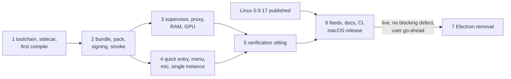

=== FILE: plan.md ===
---
title: "Sai ATLAS on Tauri for macOS (arm64), then remove Electron"
description: "Build, port and verify the Tauri shell on Apple Silicon, ship it in the first release after 0.9.17, then delete Electron from the repo."
status: pending
priority: P1
effort: 12d
branch: tung491/tauri_macos
tags: [tauri, macos, packaging, release, electron-removal]
created: 2026-10-08
---

# Sai ATLAS on Tauri for macOS (arm64), then remove Electron

This plan replaces Phase 12 of the parent plan [`plans/261002-1441-tauri-shell-migration/`](../261002-1441-tauri-shell-migration/plan.md) ([phase 12](../261002-1441-tauri-shell-migration/phase-12-macos-windows-cutover-electron-removal.md)). It is written for a Sonnet-class executor: every task names its files, its steps and a mechanical Verify, and every phase file carries its own Failure Protocol. Stopping on a failed Verify is the intended behavior, not a stall.

## Outcome

On an Apple Silicon Mac, `bun run package:tauri:mac:arm64` produces an ad-hoc signed, hardened-runtime `Sai ATLAS.app` (Tauri 2, WKWebView) whose bundled `omp` sidecar starts with the assistant pack from `Contents/Resources/assistant-pack`, dies with the app on a `kill -9`, and passes `scripts/tauri-mac-smoke.sh`. The first release after 0.9.17 publishes `Sai-ATLAS-<v>-arm64.dmg`, `Sai-ATLAS-<v>-arm64.zip`, the `omp-<v>-arm64.dmg` bridge copy and an arm64-only `latest-mac.yml` with `minimumSystemVersion: 22.4.0`, next to the Linux assets. After that release is live with no blocking defect and the user says so, Electron, electron-builder, electron-vite, `src/main/**`, `src/preload/**` and the Playwright suite are removed, and the docs describe one Tauri app on macOS and Linux.

## Decisions

| Topic | Decision | Source |
|---|---|---|
| Scope | macOS cutover first; Electron removal is the last phase, gated on the macOS Tauri release being live with no blocking defect | User, 2026-10-08 |
| Architecture | arm64 only. No Intel DMG/ZIP, no `build:omp:x64`, no `package:tauri:mac:x64`; `latest-mac.yml` lists arm64 assets only; AGENTS.md's release flow is rewritten to match | User, 2026-10-08 |
| Sidecar source | Clone `nornzach/oh-my-pi` to `~/WORK/oh-my-pi`, clone this GUI repo to `~/WORK/oh-my-pi/packages/gui`, run `bun run build:omp` there, copy `resources/omp` into the worktree | User, 2026-10-08 |
| Population | Fresh installs only: no Mac build was ever published from `tung491/oh-my-pi-gui`; no Electron-to-Tauri update handover is tested on macOS. The `omp-<v>-arm64.dmg` bridge copy stays until 1.0.0 | User, 2026-10-08 |
| Release timing | macOS Tauri ships in the first release after 0.9.17 (0.9.18 or later); Linux 0.9.17 follows its own plan | User, 2026-10-08 |
| Windows | Out of scope; skip every Windows step | User, 2026-10-05 |
| Pack location | Keep the sidecar as `externalBin` (`Contents/MacOS/omp`, signed as nested code). Ship the pack as a bundle resource (`Contents/Resources/assistant-pack`) and teach `assistant_pack::resolve_pack_dir` to look at `<binary dir>/../Resources/assistant-pack` when the binary sits in a `Contents/MacOS` directory | Planner: non-code files under `Contents/MacOS` break the code-signature seal; `paths.rs:223-234` already finds `Contents/MacOS/omp` |
| Signing | Tauri builds the `.app` only (`targets: ["app"]`, `hardenedRuntime: true`). A new `src-tauri/macos/finalize-mac.ts` re-signs `Contents/MacOS/omp` ad hoc with `--options runtime` and `src-tauri/macos/omp.entitlements`, re-seals the app with `src-tauri/macos/app.entitlements` (no `--deep`), verifies the seal, and builds the DMG with `hdiutil`, so the DMG always holds the finished signature. `scripts/release-feeds.ts` keeps making the ZIP with `ditto` | Planner: the Tauri bundler would sign the sidecar with the app's entitlements (no JIT), and its DMG would be stale after a re-sign |
| Sidecar entitlements | Start with the two keys in `omp.entitlements`. If the signed sidecar fails `scripts/check-assistant-pack.ts` with a library-validation error, add `com.apple.security.cs.disable-library-validation` (Electron's inherited set had it) and update its test | Planner, pre-authorized fallback in Phase 2 |
| macOS GPU name and RAM | Read `hw.memsize` and `machdep.cpu.brand_string` through `sysctlbyname`. On Apple Silicon the chip name is the GPU's name; this replaces the parent plan's `system_profiler` call, which takes 1-3 s against the 2 s probe timeout (`HARDWARE_PROBE_TIMEOUT_MS`, `ollama/hardware.rs:15`) | Planner, justified by the arm64-only decision |
| System proxy | `scutil --proxy`: HTTPS proxy, else HTTP proxy, as `http://host:port`; a PAC-only setup gives no proxy plus one runtime-log line | Parent plan Task 12.1 |
| Sidecar lifetime | Supervisor as on Linux, plus a kqueue `EVFILT_PROC`/`NOTE_EXIT` wait on the GUI pid and a `proc_listchildpids` descendant snapshot refreshed every second while omp runs; the shutdown sweep SIGKILLs tracked survivors that were reparented to launchd | Parent plan Decisions (Sidecar supervisor) |
| Quick-entry ⌘ chords | Block them in the bar's renderer (`QuickEntryBar.tsx`, keydown capture, `preventDefault`) with the predicate moved to `src/shared/quick-entry-chord.ts`; the Electron main process re-exports it until removal | Planner: Tauri has no `before-input-event`; the Rust `is_blocked_menu_chord` (`desktop/quick_entry_core.rs:153`) has no caller |
| Quick-entry panel | Keep `tauri-nspanel` 2.1.0; add the Mission Control collection behavior and make the panel key on show. If 2.1.0 cannot build against Tauri 2.12, fall back to a plain always-on-top window visible on all workspaces and record the degradation for the user | Parent plan Task 12.1 step 5 |
| macOS GUI tests | No WebDriver for WKWebView. macOS is verified by the Rust and vitest suites run on the Mac, a packaged smoke script (`scripts/tauri-mac-smoke.sh`: bundle layout, plist, signatures, sidecar pack check, process tree, single instance, `kill -9` cleanup, real-profile guard) and one batched NEEDS-HUMAN sitting. The WebdriverIO suite stays Linux-only | Planner |
| Port-by-test gate after removal | `check-test-parity.ts` and `e2e-tauri/check-twins.ts` compare against `src/main/**` tests and `e2e/**` specs that the removal deletes. Both gates retire with Electron; the Rust and WebdriverIO suites stay | Planner |
| Script names | Keep the `*:tauri*` script names; only Electron scripts are removed and `build` is repointed to the Tauri renderer. Renaming would churn docs and tests for no behavior | Planner (KISS) |
| CI | Add a `tauri-macos` job (macos-14, arm64: renderer build, clippy, `cargo test`) once macOS ships Tauri | Planner: CI on ubuntu cannot compile `cfg(target_os = "macos")` code |

## Phases

| # | Phase | Depends on | Effort | Status |
|---|---|---|---|---|
| 1 | [Mac toolchain, sidecar and first compile](./phase-01-mac-toolchain-sidecar-first-compile.md) | — | 1.5d | Pending |
| 2 | [A bundle that launches: pack, signing, DMG, smoke script](./phase-02-mac-bundle-pack-signing-smoke.md) | 1 | 2d | Pending |
| 3 | [Process and system branches: supervisor, proxy, RAM and GPU](./phase-03-process-and-system-branches.md) | 2 | 2d | Pending |
| 4 | [Desktop parity: quick entry, menu, microphone, single instance](./phase-04-desktop-parity.md) | 2 | 1.5d | Pending |
| 5 | [macOS verification sitting and parity report](./phase-05-mac-verification-sitting.md) | 3, 4 | 1d | Pending |
| 6 | [arm64-only feeds, docs, CI and the macOS Tauri release](./phase-06-mac-release.md) | 5, Linux 0.9.17 published | 1.5d | Pending |
| 7 | [Electron removal](./phase-07-electron-removal.md) | 6 live with no blocking defect, user go-ahead | 2.5d | Pending |



Phases 3 and 4 own disjoint files (Phase 3: `src-tauri/src/omp/supervisor.rs`, `src-tauri/src/omp/proxy.rs`, `src-tauri/src/ollama/hardware.rs`; Phase 4: `src-tauri/src/desktop/windows.rs`, `src-tauri/src/desktop/menu.rs`, `src/shared/quick-entry-chord.ts`, `src/renderer/quick-entry/QuickEntryBar.tsx`, `src/main/quick-entry-core.ts`). They share one worktree, so run them one after the other, in either order.

## Execution rules

- **Where.** Work in this worktree (`/Users/tung491/orca/workspaces/oh-my-pi-gui/tauri_macos`, branch `tung491/tauri_macos`). Run cargo through `~/.cargo/bin` (`source scripts/rust-pins.env && PATH="$CARGO_HOME_BIN:$PATH"`). The Mac's shell is zsh, which aborts on an unmatched glob: run every command that uses a glob or a multi-line script as `bash -c '…'`.
- **Sidecar build route.** `resources/omp` comes only from `~/WORK/oh-my-pi/packages/gui` (`bun run build:omp`), copied into this worktree. Build one target at a time there (the build patches the shared monorepo while it runs). Record the monorepo commit (`git -C ~/WORK/oh-my-pi rev-parse HEAD`) in `plans/261008-0341-tauri-macos-cutover/reports/mac-gates.md` every time you build it. Never commit `resources/omp*` or `src-tauri/binaries/*`.
- **Protect the user.** Every app run uses a throwaway profile and agent dir: `PI_CODING_AGENT_DIR="$(mktemp -d)"` in the environment and `--user-data-dir="$(mktemp -d)"` on the command line (`scripts/tauri-mac-smoke.sh` does both). Never copy an app into `/Applications`. Never open an `omp://` link unless a throwaway-profile instance of the app is already running (LaunchServices would otherwise start the app on the real profile). Unregister every scratch app after use with `/System/Library/Frameworks/CoreServices.framework/Frameworks/LaunchServices.framework/Support/lsregister -u "<app>"`. At the start and end of every phase run the guard `test ! -e "$HOME/Library/Application Support/@oh-my-pi/omp-gui" && echo REAL_PROFILE_ABSENT`; it must print `REAL_PROFILE_ABSENT` both times (the real profile did not exist on 2026-10-08). Also record `stat -f %m "$HOME/.omp/agent" 2>/dev/null || echo none` at the start and end of each phase; the two values must match.
- **Processes.** Track every process you start (command, PID, port). The dev server uses port 5183 (`scripts/tauri-dev.ts` maps this worktree to the integration port). On "address in use", find the owner with `lsof -nP -iTCP:5183 -sTCP:LISTEN` and stop it only if you started it; never pick another port. Before ending a phase, `pgrep -fl -- "--omp-supervise"` and `pgrep -fl "sai-atlas"` must print nothing you started. The app's windows appear on the user's real display (there is no virtual display on macOS); never send synthetic keyboard or mouse input to it.
- **`unsafe`.** Allowed with a `// SAFETY:` comment in `webview.rs`, `omp/manager.rs`, `omp/supervisor.rs` (now also the macOS `libc::proc_*` calls) and, new in this plan, `ollama/hardware.rs` (the `sysctlbyname` helper only). Nowhere else.
- **Public API.** New Rust items are private or `pub(crate)`, so `src-tauri/contracts/*.api.txt` never changes.
- **Gates on the Mac.** After any Rust change: `cargo clippy --manifest-path src-tauri/Cargo.toml --all-targets --all-features -- -D warnings` and `cargo test --manifest-path src-tauri/Cargo.toml --all-features` exit 0. After any TS change: `bun run check:types` and `bunx vitest run` exit 0, and `bunx biome check <touched files>` exits 0. `bash scripts/check-module.sh snapshots` must produce the same output as the Phase 1 baseline file. Linux-side regressions are caught by CI (`.github/workflows/ci.yml`, ubuntu) on a pushed branch.
- **Commits and pushes.** Commit to this GUI repo only (never the monorepo, never `can1357`), in conventional-commit format, following `.claude/rules/development-rules.md`: no plan IDs, phase numbers or audit labels in code comments, test names or commit messages. **Every `git push`, every tag and every GitHub Release step needs the user's explicit go-ahead at that moment.** Ask, wait for the answer, then run it.
- **Manual checks.** On-screen checks the executor cannot perform (TCC microphone prompt, quick entry over a full-screen app, the global chord, tray, notifications, `omp://` hand-off, ⌘W in the bar) are written as NEEDS-HUMAN rows and done in one sitting in Phase 5. Do not wait for them earlier.
- **Escalation.** Each phase file's Failure Protocol applies to every Verify, including the red-phase ones: a red test that passes, or fails for a reason other than the stated one, is a failed Verify.

## Acceptance criteria

- [ ] `grep -rn "is not implemented on this OS" src-tauri/src` prints nothing.
- [ ] On the Mac, `cargo clippy --manifest-path src-tauri/Cargo.toml --all-targets --all-features -- -D warnings` and `cargo test --manifest-path src-tauri/Cargo.toml --all-features` exit 0; CI on the pushed branch reports `success` for both jobs (`gh run list --branch tung491/tauri_macos --limit 1 --json conclusion --jq '.[0].conclusion'` prints `success`).
- [ ] `bunx vitest run` and `bun run check:types` exit 0 on the Mac.
- [ ] `bash scripts/tauri-mac-smoke.sh "<scratch copy of the release Sai ATLAS.app>"` prints `tauri-mac-smoke: PASS` as its last line.
- [ ] `grep -cE "^macOS [a-z0-9 -]+: PASS$" plans/261008-0341-tauri-macos-cutover/reports/mac-parity-report.md` prints at least `14` and `grep -cE ": FAIL$"` on the same file prints `0`.
- [ ] The published release `vX.Y.Z` (X.Y.Z > 0.9.17) carries `Sai-ATLAS-X.Y.Z-arm64.dmg`, `Sai-ATLAS-X.Y.Z-arm64.zip`, `omp-X.Y.Z-arm64.dmg`, `latest-mac.yml`, the Linux AppImage, `.deb` and `latest-linux.yml`, and no `Sai-ATLAS-X.Y.Z.dmg` (Intel).
- [ ] `curl -sL https://github.com/tung491/oh-my-pi-gui/releases/latest/download/latest-mac.yml` contains `minimumSystemVersion: 22.4.0` and `Sai-ATLAS-X.Y.Z-arm64.dmg`, and `bun run check:mac-update-floor <that file>` exits 0.
- [ ] After Phase 7: `bash -c 'grep -rlniE "electron|@playwright|src/main/" src scripts e2e-tauri package.json .github tsconfig.json tsconfig.node.json biome.json'` lists no file; `bun install`, `bunx vitest run`, `bun run check:types`, `bun run build`, clippy and `cargo test` exit 0; the Linux host's `scripts/virtual-display.sh run -- bun run test:e2e:tauri` exits 0; the tag `electron-final` exists on `origin`.
- [ ] AGENTS.md and README.md name no Intel build, no `package:mac:x64` and no `build:omp:x64`, and AGENTS.md's release flow lists one arm64 DMG, one arm64 ZIP and one `omp-<version>-arm64.dmg` bridge copy.

## Risks

| Risk | Likelihood × impact | Mitigation |
|---|---|---|
| macOS `cfg` code that never compiled (nspanel, supervisor, desktop) needs more than small fixes | High × Medium | Phase 1 compiles first, before any porting; nspanel fallback is pre-authorized; Failure Protocol on anything else |
| Bun's JIT or `pi_natives` loading fails under the hardened runtime with ad-hoc signing | Medium × High | Phase 2 Task 2.6 runs the pack check against the signed sidecar; the `disable-library-validation` fallback is pre-authorized |
| The packaged app cannot find the assistant pack | High (today) × High | Phase 2 pack resource + resolver test + smoke check S2/S10 |
| Tool children outlive a `kill -9` (no subreaper on macOS) | Medium × High | Phase 3 kqueue + descendant snapshot with Rust tests on the Mac; smoke check R7 |
| WKWebView refuses the microphone | Low × High | Phase 4 Task 4.6 checks wry's media-capture delegate in source; dictation is a NEEDS-HUMAN row; a missing delegate stops the phase |
| ⌘W in the quick-entry bar closes the main window | Medium × Medium | Renderer-side block with vitest; NEEDS-HUMAN row confirms WKWebView honors `preventDefault` for key equivalents |
| A mac-only release breaks Linux updaters (`latest/download/latest-linux.yml` must exist on every latest release) | Medium × High | Phase 6 precondition: the Linux bundles for the same version come from the Linux host; the draft is published only with every asset uploaded |
| Opening `omp://` or a second launch touches the user's real profile | Low × High | Execution rules: throwaway profile already running, `lsregister -u`, real-profile guard every phase |
| `check-module.sh snapshots` differs on macOS because of `cfg(target_os = "linux")` items | Medium × Low | Phase 1 records the Mac baseline output; later runs must match it byte for byte; CI on ubuntu stays authoritative |
| macOS 13.0-13.2 cannot open the 13.3-floor build | Low × Medium | `MAC_UPDATE_FLOOR` rises to 22.4.0; README states macOS 13.3 or later. No macOS 13 host exists to re-test the floor (unresolved question 2) |
| Removal deletes something a kept script imports | Medium × Medium | Phase 7 moves `sidecarOutName`, the pack spawn helpers, the fake Ollama, `e2e/desktop-prefs.ts`, `e2e/sidecar-fixture.ts` and the tray mark first, each with a green check before any delete; `electron-final` tag for rollback |

## Rollback

- Phases 1-5 change only this branch: revert the phase's commits (`git revert <sha>…`). Nothing is published.
- Phase 6: a broken macOS release is fixed forward with a new version (fresh installs only, nobody is moved by an updater). If the macOS DMG must be withdrawn, delete only the macOS assets and `latest-mac.yml` from the release after the user's go-ahead, never the Linux ones, and point the README's macOS row back to the previous text.
- Phase 7: `git revert` the removal commits, or branch from the `electron-final` tag.

## Unresolved questions

1. Version number: is the macOS release 0.9.18, or does the user want a different number (it must be greater than 0.9.17)?
2. Floor: 13.3 is kept from the Tauri config (Safari 16.4 WebKit). No macOS 13 host exists to test it; accept it as is?
3. `scripts/capture-showcase.ts` (with `scripts/showcase-data.ts`, `scripts/showcase-fixture.ts`) drives Electron through Playwright. Delete it in Phase 7, or keep it out of the removal and port it later?
4. Sidecar commit: the Linux machine carries a local monorepo fix (`fix/rpc-unset-setting`, parent plan Validation Log) that the fork does not. Should the Mac sidecar carry it too (cherry-pick in `~/WORK/oh-my-pi`), so both OSes ship the same agent?

=== FILE: phase-01-mac-toolchain-sidecar-first-compile.md ===
---
phase: 1
title: "Mac toolchain, sidecar and first compile"
status: pending
priority: P1
effort: "1.5d"
dependencies: []
---

# Phase 1: Mac toolchain, sidecar and first compile

## Goal

Every tool the later phases need is installed on this Mac, `resources/omp` and `resources/assistant-pack` exist in the worktree and pass the pack check, the Rust core compiles and passes clippy and its tests for `aarch64-apple-darwin`, the dev shell starts a supervised sidecar in a WKWebView window, and the baseline of every gate is recorded. This is the de-risking phase: no `cfg(target_os = "macos")` code has ever compiled before.

## Context

- Host: macOS 27.0 arm64, Command Line Tools only, Rust 1.93 at `~/.cargo/bin`, target `aarch64-apple-darwin`, no `cargo tauri`, no `~/WORK/oh-my-pi`.
- Pins: `scripts/rust-pins.env` (`CARGO_PUBLIC_API_VERSION="0.52.0"`, `PUBLIC_API_TOOLCHAIN="nightly-2026-10-01"`); `scripts/tauri-linux-build/Dockerfile:60` pins `TAURI_CLI_VERSION=2.12.1`.
- `scripts/tauri-dev.ts:86` probes the dev port with `ss`, which does not exist on macOS, so the busy-port refusal silently never fires there.
- Results go to `plans/261008-0341-tauri-macos-cutover/reports/mac-gates.md` (create it in Task 1.1).

## Test matrix

| Area | Test | Kind |
|---|---|---|
| Dev port probe | `scripts/tauri-dev.test.ts` (new): Linux uses `ss`, macOS uses `lsof`, busy/free parsing for both | vitest, red then green |
| Rust core on macOS | `cargo check`, `cargo clippy -D warnings`, `cargo test --all-features` | compile + unit |
| Sidecar | `bun scripts/check-assistant-pack.ts resources/omp` | integration |
| Dev shell | supervised omp appears under the dev app | manual-free process check |
| Regression gate | `bun run check:types`, `bunx vitest run`, snapshots baseline, test parity, CI on the pushed branch | gates |

## Tasks

### Task 1.1: Start the gates record and the real-profile guard
- Goal: a results file exists and the protection baseline is recorded.
- Target files: `plans/261008-0341-tauri-macos-cutover/reports/mac-gates.md` (create).
- Steps:
  1. Run `test ! -e "$HOME/Library/Application Support/@oh-my-pi/omp-gui" && echo REAL_PROFILE_ABSENT`.
  2. Run `stat -f %m "$HOME/.omp/agent" 2>/dev/null || echo none` and note the value.
  3. Create `mac-gates.md` with a heading `# macOS gates` and two lines: `real profile: <output of step 1>` and `~/.omp/agent mtime at start: <output of step 2>`.
- Success criteria: the file exists with both lines.
- Verify: `grep -c "REAL_PROFILE_ABSENT" plans/261008-0341-tauri-macos-cutover/reports/mac-gates.md` prints `1`.

### Task 1.2: Install tauri-cli 2.12.1
- Goal: `cargo tauri` works and matches the Linux build image.
- Target files: none in the repo.
- Steps:
  1. `~/.cargo/bin/cargo install tauri-cli --version 2.12.1 --locked`
- Success criteria: the binary `~/.cargo/bin/cargo-tauri` exists.
- Verify: `~/.cargo/bin/cargo tauri --version` exits 0 and prints `tauri-cli 2.12.1`.

### Task 1.3: Install cargo-public-api and its nightly
- Goal: the snapshot gate can run.
- Steps:
  1. `~/.cargo/bin/rustup toolchain install nightly-2026-10-01 --profile minimal`
  2. `~/.cargo/bin/cargo install cargo-public-api --version 0.52.0 --locked`
- Success criteria: both are installed.
- Verify: `~/.cargo/bin/cargo public-api --version` prints `cargo-public-api 0.52.0`, and `~/.cargo/bin/rustup run nightly-2026-10-01 rustc --version` exits 0.

### Task 1.4: Clone the monorepo and nest the GUI repo
- Goal: the AGENTS.md "Nested Checkout Layout" exists at `~/WORK/oh-my-pi`.
- Steps:
  1. If `~/WORK/oh-my-pi` exists, STOP and ask the user (do not overwrite). Otherwise `git clone https://github.com/nornzach/oh-my-pi ~/WORK/oh-my-pi`.
  2. `git clone https://github.com/tung491/oh-my-pi-gui ~/WORK/oh-my-pi/packages/gui`
  3. `git -C ~/WORK/oh-my-pi/packages/gui checkout 83d393c` (the commit this worktree branched from; later phases check out the commit they need).
  4. `cd ~/WORK/oh-my-pi && bun install`, then `cd ~/WORK/oh-my-pi/packages/gui && bun install`.
  5. Append `monorepo commit: <git -C ~/WORK/oh-my-pi rev-parse HEAD>` to `mac-gates.md`.
- Success criteria: both clones exist; `bun install` exited 0 in both.
- Verify: `test -d ~/WORK/oh-my-pi/packages/coding-agent && test -f ~/WORK/oh-my-pi/packages/gui/AGENTS.md && echo LAYOUT_OK` prints `LAYOUT_OK`.

### Task 1.5: Build the arm64 sidecar and the assistant pack
- Goal: `resources/omp` (arm64) and `resources/assistant-pack` exist in this worktree and the sidecar loads exactly the pack.
- Target files: `resources/omp`, `resources/assistant-pack/` (both gitignored build outputs).
- Steps:
  1. `cd ~/WORK/oh-my-pi/packages/gui && bun run build:omp` (applies `patches/omp/*.patch`, compiles, reverts).
  2. `cp ~/WORK/oh-my-pi/packages/gui/resources/omp /Users/tung491/orca/workspaces/oh-my-pi-gui/tauri_macos/resources/omp`
  3. In this worktree: `bun install` then `bun run build:pack`.
  4. `bun scripts/check-assistant-pack.ts resources/omp`
- Success criteria: the pack check reports no failed row.
- Verify: `file resources/omp` prints a line containing `Mach-O 64-bit executable arm64`, and `bun scripts/check-assistant-pack.ts resources/omp` exits 0.

### Task 1.6: Build the Tauri renderer
- Goal: `tauri::generate_context!` finds `out/renderer-tauri`.
- Steps: `bun run build:renderer:tauri`
- Verify: `test -f out/renderer-tauri/index.html && echo RENDERER_OK` prints `RENDERER_OK`.

### Task 1.7: Baseline the TypeScript gates on macOS
- Goal: the TS suites pass on this Mac before any change.
- Steps:
  1. `bun run check:types`
  2. `bunx vitest run`
  3. Append `check:types: exit <n>` and `vitest: exit <n>` to `mac-gates.md`.
- Success criteria: both exit 0. A test that fails only because it assumes Linux (for example it shells out to `dpkg-deb`) is a failed Verify: report it, do not skip it.
- Verify: `bun run check:types` exits 0 and `bunx vitest run` exits 0.

### Task 1.8: Teach `tauri-dev.ts` to probe the port on macOS (red)
- Goal: a failing test pins the macOS port probe.
- Target files: `scripts/tauri-dev.test.ts` (create), `scripts/tauri-dev.ts`.
- Steps:
  1. In `scripts/tauri-dev.ts`, add two exported stubs next to `devPortForWorktree` so the test compiles:
     ```ts
     export function portOwnerProbe(platform: NodeJS.Platform, port: number): [string, string[]] {
     	return ["ss", ["-ltnp", `sport = :${port}`]];
     }
     export function portIsBusy(platform: NodeJS.Platform, status: number | null, stdout: string): boolean {
     	return false;
     }
     ```
  2. Create `scripts/tauri-dev.test.ts` (vitest) with:
     - `it("probes the dev port with ss on Linux")`: `expect(portOwnerProbe("linux", 5183)).toEqual(["ss", ["-ltnp", "sport = :5183"]])`.
     - `it("probes the dev port with lsof on macOS")`: `expect(portOwnerProbe("darwin", 5183)).toEqual(["lsof", ["-nP", "-iTCP:5183", "-sTCP:LISTEN"]])`.
     - `it("reads ss output as busy only when a socket line follows the header")`: `portIsBusy("linux", 0, "State Recv-Q\n")` is `false`; `portIsBusy("linux", 0, "State Recv-Q\nLISTEN 0 511 *:5183\n")` is `true`.
     - `it("reads lsof output as busy when it lists a listener")`: `portIsBusy("darwin", 1, "")` is `false`; `portIsBusy("darwin", 0, "COMMAND PID\nnode 42 u IPv6 TCP *:5183 (LISTEN)\n")` is `true`.
- Success criteria: the new tests fail on the stubs.
- Verify: `bunx vitest run scripts/tauri-dev.test.ts` exits non-zero with assertion failures in the macOS tests and the busy tests; a passing run is a failure.

### Task 1.9: Implement the port probe (green)
- Goal: the dev script refuses a busy port on macOS too.
- Target files: `scripts/tauri-dev.ts` (`portOwnerProbe`, `portIsBusy`, `main`).
- Steps:
  1. `portOwnerProbe`: return `["lsof", ["-nP", `-iTCP:${port}`, "-sTCP:LISTEN"]]` when `platform === "darwin"`, else the `ss` pair.
  2. `portIsBusy`: for `darwin`, `status === 0 && stdout.trim().length > 0`; otherwise the current logic (`status === 0` and any non-empty line after the first).
  3. In `main`, replace the inline `spawnSync("ss", …)` and `busy` computation with `const [command, args] = portOwnerProbe(process.platform, port); const owner = spawnSync(command, args, { encoding: "utf8" }); const busy = portIsBusy(process.platform, owner.status, owner.stdout ?? "");`.
- Success criteria: all four tests pass.
- Verify: `bunx vitest run scripts/tauri-dev.test.ts` exits 0, and `bunx biome check scripts/tauri-dev.ts scripts/tauri-dev.test.ts` exits 0.

### Task 1.10: First macOS compile
- Goal: the Rust core compiles for `aarch64-apple-darwin` with every feature.
- Target files: only files the compiler names. Allowed edits: `cfg` attributes, code inside `#[cfg(target_os = "macos")]` or `#[cfg(not(target_os = "linux"))]` blocks, and imports that are unused only on macOS. Never change a Linux code path.
- Steps:
  1. `bash -c 'source scripts/rust-pins.env && PATH="$CARGO_HOME_BIN:$PATH" cargo check --manifest-path src-tauri/Cargo.toml --all-targets --all-features 2>&1 | tee "$TMPDIR/mac-check.txt"'`
  2. If it fails only in `src-tauri/src/desktop/windows.rs` around the `tauri_nspanel` block (lines 1026-1035): open `bash -c 'ls ~/.cargo/registry/src/*/tauri-nspanel-2.1.0/'` and its `README.md`, and rewrite only that block with the crate's documented 2.1.0 API so it still (a) converts the quick-entry window to a panel, (b) sets the non-activating style mask, (c) keeps `hides_on_deactivate` false. If the crate itself fails to compile against Tauri 2.12 (errors inside `tauri-nspanel-2.1.0/src`), apply the fallback: delete the `[target.'cfg(target_os = "macos")'.dependencies]` `tauri-nspanel = "2"` lines from `src-tauri/Cargo.toml`, replace the macOS block with `let _ = window.set_visible_on_all_workspaces(true);`, run `cargo check` again, and add the line `quick-entry: nspanel fallback (always-on-top window); NEEDS user acceptance` to `mac-gates.md`.
  3. Any other error: apply the allowed edits above only when the fix is a missing `cfg`, an unused-on-macOS import or variable, or a type that differs only on macOS. Anything else follows the Failure Protocol.
- Success criteria: `cargo check` exits 0.
- Verify: `bash -c 'source scripts/rust-pins.env && PATH="$CARGO_HOME_BIN:$PATH" cargo check --manifest-path src-tauri/Cargo.toml --all-targets --all-features'` exits 0.

### Task 1.11: Clippy and tests on macOS
- Goal: the Rust gates are green on the Mac.
- Steps:
  1. `cargo clippy --manifest-path src-tauri/Cargo.toml --all-targets --all-features -- -D warnings` (with the `rust-pins.env` PATH). Fix warnings under the same edit limits as Task 1.10.
  2. `cargo test --manifest-path src-tauri/Cargo.toml --all-features`.
  3. Append both exit codes to `mac-gates.md`. If a test fails, list its full name in `mac-gates.md` and follow the Failure Protocol (do not `#[ignore]` or `cfg`-gate a failing test on your own).
- Verify: both commands exit 0.

### Task 1.12: Record the snapshot and parity baselines
- Goal: later phases can prove they changed no public API.
- Target files: `plans/261008-0341-tauri-macos-cutover/reports/mac-snapshots-baseline.txt` (create).
- Steps:
  1. `bash -c 'bash scripts/check-module.sh snapshots > plans/261008-0341-tauri-macos-cutover/reports/mac-snapshots-baseline.txt 2>&1; echo "exit $?" >> plans/261008-0341-tauri-macos-cutover/reports/mac-snapshots-baseline.txt'`
  2. `bash -c 'for parity in src-tauri/contracts/*.parity.json; do bun scripts/check-test-parity.ts "$(basename "$parity" .parity.json)" || exit 1; done'`
- Success criteria: the baseline file exists; the parity loop exits 0. The snapshot gate may differ on macOS because of `cfg(target_os = "linux")` items; whatever it prints is the baseline (exit 0 or not), and every later run must print the same diff.
- Verify: `test -s plans/261008-0341-tauri-macos-cutover/reports/mac-snapshots-baseline.txt && echo BASELINE_OK` prints `BASELINE_OK`, and the parity loop exits 0.

### Task 1.13: First dev run with a supervised sidecar
- Goal: a WKWebView window opens and the dev shell spawns supervisor → omp.
- Steps:
  1. `lsof -nP -iTCP:5183 -sTCP:LISTEN` must print nothing (else stop the owner only if you started it).
  2. Start in the background: `PI_CODING_AGENT_DIR="$(mktemp -d)" bun run dev:tauri -- --user-data-dir="$(mktemp -d)"` and note its PID.
  3. Wait up to 180 s (first build) for `pgrep -f -- "--omp-supervise"` to print a PID (call it SUP), then `pgrep -P <SUP>` must print one PID (omp).
  4. Stop what you started: `kill <dev PID>`; then `pkill -f -- "--user-data-dir=$TMPDIR"` only if a `sai-atlas` you started is still listed by `pgrep -fl sai-atlas`.
- Success criteria: SUP and its omp child were both seen; nothing you started is left.
- Verify: during step 3, `pgrep -P "$(pgrep -f -- --omp-supervise | head -1)"` prints at least one PID; after step 4, `pgrep -fl -- "--omp-supervise"` prints nothing.

### Task 1.14: Commit and ask to push for Linux CI
- Goal: Linux CI proves the macOS fixes did not regress Linux.
- Steps:
  1. Commit (`fix(tauri): compile the macOS build` for Rust fixes; `fix(dev): detect a busy dev port on macOS` for the script). Do not commit `mac-gates.md` changes containing machine paths you would not publish; plan reports may be committed.
  2. Ask the user: "May I push branch tung491/tauri_macos to origin so CI runs on Linux?" Push only after a yes: `git push -u origin tung491/tauri_macos`.
  3. `gh run watch --exit-status "$(gh run list --branch tung491/tauri_macos --limit 1 --json databaseId --jq '.[0].databaseId')"`
- Success criteria: CI is green. If the user declines the push, record `CI: deferred by user` in `mac-gates.md` and continue; Phase 6 cannot start until CI is green.
- Verify: `gh run list --branch tung491/tauri_macos --limit 1 --json conclusion --jq '.[0].conclusion'` prints `success` (or `mac-gates.md` contains `CI: deferred by user`).

### Task 1.15: Close the phase guard
- Verify: `test ! -e "$HOME/Library/Application Support/@oh-my-pi/omp-gui" && echo REAL_PROFILE_ABSENT` prints `REAL_PROFILE_ABSENT`, and `stat -f %m "$HOME/.omp/agent" 2>/dev/null || echo none` prints the value recorded in Task 1.1.

## Regression gate

`bun run check:types`, `bunx vitest run`, clippy `-D warnings`, `cargo test --all-features`, the parity loop, and snapshot output identical to `mac-snapshots-baseline.txt`, all on the Mac; CI green on the pushed branch.

## Risks

- tauri-nspanel 2.1.0 incompatibility (High × Medium): pre-authorized fallback in Task 1.10.
- Monorepo `bun install` or natives provisioning fails on macOS 27 (Medium × High): Failure Protocol; no workaround is pre-authorized.

## Rollback

`git revert` this phase's commits. The installed tools and `~/WORK/oh-my-pi` can stay; they touch nothing of the user's.

## Failure Protocol
If any Verify step does not meet its stated pass condition, STOP this phase.
Do not improvise a fix, retry blindly, or reason around the failure.
Spawn the `kongming` subagent for next-step counsel and pass:
- the phase and task id,
- what you attempted (the steps you ran),
- the exact command and its full output,
- the pass condition it failed to meet.
Apply kongming's guidance, then re-run the Verify step.
If `kongming` cannot be spawned in this environment, STOP and report the same
failure evidence to the user. Never continue by self-reasoning.

=== FILE: phase-02-mac-bundle-pack-signing-smoke.md ===
---
phase: 2
title: "A bundle that launches: pack, signing, DMG, smoke script"
status: pending
priority: P1
effort: "2d"
dependencies: [1]
---

# Phase 2: A bundle that launches: pack, signing, DMG, smoke script

## Goal

`bun run package:tauri:mac:arm64` builds the pack, stages the sidecar, builds `Sai ATLAS.app`, re-signs the sidecar with its own entitlements under the hardened runtime, re-seals the app and writes the DMG. The packaged app finds the pack in `Contents/Resources/assistant-pack` and `scripts/tauri-mac-smoke.sh` passes against a scratch copy. The Intel Tauri script and staging entry are gone.

## Context

- Today the mac overlay `src-tauri/macos/sidecar.conf.json` names only `externalBin: ["binaries/omp"]`, so no pack ships; `package.json` `package:tauri:mac:arm64` skips `build:pack` (`package:tauri:linux` runs it).
- `src-tauri/src/omp/assistant_pack.rs:42-57` `resolve_pack_dir(binary, search_from)`: `assistant-pack/` beside the binary, else a walk-up for `resources/assistant-pack` from `search_from`, which is empty in a packaged build (`omp/manager.rs:468-474` `pack_search_from`). With the sidecar at `Contents/MacOS/omp`, the packaged app refuses every session today.
- `src-tauri/tauri.macos.conf.json`: `targets ["dmg","app"]`, `minimumSystemVersion "13.3"`, `signingIdentity "-"`, `entitlements "macos/app.entitlements"`; no `hardenedRuntime` key.
- `src-tauri/macos/omp.entitlements` (allow-jit, allow-unsigned-executable-memory) is referenced by nothing.
- `scripts/tauri-packaging-config.test.ts` asserts today's mac config: targets `["dmg","app"]` (line 170), `resources` undefined for the mac overlay (line 189), the `package:tauri:mac:x64` script (line 217), and the exact entitlement dicts (lines 545-553).
- `scripts/release-feeds.ts` reads `<bundle>/dmg/*.dmg` (`onlyBundle`, name must contain `_<version>_`) and zips `<bundle>/macos/*.app` with `ditto` (`macZip`).
- `bun scripts/check-assistant-pack.ts <omp> [<pack dir>]` runs the sidecar with the shells' pack flags and exits 1 naming every failed check.

## Test matrix

| Area | Test | Kind |
|---|---|---|
| Pack lookup in a `.app` | `assistant_pack.rs` test `resolves_the_pack_in_the_bundle_resources_for_a_macos_app` | Rust unit, red then green |
| Bundle config | `scripts/tauri-packaging-config.test.ts`: mac overlay ships the pack resource; targets `["app"]`; `hardenedRuntime: true`; one mac package script, which builds the pack and finalizes; no x64 staging | vitest, red then green |
| Finalize | `scripts/finalize-mac.test.ts` (new): command builder order and flags; on darwin, a fake `.app` gets the sidecar entitlements and a valid seal | vitest, red then green |
| Packaged app | `scripts/tauri-mac-smoke.sh`: red against the pre-change bundle, green after | packaged smoke |
| Signed sidecar | `bun scripts/check-assistant-pack.ts "<app>/Contents/MacOS/omp" "<app>/Contents/Resources/assistant-pack"` | integration |
| Regression gate | clippy, `cargo test`, `check:types`, `vitest`, snapshots = baseline | gates |

## Tasks

### Task 2.1: Write the packaged smoke script
- Goal: one command checks a built `.app` statically and at runtime, without touching the user's profile.
- Target files: `scripts/tauri-mac-smoke.sh` (create, `chmod +x`).
- Steps: write a `#!/usr/bin/env bash` script with `set -euo pipefail`, usage `bash scripts/tauri-mac-smoke.sh <path/to/Sai ATLAS.app>`, a `fail()` that prints `tauri-mac-smoke: FAIL: <message>` to stderr and exits 1, and a `trap cleanup EXIT` that kills every PID the script started, runs `lsregister -u "$APP"` (full path in the Execution rules) and removes the scratch dirs. Checks, in order (each prints `ok <id>` on success):
  1. S0 real-profile snapshot: `REAL="$HOME/Library/Application Support/@oh-my-pi/omp-gui"`; record `REAL_BEFORE=$( [ -e "$REAL" ] && stat -f %m "$REAL" || echo absent )`.
  2. S1 `file "$APP/Contents/MacOS/omp"` contains `arm64`, else `fail "sidecar is not an arm64 binary"`.
  3. S2 `test -f "$APP/Contents/Resources/assistant-pack/package.json"`, else `fail "assistant pack missing from Contents/Resources"`.
  4. S3 `/usr/libexec/PlistBuddy -c "Print :CFBundleIdentifier" "$APP/Contents/Info.plist"` equals `vn.io.vif.saiatlas`.
  5. S4 `/usr/libexec/PlistBuddy -c "Print :CFBundleURLTypes:0:CFBundleURLSchemes:0" "$APP/Contents/Info.plist"` equals `omp`, else `fail "omp:// is not registered in Info.plist"`.
  6. S5 `Print :LSMinimumSystemVersion` equals `13.3`; `Print :NSMicrophoneUsageDescription` contains `Sai ATLAS`.
  7. S6 `codesign --verify --deep --strict "$APP"` exits 0.
  8. S7 `codesign -dv "$APP" 2>&1` contains `runtime` (hardened runtime flag) and `Identifier=vn.io.vif.saiatlas`.
  9. S8 `codesign -d --entitlements - --xml "$APP" 2>/dev/null` contains `com.apple.security.device.audio-input` and does not contain `allow-jit`.
  10. S9 `codesign -d --entitlements - --xml "$APP/Contents/MacOS/omp" 2>/dev/null` contains `com.apple.security.cs.allow-jit` and `com.apple.security.cs.allow-unsigned-executable-memory`; `codesign -dv "$APP/Contents/MacOS/omp" 2>&1` contains `runtime`.
  11. S10 `bun scripts/check-assistant-pack.ts "$APP/Contents/MacOS/omp" "$APP/Contents/Resources/assistant-pack"` exits 0.
  12. R1 launch A: `SCRATCH=$(mktemp -d)`; `mkdir -p "$SCRATCH/a" "$SCRATCH/b" "$SCRATCH/agent"`; write `{"welcome":{"completed":"2026-01-01T00:00:00.000Z"}}` to `$SCRATCH/a/prefs.json` and `$SCRATCH/b/prefs.json`; start `PI_CODING_AGENT_DIR="$SCRATCH/agent" "$APP/Contents/MacOS/sai-atlas" --user-data-dir="$SCRATCH/a" >"$SCRATCH/a.log" 2>&1 &`, `GUI=$!`.
  13. R2 within 30 s, `SUP=$(pgrep -P "$GUI" -f -- --omp-supervise | head -1)` is non-empty and `OMP=$(pgrep -P "$SUP" | head -1)` is non-empty, else `fail "no supervised sidecar within 30 s"`.
  14. R3 `sleep 15`; `kill -0 "$OMP"` succeeds and `pgrep -P "$SUP" | head -1` still equals `$OMP`; `grep -c "sidecar-restart" "$SCRATCH/a/logs/gui-runtime.jsonl" 2>/dev/null || true` prints `0` or nothing; `grep -ci "assistant pack" "$SCRATCH/a/logs/gui-runtime.jsonl" 2>/dev/null || true` prints `0` or nothing.
  15. R4 second instance, same profile: run `PI_CODING_AGENT_DIR="$SCRATCH/agent" "$APP/Contents/MacOS/sai-atlas" --user-data-dir="$SCRATCH/a"` in the background, wait up to 15 s for it to exit; it must have exited, with status 0, and `kill -0 "$GUI"` must still succeed, else `fail "second instance on the same profile did not hand off"`.
  16. R5 other profile: start B with `--user-data-dir="$SCRATCH/b"` (same agent dir), `GUI_B=$!`; within 30 s `pgrep -P "$GUI_B" -f -- --omp-supervise` is non-empty and `kill -0 "$GUI"` still succeeds; then `kill -TERM "$GUI_B"` and wait up to 15 s for it to exit.
  17. R6 hard kill: `kill -9 "$GUI"`; within 10 s neither `kill -0 "$SUP"` nor `kill -0 "$OMP"` succeeds, else `fail "sidecar survived a kill -9 of the app"`.
  18. R7 real profile unchanged: the S0 expression evaluated again equals `REAL_BEFORE`, else `fail "the real profile was touched"`.
  19. Print `tauri-mac-smoke: PASS` as the last line.
- Success criteria: `bash -n scripts/tauri-mac-smoke.sh` exits 0.
- Verify: `bash -n scripts/tauri-mac-smoke.sh` exits 0, and `bash scripts/tauri-mac-smoke.sh /nonexistent.app` exits 1.

### Task 2.2: Build today's bundle and prove the smoke catches the missing pack (red)
- Goal: the unchanged config builds, and the smoke fails on the pack.
- Steps:
  1. `test -x resources/omp` (from Phase 1).
  2. `nice -n 10 bun run package:tauri:mac:arm64`
  3. `SCR=$(mktemp -d) && ditto "src-tauri/target/aarch64-apple-darwin/release/bundle/macos/Sai ATLAS.app" "$SCR/Sai ATLAS.app"`
  4. `bash scripts/tauri-mac-smoke.sh "$SCR/Sai ATLAS.app"`
- Success criteria: the build exits 0 (a first proof that the bundler works here); the smoke fails at S2.
- Verify: step 2 exits 0; step 4 exits 1 and its stderr contains `assistant pack missing from Contents/Resources`. Any other first failure is a failed Verify.

### Task 2.3: Resolve the pack from `Contents/Resources` (red)
- Goal: a failing test pins the macOS bundle layout.
- Target files: `src-tauri/src/omp/assistant_pack.rs` (tests module, next to `resolves_the_pack_beside_the_sidecar_binary`).
- Steps: add
  ```rust
  #[test]
  fn resolves_the_pack_in_the_bundle_resources_for_a_macos_app() {
      let root = tempfile::tempdir().unwrap();
      let contents = root.path().join("Sai ATLAS.app").join("Contents");
      let binary = contents.join("MacOS").join("omp");
      write_file(&binary);
      write_pack(&contents.join("Resources").join("assistant-pack"), ASSISTANT_PACK_FILES);
      assert_eq!(resolve_pack_dir(&binary, &[]), contents.join("Resources").join("assistant-pack"));
      // A pack beside the binary still wins, as on Linux.
      write_pack(&contents.join("MacOS").join("assistant-pack"), ASSISTANT_PACK_FILES);
      assert_eq!(resolve_pack_dir(&binary, &[]), contents.join("MacOS").join("assistant-pack"));
  }
  ```
  (`write_file` and `write_pack` already exist in that tests module.)
- Verify: `cargo test --manifest-path src-tauri/Cargo.toml --all-features resolves_the_pack_in_the_bundle_resources_for_a_macos_app` exits non-zero with an assertion failure (`left` ends in `MacOS/assistant-pack`); a pass is a failure.

### Task 2.4: Resolve the pack from `Contents/Resources` (green)
- Target files: `src-tauri/src/omp/assistant_pack.rs` (`resolve_pack_dir`, its doc comment).
- Steps:
  1. After the `beside` check and before the `search_from` loop, add: when the binary's parent directory's file name is `MacOS`, let `resources = absolute(parent.join("..").join("Resources").join(PACK_DIR_NAME))` normalized without following symlinks (use `parent.parent()` rather than `..`: `binary.parent().and_then(Path::parent).map(|contents| absolute(contents.join("Resources").join(PACK_DIR_NAME)))`); if it `is_dir()`, return it.
  2. Extend the doc comment: "In a macOS app bundle the sidecar is `Contents/MacOS/omp` and the pack is a bundle resource in `Contents/Resources`, outside the code directory the signature seals."
- Success criteria: the new test and every existing `assistant_pack` test pass; the fallback path in the error case is unchanged (still the beside path).
- Verify: `cargo test --manifest-path src-tauri/Cargo.toml --all-features assistant_pack` exits 0.

### Task 2.5: Bundle config, package script and finalize script tests (red)
- Goal: failing tests describe the finished mac packaging.
- Target files: `scripts/tauri-packaging-config.test.ts`, `scripts/finalize-mac.test.ts` (create).
- Steps:
  1. In `tauri-packaging-config.test.ts`:
     - line 170: expect `platform("macos").bundle?.targets` to equal `["app"]`.
     - "the macOS config ships binaries/omp as externalBin": keep the `externalBin` assertion and replace the `resources` assertion with `expect(bundled("macos").bundle?.resources).toEqual({ "../resources/assistant-pack/": "assistant-pack/" })`.
     - "every package:tauri script…": remove the `package:tauri:mac:x64` entry from `expected`; add `expect(scripts()["package:tauri:mac:arm64"]).toMatch(/^bun run build:pack && /)` and `expect(scripts()["package:tauri:mac:arm64"]).toContain("&& bun src-tauri/macos/finalize-mac.ts src-tauri/target/aarch64-apple-darwin/release/bundle")`.
     - in `describe("Windows")` → "the sidecar build and staging scripts name no windows target", or a new `it("stages no Intel macOS sidecar")` in "sidecar placement": `expect(Object.keys(SIDECAR_SOURCES)).toEqual(["x86_64-unknown-linux-gnu", "aarch64-apple-darwin"])`.
     - in "signs ad hoc with the app entitlements": add `expect(platform("macos").bundle?.macOS?.hardenedRuntime).toBe(true)` (extend the local `TauriConfig` type's `macOS` with `hardenedRuntime?: boolean` if the compiler asks).
  2. Create `scripts/finalize-mac.test.ts` importing `finalizeCommands` from `../src-tauri/macos/finalize-mac`:
     - `it("re-signs the sidecar with its own entitlements before sealing the app")`: for `finalizeCommands("/b/macos/Sai ATLAS.app", "/repo")`, the first command is `["codesign", "--force", "--sign", "-", "--options", "runtime", "--entitlements", "/repo/src-tauri/macos/omp.entitlements", "/b/macos/Sai ATLAS.app/Contents/MacOS/omp"]`, the second is the same with `app.entitlements` and the `.app` path, the third is `["codesign", "--verify", "--deep", "--strict", "/b/macos/Sai ATLAS.app"]`, and no command contains `--deep` together with `--sign`.
     - `it("names the DMG the release script expects")`: `dmgName("0.9.18")` equals `"Sai ATLAS_0.9.18_aarch64.dmg"`.
     - `it.runIf(process.platform === "darwin")("signs a bundle so the sidecar carries JIT and the app does not")`: in a temp dir build `X.app/Contents/{MacOS,Resources}`, copy `/bin/echo` to `Contents/MacOS/sai-atlas` and `Contents/MacOS/omp`, write a minimal `Contents/Info.plist` (`CFBundleExecutable` = `sai-atlas`, `CFBundleIdentifier` = `test.finalize`), run each command from `finalizeCommands` with `spawnSync` (all must exit 0), then assert `codesign -d --entitlements - --xml <omp>` output contains `allow-jit` and the same for the app does not.
- Success criteria: the tests fail (the finalize module does not exist yet, configs unchanged).
- Verify: `bunx vitest run scripts/tauri-packaging-config.test.ts scripts/finalize-mac.test.ts` exits non-zero; the failures are the new assertions and the unresolved `finalize-mac` import. A pass is a failure.

### Task 2.6: Configs, package script and finalize script (green)
- Target files: `src-tauri/macos/sidecar.conf.json`, `src-tauri/tauri.macos.conf.json`, `package.json` (`scripts`), `scripts/stage-tauri-sidecar.ts` (`SIDECAR_SOURCES`), `src-tauri/macos/finalize-mac.ts` (create).
- Steps:
  1. `src-tauri/macos/sidecar.conf.json`: `{"bundle": {"externalBin": ["binaries/omp"], "resources": {"../resources/assistant-pack/": "assistant-pack/"}}}` (tabs/indent as in the Linux overlay).
  2. `src-tauri/tauri.macos.conf.json`: `"targets": ["app"]` and `"hardenedRuntime": true` inside `bundle.macOS`.
  3. `scripts/stage-tauri-sidecar.ts`: delete the `"x86_64-apple-darwin": "resources/omp.x64"` entry.
  4. `package.json`: delete `package:tauri:mac:x64`; set `package:tauri:mac:arm64` to
     `bun run build:pack && bun scripts/stage-tauri-sidecar.ts aarch64-apple-darwin && bash -c 'source scripts/rust-pins.env && PATH="$CARGO_HOME_BIN:$PATH" cargo tauri build --target aarch64-apple-darwin --config src-tauri/macos/sidecar.conf.json' && bun src-tauri/macos/finalize-mac.ts src-tauri/target/aarch64-apple-darwin/release/bundle`
  5. `src-tauri/macos/finalize-mac.ts` (TypeScript, Bun, same style as `src-tauri/linux/finalize-deb.ts`): export `finalizeCommands(appPath: string, repoRoot: string): string[][]` (the three commands from Task 2.5) and `dmgName(version: string): string` (`Sai ATLAS_${version}_aarch64.dmg`). `main(bundleDir)` when run directly: find exactly one `*.app` in `<bundleDir>/macos` (else exit 1 naming the count); require `Contents/MacOS/omp` and `Contents/Resources/assistant-pack/package.json`; run each command (`spawnSync`, `stdio: "inherit"`, exit 1 on a non-zero status); read the version from `package.json`; create `<bundleDir>/dmg` and remove any `*.dmg` in it; stage `mktemp`-style dir holding a `ditto` copy of the app and a symlink `Applications -> /Applications`; run `hdiutil create -volname "Sai ATLAS" -srcfolder <stage> -ov -format UDZO <bundleDir>/dmg/<dmgName(version)>`; remove the stage; print the DMG path.
- Success criteria: the red tests pass.
- Verify: `bunx vitest run scripts/tauri-packaging-config.test.ts scripts/finalize-mac.test.ts scripts/release-feeds.test.ts` exits 0, and `bunx biome check src-tauri/macos/finalize-mac.ts scripts/finalize-mac.test.ts scripts/tauri-packaging-config.test.ts scripts/stage-tauri-sidecar.ts` exits 0.

### Task 2.7: Package and check the signed sidecar
- Goal: the bundle builds end to end and the hardened, ad-hoc signed sidecar loads the pack.
- Steps:
  1. `nice -n 10 bun run package:tauri:mac:arm64`
  2. `APP="src-tauri/target/aarch64-apple-darwin/release/bundle/macos/Sai ATLAS.app"`; `bun scripts/check-assistant-pack.ts "$APP/Contents/MacOS/omp" "$APP/Contents/Resources/assistant-pack" 2>&1 | tee "$TMPDIR/pack-check.txt"`
  3. Only if step 2 exits non-zero and its output contains `library validation` or `not valid for use in process` or `code signature`: apply the pre-authorized fallback. In `scripts/tauri-packaging-config.test.ts` add `"com.apple.security.cs.disable-library-validation": true` to the expected `omp` dict (run it: it must fail), add the same key to `src-tauri/macos/omp.entitlements` with a one-line XML comment ("pi_natives is loaded from a file the ad-hoc signature does not cover"), run the test (it must pass), then repeat steps 1-2. Record `omp entitlements: disable-library-validation added` in `mac-gates.md`.
- Success criteria: the pack check passes on the signed sidecar.
- Verify: step 1 exits 0; `ls "src-tauri/target/aarch64-apple-darwin/release/bundle/dmg"` lists exactly one file ending in `_aarch64.dmg`; step 2 (after the fallback, if it was needed) exits 0.

### Task 2.8: Smoke the packaged app (green)
- Steps:
  1. `SCR=$(mktemp -d) && ditto "src-tauri/target/aarch64-apple-darwin/release/bundle/macos/Sai ATLAS.app" "$SCR/Sai ATLAS.app"`
  2. `bash scripts/tauri-mac-smoke.sh "$SCR/Sai ATLAS.app"`
  3. If S4 fails (no `CFBundleURLTypes`), the pre-authorized fix: add to `src-tauri/Info.plist` a `CFBundleURLTypes` array with one dict (`CFBundleURLName` = `vn.io.vif.saiatlas`, `CFBundleURLSchemes` = `[omp]`), add a test `it("registers omp:// in the bundle plist")` in `describe("macOS bundle")` of `scripts/tauri-packaging-config.test.ts` that parses `Info.plist` and expects that array (red first, then green), rebuild (Task 2.7 step 1) and repeat.
  4. Mount the DMG read-only into a scratch mountpoint and smoke the app inside it: `MNT=$(mktemp -d) && hdiutil attach -nobrowse -readonly -mountpoint "$MNT" src-tauri/target/aarch64-apple-darwin/release/bundle/dmg/*_aarch64.dmg` (run under `bash -c`), `codesign --verify --deep --strict "$MNT/Sai ATLAS.app"`, `test -L "$MNT/Applications"`, then `hdiutil detach "$MNT"`.
- Verify: step 2's last line is `tauri-mac-smoke: PASS`; step 4's `codesign --verify` exits 0 and `test -L` succeeds.

### Task 2.9: Gates, commit, guard
- Steps:
  1. Run the Regression gate below.
  2. Commit: `feat(tauri): package the macOS app with the assistant pack and a signed sidecar`, `test(tauri): smoke-test a packaged macOS app`, `fix(tauri): find the assistant pack in a macOS app bundle` (separate commits per concern).
  3. Run the real-profile guard and the `~/.omp/agent` mtime check.
- Verify: every gate command exits 0, `bash -c 'bash scripts/check-module.sh snapshots > "$TMPDIR/snap.txt" 2>&1; echo "exit $?" >> "$TMPDIR/snap.txt"; diff "$TMPDIR/snap.txt" plans/261008-0341-tauri-macos-cutover/reports/mac-snapshots-baseline.txt'` exits 0 (allow only differing temp-dir paths; if paths differ, compare with them stripped), and the guard prints `REAL_PROFILE_ABSENT`.

## Regression gate

clippy `-D warnings`, `cargo test --all-features`, `bun run check:types`, `bunx vitest run`, snapshots identical to the baseline, `git status --porcelain resources src-tauri/binaries` prints nothing tracked.

## Risks

- Hardened runtime blocks the sidecar (Medium × High): Task 2.7 fallback.
- The Tauri bundler rejects `hardenedRuntime` or the resource map (Low × Medium): Failure Protocol.
- `hdiutil` asks for a window or fails headless (Low × Low): it runs headless with `-srcfolder`; Failure Protocol otherwise.

## Rollback

`git revert` the phase's commits. Delete `src-tauri/target/aarch64-apple-darwin/release/bundle` if a bad bundle must not be reused.

## Failure Protocol
If any Verify step does not meet its stated pass condition, STOP this phase.
Do not improvise a fix, retry blindly, or reason around the failure.
Spawn the `kongming` subagent for next-step counsel and pass:
- the phase and task id,
- what you attempted (the steps you ran),
- the exact command and its full output,
- the pass condition it failed to meet.
Apply kongming's guidance, then re-run the Verify step.
If `kongming` cannot be spawned in this environment, STOP and report the same
failure evidence to the user. Never continue by self-reasoning.

=== FILE: phase-03-process-and-system-branches.md ===
---
phase: 3
title: "Process and system branches: supervisor, proxy, RAM and GPU"
status: pending
priority: P1
effort: "2d"
dependencies: [2]
---

# Phase 3: Process and system branches: supervisor, proxy, RAM and GPU

## Goal

No macOS branch returns a placeholder: the supervisor kills omp's whole tree when the GUI dies (control channel EOF or kqueue `NOTE_EXIT`) and SIGKILLs descendants that escaped omp's process group; the system proxy comes from `scutil --proxy`; total RAM and the GPU (chip) name come from `sysctlbyname`. Each behavior has a Rust test that runs on the Mac.

## Context

- `src-tauri/src/omp/supervisor.rs`: `mod unix` (`run`, `supervise`, `sweep_orphans`, `reap_orphans_while_running`, `live_children_of_self`). On non-Linux, `reap_orphans` (line 294) is empty and `live_children_of_self` (line 329) returns `Vec::new()`, so nothing outside omp's process group is ever killed on macOS. The tests module is `#[cfg(all(test, target_os = "linux"))]` (line 334) and uses `/proc`, `setsid` and `/usr/bin/sleep`, none of which exist on macOS (`/bin/sleep`, `/usr/bin/perl` do).
- `supervisor.rs` must never call `runtime_log` (it runs without `--user-data-dir`).
- `src-tauri/src/omp/proxy.rs:100-106`: the non-Linux `lookup_system_proxy` logs "system proxy lookup is not implemented on this OS".
- `src-tauri/src/ollama/hardware.rs`: `sysinfo_totalmem` (lines 144-161) returns `0` off Linux, so `read_machine` (line 244) returns `None` on every Mac and the Ollama context fit has no machine facts; `gpu_name_other_os` (lines 105-113) logs "GPU name lookup is not implemented on this OS".
- `libc` 0.2.189 (lockfile) has `proc_listchildpids`, `proc_pidinfo`, `PROC_PIDTBSDINFO`, `proc_bsdinfo { pbi_status, pbi_ppid, .. }`, `SZOMB`, `proc_pidpath`, `sysctlbyname`; `nix` 0.30 with feature `event` has `sys::event::{Kqueue, KEvent, EventFilter::EVFILT_PROC, FilterFlag::NOTE_EXIT}`. `proc_listchildpids` returns the number of pids written (libproc divides the byte count by `sizeof(int)`); the test in Task 3.1 pins this.

## Test matrix

| Behavior | Test (in the file named) | Red reason |
|---|---|---|
| Descendant listing | `supervisor.rs` `lists_every_descendant_of_a_process` (macOS) | stub returns empty |
| Parent-exit wait | `supervisor.rs` `the_parent_exit_wait_resolves_when_the_process_exits` and `…_at_once_for_a_process_that_is_already_gone` (macOS) | stub never resolves → timeout assertion |
| Tree on control EOF | `control_channel_eof_kills_the_child_tree_within_10_s` (now unix) | the escaped tool survives on macOS |
| Tree on `kill -9` of the GUI | `sigkill_of_the_parent_kills_the_child_tree_within_10_s` (now unix) | same |
| omp exits by itself | `an_escaped_tool_dies_when_omp_exits_on_its_own` (unix) | same |
| SIGTERM grace | `sigterm_runs_the_grace_period_before_the_kill` (now unix) | — (regression) |
| scutil parsing | `proxy.rs` `scutil_answers_map_to_agent_proxy_urls`, `a_pac_only_scutil_answer_gives_no_proxy` | parser stub |
| RAM / chip | `hardware.rs` `reads_total_memory_and_the_chip_name_on_macos` | `0` / `None` |
| Regression gate | clippy, `cargo test`, Linux CI | — |

## Tasks

### Task 3.1: Descendant listing and parent-exit wait, stubs and tests (red)
- Goal: failing macOS tests for the two primitives.
- Target files: `src-tauri/src/omp/supervisor.rs` (`mod unix`, new `#[cfg(all(test, target_os = "macos"))] mod macos_tests` at the end of the file).
- Steps:
  1. In `mod unix`, add two stubs under `#[cfg(target_os = "macos")]` so the tests compile: `pub(super) fn descendants_of(_root: i32) -> Vec<i32> { Vec::new() }` and `pub(super) async fn parent_exited(_pid: i32) { std::future::pending::<()>().await }`.
  2. Add `macos_tests`:
     - `#[tokio::test] async fn lists_every_descendant_of_a_process()`: spawn `tokio::process::Command::new("/bin/bash").args(["-c", "/bin/sleep 600 & (/bin/sleep 600 & wait) & wait"]).kill_on_drop(true)`; poll up to 5 s (`tokio::time::sleep(25 ms)`) until `unix::descendants_of(pid).len() >= 3`; assert it reached at least 3 (two sleeps and the subshell); then kill each listed pid with `nix::sys::signal::kill(.., SIGKILL)`.
     - `#[tokio::test] async fn the_parent_exit_wait_resolves_when_the_process_exits()`: spawn `/bin/sleep 1`, then `tokio::time::timeout(Duration::from_secs(5), unix::parent_exited(pid)).await` must be `Ok`.
     - `#[tokio::test] async fn the_parent_exit_wait_resolves_at_once_for_a_process_that_is_already_gone()`: spawn `/usr/bin/true`, `wait()` it, then the same call with a 2 s timeout must be `Ok`.
- Verify: `cargo test --manifest-path src-tauri/Cargo.toml --all-features macos_tests` exits non-zero with assertion/timeout failures in all three tests; a pass is a failure.

### Task 3.2: Implement the primitives (green)
- Target files: `src-tauri/src/omp/supervisor.rs` (`descendants_of`, `parent_exited`, two private helpers).
- Steps:
  1. `#[cfg(target_os = "macos")] fn child_pids(parent: i32) -> Vec<i32>`: buffer `vec![0 as libc::pid_t; 4096]`; `// SAFETY:` the buffer is valid for `len * size_of::<pid_t>()` bytes and the kernel writes at most that many; `let count = unsafe { libc::proc_listchildpids(parent, buf.as_mut_ptr().cast(), (buf.len() * std::mem::size_of::<libc::pid_t>()) as libc::c_int) }`; return `buf[..count.max(0) as usize]` without zeros.
  2. `#[cfg(target_os = "macos")] pub(super) fn bsd_info(pid: i32) -> Option<(u32 /*ppid*/, bool /*zombie*/)>` with `libc::proc_pidinfo(pid, libc::PROC_PIDTBSDINFO, 0, &mut info as *mut _ as *mut c_void, size_of::<libc::proc_bsdinfo>() as c_int)` (`// SAFETY:` comment; a zeroed `proc_bsdinfo` via `std::mem::zeroed`); `Some((info.pbi_ppid, info.pbi_status == libc::SZOMB))` when the return equals the struct size, else `None`.
  3. `descendants_of(root)`: breadth-first over `child_pids`, skipping pids whose `bsd_info` says zombie, returning every descendant (not `root`).
  4. `parent_exited(pid)`: `tokio::task::spawn_blocking(move || { let Ok(kq) = nix::sys::event::Kqueue::new() else { return }; let change = KEvent::new(pid as usize, EventFilter::EVFILT_PROC, EventFlag::EV_ADD | EventFlag::EV_ONESHOT, FilterFlag::NOTE_EXIT, 0, 0); let mut out = [change]; let _ = kq.kevent(&[change], &mut out, None); }).await` and return. Registration on a dead pid fails with `ESRCH`, so the closure returns at once, which is the intended "already gone" answer. If `Kqueue::new` fails, call `warn(...)` and `std::future::pending().await` (the control channel stays the primary signal).
- Success criteria: the three macOS tests pass.
- Verify: `cargo test --manifest-path src-tauri/Cargo.toml --all-features macos_tests` exits 0.

### Task 3.3: Run the tree tests on macOS (red)
- Goal: the existing lifetime tests run on macOS and fail there for the right reason.
- Target files: `src-tauri/src/omp/supervisor.rs` (tests module).
- Steps:
  1. Change `#[cfg(all(test, target_os = "linux"))] mod tests` to `#[cfg(all(test, unix))]`.
  2. Make the process helpers per-OS inside the module: keep the `/proc` versions of `alive`, `ppid` and `sleeps_under` under `#[cfg(target_os = "linux")]`; add macOS versions: `alive(pid)` = `super::unix::bsd_info(pid as i32).map(|(_, zombie)| !zombie).unwrap_or(false)`; `ppid(pid)` = `bsd_info(..).map(|(ppid, _)| ppid)`; `sleeps_under(parent)` = pids from `descendants_of(parent as i32)` whose `ppid == Some(parent)` and whose `proc_pidpath` (a small `// SAFETY:`-commented helper `exe_path(pid)`) equals `SLEEP_BIN`. Make `bsd_info` and `descendants_of` `pub(super)` so the tests module can call them through `super::unix::`.
  3. `SLEEP_BIN` is `/usr/bin/sleep` on Linux and `/bin/sleep` on macOS. `TOOL_TREE` on macOS: `/usr/bin/perl -e 'use POSIX; POSIX::setsid(); exec "/bin/sleep", "600"' & exec /bin/sleep 600` (perl's `setsid` stands in for the `setsid` command macOS lacks). Replace the literal `/usr/bin/sleep` inside `sigterm_runs_the_grace_period_before_the_kill`'s script with `SLEEP_BIN` via `format!`.
  4. Replace each `assert_eq!(cmdline(omp), [SLEEP_BIN, "600"])` with a helper `assert_is_sleep(omp)` that compares `cmdline` on Linux and `exe_path` on macOS.
  5. Keep `an_orphan_that_exits_is_reaped_while_omp_runs` Linux-only (`#[cfg(target_os = "linux")]` on the test): it tests the subreaper, which macOS does not have.
  6. Add `#[tokio::test(flavor = "multi_thread", worker_threads = 2)] async fn an_escaped_tool_dies_when_omp_exits_on_its_own()`: supervise `bash -c "<TOOL_TREE's escaped half> & /bin/sleep 2; exit 0"` (Linux: `setsid /usr/bin/sleep 600 & /usr/bin/sleep 2; exit 0`), read the omp pid, wait until `sleeps_under(omp)` finds the escaped sleep (5 s), record it, then wait for the supervisor to exit (10 s) and assert the escaped sleep is not alive within 5 s.
- Success criteria: on macOS, the escaped-tool tests fail because the tool survives.
- Verify: `cargo test --manifest-path src-tauri/Cargo.toml --all-features omp::supervisor::tests` exits non-zero; the failures are `control_channel_eof_kills_the_child_tree_within_10_s`, `sigkill_of_the_parent_kills_the_child_tree_within_10_s` and `an_escaped_tool_dies_when_omp_exits_on_its_own`, each with an assertion message naming a live `tool`; any other failing test is a failed Verify.

### Task 3.4: Track and sweep omp's descendants on macOS (green)
- Target files: `src-tauri/src/omp/supervisor.rs` (`supervise`, `sweep_orphans`, new `track_descendants`, `platform_parent_exit`).
- Steps:
  1. Add `type Tracked = std::sync::Arc<std::sync::Mutex<std::collections::BTreeSet<i32>>>;`.
  2. `async fn track_descendants(omp: Pid, tracked: Tracked) -> ()`: on macOS, loop forever: insert every pid of `descendants_of(omp.as_raw())` into `tracked`, then `tokio::time::sleep(Duration::from_secs(1)).await`. On Linux: `std::future::pending().await`.
  3. `async fn platform_parent_exit(parent: Pid)`: on macOS `parent_exited(parent.as_raw()).await`; on Linux `std::future::pending().await`. Read the parent with `nix::unistd::getppid()` in `run` before the runtime starts and pass it into `supervise`.
  4. In `supervise`, add two `select!` arms: `_ = track_descendants(omp, tracked.clone()) => {}` (never completes) and `_ = platform_parent_exit(parent) => {}`. Before `let _ = kill(omp, Signal::SIGTERM);`, refresh once more (macOS: extend `tracked` with `descendants_of`).
  5. Give `sweep_orphans` a `tracked: &Tracked` parameter (both call sites). On macOS, each pass also SIGKILLs every tracked pid that is alive (not zombie) and whose `ppid` is `1` (reparented to launchd) or whose process group (`nix::unistd::getpgid`) equals `omp`; the existing `live_children_of_self` pass stays for Linux. The first-exit branch (`status = child.wait()`) sweeps with the same set.
  6. Keep the existing `run` checks; `supervisor.rs` still calls no `runtime_log`.
- Success criteria: all supervisor tests pass on macOS; Linux behavior is unchanged (Linux arms are `pending`).
- Verify: `cargo test --manifest-path src-tauri/Cargo.toml --all-features omp::supervisor` exits 0, and `grep -c "runtime_log" src-tauri/src/omp/supervisor.rs` prints `0`.

### Task 3.5: scutil proxy parsing (red)
- Target files: `src-tauri/src/omp/proxy.rs`.
- Steps:
  1. Add (not cfg-gated, so Linux compiles and tests it too) a stub `pub(crate) enum ScutilProxy { Url(String), PacOnly, None }` and `pub(crate) fn proxy_from_scutil(_output: &str) -> ScutilProxy { ScutilProxy::None }`; derive `Debug, PartialEq`.
  2. Tests:
     - `scutil_answers_map_to_agent_proxy_urls`: an output with `HTTPSEnable : 1`, `HTTPSProxy : proxy.corp`, `HTTPSPort : 8443` and `HTTPEnable : 1`, `HTTPProxy : other`, `HTTPPort : 80` gives `Url("http://proxy.corp:8443")`; with only the HTTP lines it gives `Url("http://other:80")`; `HTTPSEnable : 0` with HTTP disabled gives `None`.
     - `a_pac_only_scutil_answer_gives_no_proxy`: `ProxyAutoConfigEnable : 1`, `ProxyAutoConfigURLString : http://wpad/wpad.dat` and no enabled HTTP(S) proxy gives `PacOnly`.
     Use real `scutil --proxy` formatting: `<dictionary> {`, lines `  HTTPSEnable : 1`, closing `}`.
- Verify: `cargo test --manifest-path src-tauri/Cargo.toml --all-features scutil` exits non-zero with assertion failures; a pass is a failure.

### Task 3.6: scutil proxy lookup (green)
- Target files: `src-tauri/src/omp/proxy.rs` (`proxy_from_scutil`, the `#[cfg(not(target_os = "linux"))] lookup_system_proxy`).
- Steps:
  1. `proxy_from_scutil`: collect `key : value` pairs (trim both); if `HTTPSEnable == "1"` and `HTTPSProxy` and `HTTPSPort` are present → `Url(format!("http://{host}:{port}"))`; else the same for `HTTPEnable`/`HTTPProxy`/`HTTPPort`; else `PacOnly` when `ProxyAutoConfigEnable == "1"`; else `None`.
  2. Make the non-Linux `lookup_system_proxy` `#[cfg(target_os = "macos")]`: run `tokio::process::Command::new("/usr/sbin/scutil").arg("--proxy")` under `tokio::time::timeout(Duration::from_secs(2), …)`; on any error return `None`; on `PacOnly` write one `crate::runtime_log::note("unknown", "the system proxy uses an automatic configuration (PAC) file, which Sai ATLAS does not read; no system proxy is used", json!({}))` guarded by a `static std::sync::Once`, and return `None`; on `Url(u)` return `Some(u)`.
  3. Leave no other non-Linux branch: if the crate still needs one for other OSes, make it `#[cfg(not(any(target_os = "linux", target_os = "macos")))]` returning `None` with no log line.
- Verify: `cargo test --manifest-path src-tauri/Cargo.toml --all-features proxy` exits 0, and `grep -c "system proxy lookup is not implemented" src-tauri/src/omp/proxy.rs` prints `0`.

### Task 3.7: RAM and chip name on macOS (red)
- Target files: `src-tauri/src/ollama/hardware.rs`.
- Steps: add `#[cfg(target_os = "macos")] #[tokio::test] async fn reads_total_memory_and_the_chip_name_on_macos()`: `assert!(sysinfo_totalmem() >= 1 << 30)`; `let name = (default_deps().gpu_name)().await.unwrap(); assert!(name.as_deref().unwrap_or("").starts_with("Apple"), "{name:?}")`; `let machine = read_machine_default().await.expect("machine facts"); assert!(machine.unified_memory)`.
- Verify: `cargo test --manifest-path src-tauri/Cargo.toml --all-features reads_total_memory_and_the_chip_name_on_macos` exits non-zero with an assertion failure; a pass is a failure.

### Task 3.8: RAM and chip name on macOS (green)
- Target files: `src-tauri/src/ollama/hardware.rs` (`sysinfo_totalmem`, `default_deps`, new `sysctl_bytes`, `gpu_name_macos`).
- Steps:
  1. `#[cfg(target_os = "macos")] fn sysctl_bytes(name: &str) -> Option<Vec<u8>>`: `CString` name; first `libc::sysctlbyname(name, null_mut(), &mut len, null_mut(), 0)` for the size, then into a `vec![0u8; len]`; each `unsafe` call with a `// SAFETY:` comment (pointers to live buffers of the stated length; a null old-value pointer only asks for the size). This is the only `unsafe` in the file.
  2. `sysinfo_totalmem` on macOS: `sysctl_bytes("hw.memsize")` → `u64::from_ne_bytes` of the first 8 bytes, else `0`. Keep `#[cfg(not(any(target_os = "linux", target_os = "macos")))]` returning `0`.
  3. `fn gpu_name_macos() -> BoxFuture<Result<Option<String>, String>>`: `sysctl_bytes("machdep.cpu.brand_string")` → UTF-8 lossy, trim NULs and spaces, `Ok(Some(name))` when non-empty, else `Ok(None)`. Comment: "Apple Silicon only (the macOS build is arm64): the chip's name is the GPU's."
  4. In `default_deps`, pick `read_gpu_name_linux` on Linux, `gpu_name_macos` on Darwin, `gpu_name_other_os` otherwise; in `gpu_name_other_os` remove the log line (return `Ok(None)`), since no shipped OS reaches it.
- Verify: `cargo test --manifest-path src-tauri/Cargo.toml --all-features hardware` exits 0, and `grep -rn "is not implemented on this OS" src-tauri/src` prints nothing.

### Task 3.9: Gates, packaged re-check, commit
- Steps:
  1. Regression gate below.
  2. `nice -n 10 bun run package:tauri:mac:arm64`, copy to scratch with `ditto`, `bash scripts/tauri-mac-smoke.sh "<scratch app>"`.
  3. Commits: `fix(tauri): kill a macOS sidecar's escaped tools when the app dies`, `feat(tauri): read the macOS system proxy`, `fix(tauri): read RAM and the chip name on macOS`.
  4. Ask the user before pushing for Linux CI (as in Task 1.14), then watch the run.
- Verify: smoke last line `tauri-mac-smoke: PASS`; `gh run list --branch tung491/tauri_macos --limit 1 --json conclusion --jq '.[0].conclusion'` prints `success` (or `CI: deferred by user` recorded); the real-profile guard prints `REAL_PROFILE_ABSENT`.

## Regression gate

clippy `-D warnings`, `cargo test --all-features`, snapshots identical to the Phase 1 baseline, `bash -c 'grep -n "unsafe" src-tauri/src/ollama/hardware.rs | wc -l'` prints `2` (the two `sysctlbyname` calls), Linux CI green.

## Risks

- `proc_listchildpids` semantics differ from the comment (Low × Medium): Task 3.1's test pins them.
- pid reuse during the ≤ 2 s sweep (Low × Medium): only tracked pids that are reparented to launchd or still in omp's group are killed.
- A tool that daemonizes between two 1 s snapshots escapes (Low × Low): accepted; the control channel and group kill still take omp and its group.

## Rollback

`git revert` the phase's commits; the Linux code paths are untouched, so Linux needs no rollback.

## Failure Protocol
If any Verify step does not meet its stated pass condition, STOP this phase.
Do not improvise a fix, retry blindly, or reason around the failure.
Spawn the `kongming` subagent for next-step counsel and pass:
- the phase and task id,
- what you attempted (the steps you ran),
- the exact command and its full output,
- the pass condition it failed to meet.
Apply kongming's guidance, then re-run the Verify step.
If `kongming` cannot be spawned in this environment, STOP and report the same
failure evidence to the user. Never continue by self-reasoning.

=== FILE: phase-04-desktop-parity.md ===
---
phase: 4
title: "Desktop parity: quick entry, menu, microphone, single instance"
status: pending
priority: P2
effort: "1.5d"
dependencies: [2]
---

# Phase 4: Desktop parity: quick entry, menu, microphone, single instance

## Goal

The macOS desktop behaviors Electron had are present in the Tauri build: the quick-entry bar swallows ⌘ menu chords, stays out of Mission Control, floats over full-screen apps and takes keystrokes when shown; the Window menu has "Bring All to Front"; WKWebView grants microphone capture (TCC still asks the user); and per-profile single instance is confirmed in the plugin's source.

## Context

- Electron: `src/main/quick-entry.ts:259` (`type: "panel"`, `hiddenInMissionControl`), `:286` (`before-input-event` with `isBlockedMenuChord`), `:363` (`app.focus({ steal: true })`); predicate `src/main/quick-entry-core.ts:112-116` with tests at `src/main/quick-entry-core.test.ts:148-176`.
- Tauri: `src-tauri/src/desktop/windows.rs:994-1037` `build_quick_entry_window` (nspanel block at 1026-1035, or the Phase 1 fallback), focus at `windows.rs:1061` (`window.set_focus()`); the Rust `is_blocked_menu_chord` (`desktop/quick_entry_core.rs:153`) has no caller.
- Renderer: `src/renderer/quick-entry/QuickEntryBar.tsx` (`api.platform` comes from `createQuickEntryApi(port, platform)`, `src/shared/bridge/create-quick-entry-api.ts:28`; root `onKeyDown` at line 166).
- Menu: `src-tauri/src/desktop/menu.rs:90-100` (darwin adds only `Maximize`); `PredefinedItem` enum `src-tauri/src/desktop/windows.rs:66-82`; mapping `menu.rs:~241-256`. Electron's darwin Window menu ends with zoom, separator, `front` (`src/main/menu-template.ts:157`).
- Microphone: `src-tauri/src/webview.rs:707-712` handles permission requests on webkit2gtk only. On macOS, wry 0.57.0's WKUIDelegate decides media capture.
- Single instance: `src-tauri/src/lib.rs:438-441` swaps the identifier for `paths::single_instance_id()` on non-default profiles; `tauri-plugin-single-instance` 2.5.2.

## Test matrix

| Behavior | Test | Kind |
|---|---|---|
| ⌘ chord predicate (shared) | `src/shared/quick-entry-chord.test.ts` (moved cases from `quick-entry-core.test.ts:148-176`) | vitest |
| Bar swallows blocked chords on darwin only | `src/renderer/quick-entry/QuickEntryBar.test.tsx` new cases | vitest + linkedom, red then green |
| Window menu "Bring All to Front" | `menu.rs` `darwin_window_menu_ends_with_bring_all_to_front` | Rust unit, red then green |
| Panel behavior, focus | NEEDS-HUMAN rows in Phase 5 | manual |
| Mic delegate | source grep in wry 0.57.0 + NEEDS-HUMAN dictation row | static + manual |
| Single instance | source grep + smoke R4/R5 (Phase 2 script) | static + packaged |

## Tasks

### Task 4.1: Move the chord predicate to `src/shared` (refactor, tests stay green)
- Goal: one predicate both shells use.
- Target files: `src/shared/quick-entry-chord.ts` (create), `src/shared/quick-entry-chord.test.ts` (create), `src/main/quick-entry-core.ts`, `src/main/quick-entry-core.test.ts`.
- Steps:
  1. Move `MAC_BAR_CHORDS`, the `MenuChordInput` interface and `isBlockedMenuChord` from `src/main/quick-entry-core.ts` into `src/shared/quick-entry-chord.ts`, changing the `platform` parameter type to `string` (no `NodeJS` types in shared code). Keep the doc comment.
  2. In `src/main/quick-entry-core.ts`: `export { isBlockedMenuChord, type MenuChordInput } from "../shared/quick-entry-chord";` so `src/main/quick-entry.ts` keeps compiling unchanged.
  3. Move the five `isBlockedMenuChord` cases (`quick-entry-core.test.ts:148-176` and their `chord` helper) into `src/shared/quick-entry-chord.test.ts`, importing from `./quick-entry-chord`; remove them from `quick-entry-core.test.ts` and drop the unused import.
- Success criteria: same tests, new home; Electron unchanged in behavior.
- Verify: `bunx vitest run src/shared/quick-entry-chord.test.ts src/main/quick-entry-core.test.ts` exits 0 and `bun run check:types` exits 0.

### Task 4.2: The bar swallows blocked chords (red)
- Target files: `src/renderer/quick-entry/QuickEntryBar.test.tsx`.
- Steps: follow the file's existing harness (it already mounts `QuickEntryBar` with a fake `api`). Add:
  - `it("swallows ⌘W and ⌘N in the bar on macOS")`: mount with `api.platform = "darwin"`, dispatch on the textarea `new window.KeyboardEvent("keydown", { key: "w", code: "KeyW", metaKey: true, bubbles: true, cancelable: true })`; expect `event.defaultPrevented` to be `true`; same for `n`.
  - `it("lets ⌘C, ⌘V and ⌘A through on macOS")`: same with `c`/`v`/`a`; expect `defaultPrevented` `false`.
  - `it("does not swallow Ctrl chords on Linux")`: `api.platform = "linux"`, `ctrlKey: true`, key `w`; expect `false`.
  (If linkedom lacks `KeyboardEvent`, build the event with `new window.Event("keydown", { bubbles: true, cancelable: true })` and assign `key`, `code`, `metaKey` with `Object.defineProperties`, as other linkedom tests in the repo do.)
- Verify: `bunx vitest run src/renderer/quick-entry/QuickEntryBar.test.tsx` exits non-zero; the failing test is "swallows ⌘W and ⌘N in the bar on macOS"; a pass is a failure.

### Task 4.3: The bar swallows blocked chords (green)
- Target files: `src/renderer/quick-entry/QuickEntryBar.tsx`.
- Steps:
  1. `import { isBlockedMenuChord } from "@shared/quick-entry-chord";` (use the alias style the file already uses for `@shared`; if it uses relative paths, use `../../shared/quick-entry-chord`).
  2. Add a `useEffect` that registers a capture-phase `keydown` listener on `window`: `if (isBlockedMenuChord(api.platform, { type: "keyDown", key: event.key, code: event.code, meta: event.metaKey })) event.preventDefault();`, removed on cleanup; dependencies `[api]`.
  3. One comment line: "macOS dispatches app-menu key equivalents while the bar is key; the menu targets the main window."
- Verify: `bunx vitest run src/renderer/quick-entry/QuickEntryBar.test.tsx` exits 0 and `bunx biome check src/renderer/quick-entry/QuickEntryBar.tsx src/renderer/quick-entry/QuickEntryBar.test.tsx src/shared/quick-entry-chord.ts src/shared/quick-entry-chord.test.ts src/main/quick-entry-core.ts src/main/quick-entry-core.test.ts` exits 0.

### Task 4.4: Panel collection behavior and key focus
- Goal: the panel stays out of Mission Control, joins every Space including full-screen ones, and takes keystrokes without activating the app.
- Target files: `src-tauri/src/desktop/windows.rs` (the macOS block in `build_quick_entry_window`, and the show path near line 1061).
- Steps:
  1. If `mac-gates.md` records the nspanel fallback, skip to step 4.
  2. Find the 2.1.0 API names: `bash -c 'grep -rnE "fn (set_collection_behaviou?r|show_and_make_key|make_key_window|order_front_regardless)" ~/.cargo/registry/src/*/tauri-nspanel-2.1.0/src'`. Use the names it prints.
  3. In the panel block, set the collection behavior to can-join-all-spaces | full-screen-auxiliary | transient (the crate's constants or `objc2_app_kit::NSWindowCollectionBehavior` re-export, whichever the crate exposes). In the show path, under `#[cfg(target_os = "macos")]`, when the window is the quick-entry window and converts to a panel, call the crate's show-and-make-key method instead of `window.set_focus()`; keep `set_focus()` for every other window and OS.
  4. Fallback build: in the macOS branch call `let _ = window.set_visible_on_all_workspaces(true);` and keep `always_on_top: true`; add `quick-entry Mission Control/full-screen: degraded (fallback)` to `mac-gates.md`.
- Success criteria: compiles; behavior is checked in Phase 5.
- Verify: `cargo clippy --manifest-path src-tauri/Cargo.toml --all-targets --all-features -- -D warnings` exits 0 and `cargo test --manifest-path src-tauri/Cargo.toml --all-features desktop` exits 0.

### Task 4.5: "Bring All to Front" (red, then green)
- Target files: `src-tauri/src/desktop/windows.rs` (`PredefinedItem`), `src-tauri/src/desktop/menu.rs` (window submenu at lines 90-100, `to_tauri` mapping near line 241, tests).
- Steps:
  1. Confirm the Tauri API: `bash -c 'grep -n "pub fn bring_all_to_front" ~/.cargo/registry/src/*/tauri-2.12.1/src/menu/predefined.rs'` prints one line. If it prints nothing, record `Bring All to Front: not in Tauri 2.12.1, deferred` in `mac-gates.md` and skip this task (Phase 5 row is then N/A, not FAIL).
  2. Red: add test `darwin_window_menu_ends_with_bring_all_to_front` in `menu.rs` tests: build `build_app_menu(&i18n, Platform::Darwin)` (same setup as `builds_the_menu_bar_in_the_current_language`), find the Window submenu (index 3 after the app menu? find it by label `i18n.t(MainTextKey::MenuWindow)`), and assert its last two items are `MenuItemModel::Separator` and `MenuItemModel::Predefined(PredefinedItem::BringAllToFront)`; also assert the Linux Window menu contains no `BringAllToFront`. Add the enum variant `BringAllToFront` first so it compiles. Run: must fail by assertion.
  3. Green: in `menu.rs`, inside `if darwin { … }` after `Maximize`, push `MenuItemModel::Separator` and `MenuItemModel::Predefined(PredefinedItem::BringAllToFront)`; map it to `PredefinedMenuItem::bring_all_to_front(app, None)`.
- Verify: step 2's `cargo test --manifest-path src-tauri/Cargo.toml --all-features darwin_window_menu_ends_with_bring_all_to_front` exits non-zero with an assertion failure; after step 3 the same command exits 0 and `cargo test --manifest-path src-tauri/Cargo.toml --all-features menu` exits 0.

### Task 4.6: WKWebView microphone grant (static check)
- Goal: prove the macOS webview grants audio capture without a Rust hook.
- Steps: `bash -c 'grep -rn "requestMediaCapturePermissionForOrigin" ~/.cargo/registry/src/*/wry-0.57.0/src/wkwebview'`
- Success criteria: at least one line, in a UI-delegate method that calls the decision handler with grant. Record `wry media capture delegate: <file:line>` in `mac-gates.md`.
- Verify: the grep prints at least one line. If it prints nothing, STOP (Failure Protocol): a WKUIDelegate hook is outside this plan's pre-authorized changes.

### Task 4.7: Single instance keyed on the profile (static check)
- Steps: `bash -c 'grep -rn "identifier" ~/.cargo/registry/src/*/tauri-plugin-single-instance-2.5.2/src/platform_impl/macos.rs'`
- Success criteria: the macOS lock or socket name is derived from `app.config().identifier` (which `lib.rs:440` replaces for throwaway profiles). Record `single-instance macOS key: <file:line>` in `mac-gates.md`.
- Verify: the grep prints at least one line that builds the socket or lock name from `identifier`; the smoke checks R4 and R5 (Phase 2 script) pass on the next packaged run (Task 4.8). If the key does not use the identifier, STOP (Failure Protocol).

### Task 4.8: Gates, packaged re-check, commit
- Steps:
  1. Regression gate.
  2. `nice -n 10 bun run package:tauri:mac:arm64`; scratch copy; `bash scripts/tauri-mac-smoke.sh "<scratch app>"`.
  3. Commits: `fix(quick-entry): swallow menu chords in the bar on macOS`, `feat(tauri): keep the macOS quick-entry panel out of Mission Control`, `feat(tauri): add Bring All to Front to the macOS Window menu`.
  4. Push only after the user's go-ahead; watch CI.
- Verify: smoke last line `tauri-mac-smoke: PASS`; CI conclusion `success` (or deferral recorded); guard prints `REAL_PROFILE_ABSENT`.

## Regression gate

`bun run check:types`, `bunx vitest run`, clippy `-D warnings`, `cargo test --all-features`, snapshots identical to the baseline, and the parity loop from Phase 1 Task 1.12 exits 0 (moving the chord cases out of `src/main/quick-entry-core.test.ts` only removes TS cases; their Rust twins stay in `desktop/quick_entry_core.rs`).

## Risks

- WKWebView may deliver ⌘W to the menu before the page sees it (Medium × Medium): the Phase 5 row catches it; Failure Protocol then.
- tauri-nspanel 2.1.0 lacks a collection-behavior setter (Medium × Low): fallback path in Task 4.4.

## Rollback

`git revert` the phase's commits.

## Failure Protocol
If any Verify step does not meet its stated pass condition, STOP this phase.
Do not improvise a fix, retry blindly, or reason around the failure.
Spawn the `kongming` subagent for next-step counsel and pass:
- the phase and task id,
- what you attempted (the steps you ran),
- the exact command and its full output,
- the pass condition it failed to meet.
Apply kongming's guidance, then re-run the Verify step.
If `kongming` cannot be spawned in this environment, STOP and report the same
failure evidence to the user. Never continue by self-reasoning.

=== FILE: phase-05-mac-verification-sitting.md ===
---
phase: 5
title: "macOS verification sitting and parity report"
status: pending
priority: P1
effort: "1d"
dependencies: [3, 4]
---

# Phase 5: macOS verification sitting and parity report

## Goal

One packaged release build passes the smoke script, and one sitting with the user checks every on-screen behavior the executor cannot. Every row lands as PASS, FAIL or N/A in `plans/261008-0341-tauri-macos-cutover/reports/mac-parity-report.md`.

## Context

- The app under test is a `ditto` copy of `src-tauri/target/aarch64-apple-darwin/release/bundle/macos/Sai ATLAS.app` in a scratch dir, launched with a throwaway profile and agent dir. Never install it into `/Applications`.
- Launch command for the sitting (prints nothing on success):
  `open -n -a "$SCR/Sai ATLAS.app" --env PI_CODING_AGENT_DIR="$SCR/agent" --args --user-data-dir="$SCR/profile"` with `SCR=$(mktemp -d)`, `mkdir -p "$SCR/agent" "$SCR/profile"`, and `$SCR/profile/prefs.json` seeded as in the smoke script (skip seeding for the onboarding row).
- TCC grants are keyed on the bundle id `vn.io.vif.saiatlas`; reset them at the end so the user's future real install asks again.

## Test matrix

Automated: smoke script (static + runtime). Human: rows H1-H12 below. The report's row names are fixed; the regex in the Verify counts them.

## Tasks

### Task 5.1: Build the candidate and run the smoke
- Steps:
  1. `test -x resources/omp`; record `monorepo commit` in `mac-gates.md`.
  2. `nice -n 10 bun run package:tauri:mac:arm64`; `SCR=$(mktemp -d) && ditto "src-tauri/target/aarch64-apple-darwin/release/bundle/macos/Sai ATLAS.app" "$SCR/Sai ATLAS.app"`.
  3. `bash scripts/tauri-mac-smoke.sh "$SCR/Sai ATLAS.app" | tee "$TMPDIR/smoke.txt"`.
  4. Create `mac-parity-report.md` with heading `# macOS parity report (<date>, build <git rev-parse --short HEAD>)` and these automated rows, each `PASS` if the matching `ok <id>` line is in `smoke.txt`: `macOS bundle layout: PASS` (S1, S2), `macOS plist identity and url scheme: PASS` (S3, S4, S5), `macOS signatures and entitlements: PASS` (S6-S9), `macOS sidecar pack check: PASS` (S10), `macOS sidecar under supervisor: PASS` (R1-R3), `macOS single instance per profile: PASS` (R4, R5), `macOS kill -9 leaves no sidecar: PASS` (R6), `macOS real profile untouched: PASS` (R7).
- Verify: the last line of `smoke.txt` is `tauri-mac-smoke: PASS` and `grep -c ": PASS$" plans/261008-0341-tauri-macos-cutover/reports/mac-parity-report.md` prints `8`.

### Task 5.2: NEEDS-HUMAN sitting (one session with the user)
- Goal: every on-screen behavior is checked by the user, with the executor reading out each step and recording the answer.
- Steps: tell the user the sitting takes about 20 minutes and needs a Mac with a microphone and one full-screen app. Launch with the command in Context. Then, row by row (row name in bold goes into the report as `macOS <row>: PASS|FAIL|N/A`):
  - H1 **window and webview render**: the main window shows the chat screen, fonts and icons render, no blank page.
  - H2 **dock and app menu names**: Dock tooltip, the app menu title and About read `Sai ATLAS`; the Dock icon is the brand icon.
  - H3 **settings toggle persists**: open Settings, flip one toggle (for example sound effects), quit with ⌘Q, relaunch with the same command but the same `$SCR/profile`; the toggle kept its value. Executor check: `grep -c . "$SCR/profile/prefs.json"` is at least `1` and the toggled key appears in it.
  - H4 **one task with a local model**: if Ollama runs with a model, send "say hi"; a reply streams. Otherwise N/A.
  - H5 **voice dictation and TCC prompt**: press the microphone button; macOS asks for microphone access naming Sai ATLAS; allow; speak a sentence; text appears.
  - H6 **notifications**: start a task, switch to another app, wait for completion; a notification appears (allow when macOS asks). N/A without H4.
  - H7 **global chord**: from another app press ⌃⇧Space; the quick-entry bar appears.
  - H8 **quick entry over a full-screen app**: put Safari (or any app) in full screen, press ⌃⇧Space; the bar appears over it on the same Space, typing goes into the bar at once, and the main window does not come forward.
  - H9 **quick entry not in Mission Control**: with the bar shown, open Mission Control; the bar is not shown as a window.
  - H10 **cmd-w in the bar**: with the main window open, open the bar and press ⌘W; the main window stays open; ⌘A/⌘C/⌘V work in the bar's text.
  - H11 **tray**: the menu-bar icon is a template image that follows light/dark; its menu opens and "New task" (or the first item) works.
  - H12 **omp link**: with the app running, the executor runs `open "omp://new"` (only while `pgrep -f "user-data-dir=$SCR/profile"` prints a PID); a new session opens in the running app and no second app starts.
  - H13 **bring all to front**: Window → Bring All to Front exists and works (N/A if Task 4.5 recorded the deferral).
  - H14 **quit guard**: with a task running, ⌘Q asks for confirmation.
  - H15 **show in Finder**: click a file link in a tool card for a file that exists; Finder reveals or opens it.
  - H16 **onboarding on a fresh profile**: relaunch with a new empty profile (no seed); the welcome screen appears and links to ollama.com/download when Ollama is absent (N/A if Ollama is installed and the screen correctly skips that step).
- After the sitting: quit the app, `osascript -e 'quit app id "vn.io.vif.saiatlas"'` only if it is still running from `$SCR`, then `tccutil reset Microphone vn.io.vif.saiatlas`, run `lsregister -u "$SCR/Sai ATLAS.app"`, `rm -rf "$SCR"`.
- Success criteria: every row is recorded.
- Verify: `grep -cE "^macOS [a-z0-9 -]+: (PASS|FAIL|N/A)$" plans/261008-0341-tauri-macos-cutover/reports/mac-parity-report.md` prints `24`, `grep -cE "^macOS [a-z0-9 -]+: PASS$" …` prints at least `14`, and `grep -cE ": FAIL$" …` prints `0`. A FAIL row stops the phase (Failure Protocol) with the row, what the user saw and the build hash.

### Task 5.3: Close the phase
- Steps: commit `mac-parity-report.md` and `mac-gates.md` (`docs(plan): record the macOS parity results`), run the guard.
- Verify: `git status --porcelain plans/261008-0341-tauri-macos-cutover/reports` prints nothing, and the guard prints `REAL_PROFILE_ABSENT`.

## Regression gate

No code changes in this phase. If a FAIL leads to a fix, the fix goes back through the owning phase's tasks and gates, and Task 5.1 and the affected rows run again.

## Risks

- The user is unavailable (Medium × Medium): the phase waits; nothing is published without it.
- TCC state left behind (Low × Low): `tccutil reset` at the end.

## Rollback

Nothing to roll back; the scratch app is removed.

## Failure Protocol
If any Verify step does not meet its stated pass condition, STOP this phase.
Do not improvise a fix, retry blindly, or reason around the failure.
Spawn the `kongming` subagent for next-step counsel and pass:
- the phase and task id,
- what you attempted (the steps you ran),
- the exact command and its full output,
- the pass condition it failed to meet.
Apply kongming's guidance, then re-run the Verify step.
If `kongming` cannot be spawned in this environment, STOP and report the same
failure evidence to the user. Never continue by self-reasoning.

=== FILE: phase-06-mac-release.md ===
---
phase: 6
title: "arm64-only feeds, docs, CI and the macOS Tauri release"
status: pending
priority: P1
effort: "1.5d"
dependencies: [5]
---

# Phase 6: arm64-only feeds, docs, CI and the macOS Tauri release

## Goal

The release tooling writes an arm64-only `latest-mac.yml` with `minimumSystemVersion: 22.4.0`, the docs describe macOS on Tauri (arm64 only), a macOS CI job guards the Rust core, and, with the user's go-ahead at each publishing step, the first release after 0.9.17 ships the macOS Tauri DMG, ZIP and bridge copy next to the Linux assets.

## Preconditions

- `gh release view v0.9.17 --repo tung491/oh-my-pi-gui --json isDraft --jq .isDraft` prints `false` (Linux 0.9.17 is published). If it fails or prints `true`, STOP and tell the user: this release must come after it.
- Phase 5's report has no FAIL row; CI on the branch is green.
- The user has said which version to use (plan.md unresolved question 1); call it `X.Y.Z` below.
- The Linux bundles for `X.Y.Z` will be built on the Linux host (AGENTS.md Linux flow) and copied to this Mac: every published latest release must carry `latest-linux.yml`, or Linux update checks break.

## Context

- `scripts/release-feeds.ts:222-246` requires `--mac-arm64` and `--mac-x64` together and lists six files; `assetNames` (line 70) has `macX64Dmg`, `macX64Zip`, `bridgeX64Dmg`.
- `scripts/mac-update-floor.ts`: `MAC_UPDATE_FLOOR = "22.0.0"`; the Tauri floor `13.3` maps to Darwin `22.4.0` (`darwinReleaseFor`, asserted in `scripts/tauri-packaging-config.test.ts:555-565`).
- `src-tauri/src/updater/state.rs` still names `Sai-ATLAS-{version}.dmg` for Intel; it stays (no Intel build exists to read it).
- Docs to change: `AGENTS.md` lines 63, 76 and the release-flow paragraph (88); `README.md` lines 10-128 install/troubleshooting rows and 166-212, 256-270 build/release sections; `CHANGELOG.md` `[Unreleased]`; `site/index.html` lines 386-390 and 524-528 (Intel buttons, nornzach fallback links).

## Test matrix

| Area | Test | Kind |
|---|---|---|
| arm64-only feed | `scripts/release-feeds.test.ts`: "lists every DMG in latest-mac.yml", "bridge copies are byte-identical", new "refuses an Intel macOS bundle" | vitest, red then green |
| Asset names | `scripts/tauri-packaging-config.test.ts` line 171-178 | vitest |
| Floor | `scripts/mac-update-floor.test.ts` floor `22.4.0` | vitest, red then green |
| CI job | `scripts/tauri-packaging-config.test.ts` new "macOS CI job" case | vitest, red then green |
| Release set | `bun run check:mac-update-floor dist-release/latest-mac.yml`; asset list | release check |

## Tasks

### Task 6.1: arm64-only release feed and floor (red)
- Target files: `scripts/release-feeds.test.ts`, `scripts/mac-update-floor.test.ts`, `scripts/tauri-packaging-config.test.ts`.
- Steps:
  1. In `release-feeds.test.ts`, change every mac case to pass only `macArm64`; "lists every DMG in latest-mac.yml" expects exactly `[Sai-ATLAS-<v>-arm64.zip, Sai-ATLAS-<v>-arm64.dmg, omp-<v>-arm64.dmg]` in `files[].url`; "bridge copies are byte-identical" checks the arm64 pair only; add `it("refuses an Intel macOS bundle")`: `buildRelease({ …, macX64: dir })` rejects with `/arm64 only/`.
  2. In `mac-update-floor.test.ts`, expect `MAC_UPDATE_FLOOR` to be `"22.4.0"` and `macUpdateFloorError` to reject `minimumSystemVersion: 22.0.0` and accept `22.4.0`.
  3. In `tauri-packaging-config.test.ts` (lines 171-178), expect `assetNames("1.0.0")` to equal `{ appImage…, deb…, macArm64Dmg, macArm64Zip, bridgeArm64Dmg }` with no `macX64*`/`bridgeX64Dmg` keys (`expect(Object.keys(assetNames("1.0.0"))).not.toContain("macX64Dmg")`).
- Verify: `bunx vitest run scripts/release-feeds.test.ts scripts/mac-update-floor.test.ts scripts/tauri-packaging-config.test.ts` exits non-zero with assertion failures in the changed cases; a pass is a failure.

### Task 6.2: arm64-only release feed and floor (green)
- Target files: `scripts/release-feeds.ts` (`assetNames`, `ReleaseInputs`, `buildRelease`, `parseArgs`, header comment), `scripts/mac-update-floor.ts` (`MAC_UPDATE_FLOOR` and its comment).
- Steps:
  1. `assetNames`: remove `macX64Dmg`, `macX64Zip`, `bridgeX64Dmg`.
  2. `ReleaseInputs`: remove `macX64`; in `buildRelease`, if the caller passes `macX64` (keep the field readable as `unknown` from `parseArgs` only to reject it) throw `"macOS builds are arm64 only; drop --mac-x64"`; the mac block uses `macArm64` alone: place the DMG, zip with `macZip`, place the bridge copy, write `latest-mac.yml` with files `[arm64 zip, arm64 dmg, bridge arm64 dmg]` and `minimumSystemVersion`.
  3. `parseArgs`: keep `mac-x64` in `known` only so it can be rejected with that message.
  4. `MAC_UPDATE_FLOOR = "22.4.0"`, comment: "Darwin 22.4 is macOS 13.3, the floor of the Tauri build (`src-tauri/tauri.macos.conf.json`)."
- Verify: the three test files pass (`bunx vitest run scripts/release-feeds.test.ts scripts/mac-update-floor.test.ts scripts/tauri-packaging-config.test.ts` exits 0) and `bunx biome check scripts/release-feeds.ts scripts/mac-update-floor.ts` exits 0.

### Task 6.3: macOS CI job (red, then green)
- Target files: `scripts/tauri-packaging-config.test.ts` (`describe("Tauri CI job")`), `.github/workflows/ci.yml`.
- Steps:
  1. Red: add `it("builds, lints and tests the Rust core on macOS arm64")`: job `tauri-macos` exists, `runs-on` is `macos-14`, its runs contain `bun install --frozen-lockfile`, `bun run build:renderer:tauri`, the clippy command and the `cargo test` command from the Linux job, and every `uses` is pinned to a 40-hex SHA (copy the pins from the `tauri-linux` job). Run: fails.
  2. Green: add the job to `ci.yml` with the same checkout (`persist-credentials: false`), setup-bun (`bun-version: "1.4.2"`), a cache keyed `tauri-macos-…`, `rustup toolchain install` of the `rust-toolchain.toml` channel with clippy, `bun run build:pack` (the pack resource does not apply to `cargo test`, but keeps parity with Linux), the renderer build, clippy and `cargo test`.
- Verify: step 1 `bunx vitest run scripts/tauri-packaging-config.test.ts` exits non-zero on the new case; after step 2 it exits 0.

### Task 6.4: Docs
- Goal: the docs describe macOS on Tauri, arm64 only.
- Target files: `AGENTS.md`, `README.md`, `README.vi.md` (only the lines that mirror the changed README lines), `CHANGELOG.md`, `site/index.html`.
- Steps (read each file before editing; change only what this cutover affects):
  1. `AGENTS.md` line 63: "Two shells ship it" → both macOS (arm64) and Linux run the Tauri shell; Electron remains in the repo until it is removed. Line 76: macOS Tauri builds put the sidecar beside the executable as `externalBin` (`Contents/MacOS/omp`) and the pack in `Contents/Resources/assistant-pack`. Add a `### macOS (Tauri) packaging` subsection after Linux packaging: `bun run package:tauri:mac:arm64` (build:pack, stage, `cargo tauri build`, `src-tauri/macos/finalize-mac.ts` re-signs the sidecar with `omp.entitlements` under the hardened runtime and writes the DMG), the smoke `bash scripts/tauri-mac-smoke.sh <scratch copy of the .app>`, arm64 only. Remove the `build:omp:x64` / `package:mac:x64` bullet sentences about Intel. Release flow (line 88): one arm64 DMG `Sai-ATLAS-<v>-arm64.dmg`, one ZIP `Sai-ATLAS-<v>-arm64.zip`, the `omp-<v>-arm64.dmg` bridge copy, `latest-mac.yml` with `minimumSystemVersion: 22.4.0` written by `bun scripts/release-feeds.ts --mac-arm64 <bundle dir> --linux <bundle dir>`, `bun run check:mac-update-floor` before publishing; smoke the app with the script instead of mounting two DMGs.
  2. `README.md`: install table macOS row → `Sai-ATLAS-<v>-arm64.dmg` from `tung491/oh-my-pi-gui` (Apple Silicon only, macOS 13.3 or later), remove the Intel row and "Intel sidecar exits immediately"; keep the "Coming from omp 0.9.x on a Mac?" migration paragraph; build section: `bun run build:omp` (arm64) and `bun run package:tauri:mac:arm64`, remove `build:omp:x64` and `package:mac:*`; release process steps 5-7: arm64 only, `--mac-arm64`, floor `22.4.0`.
  3. `CHANGELOG.md` `[Unreleased]` → `### Changed`: "**macOS runs on Tauri**: the macOS app now runs on a Tauri 2 shell with the system's WebKit instead of Electron. It is built for Apple Silicon only and needs macOS 13.3 or later; there is no Intel build."
  4. `site/index.html`: delete the two Intel buttons (`data-omp-dmg="x64"`, lines 390 and 528) and drop `"x64"` from the `for (const architecture of ["arm64", "x64"])` loop; leave the fallback arm64 href for Task 6.7.
- Verify: `grep -cE "package:mac:x64|build:omp:x64|omp\.x64" AGENTS.md README.md` prints `AGENTS.md:0` and `README.md:0`; `grep -c 'data-omp-dmg="x64"' site/index.html` prints `0`; `grep -c "22.4.0" AGENTS.md` prints at least `1`.

### Task 6.5: Version bump and release commit
- Steps:
  1. Set `version` to `X.Y.Z` in `package.json` and `src-tauri/Cargo.toml`; run `cargo check --manifest-path src-tauri/Cargo.toml` so `Cargo.lock` updates its `sai-atlas` line.
  2. Move the CHANGELOG `[Unreleased]` content under `## [X.Y.Z] - <YYYY-MM-DD>`.
  3. Regression gate.
  4. Commit `chore(release): X.Y.Z`.
- Verify: `bunx vitest run scripts/tauri-packaging-config.test.ts` exits 0 (it fails when the two versions differ) and `git status --porcelain` prints nothing.

### Task 6.6: Build the release set
- Steps:
  1. Sidecar: the GUI clone at `~/WORK/oh-my-pi/packages/gui` is only the build host for `resources/omp` (the patches in `patches/omp/` are unchanged by this plan). There: `git pull --ff-only` on `main`, `bun install`, `bun run build:omp`; then copy `resources/omp` into this worktree. Record `monorepo commit: <git -C ~/WORK/oh-my-pi rev-parse HEAD>` in the release notes draft.
  2. `nice -n 10 bun run package:tauri:mac:arm64`; scratch copy; `bash scripts/tauri-mac-smoke.sh "<scratch app>"`.
  3. Ask the user for the Linux `X.Y.Z` bundle directory (built on the Linux host with `SAI_ATLAS_UPDATE_BASE` unset and its own smoke checks passed); copy it to `$TMPDIR/linux-bundle` with `appimage/` and `deb/` subfolders.
  4. `bun scripts/release-feeds.ts --version X.Y.Z --mac-arm64 src-tauri/target/aarch64-apple-darwin/release/bundle --linux "$TMPDIR/linux-bundle"`
  5. `bun run check:mac-update-floor dist-release/latest-mac.yml`
- Verify: smoke last line `tauri-mac-smoke: PASS`; `ls dist-release` lists exactly `Sai-ATLAS-X.Y.Z-arm64.dmg`, `Sai-ATLAS-X.Y.Z-arm64.zip`, `omp-X.Y.Z-arm64.dmg`, `latest-mac.yml`, the AppImage, the `.deb` and `latest-linux.yml`; `cmp dist-release/Sai-ATLAS-X.Y.Z-arm64.dmg dist-release/omp-X.Y.Z-arm64.dmg` exits 0; `grep -c "minimumSystemVersion: 22.4.0" dist-release/latest-mac.yml` prints `1`; step 5 exits 0.

### Task 6.7: Publish (each step needs the user's go-ahead at that moment)
- Steps:
  1. Ask: "May I merge tung491/tauri_macos into main and push main?" On yes: `git checkout main && git merge --no-ff tung491/tauri_macos && git push origin main`; wait for CI `success` on `main`.
  2. Ask: "May I tag vX.Y.Z and push the tag?" On yes: `git tag vX.Y.Z && git push origin vX.Y.Z`.
  3. Write the release notes: start with the README's Mac migration steps (quit omp, install Sai ATLAS, move `omp.app` to the Trash, re-pin, grant microphone and notification access again), then "macOS now runs on Tauri, Apple Silicon only, macOS 13.3 or later; no Intel build", the README's "Migrating from 0.9.16 on Linux" lines verbatim, the CHANGELOG section and the monorepo commit.
  4. Ask: "May I create the draft release and upload the assets?" On yes: `gh release create vX.Y.Z --repo tung491/oh-my-pi-gui --draft --title "Sai ATLAS X.Y.Z" --notes-file <notes>` then `gh release upload vX.Y.Z dist-release/* --repo tung491/oh-my-pi-gui`.
  5. Check the draft: `gh release view vX.Y.Z --repo tung491/oh-my-pi-gui --json assets --jq '.assets[].name' | sort` lists the seven files.
  6. Ask: "May I publish the release?" On yes: `gh release edit vX.Y.Z --repo tung491/oh-my-pi-gui --draft=false`.
  7. Ask: "May I point the site's fallback DMG link at this release and push it?" On yes: set the arm64 `href`s in `site/index.html` to `https://github.com/tung491/oh-my-pi-gui/releases/download/vX.Y.Z/Sai-ATLAS-X.Y.Z-arm64.dmg`, commit `docs(site): link the macOS Tauri build`, push `main`.
- Verify: `curl -sL https://github.com/tung491/oh-my-pi-gui/releases/latest/download/latest-mac.yml | grep -c "Sai-ATLAS-X.Y.Z-arm64.dmg"` prints at least `1`; the same URL for `latest-linux.yml` contains `X.Y.Z`; `curl -sL …/latest-mac.yml > "$TMPDIR/m.yml" && bun run check:mac-update-floor "$TMPDIR/m.yml"` exits 0.

### Task 6.8: Post-release check on a clean download
- Steps: download the published DMG into a scratch dir (`gh release download vX.Y.Z --repo tung491/oh-my-pi-gui --pattern "Sai-ATLAS-X.Y.Z-arm64.dmg" --dir "$SCR"`), attach it read-only to a scratch mountpoint, `ditto` the app to the scratch dir, detach, and run `bash scripts/tauri-mac-smoke.sh "$SCR/Sai ATLAS.app"`.
- Verify: last line `tauri-mac-smoke: PASS`.

## Regression gate

`bun run check:types`, `bunx vitest run`, clippy, `cargo test`, snapshots identical to the baseline, CI green on `main` after the merge (both Linux jobs and `tauri-macos`).

## Risks

- A release without Linux assets breaks Linux updaters (Medium × High): precondition and Task 6.6 step 3; the draft is published only with all seven files.
- The merge to `main` conflicts with Linux 0.9.17 work (Medium × Medium): resolve in the branch first; re-run Phase 2's smoke and the gates after the merge.

## Rollback

Fix forward with a new version. To withdraw macOS only: with the user's go-ahead, `gh release delete-asset vX.Y.Z <mac asset> --repo tung491/oh-my-pi-gui` for the three mac files and `latest-mac.yml`, and revert the README's macOS row; never delete Linux assets.

## Failure Protocol
If any Verify step does not meet its stated pass condition, STOP this phase.
Do not improvise a fix, retry blindly, or reason around the failure.
Spawn the `kongming` subagent for next-step counsel and pass:
- the phase and task id,
- what you attempted (the steps you ran),
- the exact command and its full output,
- the pass condition it failed to meet.
Apply kongming's guidance, then re-run the Verify step.
If `kongming` cannot be spawned in this environment, STOP and report the same
failure evidence to the user. Never continue by self-reasoning.

=== FILE: phase-07-electron-removal.md ===
---
phase: 7
title: "Electron removal"
status: pending
priority: P2
effort: "2.5d"
dependencies: [6]
---

# Phase 7: Electron removal

## Goal

No Electron code, config, dependency or script reference remains. Everything a kept script, test or Rust file still reads from `src/main/**` or `e2e/**` is moved first. The Rust core, the vitest suite, the Tauri renderer build and the WebdriverIO suite stay green.

## Preconditions

- The macOS release from Phase 6 is published (`gh release view vX.Y.Z --repo tung491/oh-my-pi-gui --json isDraft --jq .isDraft` prints `false`).
- The user has said, in this session, that the macOS Tauri release has no blocking defect and that removal may start. Record their words and the date in `mac-gates.md`. Without that, STOP.
- Answer to plan.md unresolved question 3 (`scripts/capture-showcase.ts`).

## Context (what kept code still reads from Electron paths)

| Kept file | Reads | Move to |
|---|---|---|
| `scripts/build-bundled-omp.ts:44` | `sidecarOutName` from `src/main/bundled-omp-path.ts` | `scripts/sidecar-names.ts` |
| `scripts/check-assistant-pack.ts:23-29` | `ASSISTANT_PACK_REMOVED_ENV`, `assistantPackEnv`, `assistantPackFlags`, `missingAssistantPackFile`, `resolveAssistantPackDir` from `src/main/assistant-pack.ts` | `scripts/assistant-pack-spawn.ts` |
| `e2e-tauri/onboarding.e2e.ts:4` | `FakeOllama`, `sendJson`, `startFakeOllama` from `src/main/ollama/test-fake-ollama.ts` | `e2e-tauri/fake-ollama.ts` |
| `e2e-tauri/packaged-smoke.e2e.ts:20`, `real-core.e2e.ts:12`, `deep-audit.e2e.ts:10`, `session.ts:23` | `writeDesktopPrefs` from `e2e/desktop-prefs.ts` | `e2e-tauri/desktop-prefs.ts` |
| `e2e-tauri/session.ts:30` | `e2e/sidecar-fixture.ts` (path) | `e2e-tauri/sidecar-fixture.ts` |
| `src-tauri/src/desktop/app_icons.rs:14` | `include_str!("../../../src/main/tray-mark.ts")`, written by `scripts/gen-icons.ts:20` | `src-tauri/icons/tray-mark.ts` |
| `src/main/packaging-config.test.ts:279, 285, 340` | CSP tests ("cannot fetch a remote image for markdown a model wrote", "keeps script execution and network calls inside the app", "the quick-entry page ships the same content security policy") | `scripts/tauri-packaging-config.test.ts` |
| `src-tauri/contracts/*.parity.json`, `scripts/check-test-parity.ts`, `scripts/check-test-parity.test.ts`, CI step, `check-module.sh` gate 7 | TS tests under `src/main/**` | retire (port-by-test is complete) |
| `e2e-tauri/check-twins.ts`, `e2e-tauri/reach-ins.json` | Playwright specs under `e2e/` | retire |

## Test matrix

| Area | Check |
|---|---|
| Moves | after each move, the importing test or script runs green before anything is deleted |
| CSP | ported tests pass in `scripts/tauri-packaging-config.test.ts` |
| Whole tree | `bun install`, `bun run check:types`, `bunx vitest run`, `bun run build`, clippy, `cargo test` on the Mac |
| Linux | CI green; on the Linux host, `scripts/virtual-display.sh run -- bun run test:e2e:tauri` exits 0 |
| Sidecar route | `bun run build:omp` in `~/WORK/oh-my-pi/packages/gui` after pulling the removal commits |

## Tasks

### Task 7.1: Tag the last Electron commit
- Steps: on `main` at the Phase 6 release commit, ask the user: "May I tag electron-final and push it?" On yes: `git tag electron-final && git push origin electron-final`. Then branch `tung491/remove-electron` from `main`.
- Verify: `git ls-remote --tags origin electron-final` prints one line.

### Task 7.2: Move the sidecar names and the pack spawn helpers
- Target files: `scripts/sidecar-names.ts` (create), `scripts/assistant-pack-spawn.ts` (create), `scripts/build-bundled-omp.ts`, `scripts/check-assistant-pack.ts`.
- Steps:
  1. Copy `sidecarOutName` (and only what it needs) from `src/main/bundled-omp-path.ts` into `scripts/sidecar-names.ts`; change `scripts/build-bundled-omp.ts:44` to import from `./sidecar-names`.
  2. Copy the five symbols `scripts/check-assistant-pack.ts` imports (and their private helpers) from `src/main/assistant-pack.ts` into `scripts/assistant-pack-spawn.ts`, with no Electron import; change the import in `check-assistant-pack.ts` to `./assistant-pack-spawn`.
  3. Copy the `src/main/assistant-pack.test.ts` cases that cover those five symbols into `scripts/assistant-pack-spawn.test.ts` importing `./assistant-pack-spawn`.
- Verify: `bunx vitest run scripts/assistant-pack-spawn.test.ts` exits 0; `bun scripts/check-assistant-pack.ts resources/omp` exits 0; `bun run check:types` exits 0.

### Task 7.3: Move the e2e helpers
- Target files: `e2e-tauri/fake-ollama.ts`, `e2e-tauri/desktop-prefs.ts`, `e2e-tauri/sidecar-fixture.ts` (create by `git mv` where the source has no other importer), the five importing files listed in Context.
- Steps:
  1. `git mv e2e/desktop-prefs.ts e2e-tauri/desktop-prefs.ts`; `git mv e2e/sidecar-fixture.ts e2e-tauri/sidecar-fixture.ts`; fix `e2e-tauri/packaged-smoke.e2e.ts`, `real-core.e2e.ts`, `deep-audit.e2e.ts`, `session.ts` imports to `./desktop-prefs`; `session.ts` `FIXTURE = path.join(ROOT, "e2e-tauri", "sidecar-fixture.ts")`; fix any relative imports inside the moved fixture.
  2. Copy `src/main/ollama/test-fake-ollama.ts` to `e2e-tauri/fake-ollama.ts` (drop Electron imports if any); change `e2e-tauri/onboarding.e2e.ts:4` to `./fake-ollama`.
  3. `grep -rn "sidecar-fixture\|desktop-prefs\|test-fake-ollama" wdio.conf.ts wdio.packaged.conf.ts e2e-tauri scripts` and fix every remaining path.
- Verify: `bun run check:types` exits 0 (it type-checks `tsconfig.wdio.json`), and `bash -c 'grep -rn "\.\./e2e/\|src/main/" e2e-tauri wdio.conf.ts wdio.packaged.conf.ts'` prints nothing.

### Task 7.4: Move the tray mark
- Target files: `scripts/gen-icons.ts` (line 20 and the log line 110), `src-tauri/src/desktop/app_icons.rs:14`, `src-tauri/icons/tray-mark.ts` (moved file).
- Steps: `git mv src/main/tray-mark.ts src-tauri/icons/tray-mark.ts`; set `trayMarkPath = path.join(packageRoot, "src-tauri", "icons", "tray-mark.ts")` and update the log text; set `include_str!("../../icons/tray-mark.ts")`.
- Verify: `cargo test --manifest-path src-tauri/Cargo.toml --all-features app_icons` exits 0, and `bun run gen:icons && git diff --exit-code src-tauri/icons/tray-mark.ts` exits 0 (regeneration reproduces the moved file).

### Task 7.5: Port the CSP tests (red, then green)
- Target files: `scripts/tauri-packaging-config.test.ts` (`describe("renderer security")`).
- Steps:
  1. Copy the three tests (Context table) into `describe("renderer security")`, re-pointing their input from the Electron build to `src-tauri/tauri.conf.json`'s `app.security.csp` and `src/renderer/index.html` / `src/renderer/quick-entry.html`. Before adapting, run them once pointing at a deliberately wrong policy string (for example `"default-src *"`) to see them fail (red), then point them at the real config.
- Verify: with the wrong policy, `bunx vitest run scripts/tauri-packaging-config.test.ts` exits non-zero on the three ported tests; with the real config it exits 0.

### Task 7.6: Retire the port-by-test gates
- Target files: delete `scripts/check-test-parity.ts`, `scripts/check-test-parity.test.ts`, `src-tauri/contracts/*.parity.json`, `e2e-tauri/check-twins.ts`, `e2e-tauri/reach-ins.json`; edit `scripts/check-module.sh` (remove gate 7 and the `src/main/packaging-config.test.ts` entries), `.github/workflows/ci.yml` (remove the parity step), `scripts/tauri-packaging-config.test.ts` (remove the parity command from the CI expectation list).
- Steps: delete and edit as listed; `grep -rn "check-test-parity\|check-twins\|reach-ins\|parity.json" . --exclude-dir=node_modules --exclude-dir=plans --exclude-dir=target --exclude-dir=.git` must print nothing afterwards.
- Verify: that grep prints nothing; `bunx vitest run scripts/tauri-packaging-config.test.ts` exits 0; `bash -n scripts/check-module.sh` exits 0.

### Task 7.7: Delete Electron
- Target files (delete): `src/main/` (whole tree), `src/preload/`, `electron.vite.config.ts`, `electron-builder.yml`, `electron-builder.x64.yml`, `scripts/after-pack.cjs`, `scripts/check-main-bundle.ts`, `src/renderer/boot/boot-electron.ts`, `e2e/` (whole tree, after Task 7.3), `playwright.config.ts`, `resources/entitlements.mac.plist`; `scripts/capture-showcase.ts`, `scripts/showcase-data.ts`, `scripts/showcase-fixture.ts` only if the user agreed (unresolved question 3).
- Steps:
  1. `git rm -r` the list.
  2. `vite.renderer.shared.ts` / `vite.tauri.config.ts`: fold the shared config into `vite.tauri.config.ts`, drop the `@boot` alias's Electron branch (keep `BOOT_TAURI`), delete `vite.renderer.shared.ts`; point `scripts/check-renderer-chunks.ts` at `out/renderer-tauri`.
  3. `tsconfig.json` `include`: remove `e2e/**/*.ts`. `tsconfig.node.json` `include`: remove `src/main/**/*.ts`, `src/preload/**/*.ts`, `electron.vite.config.ts`. `biome.json`: remove entries naming deleted paths.
  4. `package.json`: remove `main`, `postinstall`, `dev`, `preview`, `package`, `package:mac`, `package:mac:arm64`, `package:mac:x64`, `build:omp:x64`, `test:e2e`; set `build` to `bun run build:renderer:tauri && bun scripts/check-renderer-chunks.ts`; remove dependencies `electron`, `electron-builder`, `electron-vite`, `electron-store`, `electron-updater`, `electron-log`, `@playwright/test`; remove `chokidar`, `yaml`, `zod` only when `grep -rn "from \"<pkg>\"" src scripts e2e-tauri assistant-pack` prints nothing for that package. Run `bun install` to update `bun.lock`.
  5. `scripts/release-feeds.ts`: remove the `electronMacFeed` input, `mergeElectronFeed`, and the `electron-mac-feed` flag and its test case; update the header comment and the line-69 comment to name only `src-tauri/src/updater`.
  6. `.github/workflows/ci.yml`: the `linux` job keeps `check:types`, `vitest` and `bun run build`; drop the "Electron binary is installed" comment and any Electron install step.
- Verify: `bash -c 'grep -rlniE "electron|@playwright|src/main/" src scripts e2e-tauri package.json .github tsconfig.json tsconfig.node.json biome.json vite.tauri.config.ts'` lists no file except comments that describe the 0.9.x Electron updater's behavior in `src-tauri/linux/*` or `src-tauri/src/**` (those name the old Electron app on users' machines, which still exists); `bun install` exits 0; `bun run check:types`, `bunx vitest run` and `bun run build` exit 0.

### Task 7.8: Rust and Linux regression
- Steps:
  1. On the Mac: clippy and `cargo test --all-features`; `nice -n 10 bun run package:tauri:mac:arm64` and the smoke on a scratch copy.
  2. Ask the user to push `tung491/remove-electron`; watch CI.
  3. NEEDS-LINUX-HOST: the user (or an executor on the Linux machine) pulls the branch into the Linux worktree and runs `scripts/virtual-display.sh run -- bun run test:e2e:tauri` and `bun run package:linux`; both must exit 0.
  4. In `~/WORK/oh-my-pi/packages/gui`: `git fetch origin && git checkout origin/tung491/remove-electron && bun install && bun run build:omp` (proves the sidecar route survives the move of `sidecarOutName`).
- Verify: step 1 gates exit 0 and smoke prints `tauri-mac-smoke: PASS`; CI conclusion `success`; step 3 both exit 0 (reported by the user); step 4 exits 0.

### Task 7.9: Docs
- Target files: `AGENTS.md`, `README.md`, `README.vi.md`, `CHANGELOG.md`.
- Steps (read each before editing):
  1. `AGENTS.md`: "Sidecar & Packaging Rules": one Tauri shell on macOS (arm64) and Linux; remove `electron-builder*.yml` from the Repository Identity paragraph (the Tauri updater and `release-feeds.ts` are the publishers); remove "Building x64 from the default config…" and the Electron `extraResources` bullet; "Build, Test, Release": `bun run build` is the Tauri renderer build, drop `package:mac:*`, drop `test-parity` and `check-twins` from the gates; "Running the GUI Out of Sight": drop the Electron e2e and Electron dev lines; restate where `APP_ID` and the profile path live (`src-tauri/tauri.conf.json` `identifier`, `src-tauri/src/paths.rs` `PROFILE_DIR_SEGMENTS`) and that `src/main/pin-user-data.ts` no longer exists. Keep "Never add `productName` to `package.json`".
  2. `README.md`: Development and Release sections name only Tauri commands; a short "Migrating from Electron" note may keep the word Electron.
  3. `CHANGELOG.md` `[Unreleased]`: "**Electron removed from the source tree**: the macOS and Linux apps both build from the Tauri shell."
- Verify: `grep -c "electron-builder" AGENTS.md README.md` prints `AGENTS.md:0` and `README.md:0`; every command in README's build section exists in `package.json` `scripts` (check with `bun -e` reading `package.json` for each `bun run <name>` found by `grep -o "bun run [a-z:]*" README.md`); the line count of missing names is `0`.

### Task 7.10: Merge (with go-ahead)
- Steps: ask the user before merging `tung491/remove-electron` into `main` and before pushing `main`. After the push, watch CI on `main`.
- Verify: `gh run list --branch main --limit 1 --json conclusion --jq '.[0].conclusion'` prints `success`; the real-profile guard prints `REAL_PROFILE_ABSENT`.

## Regression gate

`bun install`, `bun run check:types`, `bunx vitest run`, `bun run build`, clippy, `cargo test --all-features`, snapshots identical to the Phase 1 baseline (the removal changes no Rust public API), CI green (`linux`, `tauri-linux`, `tauri-macos`), Linux WebdriverIO suite green on the Linux host, mac smoke PASS.

## Risks

- A deleted file is still read at build time by a path the greps miss (Medium × Medium): the full gate list, the Linux e2e run and a packaged mac build all run before the merge.
- `bun.lock` churn removes a transitive dependency the renderer used implicitly (Low × Medium): `bun run build` and vitest catch it.

## Rollback

`git revert` the removal merge on `main`, or branch from `electron-final`. Published releases are unaffected: no release ships between Task 7.1 and the merge.

## Failure Protocol
If any Verify step does not meet its stated pass condition, STOP this phase.
Do not improvise a fix, retry blindly, or reason around the failure.
Spawn the `kongming` subagent for next-step counsel and pass:
- the phase and task id,
- what you attempted (the steps you ran),
- the exact command and its full output,
- the pass condition it failed to meet.
Apply kongming's guidance, then re-run the Verify step.
If `kongming` cannot be spawned in this environment, STOP and report the same
failure evidence to the user. Never continue by self-reasoning.
