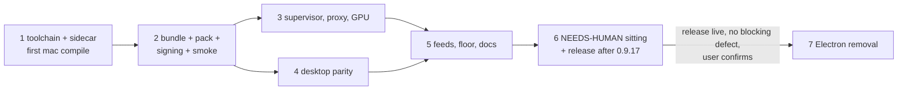

=== FILE: plan.md ===
---
title: "Sai ATLAS on macOS moves from Electron to Tauri, then Electron leaves the repo"
description: "Build, sign, smoke and ship the arm64 Tauri macOS bundle with the assistant pack and full desktop parity in the release after 0.9.17, then delete Electron once that release is live."
status: pending
priority: P1
effort: 12d
branch: tung491/tauri_macos
tags: [tauri, macos, packaging, release, refactor, electron-removal]
created: 2026-10-08
---

# Sai ATLAS on macOS: Tauri cutover, then Electron removal

## Outcome

The macOS arm64 build of Sai ATLAS is the Tauri 2 Rust core in `src-tauri/` with WKWebView. Its `.app` carries the omp sidecar at `Contents/MacOS/omp` (signed ad hoc with hardened runtime and `src-tauri/macos/omp.entitlements`) and the assistant pack at `Contents/Resources/assistant-pack/`, which the manager finds. Every `cfg(target_os = "macos")` branch compiles under `clippy -D warnings`; the supervisor kills the whole omp tree on macOS; the system proxy and GPU name come from `scutil --proxy` and `system_profiler`. The release after 0.9.17 (0.9.18 or later) publishes `Sai-ATLAS-<v>-arm64.dmg`, `Sai-ATLAS-<v>-arm64.zip`, the `omp-<v>-arm64.dmg` bridge copy and an arm64-only `latest-mac.yml` with `minimumSystemVersion: 22.4.0`, next to the Linux assets. After that release is live with no blocking defect and the user says so, Electron, electron-builder, electron-vite, the preload, `src/main/**` and the Playwright suite are deleted, and the docs describe one Tauri app on Linux and macOS.

This plan replaces Phase 12 of the parent plan [`plans/261002-1441-tauri-shell-migration/`](../261002-1441-tauri-shell-migration/plan.md) ([phase-12](../261002-1441-tauri-shell-migration/phase-12-macos-windows-cutover-electron-removal.md)). Windows steps from that phase are dropped.

## Decisions

| Topic | Decision | Source |
|---|---|---|
| Scope | macOS cutover first; Electron removal is the last phase, gated on the macOS Tauri release being live with no blocking defect | User, 2026-10-08 |
| Architecture | arm64 only. No Intel DMG/ZIP, no `build:omp:x64`, no `package:tauri:mac:x64`; `latest-mac.yml` lists arm64 assets only; AGENTS.md's release flow is updated to match. Consequence: Intel Macs on 0.9.x `omp.app` find no update; accepted by this decision | User, 2026-10-08 |
| Sidecar source | Clone `nornzach/oh-my-pi` to `~/WORK/oh-my-pi`, clone this GUI repo to `~/WORK/oh-my-pi/packages/gui`, run `bun run build:omp` there, copy `resources/omp` into the worktree | User, 2026-10-08 |
| Population | Fresh installs only; no Electron-to-Tauri self-update handover on macOS is tested. The `omp-<v>-arm64.dmg` bridge copy stays until 1.0.0 | User, 2026-10-08 |
| Release timing | macOS Tauri ships in the first release after 0.9.17. Linux 0.9.17 proceeds on its own plan. Because the release also carries `latest-linux.yml`, that release ships Linux assets built on the Linux host | User, 2026-10-08; AGENTS.md (partial asset sets break both updaters) |
| Windows | Out of scope; every Windows step is skipped, and the Windows placeholders in `proxy.rs`/`hardware.rs` stay | User, 2026-10-05 |
| Signing | Ad hoc (`-`), hardened runtime on both the app and the sidecar. The app carries only `com.apple.security.device.audio-input`; the sidecar only `allow-jit` and `allow-unsigned-executable-memory`. A finalize step (`src-tauri/macos/finalize-app.ts`) re-signs the sidecar and then the app with explicit entitlements and builds the DMG with `hdiutil`, so the result never depends on how tauri-bundler signs `externalBin`. `tauri.macos.conf.json` targets become `["app"]` | Planner; parent plan Task 12.2 entitlement check |
| Assistant pack on macOS | Bundled through the mac overlay's `resources` into `Contents/Resources/assistant-pack/` (non-code belongs outside `Contents/MacOS` for the code seal). `resolve_pack_dir` learns one structural rule: a binary in `<x>.app/Contents/MacOS/` also looks at `<x>.app/Contents/Resources/assistant-pack` | Planner; scout gap 1 |
| Sidecar lifetime on macOS | Keep the control-channel EOF as the primary parent-death signal (works on macOS); add kqueue `EVFILT_PROC`/`NOTE_EXIT` on the GUI pid as the second; before killing omp take a recursive `proc_listchildpids` snapshot of omp's descendants and SIGKILL every survivor after the group kill | Parent plan Decisions ("Sidecar supervisor") |
| macOS GUI tests | No tauri-driver (WKWebView unsupported). Automated proof is: Rust unit tests on the Mac, a packaged smoke script `scripts/tauri-mac-smoke.sh` (bundle layout, signatures, entitlements, URL scheme, sidecar spawned with the pack, single instance per profile, hard-kill leaves no omp), and `scripts/check-assistant-pack.ts` against the bundled sidecar. On-screen behavior is one batched NEEDS-HUMAN sitting | Planner |
| WKWebView microphone | wry's `WKUIDelegate` grants media capture when no permission handler is set (upstream `wry_web_view_ui_delegate.rs`); the plan verifies that in the locked wry 0.57.0 source and relies on `NSMicrophoneUsageDescription` (already in `src-tauri/Info.plist`) plus the `audio-input` entitlement for the TCC prompt. No Rust permission code is added unless the check fails | Planner; WebFetch of wry source 2026-10-08 |
| Quick-entry ⌘ chords | macOS dispatches app-menu key equivalents while the panel is key. The Tauri port drops app-menu actions in `Desktop::on_menu_id` while the quick-entry window is focused, which is where the existing (unused) `is_blocked_menu_chord` rule would have applied | Planner; `src/main/quick-entry-core.ts:112` |
| Electron removal | Moves before deletes: `sidecarOutName` → `scripts/sidecar-names.ts`; tray mark → `src-tauri/icons/tray-mark.rgba` + `include_bytes!`; `src/main/assistant-pack.ts` → `scripts/assistant-pack.ts`; `src/main/ollama/test-fake-ollama.ts` and `e2e/desktop-prefs.ts` → `e2e-tauri/`; CSP tests → `scripts/tauri-packaging-config.test.ts`. TS-twin tests whose TS original is deleted are retired | Parent plan Task 12.4; scout of `include_str!` sites |

## Phases

| # | Phase | Depends on | Effort | Status |
|---|---|---|---|---|
| 1 | [Toolchain, sidecar and first macOS compile](./phase-01-toolchain-sidecar-first-compile.md) | — | 1.5d | Pending |
| 2 | [A signed bundle that launches and spawns the sidecar with the pack](./phase-02-bundle-pack-signing-smoke.md) | 1 | 2.5d | Pending |
| 3 | [Sidecar lifetime, proxy and GPU on macOS](./phase-03-supervisor-proxy-gpu.md) | 2 | 2d | Pending |
| 4 | [Desktop parity: quick entry, menu, microphone, Finder reveal](./phase-04-desktop-parity.md) | 2 | 1.5d | Pending |
| 5 | [Release plumbing and docs for an arm64-only macOS build](./phase-05-release-plumbing-docs.md) | 3, 4 | 1d | Pending |
| 6 | [Human sitting and the macOS Tauri release](./phase-06-human-sitting-release.md) | 5 | 1d + waiting | Pending |
| 7 | [Electron removal](./phase-07-electron-removal.md) | 6 + user confirmation | 2.5d | Pending |



Phases 3 and 4 own disjoint files (3: `src-tauri/src/omp/supervisor.rs`, `src-tauri/src/omp/proxy.rs`, `src-tauri/src/ollama/hardware.rs`; 4: `src-tauri/src/desktop/windows.rs`, `src-tauri/src/desktop/menu.rs`, `src-tauri/src/webview.rs` only if Task 4.3 fails). Run them one after the other on this single Mac: they share `src-tauri/target` and the Mac's desktop session.

### File ownership per phase

| Phase | Files it may modify or create |
|---|---|
| 1 | `src-tauri/**/*.rs` only where a macOS compile error points; `src-tauri/Cargo.toml` only for the nspanel fallback; `plans/261008-0341-tauri-macos-cutover/reports/macos-checks.md` |
| 2 | `src-tauri/macos/sidecar.conf.json`, `src-tauri/tauri.macos.conf.json`, `src-tauri/macos/finalize-app.ts` (new), `scripts/finalize-mac.test.ts` (new), `scripts/tauri-mac-smoke.sh` (new), `src-tauri/src/omp/assistant_pack.rs`, `package.json` (scripts only), `scripts/stage-tauri-sidecar.ts`, `scripts/tauri-packaging-config.test.ts`, `.gitignore` if needed |
| 3 | `src-tauri/src/omp/supervisor.rs`, `src-tauri/src/omp/proxy.rs`, `src-tauri/src/ollama/hardware.rs` |
| 4 | `src-tauri/src/desktop/windows.rs`, `src-tauri/src/desktop/menu.rs`, `src-tauri/src/webview.rs` (conditional) |
| 5 | `scripts/release-feeds.ts`, `scripts/release-feeds.test.ts`, `scripts/mac-update-floor.ts`, `scripts/mac-update-floor.test.ts`, `scripts/tauri-packaging-config.test.ts`, `AGENTS.md`, `README.md`, `README.vi.md`, `CHANGELOG.md` |
| 6 | `package.json` + `src-tauri/Cargo.toml` + `src-tauri/Cargo.lock` (version only), `CHANGELOG.md`, `README.md`/`README.vi.md` install links, `reports/macos-checks.md` |
| 7 | every Electron file listed in Phase 7, plus the move targets named there |

## Execution rules

- **Repo and commits.** All work commits to this GUI repo (`tung491/oh-my-pi-gui`) on branch `tung491/tauri_macos`, in conventional-commit form, with no plan IDs, phase numbers or AI references in code comments, test names or commit messages. Nothing is committed in the monorepo clone. **No `git push`, tag, or GitHub Release without the user's explicit go-ahead at that moment.** Never push to `can1357`.
- **Sidecar build route.** `build:omp` runs only in `~/WORK/oh-my-pi/packages/gui` (Phase 1 Task 1.2). Copy `resources/omp` from there into this worktree. Never commit `resources/omp*`, `resources/assistant-pack`, `src-tauri/binaries/*`. Every task that runs the agent first checks `test -x resources/omp`.
- **Protect the user.** Every app launch uses a throwaway profile and agent dir: `--user-data-dir="$(mktemp -d)"` and `PI_CODING_AGENT_DIR="$(mktemp -d)"`. Never copy a build into `/Applications`, never run an app from `/Applications`, never write into `~/Library/Application Support/@oh-my-pi/omp-gui` or `~/.omp`. Record `ls -ld ~/Library/Application\ Support/@oh-my-pi/omp-gui ~/.omp/agent 2>&1` at each phase start and end; the output must match. A test `.app` launched from a scratch dir registers with LaunchServices; `scripts/tauri-mac-smoke.sh` unregisters it with `lsregister -u` at exit so the user's `omp://` handler is not hijacked.
- **Processes.** Track every background process (command, PID). `bun run dev:tauri` uses the worktree's deterministic port from `scripts/tauri-dev.ts`; on "address in use" stop the stale owner you started (`lsof -i :<port>`), never pick another port. Before ending a phase: `pgrep -fl "sai-atlas|Contents/MacOS/omp|--omp-supervise"` prints nothing you started.
- **Toolchain.** Every cargo command runs with `~/.cargo/bin` first: `source scripts/rust-pins.env && PATH="$CARGO_HOME_BIN:$PATH"`. `cargo tauri` is pinned at 2.12.1 (the Linux build image's `TAURI_CLI_VERSION`). Before any `cargo clippy`/`cargo test` on a fresh tree run `bun run build:renderer:tauri` (`generate_context!` needs `out/renderer-tauri`).
- **API snapshots.** New Rust items are `pub(crate)` or private, so `src-tauri/contracts/*.api.txt` (generated on Linux) stay unchanged. `bash scripts/check-module.sh snapshots` is a required gate in CI (Linux); on the Mac it is run when `cargo public-api` is installed and its result is recorded.
- **Linux regression.** Shared Rust and TS changes are unit-tested on the Mac; the Linux gates (clippy, `cargo test`, parity, snapshots, vitest, build) run in CI. Getting CI requires pushing the branch, which needs the user's go-ahead: ask once per phase that changes shared code, then `gh pr checks` on the draft PR.
- **Manual checks.** Executors never wait on the user mid-phase: they record on-screen checks as `NEEDS-HUMAN` lines in `plans/261008-0341-tauri-macos-cutover/reports/macos-checks.md`, and Phase 6 runs them in one sitting.
- **Executor.** Sonnet-class executors run every phase under its Failure Protocol. A failed Verify means STOP, not improvise.

## Acceptance criteria

- [ ] `cargo clippy --manifest-path src-tauri/Cargo.toml --all-targets --all-features -- -D warnings` exits 0 on the Mac (aarch64-apple-darwin).
- [ ] `cargo test --manifest-path src-tauri/Cargo.toml --all-features` exits 0 on the Mac, including the supervisor tests now compiled for macOS.
- [ ] `bunx vitest run` and `bun run check:types` exit 0; CI on the branch is green (`gh pr checks` shows no failing check).
- [ ] `bash scripts/tauri-mac-smoke.sh "src-tauri/target/aarch64-apple-darwin/release/bundle/macos/Sai ATLAS.app"` prints `SMOKE PASS` and exits 0.
- [ ] `bun scripts/check-assistant-pack.ts "<app>/Contents/MacOS/omp" "<app>/Contents/Resources/assistant-pack"` exits 0.
- [ ] `grep -cE "^NEEDS-HUMAN .*: PASS$" plans/261008-0341-tauri-macos-cutover/reports/macos-checks.md` prints at least `15`, and `grep -cE "^NEEDS-HUMAN .*: FAIL$"` prints `0`.
- [ ] `dist-release/latest-mac.yml` lists exactly `Sai-ATLAS-<v>-arm64.zip`, `Sai-ATLAS-<v>-arm64.dmg`, `omp-<v>-arm64.dmg`, and `bun run check:mac-update-floor dist-release/latest-mac.yml` exits 0 with floor `22.4.0`.
- [ ] After user go-ahead: `gh release view v<v> --repo tung491/oh-my-pi-gui --json assets -q '.assets[].name'` lists the three mac files, `latest-mac.yml`, the AppImage, the `.deb` and `latest-linux.yml`.
- [ ] After Phase 7: `grep -rlniE "electron|@playwright" src scripts e2e-tauri package.json .github vite.tauri.config.ts` lists no file (a "Migrating from Electron" note in docs excepted), `grep -rnE 'include_(str|bytes)!\("[./]*src/main' src-tauri/src` prints nothing, and `bun install`, `bunx vitest run`, `bun run check:types`, `cargo test --all-features`, `bun run build` exit 0.

## Risks

| Risk | Likelihood × Impact | Mitigation |
|---|---|---|
| Never-compiled macOS cfg code fails clippy in many places | High × Medium | Phase 1 compiles first, before any packaging; fixes stay inside the failing cfg block; Failure Protocol on anything needing design |
| `tauri-nspanel` 2.1.0 does not build against Tauri 2.12 | Medium × Medium | Phase 1 Task 1.4 fallback: drop the crate, keep the always-on-top window, record the degradation (bar may not float over full-screen apps) for the user |
| Bun-compiled sidecar breaks when re-signed with hardened runtime | Medium × High | Smoke check `sidecar-ready` runs the signed binary; `check-assistant-pack.ts` runs it too; escalate if JIT entitlement is not honored |
| Gatekeeper blocks the ad hoc app on download | High × Low | Same as the Electron DMG today; README migration steps keep the "Open anyway" instruction |
| Supervisor kqueue/`proc_listchildpids` FFI wrong | Medium × High | Red test with a descendant in its own process group; `unsafe` stays in `supervisor.rs` with `// SAFETY:` |
| A test launch hijacks the user's `omp://` handler or profile | Medium × High | Throwaway profile and agent dir; scratch copy of the app; `lsregister -u` on exit; mtime/listing check per phase |
| Release ships macOS-only assets and breaks Linux update checks | Medium × High | Phase 6 requires Linux bundles for the same version before `release-feeds.ts`; draft release, publish only after every asset is uploaded |
| Electron removal deletes a file a kept script, test or `include_str!` reads | High × Medium | Phase 7 moves first (enumerated list), then deletes; `cargo test` + vitest + build gate |
| Intel Mac users on old `omp.app` lose updates | Certain × Low | User decision 2; release body states arm64 only |

## Rollback

- Phases 1–5: revert the branch commits; nothing is published.
- Phase 6: the release is a draft until every asset is uploaded; if the published release has a blocking macOS defect, publish a higher version whose `latest-mac.yml` points at a fixed Tauri build (no Electron macOS build ever shipped from this repo, so there is nothing to roll back to on macOS other than "do not install").
- Phase 7: tag `electron-final` (pushed only with go-ahead) before deleting; revert the removal commits or branch from the tag to restore Electron.

## Validation Log

### Session 1 — 2026-10-08
| Topic | Answer |
|---|---|
| Scope, arch, sidecar route, population, timing, Windows | The six binding decisions above (user, 2026-10-08) |

=== FILE: phase-01-toolchain-sidecar-first-compile.md ===
---
phase: 1
title: "Toolchain, sidecar and first macOS compile"
status: pending
priority: P1
effort: "1.5d"
dependencies: []
---

# Phase 1: Toolchain, sidecar and first macOS compile

## Goal

The Mac has the pinned Tauri CLI, the monorepo clone produces an arm64 `resources/omp`, the assistant pack is built, and every `cfg(target_os = "macos")` line in `src-tauri/` compiles under clippy `-D warnings` with all Rust tests green. Nothing is packaged yet.

## Context

- Host: macOS 27.0 arm64, Command Line Tools only, Rust 1.93 at `~/.cargo/bin`, target `aarch64-apple-darwin`. `cargo tauri` is not installed. `scripts/rust-pins.env` pins `CARGO_PUBLIC_API_VERSION="0.52.0"`, `PUBLIC_API_TOOLCHAIN="nightly-2026-10-01"`; `scripts/tauri-linux-build/Dockerfile:60` pins `TAURI_CLI_VERSION=2.12.1`.
- No macOS cfg code has ever compiled (`scripts/check-module.sh` gate 9 only WARNed on Linux). Known macOS-only sites: `src-tauri/src/desktop/windows.rs:1022-1035` (tauri-nspanel), `src-tauri/Cargo.toml:65-66`.
- `src-tauri/src/omp/supervisor.rs:334` tests are `cfg(all(test, target_os = "linux"))`, so they do not run on the Mac yet (Phase 3 changes that).

## Requirements

- No source behavior change except fixes forced by compile errors.
- Do not edit the user's shell profile.

## Tasks

### Task 1.1 — Install the pinned tools
- Goal: `cargo tauri` 2.12.1 and the snapshot tools exist under `~/.cargo/bin` / rustup.
- Target files and symbols: none in the repo.
- Steps:
  1. `~/.cargo/bin/cargo install tauri-cli --version 2.12.1 --locked`
  2. `~/.cargo/bin/rustup toolchain install nightly-2026-10-01 --profile minimal`
  3. `~/.cargo/bin/cargo install cargo-public-api --version 0.52.0 --locked`
  4. Record the PATH-safe prefix you will use for every later cargo command: `source scripts/rust-pins.env && PATH="$CARGO_HOME_BIN:$PATH"`.
- Success criteria: both tools report their versions.
- Verify: `~/.cargo/bin/cargo tauri --version` exits 0 and prints `tauri-cli 2.12.1`; `~/.cargo/bin/cargo public-api --version` exits 0 and prints `0.52.0`.

### Task 1.2 — Clone the monorepo and build the arm64 sidecar
- Goal: `resources/omp` (arm64 Mach-O) exists in this worktree, built from `nornzach/oh-my-pi` with this repo's `patches/omp/*.patch`.
- Target files and symbols: `~/WORK/oh-my-pi/` (new clone), `~/WORK/oh-my-pi/packages/gui/` (new clone of this repo), `<worktree>/resources/omp` (copied, gitignored).
- Steps:
  1. `test -e ~/WORK/oh-my-pi || git clone https://github.com/nornzach/oh-my-pi.git ~/WORK/oh-my-pi`
  2. `test -e ~/WORK/oh-my-pi/packages/gui/.git || git clone https://github.com/tung491/oh-my-pi-gui.git ~/WORK/oh-my-pi/packages/gui`
  3. `git -C ~/WORK/oh-my-pi/packages/gui checkout --detach $(git -C /Users/tung491/orca/workspaces/oh-my-pi-gui/tauri_macos rev-parse HEAD)`; if that commit is not on origin, use `git -C ~/WORK/oh-my-pi/packages/gui checkout --detach 83d393c` (same `patches/omp/` and `scripts/build-bundled-omp.ts`; check with `git -C /Users/tung491/orca/workspaces/oh-my-pi-gui/tauri_macos diff 83d393c -- patches scripts/build-bundled-omp.ts` printing nothing).
  4. `cd ~/WORK/oh-my-pi && bun install`
  5. `cd ~/WORK/oh-my-pi/packages/gui && bun install && bun run build:omp`
  6. `cp ~/WORK/oh-my-pi/packages/gui/resources/omp /Users/tung491/orca/workspaces/oh-my-pi-gui/tauri_macos/resources/omp`
  7. Append to `plans/261008-0341-tauri-macos-cutover/reports/macos-checks.md` the line `sidecar monorepo commit: <git -C ~/WORK/oh-my-pi rev-parse HEAD>`.
  8. `git -C ~/WORK/oh-my-pi status --porcelain` must print nothing (build:omp reverts its patches); if it prints anything, STOP (Failure Protocol).
- Success criteria: an arm64 sidecar sits in the worktree; the monorepo clone is clean.
- Verify: `file resources/omp` (from the worktree) prints `Mach-O 64-bit executable arm64`; `git -C ~/WORK/oh-my-pi status --porcelain | wc -l` prints `0`; `git -C /Users/tung491/orca/workspaces/oh-my-pi-gui/tauri_macos status --porcelain resources` prints nothing (the binary is ignored).

### Task 1.3 — Build the assistant pack and the renderer
- Goal: `resources/assistant-pack/` and `out/renderer-tauri/` exist in the worktree.
- Target files and symbols: `scripts/build-assistant-pack.ts` (run only).
- Steps:
  1. `bun install --frozen-lockfile` in the worktree.
  2. `bun run build:pack`. If it fails for a missing monorepo package, run `bun run build:pack` in `~/WORK/oh-my-pi/packages/gui` and `cp -R ~/WORK/oh-my-pi/packages/gui/resources/assistant-pack resources/assistant-pack`.
  3. `bun run build:renderer:tauri`.
- Success criteria: the pack holds every file in `ASSISTANT_PACK_FILES` (`src-tauri/src/omp/assistant_pack.rs:10-20`).
- Verify: `for f in package.json tools.js system-prompt.md append-system-prompt.md config.yml skills/word-report/SKILL.md skills/spreadsheet-cleanup/SKILL.md skills/slides-from-report/SKILL.md skills/sai-os-helpdesk/SKILL.md; do test -f resources/assistant-pack/$f || echo MISSING $f; done` prints nothing; `test -f out/renderer-tauri/index.html` exits 0.

### Task 1.4 — Prove the bundled sidecar loads the pack
- Goal: the arm64 sidecar plus pack pass the pack check before any bundle exists.
- Target files and symbols: `scripts/check-assistant-pack.ts` (run only).
- Steps: `bun scripts/check-assistant-pack.ts resources/omp resources/assistant-pack`.
- Success criteria: every row passes (the five `patches/omp/*.patch` are in the sidecar).
- Verify: the command exits 0 and its output contains no `FAIL`.

### Task 1.5 — First macOS compile under clippy
- Goal: every macOS cfg branch compiles with no warnings.
- Target files and symbols: `src-tauri/Cargo.toml` (`[target.'cfg(target_os = "macos")'.dependencies] tauri-nspanel = "2"`), `src-tauri/src/desktop/windows.rs:1022-1035`, and any file clippy names.
- Steps:
  1. `source scripts/rust-pins.env && PATH="$CARGO_HOME_BIN:$PATH" cargo clippy --manifest-path src-tauri/Cargo.toml --all-targets --all-features -- -D warnings 2>&1 | tee "$TMPDIR/clippy-mac.txt"`.
  2. If it exits 0, skip to Verify.
  3. For each error inside a `#[cfg(target_os = "macos")]`/`cfg(not(target_os = "linux"))` block or a non-Linux path: make the smallest fix in that block (unused imports, wrong method names on the macOS API, missing `#[cfg]` on a Linux-only helper used only under Linux). Do not change Linux behavior: a fix that would edit a line compiled on Linux is a design question → Failure Protocol.
  4. If the errors come from `tauri-nspanel` itself or its API at `windows.rs:1029-1033` and cannot be fixed by a method rename found in `~/.cargo/registry/src/*/tauri-nspanel-2.1.0/src/`, apply the fallback: remove the `[target.'cfg(target_os = "macos")'.dependencies]` block from `src-tauri/Cargo.toml`, replace the `#[cfg(target_os = "macos")]` block at `windows.rs:1026-1035` with nothing (the window already has `always_on_top: true`, `skip_taskbar: true`), run `cargo update -p sai-atlas --manifest-path src-tauri/Cargo.toml` only if Cargo demands a lock refresh, and append `NEEDS-HUMAN quick-entry fallback: plain always-on-top window (tauri-nspanel 2.1.0 does not build)` to `reports/macos-checks.md` as a note for the user. Phase 4 Task 4.1 is then skipped.
  5. Re-run step 1 until it exits 0.
  6. Commit: `fix(tauri): compile the macOS branches`.
- Success criteria: clippy clean on aarch64-apple-darwin.
- Verify: `source scripts/rust-pins.env && PATH="$CARGO_HOME_BIN:$PATH" cargo clippy --manifest-path src-tauri/Cargo.toml --all-targets --all-features -- -D warnings` exits 0.

### Task 1.6 — Rust tests on the Mac
- Goal: the existing Rust suite passes on macOS.
- Target files and symbols: tests that fail only on macOS (fix the test's platform assumption, never weaken an assertion; a test that asserts Linux-only behavior gets `#[cfg(target_os = "linux")]` only if its TS original was also Linux-only — otherwise Failure Protocol).
- Steps:
  1. `source scripts/rust-pins.env && PATH="$CARGO_HOME_BIN:$PATH" cargo test --manifest-path src-tauri/Cargo.toml --all-features 2>&1 | tee "$TMPDIR/test-mac.txt"`.
  2. List failures with `grep -E "^test .* FAILED$" "$TMPDIR/test-mac.txt"`; fix per the rule above; re-run.
  3. Run the parity gate: `for parity in src-tauri/contracts/*.parity.json; do bun scripts/check-test-parity.ts "$(basename "$parity" .parity.json)"; done`.
  4. If `cargo public-api` is installed (Task 1.1), run `bash scripts/check-module.sh snapshots` and record its last line in `reports/macos-checks.md`. A diff caused by cfg-gated public items on macOS is recorded, not fixed (CI on Linux is authoritative).
  5. Commit any fixes: `test(tauri): run the Rust suite on macOS`.
- Success criteria: all tests pass on the Mac.
- Verify: the `cargo test` command exits 0 and its output contains `test result: ok` with no `FAILED`; the parity loop exits 0.

## Test matrix

| Level | What | Command |
|---|---|---|
| Tool | tauri-cli, public-api versions | Task 1.1 Verify |
| Artifact | sidecar arch, pack contents | Tasks 1.2–1.3 Verify |
| Integration | sidecar loads exactly the pack | `bun scripts/check-assistant-pack.ts resources/omp resources/assistant-pack` |
| Compile | macOS cfg code | clippy `-D warnings` |
| Unit | Rust suite on macOS | `cargo test --all-features` |

## Regression gate

`bunx vitest run` exits 0 and `bun run check:types` exits 0 (no TS was touched, so this proves the tree is sane). The `ls -ld` profile check from plan.md Execution rules matches its phase-start output.

## Risk

nspanel incompatibility (fallback in Task 1.5 step 4); `build:omp` needing natives download (script downloads from npm; network required).

## Rollback

`git revert` the phase's commits. Delete `~/WORK/oh-my-pi` only if the user asks.

## Failure Protocol
If any Verify step does not meet its stated pass condition, STOP this phase.
Do not improvise a fix, retry blindly, or reason around the failure.
Spawn the `kongming` subagent for next-step counsel and pass:
- the phase and task id,
- what you attempted (the steps you ran),
- the exact command and its full output,
- the pass condition it failed to meet.
Apply kongming's guidance, then re-run the Verify step.
If `kongming` cannot be spawned in this environment, STOP and report the same
failure evidence to the user. Never continue by self-reasoning.

=== FILE: phase-02-bundle-pack-signing-smoke.md ===
---
phase: 2
title: "A signed bundle that launches and spawns the sidecar with the pack"
status: pending
priority: P1
effort: "2.5d"
dependencies: [1]
---

# Phase 2: A signed bundle that launches and spawns the sidecar with the pack

## Goal

`bun run package:tauri:mac:arm64` produces `Sai ATLAS.app` and a DMG whose app carries the pack in `Contents/Resources/assistant-pack`, signs the sidecar with `omp.entitlements` and the app with `app.entitlements` under hardened runtime, registers `omp://`, and passes a packaged smoke script that launches it on a throwaway profile and sees the sidecar spawned with the pack. The Intel mac script is gone.

## Context

- `src-tauri/macos/sidecar.conf.json` holds only `"externalBin": ["binaries/omp"]`; the Linux overlay `src-tauri/linux/sidecar.conf.json` adds `"../resources/assistant-pack/": "assistant-pack/"`.
- On macOS, `externalBin` lands in `Contents/MacOS/omp`; bundle `resources` land under `Contents/Resources/`.
- `resolve_pack_dir` (`src-tauri/src/omp/assistant_pack.rs:42-58`) checks `assistant-pack/` beside the binary, then walks up `resources/assistant-pack` from `pack_search_from()` (`src-tauri/src/omp/manager.rs:468-474`, empty in packaged builds). A packaged mac app therefore refuses every session today (scout gap 1).
- `package.json` `package:tauri:mac:arm64` lacks `bun run build:pack`; `package:tauri:mac:x64` exists and is pinned by `scripts/tauri-packaging-config.test.ts:213-232` and `SIDECAR_SOURCES` in `scripts/stage-tauri-sidecar.ts`.
- `scripts/tauri-packaging-config.test.ts:170` expects mac targets `["dmg","app"]`; `:187-190` expects no mac `resources`.
- `scripts/release-feeds.ts` reads `<bundleDir>/dmg/*.dmg` and `<bundleDir>/macos/*.app` (`onlyBundle`, `macZip`).

## Requirements

- Linux packaging is unchanged (`src-tauri/linux/**`, `package:tauri:linux`).
- No test launch touches the user's profile, `~/.omp`, `/Applications`, or the `omp://` handler.

## Tasks

### Task 2.1 — Red: the pack lookup inside a .app
- Goal: a failing Rust test proves a binary in `<x>.app/Contents/MacOS` does not find `Contents/Resources/assistant-pack`.
- Target files and symbols: `src-tauri/src/omp/assistant_pack.rs`, `mod tests`, new test `resolves_the_pack_in_the_app_bundle_resources_for_a_sidecar_in_contents_macos`.
- Steps:
  1. Add the test after `resolves_the_pack_beside_the_sidecar_binary` (line ~360). Use `tempfile::tempdir()` and the existing `write_pack` helper: create `root/Sai ATLAS.app/Contents/MacOS/omp` (empty file via `write_file`) and `write_pack(&root/Sai ATLAS.app/Contents/Resources/assistant-pack, ASSISTANT_PACK_FILES)`.
  2. Assert `resolve_pack_dir(&binary, &[])` equals `root/Sai ATLAS.app/Contents/Resources/assistant-pack`.
  3. Add a second assertion in the same test: when both `Contents/MacOS/assistant-pack` and `Contents/Resources/assistant-pack` exist, the beside-binary one wins (keeps the existing precedence).
- Success criteria: the test compiles and fails on the first assertion.
- Verify: `source scripts/rust-pins.env && PATH="$CARGO_HOME_BIN:$PATH" cargo test --manifest-path src-tauri/Cargo.toml --all-features resolves_the_pack_in_the_app_bundle` exits non-zero with an `assertion` failure (`left` ends in `Contents/MacOS/assistant-pack`). A passing test here is a failure of this task.

### Task 2.2 — Green: look in Contents/Resources
- Goal: the new test passes; every older pack test still passes.
- Target files and symbols: `src-tauri/src/omp/assistant_pack.rs` `resolve_pack_dir`.
- Steps:
  1. After the beside-binary check and before the search-root loop, add: if `binary.parent()` has file name `MacOS` and its parent has file name `Contents`, let `candidate = absolute(<Contents>.join("Resources").join(PACK_DIR_NAME))`; return it if `candidate.is_dir()`. The rule is structural (no `cfg`), so the test runs on every OS.
  2. Update the doc comment above `resolve_pack_dir` with one sentence: a sidecar in an app bundle's `Contents/MacOS` finds the pack in `Contents/Resources`, where non-code belongs for the code seal.
  3. Commit: `fix(tauri): find the assistant pack in a macOS app bundle's Resources`.
- Success criteria: green, and no change to the fallback path.
- Verify: `cargo test --manifest-path src-tauri/Cargo.toml --all-features assistant_pack` (with the rust-pins prefix) exits 0 and prints `test result: ok`.

### Task 2.3 — Red: packaging config expectations for arm64-only, pack and app target
- Goal: `scripts/tauri-packaging-config.test.ts` describes the new mac packaging and fails.
- Target files and symbols: `scripts/tauri-packaging-config.test.ts` — `it("bundles for every target…")` (line 167), `it("the macOS config ships binaries/omp as externalBin")` (line 187), `it("every package:tauri script stages the matching triple…")` (line 213); new `it("finishes the macOS app with the sidecar and app entitlements before the DMG")` in `describe("macOS bundle")`.
- Steps:
  1. Line 170: expect `platform("macos").bundle?.targets` to equal `["app"]`.
  2. Rename the line-187 test to `the macOS config ships binaries/omp as externalBin and the assistant pack as a resource` and expect `bundled("macos").bundle?.resources` toEqual `{ "../resources/assistant-pack/": "assistant-pack/" }`.
  3. In the line-213 test remove the `"package:tauri:mac:x64"` entry; additionally assert `scripts()["package:tauri:mac:arm64"]` starts with `bun run build:pack && ` and contains `&& bun src-tauri/macos/finalize-app.ts src-tauri/target/aarch64-apple-darwin/release/bundle`; assert `SIDECAR_SOURCES["x86_64-apple-darwin"]` is undefined and `scripts()["build:omp:x64"]` is undefined.
  4. New test: read `src-tauri/macos/finalize-app.ts` as text; expect it to contain `macos/omp.entitlements`, `macos/app.entitlements`, `--options`, `runtime` and `hdiutil`.
- Success criteria: the file fails on these new expectations only.
- Verify: `bunx vitest run scripts/tauri-packaging-config.test.ts` exits non-zero with assertion failures naming `targets`, `resources`, `package:tauri:mac`, or a missing `finalize-app.ts`. Passing is a failure of this task.

### Task 2.4 — Red: unit tests for the finalize step
- Goal: pure helpers of the finalize script are specified by tests.
- Target files and symbols: new `scripts/finalize-mac.test.ts`; symbols to be exported by `src-tauri/macos/finalize-app.ts`: `codesignCommands(app: string, root: string): string[][]`, `dmgName(version: string): string`, `findApp(bundleDir: string): string`.
- Steps:
  1. Test `signs the sidecar before the app, each with its own entitlements and hardened runtime`: `codesignCommands("/b/Sai ATLAS.app", "/r")` equals
     `[["codesign","--force","--sign","-","--options","runtime","--timestamp=none","--entitlements","/r/src-tauri/macos/omp.entitlements","/b/Sai ATLAS.app/Contents/MacOS/omp"], ["codesign","--force","--sign","-","--options","runtime","--timestamp=none","--entitlements","/r/src-tauri/macos/app.entitlements","/b/Sai ATLAS.app"]]`.
  2. Test `names the DMG the way release-feeds expects a Tauri bundle`: `dmgName("0.9.18")` equals `Sai ATLAS_0.9.18_aarch64.dmg`.
  3. Test `refuses a bundle dir without exactly one app`: with a temp dir holding `macos/` empty, `findApp(dir)` throws `expected exactly one .app`.
- Verify: `bunx vitest run scripts/finalize-mac.test.ts` exits non-zero (module `src-tauri/macos/finalize-app.ts` not found). Passing is a failure of this task.

### Task 2.5 — Green: overlay, targets, scripts and the finalize step
- Goal: Tasks 2.3 and 2.4 pass.
- Target files and symbols: `src-tauri/macos/sidecar.conf.json`, `src-tauri/tauri.macos.conf.json`, new `src-tauri/macos/finalize-app.ts`, `package.json` scripts, `scripts/stage-tauri-sidecar.ts` `SIDECAR_SOURCES`.
- Steps:
  1. `src-tauri/macos/sidecar.conf.json` → `{ "bundle": { "externalBin": ["binaries/omp"], "resources": { "../resources/assistant-pack/": "assistant-pack/" } } }`.
  2. `src-tauri/tauri.macos.conf.json` → `"targets": ["app"]` (rest unchanged; `hardenedRuntime` is left at Tauri's default).
  3. Create `src-tauri/macos/finalize-app.ts` modelled on `src-tauri/linux/finalize-deb.ts` (header comment, `import.meta.main` entry, exit 1 with a message on failure). Usage: `bun src-tauri/macos/finalize-app.ts <bundle dir>`. Exports the three helpers from Task 2.4. Main flow:
     a. `app = findApp(bundleDir)` (exactly one `*.app` in `<bundleDir>/macos`).
     b. Fail if `<app>/Contents/Resources/assistant-pack/config.yml` or `<app>/Contents/MacOS/omp` is missing.
     c. Run each `codesignCommands(app, ROOT)` entry with `spawnSync`, `stdio: "inherit"`; fail on non-zero.
     d. Run `codesign --verify --strict --deep --verbose=2 <app>`; fail on non-zero.
     e. Read the version from `package.json`; make `<bundleDir>/dmg/` (remove an existing `*.dmg` there first); stage a temp dir with `ditto <app> <tmp>/Sai ATLAS.app` and a symlink `Applications -> /Applications`; run `hdiutil create -volname "Sai ATLAS" -srcfolder <tmp> -ov -format UDZO <bundleDir>/dmg/<dmgName(version)>`; fail on non-zero; remove the temp dir.
     f. Print the DMG path.
  4. `package.json`: set `package:tauri:mac:arm64` to `bun run build:pack && bun scripts/stage-tauri-sidecar.ts aarch64-apple-darwin && bash -c 'source scripts/rust-pins.env && PATH="$CARGO_HOME_BIN:$PATH" cargo tauri build --target aarch64-apple-darwin --config src-tauri/macos/sidecar.conf.json' && bun src-tauri/macos/finalize-app.ts src-tauri/target/aarch64-apple-darwin/release/bundle`. Delete the `package:tauri:mac:x64` and `build:omp:x64` scripts.
  5. `scripts/stage-tauri-sidecar.ts`: remove the `"x86_64-apple-darwin": "resources/omp.x64"` entry from `SIDECAR_SOURCES`.
  6. Run `bunx biome check src-tauri/macos/finalize-app.ts scripts/finalize-mac.test.ts scripts/tauri-packaging-config.test.ts scripts/stage-tauri-sidecar.ts package.json`.
  7. Commit: `feat(tauri): bundle the assistant pack and sign the macOS sidecar with its own entitlements`.
- Success criteria: both test files green; biome clean on touched files.
- Verify: `bunx vitest run scripts/tauri-packaging-config.test.ts scripts/finalize-mac.test.ts` exits 0; `bunx biome check src-tauri/macos/finalize-app.ts scripts/finalize-mac.test.ts` exits 0.

### Task 2.6 — Write the packaged smoke script
- Goal: `scripts/tauri-mac-smoke.sh <app>` mechanically checks a built app and never touches the user's environment.
- Target files and symbols: new `scripts/tauri-mac-smoke.sh` (executable).
- Steps: write a `#!/usr/bin/env bash` script with `set -euo pipefail` that:
  1. Takes `$1` = path to `Sai ATLAS.app`; exits 2 with usage if missing.
  2. `SCRATCH=$(mktemp -d)`; `ditto "$1" "$SCRATCH/Sai ATLAS.app"`; `APP="$SCRATCH/Sai ATLAS.app"`; `LSREG=/System/Library/Frameworks/CoreServices.framework/Frameworks/LaunchServices.framework/Support/lsregister`; a `trap` on EXIT that kills every PID it started (`kill -TERM`, then `kill -KILL` after 5 s), runs `"$LSREG" -u "$APP"`, and removes `$SCRATCH`.
  3. Defines `check <name> <command…>` that prints `PASS <name>` or `FAIL <name>` and counts failures.
  4. Static checks:
     - `pack`: `test -f "$APP/Contents/Resources/assistant-pack/config.yml"`
     - `sidecar-arm64`: `file "$APP/Contents/MacOS/omp" | grep -q "arm64"`
     - `seal`: `codesign --verify --strict --deep "$APP"`
     - `app-runtime`: `codesign -dv "$APP" 2>&1 | grep -q "flags=0x10002(adhoc,runtime)"`
     - `sidecar-runtime`: same for `"$APP/Contents/MacOS/omp"`
     - `app-entitlements`: `codesign -d --entitlements :- "$APP" 2>/dev/null | plutil -convert json -o - -` equals `{"com.apple.security.device.audio-input":true}`
     - `sidecar-entitlements`: same for the sidecar, equals `{"com.apple.security.cs.allow-jit":true,"com.apple.security.cs.allow-unsigned-executable-memory":true}`
     - `identifier`: `plutil -extract CFBundleIdentifier raw "$APP/Contents/Info.plist"` prints `vn.io.vif.saiatlas`
     - `url-scheme`: `plutil -extract CFBundleURLTypes.0.CFBundleURLSchemes.0 raw "$APP/Contents/Info.plist"` prints `omp`
     - `mic-usage`: `plutil -extract NSMicrophoneUsageDescription raw "$APP/Contents/Info.plist"` contains `Sai ATLAS`
     - `floor`: `plutil -extract LSMinimumSystemVersion raw "$APP/Contents/Info.plist"` prints `13.3`
  5. Runtime checks, each with its own `PROFILE=$(mktemp -d "$SCRATCH/profile.XXXX")`, `AGENT=$(mktemp -d "$SCRATCH/agent.XXXX")`, `printf '{"welcome":{"completed":"2026-01-01T00:00:00.000Z"},"language":"en"}' > "$PROFILE/prefs.json"`, launched as `PI_CODING_AGENT_DIR="$AGENT" "$APP/Contents/MacOS/sai-atlas" --user-data-dir="$PROFILE" >"$SCRATCH/gui-$n.log" 2>&1 &`:
     - `sidecar-ready`: within 30 s, `pgrep -f "^$APP/Contents/MacOS/omp "` prints a PID whose `ps -o args= -p <pid>` contains `--extension $APP/Contents/Resources/assistant-pack`; 20 s later the PID is still alive and `grep -cE '"source":"(sidecar-restart|child-process)"' "$PROFILE/logs/gui-runtime.jsonl" 2>/dev/null` prints `0` or the file is absent.
     - `single-instance-same-profile`: a second launch with the same `--user-data-dir` exits within 10 s and `pgrep -f "^$APP/Contents/MacOS/sai-atlas --user-data-dir=$PROFILE"` still prints exactly one PID.
     - `single-instance-other-profile`: a launch with a second throwaway profile is still running after 10 s (two shells alive).
     - `hard-kill`: take the omp PID recorded by `sidecar-ready`; `kill -9` the first GUI PID; poll every 0.5 s for up to 10 s until `kill -0 <omp pid>` fails. PASS when it fails within 10 s.
  6. At the end prints `SMOKE PASS` and exits 0 when the failure count is 0, else prints `SMOKE FAIL <count>` and exits 1.
  7. `chmod +x scripts/tauri-mac-smoke.sh`; `bash -n scripts/tauri-mac-smoke.sh` must exit 0.
  8. Commit: `test(tauri): add a packaged macOS smoke script`.
- Success criteria: script exists, parses, and refuses a missing argument.
- Verify: `bash -n scripts/tauri-mac-smoke.sh` exits 0; `bash scripts/tauri-mac-smoke.sh; echo "exit=$?"` prints `exit=2`.

### Task 2.7 — Build the bundle and run the smoke
- Goal: the first packaged macOS Tauri app passes the smoke.
- Target files and symbols: none edited; outputs under `src-tauri/target/aarch64-apple-darwin/release/bundle/`.
- Steps:
  1. `test -x resources/omp` (Phase 1).
  2. `bun run package:tauri:mac:arm64 2>&1 | tee "$TMPDIR/package-mac.txt"`.
  3. `bash scripts/tauri-mac-smoke.sh "src-tauri/target/aarch64-apple-darwin/release/bundle/macos/Sai ATLAS.app" | tee "$TMPDIR/smoke.txt"`.
  4. `bun scripts/check-assistant-pack.ts "src-tauri/target/aarch64-apple-darwin/release/bundle/macos/Sai ATLAS.app/Contents/MacOS/omp" "src-tauri/target/aarch64-apple-darwin/release/bundle/macos/Sai ATLAS.app/Contents/Resources/assistant-pack"`.
  5. `hdiutil verify "src-tauri/target/aarch64-apple-darwin/release/bundle/dmg/Sai ATLAS_$(node -p "require('./package.json').version")_aarch64.dmg"`.
  6. Copy the `PASS`/`FAIL` lines from `$TMPDIR/smoke.txt` into `reports/macos-checks.md` under `## Phase 2 smoke`.
  7. Add NEEDS-HUMAN lines to `reports/macos-checks.md` (without a result yet) for: `NEEDS-HUMAN app opens a chat window`, `NEEDS-HUMAN settings toggle persists across relaunch`.
- Success criteria: smoke passes; pack check passes on the signed sidecar; DMG verifies.
- Verify: the smoke prints `SMOKE PASS` and exits 0; the pack check exits 0; `hdiutil verify` exits 0 and prints `is VALID`.

## Test matrix

| Level | Test | Proves |
|---|---|---|
| Rust unit | `resolves_the_pack_in_the_app_bundle_resources_for_a_sidecar_in_contents_macos` | pack lookup in a .app |
| TS unit | `scripts/finalize-mac.test.ts` | sign order, entitlements, DMG name |
| TS config | `scripts/tauri-packaging-config.test.ts` | overlay, targets, scripts, arm64-only |
| Packaged | `scripts/tauri-mac-smoke.sh` | layout, signatures, entitlements, URL scheme, sidecar spawned with pack, single instance, hard kill |
| Integration | `scripts/check-assistant-pack.ts` on the signed sidecar | JIT works under hardened runtime; pack contract |

## Regression gate

`cargo clippy … -D warnings` and `cargo test --all-features` exit 0 on the Mac; `bunx vitest run` and `bun run check:types` exit 0; `for parity in src-tauri/contracts/*.parity.json; do bun scripts/check-test-parity.ts "$(basename "$parity" .parity.json)"; done` exits 0. With the user's go-ahead, push the branch and `gh pr checks` shows no failure (the Linux overlay and `package:tauri:linux` are untouched, and `scripts/tauri-packaging-config.test.ts`'s Linux tests still pass).

## Risk

- Bun sidecar rejects re-signing or crashes under hardened runtime → `sidecar-ready` and the pack check fail → Failure Protocol (likely fix: different entitlements, which is a decision for the user).
- `hdiutil` DMG differs from Tauri's styled DMG (no background) → accepted; functionally equal.

## Rollback

Revert the phase commits; `package:tauri:mac:arm64` returns to its previous form. Nothing published.

## Failure Protocol
If any Verify step does not meet its stated pass condition, STOP this phase.
Do not improvise a fix, retry blindly, or reason around the failure.
Spawn the `kongming` subagent for next-step counsel and pass:
- the phase and task id,
- what you attempted (the steps you ran),
- the exact command and its full output,
- the pass condition it failed to meet.
Apply kongming's guidance, then re-run the Verify step.
If `kongming` cannot be spawned in this environment, STOP and report the same
failure evidence to the user. Never continue by self-reasoning.

=== FILE: phase-03-supervisor-proxy-gpu.md ===
---
phase: 3
title: "Sidecar lifetime, proxy and GPU on macOS"
status: pending
priority: P1
effort: "2d"
dependencies: [2]
---

# Phase 3: Sidecar lifetime, proxy and GPU on macOS

## Goal

On macOS the supervisor kills omp's whole tree (including descendants in their own process group) when the GUI dies or asks it to stop, the system HTTPS proxy comes from `scutil --proxy`, and the GPU name comes from `system_profiler SPDisplaysDataType -json`. The two macOS "is not implemented on this OS" log lines are no longer reachable on macOS.

## Context

- `src-tauri/src/omp/supervisor.rs`: `mod unix` (line 64); Linux-only `prctl` at 95-102; `supervise` (150); `sweep_orphans` (244), `reap_orphans_while_running` (262), `reap_orphans` (277 Linux / 293 no-op), `live_children_of_self` (307 Linux via `/proc` / 328 empty). Tests: `#[cfg(all(test, target_os = "linux"))] mod tests` (334) with `/proc` helpers `alive` (345), `cmdline` (349), `ppid` (353), `sleeps_under` (360), and `control_channel_eof_kills_the_child_tree_within_10_s` (385), `an_orphan_that_exits_is_reaped_while_omp_runs` (410), `sigterm_runs_the_grace_period_before_the_kill` (448), `sigkill_of_the_parent_kills_the_child_tree_within_10_s` (472).
- On macOS the supervisor is not a subreaper; orphans reparent to launchd; `/proc` does not exist. `killpg(omp)` reaches only omp's process group.
- `unsafe` is allowed in `supervisor.rs` with a `// SAFETY:` comment (parent plan Execution rules).
- `nix` is built with feature `event` (`src-tauri/Cargo.toml`), which provides kqueue on macOS.
- `src-tauri/src/omp/proxy.rs:100-106` `lookup_system_proxy` for `cfg(not(target_os = "linux"))` logs the placeholder.
- `src-tauri/src/ollama/hardware.rs:105-113` `gpu_name_other_os`; `default_deps` (115) picks `read_gpu_name_linux` only for `Platform::Linux`.
- Keep every new item `pub(crate)` or private (API snapshots).

## Requirements

- Linux behavior and tests unchanged.
- Windows placeholders stay (Windows out of scope).

## Tasks

### Task 3.1 — Make the supervisor tests run on macOS
- Goal: the supervisor test module compiles and runs on macOS with portable process helpers.
- Target files and symbols: `src-tauri/src/omp/supervisor.rs` `mod tests` and its helpers.
- Steps:
  1. Change `#[cfg(all(test, target_os = "linux"))]` on `mod tests` to `#[cfg(all(test, unix))]`.
  2. Keep the `/proc` bodies of `alive`, `cmdline`, `ppid`, `sleeps_under` under `#[cfg(target_os = "linux")]`; add `#[cfg(target_os = "macos")]` twins using `ps`/`pgrep`: `alive` = `nix::sys::signal::kill(Pid::from_raw(pid as i32), None).is_ok()` and `ps -o stat= -p <pid>` not starting with `Z`; `cmdline` = `ps -o args= -p <pid>` split on whitespace; `ppid` = `ps -o ppid= -p <pid>` parsed; `sleeps_under(parent)` = `pgrep -P <parent> sleep` parsed.
  3. Mark `an_orphan_that_exits_is_reaped_while_omp_runs` `#[cfg(target_os = "linux")]` (reaping orphans is the subreaper's job; on macOS launchd reaps them). Add a one-line comment saying so.
  4. Run the module: `cargo test --manifest-path src-tauri/Cargo.toml --all-features supervisor` (rust-pins prefix).
- Success criteria: the three remaining existing tests pass on macOS (process-group kill already covers same-group children).
- Verify: the command exits 0 and prints `test result: ok`. If any of the three existing tests fails, STOP (Failure Protocol) — that is a real macOS defect to diagnose, not a test to skip.

### Task 3.2 — Red: a descendant in its own process group must die with omp
- Goal: a failing test that reproduces the launchd-orphan leak.
- Target files and symbols: `src-tauri/src/omp/supervisor.rs` `mod tests`, new test `control_channel_eof_kills_a_descendant_in_its_own_process_group_within_10_s`.
- Steps:
  1. Copy the structure of `control_channel_eof_kills_the_child_tree_within_10_s` (line 385). As the supervised command use `sh -c 'set -m; sleep 300 & echo "child $!"; wait'` (job control gives the `sleep` its own process group). Read the `child <pid>` line from the supervised stdout the same way the existing test reads its pids (if the existing test finds sleeps with `sleeps_under`, use `sleeps_under(<sh pid>)` instead and drop the echo).
  2. Close the control channel; assert with the module's wait helper that `!alive(child)` within 10 s.
  3. Run it on the Mac.
- Success criteria: the test fails on macOS before Task 3.3 (the `sleep` is reparented to launchd and survives).
- Verify: `cargo test --manifest-path src-tauri/Cargo.toml --all-features control_channel_eof_kills_a_descendant_in_its_own_process_group` exits non-zero with an assertion failure. Passing here is a failure of this task (then STOP: the red case is not reproduced).

### Task 3.3 — Green: kqueue parent watch, descendant snapshot and sweep on macOS
- Goal: Task 3.2 passes; Linux code paths unchanged.
- Target files and symbols: `src-tauri/src/omp/supervisor.rs` `mod unix`: `run`, `supervise`, new `#[cfg(target_os = "macos")] fn descendants(root: Pid) -> Vec<Pid>`, new `#[cfg(target_os = "macos")] async fn wait_for_parent_exit(parent: Pid)`, `sweep_orphans`.
- Steps:
  1. Verify the FFI exists first: after `cargo fetch --manifest-path src-tauri/Cargo.toml`, `grep -rn "pub fn proc_listchildpids" ~/.cargo/registry/src/*/libc-0.2.189/src/unix/bsd/apple/` must print one line. If not, STOP (Failure Protocol).
  2. `descendants(root)`: breadth-first over `libc::proc_listchildpids(pid, buf, bytes)`; buffer of 1024 `c_int`; the return value is the count of pids on macOS (check the libc doc comment found in step 1; if it is a byte count divide by `size_of::<c_int>()`). Wrap the call in `unsafe` with `// SAFETY:` explaining the buffer pointer and byte length are valid for the call. Cap the walk at 4096 pids.
  3. `wait_for_parent_exit(parent)`: in `tokio::task::spawn_blocking`, create a `nix::sys::event::Kqueue`, register `KEvent::new(parent as usize, EventFilter::EVFILT_PROC, EventFlag::EV_ADD | EventFlag::EV_ONESHOT, FilterFlag::NOTE_EXIT, 0, 0)`, block in `kevent` until it fires; if registration fails with `ESRCH` return at once (parent already gone).
  4. In `run`, capture `let parent = nix::unistd::getppid();` before `setsid`; pass it to `supervise` only on macOS (add a `#[cfg(target_os = "macos")]` argument or a small struct; do not change the public `run(args)` signature).
  5. In `supervise`, under `#[cfg(target_os = "macos")]` add a `tokio::select!` arm `_ = wait_for_parent_exit(parent) => {}` next to the control-channel arm.
  6. Snapshot and sweep on macOS (omp's children reparent to launchd the moment omp exits, so the snapshot must exist before that):
     a. Hold `let snapshot: Arc<Mutex<Vec<Pid>>>` in `supervise` (macOS only).
     b. Give `reap_orphans_while_running` a macOS body that loops every 500 ms: `*snapshot.lock() = descendants(omp);` (pass the `Arc` in; Linux signature unchanged by putting the extra parameter behind `#[cfg(target_os = "macos")]`, or by a separate macOS-only future used in the same `select!` arm).
     c. Before `kill(omp, SIGTERM)` refresh once more: `*snapshot.lock() = descendants(omp);`.
     d. Add a macOS `fn sweep_snapshot(omp: Pid, snapshot: &[Pid])`: `let _ = killpg(omp, Signal::SIGKILL);` then `for pid in snapshot { let _ = kill(*pid, Signal::SIGKILL); }`.
     e. Call `sweep_snapshot` (macOS) at every place `sweep_orphans().await` is called today: the `status = child.wait()` early-exit arm and after the grace/`killpg` path.
  7. Keep the Linux bodies byte-identical: run `git diff -U0 src-tauri/src/omp/supervisor.rs | grep -E '^-' | grep -v '^---'` and confirm every removed line is inside a cfg you changed for macOS.
  8. Commit: `fix(tauri): kill the sidecar's whole tree when the shell dies on macOS`.
- Success criteria: Task 3.2 green; all supervisor tests green; clippy clean.
- Verify: `cargo test --manifest-path src-tauri/Cargo.toml --all-features supervisor` exits 0 with `test result: ok`; `cargo clippy --manifest-path src-tauri/Cargo.toml --all-targets --all-features -- -D warnings` exits 0; `grep -c "SAFETY:" src-tauri/src/omp/supervisor.rs` prints a number one higher than before the task (`git show HEAD~1:src-tauri/src/omp/supervisor.rs | grep -c "SAFETY:"` + 1).

### Task 3.4 — Red: parse `scutil --proxy`
- Goal: tests specify the macOS proxy parser.
- Target files and symbols: `src-tauri/src/omp/proxy.rs` `mod tests`; future `pub(crate) fn proxy_from_scutil(output: &str) -> ScutilProxy` with `pub(crate) enum ScutilProxy { Https(String), PacOnly, None }`.
- Steps: add tests (all compile on every OS, the parser is not cfg-gated):
  1. `reads_the_https_proxy_from_scutil`: input
     ```
     <dictionary> {
       HTTPSEnable : 1
       HTTPSPort : 8443
       HTTPSProxy : proxy.corp.example
       HTTPEnable : 1
       HTTPPort : 8080
       HTTPProxy : other.example
     }
     ```
     → `ScutilProxy::Https("http://proxy.corp.example:8443".into())`.
  2. `ignores_a_disabled_https_proxy`: `HTTPSEnable : 0` with host/port set → `ScutilProxy::None`.
  3. `reports_a_pac_only_setup`: `ProxyAutoConfigEnable : 1` and `ProxyAutoConfigURLString : http://wpad/proxy.pac`, no HTTPS → `ScutilProxy::PacOnly`.
  4. `returns_none_for_empty_output`: `""` → `ScutilProxy::None`.
- Verify: `cargo test --manifest-path src-tauri/Cargo.toml --all-features scutil` exits non-zero with a compile error naming `proxy_from_scutil`. Passing is a failure of this task.

### Task 3.5 — Green: macOS system proxy
- Goal: Task 3.4 passes; macOS reads the proxy.
- Target files and symbols: `src-tauri/src/omp/proxy.rs` `lookup_system_proxy`, new `proxy_from_scutil`, `ScutilProxy`.
- Steps:
  1. Implement `proxy_from_scutil`: parse `key : value` lines (trim); `Https(format!("http://{host}:{port}"))` when `HTTPSEnable` is `1` and both `HTTPSProxy` and `HTTPSPort` are non-empty; else `PacOnly` when `ProxyAutoConfigEnable` is `1`; else `None`.
  2. Add `#[cfg(target_os = "macos")] async fn lookup_system_proxy() -> Option<String>`: run `/usr/sbin/scutil --proxy` with `tokio::process::Command` and a 2 s `tokio::time::timeout`; on `PacOnly` call `crate::runtime_log::note("unknown", "the system proxy is a PAC file, which the sidecar does not read; no proxy is set", serde_json::json!({}))` once (`std::sync::Once`) and return `None`; on `Https(url)` return `Some(url)`; errors return `None`.
  3. Narrow the placeholder to `#[cfg(not(any(target_os = "linux", target_os = "macos")))]` and change its doc comment to say Windows only.
  4. Commit: `feat(tauri): read the macOS system proxy from scutil`.
- Verify: `cargo test --manifest-path src-tauri/Cargo.toml --all-features proxy` exits 0 with `test result: ok`; `/usr/sbin/scutil --proxy` exits 0 on the Mac (the command exists).

### Task 3.6 — Red: parse `system_profiler SPDisplaysDataType -json`
- Goal: tests specify the GPU-name parser and the macOS dependency choice.
- Target files and symbols: `src-tauri/src/ollama/hardware.rs` `mod tests`; future `pub(crate) fn gpu_name_from_system_profiler(json: &str) -> Option<String>`.
- Steps: add tests:
  1. `reads_the_gpu_model_from_system_profiler`: `{"SPDisplaysDataType":[{"sppci_model":"Apple M2 Pro","spdisplays_vendor":"sppci_vendor_Apple"}]}` → `Some("Apple M2 Pro")`.
  2. `returns_null_for_unexpected_system_profiler_shapes`: `""`, `"{}"`, `{"SPDisplaysDataType":[]}`, `{"SPDisplaysDataType":[{"sppci_model":""}]}` → `None`.
- Verify: `cargo test --manifest-path src-tauri/Cargo.toml --all-features system_profiler` exits non-zero with a compile error naming `gpu_name_from_system_profiler`. Passing is a failure of this task.

### Task 3.7 — Green: macOS GPU name
- Goal: Task 3.6 passes; macOS uses it.
- Target files and symbols: `src-tauri/src/ollama/hardware.rs` new `gpu_name_from_system_profiler`, new `fn read_gpu_name_macos() -> BoxFuture<Result<Option<String>, String>>`, `default_deps` (line 115-128).
- Steps:
  1. Implement the parser with `serde_json::from_str::<serde_json::Value>`; first entry's non-empty `sppci_model`.
  2. `read_gpu_name_macos`: run `/usr/sbin/system_profiler SPDisplaysDataType -json` with `tokio::process::Command`; non-zero exit → `Ok(None)`; parse stdout.
  3. In `default_deps`, select `Arc::new(read_gpu_name_macos)` when `platform == Platform::Darwin`, keeping Linux and the fallback unchanged.
  4. Commit: `feat(tauri): read the macOS GPU name from system_profiler`.
- Verify: `cargo test --manifest-path src-tauri/Cargo.toml --all-features hardware` exits 0 with `test result: ok`; `/usr/sbin/system_profiler SPDisplaysDataType -json | head -c 200` prints text containing `SPDisplaysDataType`.

### Task 3.8 — Packaged hard-kill re-check
- Goal: the packaged app still passes the smoke with the new supervisor.
- Steps: `bun run package:tauri:mac:arm64`, then `bash scripts/tauri-mac-smoke.sh "src-tauri/target/aarch64-apple-darwin/release/bundle/macos/Sai ATLAS.app"`. Append the `hard-kill` line to `reports/macos-checks.md` under `## Phase 3`.
- Verify: the smoke prints `SMOKE PASS` and exits 0.

## Test matrix

| Test | OS | Red before | Proves |
|---|---|---|---|
| existing supervisor tests (3) | Linux, macOS | — | parity of group kill, grace, parent SIGKILL |
| `control_channel_eof_kills_a_descendant_in_its_own_process_group_within_10_s` | Linux, macOS | macOS | snapshot sweep |
| `reads_the_https_proxy_from_scutil` + 3 | all | all | scutil parsing, PAC-only degradation |
| `reads_the_gpu_model_from_system_profiler` + 1 | all | all | GPU parsing |
| smoke `hard-kill` | macOS packaged | — | end-to-end lifetime |

## Regression gate

clippy `-D warnings`, `cargo test --all-features`, the parity loop, `bunx vitest run`, `bun run check:types` all exit 0 on the Mac. With the user's go-ahead, push and `gh pr checks` passes (Linux runs the supervisor tests including the new one, which must also pass there through the subreaper sweep).

## Risk

`proc_listchildpids` return-unit confusion (step 2 checks the libc doc); a tool child that double-forks and leaves the group between two 500 ms refreshes can escape — accepted and recorded in `reports/macos-checks.md` as a known limit.

## Rollback

Revert the phase commits; macOS falls back to the control-channel EOF and group kill only.

## Failure Protocol
If any Verify step does not meet its stated pass condition, STOP this phase.
Do not improvise a fix, retry blindly, or reason around the failure.
Spawn the `kongming` subagent for next-step counsel and pass:
- the phase and task id,
- what you attempted (the steps you ran),
- the exact command and its full output,
- the pass condition it failed to meet.
Apply kongming's guidance, then re-run the Verify step.
If `kongming` cannot be spawned in this environment, STOP and report the same
failure evidence to the user. Never continue by self-reasoning.

=== FILE: phase-04-desktop-parity.md ===
---
phase: 4
title: "Desktop parity: quick entry, menu, microphone, Finder reveal"
status: pending
priority: P2
effort: "1.5d"
dependencies: [2]
---

# Phase 4: Desktop parity: quick entry, menu, microphone, Finder reveal

## Goal

The macOS quick-entry panel matches Electron's `type: "panel", hiddenInMissionControl: true` (joins all Spaces, floats over full-screen apps, hidden in Mission Control), app-menu key equivalents do nothing while the bar is focused, the Window menu has "Bring All to Front", the microphone path is proven to grant in WKWebView, and the update DMG is revealed in Finder (already implemented; proven by test).

## Context

- `src-tauri/src/desktop/windows.rs:1026-1035`: macOS block calls `tauri_nspanel::WebviewWindowExt::to_panel`, sets `NS_NONACTIVATING_PANEL_MASK` and `set_hides_on_deactivate(false)`; no collection behavior. Skip Task 4.1 if Phase 1 Task 1.5 applied the nspanel fallback.
- `src-tauri/src/desktop/quick_entry_core.rs:153` `is_blocked_menu_chord` exists but nothing calls it (`#[cfg_attr(not(test), allow(dead_code))]`). App-menu clicks and accelerators route through `Desktop::on_menu_id` (`src-tauri/src/desktop/menu.rs:160-186`), called from `app.on_menu_event` (`src-tauri/src/desktop/mod.rs:594`). The windows port has `focused_window()` (`windows.rs:133`) and `WindowId::QUICK_ENTRY`.
- `src-tauri/src/desktop/menu.rs:97-100`: on darwin the Window menu adds only `PredefinedItem::Maximize`; Electron also had "Bring All to Front" (`src/main/menu-template.ts:157`).
- Focus steal: Electron calls `app.focus({ steal: true })` on submit (`src/main/quick-entry.ts:363`); the Tauri submit path focuses the target window through `focus_window_by_id` → `set_focus`. tao's macOS `set_focus` activates the app; Task 4.4 checks that in source.
- Microphone: wry's WKUIDelegate grants media capture when no handler is set (upstream). `webview.rs:707-712` is webkit2gtk-only.
- Finder reveal: `src-tauri/src/updater/mod.rs:450-453` `open_manual_installer` already calls `ctx.host.reveal_in_folder(path)` before `open_path`, and tests at `updater/mod.rs:1209` and `:1215` assert the order. The scout's PARTIAL is stale.

## Requirements

- Linux and the quick-entry bar's size/behavior on Linux are unchanged.

## Tasks

### Task 4.1 — Panel collection behavior (skip if nspanel fallback applied)
- Goal: the panel joins all Spaces, shows over full-screen apps and is hidden in Mission Control.
- Target files and symbols: `src-tauri/src/desktop/windows.rs` macOS block at 1026-1035.
- Steps:
  1. Find the collection-behavior setter in the locked crate: `grep -rn "fn set_collection_behaviour\|fn set_collection_behavior" ~/.cargo/registry/src/*/tauri-nspanel-2.1.0/src/`. If none, STOP (Failure Protocol).
  2. After `set_hides_on_deactivate(false)` call it with `CanJoinAllSpaces | FullScreenAuxiliary | Transient` using the type that function takes (named in its signature; `NSWindowCollectionBehavior` constants are `1 << 0` CanJoinAllSpaces, `1 << 3` Transient, `1 << 8` FullScreenAuxiliary if the API takes a raw integer).
  3. Add a code comment: matches Electron's `type: "panel"` plus `hiddenInMissionControl: true`.
  4. Add `NEEDS-HUMAN quick-entry over a full-screen app` and `NEEDS-HUMAN quick-entry hidden in Mission Control` lines to `reports/macos-checks.md`.
  5. Commit: `fix(tauri): float the macOS quick-entry panel on every Space and hide it from Mission Control`.
- Verify: clippy (rust-pins prefix) `cargo clippy --manifest-path src-tauri/Cargo.toml --all-targets --all-features -- -D warnings` exits 0; `grep -c "FullScreenAuxiliary\|1 << 8" src-tauri/src/desktop/windows.rs` prints at least `1`.

### Task 4.2 — Red: app-menu actions are dropped while the bar is focused
- Goal: a failing test shows ⌘W from the bar would close the chat window.
- Target files and symbols: `src-tauri/src/desktop/menu.rs` `mod tests` (the existing test near line 396 calls `desktop.on_menu_id(&ctx, ID_CLOSE_WINDOW)` with the fake backend); new test `drops_app_menu_actions_while_the_quick_entry_bar_is_focused_on_macos`.
- Steps:
  1. Copy the setup of the line-396 test with a darwin fake backend (use the same constructor that test uses, with `Platform::Darwin`), make the fake report `focused_window() == Some(WindowId::QUICK_ENTRY)` (use the fake's existing setter for focus; if it has none, STOP and report — do not add one to `testing.rs`).
  2. Call `on_menu_id` with `ID_CLOSE_WINDOW`, `ID_NEW_WINDOW` and one action id from `action_of` (e.g. `"menu:close-tab"` — use whatever id string `action(i18n, MainTextKey::MenuCloseTab, "close-tab")` produces).
  3. Assert the fake backend recorded no `close` and no new window, and no `MENU_ACTION_CHANNEL` emit.
  4. Add a second test `keeps_app_menu_actions_while_the_quick_entry_bar_is_focused_on_linux`: same with `Platform::Linux`, asserting the close happens (Linux bars have no menu, so focus never makes a difference there; this pins the platform guard).
- Verify: `cargo test --manifest-path src-tauri/Cargo.toml --all-features drops_app_menu_actions_while_the_quick_entry_bar_is_focused` exits non-zero with an assertion failure. Passing is a failure of this task.

### Task 4.3 — Green: guard in `on_menu_id`, and Bring All to Front
- Goal: Task 4.2 passes; Window menu gains "Bring All to Front".
- Target files and symbols: `src-tauri/src/desktop/menu.rs` `Desktop::on_menu_id`, `build_app_menu` darwin branch at lines 97-100; `quick_entry_core.rs` `is_blocked_menu_chord` untouched.
- Steps:
  1. At the top of `on_menu_id`: if `self.backend.platform() == Platform::Darwin` and `self.windows.focused() == Some(WindowId::QUICK_ENTRY)` (use the accessor the file already uses for the focused window; `windows.rs:438` `focused()`), and the id is an app-menu id (`action_of(id).is_some()` or one of `ID_NEW_WINDOW`, `ID_CLOSE_WINDOW`, `ID_DOCUMENTATION`, `ID_CHECK_FOR_UPDATES`), return without acting. Tray ids fall through. Comment: macOS dispatches app-menu key equivalents to the key panel; the bar swallows them as Electron's `isBlockedMenuChord` did.
  2. In `build_app_menu`, on darwin push after `Maximize`: `MenuItemModel::Separator` and the predefined "Bring All to Front" item. If `PredefinedItem` has no such variant, add `BringAllToFront` to the enum in `menu.rs` and map it in `build_item` to `PredefinedMenuItem::bring_all_to_front(app, None)` (Tauri 2 API). Add a model test assertion in the existing darwin-menu test that the Window submenu contains it.
  3. Commit: `fix(tauri): ignore app-menu chords in the macOS quick-entry bar and add Bring All to Front`.
- Verify: `cargo test --manifest-path src-tauri/Cargo.toml --all-features menu` exits 0 with `test result: ok`; clippy `-D warnings` exits 0; `bash scripts/check-module.sh snapshots` result recorded (or CI later) — the enum change must stay `pub(crate)`; `grep -n "pub enum PredefinedItem" src-tauri/src/desktop/menu.rs` prints nothing.

### Task 4.4 — Microphone and focus-steal source checks
- Goal: prove from the locked sources that WKWebView grants microphone capture and that `set_focus` activates the app.
- Target files and symbols: read-only `~/.cargo/registry/src/*/wry-0.57.0/src/wkwebview/`, `~/.cargo/registry/src/*/tao-*/src/platform_impl/macos/`.
- Steps:
  1. `grep -rn "requestMediaCapturePermissionForOrigin" ~/.cargo/registry/src/*/wry-0.57.0/src/` — must print at least one line; then read that function and confirm the no-handler branch returns `WKPermissionDecision::Grant`.
  2. `grep -rn "activateIgnoringOtherApps\|activate(" $(ls -d ~/.cargo/registry/src/*/tao-* | tail -1)/src/platform_impl/macos/window.rs` — must print a line inside the focus implementation.
  3. Record both results in `reports/macos-checks.md` (`mic source grant: yes|no`, `set_focus activates: yes|no`).
  4. If step 1 shows no grant on the no-handler path: STOP (Failure Protocol) — a WKUIDelegate change in `webview.rs` is a design decision.
  5. Add `NEEDS-HUMAN microphone TCC prompt and dictation transcript` and `NEEDS-HUMAN quick-entry submit brings the chat window to front` lines.
- Verify: both greps print at least one line and `reports/macos-checks.md` contains `mic source grant: yes` and `set_focus activates: yes`.

### Task 4.5 — Finder reveal: confirm, no change
- Goal: the reveal-then-open order is already tested.
- Steps: run the updater tests.
- Verify: `cargo test --manifest-path src-tauri/Cargo.toml --all-features updater` exits 0, and `grep -n "reveal_in_folder" src-tauri/src/updater/mod.rs | wc -l` prints at least `3`. no code change.

## Test matrix

| Test | Red before | Proves |
|---|---|---|
| `drops_app_menu_actions_while_the_quick_entry_bar_is_focused_on_macos` | yes | ⌘ chords from the bar do nothing |
| `keeps_app_menu_actions_while_the_quick_entry_bar_is_focused_on_linux` | no (pin) | guard is darwin-only |
| darwin menu model assertion | yes | Bring All to Front |
| updater reveal tests | — | Show in Finder |
| NEEDS-HUMAN rows | — | panel over full screen, Mission Control, mic, focus steal |

## Regression gate

clippy, `cargo test --all-features`, parity loop, `bunx vitest run`, `bun run check:types` exit 0 on the Mac; rebuild and `bash scripts/tauri-mac-smoke.sh …` prints `SMOKE PASS`; with go-ahead, CI green.

## Risk

nspanel 2.1.0 lacks a collection setter (STOP and decide with the user); focused-window reporting for a non-activating panel may be `None` on macOS (then the guard never fires — the NEEDS-HUMAN ⌘W row catches it).

## Rollback

Revert the phase commits.

## Failure Protocol
If any Verify step does not meet its stated pass condition, STOP this phase.
Do not improvise a fix, retry blindly, or reason around the failure.
Spawn the `kongming` subagent for next-step counsel and pass:
- the phase and task id,
- what you attempted (the steps you ran),
- the exact command and its full output,
- the pass condition it failed to meet.
Apply kongming's guidance, then re-run the Verify step.
If `kongming` cannot be spawned in this environment, STOP and report the same
failure evidence to the user. Never continue by self-reasoning.

=== FILE: phase-05-release-plumbing-docs.md ===
---
phase: 5
title: "Release plumbing and docs for an arm64-only macOS build"
status: pending
priority: P1
effort: "1d"
dependencies: [3, 4]
---

# Phase 5: Release plumbing and docs for an arm64-only macOS build

## Goal

`scripts/release-feeds.ts` writes an arm64-only `latest-mac.yml` (ZIP, DMG, bridge DMG) from a Tauri mac bundle, the update floor is Darwin 22.4.0 (macOS 13.3), and AGENTS.md, README.md, README.vi.md and CHANGELOG.md describe macOS on Tauri, arm64 only.

## Context

- `scripts/release-feeds.ts:229-252` requires both `--mac-arm64` and `--mac-x64` (`throw "latest-mac.yml must list both architectures"`); `assetNames` (69-80) includes x64 names; `parseArgs` knows `mac-x64`.
- `macZip` (133-152) zips the `.app` with `ditto` on macOS; `onlyBundle` accepts `Sai ATLAS_<v>_aarch64.dmg` (contains `_<v>_`).
- `scripts/mac-update-floor.ts:15` `MAC_UPDATE_FLOOR = "22.0.0"`; tests in `scripts/mac-update-floor.test.ts:19-40`.
- `scripts/tauri-packaging-config.test.ts:167-183` expects x64 asset names and `"Sai-ATLAS-{version}.dmg"` in `src-tauri/src/updater/state.rs:134` (left as is: the Rust updater's x64 branch is harmless and out of the requested change).
- AGENTS.md "Sidecar & Packaging Rules" (macOS still ships Electron; `build:omp:x64`; `electron-builder.x64.yml`) and "Build, Test, Release" (both DMGs/ZIPs, `minimumSystemVersion: 22.0.0`); README.md line 49 (Electron 44, macOS 13), lines 210, 268-269.

## Tasks

### Task 5.1 — Red: arm64-only mac feed
- Goal: tests describe the new feed.
- Target files and symbols: `scripts/release-feeds.test.ts` tests `lists every DMG in latest-mac.yml` (95), `writes minimumSystemVersion` (109), `bridge copies are byte-identical` (119), `renames to the invariant asset names` (54).
- Steps:
  1. Change the fixtures/calls to pass only `macArm64`.
  2. `lists every DMG in latest-mac.yml` → rename to `lists the arm64 ZIP, DMG and bridge DMG in latest-mac.yml, and nothing else`; expect the `files[].url` list to equal `["Sai-ATLAS-<v>-arm64.zip","Sai-ATLAS-<v>-arm64.dmg","omp-<v>-arm64.dmg"]`.
  3. `writes minimumSystemVersion`: expect `22.4.0`.
  4. New test `refuses an Intel mac bundle`: `buildRelease({ …, macX64: dir })` rejects with `arm64 only`.
  5. In `scripts/tauri-packaging-config.test.ts:171-178` drop `macX64Dmg`, `macX64Zip`, `bridgeX64Dmg` from the `toMatchObject` and add `expect(assetNames("1.0.0")).not.toHaveProperty("macX64Dmg")`.
- Verify: `bunx vitest run scripts/release-feeds.test.ts scripts/tauri-packaging-config.test.ts` exits non-zero with assertion failures (the both-architectures error or x64 names present). Passing is a failure of this task.

### Task 5.2 — Red: floor 22.4.0
- Goal: the floor test rejects 22.0.0.
- Target files and symbols: `scripts/mac-update-floor.test.ts`.
- Steps: rename `rejects a Darwin version older than macOS 13` to `rejects a Darwin version older than macOS 13.3` and assert `macUpdateFloorError("minimumSystemVersion: 22.0.0")` is not null; in `accepts the floor and anything above it` use `22.4.0`.
- Verify: `bunx vitest run scripts/mac-update-floor.test.ts` exits non-zero with an assertion failure. Passing is a failure of this task.

### Task 5.3 — Green: feeds and floor
- Goal: Tasks 5.1 and 5.2 pass.
- Target files and symbols: `scripts/release-feeds.ts` `assetNames`, `ReleaseInputs.macX64`, the mac branch of `buildRelease`, `parseArgs` `known`; `scripts/mac-update-floor.ts` `MAC_UPDATE_FLOOR` and comments.
- Steps:
  1. `assetNames`: remove `macX64Dmg`, `macX64Zip`, `bridgeX64Dmg`.
  2. Remove `macX64` from `ReleaseInputs` but keep rejecting it: in `buildRelease`, if `(inputs as { macX64?: string }).macX64` is set throw `macOS ships arm64 only; drop --mac-x64`. `parseArgs` keeps `mac-x64` in `known` only to produce that error.
  3. The mac branch runs on `inputs.macArm64` alone: place the DMG, `macZip`, the bridge copy; feed files in order ZIP, DMG, bridge.
  4. `MAC_UPDATE_FLOOR = "22.4.0"`; update the comments: the floor is the Tauri bundle's `minimumSystemVersion` 13.3 (Safari 16.4 WebKit) as Darwin 22.4.0; the error message says `(macOS 13.3)`.
  5. Commit: `feat(release): write an arm64-only macOS feed with the 13.3 floor`.
- Verify: `bunx vitest run scripts/release-feeds.test.ts scripts/mac-update-floor.test.ts scripts/tauri-packaging-config.test.ts` exits 0; `bunx biome check scripts/release-feeds.ts scripts/mac-update-floor.ts` exits 0.

### Task 5.4 — Dry-run the feed from the local bundle
- Goal: the real bundle produces the expected `dist-release/` mac set.
- Steps:
  1. `bun scripts/release-feeds.ts --version $(node -p "require('./package.json').version") --mac-arm64 src-tauri/target/aarch64-apple-darwin/release/bundle --out "$TMPDIR/feeds-dry"`.
  2. `bun run check:mac-update-floor "$TMPDIR/feeds-dry/latest-mac.yml"`.
  3. `unzip -l "$TMPDIR/feeds-dry/Sai-ATLAS-<v>-arm64.zip" | grep -c "Sai ATLAS.app/Contents/Resources/assistant-pack/config.yml"`.
  4. `rm -rf "$TMPDIR/feeds-dry"`.
- Verify: step 1 prints the four names `Sai-ATLAS-<v>-arm64.dmg`, `Sai-ATLAS-<v>-arm64.zip`, `omp-<v>-arm64.dmg`, `latest-mac.yml`; step 2 exits 0; step 3 prints `1`.

### Task 5.5 — Docs
- Goal: docs match the new reality; nothing else changes.
- Target files and symbols: `AGENTS.md` sections "Sidecar & Packaging Rules" and "Build, Test, Release"; `README.md` lines ~49, ~166-212 ("Build from source"), ~256-270 ("Release process"); `README.vi.md` the matching paragraphs; `CHANGELOG.md` `## [Unreleased]`.
- Steps (read each file first, edit only these points):
  1. AGENTS.md: "Two shells ship it" → Linux and macOS both run the Tauri shell; macOS arm64 only (`package:tauri:mac:arm64`, sidecar `Contents/MacOS/omp` as `externalBin`, pack in `Contents/Resources/assistant-pack`, finalize via `src-tauri/macos/finalize-app.ts`, smoke via `scripts/tauri-mac-smoke.sh`). Remove `build:omp:x64`/`package:mac:x64`/`electron-builder.x64.yml` instructions. In the release flow: one DMG, one ZIP, one `omp-<v>-arm64.dmg` bridge copy, `latest-mac.yml` arm64-only with `minimumSystemVersion: 22.4.0`, `bun run check:mac-update-floor`. Electron stays mentioned only where it still exists until Phase 7 (e.g. `bun run dev`).
  2. README.md / README.vi.md: macOS 13.3 or later, Apple silicon only; build from source uses `bun run package:tauri:mac:arm64`; release process step 6–7 updated as in AGENTS.md; the Mac migration steps stay.
  3. CHANGELOG.md `[Unreleased]`: "macOS builds now run on Tauri and the system WebKit instead of Electron. Apple silicon only; macOS 13.3 or later. Install the DMG by hand as before."
  4. Commit: `docs: describe the Tauri macOS build, Apple silicon only`.
- Verify: `grep -c "build:omp:x64\|package:mac:x64\|electron-builder.x64" AGENTS.md README.md README.vi.md` prints `0` for each file; `grep -c "22.4.0" AGENTS.md` prints at least `1`; `grep -c "package:tauri:mac:arm64" README.md` prints at least `1`; `bunx vitest run` exits 0.

## Test matrix

| Test | Red before |
|---|---|
| release-feeds arm64-only list, floor 22.4.0, refuses x64 | yes |
| mac-update-floor 13.3 | yes |
| tauri-packaging asset names | yes |
| dry-run feed on the real bundle | — |

## Regression gate

`bunx vitest run`, `bun run check:types` exit 0; `cargo test --all-features` exits 0 (no Rust touched, sanity).

## Rollback

Revert the phase commits.

## Failure Protocol
If any Verify step does not meet its stated pass condition, STOP this phase.
Do not improvise a fix, retry blindly, or reason around the failure.
Spawn the `kongming` subagent for next-step counsel and pass:
- the phase and task id,
- what you attempted (the steps you ran),
- the exact command and its full output,
- the pass condition it failed to meet.
Apply kongming's guidance, then re-run the Verify step.
If `kongming` cannot be spawned in this environment, STOP and report the same
failure evidence to the user. Never continue by self-reasoning.

=== FILE: phase-06-human-sitting-release.md ===
---
phase: 6
title: "Human sitting and the macOS Tauri release"
status: pending
priority: P1
effort: "1d + waiting"
dependencies: [5]
---

# Phase 6: Human sitting and the macOS Tauri release

## Goal

The user confirms every on-screen macOS behavior in one sitting, and, with the user's go-ahead at each publishing step, the first release after 0.9.17 ships the arm64 Tauri DMG/ZIP/bridge DMG and `latest-mac.yml` together with that version's Linux assets.

## Preconditions (STOP if any fails)

- `gh release view v0.9.17 --repo tung491/oh-my-pi-gui --json tagName -q .tagName` prints `v0.9.17` (Linux 0.9.17 is published first).
- Phases 1–5 complete; branch merged to `main` with the user's go-ahead.

## Tasks

### Task 6.1 — Build the release candidate
- Goal: a candidate app built from `main` with a current sidecar.
- Steps:
  1. Ask the user whether to run the upstream sync now (AGENTS.md: every release starts with a sync; it pushes the monorepo fork, which needs go-ahead). If yes: `bash ~/WORK/oh-my-pi/packages/gui/scripts/sync-upstream.sh` (it runs from the nested clone), then rebuild `bun run build:omp` there and copy `resources/omp` into this worktree. If no, record `sync skipped by user` in `reports/macos-checks.md`.
  2. Bump `version` in `package.json` and `src-tauri/Cargo.toml` to the release version `<v>` (0.9.18 unless the user names another); build once so `src-tauri/Cargo.lock` updates.
  3. `bun run package:tauri:mac:arm64`; `bash scripts/tauri-mac-smoke.sh "src-tauri/target/aarch64-apple-darwin/release/bundle/macos/Sai ATLAS.app"`.
- Verify: `bunx vitest run scripts/tauri-packaging-config.test.ts` exits 0 (version equality); the smoke prints `SMOKE PASS`.

### Task 6.2 — NEEDS-HUMAN sitting (one session with the user)
- Goal: every on-screen row has PASS or FAIL in `reports/macos-checks.md`.
- Setup the executor runs before calling the user:
  ```bash
  SIT=$(mktemp -d); ditto "src-tauri/target/aarch64-apple-darwin/release/bundle/macos/Sai ATLAS.app" "$SIT/Sai ATLAS.app"
  mkdir "$SIT/profile" "$SIT/agent"
  printf '{"language":"en"}' > "$SIT/profile/prefs.json"
  PI_CODING_AGENT_DIR="$SIT/agent" "$SIT/Sai ATLAS.app/Contents/MacOS/sai-atlas" --user-data-dir="$SIT/profile" &
  ```
  Ollama must be running locally with one small model pulled (the user's Ollama; the app only reads it).
- Rows (the user does the action; the executor writes `NEEDS-HUMAN <row>: PASS` or `: FAIL <note>`):
  1. `welcome screen and first chat`: complete the welcome screen, send "hello", a reply streams.
  2. `settings toggle persists`: toggle one setting, quit with ⌘Q, relaunch with the same command, the setting stayed.
  3. `microphone TCC prompt and dictation transcript`: click the composer mic; macOS asks for microphone access naming Sai ATLAS; allow; speak; a transcript appears.
  4. `global chord`: with Finder focused, press the quick-entry chord; the bar appears.
  5. `quick-entry over a full-screen app`: make Safari full screen, press the chord; the bar floats over it without switching Spaces.
  6. `quick-entry hidden in Mission Control`: with the bar shown, open Mission Control; the bar is not a tile.
  7. `bar swallows ⌘W and ⌘N`: in the bar press ⌘W then ⌘N; no window closes or opens.
  8. `quick-entry submit brings the chat window to front`: type a prompt, press Enter; the chat window comes to front with the prompt.
  9. `tray`: the menu-bar icon is a template image (adapts to light/dark); its menu opens and an item works.
  10. `notifications`: finish a turn while the window is in the background; a notification appears (allow the prompt).
  11. `omp:// link`: run `open "omp://"` in Terminal; the running app comes to front (no second instance; `pgrep -f "$SIT/Sai ATLAS.app/Contents/MacOS/sai-atlas" | wc -l` prints `1`).
  12. `quit guard`: start a turn, press ⌘Q; the guard asks before quitting.
  13. `Bring All to Front`: Window menu shows it and it works with two windows.
  14. `Dock, About and menu names read Sai ATLAS; Finder shows the app icon`.
  15. `WKWebView visual pass`: the Linux visual list from `plans/261002-1441-tauri-shell-migration/phase-10-integration-e2e-parity.md` Task 10.4 step 2 (markdown and code, KaTeX, Mermaid, xterm, CodeMirror, charts, diff panel, files panel, settings at 800 and 1400 px, light/dark, scrollbars, bar 680×168 with working Send, Export logs saves a file) — one PASS line if all pass, else one FAIL line per failing item.
- Teardown: quit the app; `"/System/Library/Frameworks/CoreServices.framework/Frameworks/LaunchServices.framework/Support/lsregister" -u "$SIT/Sai ATLAS.app"`; `rm -rf "$SIT"`; ask the user whether to reset the test's TCC grants with `tccutil reset Microphone vn.io.vif.saiatlas` (shared bundle id with the future real install).
- Any FAIL: fix in a follow-up task with a failing test first where the behavior is testable, rebuild, re-run only the failed rows. A FAIL that needs a design change → Failure Protocol.
- Verify: `grep -cE "^NEEDS-HUMAN .*: PASS$" plans/261008-0341-tauri-macos-cutover/reports/macos-checks.md` prints at least `15` and `grep -cE "^NEEDS-HUMAN .*: FAIL" plans/261008-0341-tauri-macos-cutover/reports/macos-checks.md` prints `0`.

### Task 6.3 — Linux assets for the same version
- Goal: the release has a complete Linux set for `<v>`.
- Steps: ask the user to build, on the Linux host, `bun run build:omp:linux` + `bun run package:linux` (with `SAI_ATLAS_UPDATE_BASE` unset) from the same `main` commit, run `bash scripts/tauri-deb-smoke.sh <deb>`, `OMP_E2E_FAKE_MIC=1 bash scripts/tauri-deb-smoke.sh <deb>`, `bash scripts/tauri-wm-geometry-check.sh <deb>`, and `scripts/virtual-display.sh run -- bun run test:e2e:tauri`, then copy `src-tauri/target-linux-2404/x86_64-unknown-linux-gnu/release/bundle/` to this Mac as `$TMPDIR/linux-bundle`. Record each Linux result in `reports/macos-checks.md`.
- Verify: `ls "$TMPDIR/linux-bundle/appimage"/*.AppImage "$TMPDIR/linux-bundle/deb"/*.deb` lists one file each containing `<v>`.

### Task 6.4 — Feeds, CHANGELOG, README links, tag (go-ahead required)
- Steps:
  1. `bun scripts/release-feeds.ts --version <v> --linux "$TMPDIR/linux-bundle" --mac-arm64 src-tauri/target/aarch64-apple-darwin/release/bundle` (writes `dist-release/`).
  2. `bun run check:mac-update-floor dist-release/latest-mac.yml`.
  3. Write `## [<v>]` in `CHANGELOG.md` from `[Unreleased]`; update README/README.vi install links to `<v>`; commit `chore(release): <v>`.
  4. Record the monorepo commit (`git -C ~/WORK/oh-my-pi rev-parse HEAD`) for the release notes.
  5. **Ask the user for go-ahead**, then `git tag v<v>` and `git push origin main v<v>`.
- Verify: `ls dist-release` lists exactly `Sai-ATLAS-<v>-arm64.dmg`, `Sai-ATLAS-<v>-arm64.zip`, `omp-<v>-arm64.dmg`, `latest-mac.yml`, `Sai-ATLAS-<v>-x86_64.AppImage`, `sai-atlas_<v>_amd64.deb`, `latest-linux.yml`; `check:mac-update-floor` exits 0; `cmp dist-release/Sai-ATLAS-<v>-arm64.dmg dist-release/omp-<v>-arm64.dmg` exits 0.

### Task 6.5 — Draft release, upload, publish (go-ahead required)
- Steps:
  1. **Ask the user for go-ahead.** Release body: the README Mac migration steps first (quit omp, install Sai ATLAS, move `omp.app` to the Trash, re-pin, grant microphone and notification access again), the line "macOS builds are Apple silicon only from this release", the README "Migrating from 0.9.16 on Linux" lines verbatim, the CHANGELOG section, and the monorepo commit.
  2. `gh release create v<v> --repo tung491/oh-my-pi-gui --draft --title "v<v>" --notes-file <body file> dist-release/*`.
  3. `gh release view v<v> --repo tung491/oh-my-pi-gui --json assets -q '.assets[].name' | sort` must list all seven files; only then **with go-ahead** `gh release edit v<v> --repo tung491/oh-my-pi-gui --draft=false`.
- Verify: `curl -fsSL https://github.com/tung491/oh-my-pi-gui/releases/latest/download/latest-mac.yml | grep -c "arm64"` prints at least `3`, and the same for `latest-linux.yml` with `grep -c "<v>"` at least `1`.

### Task 6.6 — Live-release watch (gate for Phase 7)
- Goal: the user states the release is live with no blocking defect.
- Steps: after the user has used the release (their choice of period), ask: "Is v<v> on macOS live with no blocking defect, and may Electron be removed?" Only on a yes, add the row `| Electron removal | Electron removal approved by the user on <YYYY-MM-DD> |` to plan.md's Validation Log.
- Verify: `grep -c "Electron removal approved" plans/261008-0341-tauri-macos-cutover/plan.md` prints `1`. Without it, Phase 7 does not start.

## Test matrix

Packaged smoke (6.1), NEEDS-HUMAN rows (6.2), Linux deb smoke/mic/geometry/e2e (6.3), feed floor + bridge equality (6.4), live feed fetch (6.5).

## Regression gate

`bunx vitest run`, `bun run check:types`, `cargo test --all-features` exit 0 on the tagged commit; CI green on `main` (`gh run list --branch main --limit 1 --json conclusion -q '.[0].conclusion'` prints `success`).

## Rollback

Before publishing: delete the draft (`gh release delete v<v> --repo tung491/oh-my-pi-gui`) and the tag (with go-ahead). After publishing: ship a fixed higher version; never reuse a tag.

## Failure Protocol
If any Verify step does not meet its stated pass condition, STOP this phase.
Do not improvise a fix, retry blindly, or reason around the failure.
Spawn the `kongming` subagent for next-step counsel and pass:
- the phase and task id,
- what you attempted (the steps you ran),
- the exact command and its full output,
- the pass condition it failed to meet.
Apply kongming's guidance, then re-run the Verify step.
If `kongming` cannot be spawned in this environment, STOP and report the same
failure evidence to the user. Never continue by self-reasoning.

=== FILE: phase-07-electron-removal.md ===
---
phase: 7
title: "Electron removal"
status: pending
priority: P2
effort: "2.5d"
dependencies: [6]
---

# Phase 7: Electron removal

## Goal

No Electron code, config, dependency, script or test remains. Everything a kept file reads from Electron paths is moved first. The Tauri scripts take the plain names. Docs describe one Tauri app on Linux and macOS.

## Preconditions (STOP if any fails)

- `grep -c "Electron removal approved" plans/261008-0341-tauri-macos-cutover/plan.md` prints `1` (Phase 6 Task 6.6).
- Work on a new branch from `main`: `git switch -c chore/remove-electron`.

## Context: every kept file that reads an Electron path (scouted 2026-10-08)

| Reader | Reads | Move to |
|---|---|---|
| `scripts/build-bundled-omp.ts:44` | `sidecarOutName` from `src/main/bundled-omp-path.ts:27` | `scripts/sidecar-names.ts` |
| `scripts/check-assistant-pack.ts:29` | `src/main/assistant-pack` | `scripts/assistant-pack.ts` |
| `src-tauri/src/omp/assistant_pack.rs:462` (`include_str!`), `:538` (string `from "../src/main/assistant-pack"`) | `src/main/assistant-pack.ts` | follow the move |
| `src-tauri/src/desktop/app_icons.rs:14` `include_str!("../../../src/main/tray-mark.ts")`; `scripts/gen-icons.ts:20,110` writes it | tray mark | `src-tauri/icons/tray-mark.rgba` + `include_bytes!` |
| `src-tauri/src/i18n.rs:201` test `include_str!("../../src/main/i18n.ts")` | TS twin of the Rust strings | retire the twin test (Rust is the source) |
| `src-tauri/src/ports.rs:848` asserts `entry.ts.starts_with("src/main/")` (metadata string only) | none on disk | keep; it reads no file |
| `e2e-tauri/onboarding.e2e.ts:4` | `src/main/ollama/test-fake-ollama` | `e2e-tauri/test-fake-ollama.ts` |
| `e2e-tauri/{deep-audit,packaged-smoke,real-core}.e2e.ts`, `e2e-tauri/session.ts` | `../e2e/desktop-prefs` | `e2e-tauri/desktop-prefs.ts` |
| `e2e-tauri/check-twins.ts` | `e2e/*.e2e.ts` originals | delete (no originals remain) |
| `src-tauri/contracts/*.parity.json` | 41 entries whose `ts` is under `src/main/` | drop those entries; keep `src/shared/**` ones (`ollama.parity.json:39,43,47`) |
| `src/main/packaging-config.test.ts:361-437` | CSP rules | port into `scripts/tauri-packaging-config.test.ts` |

## Tasks

### Task 7.1 — Tag the last Electron commit (go-ahead to push)
- Steps: `git tag electron-final main`. Ask the user before `git push origin electron-final`.
- Verify: `git rev-parse electron-final` exits 0.

### Task 7.2 — Red: tests that pin the moved locations
- Goal: tests fail until the moves are done.
- Target files and symbols: `scripts/tauri-packaging-config.test.ts`, new `describe("no Electron")`.
- Steps: add tests:
  1. `the sidecar names come from scripts`: `fs.readFileSync("scripts/build-bundled-omp.ts")` contains `from "./sidecar-names"`.
  2. `the pack check imports the shared pack module from scripts`: `scripts/check-assistant-pack.ts` contains `from "./assistant-pack"`.
  3. `the tray mark is raw alpha bytes`: `src-tauri/icons/tray-mark.rgba` exists and `src-tauri/src/desktop/app_icons.rs` contains `include_bytes!("../../icons/tray-mark.rgba")`.
  4. Port the three CSP tests from `src/main/packaging-config.test.ts:361-437` ("cannot fetch a remote image…", "keeps script execution…", "quick-entry page ships the same CSP") verbatim in behavior, reading `src-tauri/tauri.conf.json` and `src/renderer/index.html` / the quick-entry HTML instead of Electron files.
- Verify: `bunx vitest run scripts/tauri-packaging-config.test.ts` exits non-zero with failures in tests 1–3 only (the CSP ports should already pass: if they fail, STOP — the Tauri CSP differs from Electron's and that is a decision for the user).

### Task 7.3 — Green: the moves
- Steps:
  1. `git mv src/main/bundled-omp-path.ts scripts/sidecar-names.ts`; keep only `sidecarOutName` and what it needs; fix `scripts/build-bundled-omp.ts:44` to `import { sidecarOutName } from "./sidecar-names";`.
  2. `git mv src/main/assistant-pack.ts scripts/assistant-pack.ts`; fix `scripts/check-assistant-pack.ts:29` to `from "./assistant-pack"`; in `src-tauri/src/omp/assistant_pack.rs` change `include_str!("../../../src/main/assistant-pack.ts")` to `include_str!("../../../scripts/assistant-pack.ts")` and the `:538` needle to `from "./assistant-pack"`. Move its test file too if `src/main/assistant-pack.test.ts` exists (`git mv` to `scripts/assistant-pack.test.ts`, fix imports).
  3. Tray mark: read `src-tauri/src/desktop/app_icons.rs:14-60` first; it parses side length, one alpha byte per pixel and the artwork hash out of `tray-mark.ts`. Change `scripts/gen-icons.ts` to write the same three values to `src-tauri/icons/tray-mark.rgba` as: 4-byte little-endian side, then side² alpha bytes, then the hash as ASCII hex. Change `app_icons.rs` to `const TRAY_MARK: &[u8] = include_bytes!("../../icons/tray-mark.rgba");` and parse that layout in `tray_mark()`; keep the source-hash check test at `app_icons.rs:158`. Before deleting `src/main/tray-mark.ts`, add a temporary assertion run (not committed) that the old and new parses yield identical side, alpha bytes and hash. Run `bun run gen:icons` and confirm `git diff --stat -- resources src-tauri/icons` shows only `tray-mark.rgba` added (other icons byte-identical).
  4. `git mv src/main/ollama/test-fake-ollama.ts e2e-tauri/test-fake-ollama.ts` and `git mv e2e/desktop-prefs.ts e2e-tauri/desktop-prefs.ts`; fix the five imports listed in Context.
  5. In `src-tauri/src/i18n.rs` delete the test(s) that use `MAIN_I18N_TS` and the constant.
  6. Commit: `refactor: move what the Tauri build reads out of the Electron tree`.
- Verify: `bunx vitest run scripts/tauri-packaging-config.test.ts` exits 0; `cargo test --manifest-path src-tauri/Cargo.toml --all-features` (rust-pins prefix) exits 0.

### Task 7.4 — Delete Electron
- Target files: `src/main/**`, `src/preload/**`, `src/renderer/boot/boot-electron.ts`, `electron.vite.config.ts`, `electron-builder.yml`, `electron-builder.x64.yml`, `scripts/after-pack.cjs`, `scripts/check-main-bundle.ts`, `scripts/mac-update-floor.ts` stays (still used), `e2e/**`, `playwright.config.ts`, `e2e-tauri/check-twins.ts`, `scripts/capture-showcase.ts` + `scripts/showcase-data.ts` + `scripts/showcase-fixture.ts` (ask the user first: delete, or port to WebdriverIO later; default delete if the user agrees), `scripts/smoke-sidecar.mjs` stays (no Electron).
- Steps:
  1. Before deleting, list what still imports each target: `grep -rlnE "src/main/|src/preload/|boot-electron|electron\.vite|electron-builder|after-pack|check-main-bundle|from \"\.\./e2e/|playwright" src scripts e2e-tauri vite.tauri.config.ts vite.renderer.shared.ts vitest.config.ts tsconfig*.json wdio*.ts package.json .github` and resolve each hit (edit the importer, or add the file to this deletion list if it is Electron-only).
  2. `git rm -r` the targets.
  3. `src/renderer/main.tsx` (or whichever file chooses the boot): make it call `boot-tauri` unconditionally.
  4. `vite.renderer.shared.ts`: fold into `vite.tauri.config.ts` and delete it; point `scripts/check-renderer-chunks.ts` at `out/renderer-tauri`.
  5. `src-tauri/contracts/*.parity.json`: remove entries whose `ts` starts with `src/main/` or `src/preload/`; delete a file that ends up with `[]`.
  6. `scripts/release-feeds.ts`: delete `electronMacFeed`, `mergeElectronFeed` and its test `merges the Electron macOS feed unchanged while that build still ships`.
  7. Commit: `chore: remove the Electron shell`.
- Verify: `grep -rlniE "electron|@playwright" src scripts e2e-tauri vite.tauri.config.ts tsconfig.json tsconfig.node.json` lists no file (or only lines that say "Migrating from Electron"); `bun scripts/check-test-parity.ts ollama` exits 0.

### Task 7.5 — package.json and CI
- Steps:
  1. Remove dependencies `electron`, `electron-builder`, `electron-vite`, `electron-store`, `electron-updater`, `electron-log`, `@playwright/test` and the `postinstall: install-electron` script. For `chokidar`, `yaml`, `zod`: remove only when `grep -rln "from \"<pkg>\"" src scripts e2e-tauri` prints nothing.
  2. Delete scripts `dev` (electron-vite), `build` (electron), `preview`, `package`, `package:mac`, `package:mac:arm64`, `package:mac:x64` (if still present), `test:e2e` (playwright). Rename: `dev:tauri`→`dev`, `build:renderer:tauri`→`build:renderer`, add `build` = `bun run build:renderer && bun scripts/check-renderer-chunks.ts`, `test:e2e:tauri`→`test:e2e`, `test:e2e:tauri:packaged`→`test:e2e:packaged`, `package:tauri:linux`→`package:linux:inner` only if `scripts/tauri-linux-build.sh` calls it (update that script and `scripts/tauri-linux-build/Dockerfile` accordingly), `package:tauri:mac:arm64`→`package:mac`. Update `src-tauri/tauri.conf.json` `beforeBuildCommand` to `bun run build:renderer` and every test in `scripts/tauri-packaging-config.test.ts` that names old script names.
  3. `bun install` (updates `bun.lock`).
  4. `.github/workflows/ci.yml`: `linux` job keeps `check:types`, vitest, `bun run build`; `tauri-linux` job unchanged except renamed scripts; the parity step loops over the remaining `src-tauri/contracts/*.parity.json`.
  5. Commit: `chore: drop Electron dependencies and give the Tauri scripts the plain names`.
- Verify: `bun install` exits 0; `grep -cE "\"electron|@playwright" package.json` prints `0`; `bun run build` exits 0; `bunx vitest run` exits 0; `bun run check:types` exits 0; `cargo test --manifest-path src-tauri/Cargo.toml --all-features` exits 0; `bun run package:mac` exits 0 and `bash scripts/tauri-mac-smoke.sh "src-tauri/target/aarch64-apple-darwin/release/bundle/macos/Sai ATLAS.app"` prints `SMOKE PASS`.

### Task 7.6 — Docs
- Targets: `README.md`, `README.vi.md` (build from source, daily development, troubleshooting rows about Electron's sandbox, AppArmor `omp-dev-electron` profile, screenshot capture section), `AGENTS.md` (shell description, `bun run dev` examples, "Running the GUI Out of Sight" Electron lines, the frozen-file and `src/main` references; restate where `APP_ID` and the profile path now live: `src-tauri/tauri.conf.json` `identifier`, `src-tauri/src/paths.rs`; `src/shared/product.ts` stays), `CHANGELOG.md` `[Unreleased]` ("Electron removed from the repository").
- Steps: read each file first; edit only what the removal affects; commit `docs: one Tauri app on Linux and macOS`.
- Verify: `grep -ciE "electron-builder|electron-vite|package:mac:x64|omp-dev-electron" README.md README.vi.md AGENTS.md` prints `0` for each file (lines inside a "Migrating from Electron" note excepted — if any remain, they must be inside that heading); `bunx vitest run` exits 0.

### Task 7.7 — Monorepo sidecar build still works
- Steps: in `~/WORK/oh-my-pi/packages/gui`: `git fetch` the removal branch (from the local worktree path: `git -C ~/WORK/oh-my-pi/packages/gui fetch /Users/tung491/orca/workspaces/oh-my-pi-gui/tauri_macos chore/remove-electron && git -C ~/WORK/oh-my-pi/packages/gui checkout --detach FETCH_HEAD`), `bun install`, `bun run build:omp`.
- Verify: `bun run build:omp` exits 0 and `file ~/WORK/oh-my-pi/packages/gui/resources/omp` prints `arm64`; `git -C ~/WORK/oh-my-pi status --porcelain | wc -l` prints `0`.

### Task 7.8 — Merge (go-ahead required)
- Steps: with the user's go-ahead push `chore/remove-electron`, open a PR, wait for CI, merge.
- Verify: `gh pr checks` shows every check passing.

## Test matrix

| Test | Proves |
|---|---|
| moved-location tests (7.2) | readers point at kept paths |
| ported CSP tests | renderer security rules survive Electron's test file |
| `cargo test --all-features` | `include_str!`/`include_bytes!` targets exist; tray mark parse |
| `bun run build`, vitest, check:types | renderer and scripts compile without Electron |
| `bun run package:mac` + smoke | macOS package unchanged |
| CI (Linux) | Linux build, clippy, tests, parity, snapshots |
| `build:omp` in the monorepo clone | sidecar route survives |

## Regression gate

All of: `bunx vitest run`, `bun run check:types`, `bun run build`, clippy `-D warnings`, `cargo test --all-features`, parity loop, `bash scripts/check-module.sh snapshots` (CI), `bash scripts/tauri-mac-smoke.sh` on the new `package:mac` output, and on the Linux host `scripts/virtual-display.sh run -- bun run test:e2e` (user or a Linux executor; record in `reports/macos-checks.md`).

## Rollback

`git revert` the removal merge, or branch from `electron-final`. Released builds are unaffected (they are Tauri already).

## Failure Protocol
If any Verify step does not meet its stated pass condition, STOP this phase.
Do not improvise a fix, retry blindly, or reason around the failure.
Spawn the `kongming` subagent for next-step counsel and pass:
- the phase and task id,
- what you attempted (the steps you ran),
- the exact command and its full output,
- the pass condition it failed to meet.
Apply kongming's guidance, then re-run the Verify step.
If `kongming` cannot be spawned in this environment, STOP and report the same
failure evidence to the user. Never continue by self-reasoning.
