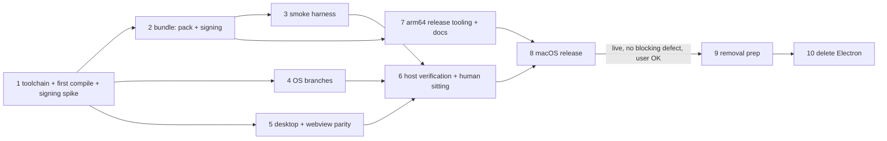

=== FILE: plan.md ===
---
title: "Sai ATLAS on Tauri for macOS (arm64), then remove Electron"
description: "Build, port, verify and ship the existing Tauri 2 core as the arm64 macOS app in the first release after 0.9.17, then delete Electron from the repo once that release is live without a blocking defect."
status: pending
priority: P1
effort: 12.5d
branch: tung491/tauri_macos
tags: [tauri, macos, release, refactor, electron-removal]
created: 2026-10-08
---

# Sai ATLAS on Tauri for macOS (arm64), then remove Electron

Parent plan: [`plans/261002-1441-tauri-shell-migration/plan.md`](../261002-1441-tauri-shell-migration/plan.md). This plan replaces its Phase 12 ([`phase-12-macos-windows-cutover-electron-removal.md`](../261002-1441-tauri-shell-migration/phase-12-macos-windows-cutover-electron-removal.md)). Everything about Windows in that phase is dropped.

Handover: this plan is written for a Sonnet-class executor (`--advice --tdd`). Every task has a mechanical Verify, and every phase carries its own Failure Protocol. Stopping on a failed Verify is intended behavior, not a stall.

## Outcome

The macOS arm64 build of Sai ATLAS is the Tauri app from `src-tauri/`. It ships in the first release after 0.9.17 (normally 0.9.18) as `Sai-ATLAS-<V>-arm64.dmg`, `Sai-ATLAS-<V>-arm64.zip` and the bridge copy `omp-<V>-arm64.dmg`, all listed in an arm64-only `latest-mac.yml` with `minimumSystemVersion: 22.4.0`. In the packaged app the bundled sidecar is `Contents/MacOS/omp`, signed with only its JIT entitlements. The assistant pack is at `Contents/Resources/assistant-pack`. Every session loads it, and a `kill -9` of the app leaves no `omp` or supervisor behind. After that release is live and the user confirms it has no blocking defect, Electron, electron-builder, electron-vite, `src/main/**`, `src/preload/**` and the Playwright suite are deleted. AGENTS.md and the README then describe one Tauri app on Linux and macOS.

## Decisions

| Topic | Decision | Source |
|---|---|---|
| Scope and order | Cut macOS over first. Remove Electron last, and only after the macOS Tauri release is live with no blocking defect. | User, 2026-10-08 (1) |
| Architecture | arm64 only. No Intel DMG or ZIP, no `build:omp:x64`, no `package:tauri:mac:x64`. `latest-mac.yml` lists arm64 assets only. AGENTS.md's release flow is rewritten to match. | User, 2026-10-08 (2) |
| Sidecar source | Clone `nornzach/oh-my-pi` to `~/WORK/oh-my-pi`, nest this GUI repo at `~/WORK/oh-my-pi/packages/gui`, build `resources/omp` there with `bun run build:omp`, then copy it into this worktree. | User, 2026-10-08 (3) |
| Population | Fresh installs only. No macOS build was ever published from this repo, so no Electron→Tauri self-update handover is tested on macOS (the parent's Task 12.2 step 4 is dropped). The `omp-<V>-arm64.dmg` bridge copy stays until 1.0.0. | User, 2026-10-08 (4); `gh release view` |
| Release timing | macOS Tauri ships in the first release after 0.9.17, not inside 0.9.17. | User, 2026-10-08 (5) |
| Windows | Out of scope. Skip every Windows step. | User, 2026-10-05 (6) |
| Signing | Ad-hoc (`-`), with hardened runtime and no notarization, as Electron did (`electron-builder.yml` `identity: "-"`, `hardenedRuntime: true`, `notarize: false`). The host has no signing identity. | Host fact; parity with Electron |
| Entitlements | The app carries only `src-tauri/macos/app.entitlements` (audio-input). The sidecar carries only `src-tauri/macos/omp.entitlements` (allow-jit, allow-unsigned-executable-memory), plus `disable-library-validation` if and only if Task 1.7 shows the ad-hoc sidecar cannot load its native addon without it. The Tauri bundler signs the sidecar with the app's entitlements, so a finalize step re-signs the sidecar, then the app, then rebuilds the DMG from the re-signed app. | Planner; parent Task 12.2 |
| DMG | `tauri.macos.conf.json` builds only the `.app`. `src-tauri/macos/finalize-app.ts` re-signs it and makes the DMG with `hdiutil` (with an `/Applications` link), named the way Tauri names it, so `scripts/release-feeds.ts` finds it unchanged. | Planner, KISS: no edits to Tauri's bundle_dmg flow |
| ZIP | Made by the existing `macZip` in `scripts/release-feeds.ts` (`ditto -c -k --sequesterRsrc --keepParent`) from the finalized `.app`. | Existing code `scripts/release-feeds.ts:133-152` |
| Pack location | `resources/assistant-pack/` → `Contents/Resources/assistant-pack/` via the macOS sidecar overlay, so the code seal covers it. `resolve_pack_dir` learns the `Contents/MacOS` → `Contents/Resources` rule. | Scout gap 1 |
| Sidecar lifetime on macOS | Supervisor plus kqueue `EVFILT_PROC`/`NOTE_EXIT` on the GUI pid as a second parent-death signal, and a recursive descendant snapshot of omp (`proc_listchildpids`) taken before each kill, whose survivors are SIGKILLed after the group kill. The Linux tests run on macOS unchanged except for their process-table helpers. | Parent decision "Sidecar supervisor" |
| Proxy | `scutil --proxy`: HTTPS proxy first, then HTTP. A PAC-only setup gets no proxy and one runtime-log line. | Parent Task 12.1 |
| GPU and RAM | GPU name from `system_profiler SPDisplaysDataType -json`. RAM from `sysctl -n hw.memsize`, because `sysinfo_totalmem` returns 0 off Linux (`src-tauri/src/ollama/hardware.rs:157-160`), so `read_machine` returns `None` on every Mac today. | Parent Task 12.1; planner finding |
| Webview profile isolation | wry ignores `data_directory` on macOS, so each window also gets `data_store_identifier` = the first 16 bytes of SHA-256 of its webview data dir. Throwaway profiles then never share renderer storage with a real install. | Planner finding; user rule "protect the real environment" |
| Quick entry | Keep `tauri-nspanel` 2.1.0 if it builds. Register its plugin, add the Mission Control collection behavior, and drop app-menu actions bound to blocked ⌘ chords while the bar is focused. If it does not build, use the parent's fallback (plain always-on-top window) and record that. | Parent Task 12.1 step 5; scout gap 5 |
| macOS GUI verification | tauri-driver cannot drive WKWebView. Automated checks run from outside the packaged app through a new `scripts/tauri-mac-smoke.ts`: bundle layout, signatures, Info.plist, the pack check against the bundled sidecar, launch and process tree, single instance per profile, and the hard-kill sweep. Page-level and OS-UI checks are NEEDS-HUMAN rows, batched into one sitting (Phase 6). | Planner |
| Floor | Keep macOS 13.3 (Safari 16.4 WebKit). Raise `MAC_UPDATE_FLOOR` to `22.4.0` with its test. No macOS 13 host exists to test on: an accepted risk. | Parent Task 12.2 step 3 |
| Port-by-test gates after removal | When `src/main/**` is deleted, parity entries whose TypeScript file is gone are dropped from `src-tauri/contracts/*.parity.json`. The Playwright twin check (`e2e-tauri/check-twins.ts`) is deleted. Rust tests that read Electron sources either move to the kept copy (pack module, tray mark) or are deleted where their other side no longer exists (i18n table mirror). | Planner |

## Phases

| # | Phase | Depends on | Effort | Status |
|---|---|---|---|---|
| 1 | [Toolchain, sidecar, first macOS compile and signing spike](./phase-01-toolchain-sidecar-first-compile.md) | — | 1.5d | Pending |
| 2 | [A packaged .app with the pack and signed sidecar](./phase-02-bundle-pack-signing.md) | 1 | 1.5d | Pending |
| 3 | [macOS packaged smoke harness](./phase-03-macos-smoke-harness.md) | 2 | 1d | Pending |
| 4 | [OS branches: supervisor, proxy, GPU and RAM](./phase-04-os-branches.md) | 1 | 1.5d | Pending |
| 5 | [Desktop and webview parity](./phase-05-desktop-webview-parity.md) | 1 | 1.5d | Pending |
| 6 | [Host verification and the human sitting](./phase-06-host-verification.md) | 3, 4, 5 | 1d | Pending |
| 7 | [arm64-only release tooling and docs](./phase-07-release-tooling-docs.md) | 2 | 1d | Pending |
| 8 | [macOS release](./phase-08-macos-release.md) | 6, 7 | 0.5d | Pending |
| 9 | [Electron removal: move what stays](./phase-09-removal-prep.md) | 8 + user confirmation | 1.5d | Pending |
| 10 | [Electron removal: delete and rename](./phase-10-electron-removal.md) | 9 | 1.5d | Pending |

File ownership (no two phases that may run at the same time touch the same file):

| Phase | Owns |
|---|---|
| 2 | `src-tauri/src/omp/assistant_pack.rs`, `src-tauri/macos/*`, `src-tauri/tauri.macos.conf.json`, `scripts/stage-tauri-sidecar.ts`, `scripts/tauri-packaging-config.test.ts`, `scripts/finalize-app.test.ts`, `package.json` scripts |
| 3 | `scripts/tauri-mac-smoke.ts`, `scripts/tauri-mac-smoke.test.ts` |
| 4 | `src-tauri/src/omp/supervisor.rs`, `src-tauri/src/omp/proxy.rs`, `src-tauri/src/ollama/hardware.rs` |
| 5 | `src-tauri/src/lib.rs`, `src-tauri/src/webview.rs`, `src-tauri/src/paths.rs`, `src-tauri/src/desktop/{windows,menu,quick_entry_core}.rs` |
| 7 | `scripts/release-feeds.ts`, `scripts/release-feeds.test.ts`, `scripts/mac-update-floor.ts`, `scripts/mac-update-floor.test.ts`, `scripts/tauri-packaging-config.test.ts` (asset-name test only, after Phase 2 is merged), `AGENTS.md`, `README.md`, `README.vi.md`, `CHANGELOG.md` |

Phases 4 and 5 own disjoint files and may run one after the other or at the same time. There is one Mac, so in practice run them in sequence: 4, then 5.

## Execution rules

- **Working copy.** Do all work in `/Users/tung491/orca/workspaces/oh-my-pi-gui/tauri_macos` on branch `tung491/tauri_macos`. Every git command runs there and acts on the GUI repo. Never commit GUI paths into the monorepo at `~/WORK/oh-my-pi`.
- **Cargo.** Run every cargo command with rustup's cargo first on PATH: `export PATH="$HOME/.cargo/bin:$PATH"` in the shell that runs it (see `scripts/rust-pins.env`). Never edit the user's shell profile. All `cargo` commands in this plan use `--manifest-path src-tauri/Cargo.toml` from the repo root.
- **Sidecar route.** Build `resources/omp` only in `~/WORK/oh-my-pi/packages/gui` with `bun run build:omp`, then copy it to `<worktree>/resources/omp`. Build one target at a time: the build patches the shared monorepo while it runs. Every task that runs the agent first checks `test -x resources/omp`. Never commit `resources/omp*`.
- **Protect the user.**
  - Every app run uses a throwaway profile and agent dir: `P=$(mktemp -d); <app>/Contents/MacOS/sai-atlas --user-data-dir="$P/profile"` with `PI_CODING_AGENT_DIR="$P/agent"` in its environment. When a run goes through `open`, pass `--env PI_CODING_AGENT_DIR="$P/agent"` and `--args --user-data-dir="$P/profile"`.
  - Never copy a build into `/Applications`, and never run a build from there. Packaged apps stay under `src-tauri/target/` or a `mktemp -d` folder.
  - Never touch `~/Library/Application Support/@oh-my-pi/omp-gui`. Task 1.1 records that it does not exist, and every phase ends by checking that it still does not exist.
  - Paths a packaged run creates under the bundle id: `~/Library/WebKit/vn.io.vif.saiatlas`, `~/Library/Caches/vn.io.vif.saiatlas`, `~/Library/HTTPStorages/vn.io.vif.saiatlas`, `~/Library/Saved Application State/vn.io.vif.saiatlas.savedState`, and LaunchServices plus TCC entries. These belong to test builds only, because Task 1.1 records that none existed before. Phase 6 Task 6.4 removes them, unregisters the test apps with `lsregister -u`, and resets TCC with `tccutil reset Microphone vn.io.vif.saiatlas`.
- **Processes.** Track every process you start (command, PID). Stop what you started before a phase ends: `pkill -TERM -f "<exact app path>/Contents/MacOS/sai-atlas"` scoped to the exact path, never a bare `pkill sai-atlas`. At phase end, `pgrep -fl "omp --mode rpc-ui"` and `pgrep -fl -- "--omp-supervise"` must print nothing that you started.
- **Manual checks.** The executor cannot do on-screen checks alone (TCC microphone prompt, quick entry over a full-screen app, the global chord, tray, notifications, `omp://` clicks, a settings toggle in the UI). Record each one as `NEEDS-HUMAN` with exact steps in `reports/macos-parity.md`. Do not wait for them: Phase 6 batches them into one sitting with the user.
- **Commits.** Commit to this GUI repo in conventional-commit form, without AI references, plan IDs, phase numbers or audit labels in messages, code comments or test names. One commit per task group that leaves every gate green.
- **Pushing, tagging, releasing.** `git push`, `git tag` pushes, `gh release create/upload/edit` and anything that publishes require the user's explicit go-ahead at that moment. Ask, quoting the exact command, and wait.
- **Reports.** The executor writes run evidence to `plans/261008-0341-tauri-macos-cutover/reports/macos-host-log.md` (tool versions, commits, decisions taken at decision points) and `plans/261008-0341-tauri-macos-cutover/reports/macos-parity.md` (one line per check: `macOS <check name>: PASS|FAIL|NEEDS-HUMAN`).
- **Regression gate** (named in each phase, run from the repo root on this Mac):
  1. `cargo clippy --manifest-path src-tauri/Cargo.toml --all-targets --all-features -- -D warnings` exits 0
  2. `cargo test --manifest-path src-tauri/Cargo.toml --all-features` exits 0
  3. `for p in src-tauri/contracts/*.parity.json; do bun scripts/check-test-parity.ts "$(basename "$p" .parity.json)" || exit 1; done` exits 0
  4. `bash scripts/check-module.sh snapshots` exits 0 and prints `check-module snapshots: PASS`
  5. `bunx vitest run` exits 0
  6. `bun run check:types` exits 0
  7. `bunx biome check <files touched in the phase>` exits 0

## Acceptance criteria

- [ ] `cargo tauri --version` prints `tauri-cli 2.12.1` on the Mac (Phase 1).
- [ ] `grep -rn "is not implemented on this OS" src-tauri/src` prints nothing (Phase 4).
- [ ] The regression gate passes on the Mac at the end of Phases 1, 2, 4, 5, 7, 9 and 10, and CI (`.github/workflows/ci.yml`) is green on the pushed branch.
- [ ] `bun run package:tauri:mac:arm64` exits 0 and leaves exactly one `.app` in `src-tauri/target/aarch64-apple-darwin/release/bundle/macos/` and one `.dmg` in `…/bundle/dmg/` (Phase 2).
- [ ] `bun scripts/tauri-mac-smoke.ts "<app>"` prints `tauri-mac-smoke: PASS` with zero `FAIL` lines (Phases 3 and 6).
- [ ] `grep -c ": FAIL$" plans/261008-0341-tauri-macos-cutover/reports/macos-parity.md` prints `0`, and `grep -c ": NEEDS-HUMAN$"` prints `0` after the sitting (Phase 6).
- [ ] `package.json` has no `build:omp:x64` and no `package:tauri:mac:x64`. `scripts/release-feeds.ts` has no `--mac-x64` option (Phases 2, 7).
- [ ] The published `latest-mac.yml` for `<V>` lists exactly `Sai-ATLAS-<V>-arm64.zip`, `Sai-ATLAS-<V>-arm64.dmg` and `omp-<V>-arm64.dmg`, carries `minimumSystemVersion: 22.4.0`, and passes `bun run check:mac-update-floor` (Phase 8).
- [ ] After Phase 10: `git ls-files | grep -E "^(src/main|src/preload|e2e)/|electron-builder|electron\.vite|playwright\.config"` prints nothing, and `grep -E "\"(electron|electron-builder|electron-vite|electron-store|electron-updater|electron-log|@playwright/test)\"" package.json` prints nothing.

## Risks

| Risk | L × I | Mitigation |
|---|---|---|
| `tauri-nspanel` 2.1.0 fails to build against Tauri 2.12, or panics at `to_panel` without its plugin | M × H | Task 1.6 compiles it first. Task 5.3 registers `tauri_nspanel::init()`. The documented fallback is a plain always-on-top window. |
| The ad-hoc, hardened Bun sidecar cannot load its native addon or JIT, so every session fails | M × H | Task 1.7 spike signs the real sidecar and runs the pack check before any packaging work. `disable-library-validation` is added only on evidence. |
| The Tauri bundler signs the sidecar with the app entitlements | H × H | `src-tauri/macos/finalize-app.ts` re-signs the sidecar, then the app, and the smoke harness asserts each entitlement set exactly |
| Never-compiled `cfg(target_os = "macos")` code and tests that assume Linux fail on first compile | H × M | Phase 1 compiles and tests first, before any porting. Per-error fixes follow the stated rule, and Linux-by-design tests are gated, never deleted. |
| WKWebView refuses `getUserMedia` (no permission delegate, or the custom scheme is not a secure context) | M × H | Task 5.5 checks wry's delegate in source, and the Phase 6 sitting records a dictation transcript. A failure escalates through the Failure Protocol, and the release waits. |
| Test runs register the test `.app` with LaunchServices for `omp://` and leave TCC or WebKit state under the real bundle id | H × M | No real install exists (Task 1.1). Task 6.4 cleans all of it and records the result. |
| A release with only macOS assets breaks Linux updates (`latest/download/latest-linux.yml` 404s) | M × H | Phase 8 requires the same-version Linux assets from the Linux host before publishing. The draft is published only with every asset. |
| macOS 13.x users (the floor) are untested | M × M | Accepted, and stated in the release notes. A user report on 13.x is a blocking-defect candidate before removal. |
| API snapshots generated on Linux differ on macOS because of target-specific items | L × M | New helpers are `pub(crate)`. A snapshot diff on the Mac stops the phase (Failure Protocol), and CI on Linux stays the authority. |
| Electron removal breaks a kept script or test that reads `src/main/**` | H × H | Phase 9 moves every kept dependency while Electron still exists (enumerated with file:line). Phase 10 deletes only after a grep shows zero references, and the `electron-final` tag gives a rollback. |

## Rollback

- Phases 1–7: revert the phase's commits (`git revert <sha>`). Nothing has shipped.
- Phase 8: until the user publishes, delete the draft. After publishing, mark the release a pre-release only with the user's go-ahead, so `latest/download` falls back to the previous release, then fix forward with a higher version. Since no Mac ever received a macOS build from this repo, there is no Electron macOS build to fall back to.
- Phases 9–10: `git revert` the removal commits, or branch from the `electron-final` tag Task 9.1 creates.

## Unresolved questions

1. The Linux assets for `<V>` come from the Linux host. Who builds them, and when (Phase 8 Task 8.3)? The release cannot publish without them.
2. Should `scripts/capture-showcase.ts` (Electron Playwright screenshots, README "Reproduce the screenshots") be ported or deleted in Phase 10? The plan deletes it only if the user agrees and otherwise stops at Task 10.3.
3. Is any Mac on macOS 13.3–13.x available for one launch test? Without one, the floor stays an accepted risk.

=== FILE: phase-01-toolchain-sidecar-first-compile.md ===
---
phase: 1
title: "Toolchain, sidecar, first macOS compile and signing spike"
status: pending
priority: P1
effort: "1.5d"
dependencies: []
---

# Phase 1: Toolchain, sidecar, first macOS compile and signing spike

## Goal

The Mac can build everything this plan needs: `cargo tauri` 2.12.1, `cargo public-api` 0.52.0 with its nightly, a sidecar `resources/omp` built from the monorepo, the assistant pack, and a clean `clippy` and `cargo test` of `src-tauri/` on `aarch64-apple-darwin`. The phase also measures, before any packaging, which entitlements an ad-hoc, hardened Bun sidecar needs.

## Context

- `scripts/rust-pins.env` pins `CARGO_PUBLIC_API_VERSION="0.52.0"` and `PUBLIC_API_TOOLCHAIN="nightly-2026-10-01"`. The Linux build image pins tauri-cli 2.12.1 (`scripts/tauri-linux-build/Dockerfile:60`).
- No `cfg(target_os = "macos")` code has ever been compiled. The gate-9 cross check in `scripts/check-module.sh:207-224` only ever printed WARN on Linux.
- `tauri-nspanel = "2"` (lock: 2.1.0, `src-tauri/Cargo.lock:4400-4403`) is used at `src-tauri/src/desktop/windows.rs:1027-1035`.
- `scripts/stage-tauri-sidecar.ts:24-28` maps `aarch64-apple-darwin` to `resources/omp`.

## Files

- Create: `plans/261008-0341-tauri-macos-cutover/reports/macos-host-log.md`, `plans/261008-0341-tauri-macos-cutover/reports/macos-parity.md`
- Modify (only to fix first-compile errors, Task 1.6/1.7 rules): any file under `src-tauri/src/` that clippy or `cargo test` names
- Outside the repo: `~/WORK/oh-my-pi` (monorepo clone), `~/.cargo/bin` (tools)

## Tasks

### Task 1.1 — Record the protected baseline
- Goal: a written record that no Sai ATLAS install, profile or bundle-id state exists on this Mac before any run.
- Target files: `plans/261008-0341-tauri-macos-cutover/reports/macos-host-log.md` (create).
- Steps:
  1. Run, and paste each command with its output under a `## Baseline` heading:
     `ls /Applications | grep -iE "sai atlas|omp" ; echo "exit=$?"`
     `test -e "$HOME/Library/Application Support/@oh-my-pi/omp-gui"; echo "profile=$?"`
     `ls -d "$HOME/Library/WebKit/vn.io.vif.saiatlas" "$HOME/Library/Caches/vn.io.vif.saiatlas" "$HOME/Library/HTTPStorages/vn.io.vif.saiatlas" "$HOME/Library/Saved Application State/vn.io.vif.saiatlas.savedState" 2>&1`
     `git rev-parse HEAD`
  2. Create `plans/261008-0341-tauri-macos-cutover/reports/macos-parity.md` with the single heading `# macOS parity`.
- Success criteria: the log shows `exit=1`, `profile=1` and four "No such file or directory" lines.
- Verify: `grep -c "profile=1" plans/261008-0341-tauri-macos-cutover/reports/macos-host-log.md` prints `1`. If the baseline is not clean (an install or profile exists), STOP and follow the Failure Protocol: the protection rules assume a clean Mac.

### Task 1.2 — Install tauri-cli 2.12.1
- Goal: `cargo tauri` works with the version the Linux image uses.
- Target files: none in the repo.
- Steps:
  1. `export PATH="$HOME/.cargo/bin:$PATH"`
  2. `cargo install tauri-cli --version 2.12.1 --locked`
  3. Append `cargo tauri --version` and its output to the host log.
- Success criteria: the command exists.
- Verify: `PATH="$HOME/.cargo/bin:$PATH" cargo tauri --version` exits 0 and prints `tauri-cli 2.12.1`.

### Task 1.3 — Install the snapshot tools
- Goal: `bash scripts/check-module.sh snapshots` can run on the Mac.
- Steps:
  1. `"$HOME/.cargo/bin/cargo" install cargo-public-api --version 0.52.0 --locked`
  2. `"$HOME/.cargo/bin/rustup" toolchain install nightly-2026-10-01 --profile minimal`
- Success criteria: both tools exist at the pinned versions.
- Verify: `"$HOME/.cargo/bin/cargo" public-api --version` prints `cargo-public-api 0.52.0`, and `"$HOME/.cargo/bin/rustup" run nightly-2026-10-01 rustc --version` exits 0.

### Task 1.4 — Clone the monorepo, nest the GUI repo, build the sidecar
- Goal: `<worktree>/resources/omp` is an arm64 Mach-O sidecar built from `nornzach/oh-my-pi` with this branch's `patches/omp/*.patch` applied.
- Target files: `~/WORK/oh-my-pi`, `~/WORK/oh-my-pi/packages/gui`, `<worktree>/resources/omp` (gitignored).
- Steps:
  1. `test -e ~/WORK/oh-my-pi || git clone https://github.com/nornzach/oh-my-pi ~/WORK/oh-my-pi`
  2. `test -e ~/WORK/oh-my-pi/packages/gui/.git || git clone https://github.com/tung491/oh-my-pi-gui ~/WORK/oh-my-pi/packages/gui`
  3. Put the nested GUI checkout on this branch's commit (it may not be pushed): `git -C ~/WORK/oh-my-pi/packages/gui fetch /Users/tung491/orca/workspaces/oh-my-pi-gui/tauri_macos tung491/tauri_macos && git -C ~/WORK/oh-my-pi/packages/gui checkout --detach FETCH_HEAD`
  4. `cd ~/WORK/oh-my-pi && bun install`, then `cd ~/WORK/oh-my-pi/packages/gui && bun install && bun run build:omp`
  5. `cp ~/WORK/oh-my-pi/packages/gui/resources/omp /Users/tung491/orca/workspaces/oh-my-pi-gui/tauri_macos/resources/omp`
  6. Append to the host log: `git -C ~/WORK/oh-my-pi rev-parse HEAD` (the monorepo commit; release notes need it) and `file resources/omp`.
- Success criteria: the sidecar exists, runs and is arm64. `git -C ~/WORK/oh-my-pi status --short` is empty after the build: `build:omp` reverts its patches.
- Verify: `file resources/omp` prints a line containing `Mach-O 64-bit executable arm64`, `resources/omp --version` exits 0, and `git -C ~/WORK/oh-my-pi status --short | wc -l` prints `0`.

### Task 1.5 — Build the assistant pack and prove the sidecar loads it
- Goal: `resources/assistant-pack/` exists, and the sidecar loads exactly the pack. This is the AGENTS.md patch check: `modelPolicy`, `mcp.enabled` and `--no-context-files` are honored.
- Steps:
  1. `bun run build:pack`
  2. `bun scripts/check-assistant-pack.ts resources/omp resources/assistant-pack`
- Success criteria: every row of the check passes.
- Verify: the check exits 0. `ls resources/assistant-pack/skills/word-report/SKILL.md` exits 0.

### Task 1.6 — First macOS compile: clippy clean
- Goal: `cargo clippy --all-targets --all-features -- -D warnings` exits 0 on `aarch64-apple-darwin`.
- Target files: whichever `src-tauri/src/**` files clippy names. The likeliest are `src-tauri/src/desktop/windows.rs:1027-1035` (nspanel), `src-tauri/src/lib.rs`, `src-tauri/src/desktop/mod.rs`, `src-tauri/src/updater/mod.rs:603-612` and `src-tauri/src/omp/supervisor.rs:293-331`.
- Steps:
  1. `bun run build:renderer:tauri` (`tauri::generate_context!` needs `out/renderer-tauri/index.html`).
  2. `cargo clippy --manifest-path src-tauri/Cargo.toml --all-targets --all-features -- -D warnings 2>&1 | tee "$TMPDIR/clippy-mac.txt"`. Copy the list of distinct `error:` headlines into the host log.
  3. Fix rule for each error:
     - A macOS-only item that is unused, or only used by tests: gate it to its real OS set (`#[cfg(any(target_os = "linux", test))]` and the like), mirroring the existing `#[cfg_attr(not(test), allow(dead_code))]` pattern at `src-tauri/src/desktop/quick_entry_core.rs:132`.
     - An API mismatch inside a `cfg(target_os = "macos")` block: fix the call to the crate's actual signature. Read the signature in `~/.cargo/registry/src/*/<crate>-<version>/src`.
     - `tauri-nspanel` itself fails to compile (the error is inside the crate, not in our code): STOP and record `tauri-nspanel 2.1.0: does not build` in the host log. Then apply the parent fallback: remove the `[target.'cfg(target_os = "macos")'.dependencies] tauri-nspanel` entry from `src-tauri/Cargo.toml`, replace the `#[cfg(target_os = "macos")]` block at `windows.rs:1027-1035` with `let _ = window.set_always_on_top(true); let _ = window.set_visible_on_all_workspaces(true);`, run `cargo update -p tauri-nspanel --manifest-path src-tauri/Cargo.toml` (expected to drop it from the lock), and record `quick-entry: always-on-top fallback` in the host log.
     - Anything else, or a fix that would change Linux behavior: Failure Protocol.
  4. Re-run step 2 until it exits 0.
- Success criteria: clippy is clean on the Mac, and the Linux-only code paths are unchanged (`git diff --stat` touches only cfg attributes and macOS blocks).
- Verify: `cargo clippy --manifest-path src-tauri/Cargo.toml --all-targets --all-features -- -D warnings` exits 0.

### Task 1.7 — Signing spike: what the hardened ad-hoc sidecar needs
- Goal: a recorded, evidence-based answer to "does `omp` signed with `src-tauri/macos/omp.entitlements` under hardened runtime load its native addon and run the pack?"
- Target files: none in the repo. Work on a copy in `$S=$(mktemp -d)`.
- Steps:
  1. `S=$(mktemp -d); cp resources/omp "$S/omp"`
  2. `codesign --force --sign - --options runtime --entitlements src-tauri/macos/omp.entitlements "$S/omp"`
  3. `codesign -d --entitlements - --xml "$S/omp" 2>/dev/null | plutil -p -` and paste the output to the host log.
  4. `bun scripts/check-assistant-pack.ts "$S/omp" resources/assistant-pack; echo "spike=$?"`
  5. If step 4 printed `spike=0`, record `entitlements: omp.entitlements unchanged` in the host log. If it failed, and its output or `log show --last 2m --predicate 'process == "omp"' | grep -i "library validation\|code signature"` mentions library validation, repeat steps 2–4 with a scratch copy of the entitlements that adds `com.apple.security.cs.disable-library-validation`. If that passes, record `entitlements: add disable-library-validation`. Task 2.3 then adds the key to `src-tauri/macos/omp.entitlements`. Any other failure: Failure Protocol.
- Success criteria: the host log holds exactly one `entitlements:` decision line, backed by a passing pack check.
- Verify: `grep -cE "^entitlements: (omp.entitlements unchanged|add disable-library-validation)$" plans/261008-0341-tauri-macos-cutover/reports/macos-host-log.md` prints `1`.

### Task 1.8 — cargo test on macOS
- Goal: `cargo test --all-features` exits 0 on the Mac.
- Target files: whichever test modules fail.
- Steps:
  1. `cargo test --manifest-path src-tauri/Cargo.toml --all-features 2>&1 | tee "$TMPDIR/test-mac.txt"`. Copy the `failures:` list into the host log.
  2. Fix rule for each failing test:
     - The test asserts a fact that is Linux-only by design (a `/proc` path, `/usr/bin/...`, D-Bus, `.deb` or AppImage, WebKitGTK): add `#[cfg(target_os = "linux")]` to that one test, and write the reason in the host log as `gated: <test path> — <reason>`. Never delete a test, never weaken an assertion.
     - The test shows a real macOS behavior bug in code this plan does not otherwise own: Failure Protocol.
     - Tests in `src-tauri/src/omp/supervisor.rs` are already `cfg(all(test, target_os = "linux"))` and run on macOS from Phase 4 onward. Do not touch them here.
  3. Re-run step 1 until it exits 0.
- Success criteria: green, with every gate listed in the host log.
- Verify: `cargo test --manifest-path src-tauri/Cargo.toml --all-features` exits 0, and its output contains `test result: ok` with no `FAILED`.

### Task 1.9 — Regression gate and commit
- Steps: run the plan's regression gate items 1–7. Commit the compile fixes as `fix(tauri): compile and test the macOS build` (only if files changed).
- Verify: every gate command exits 0, and `bash scripts/check-module.sh snapshots` prints `check-module snapshots: PASS`. `test -e "$HOME/Library/Application Support/@oh-my-pi/omp-gui"; echo $?` prints `1`.

## Test matrix

| Level | What | Command |
|---|---|---|
| Compile | every target and feature on aarch64-apple-darwin | Task 1.6 clippy |
| Unit/integration | full Rust suite on macOS | Task 1.8 |
| Sidecar | pack, local-only models, MCP off, no context files | Task 1.5, 1.7 pack check |

## Regression gate

Plan regression gate items 1–7, all exit 0.

## Rollback

`git revert` the compile-fix commit. The tools and clone outside the repo are harmless to leave.

## Failure Protocol
If any Verify step does not meet its stated pass condition, STOP this phase.
Do not improvise a fix, retry blindly, or reason around the failure.
Spawn the `kongming` subagent for next-step counsel and pass:
- the phase and task id,
- what you attempted (the steps you ran),
- the exact command and its full output,
- the pass condition it failed to meet.
Apply kongming's guidance, then re-run the Verify step.
If `kongming` cannot be spawned in this environment, STOP and report the same
failure evidence to the user. Never continue by self-reasoning.

=== FILE: phase-02-bundle-pack-signing.md ===
---
phase: 2
title: "A packaged .app with the pack and signed sidecar"
status: pending
priority: P1
effort: "1.5d"
dependencies: [1]
---

# Phase 2: A packaged .app with the pack and signed sidecar

## Goal

`bun run package:tauri:mac:arm64` produces a `.app` whose sidecar `Contents/MacOS/omp` carries only the sidecar entitlements and whose assistant pack sits at `Contents/Resources/assistant-pack`. The GUI finds that pack and the launched app starts a session sidecar. The phase also produces a DMG made from the re-signed app, and removes the Intel macOS scripts.

## Context

- `src-tauri/src/omp/assistant_pack.rs:42-57` `resolve_pack_dir(binary, search_from)` returns `<binary dir>/assistant-pack`, else a walk-up `resources/assistant-pack` from `search_from`. In a packaged build `search_from` is empty (`src-tauri/src/omp/manager.rs:468-474` `pack_search_from`), and the binary is `Contents/MacOS/omp`. So today it resolves `Contents/MacOS/assistant-pack`, which does not exist, and `manager.rs:542-546` refuses every session.
- `src-tauri/macos/sidecar.conf.json` holds `externalBin` only. The Linux overlay also maps `"../resources/assistant-pack/": "assistant-pack/"` (`src-tauri/linux/sidecar.conf.json`).
- `package.json` `package:tauri:mac:arm64` has no `bun run build:pack`, unlike `package:tauri:linux`.
- `scripts/tauri-packaging-config.test.ts:187-190` asserts the macOS overlay has no `resources`, and `:213-217` lists `package:tauri:mac:x64`.
- Tauri signs `externalBin` with the app's entitlements, so the sidecar would get `audio-input` and no JIT.

## Files

- Modify: `src-tauri/src/omp/assistant_pack.rs`, `src-tauri/macos/sidecar.conf.json`, `src-tauri/macos/omp.entitlements` (only if Task 1.7 decided so), `src-tauri/tauri.macos.conf.json`, `package.json` (scripts only), `scripts/stage-tauri-sidecar.ts`, `scripts/tauri-packaging-config.test.ts`
- Create: `src-tauri/macos/finalize-app.ts`, `scripts/finalize-app.test.ts`

## Tasks

### Task 2.1 — Red: the pack is found in Contents/Resources
- Goal: a failing Rust test that describes the macOS bundle layout.
- Target files: `src-tauri/src/omp/assistant_pack.rs`, `mod tests` (after `resolves_the_pack_beside_the_sidecar_binary`, around line 359).
- Steps:
  1. Add the test `resolves_the_pack_in_the_app_bundle_resources`:
     - temp root; `binary = root/Sai ATLAS.app/Contents/MacOS/omp` (`write_file`); `write_pack(root/Sai ATLAS.app/Contents/Resources/assistant-pack, PACK_FILES)`.
     - `assert_eq!(resolve_pack_dir(&binary, &[]), root/Sai ATLAS.app/Contents/Resources/assistant-pack)`.
     - With no pack anywhere (second temp root, same layout, no `write_pack`): `assert_eq!(resolve_pack_dir(&binary2, &[]), root2/…/Contents/Resources/assistant-pack)`, so the missing-file message names where the pack belongs in a bundle.
     - A binary in a folder named `MacOS` whose parent is not `Contents` keeps the beside-binary rule: `assert_eq!(resolve_pack_dir(&root3/MacOS/omp, &[]), root3/MacOS/assistant-pack)`.
- Success criteria: the test compiles and fails on the first assertion.
- Verify (red): `cargo test --manifest-path src-tauri/Cargo.toml --all-features resolves_the_pack_in_the_app_bundle_resources` exits non-zero with an assertion failure (`assertion `left == right` failed`). A pass here is a failure of this task.

### Task 2.2 — Green: the bundle rule in resolve_pack_dir
- Goal: the Task 2.1 test passes, and every existing `resolve_pack_dir` test still passes.
- Target files: `src-tauri/src/omp/assistant_pack.rs` (`resolve_pack_dir`, its doc comment).
- Steps:
  1. Add a private fn `bundle_resources_pack(binary: &Path) -> Option<PathBuf>`. It returns `Some(<binary dir>/../Resources/assistant-pack)`, made absolute and lexically joined without `..` (use `parent()` twice, then `.join("Resources").join(PACK_DIR_NAME)`), when the binary's parent's file name is `MacOS` and its grandparent's file name is `Contents`. Otherwise it returns `None`. The rule is structural, not `cfg`-gated, so it is tested on every OS.
  2. In `resolve_pack_dir`: compute `bundle = bundle_resources_pack(binary)`. If `bundle` is a dir, return it, before the beside-binary check. In the final fallback, prefer `bundle` over `beside`.
  3. Extend the doc comment with one sentence: in a macOS bundle the pack lives in `Contents/Resources`, which the code seal covers.
- Success criteria: green.
- Verify: `cargo test --manifest-path src-tauri/Cargo.toml --all-features omp::assistant_pack` exits 0 and prints `test result: ok`.

### Task 2.3 — Red: packaging config tests for the macOS overlay and arm64-only scripts
- Goal: failing vitest assertions that pin the new macOS packaging contract.
- Target files: `scripts/tauri-packaging-config.test.ts` (tests at lines 187-190 and 213-217).
- Steps:
  1. Rename the test at line 187 to `the macOS config ships binaries/omp as externalBin and the assistant pack as a resource`. Assert `bundled("macos").bundle?.externalBin` equals `["binaries/omp"]` and `bundled("macos").bundle?.resources` equals `{ "../resources/assistant-pack/": "assistant-pack/" }`.
  2. In the test at line 213, delete the `"package:tauri:mac:x64"` entry. Add assertions that `package.json` scripts have no key `package:tauri:mac:x64` and no key `build:omp:x64`, and that `scripts["package:tauri:mac:arm64"]` starts with `bun run build:pack && ` and contains `bun src-tauri/macos/finalize-app.ts`.
  3. Add the test `the macOS config builds only the app bundle; the finalize step makes the DMG`: `expect(platform("macos").bundle?.targets).toEqual(["app"])`. Change the existing `toEqual(["dmg", "app"])` at line 170 to `["app"]`.
  4. Add the test `the sidecar entitlements hold only what the Bun runtime needs`: read `src-tauri/macos/omp.entitlements`, collect every `<key>…</key>`, and expect exactly `["com.apple.security.cs.allow-jit", "com.apple.security.cs.allow-unsigned-executable-memory"]`. Append `"com.apple.security.cs.disable-library-validation"` only if the host log holds `entitlements: add disable-library-validation`. Read `src-tauri/macos/app.entitlements` the same way and expect exactly `["com.apple.security.device.audio-input"]`.
  5. In `scripts/stage-tauri-sidecar.ts` add nothing yet.
- Success criteria: the suite fails on the new assertions only.
- Verify (red): `bunx vitest run scripts/tauri-packaging-config.test.ts` exits non-zero, and its output names the renamed externalBin test and the `["app"]` assertion as failing. Passing here is a failure of this task.

### Task 2.4 — Green: overlay, config, scripts, entitlements
- Goal: Task 2.3 passes.
- Target files: `src-tauri/macos/sidecar.conf.json`, `src-tauri/tauri.macos.conf.json`, `package.json` (`scripts`), `scripts/stage-tauri-sidecar.ts` (`SIDECAR_SOURCES`), `src-tauri/macos/omp.entitlements` (conditional).
- Steps:
  1. `src-tauri/macos/sidecar.conf.json` → `{ "bundle": { "externalBin": ["binaries/omp"], "resources": { "../resources/assistant-pack/": "assistant-pack/" } } }`
  2. `src-tauri/tauri.macos.conf.json`: `"targets": ["app"]`. Keep `minimumSystemVersion` `13.3`, `signingIdentity` `-` and `entitlements`.
  3. `package.json`:
     - delete the `package:tauri:mac:x64` and `build:omp:x64` scripts;
     - set `package:tauri:mac:arm64` to `bun run build:pack && bun scripts/stage-tauri-sidecar.ts aarch64-apple-darwin && bash -c 'source scripts/rust-pins.env && PATH="$CARGO_HOME_BIN:$PATH" cargo tauri build --target aarch64-apple-darwin --config src-tauri/macos/sidecar.conf.json' && bun src-tauri/macos/finalize-app.ts src-tauri/target/aarch64-apple-darwin/release/bundle`.
  4. `scripts/stage-tauri-sidecar.ts`: remove the `"x86_64-apple-darwin": "resources/omp.x64"` entry.
  5. Only if the host log says `entitlements: add disable-library-validation`: add `<key>com.apple.security.cs.disable-library-validation</key><true/>` to `src-tauri/macos/omp.entitlements`, and extend its comment: "and, ad-hoc signed, loading its own native addon".
  6. `grep -rn "omp.x64\|x86_64-apple-darwin\|build:omp:x64" scripts src-tauri package.json` must now list only lines in `scripts/release-feeds.ts`, `scripts/release-feeds.test.ts` and `src-tauri/src/updater/` (Phase 7 owns the feed script; the updater keeps its x64 rule for completeness).
- Success criteria: green, and `src-tauri/macos/finalize-app.ts` does not exist yet (Task 2.6 creates it).
- Verify: `bunx vitest run scripts/tauri-packaging-config.test.ts` exits 0.

### Task 2.5 — Red: finalize-app tests
- Goal: failing unit tests for the pure parts of the finalize step.
- Target files: `scripts/finalize-app.test.ts` (create; pattern: `scripts/finalize-deb.test.ts` imports from `../src-tauri/linux/finalize-deb`).
- Steps: import `{ finalizePlan, dmgNameFor }` from `../src-tauri/macos/finalize-app`, and write:
  1. `it("signs the sidecar before the app, each with its own entitlements")`: `finalizePlan("/b/macos/Sai ATLAS.app", "/repo")` returns a list of argv arrays whose first two are exactly `["codesign","--force","--sign","-","--options","runtime","--entitlements","/repo/src-tauri/macos/omp.entitlements","/b/macos/Sai ATLAS.app/Contents/MacOS/omp"]` and `["codesign","--force","--sign","-","--options","runtime","--entitlements","/repo/src-tauri/macos/app.entitlements","/b/macos/Sai ATLAS.app"]`, followed by `["codesign","--verify","--strict","--deep","/b/macos/Sai ATLAS.app"]`. No argv contains `--deep` together with `--sign`.
  2. `it("names the DMG the way the Tauri bundler does")`: `dmgNameFor("0.9.18")` is `Sai ATLAS_0.9.18_aarch64.dmg`.
- Verify (red): `bunx vitest run scripts/finalize-app.test.ts` exits non-zero (module not found). Passing is a failure of this task.

### Task 2.6 — Green: src-tauri/macos/finalize-app.ts
- Goal: a finalize script that re-signs and makes the DMG, with the Task 2.5 tests green.
- Target files: `src-tauri/macos/finalize-app.ts` (create).
- Steps:
  1. Header doc comment in the style of `src-tauri/linux/finalize-deb.ts:1-30`. It states why: the bundler signs `externalBin` with the app's entitlements, so the sidecar is re-signed with its own, then the app, and the DMG is built from the re-signed app.
  2. Export `finalizePlan(appPath: string, root: string): string[][]` and `dmgNameFor(version: string): string`, exactly as tested.
  3. `if (import.meta.main)`: argument = the bundle dir (`…/release/bundle`).
     - Find exactly one `*.app` in `<bundle>/macos` (else exit 1 with a message). Read `version` from the repo's `package.json`.
     - Run every `finalizePlan` argv with `Bun.spawnSync`, stopping on the first non-zero exit.
     - Make the DMG: `stage=$(mktemp -d)`, `ditto "<app>" "<stage>/Sai ATLAS.app"`, `ln -s /Applications "<stage>/Applications"`, `mkdir -p <bundle>/dmg`, remove any `*.dmg` there, then `hdiutil create -volname "Sai ATLAS" -srcfolder <stage> -fs HFS+ -format UDZO -ov "<bundle>/dmg/<dmgNameFor(version)>"`.
     - Print `finalized <app>` and `dmg <path>`.
  4. Use only `node:fs`, `node:path`, `node:os` and Bun APIs, with no new dependency.
- Success criteria: tests green, and biome clean.
- Verify: `bunx vitest run scripts/finalize-app.test.ts` exits 0, and `bunx biome check src-tauri/macos/finalize-app.ts scripts/finalize-app.test.ts` exits 0.

### Task 2.7 — Build the package
- Goal: a real finalized `.app` and DMG.
- Steps:
  1. `test -x resources/omp` (else redo Task 1.4).
  2. `bun run package:tauri:mac:arm64 2>&1 | tee "$TMPDIR/package-mac.txt"`
- Success criteria: exit 0; `…/bundle/macos/Sai ATLAS.app` and `…/bundle/dmg/Sai ATLAS_<version>_aarch64.dmg` exist.
- Verify: the command exits 0, and `ls src-tauri/target/aarch64-apple-darwin/release/bundle/macos/*.app | wc -l` prints `1`, and `ls src-tauri/target/aarch64-apple-darwin/release/bundle/dmg/*.dmg | wc -l` prints `1`.

### Task 2.8 — Inspect the bundle by hand (the harness automates this in Phase 3)
- Goal: evidence that the layout, signatures and URL scheme are right before building the harness.
- Steps (`A="src-tauri/target/aarch64-apple-darwin/release/bundle/macos/Sai ATLAS.app"`):
  1. `ls "$A/Contents/MacOS/omp" "$A/Contents/Resources/assistant-pack/config.yml"`
  2. `codesign -d --entitlements - --xml "$A/Contents/MacOS/omp" 2>/dev/null | plutil -p -` and the same for `"$A"`
  3. `codesign -dv "$A" 2>&1 | grep -E "Identifier=|flags="`
  4. `plutil -extract CFBundleURLTypes json -o - "$A/Contents/Info.plist"`
  5. `bun scripts/check-assistant-pack.ts "$A/Contents/MacOS/omp" "$A/Contents/Resources/assistant-pack"`
  6. Paste all output to the host log under `## First bundle`.
- Success criteria: both files exist; the sidecar shows allow-jit (and no audio-input); the app shows audio-input only; `Identifier=vn.io.vif.saiatlas` and `flags=…(adhoc,runtime)`; the URL types contain `"omp"`; the pack check exits 0.
- Verify: `codesign -d --entitlements - --xml "$A/Contents/MacOS/omp" 2>/dev/null | grep -c audio-input` prints `0`, `codesign -dv "$A" 2>&1 | grep -c "Identifier=vn.io.vif.saiatlas"` prints `1`, `plutil -extract CFBundleURLTypes json -o - "$A/Contents/Info.plist" | grep -c '"omp"'` prints at least `1`, and step 5 exits 0.

### Task 2.9 — First launch with a throwaway profile
- Goal: the packaged app starts a supervised session sidecar with the bundled pack.
- Steps:
  1. `P=$(mktemp -d); mkdir -p "$P/project"; PI_CODING_AGENT_DIR="$P/agent" "$A/Contents/MacOS/sai-atlas" --user-data-dir="$P/profile" "$P/project" & GUI=$!`
  2. Wait up to 30 s: `for i in $(seq 30); do pgrep -f -- "--extension $PWD/$A/Contents/Resources/assistant-pack" >/dev/null && break; sleep 1; done`
  3. `ps -axo pid,ppid,command | grep -E "sai-atlas|omp --mode rpc-ui" | grep -v grep` → host log.
  4. `kill -TERM $GUI`; wait 10 s; `pgrep -f "$PWD/$A" || echo none`.
- Success criteria: a process `…/Contents/MacOS/sai-atlas --omp-supervise …` is a child of `$GUI`, an `omp --mode rpc-ui` process is its child, and the omp argv contains `--extension <abs>/Contents/Resources/assistant-pack`. After TERM nothing under `$A` remains.
- Verify: step 2 ends before 30 s (the loop broke); `cat "$P/profile/logs/gui-runtime.jsonl" 2>/dev/null | grep -ciE "assistant-pack|sidecar-restart"` prints `0` (no refusal or restart was logged); and step 4 prints `none`.

### Task 2.10 — Regression gate and commit
- Steps: regression gate 1–7 with `bunx biome check src-tauri/macos/finalize-app.ts scripts/finalize-app.test.ts scripts/tauri-packaging-config.test.ts scripts/stage-tauri-sidecar.ts`. Commit as `feat(macos): bundle the assistant pack and sign the sidecar with its own entitlements` and `build(macos): drop the Intel macOS build scripts`.
- Verify: all gate commands exit 0.

## Test matrix

| Level | Test | Red before | Green after |
|---|---|---|---|
| Rust unit | `resolves_the_pack_in_the_app_bundle_resources` | 2.1 | 2.2 |
| Vitest | packaging config: overlay resources, `["app"]` target, arm64-only scripts, entitlement key sets | 2.3 | 2.4 |
| Vitest | `scripts/finalize-app.test.ts` | 2.5 | 2.6 |
| Packaged | layout, signatures, URL scheme, pack check | — | 2.8 |
| Packaged | launch → supervised sidecar with bundled pack | — | 2.9 |

## Regression gate

Plan regression gate items 1–7.

## Rollback

Revert the two commits. The Linux overlay and Linux scripts are untouched, so Linux packaging is unaffected.

## Failure Protocol
If any Verify step does not meet its stated pass condition, STOP this phase.
Do not improvise a fix, retry blindly, or reason around the failure.
Spawn the `kongming` subagent for next-step counsel and pass:
- the phase and task id,
- what you attempted (the steps you ran),
- the exact command and its full output,
- the pass condition it failed to meet.
Apply kongming's guidance, then re-run the Verify step.
If `kongming` cannot be spawned in this environment, STOP and report the same
failure evidence to the user. Never continue by self-reasoning.

=== FILE: phase-03-macos-smoke-harness.md ===
---
phase: 3
title: "macOS packaged smoke harness"
status: pending
priority: P1
effort: "1d"
dependencies: [2]
---

# Phase 3: macOS packaged smoke harness

## Goal

One command, `bun scripts/tauri-mac-smoke.ts "<path>/Sai ATLAS.app"`, checks a packaged macOS build from outside, because tauri-driver cannot drive WKWebView and `wdio.conf.ts` is Linux-only. It prints `PASS <case>` or `FAIL <case>: <reason>` per case, then `tauri-mac-smoke: PASS` and exit 0, or `tauri-mac-smoke: FAIL (<n>)` and exit 1. The harness is the macOS counterpart of `e2e-tauri/packaged-smoke.e2e.ts`. Page-level checks stay with the human sitting in Phase 6.

## Files

- Create: `scripts/tauri-mac-smoke.ts`, `scripts/tauri-mac-smoke.test.ts`

## Cases the harness runs

| Case | Check |
|---|---|
| `bundle layout` | `Contents/MacOS/sai-atlas`, `Contents/MacOS/omp` (mode 755) and every file of `ASSISTANT_PACK_FILES` (copy the list from `src-tauri/src/omp/assistant_pack.rs:10-20`) under `Contents/Resources/assistant-pack` |
| `app signature` | `codesign --verify --strict --deep <app>` exits 0. `codesign -dv` shows `Identifier=vn.io.vif.saiatlas` and flags containing `runtime` |
| `app entitlements` | the key set equals the keys of `src-tauri/macos/app.entitlements` |
| `sidecar entitlements` | the key set equals the keys of `src-tauri/macos/omp.entitlements` |
| `info plist` | `CFBundleURLTypes` contains scheme `omp`, `LSMinimumSystemVersion` is `13.3`, `NSMicrophoneUsageDescription` is present |
| `pack check` | `bun scripts/check-assistant-pack.ts <app>/Contents/MacOS/omp <app>/Contents/Resources/assistant-pack` exits 0 |
| `boots a supervised sidecar` | launch with a throwaway profile and agent dir plus a project folder; within 30 s the GUI pid has a `--omp-supervise` child whose child is `omp --mode rpc-ui …--extension <app>/Contents/Resources/assistant-pack`; it is still alive 10 s later; `<profile>/logs/gui-runtime.jsonl` has no `sidecar-restart` entry |
| `single instance per profile` | a second launch on the same profile exits within 10 s with status 0, and the first keeps running. A launch on a second throwaway profile keeps running. Stop both afterwards |
| `hard kill leaves nothing` | SIGKILL the GUI, then within 10 s none of the recorded supervisor and omp pids is alive (`process.kill(pid, 0)` throws) |

## Tasks

### Task 3.1 — Red: pure helper tests
- Goal: failing tests for the parsing helpers the cases rely on.
- Target files: `scripts/tauri-mac-smoke.test.ts` (create).
- Steps: import `{ parsePs, descendantsOf, plistKeys, entitlementKeysFromXml }` from `./tauri-mac-smoke`, and write:
  1. `it("parses ps output into pid, ppid and command")`: input `"  PID  PPID COMMAND\n  10     1 /a/sai-atlas --user-data-dir=/p\n  11    10 /a/sai-atlas --omp-supervise /a/omp --mode rpc-ui\n"` yields `[{pid:10,ppid:1,command:"/a/sai-atlas --user-data-dir=/p"},{pid:11,ppid:10,command:"/a/sai-atlas --omp-supervise /a/omp --mode rpc-ui"}]`.
  2. `it("collects every descendant of a pid")`: rows 10←1, 11←10, 12←11, 13←1 make `descendantsOf(rows, 10)` → `[11, 12]`.
  3. `it("reads the keys of an entitlements plist")`: `plistKeys` on the text of `src-tauri/macos/app.entitlements` → `["com.apple.security.device.audio-input"]`.
  4. `it("reads the keys codesign prints")`: `entitlementKeysFromXml` on an XML string with two `<key>` entries inside `<dict>` returns both, in order.
- Verify (red): `bunx vitest run scripts/tauri-mac-smoke.test.ts` exits non-zero (module missing). Passing is a failure of this task.

### Task 3.2 — Green: the harness
- Goal: helpers pass, and the script runs every case in the table.
- Target files: `scripts/tauri-mac-smoke.ts` (create).
- Steps:
  1. Doc header: usage, the case list, and that every launch uses `mktemp -d` profile and agent dirs and never touches the real profile.
  2. Export the four helpers. `parsePs` reads `ps -axo pid=,ppid=,command=` output and also tolerates a header line. `plistKeys` and `entitlementKeysFromXml` both return the `<key>` texts in order.
  3. `main(app)` runs the cases in table order. Each case is wrapped in try/catch and prints exactly `PASS <case>` or `FAIL <case>: <reason>`.
     - Launch with `Bun.spawn([`${app}/Contents/MacOS/sai-atlas`, `--user-data-dir=${profile}`, project], { env: { ...process.env, PI_CODING_AGENT_DIR: agent } })`.
     - Poll `ps` every 250 ms.
     - In a `finally`, SIGTERM every app pid the harness started, then SIGKILL after 5 s.
  4. `codesign -d --entitlements - --xml <path>` writes the XML to stdout. Parse it with `entitlementKeysFromXml`.
  5. When `process.platform !== "darwin"`, print `tauri-mac-smoke: macOS only` and exit 2.
- Success criteria: unit tests green; biome clean.
- Verify: `bunx vitest run scripts/tauri-mac-smoke.test.ts` exits 0, and `bunx biome check scripts/tauri-mac-smoke.ts scripts/tauri-mac-smoke.test.ts` exits 0.

### Task 3.3 — Run the harness on the Phase 2 bundle
- Goal: the current bundle passes every case except the hard-kill case, which waits for Phase 4.
- Steps:
  1. `bun scripts/tauri-mac-smoke.ts "src-tauri/target/aarch64-apple-darwin/release/bundle/macos/Sai ATLAS.app" 2>&1 | tee "$TMPDIR/smoke-1.txt"`
  2. Copy each `PASS`/`FAIL` line into `reports/macos-parity.md` as `macOS <case>: PASS|FAIL`.
- Success criteria: every case except `hard kill leaves nothing` prints `PASS`. That case may FAIL before Phase 4. If it fails now, record it as `macOS hard kill leaves nothing: FAIL (expected before the macOS supervisor port)`, so the strict `: FAIL$` grep does not match this line.
- Verify: `grep -E "^FAIL " "$TMPDIR/smoke-1.txt" | grep -v "hard kill leaves nothing" | wc -l` prints `0`. Afterwards `pgrep -f "Sai ATLAS.app/Contents/MacOS" || echo none` prints `none`.

### Task 3.4 — Commit
- Steps: `git add scripts/tauri-mac-smoke.ts scripts/tauri-mac-smoke.test.ts` and commit `test(macos): add a packaged smoke check for the macOS app`.
- Verify: `bunx vitest run` exits 0.

## Test matrix

| Level | What |
|---|---|
| Vitest | ps parsing, descendants, plist keys (3.1/3.2) |
| Packaged, automated | the nine cases above (3.3, then again in Phase 6) |

## Regression gate

Plan regression gate items 5–7 (no Rust change in this phase).

## Rollback

Revert the commit. The harness is standalone.

## Failure Protocol
If any Verify step does not meet its stated pass condition, STOP this phase.
Do not improvise a fix, retry blindly, or reason around the failure.
Spawn the `kongming` subagent for next-step counsel and pass:
- the phase and task id,
- what you attempted (the steps you ran),
- the exact command and its full output,
- the pass condition it failed to meet.
Apply kongming's guidance, then re-run the Verify step.
If `kongming` cannot be spawned in this environment, STOP and report the same
failure evidence to the user. Never continue by self-reasoning.

=== FILE: phase-04-os-branches.md ===
---
phase: 4
title: "OS branches: supervisor, proxy, GPU and RAM"
status: pending
priority: P1
effort: "1.5d"
dependencies: [1]
---

# Phase 4: OS branches: supervisor, proxy, GPU and RAM

## Goal

No macOS branch in the Rust core is still a placeholder.
- The supervisor's tests run on macOS, and a hard kill of the GUI takes the whole tool tree with it.
- The system proxy comes from `scutil --proxy`.
- The GPU name comes from `system_profiler`, and RAM from `sysctl hw.memsize`, so Ollama sizing works on Macs.

## Context

- `src-tauri/src/omp/supervisor.rs`:
  - `mod unix` (lines 64-332). Its Linux-only parts are `prctl` (95-103), `reap_orphans` (277-294) and `live_children_of_self` (306-331, which returns empty off Linux).
  - The tests module is `#[cfg(all(test, target_os = "linux"))]` (line 334). It uses `/proc` helpers (`alive`, `cmdline`, `ppid`, `sleeps_under`), `SLEEP_BIN = "/usr/bin/sleep"` and `TOOL_TREE` with the `setsid` binary, which macOS does not ship.
  - `manager.rs` re-executes the test binary into `omp::supervisor::tests::supervisor_role_helper` (`TEST_SUPERVISOR_HELPER`, line 28), so that helper must exist on macOS.
  - On macOS, orphans reparent to launchd, not to the supervisor. So the existing sweep finds nothing, and a tool that left omp's process group survives the `killpg`.
  - `unsafe` is allowed in this file, with a `// SAFETY:` comment.
- `nix` has the `event` feature (`src-tauri/Cargo.toml`, `[target.'cfg(unix)'.dependencies]`), so `nix::sys::event` (kqueue) is available. `libc = "0.2"` is a unix dependency.
- `src-tauri/src/omp/proxy.rs:102-106` is the non-Linux placeholder. `lookup_system_proxy` returns `Option<String>` (a URL like `http://host:port`).
- `src-tauri/src/ollama/hardware.rs:105-113` `gpu_name_other_os` is a placeholder. `sysinfo_totalmem` (144-161) returns `0` off Linux, so `read_machine` (244-259) returns `None` on macOS. `default_deps` (115-142) chooses `read_gpu_name_linux` only on Linux.
- New items are `pub(crate)` so `src-tauri/contracts/omp.api.txt` and `ollama.api.txt` do not change.

## Files

- Modify: `src-tauri/src/omp/supervisor.rs`, `src-tauri/src/omp/proxy.rs`, `src-tauri/src/ollama/hardware.rs`

## Tasks

### Task 4.1 — Red: run the supervisor tests on macOS
- Goal: the Linux tool-tree tests compile and run on macOS, and fail where the macOS port is missing.
- Target files: `src-tauri/src/omp/supervisor.rs`, `mod tests`.
- Steps:
  1. Change `#[cfg(all(test, target_os = "linux"))]` on `mod tests` to `#[cfg(all(test, unix))]`.
  2. Make the helpers per-OS, leaving the test bodies unchanged:
     - `SLEEP_BIN`: `"/usr/bin/sleep"` on Linux and `"/bin/sleep"` on macOS.
     - `alive(pid)` on macOS: `nix::sys::signal::kill(Pid::from_raw(pid as i32), None).is_ok()`, and the process is not a zombie (`ps -o stat= -p <pid>` does not start with `Z`).
     - `cmdline(pid)` on macOS: `ps -o command= -p <pid>`, split on whitespace.
     - `ppid(pid)` on macOS: `ps -o ppid= -p <pid>`, trimmed and parsed.
     - `sleeps_under(parent)` on macOS: parse `ps -axo pid=,ppid=,command=` and keep the rows where `ppid == parent` and `command == "<SLEEP_BIN> 600"`.
  3. `TOOL_TREE` on macOS: `"set -m; /bin/sleep 600 & exec /bin/sleep 600"`. Job control gives the background sleep its own process group, which is the macOS stand-in for `setsid`: a tool that left omp's group. Linux keeps its string.
  4. Gate `an_orphan_that_exits_is_reaped_while_omp_runs` with `#[cfg(target_os = "linux")]` and the comment "subreaper-only: macOS reparents orphans to launchd".
  5. Add the test `a_dead_parent_ends_supervision_even_when_the_control_channel_stays_open` (both OSes):
     - Clone `sigkill_of_the_parent_kills_the_child_tree_within_10_s`, but the stand-in GUI (new role `gui-leak` in `gui_role_helper`) also spawns `SLEEP_BIN 600` after clearing `FD_CLOEXEC` on `supervised.control_write` with `nix::fcntl::fcntl(&fd, FcntlArg::F_SETFD(FdFlag::empty()))`. That sleep holds the control channel open after the GUI dies.
     - The role prints `tree <supervisor> <omp> <holder>`.
     - The test SIGKILLs the GUI and asserts the supervisor, omp and tool are gone within 10 s.
     - It always kills `holder` at the end.
     - This test proves the second parent-death signal (Linux: `PR_SET_PDEATHSIG`; macOS: kqueue `NOTE_EXIT`).
- Success criteria: the module compiles on macOS, and the failing tests are the ones that need the port.
- Verify (red): `cargo test --manifest-path src-tauri/Cargo.toml --all-features omp::supervisor` exits non-zero, and the failures include `sigkill_of_the_parent_kills_the_child_tree_within_10_s` (the tool survives) and `a_dead_parent_ends_supervision_even_when_the_control_channel_stays_open`. All passing is a failure of this task: STOP and report it, because the tests would not prove the port.

### Task 4.2 — Green: kqueue parent watch and descendant snapshot
- Goal: the supervisor tests pass on macOS, and Linux behavior is unchanged.
- Target files: `src-tauri/src/omp/supervisor.rs`, `mod unix`.
- Steps:
  1. Add `#[cfg(target_os = "macos")] async fn parent_exit(parent: Pid)`. It resolves when `parent` exits, using `tokio::task::spawn_blocking`:
     - `let kq = nix::sys::event::Kqueue::new()?`.
     - Register `KEvent::new(parent.as_raw() as usize, EventFilter::EVFILT_PROC, EventFlag::EV_ADD | EventFlag::EV_ONESHOT, FilterFlag::NOTE_EXIT, 0, 0)`.
     - Block in `kevent` with no timeout.
     - Check the exact constructor names in `~/.cargo/registry/src/*/nix-0.30*/src/sys/event.rs`.
     - If registration fails with `ESRCH` (the parent is already gone), resolve at once.
     - In `run`, capture `let parent = nix::unistd::getppid();` before `supervise` and pass it in.
  2. In `supervise`'s `tokio::select!`, add a macOS-only branch `_ = parent_exit(parent) => {}` (use a `#[cfg]`-selected future that is `std::future::pending()` on Linux, so the select stays one block).
  3. Add `#[cfg(target_os = "macos")] fn descendants_of(root: Pid) -> Vec<Pid>`:
     - Breadth-first over `libc::proc_listchildpids(pid, buf.as_mut_ptr().cast(), (buf.len() * size_of::<i32>()) as i32)` with a 4096-entry `i32` buffer. Each `unsafe` call carries a `// SAFETY:` comment: the buffer is valid for the byte length passed, and the returned count is clamped to it.
     - If `proc_listchildpids` is not in `~/.cargo/registry/src/*/libc-0.2*/src/unix/bsd/apple/mod.rs`, implement the same walk with `/usr/bin/pgrep -P <pid>` instead (no `unsafe`), and note it in the host log.
  4. Snapshot and kill:
     - Right before `kill(omp, SIGTERM)`, take `let mut snapshot = descendants_of(omp)` (macOS only). Right before `killpg(omp, SIGKILL)` in the timeout branch, extend it with a fresh `descendants_of(omp)`.
     - After `child.wait()` returns, call `#[cfg(target_os = "macos")] kill_snapshot_survivors(&snapshot)`. It sends SIGKILL to every pid where `kill(pid, None).is_ok()`, re-checks every 20 ms within `SWEEP_BUDGET`, and returns when none is alive.
     - Linux keeps `sweep_orphans` unchanged. Make the `cfg` split explicit with two small `#[cfg]` blocks. Never change the Linux order.
  5. Replace the comment at line 327 ("arrives with that OS's cutover") with one sentence on why macOS uses the snapshot.
  6. Update the module doc (lines 1-15) with one sentence on the macOS parent watch and snapshot.
- Success criteria: green on macOS. On Linux, CI runs the same tests unchanged.
- Verify: `cargo test --manifest-path src-tauri/Cargo.toml --all-features omp::supervisor` exits 0, and the output contains `sigkill_of_the_parent_kills_the_child_tree_within_10_s ... ok` and `a_dead_parent_ends_supervision_even_when_the_control_channel_stays_open ... ok`. Afterwards `pgrep -f "/bin/sleep 600" || echo none` prints `none`.

### Task 4.3 — Red: scutil parsing
- Goal: a failing test for the macOS proxy parser.
- Target files: `src-tauri/src/omp/proxy.rs`, `mod tests`.
- Steps: add `scutil_answers_map_to_agent_proxy_urls` (not `cfg`-gated: the parser is pure). It calls `scutil_proxy_to_url(text)` and expects these `ScutilProxy` results:
  1. `HTTPSEnable : 1`, `HTTPSProxy : proxy.corp`, `HTTPSPort : 8443`, `HTTPEnable : 1`, `HTTPProxy : other`, `HTTPPort : 80` → `ScutilProxy::Url("http://proxy.corp:8443".into())` (HTTPS wins).
  2. HTTP only (`HTTPEnable : 1`, `HTTPProxy : 10.0.0.2`, `HTTPPort : 3128`) → `Url("http://10.0.0.2:3128")`.
  3. `ProxyAutoConfigEnable : 1` with no HTTP(S) → `ScutilProxy::PacOnly`.
  4. Everything off, or empty text → `ScutilProxy::None`.
  5. `HTTPSEnable : 1` with no `HTTPSProxy` → `None`.
  Use the real `scutil --proxy` shape: `<dictionary> {` then `  Key : value` lines.
- Verify (red): `cargo test --manifest-path src-tauri/Cargo.toml --all-features scutil_answers_map_to_agent_proxy_urls` exits non-zero (`cannot find function` or `cannot find type`). Passing is a failure of this task.

### Task 4.4 — Green: the macOS proxy lookup
- Target files: `src-tauri/src/omp/proxy.rs`.
- Steps:
  1. Add `pub(crate) enum ScutilProxy { Url(String), PacOnly, None }`, `#[derive(Debug, PartialEq, Eq)]`, and `pub(crate) fn scutil_proxy_to_url(text: &str) -> ScutilProxy`. It reads `key : value` pairs and prefers HTTPS, then HTTP. The scheme is always `http://`: macOS proxies are HTTP CONNECT proxies.
  2. Replace the `#[cfg(not(target_os = "linux"))]` placeholder with two functions:
     - `#[cfg(target_os = "macos")] async fn lookup_system_proxy()`: run `/usr/sbin/scutil --proxy` through `tokio::process::Command` with a 2 s `tokio::time::timeout`, then map the result. `Url(u)` → `Some(u)`. `PacOnly` → write one `runtime_log::note("proxy", "a PAC-only system proxy is not supported; no proxy is used", json!({}))` guarded by a `std::sync::Once`, then `None`. `None`, or a failure → `None`.
     - `#[cfg(not(any(target_os = "linux", target_os = "macos")))]`: return `None` with no log line.
  3. Update the comment at lines 100-101.
- Verify: `cargo test --manifest-path src-tauri/Cargo.toml --all-features omp::proxy` exits 0. `grep -n "is not implemented on this OS" src-tauri/src/omp/proxy.rs` prints nothing.

### Task 4.5 — Red: GPU name and RAM parsers
- Target files: `src-tauri/src/ollama/hardware.rs`, `mod tests`.
- Steps: add two tests (pure, every OS):
  1. `reads_the_gpu_name_from_system_profiler`:
     - `gpu_name_from_system_profiler(r#"{"SPDisplaysDataType":[{"_name":"Apple M3 Pro","sppci_model":"Apple M3 Pro","sppci_cores":"18"}]}"#)` → `Some("Apple M3 Pro")`.
     - `sppci_model` wins over `_name` when they differ.
     - `"{}"`, `"not json"` and an empty array → `None`.
  2. `reads_total_memory_from_sysctl`: `parse_sysctl_memsize("38654705664\n")` → `Some(38654705664)`; `"0"`, `""` and `"abc"` → `None`.
- Verify (red): `cargo test --manifest-path src-tauri/Cargo.toml --all-features ollama::hardware` exits non-zero (missing functions). Passing is a failure of this task.

### Task 4.6 — Green: macOS GPU and RAM probes
- Target files: `src-tauri/src/ollama/hardware.rs` (`gpu_name_other_os`, `sysinfo_totalmem`, `default_deps`).
- Steps:
  1. Add `pub(crate) fn gpu_name_from_system_profiler(json: &str) -> Option<String>` (serde_json; first entry; `sppci_model` then `_name`; trimmed, non-empty).
  2. Add `pub(crate) fn parse_sysctl_memsize(text: &str) -> Option<u64>` (trimmed, parsed, > 0).
  3. Add `fn read_gpu_name_macos() -> BoxFuture<Result<Option<String>, String>>`. It runs `/usr/sbin/system_profiler SPDisplaysDataType -json` via `tokio::process::Command` and maps stdout with the parser. A spawn error is `Err(error.to_string())`. `read_machine` already wraps the call in `deps.timeout`.
  4. In `default_deps`, pick `read_gpu_name_linux` on Linux, `read_gpu_name_macos` on Darwin, and keep `gpu_name_other_os` for the rest. Change that function's log text to `"GPU name lookup is not available on this OS"`.
  5. In `sysinfo_totalmem`, add a `#[cfg(target_os = "macos")]` block: `std::process::Command::new("/usr/sbin/sysctl").args(["-n", "hw.memsize"]).output()`, then `parse_sysctl_memsize`, else `0`. Change the other branch to `#[cfg(not(any(target_os = "linux", target_os = "macos")))]`.
  6. Live check on the Mac: add a test `#[cfg(target_os = "macos")] #[tokio::test] async fn reads_this_macs_memory_and_gpu()` asserting `read_machine_default().await` is `Some` with `ram_bytes > 0`, `unified_memory == true` and `gpu_name.is_some()`.
- Verify: `cargo test --manifest-path src-tauri/Cargo.toml --all-features ollama::hardware` exits 0, and `grep -rn "is not implemented on this OS" src-tauri/src` prints nothing.

### Task 4.7 — Regression gate and commit
- Steps: run regression gate 1–7. Commit `feat(macos): end the sidecar tree when the app dies and read proxy, GPU and memory` (or split into three commits, one per file).
- Verify: all gate commands exit 0. `bash scripts/check-module.sh snapshots` prints `check-module snapshots: PASS`.

## Test matrix

| Test | File | OS | Red | Green |
|---|---|---|---|---|
| `control_channel_eof_kills_the_child_tree_within_10_s` | supervisor.rs | Linux + macOS | — (may already pass) | 4.2 |
| `sigterm_runs_the_grace_period_before_the_kill` | supervisor.rs | Linux + macOS | 4.1 | 4.2 |
| `sigkill_of_the_parent_kills_the_child_tree_within_10_s` | supervisor.rs | Linux + macOS | 4.1 | 4.2 |
| `a_dead_parent_ends_supervision_even_when_the_control_channel_stays_open` | supervisor.rs | Linux + macOS | 4.1 | 4.2 |
| `an_orphan_that_exits_is_reaped_while_omp_runs` | supervisor.rs | Linux only (subreaper) | — | — |
| `scutil_answers_map_to_agent_proxy_urls` | proxy.rs | all | 4.3 | 4.4 |
| `reads_the_gpu_name_from_system_profiler`, `reads_total_memory_from_sysctl` | hardware.rs | all | 4.5 | 4.6 |
| `reads_this_macs_memory_and_gpu` | hardware.rs | macOS | — | 4.6 |
| Packaged hard kill | `scripts/tauri-mac-smoke.ts` | macOS | Phase 3 | Phase 6 |

## Regression gate

Plan regression gate items 1–7.

## Rollback

Revert the commits. The Linux code paths are unchanged, which is checked by CI's Linux `cargo test`.

## Failure Protocol
If any Verify step does not meet its stated pass condition, STOP this phase.
Do not improvise a fix, retry blindly, or reason around the failure.
Spawn the `kongming` subagent for next-step counsel and pass:
- the phase and task id,
- what you attempted (the steps you ran),
- the exact command and its full output,
- the pass condition it failed to meet.
Apply kongming's guidance, then re-run the Verify step.
If `kongming` cannot be spawned in this environment, STOP and report the same
failure evidence to the user. Never continue by self-reasoning.

=== FILE: phase-05-desktop-webview-parity.md ===
---
phase: 5
title: "Desktop and webview parity"
status: pending
priority: P1
effort: "1.5d"
dependencies: [1]
---

# Phase 5: Desktop and webview parity

## Goal

The macOS desktop behaviors the Electron build had work in the Tauri build:
- the quick-entry panel floats on every Space, stays out of Mission Control and does not crash on first open;
- ⌘ chords bound to app-menu items do nothing while the bar is focused;
- the Window menu has Zoom and Bring All to Front;
- each profile gets its own WKWebView data store;
- single instance per profile and the microphone delegate are confirmed in the crates' source.

Show-in-Finder for the downloaded DMG is already ported: `src-tauri/src/updater/mod.rs:450-453` calls `ctx.host.reveal_in_folder`, which `src-tauri/src/lib.rs:220-222` implements with the opener plugin's `reveal_item_in_dir`. That makes the scout's "PARTIAL" row stale, so only the human sitting re-checks it.

## Context

- Quick entry: `src-tauri/src/desktop/windows.rs:1022-1035` converts the window with `tauri_nspanel::WebviewWindowExt::to_panel` and sets the non-activating style mask and `set_hides_on_deactivate(false)`. No `tauri_nspanel::init()` plugin is registered in `src-tauri/src/lib.rs:446-462`, and the panel has no collection behavior.
- Chord guard: `src-tauri/src/desktop/quick_entry_core.rs:133-157`. `MenuChordInput` and `is_blocked_menu_chord` are ported, with tests (lines 369-390), but nothing calls them: "No Tauri hook sees key events before the page does". App-menu clicks and accelerators reach `Desktop::on_menu_id` (`src-tauri/src/desktop/menu.rs:161`) through `app.on_menu_event` (`src-tauri/src/desktop/mod.rs:594-600`). `self.windows.focused()` (`windows.rs:438`) returns the focused `WindowId`, and `WindowId::QUICK_ENTRY` is `ports.rs:40`.
- Window menu: `src-tauri/src/desktop/menu.rs:90-100` adds only `Maximize` on darwin. Electron had `zoom`, a separator and `front` (`src/main/menu-template.ts:157`). The `PredefinedItem` enum is `windows.rs:66-80`, and rendering is `menu.rs:241`.
- Webview data: `paths::webview_data_dir()` (`paths.rs:134-136`) feeds `BuilderCall::DataDirectory` (`webview.rs:116, 161, 281`). On macOS wry ignores `data_directory`.
- Single instance: `lib.rs:439-441` swaps the identifier for non-default profiles, and `lib.rs:448-449` passes `dbus_id` (Linux only).
- Mic: `webview.rs:707-712` grants audio on WebKitGTK only. `src-tauri/Info.plist` has `NSMicrophoneUsageDescription`.

## Files

- Modify: `src-tauri/src/lib.rs`, `src-tauri/src/desktop/windows.rs`, `src-tauri/src/desktop/menu.rs`, `src-tauri/src/desktop/quick_entry_core.rs`, `src-tauri/src/paths.rs`, `src-tauri/src/webview.rs`
- Append: `plans/261008-0341-tauri-macos-cutover/reports/macos-host-log.md`

## Tasks

### Task 5.1 — Confirm crate facts in source (decision points)
- Goal: four recorded facts, each with the file and line it was read from.
- Steps (crate sources are under `~/.cargo/registry/src/index.crates.io-*/`; run `cargo fetch --manifest-path src-tauri/Cargo.toml` first):
  1. `grep -rn "pub fn init" tauri-nspanel-2.1.0/src` → record whether an `init()` plugin exists, and `grep -rn "fn set_collection_behaviour\|fn set_collection_behavior" tauri-nspanel-2.1.0/src` → the exact method name.
  2. `grep -rn "requestMediaCapturePermissionForOrigin\|request_media_capture_permission" wry-0.57.0/src` → record whether wry grants media capture on macOS, and with what decision.
  3. `grep -rn "fn data_store_identifier" tauri-2.*/src/webview` → the exact builder signature and its OS note.
  4. `grep -rn "identifier\|sock" tauri-plugin-single-instance-2.*/src/platform_impl/macos.rs` → what the macOS lock is keyed on.
  5. `grep -rn "fn bring_all_to_front" tauri-2.*/src/menu` → the exact `PredefinedMenuItem` constructor.
  Write each answer to the host log as `fact <n>: <answer> (<file>:<line>)`.
- Success criteria: five fact lines.
- Verify: `grep -c "^fact [1-5]:" plans/261008-0341-tauri-macos-cutover/reports/macos-host-log.md` prints `5`. If fact 2 shows wry does not grant audio capture, STOP after recording it (Failure Protocol): a WKUIDelegate override is a design decision for kongming and the user, not an executor fix.

### Task 5.2 — Single instance is keyed on the swapped identifier
- Goal: evidence that two throwaway profiles do not hand off to each other, while one profile does.
- Steps: if fact 4 shows the macOS lock is keyed on the config identifier, record `macOS single instance per profile: covered by smoke case` in `reports/macos-parity.md`. If it is keyed on something else (for example the executable path), STOP: Failure Protocol.
- Verify: `grep -c "single instance per profile" plans/261008-0341-tauri-macos-cutover/reports/macos-parity.md` prints at least `1`.

### Task 5.3 — Quick-entry panel: plugin and collection behavior
- Goal: the bar opens without a panic, floats on every Space and over full-screen apps, and stays out of Mission Control and window cycling.
- Target files: `src-tauri/src/lib.rs` (builder chain at 446-462), `src-tauri/src/desktop/windows.rs` (block at 1027-1035).
- Steps:
  1. If fact 1 shows an `init()`: in `lib.rs`, after `let app = tauri::Builder::default()`, add the nspanel plugin under `#[cfg(target_os = "macos")]`. Register it before `.build(context)`, for example by binding the builder to a `let builder = …;` and then `#[cfg(target_os = "macos")] let builder = builder.plugin(tauri_nspanel::init());`.
  2. In `windows.rs` after `panel.set_hides_on_deactivate(false);`, call the collection-behavior method from fact 1 with `CanJoinAllSpaces (1 << 0) | Transient (1 << 3) | IgnoresCycle (1 << 6) | FullScreenAuxiliary (1 << 8)`. Use named constants like the existing `NS_NONACTIVATING_PANEL_MASK`, and the comment "Mission Control and ⌘` skip the bar, and it joins full-screen Spaces".
  3. If Task 1.6 took the fallback (no nspanel), skip steps 1–2 and record `quick-entry: fallback, no collection behavior` in the host log.
- Success criteria: compiles. Its on-screen behavior is checked in the Phase 6 sitting.
- Verify: `cargo clippy --manifest-path src-tauri/Cargo.toml --all-targets --all-features -- -D warnings` exits 0.

### Task 5.4 — Red/green: menu chords are dropped while the bar is focused
- Goal: ⌘W, ⌘N, ⌘, and any other app-menu ⌘ accelerator do nothing while the quick-entry bar is the focused window on macOS. Editing chords and ⌘Q are unaffected (they are predefined items and never reach `on_menu_event`).
- Target files: `src-tauri/src/desktop/quick_entry_core.rs` (`MenuChordInput`, `is_blocked_menu_chord`, tests), `src-tauri/src/desktop/menu.rs` (`on_menu_id`).
- Steps:
  1. Red. In `quick_entry_core.rs` tests add `blocks_menu_accelerators_while_the_bar_is_focused`. It asserts `menu_accelerator_blocked(Platform::Darwin, Some(WindowId::QUICK_ENTRY), Some("CmdOrCtrl+W"))` is true, and that each of the following is false:
     - `(Darwin, Some(WindowId::QUICK_ENTRY), Some("CmdOrCtrl+C"))`
     - `(Darwin, Some(WindowId(1)), Some("CmdOrCtrl+W"))`
     - `(Darwin, Some(WindowId::QUICK_ENTRY), None)`
     - `(Linux, Some(WindowId::QUICK_ENTRY), Some("CmdOrCtrl+W"))`
     - Also add true cases for `"CmdOrCtrl+Shift+W"`, `"CmdOrCtrl+N"` and `"CmdOrCtrl+,"`.
     - Verify (red): `cargo test --manifest-path src-tauri/Cargo.toml --all-features blocks_menu_accelerators_while_the_bar_is_focused` exits non-zero (missing function). Passing is a failure of this step.
  2. Green. Add `pub(crate) fn menu_accelerator_blocked(platform: Platform, focused: Option<WindowId>, accelerator: Option<&str>) -> bool`. It returns false unless `focused == Some(WindowId::QUICK_ENTRY)` and an accelerator is given. It then splits the accelerator on `+`: `meta` is true when any part is `Cmd`, `Command`, `CmdOrCtrl`, `CommandOrControl` or `Super`, and `key` is the last part. It builds `MenuChordInput { event_type: "keyDown".into(), key, code: String::new(), meta }` and returns `is_blocked_menu_chord(platform, &input)`. Remove the `#[cfg_attr(not(test), allow(dead_code))]` attributes and the "kept for the day one exists" sentence (lines 128-131) from the items that are now used.
  3. Wire. In `menu.rs` `on_menu_id`, as the first statement: find the item's accelerator in the app-menu model and return early when `menu_accelerator_blocked(<platform>, self.windows.focused(), accelerator.as_deref())`.
     - Find the model by grepping `menu.rs` for the function that returns the app menu's `Vec<MenuItemModel>`. It is the one that builds `bar` at lines 90-100.
     - Write a small recursive `fn accelerator_of(items: &[MenuItemModel], id: &str) -> Option<String>` beside it.
     - `<platform>` is the same `Platform` value `menu.rs` already uses for `darwin`.
     - If the model cannot be rebuilt from `on_menu_id` without new state, STOP: Failure Protocol.
  4. Add a menu test `accelerator_of_finds_close_window` asserting that the darwin model's `ID_CLOSE_WINDOW` accelerator is `Some(native_accelerator("window.close"))`.
- Verify: `cargo test --manifest-path src-tauri/Cargo.toml --all-features desktop::` exits 0.

### Task 5.5 — Red/green: Bring All to Front
- Target files: `src-tauri/src/desktop/windows.rs` (`PredefinedItem`), `src-tauri/src/desktop/menu.rs` (lines 97-99, 241, tests).
- Steps:
  1. Red. Add the test `darwin_window_menu_has_zoom_and_bring_all_to_front`. In the darwin model's Window submenu, the last three items are `Predefined(Maximize)`, `Separator` and `Predefined(BringAllToFront)`. The Linux model has none of them.
     - Verify (red): `cargo test --manifest-path src-tauri/Cargo.toml --all-features darwin_window_menu_has_zoom_and_bring_all_to_front` exits non-zero. Passing is a failure of this step.
  2. Green:
     - add `BringAllToFront` to `PredefinedItem`;
     - in the darwin branch push `MenuItemModel::Separator` then `MenuItemModel::Predefined(PredefinedItem::BringAllToFront)` after `Maximize`;
     - render it with the constructor from fact 5. On non-macOS targets render it as a separator, matching how `muda` treats it.
- Verify: `cargo test --manifest-path src-tauri/Cargo.toml --all-features desktop::menu` exits 0.

### Task 5.6 — Red/green: one WKWebView data store per profile
- Goal: on macOS a throwaway profile's renderer storage is separate from every other profile's.
- Target files: `src-tauri/src/paths.rs` (new `webview_data_store_id`), `src-tauri/src/webview.rs` (line 281).
- Steps:
  1. Red. In `paths.rs` tests add `derives_a_stable_webview_store_id_per_profile`:
     - `webview_data_store_id(Path::new("/a/webview"))` equals itself;
     - it differs from `webview_data_store_id(Path::new("/b/webview"))`;
     - it has length 16.
     - Verify (red): `cargo test --manifest-path src-tauri/Cargo.toml --all-features derives_a_stable_webview_store_id_per_profile` exits non-zero. Passing is a failure of this step.
  2. Green. `pub(crate) fn webview_data_store_id(dir: &Path) -> [u8; 16]`: the first 16 bytes of `Sha256::digest(dir.to_string_lossy().as_bytes())` (`sha2` is already imported at `paths.rs:10`).
  3. In `webview.rs:281`, split the arm. On `#[cfg(target_os = "macos")]` call `builder.data_directory(dir.clone()).data_store_identifier(crate::paths::webview_data_store_id(dir))`. Use the exact method from fact 3. If fact 3 says it panics below macOS 14, guard it with the macOS-version check that the fact names, or STOP. Keep the other OSes unchanged.
- Verify: `cargo test --manifest-path src-tauri/Cargo.toml --all-features` exits 0, and `cargo clippy --manifest-path src-tauri/Cargo.toml --all-targets --all-features -- -D warnings` exits 0.

### Task 5.7 — Record the microphone and deep-link expectations
- Goal: rows for the sitting.
- Steps: append to `reports/macos-parity.md`:
  - `macOS dictation with the TCC prompt: NEEDS-HUMAN`
  - `macOS quick entry over a full-screen app: NEEDS-HUMAN`
  - `macOS quick entry hidden from Mission Control: NEEDS-HUMAN`
  - `macOS cmd-W in the bar leaves the main window open: NEEDS-HUMAN`
  - `macOS global chord: NEEDS-HUMAN`
  - `macOS tray click and menu: NEEDS-HUMAN`
  - `macOS notification: NEEDS-HUMAN`
  - `macOS omp link cold and warm: NEEDS-HUMAN`
  - `macOS open a folder with open -a: NEEDS-HUMAN`
  - `macOS settings toggle persists across relaunch: NEEDS-HUMAN`
  - `macOS quit guard: NEEDS-HUMAN`
  - `macOS window menu bring all to front: NEEDS-HUMAN`
  - `macOS update DMG revealed in Finder: NEEDS-HUMAN`
  - `macOS Ollama window shows memory and GPU: NEEDS-HUMAN`
  - `macOS WKWebView visual pass: NEEDS-HUMAN`
- Verify: `grep -c ": NEEDS-HUMAN$" plans/261008-0341-tauri-macos-cutover/reports/macos-parity.md` prints `15`.

### Task 5.8 — Regression gate and commit
- Steps: regression gate 1–7. Commit `feat(macos): quick-entry panel behavior, menu chord guard and per-profile web storage`.
- Verify: all gate commands exit 0.

## Test matrix

| Test | Red | Green |
|---|---|---|
| `blocks_menu_accelerators_while_the_bar_is_focused` | 5.4.1 | 5.4.2 |
| `accelerator_of_finds_close_window` | — | 5.4.4 |
| `darwin_window_menu_has_zoom_and_bring_all_to_front` | 5.5.1 | 5.5.2 |
| `derives_a_stable_webview_store_id_per_profile` | 5.6.1 | 5.6.2 |
| Existing chord tests (`swallows_w_and_n_on_macos` …) | — | stay green |
| On-screen rows | — | Phase 6 sitting |

## Regression gate

Plan regression gate items 1–7.

## Rollback

Revert the commit. Each change is behind `cfg(target_os = "macos")` or is a pure helper, so Linux is unaffected.

## Failure Protocol
If any Verify step does not meet its stated pass condition, STOP this phase.
Do not improvise a fix, retry blindly, or reason around the failure.
Spawn the `kongming` subagent for next-step counsel and pass:
- the phase and task id,
- what you attempted (the steps you ran),
- the exact command and its full output,
- the pass condition it failed to meet.
Apply kongming's guidance, then re-run the Verify step.
If `kongming` cannot be spawned in this environment, STOP and report the same
failure evidence to the user. Never continue by self-reasoning.

=== FILE: phase-06-host-verification.md ===
---
phase: 6
title: "Host verification and the human sitting"
status: pending
priority: P1
effort: "1d"
dependencies: [3, 4, 5]
---

# Phase 6: Host verification and the human sitting

## Goal

A fresh package built from the merged Phases 2–5 passes every automated smoke case, and every NEEDS-HUMAN row turns PASS in one sitting with the user. The phase ends by removing all test-build traces from the user's account.

## Files

- Append: `plans/261008-0341-tauri-macos-cutover/reports/macos-parity.md`, `plans/261008-0341-tauri-macos-cutover/reports/macos-host-log.md`

## Tasks

### Task 6.1 — Rebuild and run the automated smoke
- Steps:
  1. `test -x resources/omp && bun run package:tauri:mac:arm64`
  2. `A="src-tauri/target/aarch64-apple-darwin/release/bundle/macos/Sai ATLAS.app"; bun scripts/tauri-mac-smoke.ts "$A" 2>&1 | tee "$TMPDIR/smoke-2.txt"`
  3. Replace every `macOS <case>: …` line from Phase 3 in `reports/macos-parity.md` with the new result.
- Success criteria: every case passes, including `hard kill leaves nothing`.
- Verify: the smoke exits 0 and its last line is `tauri-mac-smoke: PASS`, and `grep -c "^FAIL " "$TMPDIR/smoke-2.txt"` prints `0`.

### Task 6.2 — Copy the build for the sitting
- Steps: `H=$(mktemp -d); ditto "$A" "$H/Sai ATLAS.app"; P=$(mktemp -d); mkdir -p "$P/project"`. Write `H` and `P` to the host log.
- Verify: `codesign --verify --strict --deep "$H/Sai ATLAS.app"` exits 0.

### Task 6.3 — The human sitting (NEEDS-HUMAN, one session with the user)
- Goal: every NEEDS-HUMAN row becomes PASS or FAIL, as the user observes it.
- Steps: send the user this script. Mark each row in `reports/macos-parity.md` from the user's answer: replace `NEEDS-HUMAN` with `PASS` or `FAIL`. Launch first with:
  `open -n "$H/Sai ATLAS.app" --env PI_CODING_AGENT_DIR="$P/agent" --args --user-data-dir="$P/profile" "$P/project"`
  (`open` makes the app, not Terminal, the TCC client.)
  1. **Dictation with the TCC prompt.** Click the microphone in the composer. macOS asks for microphone access for "Sai ATLAS". Allow it. Speak one sentence and stop. Expected: a transcript appears in the composer.
  2. **Quick entry over a full-screen app.** Put Safari in full screen (⌃⌘F). Press the quick-entry chord shown in Settings → Quick entry. Expected: the bar appears over Safari, Safari stays full screen, and Sai ATLAS's menu bar does not take over.
  3. **Hidden from Mission Control.** With the bar open, press F3 (Mission Control). Expected: the bar is not shown as a window there.
  4. **⌘W in the bar.** Open the bar, press ⌘W. Expected: the main window stays open. Then press ⌘A in the bar's text. Expected: the text is selected.
  5. **Global chord.** With Finder frontmost, press the chord. Expected: the bar opens. Type "hello" and press Return. Expected: the prompt reaches a chat window.
  6. **Tray.** Click the Sai ATLAS menu-bar icon. Expected: a monochrome icon that adapts to light and dark menu bars, and a menu that opens. Pick "New session". Expected: a new task opens.
  7. **Notification.** Start a task, switch to another app, and let the reply finish. Expected: macOS asks to allow notifications, then shows one.
  8. **omp link cold and warm.** Quit Sai ATLAS (⌘Q). In Terminal run `open "omp://session/new"`, which cold-starts the app. Then run it again while the app runs (warm). Expected: both open the app on the link target.
  9. **Open a folder.** `open -a "$H/Sai ATLAS.app" "$P/project"`. Expected: a window for that folder.
  10. **Settings toggle.** Change one setting in Settings, quit, then relaunch with the step-0 command. Expected: the setting kept its value.
  11. **Quit guard.** While a reply is streaming, press ⌘Q. Expected: the quit confirmation appears.
  12. **Bring All to Front.** Open two windows. Click another app. Choose Window → Bring All to Front. Expected: both Sai ATLAS windows come forward.
  13. **Update DMG in Finder.** Skip unless a newer release than this build is published: the check needs one, so mark the row `PASS (deferred to the first post-release update)` and record that in the host log. When one exists: choose About → Check for updates → Download. Expected: Finder shows the DMG selected, and it opens.
  14. **Ollama window.** Open the Ollama window. Expected: the machine facts show memory and a GPU name (Ollama itself may be absent on this Mac; then only the facts row is checked).
  15. **WKWebView visual pass.** Walk through the parent Phase 10 Task 10.4 list: chat, markdown with code and math, diagrams, file cards, settings, onboarding, both languages. Expected: no broken layout, missing font or blank panel.
- Success criteria: every row is answered.
- Verify: `grep -c ": NEEDS-HUMAN$" plans/261008-0341-tauri-macos-cutover/reports/macos-parity.md` prints `0`, and `grep -c ": FAIL$" plans/261008-0341-tauri-macos-cutover/reports/macos-parity.md` prints `0`. A FAIL row is a Failure Protocol stop: kongming advises a fix in the owning phase's files, and the fix runs through that phase's red/green tasks.

### Task 6.4 — Clean the test traces off the user's account
- Steps:
  1. Quit every test app: `pkill -TERM -f "$H/Sai ATLAS.app/Contents/MacOS/sai-atlas"; pkill -TERM -f "release/bundle/macos/Sai ATLAS.app/Contents/MacOS/sai-atlas"`
  2. `LSR=/System/Library/Frameworks/CoreServices.framework/Frameworks/LaunchServices.framework/Support/lsregister; "$LSR" -u "$H/Sai ATLAS.app"; "$LSR" -u "$PWD/src-tauri/target/aarch64-apple-darwin/release/bundle/macos/Sai ATLAS.app"`
  3. `tccutil reset Microphone vn.io.vif.saiatlas`
  4. `rm -rf "$HOME/Library/WebKit/vn.io.vif.saiatlas" "$HOME/Library/Caches/vn.io.vif.saiatlas" "$HOME/Library/HTTPStorages/vn.io.vif.saiatlas" "$HOME/Library/Saved Application State/vn.io.vif.saiatlas.savedState"`. This is safe because Task 1.1 recorded that none of them existed before.
  5. `rm -rf "$H" "$P"`
  6. Notification permission for the bundle id cannot be reset from the command line. Ask the user to remove "Sai ATLAS" in System Settings → Notifications, and record their answer.
- Verify: `"$LSR" -dump | grep -c "Sai ATLAS.app"` prints `0`; the `ls -d` command from Task 1.1 prints four "No such file or directory" lines; `test -e "$HOME/Library/Application Support/@oh-my-pi/omp-gui"; echo $?` prints `1`; `pgrep -fl "omp --mode rpc-ui" | grep -c "Sai ATLAS"` prints `0`.

## Test matrix

| Kind | Coverage |
|---|---|
| Automated, packaged | nine smoke cases (Task 6.1) |
| Human | 15 rows (Task 6.3) |

## Regression gate

Task 6.1 smoke PASS, plus the zero-FAIL and zero-NEEDS-HUMAN greps.

## Rollback

Nothing to revert; this phase only verifies. A FAIL sends the fix back to its owning phase.

## Failure Protocol
If any Verify step does not meet its stated pass condition, STOP this phase.
Do not improvise a fix, retry blindly, or reason around the failure.
Spawn the `kongming` subagent for next-step counsel and pass:
- the phase and task id,
- what you attempted (the steps you ran),
- the exact command and its full output,
- the pass condition it failed to meet.
Apply kongming's guidance, then re-run the Verify step.
If `kongming` cannot be spawned in this environment, STOP and report the same
failure evidence to the user. Never continue by self-reasoning.

=== FILE: phase-07-release-tooling-docs.md ===
---
phase: 7
title: "arm64-only release tooling and docs"
status: pending
priority: P1
effort: "1d"
dependencies: [2]
---

# Phase 7: arm64-only release tooling and docs

## Goal

The release tooling and docs match the user's decisions:
- `scripts/release-feeds.ts` writes an arm64-only `latest-mac.yml` from the Tauri bundle, with DMG, ZIP, bridge copy and `minimumSystemVersion: 22.4.0`;
- the floor check expects `22.4.0`;
- AGENTS.md, README (en and vi) and CHANGELOG describe the Tauri macOS app, arm64 only, fresh installs only.

## Context

- `scripts/release-feeds.ts`:
  - `assetNames` (70-81) has the x64 names.
  - `buildRelease` (194-260) requires both architectures (223-224) and handles `electronMacFeed` (197-199, 247-249).
  - `parseArgs` knows `mac-x64` and `electron-mac-feed` (271).
  - `macZip` (133-152) zips the `.app` with `ditto`.
- `scripts/release-feeds.test.ts:54-150` expects x64 assets and the Electron merge.
- `scripts/mac-update-floor.ts:15` `MAC_UPDATE_FLOOR = "22.0.0"`. Its test is `scripts/mac-update-floor.test.ts:28-35`.
- `scripts/tauri-packaging-config.test.ts:167-180` asserts the x64 asset names. Phase 2 must be merged first, because both phases edit this file.
- `src-tauri/src/updater/feed.rs:172` `mac_asset` picks the asset by architecture. Its tests stay as they are.

## Files

- Modify: `scripts/release-feeds.ts`, `scripts/release-feeds.test.ts`, `scripts/mac-update-floor.ts`, `scripts/mac-update-floor.test.ts`, `scripts/tauri-packaging-config.test.ts` (asset-name test only), `AGENTS.md`, `README.md`, `README.vi.md`, `CHANGELOG.md`

## Tasks

### Task 7.1 — Red: arm64-only feed tests
- Target files: `scripts/release-feeds.test.ts`, `scripts/tauri-packaging-config.test.ts`.
- Steps:
  1. In `bundles()` (the fixture helper in `release-feeds.test.ts`) drop the x64 bundle.
  2. `renames to the invariant asset names` expects exactly `Sai-ATLAS-1.2.3-x86_64.AppImage`, `sai-atlas_1.2.3_amd64.deb`, `Sai-ATLAS-1.2.3-arm64.dmg`, `Sai-ATLAS-1.2.3-arm64.zip`, `omp-1.2.3-arm64.dmg`, `latest-linux.yml` and `latest-mac.yml`.
  3. Rename `lists every DMG in latest-mac.yml` to `lists only the arm64 assets in latest-mac.yml`, expecting `["Sai-ATLAS-1.2.3-arm64.zip","Sai-ATLAS-1.2.3-arm64.dmg","omp-1.2.3-arm64.dmg"]`.
  4. `bridge copies are byte-identical`: keep the arm64 asserts only.
  5. Delete `merges the Electron macOS feed unchanged while that build still ships`.
  6. Add `rejects an Intel macOS bundle`: `parseArgs`-level, through `buildRelease` called with `{ macX64: "x" } as never`, or via the CLI with `--mac-x64 x`. Expect a throw matching `/unknown option --mac-x64|arm64 only/`. Export `parseArgs` if needed.
  7. In `writes minimumSystemVersion`, keep `22.4.0`.
  8. In `tauri-packaging-config.test.ts:167-180`, expect `assetNames` without `macX64Dmg`, `macX64Zip` and `bridgeX64Dmg`.
- Verify (red): `bunx vitest run scripts/release-feeds.test.ts scripts/tauri-packaging-config.test.ts` exits non-zero on the changed expectations. Passing is a failure of this task.

### Task 7.2 — Green: arm64-only feeds
- Target files: `scripts/release-feeds.ts`.
- Steps:
  1. `assetNames`: remove `macX64Dmg`, `macX64Zip` and `bridgeX64Dmg`.
  2. `ReleaseInputs`: remove `macX64` and `electronMacFeed`. `buildRelease`: when `inputs.macArm64` is set, place the arm64 DMG, make the arm64 ZIP, place the arm64 bridge copy, and write `latest-mac.yml` with files in the order `[arm64 zip, arm64 dmg, bridge arm64 dmg]`. Delete `mergeElectronFeed` and the mutual-exclusion check.
  3. `parseArgs`: `known = ["version","out","linux","mac-arm64"]`.
  4. Update the header comment (lines 1-20): arm64 only, Tauri bundle.
- Verify: `bunx vitest run scripts/release-feeds.test.ts scripts/tauri-packaging-config.test.ts` exits 0, and `grep -n "x64\|electron" scripts/release-feeds.ts` prints no line about macOS (the Linux `x86_64` AppImage name may remain).

### Task 7.3 — Red/green: floor 22.4.0
- Target files: `scripts/mac-update-floor.ts`, `scripts/mac-update-floor.test.ts`.
- Steps:
  1. Red. In `mac-update-floor.test.ts`:
     - change `accepts the floor and anything above it` to use `22.4.0`;
     - add `rejects macOS 13.0 now that the app needs 13.3`: `macUpdateFloorError(metadata("minimumSystemVersion: 22.0.0\n"))` is not null.
     - Verify (red): `bunx vitest run scripts/mac-update-floor.test.ts` exits non-zero on the new test.
  2. Green. Set `MAC_UPDATE_FLOOR = "22.4.0"` and rewrite the doc comment: the Tauri app needs macOS 13.3 (Safari 16.4 WebKit; `src-tauri/tauri.macos.conf.json`), and Darwin 22.4 is macOS 13.3. Remove the Electron 44 wording.
- Verify: `bunx vitest run scripts/mac-update-floor.test.ts scripts/tauri-packaging-config.test.ts scripts/release-feeds.test.ts` exits 0.

### Task 7.4 — AGENTS.md
- Goal: AGENTS.md describes the Tauri macOS app, arm64 only.
- Target files: `AGENTS.md`. Read it fully first.
- Steps (change only these statements):
  1. "Sidecar & Packaging Rules", the first paragraph: "Two shells ship it…" becomes "Linux and macOS run the Tauri shell (Rust core in `src-tauri/`; WebKitGTK on Linux, WKWebView on macOS); the Electron sources remain in the tree until their removal."
  2. Replace the `build:omp:x64` sentence ("cross-build Intel…") with "macOS ships arm64 only."
  3. Replace the bullet "Packaging reads the sidecar via `extraResources`… always package Intel with…" with a "macOS (Tauri) packaging" bullet. It covers: `bun run package:tauri:mac:arm64` builds the pack, stages `resources/omp` as `externalBin` (`Contents/MacOS/omp`), ships the pack at `Contents/Resources/assistant-pack`, and runs `src-tauri/macos/finalize-app.ts`, which re-signs the sidecar with `src-tauri/macos/omp.entitlements`, then the app with `src-tauri/macos/app.entitlements` (ad-hoc, hardened runtime), and makes the DMG; then `bun scripts/tauri-mac-smoke.ts "<app>"` checks it.
  4. "Build, Test, Release" → Build: replace the two `package:mac:*` commands with `bun run package:tauri:mac:arm64`.
  5. Release flow, macOS part: "build both DMGs" → "build the arm64 DMG". The assets are `Sai-ATLAS-<v>-arm64.dmg`, the bridge copy `omp-<v>-arm64.dmg` and `Sai-ATLAS-<v>-arm64.zip`. `latest-mac.yml` is written by `bun scripts/release-feeds.ts --version <v> --mac-arm64 src-tauri/target/aarch64-apple-darwin/release/bundle [--linux <dir>]` and lists the arm64 assets only, with `minimumSystemVersion: 22.4.0`. Then run `bun run check:mac-update-floor <latest-mac.yml>`. The smoke is `bun scripts/tauri-mac-smoke.ts`, plus the manual rows from this plan's Phase 6. Remove "0.9.x builds find their update only through the `omp-` names" only if it is false. It stays true for the bridge copy, so keep it. Add: "every release carries both `latest-linux.yml` and `latest-mac.yml`; a release with only one breaks the other OS's update check."
- Verify: `grep -c "package:mac:x64\|build:omp:x64\|electron-builder.x64" AGENTS.md` prints `0`, `grep -c "package:tauri:mac:arm64" AGENTS.md` prints at least `2`, and `grep -c "22.4.0" AGENTS.md` prints at least `1`.

### Task 7.5 — README (en, vi) and CHANGELOG
- Target files: `README.md` (sections "Install & start", "Build from source", "Release process (maintainers)" steps 5–7), `README.vi.md` (the same sections), `CHANGELOG.md` (`## [Unreleased]`).
- Steps:
  1. README:
     - Install: the macOS download is `Sai-ATLAS-<v>-arm64.dmg` (Apple silicon only; macOS 13.3 or later).
     - First open of an ad-hoc signed app: System Settings → Privacy & Security → "Open Anyway" after the first blocked launch.
     - Keep the existing migration steps (quit omp, install Sai ATLAS, trash `omp.app`, re-pin, grant access again).
  2. README release steps 5–7:
     - step 5 builds only `bun run build:omp`;
     - step 6 checks `Contents/MacOS/omp` with `file` and runs `bun scripts/tauri-mac-smoke.ts`;
     - step 7 uses `--mac-arm64 <bundle dir>`, names only the arm64 bridge copy and sets `22.4.0`, and drops `--electron-mac-feed`.
     - In `README.vi.md`, mirror the same facts in Vietnamese.
  3. CHANGELOG `### Changed`, add the entry "**macOS runs on Tauri**: …". It covers: the Mac app now uses the system WebKit (WKWebView) instead of Electron; Apple silicon only; macOS 13.3 or later; the download is a DMG to install by hand next to (and then instead of) `omp.app`; the first launch needs "Open Anyway" in Privacy & Security.
- Verify: `grep -c "electron-mac-feed\|omp-<version>.dmg\|build:omp:x64" README.md` prints `0`, `grep -c "arm64" README.vi.md` prints at least `1`, and `grep -c "macOS runs on Tauri" CHANGELOG.md` prints `1`.

### Task 7.6 — Regression gate and commit
- Steps: regression gate items 5–7 (no Rust change), plus `bunx biome check scripts/release-feeds.ts scripts/release-feeds.test.ts scripts/mac-update-floor.ts scripts/mac-update-floor.test.ts scripts/tauri-packaging-config.test.ts`. Commit `build(release): arm64-only macOS feed from the Tauri bundle` and `docs: describe the Tauri macOS app`.
- Verify: all commands exit 0.

## Test matrix

| Test | Red | Green |
|---|---|---|
| release-feeds: asset names, arm64-only feed, bridge copy, Intel rejected | 7.1 | 7.2 |
| packaging-config asset names | 7.1 | 7.2 |
| mac-update-floor: 22.4.0 accepted, 22.0.0 rejected | 7.3.1 | 7.3.2 |
| Docs | — | 7.4/7.5 greps |

## Regression gate

Plan regression gate items 5–7.

## Rollback

Revert the commits. Release tooling is used only at release time (Phase 8).

## Failure Protocol
If any Verify step does not meet its stated pass condition, STOP this phase.
Do not improvise a fix, retry blindly, or reason around the failure.
Spawn the `kongming` subagent for next-step counsel and pass:
- the phase and task id,
- what you attempted (the steps you ran),
- the exact command and its full output,
- the pass condition it failed to meet.
Apply kongming's guidance, then re-run the Verify step.
If `kongming` cannot be spawned in this environment, STOP and report the same
failure evidence to the user. Never continue by self-reasoning.

=== FILE: phase-08-macos-release.md ===
---
phase: 8
title: "macOS release"
status: pending
priority: P1
effort: "0.5d"
dependencies: [6, 7]
---

# Phase 8: macOS release

## Goal

Release `<V>` (the first version after 0.9.17, normally 0.9.18) is published on `tung491/oh-my-pi-gui`. It carries the Tauri macOS arm64 assets and the same-version Linux assets, with both feeds. Every publishing step waits for the user's explicit go-ahead at that moment.

## Preconditions

- `gh release view v0.9.17 --repo tung491/oh-my-pi-gui` exits 0: Linux 0.9.17 is published. If it is not, STOP and ask the user; this release must come after it.
- Phase 6 has zero FAIL and zero NEEDS-HUMAN rows.
- `<V>` = the user-confirmed version. Ask: "Release version for the macOS Tauri cutover — 0.9.18?"

## Tasks

### Task 8.1 — Upstream sync and sidecar rebuild
- Goal: the DMG's sidecar carries current upstream (AGENTS.md: every release starts with a sync).
- Steps:
  1. In `~/WORK/oh-my-pi/packages/gui` (on this branch's commit, via the Task 1.4 step 3 fetch), run `bash scripts/sync-upstream.sh`. On conflicts, resolve them at the monorepo root, commit there, and re-run with `SKIP_MERGE=1`.
  2. `cp ~/WORK/oh-my-pi/packages/gui/resources/omp resources/omp`, then `bun run build:pack && bun scripts/check-assistant-pack.ts resources/omp resources/assistant-pack`.
  3. Record `git -C ~/WORK/oh-my-pi rev-parse HEAD` in the host log, as the release-notes sidecar commit.
- Verify: the pack check exits 0. Pushing monorepo changes to `nornzach/oh-my-pi` happens only with the user's go-ahead.

### Task 8.2 — Version bump, changelog section, commit
- Target files: `package.json` (`version`), `src-tauri/Cargo.toml` (`version`), `src-tauri/Cargo.lock` (the `sai-atlas` package line), `CHANGELOG.md` (move `[Unreleased]` to `## [<V>] - <date>`), `README.md` and `README.vi.md` install links.
- Steps: edit, run `cargo check --manifest-path src-tauri/Cargo.toml` to refresh the lock line, then commit `chore(release): <V>`.
- Verify: `bunx vitest run scripts/tauri-packaging-config.test.ts` exits 0 (the version-equality test), and `grep -c "^version = \"<V>\"" src-tauri/Cargo.toml` prints `1`.

### Task 8.3 — Build and verify the macOS assets
- Steps:
  1. `bun run package:tauri:mac:arm64`
  2. `bun scripts/tauri-mac-smoke.ts "src-tauri/target/aarch64-apple-darwin/release/bundle/macos/Sai ATLAS.app"`
  3. Mount the DMG (`hdiutil attach -nobrowse -readonly <dmg>`), then run `codesign --verify --strict --deep "/Volumes/Sai ATLAS/Sai ATLAS.app"` and `file "/Volumes/Sai ATLAS/Sai ATLAS.app/Contents/MacOS/omp"`, then `hdiutil detach "/Volumes/Sai ATLAS"`.
  4. AGENTS.md smoke on the mounted copy: launch it with a throwaway profile through `open -n … --env … --args --user-data-dir=…`, and ask the user to confirm sidecar ready, Settings opens, and one toggle persists (NEEDS-HUMAN, about 2 minutes).
  5. The Linux assets for `<V>`: ask the user who builds them on the Linux host with the AGENTS.md Linux flow (`bun run package:linux` with `SAI_ATLAS_UPDATE_BASE` unset, the three smoke scripts), and wait for the bundle directory to be copied to this Mac (or for the controller to supply `dist-release/` Linux files).
  6. `bun scripts/release-feeds.ts --version <V> --mac-arm64 src-tauri/target/aarch64-apple-darwin/release/bundle --linux <linux bundle dir>`
  7. `bun run check:mac-update-floor dist-release/latest-mac.yml`
- Success criteria: `dist-release/` holds exactly: `Sai-ATLAS-<V>-arm64.dmg`, `Sai-ATLAS-<V>-arm64.zip`, `omp-<V>-arm64.dmg`, `latest-mac.yml`, `Sai-ATLAS-<V>-x86_64.AppImage`, `sai-atlas_<V>_amd64.deb` and `latest-linux.yml`.
- Verify: the smoke prints `tauri-mac-smoke: PASS`; `codesign --verify` exits 0; `file` prints `arm64`; `check:mac-update-floor` exits 0; `grep -c "url:" dist-release/latest-mac.yml` prints `3`; `grep -c "minimumSystemVersion: 22.4.0" dist-release/latest-mac.yml` prints `1`; `cmp dist-release/Sai-ATLAS-<V>-arm64.dmg dist-release/omp-<V>-arm64.dmg` exits 0; and `ditto -x -k dist-release/Sai-ATLAS-<V>-arm64.zip "$(mktemp -d)"` followed by `codesign --verify --strict --deep` on the extracted app exits 0.

### Task 8.4 — Tag, push, draft, upload, publish (user go-ahead at each step)
- Steps. Ask before each command, quoting it, and run it only after an explicit yes:
  1. `git tag v<V> && git push origin tung491/tauri_macos:main v<V>`. The user decides how the branch reaches `main` (a merge or a PR), so ask first.
  2. `gh release create v<V> --repo tung491/oh-my-pi-gui --draft --title "Sai ATLAS <V>" --notes-file <notes>`. The notes:
     - open with the README Mac migration steps (quit omp, install Sai ATLAS, move `omp.app` to the Trash, re-pin, grant microphone and notification access again) and the "Migrating from 0.9.16 on Linux" lines verbatim;
     - then the CHANGELOG section;
     - then "Apple silicon only; macOS 13.3 or later; the first launch needs Open Anyway in Privacy & Security";
     - then the monorepo commit from Task 8.1.
  3. `gh release upload v<V> dist-release/* --repo tung491/oh-my-pi-gui`
  4. `gh release view v<V> --repo tung491/oh-my-pi-gui --json assets --jq '.assets[].name' | sort` → compare with the seven names in Task 8.3.
  5. `gh release edit v<V> --repo tung491/oh-my-pi-gui --draft=false`
- Verify: after publishing, `curl -fsSL https://github.com/tung491/oh-my-pi-gui/releases/latest/download/latest-mac.yml | grep -c "version: <V>"` prints `1`, and the same for `latest-linux.yml`.

### Task 8.5 — Record the live date
- Steps: write `macOS <V> live: <date>` to the host log, and tell the user that Electron removal (Phase 9) starts only when they confirm the release has no blocking defect.
- Verify: `grep -c "^macOS .* live:" plans/261008-0341-tauri-macos-cutover/reports/macos-host-log.md` prints `1`.

## Test matrix

Packaged smoke (automated), DMG and ZIP seals, feed contents, floor check, live feed fetch, human smoke on the mounted copy.

## Regression gate

Task 8.3 Verify in full.

## Rollback

- Before publishing: `gh release delete v<V> --repo tung491/oh-my-pi-gui` (user go-ahead).
- After publishing: with the user's go-ahead, mark the release a pre-release so `latest` falls back to 0.9.17, then fix forward with `<V+1>`.

## Failure Protocol
If any Verify step does not meet its stated pass condition, STOP this phase.
Do not improvise a fix, retry blindly, or reason around the failure.
Spawn the `kongming` subagent for next-step counsel and pass:
- the phase and task id,
- what you attempted (the steps you ran),
- the exact command and its full output,
- the pass condition it failed to meet.
Apply kongming's guidance, then re-run the Verify step.
If `kongming` cannot be spawned in this environment, STOP and report the same
failure evidence to the user. Never continue by self-reasoning.

=== FILE: phase-09-removal-prep.md ===
---
phase: 9
title: "Electron removal: move what stays"
status: pending
priority: P2
effort: "1.5d"
dependencies: [8]
---

# Phase 9: Electron removal: move what stays

## Goal

Every kept file that reads or imports from `src/main/**`, `src/preload/**` or `e2e/**` reads the kept copy instead, while Electron still exists and every gate is green. After this phase, Phase 10 can delete files without breaking a build.

## Preconditions

- Phase 8 is published, and the user has confirmed in this conversation that `<V>` has no blocking defect on macOS. Ask: "Is macOS <V> free of blocking defects, so Electron can be removed?" Record the answer and date in the host log. Without a yes, STOP.

## Inventory of kept code that depends on Electron files (verified 2026-10-08)

| Kept file:line | Depends on | Action (task) |
|---|---|---|
| `scripts/build-bundled-omp.ts:44` | `sidecarOutName` from `src/main/bundled-omp-path.ts` | move into `scripts/sidecar-names.ts` (9.2) |
| `scripts/check-assistant-pack.ts:29` | `src/main/assistant-pack.ts` | move module and its test to `scripts/assistant-pack.ts`, `scripts/assistant-pack.test.ts` (9.3) |
| `src-tauri/src/omp/assistant_pack.rs:462` | `include_str!("../../../src/main/assistant-pack.ts")` | point at `scripts/assistant-pack.ts` (9.3) |
| `src-tauri/src/omp/assistant_pack.rs:538` | the string `from "../src/main/assistant-pack"` | `from "./assistant-pack"` (9.3) |
| `src-tauri/src/desktop/app_icons.rs:14` | `include_str!("../../../src/main/tray-mark.ts")` | generated file moves to `src-tauri/icons/tray-mark.ts` (9.4) |
| `scripts/gen-icons.ts:5, 20, 110` | writes `src/main/tray-mark.ts` | write `src-tauri/icons/tray-mark.ts` (9.4) |
| `src-tauri/src/i18n.rs:201-228` | `include_str!("../../src/main/i18n.ts")` in `ts_entries` and the `mirrors_every_text_key_in_the_typescript_table` test | delete that test and helper in Phase 10 with the TS file; the Rust table is the only table (10.2) |
| `e2e-tauri/onboarding.e2e.ts:4` | `src/main/ollama/test-fake-ollama.ts` | move to `e2e-tauri/fake-ollama.ts` (9.5) |
| `e2e-tauri/{packaged-smoke,deep-audit,real-core}.e2e.ts`, `e2e-tauri/session.ts:23` | `e2e/desktop-prefs.ts` | move to `e2e-tauri/desktop-prefs.ts` (9.5) |
| `e2e-tauri/session.ts:30`, `src-tauri/src/omp/shell_env.rs:359`, `src-tauri/src/omp/manager.rs:1100` | `e2e/sidecar-fixture.ts` | move to `e2e-tauri/sidecar-fixture.ts` (9.5) |
| `src/main/packaging-config.test.ts:361-437` | CSP rules ("cannot fetch a remote image…", "keeps script execution…", "quick-entry page ships the same CSP") | port into `scripts/tauri-packaging-config.test.ts` (9.6) |
| `scripts/check-module.sh:67`, `:204` | `src/main/packaging-config.test.ts` | drop from the list and the vitest call (10.4) |
| `src-tauri/contracts/*.parity.json` | 41 entries whose `ts` is under `src/main/` | drop them in Phase 10 (10.2) |
| `e2e-tauri/check-twins.ts` | compares to `e2e/*.e2e.ts` | delete in Phase 10 (10.2) |
| `vite.renderer.shared.ts:2-3, 70, 94`, `src/renderer/boot/boot-electron.ts` | the `@boot` alias's Electron target | fold into `vite.tauri.config.ts` in Phase 10 (10.3) |
| `tsconfig.node.json:7` | includes `src/main/**`, `src/preload/**`, `electron.vite.config.ts` | edit in Phase 10 (10.3) |

Before starting, re-run the grep that produced this table, and add any new hit to the table in the host log:
`grep -rnE "src/main/|src/preload/|\.\./e2e/|\"e2e\"" scripts e2e-tauri src/renderer src/shared src-tauri/src src-tauri/tests vite.tauri.config.ts vite.renderer.shared.ts wdio.conf.ts wdio.packaged.conf.ts tsconfig*.json .github | grep -vE "^\S+:[0-9]+:\s*(//|\*)"`

`src-tauri/tests/electron_relauncher.rs`, `src-tauri/src/electron_relauncher.rs` and `src-tauri/tests/appimage_handover.rs` are Linux 0.9.16 Electron→Tauri handover code, not Electron. They stay.

## Tasks

### Task 9.1 — Tag the last Electron commit
- Steps: `git tag electron-final <current main sha>` locally. Ask the user before `git push origin electron-final`.
- Verify: `git rev-parse electron-final` exits 0.

### Task 9.2 — Move sidecarOutName (red/green)
- Steps:
  1. Red. Create `scripts/sidecar-names.test.ts` with the cases from the `sidecarOutName` tests in `src/main/bundled-omp-path.test.ts` (copy them verbatim), importing from `./sidecar-names`. Verify (red): `bunx vitest run scripts/sidecar-names.test.ts` exits non-zero.
  2. Green. Create `scripts/sidecar-names.ts` exporting `sidecarOutName`, copied verbatim. Change `scripts/build-bundled-omp.ts:44` to `import { sidecarOutName } from "./sidecar-names";`. Keep `src/main/bundled-omp-path.ts` working, by importing from `../../scripts/sidecar-names` only if it still compiles under `tsconfig.node.json`. Otherwise leave its copy until Phase 10 deletes it.
- Verify: `bunx vitest run scripts/sidecar-names.test.ts` exits 0, and `grep -n "src/main" scripts/build-bundled-omp.ts` prints nothing.

### Task 9.3 — Move the assistant-pack module
- Steps:
  1. `git mv src/main/assistant-pack.ts scripts/assistant-pack.ts` and `git mv src/main/assistant-pack.test.ts scripts/assistant-pack.test.ts`. Fix the relative imports inside them, and fix every importer: `grep -rln "assistant-pack\"" src scripts e2e-tauri`, then update each one to the new path (`src/main/sidecar.ts` and others under `src/main/` import `../../scripts/assistant-pack`).
  2. `scripts/check-assistant-pack.ts:29` → `from "./assistant-pack"`.
  3. `src-tauri/src/omp/assistant_pack.rs:462` → `include_str!("../../../scripts/assistant-pack.ts")`, and `:538` → `script.find("from \"./assistant-pack\"")` with an updated expect message.
  4. Update `src-tauri/contracts/omp.parity.json`: the entry `{"ts":"src/main/assistant-pack.test.ts", …}` gets `"ts": "scripts/assistant-pack.test.ts"`.
- Verify: `bunx vitest run scripts/assistant-pack.test.ts` exits 0; `cargo test --manifest-path src-tauri/Cargo.toml --all-features omp::assistant_pack` exits 0; `bun scripts/check-test-parity.ts omp` exits 0; `bun run check:types` exits 0.

### Task 9.4 — Move the tray mark
- Steps:
  1. `scripts/gen-icons.ts`: `trayMarkPath` (line 20) → `path.join(packageRoot, "src-tauri", "icons", "tray-mark.ts")`, with the comments at lines 5 and 110 updated to match.
  2. `git mv src/main/tray-mark.ts src-tauri/icons/tray-mark.ts`. Update every importer from `grep -rln "tray-mark" src scripts` (Electron's `src/main/tray.ts` imports `../../src-tauri/icons/tray-mark` until Phase 10).
  3. `src-tauri/src/desktop/app_icons.rs:14` → `include_str!("../../icons/tray-mark.ts")`, and update the doc line at 5.
  4. Run `bun run gen:icons`. Expect no diff: `git diff --stat src-tauri/icons/tray-mark.ts` prints nothing.
- Verify: `cargo test --manifest-path src-tauri/Cargo.toml --all-features desktop::app_icons` exits 0, and `bun run check:types` exits 0.

### Task 9.5 — Move the e2e helpers the Tauri suite uses
- Steps:
  1. `git mv e2e/desktop-prefs.ts e2e-tauri/desktop-prefs.ts`, `git mv e2e/sidecar-fixture.ts e2e-tauri/sidecar-fixture.ts`, `git mv src/main/ollama/test-fake-ollama.ts e2e-tauri/fake-ollama.ts`.
  2. Fix the imports in the files listed in the inventory. `e2e-tauri/session.ts:30` becomes `path.join(ROOT, "e2e-tauri", "sidecar-fixture.ts")`. `src-tauri/src/omp/shell_env.rs:359` and `src-tauri/src/omp/manager.rs:1100` become `.join("e2e-tauri").join("sidecar-fixture.ts")`. Fix the imports of any Electron file under `src/main/**` or `e2e/**` that used these too, so the Electron build stays green until Phase 10.
  3. Update the `e2e/sidecar-fixture.ts` mention in the `e2e-tauri/session.ts:10` comment.
- Verify: `bun run check:types` exits 0; `cargo test --manifest-path src-tauri/Cargo.toml --all-features omp::` exits 0; `grep -rn "\.\./e2e/\|\"e2e\", \"sidecar\|join(\"e2e\")" e2e-tauri src-tauri/src` prints nothing.

### Task 9.6 — Port the CSP rules (red/green)
- Steps:
  1. Read `src/main/packaging-config.test.ts:361-437`.
  2. Add three tests with the same titles to `scripts/tauri-packaging-config.test.ts`. They assert the same rules against `src-tauri/tauri.conf.json` `app.security.csp`, which `CSP policy equals the meta CSP in src/renderer/index.html` (line 235) already ties to the page, and against the quick-entry page's CSP.
  3. Red check: temporarily change `img-src 'self' data: blob:` in a local copy of the policy string inside the test (not in config) to include `https:`, and confirm the remote-image test fails. Revert. Verify (red): that temporary run exits non-zero.
- Verify (green): `bunx vitest run scripts/tauri-packaging-config.test.ts` exits 0 with the three new titles in the output (`--reporter=verbose`).

### Task 9.7 — Regression gate and commit
- Steps: regression gate 1–7, plus `bun run build` (Electron still builds) and `bun run build:renderer:tauri`. Commit `refactor: keep shared scripts and fixtures outside the Electron tree`.
- Verify: every command exits 0.

## Test matrix

| Moved item | Guard |
|---|---|
| `sidecarOutName` | `scripts/sidecar-names.test.ts` (red 9.2.1) |
| assistant-pack module | `scripts/assistant-pack.test.ts`, Rust `omp::assistant_pack`, parity `omp` |
| tray mark | `desktop::app_icons` tests, `gen:icons` no-diff |
| fixtures | `check:types`, Rust `omp::` tests |
| CSP rules | three ported tests (red 9.6.3) |

## Regression gate

Plan regression gate items 1–7, plus `bun run build`.

## Rollback

Revert the commit. Nothing is deleted in this phase.

## Failure Protocol
If any Verify step does not meet its stated pass condition, STOP this phase.
Do not improvise a fix, retry blindly, or reason around the failure.
Spawn the `kongming` subagent for next-step counsel and pass:
- the phase and task id,
- what you attempted (the steps you ran),
- the exact command and its full output,
- the pass condition it failed to meet.
Apply kongming's guidance, then re-run the Verify step.
If `kongming` cannot be spawned in this environment, STOP and report the same
failure evidence to the user. Never continue by self-reasoning.

=== FILE: phase-10-electron-removal.md ===
---
phase: 10
title: "Electron removal: delete and rename"
status: pending
priority: P2
effort: "1.5d"
dependencies: [9]
---

# Phase 10: Electron removal: delete and rename

## Goal

No Electron code, config, dependency or script remains, except the Linux 0.9.16 handover modules (`src-tauri/src/electron_relauncher.rs`, `src-tauri/tests/electron_relauncher.rs`, `src-tauri/tests/appimage_handover.rs`) and "Migrating from Electron" notes. The Tauri scripts carry the plain names. CI and the docs describe one Tauri app.

## Tasks

### Task 10.1 — Delete the Electron tree
- Steps:
  1. `git rm -r src/main src/preload e2e electron.vite.config.ts electron-builder.yml electron-builder.x64.yml playwright.config.ts scripts/after-pack.cjs scripts/check-main-bundle.ts src/renderer/boot/boot-electron.ts resources/entitlements.mac.plist`
  2. `git ls-files | grep -E "electron-builder\.win\.yml"`: remove it if listed.
- Verify: `git ls-files | grep -E "^(src/main|src/preload|e2e)/|electron-builder|electron\.vite|playwright\.config|after-pack|check-main-bundle|boot-electron"` prints nothing.

### Task 10.2 — Retire the cross-shell gates whose other side is gone
- Steps:
  1. In every `src-tauri/contracts/*.parity.json`, delete the entries whose `ts` path no longer exists. Check with `for f in src-tauri/contracts/*.parity.json; do bun -e 'const fs=require("fs");const f=process.argv[1];const e=JSON.parse(fs.readFileSync(f,"utf8"));fs.writeFileSync(f,JSON.stringify(e.filter(x=>fs.existsSync(x.ts)),null,2)+"\n")' "$f"; done`. A file may end as `[]`.
  2. `src-tauri/src/i18n.rs`: delete `MAIN_I18N_TS`, `ts_entries` and the test `mirrors_every_text_key_in_the_typescript_table` (lines 201-230). The Rust table is now the only table. Keep every other i18n test.
  3. `git rm e2e-tauri/check-twins.ts`, and remove its mentions: `grep -rn "check-twins" . --include=*.md --include=*.json --include=*.ts --include=*.yml | grep -v plans/`.
- Verify: `for p in src-tauri/contracts/*.parity.json; do bun scripts/check-test-parity.ts "$(basename "$p" .parity.json)" || exit 1; done` exits 0, and `cargo test --manifest-path src-tauri/Cargo.toml --all-features` exits 0.

### Task 10.3 — One renderer config, one tsconfig set
- Steps:
  1. Fold `vite.renderer.shared.ts` into `vite.tauri.config.ts`: inline the shared config, set the `@boot` alias straight to `src/renderer/boot/boot-tauri.ts`, and delete `BOOT_ELECTRON`. Then `git rm vite.renderer.shared.ts`.
  2. `scripts/check-renderer-chunks.ts`: read `out/renderer-tauri` and update the comments (lines 6, 13, 48) to name `vite.tauri.config.ts`.
  3. `tsconfig.node.json` `include`: `["src/shared/**/*.ts", "scripts/**/*.ts", "vite.tauri.config.ts", "e2e-tauri/**/*.ts"]` (keep whatever is already in `tsconfig.wdio.json` out of here if it covers `e2e-tauri`).
- Verify: `bun run build:renderer:tauri && bun scripts/check-renderer-chunks.ts` exits 0, and `bun run check:types` exits 0.

### Task 10.4 — package.json, scripts, CI
- Steps:
  1. `package.json`:
     - remove the dependencies `electron`, `electron-builder`, `electron-vite`, `electron-store`, `electron-updater`, `electron-log` and `@playwright/test`, the `postinstall: install-electron` script, and `"main"`;
     - remove the scripts `dev`, `build`, `preview`, `package`, `package:mac`, `package:mac:arm64`, `package:mac:x64` and `test:e2e`;
     - rename `dev:tauri` → `dev`, `build:renderer:tauri` → `build:renderer`, `build:tauri` → `build`, `test:e2e:tauri` → `test:e2e`, `test:e2e:tauri:packaged` → `test:e2e:packaged`, `package:tauri:linux` → `package:linux:bundle` (keep `package:linux` = the Docker wrapper), `package:tauri:mac:arm64` → `package:mac`.
     - Keep `check:mac-update-floor`.
  2. For `chokidar`, `yaml` and `zod`: remove each one only if `grep -rn "from \"<pkg>\"" src scripts e2e-tauri vite.tauri.config.ts wdio*.ts` prints nothing.
  3. Fix every caller of a renamed script: `grep -rnE "(dev|build|test:e2e|package):tauri|build:renderer:tauri|test:e2e:tauri" scripts .github src-tauri AGENTS.md README.md README.vi.md tsconfig*.json wdio*.ts src-tauri/tauri.conf.json`. This includes `src-tauri/tauri.conf.json` `beforeBuildCommand`, `scripts/tauri-linux-build.sh`, `scripts/check-module.sh:105` and `scripts/tauri-packaging-config.test.ts:213-217`.
  4. `scripts/check-module.sh`: remove `src/main/packaging-config.test.ts` from line 67 and from the vitest call at line 204.
  5. `.github/workflows/ci.yml`: the `linux` job keeps `check:types`, vitest and `bun run build:renderer`, and drops `electron-vite build` and the Electron steps. Rename the step "Test parity with the Electron suite" to "Rust test parity".
  6. `bun install` to refresh `bun.lock`.
- Verify: `grep -E "\"(electron|electron-builder|electron-vite|electron-store|electron-updater|electron-log|@playwright/test)\"" package.json` prints nothing; `bun install` exits 0; `bunx vitest run` exits 0; `bun run check:types` exits 0; `bun run build` exits 0.

### Task 10.5 — The showcase script (user decision)
- Steps: ask the user: "Delete `scripts/capture-showcase.ts` (Electron Playwright screenshots) and the README 'Reproduce the screenshots' section, or keep it for a WebdriverIO port?" If they say delete: `git rm scripts/capture-showcase.ts scripts/showcase-fixture.ts scripts/showcase-data.ts`, after checking with `grep -rn "showcase" scripts src e2e-tauri` that nothing else imports them, and delete the README section in both languages. If they say keep: STOP this task and record it as a follow-up in the host log.
- Verify: `bun run check:types` exits 0.

### Task 10.6 — Docs
- Target files: `AGENTS.md`, `README.md`, `README.vi.md`, `CHANGELOG.md`. Read each first, and change only what the removal affects:
  - AGENTS.md "Sidecar & Packaging Rules": "Linux and macOS run the Tauri shell". Drop the "Electron sources remain" clause.
  - Where `APP_ID`, the profile path and the per-model context limits live now: `src-tauri/tauri.conf.json` and `src-tauri/src/product.rs`; `src-tauri/src/paths.rs`; `src-tauri/src/ollama/context_fit_scheduler.rs` only. Remove the `src/main/pin-user-data.ts`, `src/main/sidecar.ts`, `src/main/assistant-pack.ts` and `src/main/ollama/context-fit-scheduler.ts` mentions, and point to `src-tauri/src/omp/manager.rs` and `scripts/assistant-pack.ts` instead.
  - "Build, Test, Release": the renamed scripts. Remove the TS↔Rust parity sentence's Electron framing.
  - "Running the GUI Out of Sight": drop the Electron e2e and dev bullets.
  - Code Conventions: unchanged.
  - CHANGELOG `[Unreleased]` → `### Removed`: "The Electron shell is gone; Linux and macOS both run the Tauri app."
- Verify: `grep -c "electron-builder\|electron-vite\|package:mac:arm64\|src/main/" AGENTS.md README.md` prints `0` for each file, except lines inside a "Migrating" section, which you list by line number in the host log. Every command in README "Build from source" runs successfully (run each and paste the exit codes into the host log).

### Task 10.7 — Final gate and commit
- Steps:
  1. Run the regression gate 1–7.
  2. Run `bun run package:mac && bun scripts/tauri-mac-smoke.ts "src-tauri/target/aarch64-apple-darwin/release/bundle/macos/Sai ATLAS.app"`.
  3. In `~/WORK/oh-my-pi/packages/gui` (on this branch), run `bun run build:omp`.
  4. Commit `refactor!: remove the Electron shell` (one commit, so a single revert restores Electron).
  5. Ask the user before pushing.
- Verify: every gate exits 0; the smoke prints `tauri-mac-smoke: PASS`; `build:omp` exits 0; `grep -rlniE "electron-builder|electron-vite|electron-updater|@playwright|from \"electron\"" src scripts e2e-tauri package.json .github` prints nothing. CI is green on the pushed branch: `gh run list --repo tung491/oh-my-pi-gui --branch <branch> --limit 1 --json conclusion --jq '.[0].conclusion'` prints `success`.

## Test matrix

| Gate | Command |
|---|---|
| Rust | clippy, `cargo test --all-features`, parity (reduced), snapshots |
| TS | vitest, check:types, biome |
| Build | `bun run build`, `bun run package:mac`, `build:omp` in the monorepo clone |
| Packaged | `scripts/tauri-mac-smoke.ts` |
| CI | ubuntu `linux` and `tauri-linux` jobs |

## Regression gate

Plan regression gate items 1–7, plus the Task 10.7 builds.

## Rollback

`git revert <removal commit>` restores the whole Electron tree in one step, and `electron-final` marks the last Electron state.

## Failure Protocol
If any Verify step does not meet its stated pass condition, STOP this phase.
Do not improvise a fix, retry blindly, or reason around the failure.
Spawn the `kongming` subagent for next-step counsel and pass:
- the phase and task id,
- what you attempted (the steps you ran),
- the exact command and its full output,
- the pass condition it failed to meet.
Apply kongming's guidance, then re-run the Verify step.
If `kongming` cannot be spawned in this environment, STOP and report the same
failure evidence to the user. Never continue by self-reasoning.
