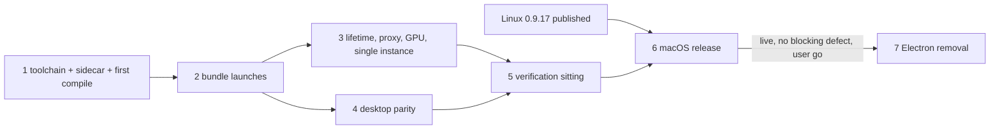

=== FILE: plan.md ===
---
title: "Sai ATLAS on Tauri for macOS (arm64), then Electron removal"
description: "Port, package and verify the Tauri shell on Apple Silicon, ship it in the first release after 0.9.17, then delete Electron from the repo."
status: pending
priority: P1
effort: 12d
branch: tung491/tauri_macos
tags: [tauri, macos, packaging, release, electron-removal]
created: 2026-10-08
---

# Sai ATLAS on Tauri for macOS (arm64), then Electron removal

This plan replaces Phase 12 of the parent plan [`plans/261002-1441-tauri-shell-migration/`](../261002-1441-tauri-shell-migration/plan.md) ([phase-12](../261002-1441-tauri-shell-migration/phase-12-macos-windows-cutover-electron-removal.md)). The parent plan's Decisions, Execution rules and Validation Log still bind wherever this plan is silent. Evidence: [`reports/ultra-evidence-packet.md`](./reports/ultra-evidence-packet.md), [`reports/scout-macos-parity-inventory.md`](./reports/scout-macos-parity-inventory.md).

The plan is handover-ready for a Sonnet-class executor (`--advice --tdd`). Every phase file carries its own Failure Protocol: stopping on a failed Verify is intended behavior, not a stall.

## Outcome

1. An Apple Silicon Mac installs `Sai-ATLAS-<v>-arm64.dmg` from a GitHub Release of `tung491/oh-my-pi-gui`, built from the Tauri core in `src-tauri/`. The app opens, the bundled `omp` sidecar starts with the assistant pack, dictation, quick entry, the global chord, tray, notifications, `omp://` links and the quit guard work, and a hard kill of the app leaves no `omp` or tool process behind.
2. The release carries `latest-mac.yml` listing only arm64 assets, plus the `omp-<v>-arm64.dmg` bridge copy and `Sai-ATLAS-<v>-arm64.zip`, with `minimumSystemVersion` matching the bundle floor.
3. After that release is live with no blocking defect and the user says go, the repo holds no Electron code, config, dependency or script, and every remaining gate passes.

## Decisions

| # | Topic | Decision | Source |
|---|---|---|---|
| D1 | Scope | macOS cutover first; Electron removal is the last phase, gated on the macOS Tauri release being live with no blocking defect | User, 2026-10-08 |
| D2 | Architecture | arm64 only. No Intel DMG/ZIP, no `build:omp:x64`, no `package:tauri:mac:x64`, `latest-mac.yml` lists arm64 assets only. AGENTS.md, README and the site lose their Intel lines | User, 2026-10-08 |
| D3 | Sidecar source | Clone `nornzach/oh-my-pi` to `~/WORK/oh-my-pi`, nest this GUI repo at `~/WORK/oh-my-pi/packages/gui`, run `bun run build:omp` there, copy `resources/omp` into the worktree | User, 2026-10-08 |
| D4 | Population | Fresh installs only. No Electron→Tauri self-update handover is proven on macOS. The `omp-<v>-arm64.dmg` bridge copy stays until 1.0.0 | User, 2026-10-08 |
| D5 | Timing | macOS Tauri ships in the first release after 0.9.17 (0.9.18 or later). Linux 0.9.17 proceeds on its own plan | User, 2026-10-08 |
| D6 | Windows | Out of scope; skip every Windows step | User, 2026-10-05 |
| D7 | Signing and DMG | Ad-hoc signing stays (`signingIdentity: "-"`, no notarization). Tauri builds only the `.app`; a new `src-tauri/macos/finalize-app.ts` re-signs the sidecar with `macos/omp.entitlements` and the hardened runtime, re-seals the app with `macos/app.entitlements`, and builds the DMG with `hdiutil`. Reason: no Tauri config gives `externalBin` its own entitlements, and Tauri's DMG script drives Finder through AppleScript, which an unattended executor cannot rely on | Planner (this plan); mirrors `src-tauri/linux/finalize-*.ts` |
| D8 | Assistant pack on macOS | The pack ships as the bundle resource `Contents/Resources/assistant-pack/` (inside the code seal). `assistant_pack::resolve_pack_dir` also looks in `<binary dir>/../Resources/assistant-pack` | Scout gap 1; code-signing layout |
| D9 | macOS GUI verification | No WebDriver for WKWebView. Verification uses (a) Rust and vitest tests on the Mac, (b) the Linux wdio suite unchanged in CI for shared behavior, (c) a new out-of-process packaged smoke `scripts/tauri-mac-smoke.ts` (process tree, runtime log, single instance, hard kill, real-profile guard), (d) one batched NEEDS-HUMAN sitting for on-screen behavior | Planner; parent Phase 10 packaged-smoke pattern |
| D10 | Microphone in WKWebView | wry 0.57's `WryWebViewUIDelegate` answers `requestMediaCapturePermissionForOrigin` with Grant when no handler is set; the OS then shows the TCC prompt (`NSMicrophoneUsageDescription`, `audio-input` entitlement). Camera stays denied by the OS because the app has no camera entitlement under the hardened runtime. No Rust code unless Phase 4 Task 4.1 finds otherwise | wry `src/wkwebview/class/wry_web_view_ui_delegate.rs` at tag `wry-v0.57.0`; `Cargo.lock` wry 0.57.0 |
| D11 | Floor | Bundle floor stays macOS 13.3; `MAC_UPDATE_FLOOR` rises from `22.0.0` to `22.4.0` (Darwin of 13.3). Only macOS 27 is available for testing; older versions are an accepted risk | Parent Phase 12 Task 12.2 step 3 |
| D12 | Test parity after removal | `scripts/check-test-parity.ts` compares Rust twins against `src/main/**` tests. Once `src/main/` is deleted the TS side no longer exists, so the parity gate, its `contracts/*.parity.json` and the TS-mirror assertions in Rust tests are retired in Phase 7; the Rust tests themselves stay | Planner; `scripts/check-test-parity.ts:1-8` |

## Phases

| # | Phase | Depends on | Effort | Status |
|---|---|---|---|---|
| 1 | [Toolchain, sidecar and first macOS compile](./phase-01-toolchain-sidecar-first-compile.md) | — | 1.5d | Pending |
| 2 | [A packaged bundle that launches and spawns the sidecar](./phase-02-packaged-bundle-launches.md) | 1 | 2d | Pending |
| 3 | [Sidecar lifetime, proxy, GPU and single instance](./phase-03-process-lifetime-os-services.md) | 2 | 2.5d | Pending |
| 4 | [Desktop parity: microphone, quick entry, menu, CI guard](./phase-04-desktop-parity.md) | 2 | 1.5d | Pending |
| 5 | [macOS verification sitting and parity report](./phase-05-macos-verification-sitting.md) | 3, 4 | 1d | Pending |
| 6 | [macOS release (first release after 0.9.17)](./phase-06-macos-release.md) | 5, Linux 0.9.17 published | 1d | Pending |
| 7 | [Electron removal](./phase-07-electron-removal.md) | 6 live, user go-ahead | 2.5d | Pending |

Phases 3 and 4 own disjoint files (Phase 3: `src-tauri/src/omp/{supervisor,proxy}.rs`, `src-tauri/src/ollama/hardware.rs`, `scripts/tauri-mac-smoke*.ts`; Phase 4: `src-tauri/src/desktop/{menu,windows}.rs`, `src-tauri/src/webview.rs`, `.github/workflows/ci.yml`, `scripts/tauri-packaging-config.test.ts`). Run them one after the other by default; they may run in two worktrees only if the controller merges Phase 3 first.

## Execution rules

- **Repo.** All work commits to this GUI repo (`tung491/oh-my-pi-gui`) on branch `tung491/tauri_macos`. Never commit inside `~/WORK/oh-my-pi` (the monorepo clone) and never push anywhere without the user's explicit go-ahead at that moment. Never push to `can1357`. Conventional commit messages, no plan ids, phase numbers or AI references in commits, code comments or test names. End commit messages with the attribution line the session supplies.
- **Toolchain.** Cargo is always `~/.cargo/bin/cargo` (write commands as `PATH="$HOME/.cargo/bin:$PATH" cargo …`). `cargo tauri` is tauri-cli 2.12.1, the version `scripts/tauri-linux-build/Dockerfile:60` pins. `cargo-public-api` and its nightly come from `scripts/rust-pins.env`. Cargo commands need `out/renderer-tauri/index.html` (`tauri::generate_context!`); rebuild it with `bun run build:renderer:tauri` after renderer changes.
- **Sidecar.** Built only in `~/WORK/oh-my-pi/packages/gui` (D3), at the same GUI commit as the worktree, one build at a time (the build patches the monorepo while it runs), then copied to `resources/omp` here. Every task that runs the agent first checks `test -x resources/omp`.
- **Protect the user.** Before Phase 1 and at the end of every phase, record and compare: `ls -la "$HOME/Library/Application Support/@oh-my-pi" 2>&1`, `ls -d /Applications/Sai\ ATLAS.app 2>&1`, `ls -la "$HOME/.omp/agent" 2>&1 | head -5`. Today the first two print `No such file or directory`; they must still do so. Every app run passes `--user-data-dir=<mktemp -d>` and `PI_CODING_AGENT_DIR=<mktemp -d>`. Nobody copies a build into `/Applications`; built apps run from a scratch copy under `$TMPDIR`. `open omp://…` runs only while a throwaway-profile instance of the same scratch app is already running, and the scratch app is unregistered from LaunchServices afterwards (`/System/Library/Frameworks/CoreServices.framework/Frameworks/LaunchServices.framework/Support/lsregister -u "<scratch app>"`). `tccutil reset` runs only with the user's consent in the sitting.
- **Processes.** Track every background process (command, PID, port). `bun run dev:tauri` uses the deterministic port from `scripts/tauri-dev.ts` (5183 in this worktree); on "address in use" stop the stale owner you started, never pick another port. Before ending a phase: `pgrep -fl "sai-atlas|--omp-supervise|omp --mode rpc-ui"` prints nothing you started.
- **Manual checks.** On-screen checks are written as NEEDS-HUMAN with exact steps and collected into the single Phase 5 sitting. Executors never wait on them mid-phase.
- **Publishing.** Tags, pushes, GitHub Releases, `site/` deploys (a push to `main` touching `site/**`) and drafts → published flips each need the user's explicit go-ahead at that moment.
- **New public items.** New Rust functions are `pub(crate)` or private. A new `pub` item changes `src-tauri/contracts/*.api.txt` and fails `bash scripts/check-module.sh snapshots`.
- **`unsafe`** stays limited to the files the parent plan allows (`webview.rs`, `omp/manager.rs`, `omp/supervisor.rs`), each block with a `// SAFETY:` comment.
- **Regression gate (every phase, on the Mac):** `bun run check:types` exits 0; `bunx vitest run` exits 0; `PATH="$HOME/.cargo/bin:$PATH" cargo clippy --manifest-path src-tauri/Cargo.toml --all-targets --all-features -- -D warnings` exits 0; `PATH="$HOME/.cargo/bin:$PATH" cargo test --manifest-path src-tauri/Cargo.toml --all-features` exits 0; `bun scripts/check-test-parity.ts <module>` exits 0 for `foundation omp tabs desktop services ollama updater` (until Phase 7 retires it); `bash scripts/check-module.sh snapshots` prints `check-module snapshots: PASS`; `bunx biome check <touched files>` exits 0.

## Acceptance criteria

- [ ] `PATH="$HOME/.cargo/bin:$PATH" cargo clippy --manifest-path src-tauri/Cargo.toml --all-targets --all-features -- -D warnings` and `cargo test … --all-features` exit 0 on this Mac (arm64, macOS 27).
- [ ] `grep -n "is not implemented on this OS" src-tauri/src/omp/proxy.rs src-tauri/src/ollama/hardware.rs` prints only lines inside items gated `not(any(target_os = "linux", target_os = "macos"))` or the Win32/Other GPU branch (Phase 3 Task 3.6 states the exact expected count).
- [ ] `bun run package:tauri:mac:arm64` exits 0 and leaves `src-tauri/target/aarch64-apple-darwin/release/bundle/dmg/Sai ATLAS_<v>_aarch64.dmg` and `…/bundle/macos/Sai ATLAS.app` with `Contents/Resources/assistant-pack/config.yml`.
- [ ] `codesign -d --entitlements - --xml "<app>/Contents/MacOS/omp"` lists exactly `allow-jit` and `allow-unsigned-executable-memory`; the app lists exactly `device.audio-input`; `codesign --verify --strict --verbose=2 "<app>"` exits 0; `codesign -dv "<app>" 2>&1` contains `Identifier=vn.io.vif.saiatlas` and `runtime`.
- [ ] `bun scripts/tauri-mac-smoke.ts "<app>"` prints `tauri-mac-smoke: PASS` and exits 0 (sidecar tree, no pack/restart failure in the runtime log, single instance per profile, hard kill leaves nothing within 10 s, real profile untouched).
- [ ] `grep -cE "^macOS [a-z0-9 -]+: PASS$" plans/261008-0341-tauri-macos-cutover/reports/macos-parity-report.md` prints at least `14` and the same pattern with `FAIL` prints `0`.
- [ ] The published release lists `Sai-ATLAS-<v>-arm64.dmg`, `Sai-ATLAS-<v>-arm64.zip`, `omp-<v>-arm64.dmg`, `latest-mac.yml` (arm64 only, `minimumSystemVersion: 22.4.0`) plus the Linux assets and `latest-linux.yml`; `bun run check:mac-update-floor dist-release/latest-mac.yml` exits 0.
- [ ] After Phase 7: `git grep -lniE "electron|@playwright" -- src scripts e2e-tauri package.json .github tsconfig*.json wdio*.ts vite*.ts` prints only the allowlisted files Phase 7 Task 7.9 names, and `bun install`, `bun run check:types`, `bunx vitest run`, `bun run build`, `cargo test --all-features` exit 0.
- [ ] The protection check in Execution rules prints the same output at the end of every phase as before Phase 1.

## Risks

| Risk | L × I | Mitigation |
|---|---|---|
| First compile of never-compiled macOS cfg code fails broadly (tauri-nspanel 2.1.0 against Tauri 2.12, unused-import warnings under `-D warnings`) | High × Med | Phase 1 Task 1.5 compiles before any porting; tauri-nspanel fallback (plain always-on-top window) is pre-decided |
| Bun sidecar crashes under the hardened runtime | Med × High | Phase 2 re-signs it with `allow-jit` + `allow-unsigned-executable-memory` and runs `Contents/MacOS/omp --smoke-test` from the bundle |
| macOS orphans reparent to launchd, so tool children survive a GUI kill | High × High | Phase 3 kqueue `NOTE_EXIT` on the GUI pid plus a `proc_listchildpids` snapshot of omp's tree before the kill; tests ported to macOS first (red) |
| A mac-only release becomes "latest" and breaks Linux `latest/download/latest-linux.yml` | Med × High | Phase 6 refuses to publish without the Linux AppImage, `.deb` and `latest-linux.yml` from the same tag, built on the Linux host |
| Test runs touch the user's real profile or LaunchServices handler | Low × High | Throwaway profile and agent dir on every run, scratch app copies, protection check per phase, `lsregister -u` cleanup |
| WKWebView `getUserMedia` blocked on the `tauri://localhost` origin | Med × High | Phase 5 sitting check H2 runs before the release; a FAIL stops the release through the Failure Protocol |
| Snapshots differ on macOS because `cargo public-api` documents the host target | Low × Med | Phase 1 Task 1.6 runs `check-module.sh snapshots` on the Mac before any code change; a diff is escalated, not regenerated |
| Removing Electron breaks a tool that imports `src/main/**` (pack check, sidecar build, tray mark, e2e fixtures, Rust `include_str!`) | High × High | Phase 7 moves every importer first (Task 7.2–7.4, listed with file:line) and deletes last; `electron-final` tag is the rollback |
| macOS 13.3–26 untested | Med × Med | Accepted (D11); the release notes name the floor |

## Rollback

- Phases 1–5: revert the branch commits; nothing is published.
- Phase 6: the release is a draft until the user publishes it. After publishing, a defect is fixed forward, or the release is set back to draft and the macOS assets deleted (Linux users keep 0.9.17 through the previous `latest`), with the user's go-ahead.
- Phase 7: the `electron-final` tag marks the last commit with Electron; `git revert` of the removal commits restores it. Rebuilding an Electron macOS DMG is not a supported rollback (D4: no Mac population depends on it).

## Validation Log

_Record user decisions taken during execution here (date, question, answer)._

=== FILE: phase-01-toolchain-sidecar-first-compile.md ===
---
phase: 1
title: "Toolchain, sidecar and first macOS compile"
status: pending
priority: P1
effort: "1.5d"
dependencies: []
---

# Phase 1: Toolchain, sidecar and first macOS compile

## Goal

The Mac has every pinned tool, a real arm64 sidecar and assistant pack in `resources/`, the Rust core compiles and lints clean for `aarch64-apple-darwin`, the API snapshots match, and `bun run dev:tauri` opens a window that starts the sidecar. No macOS cfg code has ever been compiled before this phase (`plans/261008-0341-tauri-macos-cutover/reports/scout-macos-parity-inventory.md`), so this phase finds the breakage before any porting starts.

## Files

- Modify: `scripts/tauri-dev.ts` (port-owner probe), any `src-tauri/src/**` file the first compile rejects.
- Create: `scripts/tauri-dev.test.ts`.
- Outside the repo (not committed): `~/WORK/oh-my-pi`, `~/WORK/oh-my-pi/packages/gui`.

## Tasks

### Task 1.1 — Record the protection baseline
- Goal: a saved snapshot of the user's real state to compare at the end of every phase.
- Target files: none in the repo; write `$TMPDIR/sai-atlas-baseline.txt`.
- Steps:
  1. Run `{ ls -la "$HOME/Library/Application Support/@oh-my-pi" 2>&1; ls -d "/Applications/Sai ATLAS.app" 2>&1; ls -la "$HOME/.omp/agent" 2>&1 | head -5; } > "$TMPDIR/sai-atlas-baseline.txt"`.
- Success criteria: the file exists.
- Verify: `grep -c "No such file or directory" "$TMPDIR/sai-atlas-baseline.txt"` prints at least `2`. If it prints less, STOP and tell the user (the real profile or an installed app exists, and the protection rules need their confirmation).

### Task 1.2 — Install the pinned Rust tools
- Goal: `cargo tauri`, `cargo public-api` and the snapshot nightly exist at the pinned versions.
- Target files: none (installs into `~/.cargo`, `~/.rustup`).
- Steps:
  1. `~/.cargo/bin/cargo install tauri-cli --version 2.12.1 --locked`
  2. `source scripts/rust-pins.env && ~/.cargo/bin/cargo install cargo-public-api --version "$CARGO_PUBLIC_API_VERSION" --locked`
  3. `source scripts/rust-pins.env && ~/.cargo/bin/rustup toolchain install "$PUBLIC_API_TOOLCHAIN" --profile minimal`
- Success criteria: all three commands exit 0.
- Verify: `~/.cargo/bin/cargo tauri --version` prints `tauri-cli 2.12.1`; `~/.cargo/bin/cargo public-api --version` prints `cargo-public-api 0.52.0`; `~/.cargo/bin/rustup run nightly-2026-10-01 rustc --version` exits 0.

### Task 1.3 — Build the arm64 sidecar in the monorepo clone
- Goal: `resources/omp` in this worktree is an arm64 Mach-O sidecar built from the GUI commit under test.
- Target files: `~/WORK/oh-my-pi` (clone), `~/WORK/oh-my-pi/packages/gui` (clone), `resources/omp` here (gitignored).
- Steps:
  1. `test -d ~/WORK/oh-my-pi || git clone https://github.com/nornzach/oh-my-pi ~/WORK/oh-my-pi`
  2. `test -d ~/WORK/oh-my-pi/packages/gui/.git || git clone https://github.com/tung491/oh-my-pi-gui ~/WORK/oh-my-pi/packages/gui`
  3. `git -C ~/WORK/oh-my-pi/packages/gui fetch origin && git -C ~/WORK/oh-my-pi/packages/gui checkout --detach "$(git -C /Users/tung491/orca/workspaces/oh-my-pi-gui/tauri_macos rev-parse HEAD)"`. If the worktree HEAD is not pushed yet, fetch it from the worktree instead: `git -C ~/WORK/oh-my-pi/packages/gui fetch /Users/tung491/orca/workspaces/oh-my-pi-gui/tauri_macos HEAD && git -C ~/WORK/oh-my-pi/packages/gui checkout --detach FETCH_HEAD`.
  4. `cd ~/WORK/oh-my-pi && bun install`, then `cd ~/WORK/oh-my-pi/packages/gui && bun install && bun run build:omp` (this applies `patches/omp/*.patch`, stages `pi_natives`, and reverts the patches).
  5. `cp ~/WORK/oh-my-pi/packages/gui/resources/omp /Users/tung491/orca/workspaces/oh-my-pi-gui/tauri_macos/resources/omp && chmod 755 /Users/tung491/orca/workspaces/oh-my-pi-gui/tauri_macos/resources/omp`
  6. Record the monorepo commit: `git -C ~/WORK/oh-my-pi rev-parse HEAD` (needed in the release notes, Phase 6).
- Success criteria: the sidecar runs on this Mac.
- Verify: `file resources/omp` contains `Mach-O 64-bit executable arm64`; `resources/omp --smoke-test` exits 0; `git -C ~/WORK/oh-my-pi status --porcelain` prints nothing (the build reverted its patches).

### Task 1.4 — Install JS dependencies, build the pack and the Tauri renderer
- Goal: `resources/assistant-pack/` and `out/renderer-tauri/` exist; the pack check passes against the real sidecar.
- Target files: `node_modules/`, `resources/assistant-pack/`, `out/renderer-tauri/` (all gitignored).
- Steps:
  1. `bun install`
  2. `bun run build:pack`
  3. `bun run build:renderer:tauri`
- Success criteria: all three exit 0.
- Verify: `test -f resources/assistant-pack/config.yml && test -f out/renderer-tauri/index.html && echo ok` prints `ok`; `bun scripts/check-assistant-pack.ts resources/omp` exits 0.

### Task 1.5 — First macOS compile and lint
- Goal: the Rust core compiles and passes clippy with `-D warnings` on `aarch64-apple-darwin`.
- Target files: whichever `src-tauri/src/**` files the compiler names; known macOS-only code sits in `src-tauri/src/desktop/windows.rs:1022-1035` (tauri-nspanel), `src-tauri/src/omp/supervisor.rs` (`#[cfg(not(target_os = "linux"))]` stubs), `src-tauri/src/omp/proxy.rs:101-106`, `src-tauri/src/ollama/hardware.rs:105-113`, `src-tauri/src/updater/mod.rs`, `src-tauri/src/updater/feed.rs`, `src-tauri/src/desktop/mod.rs`, `src-tauri/src/desktop/shortcut.rs`, `src-tauri/src/lib.rs`, `src-tauri/src/main.rs`, `src-tauri/src/webview.rs`, `src-tauri/src/relaunch.rs`.
- Steps:
  1. `PATH="$HOME/.cargo/bin:$PATH" cargo fetch --manifest-path src-tauri/Cargo.toml` (first download of Tauri crates on this Mac).
  2. `PATH="$HOME/.cargo/bin:$PATH" cargo check --manifest-path src-tauri/Cargo.toml --all-targets --all-features 2>&1 | tee "$TMPDIR/first-check.txt"`.
  3. For each error, make the smallest change that keeps Linux behavior identical: put Linux-only imports, helpers and constants under `#[cfg(target_os = "linux")]`, and mark helpers that only Linux code calls with `#[cfg_attr(not(target_os = "linux"), allow(dead_code))]` only when the item must exist on both OSes. Do not change any `#[cfg(target_os = "linux")]` code path's body.
  4. tauri-nspanel decision: if the errors come from the `tauri-nspanel` crate itself (paths under `~/.cargo/registry/src/*/tauri-nspanel-2.1.0/`) rather than from `windows.rs`, replace the `#[cfg(target_os = "macos")]` block at `src-tauri/src/desktop/windows.rs:1027-1035` with nothing (the window is already `always_on_top: true`, `skip_taskbar: true`), remove the `[target.'cfg(target_os = "macos")'.dependencies]` entry from `src-tauri/Cargo.toml`, run `cargo check` again to update `Cargo.lock`, and add a line to `plan.md` → Validation Log: "tauri-nspanel 2.1.0 does not build against Tauri 2.12.1; quick entry uses a plain always-on-top window". Otherwise keep the panel.
  5. Repeat step 2 until it exits 0, then run clippy.
- Success criteria: no compile error and no clippy warning on the Mac; Linux code paths unchanged.
- Verify: `PATH="$HOME/.cargo/bin:$PATH" cargo clippy --manifest-path src-tauri/Cargo.toml --all-targets --all-features -- -D warnings` exits 0. Then `git diff -U0 -- src-tauri/src | grep -E '^[-+]' | grep -v '^[-+]{3}' | grep -vE 'cfg|allow\(dead_code\)|^[-+]\s*$|^[-+]\s*use '` — every printed line must be inside a `cfg(not(target_os = "linux"))` or `cfg(target_os = "macos")` item; if any changed line sits in Linux-only code, STOP (Failure Protocol).

### Task 1.6 — API snapshots on the Mac
- Goal: the frozen public API reads the same on macOS as on Linux before any change.
- Target files: none.
- Steps: run `bash scripts/check-module.sh snapshots`.
- Success criteria: no snapshot differs.
- Verify: output ends with `check-module snapshots: PASS` and the exit code is 0. A diff is a Failure Protocol stop; never regenerate a snapshot to pass.

### Task 1.7 — First test run on the Mac (inventory only)
- Goal: a list of every test that fails on macOS, so Phases 2–4 own each one.
- Target files: none in the repo; write `$TMPDIR/first-test.txt`.
- Steps:
  1. `PATH="$HOME/.cargo/bin:$PATH" cargo test --manifest-path src-tauri/Cargo.toml --all-features 2>&1 | tee "$TMPDIR/first-test.txt"`.
  2. Copy every line matching `^test .* FAILED$` into `plan.md` → Validation Log under "First macOS test run (date)".
  3. For each failing test, add its owner: tests in `omp::supervisor` → Phase 3 Task 3.2; tests reading `/proc`, `/usr/bin/…` or `xdg` paths outside the supervisor → Phase 3 Task 3.7; anything else → Phase 3 Task 3.7 as well.
- Success criteria: the inventory is in the Validation Log.
- Verify: `grep -c "First macOS test run" plans/261008-0341-tauri-macos-cutover/plan.md` prints `1`.

### Task 1.8 — Dev port probe works on macOS (red)
- Goal: a failing test proves `scripts/tauri-dev.ts` cannot see a busy port on macOS (it runs `ss`, which macOS lacks, so the probe silently reports free).
- Target files: create `scripts/tauri-dev.test.ts`; symbol to be added: `portOwnerProbe(platform: NodeJS.Platform, port: number): { command: string; args: string[] }` and `portIsBusy(platform, status, stdout): boolean` exported from `scripts/tauri-dev.ts`.
- Steps:
  1. Write `scripts/tauri-dev.test.ts` with vitest: `it("probes the dev port with lsof on macOS and ss on Linux")` expecting `portOwnerProbe("darwin", 5183)` to equal `{ command: "lsof", args: ["-nP", "-iTCP:5183", "-sTCP:LISTEN"] }` and `portOwnerProbe("linux", 5183)` to equal `{ command: "ss", args: ["-ltnp", "sport = :5183"] }`; `it("reads lsof's listing as busy and its empty exit 1 as free")` expecting `portIsBusy("darwin", 0, "COMMAND PID\nnode 1 …")` true and `portIsBusy("darwin", 1, "")` false; `it("reads ss's header-only listing as free")` expecting `portIsBusy("linux", 0, "State Recv-Q\n")` false and with a second line true.
- Success criteria: the test exists and fails because the exports do not exist.
- Verify: `bunx vitest run scripts/tauri-dev.test.ts` exits non-zero with an error naming `portOwnerProbe` or `portIsBusy`; a passing run is a failure of this task.

### Task 1.9 — Dev port probe works on macOS (green)
- Goal: `bun run dev:tauri` refuses a busy port on macOS.
- Target files: `scripts/tauri-dev.ts` (the block at lines 85-96 that calls `spawnSync("ss", …)`).
- Steps:
  1. Add and export `portOwnerProbe` and `portIsBusy` with the behavior the test states (Linux keeps today's rule: status 0 and a non-empty line after the header; macOS: status 0 and any non-empty line).
  2. Replace the inline `spawnSync("ss", …)` and `busy` computation with `const probe = portOwnerProbe(process.platform, port); const owner = spawnSync(probe.command, probe.args, { encoding: "utf8" }); const busy = portIsBusy(process.platform, owner.status, owner.stdout);`.
  3. Keep the module's `import.meta.main` guard so importing it from the test starts nothing (check the file's bottom; if the main body is not guarded, wrap it in `if (import.meta.main) { … }`).
- Success criteria: tests pass; behavior on Linux unchanged.
- Verify: `bunx vitest run scripts/tauri-dev.test.ts` exits 0 and prints `3 passed`.

### Task 1.10 — First dev run spawns the sidecar
- Goal: the Tauri shell opens a window on macOS and starts supervisor and omp from `resources/omp` with the pack.
- Target files: none.
- Steps:
  1. `P=$(mktemp -d); A=$(mktemp -d); echo '{"welcome":{"completed":"2026-01-01T00:00:00.000Z"},"language":"en"}' > "$P/prefs.json"`
  2. Start in the background (harness background runner, record the PID): `PI_CODING_AGENT_DIR="$A" bun run dev:tauri -- --user-data-dir="$P"`.
  3. Wait up to 180 s (first build) polling `pgrep -f -- "--omp-supervise"`.
  4. Stop what you started: SIGTERM the background PID, then `pkill -f -- "--user-data-dir=$P"` if anything remains.
- Success criteria: a supervisor and an `omp` child existed while the app ran; nothing remains afterwards.
- Verify: during step 3, `pgrep -f -- "--omp-supervise"` prints a PID and `pgrep -f "resources/omp"` prints a PID; `grep -c '"sidecar-restart"' "$P/logs/gui-runtime.jsonl"` prints `0` (or the file does not exist); after step 4, `pgrep -f -- "--user-data-dir=$P"` prints nothing. NEEDS-HUMAN H1 (Phase 5) covers what the window looks like.

## Test matrix

| Area | Unit (vitest/Rust) | Integration | Manual (Phase 5) |
|---|---|---|---|
| Dev port probe | `scripts/tauri-dev.test.ts` (3 cases) | Task 1.10 dev run | — |
| macOS compile | clippy `-D warnings` | `cargo test` inventory | — |
| Sidecar build | — | `resources/omp --smoke-test`, `check-assistant-pack.ts` | — |

## Regression gate

Run the Execution rules regression gate except `cargo test` (its failures are the Task 1.7 inventory, owned by Phase 3) and the protection check from Execution rules; `diff <(protection check output) "$TMPDIR/sai-atlas-baseline.txt"` prints nothing.

## Rollback

`git revert` this phase's commits. The tools and the monorepo clone stay outside the repo and harm nothing.

## Failure Protocol
If any Verify step does not meet its stated pass condition, STOP this phase.
Do not improvise a fix, retry blindly, or reason around the failure.
Spawn the `kongming` subagent for next-step counsel and pass:
- the phase and task id,
- what you attempted (the steps you ran),
- the exact command and its full output,
- the pass condition it failed to meet.
Apply kongming's guidance, then re-run the Verify step.
If `kongming` cannot be spawned in this environment, STOP and report the same
failure evidence to the user. Never continue by self-reasoning.

=== FILE: phase-02-packaged-bundle-launches.md ===
---
phase: 2
title: "A packaged bundle that launches and spawns the sidecar"
status: pending
priority: P1
effort: "2d"
dependencies: [1]
---

# Phase 2: A packaged bundle that launches and spawns the sidecar

## Goal

`bun run package:tauri:mac:arm64` produces a signed `Sai ATLAS.app` whose sidecar runs under the hardened runtime with its own entitlements, which finds its assistant pack in `Contents/Resources/assistant-pack/`, plus a DMG; and an out-of-process smoke script proves the packaged app starts the sidecar tree without touching the user's profile. Intel packaging entry points are removed (D2).

## Files

- Modify: `src-tauri/src/omp/assistant_pack.rs` (`resolve_pack_dir`, tests), `src-tauri/macos/sidecar.conf.json`, `src-tauri/tauri.macos.conf.json`, `package.json` (`package:tauri:mac:arm64`, delete `package:tauri:mac:x64`), `scripts/stage-tauri-sidecar.ts` (`SIDECAR_SOURCES`), `scripts/tauri-packaging-config.test.ts`.
- Create: `src-tauri/macos/finalize-app.ts`, `scripts/finalize-app.test.ts`, `scripts/tauri-mac-smoke.ts`, `scripts/tauri-mac-smoke.test.ts`.

## Tasks

### Task 2.1 — Pack lookup in the macOS bundle (red)
- Goal: a failing Rust test for the bundle layout `Contents/MacOS/omp` + `Contents/Resources/assistant-pack/`.
- Target files: `src-tauri/src/omp/assistant_pack.rs`, test module (next to `resolves_the_pack_beside_the_sidecar_binary`, around line 360).
- Steps:
  1. Add `#[test] fn resolves_the_pack_in_the_macos_bundle_resources()`: in a tempdir, create `Sai ATLAS.app/Contents/MacOS/omp` (`write_file`) and `write_pack(&…/Contents/Resources/assistant-pack, PACK_FILES)`; assert `resolve_pack_dir(&binary, &[])` equals `<tempdir>/Sai ATLAS.app/Contents/Resources/assistant-pack` (build the expected path with `.join`, no `..` component). Also assert that a pack beside the binary still wins when both exist (write `Contents/MacOS/assistant-pack` too in a second tempdir).
- Success criteria: the test compiles and fails.
- Verify: `PATH="$HOME/.cargo/bin:$PATH" cargo test --manifest-path src-tauri/Cargo.toml --all-features --lib omp::assistant_pack::tests::resolves_the_pack_in_the_macos_bundle_resources` exits non-zero with `assertion` and `left` / `right` in the output; a pass is a failure of this task.

### Task 2.2 — Pack lookup in the macOS bundle (green)
- Goal: `resolve_pack_dir` returns `Contents/Resources/assistant-pack` for a bundled sidecar.
- Target files: `src-tauri/src/omp/assistant_pack.rs` → `resolve_pack_dir` (lines 42-57).
- Steps:
  1. After the `beside` check and before the search-root loop, add: when the binary path is not empty, let `resources = binary.parent()?.parent()?.join("Resources").join(PACK_DIR_NAME)` made absolute with `absolute(...)`; if `resources.is_dir()`, return it. Use `Path::parent` (no `..` joins) so the returned path has no `..`.
  2. Update the doc comment of `resolve_pack_dir` to name the bundle `Resources` directory as the second candidate.
- Success criteria: the new test and every existing `assistant_pack` test pass.
- Verify: `PATH="$HOME/.cargo/bin:$PATH" cargo test --manifest-path src-tauri/Cargo.toml --all-features --lib omp::assistant_pack` exits 0 and prints `test result: ok`.

### Task 2.3 — Packaging config tests for the macOS bundle (red)
- Goal: failing vitest assertions for the macOS overlay, scripts and targets.
- Target files: `scripts/tauri-packaging-config.test.ts` (describe blocks "product identity" line 167, "sidecar placement" lines 186-232, "macOS bundle" lines 523-567).
- Steps:
  1. In "bundles for every target…" change the macOS expectation to `expect(platform("macos").bundle?.targets).toEqual(["app"])`.
  2. Replace "the macOS config ships binaries/omp as externalBin" with: `externalBin` equals `["binaries/omp"]` and `resources` equals `{ "../resources/assistant-pack/": "assistant-pack/" }`.
  3. In "every package:tauri script…" remove the `package:tauri:mac:x64` entry from `expected`, and add: `package:tauri:mac:arm64` starts with `bun run build:pack && ` and ends with `&& bun src-tauri/macos/finalize-app.ts src-tauri/target/aarch64-apple-darwin/release/bundle`; `SIDECAR_SOURCES["x86_64-apple-darwin"]` is `undefined`.
  4. In "macOS bundle" add `it("runs the app under the hardened runtime")`: `platform("macos").bundle?.macOS?.hardenedRuntime` is `true`.
- Success criteria: the edited tests fail on the current config.
- Verify: `bunx vitest run scripts/tauri-packaging-config.test.ts` exits non-zero and the failures name the four changed expectations; any other failing test is a Failure Protocol stop.

### Task 2.4 — Packaging config (green)
- Goal: the macOS overlay ships the pack, the script builds and finalizes it, x64 is gone.
- Target files: `src-tauri/macos/sidecar.conf.json`, `src-tauri/tauri.macos.conf.json`, `package.json` → `scripts["package:tauri:mac:arm64"]` and `scripts["package:tauri:mac:x64"]`, `scripts/stage-tauri-sidecar.ts` → `SIDECAR_SOURCES`.
- Steps:
  1. `src-tauri/macos/sidecar.conf.json` → `{ "bundle": { "externalBin": ["binaries/omp"], "resources": { "../resources/assistant-pack/": "assistant-pack/" } } }`.
  2. `src-tauri/tauri.macos.conf.json` → `targets: ["app"]`, and add `"hardenedRuntime": true` under `bundle.macOS`.
  3. `package.json`: set `package:tauri:mac:arm64` to `bun run build:pack && bun scripts/stage-tauri-sidecar.ts aarch64-apple-darwin && bash -c 'source scripts/rust-pins.env && PATH="$CARGO_HOME_BIN:$PATH" cargo tauri build --target aarch64-apple-darwin --config src-tauri/macos/sidecar.conf.json' && bun src-tauri/macos/finalize-app.ts src-tauri/target/aarch64-apple-darwin/release/bundle`; delete `package:tauri:mac:x64`.
  4. `scripts/stage-tauri-sidecar.ts`: delete the `"x86_64-apple-darwin": "resources/omp.x64"` entry.
- Success criteria: the config tests pass.
- Verify: `bunx vitest run scripts/tauri-packaging-config.test.ts` exits 0.

### Task 2.5 — finalize-app helpers (red)
- Goal: failing tests that pin the signing and DMG commands.
- Target files: create `scripts/finalize-app.test.ts` importing from `../src-tauri/macos/finalize-app` (pattern: `scripts/finalize-deb.test.ts`).
- Steps: write vitest cases for these exports (the file does not exist yet):
  1. `sidecarSignArgs(app)` equals `["--force", "--sign", "-", "--options", "runtime", "--entitlements", <abs path of src-tauri/macos/omp.entitlements>, "<app>/Contents/MacOS/omp"]`.
  2. `appSignArgs(app)` equals `["--force", "--sign", "-", "--options", "runtime", "--entitlements", <abs path of src-tauri/macos/app.entitlements>, "<app>"]` (no `--deep`).
  3. `dmgFileName("0.9.18")` equals `"Sai ATLAS_0.9.18_aarch64.dmg"` (release-feeds' `onlyBundle` accepts it: it contains `_0.9.18_`).
  4. `assertBundleLayout(app)` throws `missing Contents/Resources/assistant-pack/config.yml` for a temp `.app` without the pack, and throws `missing Contents/MacOS/omp` without the sidecar; passes for a temp `.app` with both.
  5. `appVersion(app)` reads `CFBundleShortVersionString` from a temp `Contents/Info.plist` (use `plutil -convert json -o - <plist>` through `spawnSync`, so the test runs only on darwin: wrap with `it.runIf(process.platform === "darwin")`).
- Verify: `bunx vitest run scripts/finalize-app.test.ts` exits non-zero with `Failed to resolve import "../src-tauri/macos/finalize-app"` (or "Cannot find module"); a pass is a failure.

### Task 2.6 — finalize-app (green)
- Goal: a bundle step that re-signs and builds the DMG.
- Target files: create `src-tauri/macos/finalize-app.ts`.
- Steps:
  1. Export the five helpers above. Entitlement paths resolve from `import.meta.url` (`path.resolve(path.dirname(fileURLToPath(import.meta.url)), "omp.entitlements")`).
  2. Export `finalizeApp(bundleDir: string): string` that: finds exactly one `*.app` in `<bundleDir>/macos` (else throw); calls `assertBundleLayout`; runs `/usr/bin/codesign` with `sidecarSignArgs`, then `appSignArgs`, then `["--verify", "--strict", "--verbose=2", app]`, throwing on any non-zero status; creates a staging dir under `os.tmpdir()`, copies the app with `/usr/bin/ditto <app> <staging>/Sai ATLAS.app`, adds the symlink `<staging>/Applications -> /Applications`; deletes `<bundleDir>/dmg` if present and recreates it; runs `/usr/bin/hdiutil create -volname "Sai ATLAS" -srcfolder <staging> -ov -format UDZO <bundleDir>/dmg/<dmgFileName(appVersion(app))>`; removes the staging dir; returns the DMG path.
  3. Add the `if (import.meta.main)` entry: `bun src-tauri/macos/finalize-app.ts <bundleDir>` prints `finalized <dmg path>` and exits 1 with the error message on failure; refuse with exit 2 when `process.platform !== "darwin"`.
- Success criteria: unit tests pass.
- Verify: `bunx vitest run scripts/finalize-app.test.ts` exits 0.

### Task 2.7 — Build and inspect the bundle
- Goal: a real signed bundle and DMG.
- Target files: none (build outputs under `src-tauri/target/`, gitignored).
- Steps:
  1. `test -x resources/omp` must succeed (else redo Phase 1 Task 1.3).
  2. `nice -n 10 bun run package:tauri:mac:arm64 2>&1 | tail -20`.
  3. Set `APP="src-tauri/target/aarch64-apple-darwin/release/bundle/macos/Sai ATLAS.app"`.
- Success criteria: build exits 0 and every check below holds.
- Verify (each must hold):
  - the build's last line starts with `finalized ` and ends with `_aarch64.dmg`;
  - `test -f "$APP/Contents/Resources/assistant-pack/config.yml" && test -x "$APP/Contents/MacOS/omp" && echo ok` prints `ok`;
  - `codesign -d --entitlements - --xml "$APP/Contents/MacOS/omp" 2>/dev/null | plutil -convert json -o - -` prints exactly `{"com.apple.security.cs.allow-jit":true,"com.apple.security.cs.allow-unsigned-executable-memory":true}`;
  - `codesign -d --entitlements - --xml "$APP" 2>/dev/null | plutil -convert json -o - -` prints exactly `{"com.apple.security.device.audio-input":true}`;
  - `codesign -dv "$APP" 2>&1` contains `Identifier=vn.io.vif.saiatlas` and `flags=0x10002(adhoc,runtime)`;
  - `codesign --verify --strict --verbose=2 "$APP"` exits 0;
  - `"$APP/Contents/MacOS/omp" --smoke-test` exits 0 (the sidecar runs under the hardened runtime);
  - `bun scripts/check-assistant-pack.ts "$APP/Contents/MacOS/omp"` exits 0;
  - `plutil -extract CFBundleURLTypes.0.CFBundleURLSchemes.0 raw "$APP/Contents/Info.plist"` prints `omp`;
  - `plutil -extract LSMinimumSystemVersion raw "$APP/Contents/Info.plist"` prints `13.3`;
  - `plutil -extract NSMicrophoneUsageDescription raw "$APP/Contents/Info.plist"` contains `Sai ATLAS`;
  - `hdiutil imageinfo "src-tauri/target/aarch64-apple-darwin/release/bundle/dmg/"*.dmg | grep -c "Format: UDZO"` prints `1`.

### Task 2.8 — Packaged smoke helpers (red)
- Goal: failing tests for the pure parts of the smoke script.
- Target files: create `scripts/tauri-mac-smoke.test.ts`.
- Steps: test these exports of `scripts/tauri-mac-smoke.ts` (not created yet):
  1. `parsePs(text)` turns `ps -axo pid=,ppid=,command=` output (leading spaces, commands with spaces) into `{ pid, ppid, command }[]`.
  2. `descendants(rows, pid)` returns every pid below `pid`, recursively, not including `pid`.
  3. `sidecarTree(rows, guiPid)` returns `{ supervisor, omp }` when a child of `guiPid` has `--omp-supervise` in its command and a child of that has `--mode rpc-ui`; otherwise `undefined`.
  4. `runtimeLogFailures(jsonl)` returns every line whose `source` is `sidecar-restart` or `child-process`, and ignores blank or malformed lines.
- Verify: `bunx vitest run scripts/tauri-mac-smoke.test.ts` exits non-zero with a module-resolution error for `./tauri-mac-smoke`; a pass is a failure.

### Task 2.9 — Packaged smoke script (green)
- Goal: `bun scripts/tauri-mac-smoke.ts "<app>"` proves the packaged app starts its sidecar tree on a throwaway profile and leaves the real profile alone.
- Target files: create `scripts/tauri-mac-smoke.ts`.
- Steps:
  1. Export the helpers from Task 2.8.
  2. Main (`if (import.meta.main)`), exit 2 unless `process.platform === "darwin"` and `argv[2]` ends with `.app`:
     a. `realProfile = ~/Library/Application Support/@oh-my-pi/omp-gui`; record `existsSync(realProfile)` and, when it exists, the `mtimeMs` of `prefs.json` and `logs/gui-runtime.jsonl`.
     b. `scratch = mkdtempSync(os.tmpdir()/sai-atlas-smoke-)`; `ditto <app> <scratch>/Sai ATLAS.app`.
     c. `launch(name)`: profile and agent dirs under `scratch`; write `prefs.json` with `writeDesktopPrefs(profile, { language: "en" })` from `../e2e/desktop-prefs`; spawn `<scratch>/Sai ATLAS.app/Contents/MacOS/sai-atlas --user-data-dir=<profile>` with env `{ ...process.env, PI_CODING_AGENT_DIR: agent }`, stdout/stderr to `<scratch>/<name>.log`; return the child.
     d. Case `sidecar`: launch `a`; poll `ps -axo pid=,ppid=,command=` every 250 ms up to 60 s until `sidecarTree(rows, a.pid)` is defined; then wait 15 s and require omp still alive and `runtimeLogFailures(<profile a>/logs/gui-runtime.jsonl)` empty. Print `tauri-mac-smoke sidecar: PASS`.
     e. Case `single-instance`: launch `a2` on profile `a`'s dirs (same `--user-data-dir`); require it to exit within 10 s and `a` to stay alive. Launch `b` on its own profile; require both `a` and `b` alive after 5 s, then SIGTERM `b` and wait for it. Print `tauri-mac-smoke single-instance: PASS`.
     f. Case `hard-kill`: snapshot `descendants(rows, a.pid)`; `kill -9 a.pid`; poll up to 10 s until none of the snapshot pids is alive (`process.kill(pid, 0)` throws). Print `tauri-mac-smoke hard-kill: PASS`.
     g. Always (finally): SIGKILL every pid this run spawned that is still alive and its snapshot descendants; `rmSync(scratch, { recursive: true })`; recheck the real profile against step a (same existence, same mtimes) and fail with `real profile changed` otherwise. Print `tauri-mac-smoke: PASS` only when every case passed; exit 1 otherwise.
- Success criteria: unit tests pass; the script runs against the Task 2.7 bundle.
- Verify: `bunx vitest run scripts/tauri-mac-smoke.test.ts` exits 0; `bun scripts/tauri-mac-smoke.ts "src-tauri/target/aarch64-apple-darwin/release/bundle/macos/Sai ATLAS.app"` prints `tauri-mac-smoke sidecar: PASS` and `tauri-mac-smoke single-instance: PASS`. The `hard-kill` case may FAIL in this phase only if the surviving pids are tool children (Phase 3 makes it pass); record the output in the Validation Log. If `sidecar` or `single-instance` fails, STOP (Failure Protocol).

## Test matrix

| Behavior | Red → green test | Integration | Manual (Phase 5) |
|---|---|---|---|
| Pack lookup in `Contents/Resources` | `omp::assistant_pack::tests::resolves_the_pack_in_the_macos_bundle_resources` | Task 2.7 `check-assistant-pack`, Task 2.9 sidecar case | H1 |
| Overlay, script, targets, hardened runtime | `scripts/tauri-packaging-config.test.ts` | Task 2.7 build | — |
| Signing + DMG | `scripts/finalize-app.test.ts` | Task 2.7 codesign/hdiutil checks | H1 (DMG opens, drag to scratch folder) |
| Packaged start, single instance | `scripts/tauri-mac-smoke.test.ts` | `bun scripts/tauri-mac-smoke.ts` | — |

## Regression gate

The Execution rules regression gate (failing `cargo test` cases already owned by Phase 3 in the Task 1.7 inventory may still fail; no new failures), plus `bun scripts/check-test-parity.ts omp` exits 0, plus the protection check equals the baseline.

## Rollback

`git revert` the phase's commits; `src-tauri/target/` and `src-tauri/binaries/` are gitignored build output.

## Failure Protocol
If any Verify step does not meet its stated pass condition, STOP this phase.
Do not improvise a fix, retry blindly, or reason around the failure.
Spawn the `kongming` subagent for next-step counsel and pass:
- the phase and task id,
- what you attempted (the steps you ran),
- the exact command and its full output,
- the pass condition it failed to meet.
Apply kongming's guidance, then re-run the Verify step.
If `kongming` cannot be spawned in this environment, STOP and report the same
failure evidence to the user. Never continue by self-reasoning.

=== FILE: phase-03-process-lifetime-os-services.md ===
---
phase: 3
title: "Sidecar lifetime, proxy, GPU and single instance"
status: pending
priority: P1
effort: "2.5d"
dependencies: [2]
---

# Phase 3: Sidecar lifetime, proxy, GPU and single instance

## Goal

On macOS a hard kill of the GUI takes the supervisor, omp and omp's tool children with it within 10 s; the system proxy and GPU name are read the macOS way instead of a placeholder; single instance per profile is confirmed; and `cargo test --all-features` is fully green on the Mac.

## Files

- Modify: `src-tauri/src/omp/supervisor.rs`, `src-tauri/src/omp/proxy.rs`, `src-tauri/src/ollama/hardware.rs`, plus any test file from the Task 1.7 inventory (Task 3.7).
- No new crate: `libc` (with `proc_listchildpids`, see `~/.cargo/registry/src/*/libc-0.2.186/src/unix/bsd/apple/mod.rs:4901`) and `nix` with the `event` feature (kqueue) are already in `src-tauri/Cargo.toml` under `cfg(unix)`.

## Background (read before Task 3.1)

`supervisor.rs` (lines 63-325) relies on two Linux mechanisms that macOS lacks: `PR_SET_CHILD_SUBREAPER`, which makes orphans reparent to the supervisor, and the `/proc` sweep `live_children_of_self` (lines 297-317). On macOS, orphans reparent to launchd (pid 1), so the sweep finds nothing (`live_children_of_self` returns an empty `Vec` at lines 319-323) and a tool child that left omp's process group survives. `PR_SET_PDEATHSIG` does not exist either; the control-channel EOF stays the primary parent-death signal and kqueue `NOTE_EXIT` on the GUI pid becomes the second. The test module is `#[cfg(all(test, target_os = "linux"))]` (line 327) and uses `/proc`, `/usr/bin/sleep` and the `setsid` command, none of which exist on macOS.

## Tasks

### Task 3.1 — Port the supervisor tests to macOS (red)
- Goal: the supervisor tests compile and run on macOS, and the tool-child tests fail there.
- Target files: `src-tauri/src/omp/supervisor.rs` → `mod tests` (line 327 onward).
- Steps:
  1. Change the module gate to `#[cfg(all(test, unix))]`.
  2. Make the process helpers per OS, keeping Linux bodies unchanged: `SLEEP_BIN` is `/usr/bin/sleep` on Linux and `/bin/sleep` on macOS. On macOS, `alive(pid)` runs `ps -o stat= -p <pid>` and is true when it exits 0 and the state does not start with `Z`; `ppid(pid)` parses `ps -o ppid= -p <pid>`; `cmdline(pid)` splits `ps -o command= -p <pid>` on whitespace; `sleeps_under(parent)` filters `ps -axo pid=,ppid=,command=` rows with `ppid == parent` and command `"<SLEEP_BIN> 600"`.
  3. `TOOL_TREE` on macOS: `/usr/bin/perl -MPOSIX -e 'POSIX::setsid(); exec "/bin/sleep", "600"' & exec /bin/sleep 600` (perl's `setsid` replaces the missing `setsid` command; it leaves omp's process group like the Linux tree does).
  4. Gate `an_orphan_that_exits_is_reaped_while_omp_runs` with `#[cfg(target_os = "linux")]` and a doc line: on macOS orphans reparent to launchd, which reaps them, so there is nothing for the supervisor to reap.
  5. In `sigterm_runs_the_grace_period_before_the_kill`, use `SLEEP_BIN` in the script string.
  6. Add `#[cfg(target_os = "macos")] #[tokio::test] async fn watches_a_process_exit_through_kqueue()`: spawn `/bin/sleep 1`, call `super::unix::wait_for_exit(pid)` (to be added in Task 3.2) with a 5 s timeout, assert it resolves within 3 s.
  7. Add `#[cfg(target_os = "macos")] #[test] fn lists_every_descendant_of_a_process_tree()`: spawn `bash -c "/bin/sleep 600 & /bin/sleep 600 & wait"`, wait until `sleeps_under(bash pid)` has 2 entries, assert `super::unix::descendants_of(Pid)` (Task 3.2) contains both, then kill them.
- Success criteria: on macOS, the module compiles only after Task 3.2 (missing functions), so first run the Linux-only part: the test file change is complete.
- Verify: `PATH="$HOME/.cargo/bin:$PATH" cargo test --manifest-path src-tauri/Cargo.toml --all-features --lib omp::supervisor` exits non-zero with `cannot find function` naming `wait_for_exit` or `descendants_of`; a pass is a failure. (After Task 3.2 adds stubs, `control_channel_eof_kills_the_child_tree_within_10_s` and `sigkill_of_the_parent_kills_the_child_tree_within_10_s` must still fail with `tool alive=true` before the real implementation lands; see Task 3.2 step 1.)

### Task 3.2 — macOS supervisor: descendant snapshot and kqueue (green)
- Goal: on macOS the supervisor kills omp's whole tree on GUI exit, SIGTERM or omp exit, and wakes on the GUI's exit even when the control channel stays open.
- Target files: `src-tauri/src/omp/supervisor.rs` → `mod unix` (`supervise`, `sweep_orphans`, the macOS `live_children_of_self` stub at lines 319-323).
- Steps:
  1. Add stubs first and re-run Task 3.1's Verify command: `#[cfg(target_os = "macos")] pub(super) fn descendants_of(_: Pid) -> Vec<Pid> { Vec::new() }` and `#[cfg(target_os = "macos")] pub(super) async fn wait_for_exit(_: i32) { std::future::pending().await }`. Expected: it compiles and `control_channel_eof_kills_the_child_tree_within_10_s`, `sigkill_of_the_parent_kills_the_child_tree_within_10_s`, `watches_a_process_exit_through_kqueue` and `lists_every_descendant_of_a_process_tree` FAIL. Record that output (the red evidence).
  2. Implement `descendants_of(root)`: breadth-first; for each pid call `libc::proc_listchildpids(pid, buf.as_mut_ptr().cast(), (buf.len() * size_of::<libc::pid_t>()) as c_int)` with `buf = vec![0 as libc::pid_t; 4096]`; a negative result means none; libproc returns the number of pids. Wrap the call in `unsafe` with `// SAFETY: buf is a live, writable buffer of exactly the byte length passed; the kernel writes at most that many bytes.` Return every descendant (not `root`).
  3. Implement `wait_for_exit(pid)`: `tokio::task::spawn_blocking` a closure that creates `nix::sys::event::Kqueue::new()`, registers `KEvent::new(pid as usize, EventFilter::EVFILT_PROC, EventFlag::EV_ADD | EventFlag::EV_ONESHOT, FilterFlag::NOTE_EXIT, 0, 0)` and blocks in `kevent` with no timeout; if registration fails with `ESRCH` the process is already gone: return at once. Await the join handle and ignore its error.
  4. In `supervise`, on macOS only: add a `tokio::select!` branch `_ = wait_for_exit(gui_pid) => {}` where `gui_pid = nix::unistd::getppid().as_raw()` read at the start of `supervise`.
  5. In `supervise`, on macOS only: right after the `select!` (before `kill(omp, SIGTERM)`) take `let tree = descendants_of(omp);`; after the grace/`killpg` block, `SIGKILL` every pid in `tree` that is still alive (`kill(pid, None).is_ok()`), then `reap()`. In the `status = child.wait()` branch (omp exited first) do nothing new: its descendants already reparented to launchd and cannot be enumerated; keep this limit in a doc comment.
  6. Replace the module doc's macOS sentence and the stub's doc (`/// macOS has no /proc; …`) with the actual behavior.
  7. Keep `#[cfg(target_os = "linux")]` code byte-identical.
- Success criteria: all supervisor tests pass on macOS; Linux code unchanged.
- Verify: `PATH="$HOME/.cargo/bin:$PATH" cargo test --manifest-path src-tauri/Cargo.toml --all-features --lib omp::supervisor` exits 0 and prints `test result: ok`; `grep -c "unsafe" src-tauri/src/omp/supervisor.rs` equals the count before this task plus 1; `bun scripts/check-test-parity.ts omp` exits 0.

### Task 3.3 — Packaged hard kill
- Goal: the packaged smoke's hard-kill case passes.
- Target files: none.
- Steps: rebuild with `nice -n 10 bun run package:tauri:mac:arm64`, then run `bun scripts/tauri-mac-smoke.ts "src-tauri/target/aarch64-apple-darwin/release/bundle/macos/Sai ATLAS.app"`.
- Verify: output contains `tauri-mac-smoke hard-kill: PASS` and ends with `tauri-mac-smoke: PASS`; exit code 0.

### Task 3.4 — System proxy from `scutil --proxy` (red, then green)
- Goal: on macOS the system proxy comes from `scutil --proxy`; a PAC-only setup yields no proxy and one runtime log line.
- Target files: `src-tauri/src/omp/proxy.rs` (the `#[cfg(not(target_os = "linux"))] async fn lookup_system_proxy` at lines 101-106, test module from line 108).
- Steps (red):
  1. Add tests that call a not-yet-written `pub(crate) fn proxy_from_scutil(text: &str) -> ScutilProxy` where `pub(crate) enum ScutilProxy { Url(String), PacOnly, None }`:
     - `reads_the_https_proxy_from_scutil`: input with `HTTPSEnable : 1`, `HTTPSProxy : proxy.corp`, `HTTPSPort : 8443` (plus `HTTPEnable : 1`, `HTTPProxy : other`, `HTTPPort : 3128`) → `Url("http://proxy.corp:8443")`.
     - `falls_back_to_the_http_then_the_socks_proxy`: only HTTP enabled → `Url("http://other:3128")`; only `SOCKSEnable : 1`, `SOCKSProxy : s`, `SOCKSPort : 1080` → `Url("socks5://s:1080")`.
     - `a_disabled_or_portless_entry_is_ignored`: `HTTPSEnable : 0` with host and port → `None`; enabled without a port → `None`.
     - `pac_only_means_no_proxy`: `ProxyAutoConfigEnable : 1`, `ProxyAutoConfigURLString : http://wpad/x.pac`, nothing else → `PacOnly`.
     - `ignores_nested_arrays`: an `ExceptionsList : <array> { 0 : *.local }` block does not break parsing.
     Use the real `scutil --proxy` shape (`<dictionary> {`, `  Key : Value`, `}`).
  2. Verify (red): `PATH="$HOME/.cargo/bin:$PATH" cargo test --manifest-path src-tauri/Cargo.toml --all-features --lib omp::proxy` exits non-zero with `cannot find function` `proxy_from_scutil`.
- Steps (green):
  3. Implement `proxy_from_scutil` (compiled on every OS; add `#[cfg_attr(not(target_os = "macos"), allow(dead_code))]` to it and to `ScutilProxy`). Precedence HTTPS, HTTP, SOCKS; a proxy needs `<X>Enable : 1`, a non-empty host and a numeric port.
  4. Change the placeholder's gate to `#[cfg(not(any(target_os = "linux", target_os = "macos")))]` and leave its body as is (Windows is out of scope).
  5. Add `#[cfg(target_os = "macos")] async fn lookup_system_proxy() -> Option<String>`: run `/usr/sbin/scutil --proxy` with `tokio::process::Command` under `tokio::time::timeout(SYSTEM_PROXY_TIMEOUT, …)`; on failure return `None`; map `Url(u)` → `Some(u)`, `None` → `None`, `PacOnly` → log once (a `std::sync::Once`) `crate::runtime_log::note("unknown", "a PAC-only system proxy is not applied to the agent", json!({}))` and return `None`.
- Success criteria: the five tests pass; the Linux portal path is untouched.
- Verify: `PATH="$HOME/.cargo/bin:$PATH" cargo test --manifest-path src-tauri/Cargo.toml --all-features --lib omp::proxy` exits 0; `grep -c 'cfg(not(any(target_os = "linux", target_os = "macos")))' src-tauri/src/omp/proxy.rs` prints `1`.

### Task 3.5 — GPU name from `system_profiler` (red, then green)
- Goal: on macOS `HardwareDeps::gpu_name` returns the chip's GPU name.
- Target files: `src-tauri/src/ollama/hardware.rs` (`gpu_name_other_os` lines 105-113, `default_deps` lines 115-130, test module).
- Steps (red):
  1. Add tests for a not-yet-written `pub(crate) fn gpu_name_from_system_profiler(json: &str) -> Option<String>`:
     - `reads_the_gpu_model_from_system_profiler`: `{"SPDisplaysDataType":[{"_name":"Apple M3 Pro","sppci_model":"Apple M3 Pro"}]}` → `Some("Apple M3 Pro")`.
     - `falls_back_to_the_entry_name`: entry with only `_name` → that name.
     - `no_display_entry_means_no_name`: `{"SPDisplaysDataType":[]}`, `{}` and `not json` → `None`.
  2. Verify (red): `PATH="$HOME/.cargo/bin:$PATH" cargo test --manifest-path src-tauri/Cargo.toml --all-features --lib ollama::hardware` exits non-zero with `cannot find function` `gpu_name_from_system_profiler`.
- Steps (green):
  3. Implement the parser with `serde_json` (`pub(crate)`, with `#[cfg_attr(not(target_os = "macos"), allow(dead_code))]`); trim the result and treat an empty string as `None`. Do not make it `pub` (`gpu_name_from_lspci` is `pub` and frozen in `contracts/ollama.api.txt`; a new `pub` item would break the snapshot).
  4. Add `fn read_gpu_name_macos() -> BoxFuture<Result<Option<String>, String>>` that runs `/usr/sbin/system_profiler SPDisplaysDataType -json` with a 10 s `tokio::time::timeout` and returns `Ok(gpu_name_from_system_profiler(&stdout))`, `Ok(None)` on timeout or non-zero exit.
  5. In `default_deps`, choose `read_gpu_name_linux` for `Platform::Linux`, `read_gpu_name_macos` for `Platform::Darwin`, else `gpu_name_other_os`.
- Success criteria: tests pass; on this Mac the live call returns a name.
- Verify: `PATH="$HOME/.cargo/bin:$PATH" cargo test --manifest-path src-tauri/Cargo.toml --all-features --lib ollama::hardware` exits 0; `/usr/sbin/system_profiler SPDisplaysDataType -json | head -c 2000 | grep -c sppci_model` prints at least `1` (the live shape the parser expects); `bash scripts/check-module.sh snapshots` prints `check-module snapshots: PASS`.

### Task 3.6 — Placeholders are gone on macOS
- Goal: no placeholder runs on macOS.
- Target files: none.
- Verify: `grep -n "is not implemented on this OS" src-tauri/src/omp/proxy.rs src-tauri/src/ollama/hardware.rs` prints exactly 2 lines: the proxy one inside the `not(any(target_os = "linux", target_os = "macos"))` function and the GPU one inside `gpu_name_other_os`, which `default_deps` no longer selects for `Platform::Darwin` (`grep -n "Platform::Darwin" src-tauri/src/ollama/hardware.rs` shows the `read_gpu_name_macos` branch).

### Task 3.7 — Remaining macOS test failures
- Goal: `cargo test --all-features` is green on the Mac.
- Target files: each file named by the Task 1.7 inventory that Tasks 3.1-3.5 did not fix.
- Steps: for each still-failing test, run it alone and read the panic. If it reads a Linux-only path or tool (`/proc`, `/usr/bin/<tool>`, `xdg-*`, GTK, D-Bus) and the behavior it checks is Linux-only, gate the test with `#[cfg(target_os = "linux")]` and add one doc line saying why. If the behavior should hold on macOS too (it is not Linux-only), port the helper the way Task 3.1 did. Any other failure is a product bug: STOP (Failure Protocol) and include the test name and output.
- Verify: `PATH="$HOME/.cargo/bin:$PATH" cargo test --manifest-path src-tauri/Cargo.toml --all-features` exits 0; every parity module still passes (`for m in foundation omp tabs desktop services ollama updater; do bun scripts/check-test-parity.ts $m || echo FAIL $m; done` prints no `FAIL`). A test gated away from macOS that a parity entry names must still exist on Linux, which parity reads as source text, so it passes.

### Task 3.8 — Single instance per profile on macOS
- Goal: proof that `tauri-plugin-single-instance` 2.5.2 keys its macOS lock on the identifier `lib.rs:440` sets from `paths::single_instance_id()`.
- Target files: none (read-only check), unless the check fails.
- Steps:
  1. `grep -rn "identifier" ~/.cargo/registry/src/*/tauri-plugin-single-instance-2.5.2/src/platform_impl/macos.rs` and record the line that builds the lock or socket name in the Validation Log.
  2. The smoke script's `single-instance` case (Phase 2 Task 2.9) is the behavioral check.
- Verify: the grep prints at least one line that derives the name from `config().identifier` (or `identifier`); `bun scripts/tauri-mac-smoke.ts "<app>"` prints `tauri-mac-smoke single-instance: PASS`. If the grep shows a name that does not depend on the identifier, STOP (Failure Protocol): the fix is to pass the profile id the way `dbus_id` does on Linux.

## Test matrix

| Behavior | Red → green test | Integration | Manual |
|---|---|---|---|
| Tree dies on control EOF / GUI SIGKILL / SIGTERM | `omp::supervisor::tests::{control_channel_eof_kills_the_child_tree_within_10_s, sigkill_of_the_parent_kills_the_child_tree_within_10_s, sigterm_runs_the_grace_period_before_the_kill}` on macOS | smoke `hard-kill` | — |
| kqueue exit watch | `watches_a_process_exit_through_kqueue` | — | — |
| Descendant snapshot | `lists_every_descendant_of_a_process_tree` | smoke `hard-kill` | — |
| Proxy | five `omp::proxy` tests | — | H11 (optional, needs a proxy) |
| GPU | three `ollama::hardware` tests | live `system_profiler` shape | H1 (Ollama window shows the GPU) |
| Single instance | — | smoke `single-instance` | — |

## Regression gate

The full Execution rules regression gate, with `cargo test` now required to exit 0 on the Mac; the protection check equals the baseline.

## Rollback

`git revert` the phase's commits. Linux bodies are unchanged, so Linux behavior returns exactly.

## Failure Protocol
If any Verify step does not meet its stated pass condition, STOP this phase.
Do not improvise a fix, retry blindly, or reason around the failure.
Spawn the `kongming` subagent for next-step counsel and pass:
- the phase and task id,
- what you attempted (the steps you ran),
- the exact command and its full output,
- the pass condition it failed to meet.
Apply kongming's guidance, then re-run the Verify step.
If `kongming` cannot be spawned in this environment, STOP and report the same
failure evidence to the user. Never continue by self-reasoning.

=== FILE: phase-04-desktop-parity.md ===
---
phase: 4
title: "Desktop parity: microphone, quick entry, menu, CI guard"
status: pending
priority: P1
effort: "1.5d"
dependencies: [2]
---

# Phase 4: Desktop parity: microphone, quick entry, menu, CI guard

## Goal

Close the macOS desktop gaps the Electron shell covered: the microphone permission path in WKWebView, the quick-entry panel (Mission Control, every Space, menu chords that must not reach the main window), "Bring All to Front", and a CI job that compiles and tests the macOS code on every push so it cannot rot after Electron is gone. Show-in-Finder for the update DMG is already ported (`updater/mod.rs:449-453` calls `ctx.host.reveal_in_folder`, which `lib.rs:220-222` maps to `opener().reveal_item_in_dir`); Phase 5 H9 verifies it.

## Files

- Modify: `src-tauri/src/desktop/menu.rs` (`build_app_menu` window submenu lines 90-100, `on_menu_id` lines 161-188, `build_item` predefined mapping, tests), `src-tauri/src/desktop/windows.rs` (`PredefinedItem` enum line 66; macOS quick-entry block lines 1027-1035), `src-tauri/src/desktop/quick_entry_core.rs` (new pure fn + tests), `.github/workflows/ci.yml`, `scripts/tauri-packaging-config.test.ts` ("Tauri CI job" describe, line 569).
- `src-tauri/src/webview.rs` only if Task 4.1 finds a handler is needed.

## Tasks

### Task 4.1 — Microphone permission path in WKWebView (inspection)
- Goal: a recorded fact for D10, decided by grep, not opinion.
- Target files: none unless the check fails.
- Steps:
  1. `grep -n "requestMediaCapturePermissionForOrigin\|permission_handler" ~/.cargo/registry/src/*/wry-0.57.0/src/wkwebview/class/wry_web_view_ui_delegate.rs`
  2. `grep -rn "permission_handler\|with_permission_handler" ~/.cargo/registry/src/*/tauri-runtime-wry-2.12.1/src | head`
- Success criteria: the delegate method exists and, with no handler, grants.
- Verify: command 1 prints at least one line containing `requestMediaCapturePermissionForOrigin`, and command 2 prints nothing (Tauri sets no handler, so wry's default Grant applies and the OS TCC prompt decides). If command 2 prints a line, Tauri installs a handler: STOP (Failure Protocol) with the output, because the default may then be Prompt or Deny. Record the result in the Validation Log. The live check is Phase 5 H2.

### Task 4.2 — Menu actions ignored while the quick-entry bar is focused (red)
- Goal: a failing test for the Electron rule `isBlockedMenuChord` (`src/main/quick-entry-core.ts:112-116`): on macOS, app-menu key equivalents fire while the bar is key, and `on_menu_id(ID_CLOSE_WINDOW)` closes `target_window()`, the main window.
- Target files: `src-tauri/src/desktop/quick_entry_core.rs` (tests), `src-tauri/src/desktop/menu.rs` (tests, near the existing `desktop.on_menu_id(&ctx, ID_CLOSE_WINDOW)` test at line 396).
- Steps:
  1. In `quick_entry_core.rs` tests add `menu_ids_are_swallowed_only_while_the_mac_bar_is_focused`: `swallows_menu_id(Platform::Darwin, Some(WindowId::QUICK_ENTRY))` is true; `(Platform::Darwin, Some(WindowId(1)))`, `(Platform::Darwin, None)` and `(Platform::Linux, Some(WindowId::QUICK_ENTRY))` are false.
  2. In `menu.rs` tests add `close_window_from_the_menu_leaves_the_main_window_while_the_bar_is_focused`, modelled on the test around line 396: open a main window through the fake backend, mark the quick-entry window as focused through the fake backend's focus setter (find it with `grep -n "fn focus\|focused" src-tauri/src/desktop/windows.rs` in the fake backend, around line 1617), call `desktop.on_menu_id(&ctx, ID_CLOSE_WINDOW)` on a Darwin harness, and assert the main window is still open.
- Verify: `PATH="$HOME/.cargo/bin:$PATH" cargo test --manifest-path src-tauri/Cargo.toml --all-features --lib desktop::` exits non-zero: either `cannot find function swallows_menu_id`, or, after a stub, the menu test fails its assertion. A pass is a failure.

### Task 4.3 — Menu actions ignored while the quick-entry bar is focused (green)
- Goal: on macOS, no app-menu item routed through `on_menu_id` acts while the bar is focused; predefined items (Copy, Paste, Select All, Undo, Redo, Quit) are handled by AppKit and keep working, which matches `MAC_BAR_CHORDS` plus ⌘Q.
- Target files: `src-tauri/src/desktop/quick_entry_core.rs` (add `pub(crate) fn swallows_menu_id(platform: Platform, focused: Option<WindowId>) -> bool`), `src-tauri/src/desktop/menu.rs` → `on_menu_id`.
- Steps:
  1. Implement `swallows_menu_id`: `platform == Platform::Darwin && focused == Some(WindowId::QUICK_ENTRY)`.
  2. At the top of `on_menu_id`, `if swallows_menu_id(self.backend.platform(), self.windows.focused()) { return; }`. Tray menu clicks also arrive here, but a tray click activates the menu bar, so the bar is not focused at that moment.
- Verify: `PATH="$HOME/.cargo/bin:$PATH" cargo test --manifest-path src-tauri/Cargo.toml --all-features --lib desktop::` exits 0; `bun scripts/check-test-parity.ts desktop` exits 0.

### Task 4.4 — Bring All to Front (red, then green)
- Goal: the macOS Window menu has "Bring All to Front", as Electron's `menu-template.ts:157` does.
- Target files: `src-tauri/src/desktop/windows.rs` → `enum PredefinedItem` (line 66); `src-tauri/src/desktop/menu.rs` → window submenu (lines 90-100) and `build_item` (the `PredefinedItem` match around line 236).
- Steps:
  1. Red: add test `the_mac_window_menu_brings_all_windows_to_front` in `menu.rs`: `build_app_menu(&i18n, Platform::Darwin)` contains `MenuItemModel::Predefined(PredefinedItem::BringAllToFront)` after `Maximize`; the Linux model does not. Verify: `cargo test … --lib desktop::menu` exits non-zero with `no variant` `BringAllToFront`.
  2. Green: add the variant; on darwin push `MenuItemModel::Separator` and `MenuItemModel::Predefined(PredefinedItem::BringAllToFront)` after `Maximize`; map it in `build_item` to `PredefinedMenuItem::bring_all_to_front(app, None)`. If any other `match` over `PredefinedItem` becomes non-exhaustive, add the arm there with the same mapping.
- Verify: `PATH="$HOME/.cargo/bin:$PATH" cargo test --manifest-path src-tauri/Cargo.toml --all-features --lib desktop::menu` exits 0; `bash scripts/check-module.sh snapshots` prints `check-module snapshots: PASS` (`PredefinedItem` is `pub(crate)`).

### Task 4.5 — Quick-entry panel: every Space, hidden from Mission Control
- Goal: the bar behaves like Electron's `type: "panel", hiddenInMissionControl: true` (`src/main/quick-entry.ts:259`).
- Target files: `src-tauri/src/desktop/windows.rs` macOS block lines 1027-1035; `src-tauri/src/desktop/quick_entry_core.rs` (pure constant + test). Skip this task if Phase 1 Task 1.5 recorded the tauri-nspanel fallback; then record H3's Mission Control row as an accepted degradation.
- Steps:
  1. Confirm the API: `grep -n "pub fn set_collection_behaviour\|pub fn set_level\|pub fn set_style_mask" ~/.cargo/registry/src/*/tauri-nspanel-2.1.0/src/*.rs` must print all three. If any is missing, STOP (Failure Protocol).
  2. Red: in `quick_entry_core.rs` add `#[test] fn the_mac_bar_joins_every_space_and_stays_out_of_mission_control()` asserting `QUICK_ENTRY_COLLECTION_BEHAVIOR == (1 << 0) | (1 << 3) | (1 << 6) | (1 << 8)` (NSWindowCollectionBehavior CanJoinAllSpaces, Transient, IgnoresCycle, FullScreenAuxiliary). Verify: `cargo test … --lib desktop::quick_entry_core` exits non-zero with `cannot find value QUICK_ENTRY_COLLECTION_BEHAVIOR`.
  3. Green: add `pub(crate) const QUICK_ENTRY_COLLECTION_BEHAVIOR: u64` with that value (add `#[cfg_attr(not(target_os = "macos"), allow(dead_code))]`). In the macOS block, after `set_hides_on_deactivate(false)`, call `panel.set_collection_behaviour(...)` with the constant converted to the type the grep in step 1 shows, and `panel.set_level(...)` with the floating level (`NSFloatingWindowLevel` = 3) using the type the crate expects.
- Verify: `PATH="$HOME/.cargo/bin:$PATH" cargo test --manifest-path src-tauri/Cargo.toml --all-features --lib desktop::quick_entry_core` exits 0 and the clippy command from the regression gate exits 0. The on-screen check is H3.

### Task 4.6 — macOS CI guard (red, then green)
- Goal: every push compiles, lints and tests the Rust core on macOS arm64, so macOS cfg code cannot break unseen.
- Target files: `scripts/tauri-packaging-config.test.ts` ("Tauri CI job" describe, line 569 onward), `.github/workflows/ci.yml`.
- Steps:
  1. Red: add `it("compiles, lints and tests the Rust core on macOS arm64")` that loads the workflow like the existing CI test does and expects a job `tauri-macos` with `runs-on: macos-15`, a step running `bun run build:renderer:tauri`, a step whose `run` contains `cargo clippy --manifest-path src-tauri/Cargo.toml --all-targets --all-features -- -D warnings`, and one containing `cargo test --manifest-path src-tauri/Cargo.toml --all-features`. Verify: `bunx vitest run scripts/tauri-packaging-config.test.ts` exits non-zero on that test only.
  2. Green: add the job to `.github/workflows/ci.yml`, reusing the `tauri-linux` job's pinned action versions (copy their `uses:` lines verbatim): checkout, setup bun, `bun install --frozen-lockfile`, `bun run build:renderer:tauri`, rustup stable with clippy, the cargo cache, then clippy and test. No `cargo-public-api` step (snapshots stay on Linux) and no sidecar.
- Verify: `bunx vitest run scripts/tauri-packaging-config.test.ts` exits 0. The job's first green run is checked after the user approves a push (Phase 6 Task 6.1).

## Test matrix

| Behavior | Red → green test | Integration | Manual (Phase 5) |
|---|---|---|---|
| Mic permission path | — (inspection, Task 4.1) | — | H2 |
| Menu swallowed while bar focused | `menu_ids_are_swallowed_only_while_the_mac_bar_is_focused`, `close_window_from_the_menu_leaves_the_main_window_while_the_bar_is_focused` | — | H3 step 6 |
| Bring All to Front | `the_mac_window_menu_brings_all_windows_to_front` | — | H8 |
| Panel collection behavior | `the_mac_bar_joins_every_space_and_stays_out_of_mission_control` | — | H3 |
| CI guard | `compiles, lints and tests the Rust core on macOS arm64` | first CI run | — |

## Regression gate

The full Execution rules regression gate on the Mac; the protection check equals the baseline.

## Rollback

`git revert` the phase's commits.

## Failure Protocol
If any Verify step does not meet its stated pass condition, STOP this phase.
Do not improvise a fix, retry blindly, or reason around the failure.
Spawn the `kongming` subagent for next-step counsel and pass:
- the phase and task id,
- what you attempted (the steps you ran),
- the exact command and its full output,
- the pass condition it failed to meet.
Apply kongming's guidance, then re-run the Verify step.
If `kongming` cannot be spawned in this environment, STOP and report the same
failure evidence to the user. Never continue by self-reasoning.

=== FILE: phase-05-macos-verification-sitting.md ===
---
phase: 5
title: "macOS verification sitting and parity report"
status: pending
priority: P1
effort: "1d"
dependencies: [3, 4]
---

# Phase 5: macOS verification sitting and parity report

## Goal

One recorded pass over everything a machine cannot check on its own, done with the user in a single sitting on the packaged build, plus the mechanical checks re-run on the same build. The result is `plans/261008-0341-tauri-macos-cutover/reports/macos-parity-report.md` with one `macOS <check>: PASS|FAIL` line per check.

## Files

- Create: `plans/261008-0341-tauri-macos-cutover/reports/macos-parity-report.md`.
- No source change in this phase. A FAIL goes through the Failure Protocol; its fix lands in the phase that owns the file, and the affected checks re-run.

## Tasks

### Task 5.1 — Build the candidate and run the mechanical checks
- Goal: one bundle under test, with every mechanical check passing.
- Steps:
  1. `test -x resources/omp` and `git status --porcelain` prints nothing (clean tree).
  2. `nice -n 10 bun run package:tauri:mac:arm64`.
  3. Re-run every Verify bullet of Phase 2 Task 2.7 and `bun scripts/tauri-mac-smoke.ts "src-tauri/target/aarch64-apple-darwin/release/bundle/macos/Sai ATLAS.app"`.
  4. Write the report header: date, `git rev-parse HEAD`, monorepo commit from Phase 1 Task 1.3, then one line per mechanical check: `macOS bundle signature: PASS`, `macOS sidecar entitlements: PASS`, `macOS sidecar smoke test: PASS`, `macOS pack check: PASS`, `macOS url scheme registered: PASS`, `macOS smoke sidecar: PASS`, `macOS smoke single instance: PASS`, `macOS smoke hard kill: PASS`.
- Verify: `grep -cE "^macOS [a-z0-9 -]+: PASS$" plans/261008-0341-tauri-macos-cutover/reports/macos-parity-report.md` prints `8`.

### Task 5.2 — Prepare the sitting (executor alone)
- Goal: everything ready so the user's time goes only to on-screen checks.
- Steps:
  1. `S=$(mktemp -d -t sai-atlas-sitting); ditto "src-tauri/target/aarch64-apple-darwin/release/bundle/macos/Sai ATLAS.app" "$S/Sai ATLAS.app"; mkdir "$S/profile" "$S/agent" "$S/project"`; write `$S/profile/prefs.json` with `{"welcome":{"completed":"2026-01-01T00:00:00.000Z"},"language":"en"}`.
  2. For H9 (update reveal): build a second debug-feed app. `SAI_ATLAS_UPDATE_BASE=http://127.0.0.1:8765 nice -n 10 bun run package:tauri:mac:arm64`, then copy that app to `$S/feed/Sai ATLAS.app` (ditto). Make a fake newer release: `mkdir -p "$S/fake/dmg" && cp src-tauri/target/aarch64-apple-darwin/release/bundle/dmg/*.dmg "$S/fake/dmg/Sai ATLAS_9.9.9_aarch64.dmg" && mkdir -p "$S/fake/macos" && ditto "$S/feed/Sai ATLAS.app" "$S/fake/macos/Sai ATLAS.app"`, then `bun scripts/release-feeds.ts --version 9.9.9 --out "$S/dist" --mac-arm64 "$S/fake"` (arm64-only form lands in Phase 6 Task 6.3; if Phase 6 has not run, skip H9 and record `macOS update reveal: DEFERRED` with the reason, then run it after Task 6.3). Rebuild the release bundle afterwards with `SAI_ATLAS_UPDATE_BASE` unset so no feed-override build is left in `src-tauri/target`.
  3. Write the checklist below into the report as unchecked lines so the user can follow along.
- Verify: `test -x "$S/Sai ATLAS.app/Contents/MacOS/sai-atlas" && echo ready` prints `ready`.

### Task 5.3 — NEEDS-HUMAN sitting (one session with the user)
- Goal: PASS/FAIL for each on-screen behavior.
- Launch command for every item unless stated (executor runs it in the background and records the PID): `PI_CODING_AGENT_DIR="$S/agent" "$S/Sai ATLAS.app/Contents/MacOS/sai-atlas" --user-data-dir="$S/profile"`.
- Checks (the executor reads each step aloud, the user acts and answers, the executor writes the line):
  - **H1 launch and identity.** The window opens on the chat screen; the Dock, the app menu and About read "Sai ATLAS"; the composer shows a ready sidecar; open Settings, flip one toggle (for example the language to Vietnamese and back) and close Settings. Executor then checks `grep -c '"language"' "$S/profile/prefs.json"` prints `1`. The Ollama window shows this Mac's GPU name. Line: `macOS launch and identity: PASS`.
  - **H2 microphone (TCC).** Click the dictation button in the composer. A macOS prompt naming Sai ATLAS asks for the microphone; allow it; speak one sentence; a transcript appears in the composer. Line: `macOS microphone prompt and dictation: PASS`. Afterwards, with the user's consent only: `tccutil reset Microphone vn.io.vif.saiatlas`.
  - **H3 quick entry.** (1) Put Safari in full screen. (2) Press the quick-entry chord shown in Settings. (3) The bar appears over the full-screen Safari, and the menu bar still shows Safari's menus (Sai ATLAS did not activate). (4) Press F3 (Mission Control): the bar is not shown as a window there. (5) Swipe to another Space and press the chord: the bar appears there. (6) With the bar open, press ⌘W: the main window stays open; ⌘A, ⌘C, ⌘V still edit text in the bar. (7) Type a prompt and press Return: the main window comes to the front, focused, and receives the prompt. Lines: `macOS quick entry over full screen: PASS`, `macOS quick entry spaces and mission control: PASS`, `macOS quick entry menu chords: PASS`, `macOS quick entry submit focus: PASS`.
  - **H4 global chord while another app is focused.** Focus Finder, press the chord: the bar opens. Line: `macOS global shortcut: PASS`.
  - **H5 tray.** The menu-bar icon is visible and readable in light and dark menu bars (System Settings → Appearance); clicking it opens the menu; "New session" opens a session. Line: `macOS tray: PASS`.
  - **H6 notifications.** Start a prompt, switch to Finder before it ends; a notification arrives (allow the permission prompt if shown). Line: `macOS notifications: PASS`.
  - **H7 omp:// link.** With the app still running from `$S`, run `open "omp://new"`: the running app opens a new session; no second app instance starts (`pgrep -f "$S/Sai ATLAS.app/Contents/MacOS/sai-atlas" | wc -l` prints `1`, plus any `--omp-supervise` children counted separately). Then `/System/Library/Frameworks/CoreServices.framework/Frameworks/LaunchServices.framework/Support/lsregister -u "$S/Sai ATLAS.app"`. Line: `macOS omp link: PASS`.
  - **H8 menus and windows.** Window → Bring All to Front brings every Sai ATLAS window forward; closing the last window keeps the app in the Dock, and clicking the Dock icon reopens a window; ⌘Q during a running prompt shows the quit guard, Cancel keeps the app. Lines: `macOS bring all to front: PASS`, `macOS last window and dock: PASS`, `macOS quit guard: PASS`.
  - **H9 update reveal.** Serve the fake release: `bunx serve -l 8765 "$S/dist"` (background; record PID). Launch `$S/feed/Sai ATLAS.app` with its own throwaway profile, Settings → Check for updates → Download. Finder opens with the DMG selected and the DMG mounts. Stop the server and eject the DMG. Line: `macOS update reveal: PASS`.
  - **H10 WKWebView visual pass.** The list from parent Phase 10 Task 10.4 (`plans/261002-1441-tauri-shell-migration/phase-10-integration-e2e-parity.md:64`), macOS items only: markdown and code highlighting, KaTeX, Mermaid, xterm, CodeMirror, stats charts, diff panel, files panel, settings at 800 px and 1400 px, light and dark themes, scrollbars, quick-entry bar 680×168 with a working Send button, theme change reaching the bar, Export logs (a save dialog opens and the file holds the log lines). Line: `macOS visual pass: PASS` (list any item that fails by name on a `FAIL` line instead).
  - **H11 system proxy (only if the user has a proxy to test with).** Set an HTTPS proxy in System Settings → Network, start a new session, executor checks `ps -E -p <omp pid> | tr ' ' '\n' | grep -i "^https_proxy="` shows it. Otherwise record `macOS system proxy: SKIPPED (no proxy available)`; SKIPPED lines are not counted as PASS.
- Success criteria: every line written; nothing left running.
- Verify: `grep -cE "^macOS [a-z0-9 -]+: PASS$" plans/261008-0341-tauri-macos-cutover/reports/macos-parity-report.md` prints at least `22` (8 mechanical + 14 manual) and `grep -cE "^macOS [a-z0-9 -]+: FAIL" …` prints `0`; `pgrep -fl "$S"` prints nothing; the protection check equals the baseline.

### Task 5.4 — Clean up
- Steps: stop any process from the sitting, `lsregister -u` both scratch apps, `rm -rf "$S"`.
- Verify: `pgrep -fl "sai-atlas|--omp-supervise|omp --mode rpc-ui"` prints nothing this phase started; `lsof -nP -iTCP:8765 -sTCP:LISTEN` prints nothing.

## Test matrix

| Check | Mechanical | Human |
|---|---|---|
| Signature, entitlements, sidecar smoke, pack, url scheme | Task 5.1 | — |
| Sidecar tree, single instance, hard kill | Task 5.1 smoke | — |
| Identity, mic, quick entry (4), chord, tray, notifications, link, menus (3), update reveal, visual | — | H1–H10 |

## Regression gate

No source changes in this phase; if a fix landed in another phase during the sitting, re-run that phase's regression gate and the affected H checks.

## Rollback

Nothing to roll back; delete the report to redo the sitting.

## Failure Protocol
If any Verify step does not meet its stated pass condition, STOP this phase.
Do not improvise a fix, retry blindly, or reason around the failure.
Spawn the `kongming` subagent for next-step counsel and pass:
- the phase and task id,
- what you attempted (the steps you ran),
- the exact command and its full output,
- the pass condition it failed to meet.
Apply kongming's guidance, then re-run the Verify step.
If `kongming` cannot be spawned in this environment, STOP and report the same
failure evidence to the user. Never continue by self-reasoning.

=== FILE: phase-06-macos-release.md ===
---
phase: 6
title: "macOS release (first release after 0.9.17)"
status: pending
priority: P1
effort: "1d"
dependencies: [5]
---

# Phase 6: macOS release (first release after 0.9.17)

## Goal

The first release after 0.9.17 ships the Tauri macOS build: `Sai-ATLAS-<v>-arm64.dmg`, `Sai-ATLAS-<v>-arm64.zip`, the `omp-<v>-arm64.dmg` bridge copy and an arm64-only `latest-mac.yml` with `minimumSystemVersion: 22.4.0`, next to the Linux assets and `latest-linux.yml` from the same tag. The docs describe macOS on Tauri, arm64 only.

## Preconditions

- Linux 0.9.17 is published: `gh release view v0.9.17 -R tung491/oh-my-pi-gui --json isDraft -q .isDraft` prints `false`. If not, STOP and ask the user.
- Phase 5 report has no FAIL.
- The release needs Linux assets built on the Linux host from the same commit (this Mac cannot run `package:linux`, which needs an x86_64 Docker image). Ask the user who builds them and how they reach this Mac before Task 6.6.

## Files

- Modify: `scripts/release-feeds.ts`, `scripts/release-feeds.test.ts`, `scripts/mac-update-floor.ts`, `scripts/mac-update-floor.test.ts`, `scripts/tauri-packaging-config.test.ts` (assetNames expectation, lines 167-183), `package.json` (`version`), `src-tauri/Cargo.toml` (`version`), `src-tauri/Cargo.lock` (the `sai-atlas` version line), `CHANGELOG.md`, `README.md`, `README.vi.md`, `AGENTS.md`, `site/index.html`.

## Tasks

### Task 6.1 — Merge to main (user go-ahead)
- Goal: the reviewed branch is on `main`, and CI (including the new `tauri-macos` job) is green.
- Steps: ask the user for go-ahead to merge `tung491/tauri_macos` into `main` and push `origin main`. Do nothing until they answer yes.
- Verify: after the push, `gh run list -R tung491/oh-my-pi-gui --branch main -L 1 --json conclusion -q '.[0].conclusion'` prints `success` (wait for the run to finish).

### Task 6.2 — Update floor 22.4.0 (red, then green)
- Goal: `MAC_UPDATE_FLOOR` matches the bundle floor 13.3 (Darwin 22.4.0).
- Target files: `scripts/mac-update-floor.ts:15`, `scripts/mac-update-floor.test.ts`.
- Steps:
  1. Red: add `it("rejects a Darwin version older than macOS 13.3")` expecting metadata with `minimumSystemVersion: 22.3.0` to be rejected and `22.4.0` accepted. Verify: `bunx vitest run scripts/mac-update-floor.test.ts` exits non-zero on that test.
  2. Green: set `MAC_UPDATE_FLOOR = "22.4.0"`; update any message text in that file naming macOS 13 to name 13.3.
- Verify: `bunx vitest run scripts/mac-update-floor.test.ts scripts/tauri-packaging-config.test.ts` exits 0.

### Task 6.3 — arm64-only `latest-mac.yml` (red, then green)
- Goal: `release-feeds.ts` writes the macOS release from the arm64 bundle alone and refuses Intel input.
- Target files: `scripts/release-feeds.ts` (`assetNames` lines 69-80, `ReleaseInputs` `macX64` line 90, `buildRelease` lines 222-245, `parseArgs` `known` line 270 and `macX64` line 278), `scripts/release-feeds.test.ts` ("lists every DMG in latest-mac.yml" line 95 and the mac fixtures), `scripts/tauri-packaging-config.test.ts` lines 167-183.
- Steps:
  1. Red: change the tests: `latest-mac.yml` lists exactly `Sai-ATLAS-<v>-arm64.zip`, `Sai-ATLAS-<v>-arm64.dmg`, `omp-<v>-arm64.dmg` (in that order) with `minimumSystemVersion: 22.4.0`; a run with only `--mac-arm64` succeeds; `parseArgs` rejects `--mac-x64` as unknown; `assetNames("1.0.0")` has no `macX64Dmg`, `macX64Zip` or `bridgeX64Dmg` keys (in `tauri-packaging-config.test.ts`, keep the two `state.rs` `toContain` assertions: the Rust updater is untouched). Verify: `bunx vitest run scripts/release-feeds.test.ts scripts/tauri-packaging-config.test.ts` exits non-zero on exactly those tests.
  2. Green: remove the x64 names, the `macX64` input and option, the both-architectures error, and the x64 `place`/`macZip` calls; keep `--electron-mac-feed` (Phase 7 removes it).
- Verify: `bunx vitest run scripts/release-feeds.test.ts scripts/tauri-packaging-config.test.ts scripts/mac-update-floor.test.ts` exits 0.

### Task 6.4 — Version bump and docs
- Goal: version and every user-facing doc match the release.
- Target files and steps:
  1. Version: `V` = the next patch after the latest published tag (`gh release list -R tung491/oh-my-pi-gui -L 1 --json tagName -q '.[0].tagName'`; 0.9.17 → 0.9.18). Set `package.json` `version` and `src-tauri/Cargo.toml` `version` to `V`; run `PATH="$HOME/.cargo/bin:$PATH" cargo check --manifest-path src-tauri/Cargo.toml` to update `Cargo.lock`.
  2. `CHANGELOG.md`: move `[Unreleased]` into `## [V] - <date>` with a "macOS now runs on the Tauri shell (Apple Silicon only; Intel Macs stay on their current build)" entry, plus the floor (macOS 13.3) and the fixes from this plan in user terms.
  3. `README.md` and `README.vi.md`: the install table's Apple Silicon row links `https://github.com/tung491/oh-my-pi-gui/releases/download/vV/Sai-ATLAS-V-arm64.dmg`; delete the Intel row (README.md line 47 today) and the Intel troubleshooting row (line 128); the build section (lines 185-188) becomes `bun run build:omp` and `bun run package:tauri:mac:arm64` (output `src-tauri/target/aarch64-apple-darwin/release/bundle/{dmg,macos}`); the release process (lines 267-269) builds one Mac sidecar, inspects the app at `Contents/MacOS/omp` (not `Contents/Resources/omp`), runs `bun scripts/tauri-mac-smoke.ts`, and runs `bun scripts/release-feeds.ts --version V --linux <linux bundle dir> --mac-arm64 src-tauri/target/aarch64-apple-darwin/release/bundle`; `minimumSystemVersion` becomes `22.4.0`; the "Migrating" Mac steps stay. Mirror the same changes in Vietnamese.
  4. `AGENTS.md`: "Sidecar & Packaging Rules" first paragraph says both Linux and macOS run the Tauri shell (Electron remains in the repo until removal); delete `build:omp:x64` and every `package:mac:x64`/Intel sentence; add a "macOS (Tauri) packaging" bullet: `bun run package:tauri:mac:arm64` = `build:pack`, stage sidecar, `cargo tauri build --target aarch64-apple-darwin --config src-tauri/macos/sidecar.conf.json`, `src-tauri/macos/finalize-app.ts` (re-signs `Contents/MacOS/omp` with `macos/omp.entitlements` and the app with `macos/app.entitlements`, hardened runtime, builds the DMG with `hdiutil`); pack at `Contents/Resources/assistant-pack`. In "Build, Test, Release" the release flow lists only arm64 assets (`Sai-ATLAS-<v>-arm64.dmg`, `Sai-ATLAS-<v>-arm64.zip`, `omp-<v>-arm64.dmg`, arm64-only `latest-mac.yml` with `minimumSystemVersion: 22.4.0`), the macOS smoke is `bun scripts/tauri-mac-smoke.ts "<app>"` plus the manual checks, and the Linux assets of the same tag are required in the same release.
  5. `site/index.html`: delete the two Intel buttons (`data-omp-dmg="x64"`, lines 390 and 528), change the meta description "macOS arm64 / x64" to "macOS Apple Silicon", point the arm64 fallback hrefs (lines 386 and 524) at `https://github.com/tung491/oh-my-pi-gui/releases/latest`, and change `for (const architecture of ["arm64", "x64"])` to `["arm64"]`.
- Verify: `bunx vitest run scripts/tauri-packaging-config.test.ts` exits 0 (version equality); `grep -nE "Intel|x64\b|build:omp:x64|package:mac:x64" README.md AGENTS.md site/index.html | grep -v -i "linux"` prints nothing; `grep -c "22.4.0" AGENTS.md README.md` prints at least `1` for each file; `grep -c "22.0.0" AGENTS.md README.md` prints `0` for each file.

### Task 6.5 — Commit, tag (user go-ahead)
- Steps: commit (`chore(release): V`), ask the user for go-ahead, then `git tag vV`, `git push origin main vV`.
- Verify: `git ls-remote --tags origin vV` prints one line.

### Task 6.6 — Build release assets
- Goal: `dist-release/` holds the full asset set for `V`.
- Steps:
  1. Rebuild the sidecar at tag `vV` (Phase 1 Task 1.3 steps 3-6 with the tag) and copy it.
  2. `unset SAI_ATLAS_UPDATE_BASE; nice -n 10 bun run package:tauri:mac:arm64`; rerun the Phase 2 Task 2.7 Verify bullets and the smoke script.
  3. Receive the Linux bundle directory for tag `vV` from the Linux host (the user's route from the Preconditions) at `$LINUX_BUNDLE` (holding `appimage/` and `deb/`).
  4. `rm -rf dist-release && bun scripts/release-feeds.ts --version V --linux "$LINUX_BUNDLE" --mac-arm64 src-tauri/target/aarch64-apple-darwin/release/bundle --out dist-release`.
  5. `bun run check:mac-update-floor dist-release/latest-mac.yml`.
- Verify: `ls dist-release` lists exactly `Sai-ATLAS-V-arm64.dmg`, `Sai-ATLAS-V-arm64.zip`, `omp-V-arm64.dmg`, `latest-mac.yml`, the AppImage, the `.deb` and `latest-linux.yml`; `cmp dist-release/Sai-ATLAS-V-arm64.dmg dist-release/omp-V-arm64.dmg` exits 0; `grep -c "x64" dist-release/latest-mac.yml` prints `0`; `grep -c "minimumSystemVersion: 22.4.0" dist-release/latest-mac.yml` prints `1`; the floor check exits 0; `unzip -l dist-release/Sai-ATLAS-V-arm64.zip | grep -c "Sai ATLAS.app/Contents/MacOS/omp"` prints `1`.

### Task 6.7 — Draft, upload, publish (user go-ahead)
- Steps:
  1. Body: the README's Mac migration steps first (quit omp, install Sai ATLAS, move `omp.app` to the Trash, re-pin, grant microphone and notification access again), then the README's "Migrating from 0.9.16 on Linux" lines verbatim, the CHANGELOG section, "Apple Silicon only; requires macOS 13.3", and the monorepo commit used for the sidecar.
  2. `gh release create vV -R tung491/oh-my-pi-gui --draft --title "Sai ATLAS V" --notes-file <body file> dist-release/*`.
  3. Ask the user to review the draft; publish only on their go-ahead: `gh release edit vV -R tung491/oh-my-pi-gui --draft=false`.
- Verify: `gh release view vV -R tung491/oh-my-pi-gui --json isDraft,assets -q '[.isDraft, (.assets|length)]'` prints `[false,7]`; `curl -fsSL https://github.com/tung491/oh-my-pi-gui/releases/latest/download/latest-mac.yml | grep -c "url: Sai-ATLAS-V-arm64.dmg"` prints `1` and the same command with `grep -c "x64"` prints `0`; `curl -fsSL https://github.com/tung491/oh-my-pi-gui/releases/latest/download/latest-linux.yml | grep -c "version: V"` prints `1`.

### Task 6.8 — Post-release download check
- Steps: download `Sai-ATLAS-V-arm64.dmg` from the release into a scratch dir, `hdiutil attach -nobrowse -mountpoint "$S/mnt"`, `ditto "$S/mnt/Sai ATLAS.app" "$S/Sai ATLAS.app"`, detach, `xattr -dr com.apple.quarantine "$S/Sai ATLAS.app"` is NOT run (first-launch Gatekeeper behavior is part of the check), then `bun scripts/tauri-mac-smoke.ts "$S/Sai ATLAS.app"`. NEEDS-HUMAN H12: double-click the scratch app once; macOS shows the unidentified-developer dialog the README describes; the README's steps open it.
- Verify: the smoke prints `tauri-mac-smoke: PASS`; H12 line `macOS downloaded release opens: PASS` in the parity report.

## Test matrix

| Behavior | Red → green | Integration | Manual |
|---|---|---|---|
| Floor 22.4.0 | `mac-update-floor.test.ts` | `check:mac-update-floor` on the real feed | — |
| arm64-only feed | `release-feeds.test.ts`, `tauri-packaging-config.test.ts` | Task 6.6 listing | — |
| Version equality | `keeps the crate version equal to package.json's` | — | — |
| Published assets | — | Task 6.7 `gh`/`curl` checks | H12 |

## Regression gate

The full Execution rules regression gate before the tag; the protection check equals the baseline.

## Rollback

Before publishing: delete the draft (`gh release delete vV --yes`) and the tag (`git push origin :refs/tags/vV`, with the user's go-ahead). After publishing: with the user's go-ahead, set the release back to draft; `latest` then resolves to 0.9.17 again for Linux, and Mac users who installed `V` keep it until a fix release.

## Failure Protocol
If any Verify step does not meet its stated pass condition, STOP this phase.
Do not improvise a fix, retry blindly, or reason around the failure.
Spawn the `kongming` subagent for next-step counsel and pass:
- the phase and task id,
- what you attempted (the steps you ran),
- the exact command and its full output,
- the pass condition it failed to meet.
Apply kongming's guidance, then re-run the Verify step.
If `kongming` cannot be spawned in this environment, STOP and report the same
failure evidence to the user. Never continue by self-reasoning.

=== FILE: phase-07-electron-removal.md ===
---
phase: 7
title: "Electron removal"
status: pending
priority: P2
effort: "2.5d"
dependencies: [6]
---

# Phase 7: Electron removal

## Goal

No Electron code, config, dependency or script remains; every tool that imported `src/main/**` or `e2e/**` imports its new home; the gates that compared Rust against the deleted TypeScript are retired; and every remaining gate passes. The Rust Linux handover modules (`src-tauri/src/electron_relauncher.rs`, `src-tauri/src/appimage_handover.rs`, `src-tauri/linux/finalize-deb.ts`'s `/opt/Sai ATLAS/sai-atlas` compat link) stay: they serve Linux installs that still run 0.9.x Electron.

## Preconditions (all required)

- The macOS release from Phase 6 is published, and the user confirms there is no blocking defect and says to start this phase. Record the date and their words in `plan.md` → Validation Log.
- `git status --porcelain` prints nothing, on an up-to-date `main` or a branch from it.

## Tasks

### Task 7.1 — Tag the last Electron commit
- Steps: `git tag electron-final`; ask the user's go-ahead, then `git push origin electron-final`.
- Verify: `git rev-parse electron-final` exits 0; after the push, `git ls-remote --tags origin electron-final` prints one line.

### Task 7.2 — Move what scripts and e2e import out of `src/main` and `e2e`
- Goal: no kept file imports `src/main/**` or `e2e/**`.
- Target files and moves (use `git mv`, then fix imports):
  1. `src/main/assistant-pack.ts` → `scripts/assistant-pack.ts` (node-only imports, `src/main/assistant-pack.ts:8-9`); importer `scripts/check-assistant-pack.ts:29` → `from "./assistant-pack"`. Its test `src/main/assistant-pack.test.ts` → `scripts/assistant-pack.test.ts`.
  2. `sidecarOutName` from `src/main/bundled-omp-path.ts:27-31` → new `scripts/sidecar-names.ts`; importer `scripts/build-bundled-omp.ts:44`.
  3. `src/main/ollama/test-fake-ollama.ts` → `e2e-tauri/test-fake-ollama.ts`; importer `e2e-tauri/onboarding.e2e.ts:4`, plus any other importer `git grep -n "test-fake-ollama"` lists.
  4. `e2e/desktop-prefs.ts` → `e2e-tauri/desktop-prefs.ts`; importers `e2e-tauri/deep-audit.e2e.ts:10`, `e2e-tauri/packaged-smoke.e2e.ts:20`, `e2e-tauri/real-core.e2e.ts:12`, `e2e-tauri/session.ts:23`, `scripts/tauri-mac-smoke.ts`.
  5. `e2e/sidecar-fixture.ts` → `e2e-tauri/sidecar-fixture.ts`; replace its import of `RPC_MAX_FRAME_BYTES, RPC_MAX_REASSEMBLED_BYTES` from `../src/main/rpc-bridge` (`e2e/sidecar-fixture.ts:5`) with local `const`s holding the same values (read them from `src/main/rpc-bridge.ts`); fix `e2e-tauri/session.ts:30` (`FIXTURE`) to `path.join(ROOT, "e2e-tauri", "sidecar-fixture.ts")`.
- Verify: `git grep -nE "from \"(\.\./)+src/main/|from \"\.\./e2e/|\"e2e\", \"sidecar-fixture" -- scripts e2e-tauri wdio.conf.ts wdio.packaged.conf.ts src/renderer src/shared` prints nothing; `bunx vitest run scripts/` exits 0; `bun run check:types` exits 0.

### Task 7.3 — Tray mark as a binary asset (red, then green)
- Goal: `src-tauri/src/desktop/app_icons.rs:14` no longer reads `src/main/tray-mark.ts`.
- Target files: `scripts/gen-icons.ts` (line 20 `trayMarkPath`, line 110 message), `src-tauri/src/desktop/app_icons.rs` (`TRAY_MARK_TS`, `tray_mark()` line 46 and its parser), new `src-tauri/icons/tray-mark.rgba` and `src-tauri/icons/tray-mark.json` (`{ "side": <n>, "hash": "<artwork hash>" }`).
- Steps:
  1. Red: change the `app_icons` tests to load `include_bytes!("../../icons/tray-mark.rgba")` and `include_str!("../../icons/tray-mark.json")` and to assert the alpha length equals `side * side` and the hash equals the source-hash the current test checks. Verify: `cargo test … --lib desktop::app_icons` fails to compile (`couldn't read … tray-mark.rgba`).
  2. Green: make `gen-icons.ts` write the two files from the same rendering; run `bun run gen:icons`; switch `app_icons.rs` to the new files; delete the `.ts` parser path.
- Verify: `PATH="$HOME/.cargo/bin:$PATH" cargo test --manifest-path src-tauri/Cargo.toml --all-features --lib desktop::app_icons` exits 0; `git grep -n "tray-mark.ts" -- src-tauri scripts` prints nothing.

### Task 7.4 — Retire the TypeScript-twin assertions in Rust
- Goal: no Rust test reads a deleted TS file.
- Target files: `src-tauri/src/i18n.rs:201` (`MAIN_I18N_TS` and the tests using `ts_entries`), `src-tauri/src/omp/assistant_pack.rs:462` (`include_str!("../../../src/main/assistant-pack.ts")` in the removed-env test) and `:538` (`from "../src/main/assistant-pack"`), `src-tauri/src/ports.rs:848` (`entry.ts.starts_with("src/main/")`).
- Steps:
  1. `i18n.rs`: delete the tests that compare against `MAIN_I18N_TS` and the helper; keep every test that checks the Rust tables themselves.
  2. `assistant_pack.rs:462`: point `include_str!` at `../../../scripts/assistant-pack.ts` (moved in Task 7.2) so the env-list twin check keeps guarding the pack check; `:538`: search for `from "./assistant-pack"`.
  3. `ports.rs:848`: delete the `ts` prefix assertion (the field stays in `contracts/cross-module-calls.json` as history, or delete the field from the struct and file; choose deletion of the assertion only).
- Verify: `git grep -n "src/main/" -- src-tauri/src src-tauri/tests` prints nothing; `PATH="$HOME/.cargo/bin:$PATH" cargo test --manifest-path src-tauri/Cargo.toml --all-features` exits 0.

### Task 7.5 — Port the Electron CSP tests (red, then green)
- Goal: the three CSP rules in `src/main/packaging-config.test.ts` (`"cannot fetch a remote image for markdown a model wrote"` line 279, `"keeps script execution and network calls inside the app"` line 285, `"the quick-entry page ships the same content security policy"` line 340) live in `scripts/tauri-packaging-config.test.ts` ("renderer security" describe, line 234).
- Steps: copy each test, reading the CSP from `src-tauri/tauri.conf.json` and `src/renderer/index.html` / `src/renderer/quick-entry.html` the way the existing "CSP policy equals the meta CSP" test does. Red evidence: run them once against a temporary edit that adds `https:` to `img-src` in a copy of the policy string inside the test (not the config) to see each fail, then remove that edit.
- Verify: `bunx vitest run scripts/tauri-packaging-config.test.ts` exits 0 and `grep -c "cannot fetch a remote image for markdown a model wrote\|keeps script execution and network calls inside the app\|quick-entry page ships the same content security policy" scripts/tauri-packaging-config.test.ts` prints `3`.

### Task 7.6 — Retire the test-parity gate
- Goal: D12; nothing references the deleted TS test files.
- Target files: delete `scripts/check-test-parity.ts`, `scripts/check-test-parity.test.ts`, `src-tauri/contracts/*.parity.json`; edit `scripts/check-module.sh` (gate that calls `check-test-parity.ts`, the `src/main/packaging-config.test.ts` entries at lines 67 and 204, the `src/preload/` and `electron.vite.config.ts` entries in the foundation `OWNED` list), `.github/workflows/ci.yml` (the test-parity step), `AGENTS.md` (the "TS↔Rust test-parity check" sentence), `e2e-tauri/check-twins.ts` and `e2e-tauri/reach-ins.json` (they compare against `e2e/*.e2e.ts`: delete both and their CI or script callers, `git grep -n "check-twins\|reach-ins"` lists them).
- Verify: `git grep -n "check-test-parity\|parity.json\|check-twins\|reach-ins" -- . ':!plans' ':!CHANGELOG.md'` prints nothing; `bash scripts/check-module.sh snapshots` prints `check-module snapshots: PASS`.

### Task 7.7 — Delete Electron
- Goal: the Electron shell is gone.
- Steps: `git rm -r` exactly: `src/main/`, `src/preload/`, `electron.vite.config.ts`, `electron-builder.yml`, `electron-builder.x64.yml`, `scripts/after-pack.cjs`, `scripts/check-main-bundle.ts`, `src/renderer/boot/boot-electron.ts`, `e2e/` (what remains after Task 7.2), `playwright.config.ts`, `resources/entitlements.mac.plist`, `tsconfig.node.json` only after moving its `scripts/**/*.ts` and `src/shared/**/*.ts` coverage into `tsconfig.json`'s `include` (today `tsconfig.json:21` includes `src/**`, `e2e/**`, `assistant-pack/**`; add `scripts/**/*.ts`, replace `e2e/**/*.ts` with nothing). `scripts/capture-showcase.ts`, `scripts/showcase-data.ts`, `scripts/showcase-fixture.ts`: ask the user to choose delete or keep-for-a-later-port; default delete.
- Also fix every importer of `boot-electron.ts` (`git grep -n "boot-electron"`): the renderer entry keeps only the Tauri boot path (`src/renderer/boot/boot-tauri.ts`); keep `src/shared/bridge/**`.
- Verify: `test ! -e src/main && test ! -e src/preload && test ! -e electron.vite.config.ts && echo gone` prints `gone`; `bun run check:types` exits 0.

### Task 7.8 — Scripts, dependencies, renderer config, CI
- Target files: `package.json`, `bun.lock`, `vite.tauri.config.ts`, `vite.renderer.shared.ts`, `scripts/check-renderer-chunks.ts:12`, `scripts/release-feeds.ts` (`--electron-mac-feed`, `mergeElectronFeed`, `electronMacFeed` lines 7, 92, 197, 247-248, 270, 279 and its test "merges the Electron macOS feed unchanged…" at `scripts/release-feeds.test.ts:133`), `scripts/build-bundled-omp.ts` (`--target bun-darwin-x64` handling, if present), `.github/workflows/ci.yml`.
- Steps:
  1. `package.json`: delete `postinstall`, `dev` (Electron), `build` (Electron), `preview`, `package`, `package:mac`, `package:mac:arm64`, `package:mac:x64`, `build:omp:x64`, `test:e2e` (Playwright), `main`; remove dependencies `electron`, `electron-builder`, `electron-vite`, `electron-store`, `electron-updater`, `electron-log`, `@playwright/test`; remove `chokidar`, `yaml`, `zod` only when `git grep -n "from \"<pkg>\"" -- src scripts e2e-tauri assistant-pack` prints nothing for that package. Rename: `dev:tauri` → `dev`, `build:renderer:tauri` → `build:renderer`, add `build` = `bun run build:renderer && bun scripts/check-renderer-chunks.ts`, `package:tauri:mac:arm64` → `package:mac`, `package:tauri:linux` stays (called by `scripts/tauri-linux-build.sh`), `test:e2e:tauri` → `test:e2e`. Update every caller of a renamed script (`git grep -n "build:renderer:tauri\|dev:tauri\|test:e2e:tauri\|package:tauri:mac:arm64"` outside `plans/` and `CHANGELOG.md`, including `scripts/check-module.sh`, `src-tauri/tauri.conf.json` `beforeBuildCommand`, `scripts/tauri-linux-build/`, `scripts/virtual-display.sh`, AGENTS.md, README, `scripts/tauri-packaging-config.test.ts`).
  2. `vite.renderer.shared.ts`: fold into `vite.tauri.config.ts` and delete it; `scripts/check-renderer-chunks.ts:12` reads `out/renderer-tauri/`.
  3. `release-feeds.ts`: delete the Electron feed merge and its test.
  4. `bun install` to rewrite `bun.lock`.
  5. CI: in the `linux` job replace `bun run build` semantics (now the Tauri renderer build) and drop any Electron step; keep `check:types`, vitest, `tauri-linux`, `tauri-macos`.
- Verify: `bun install` exits 0; `bun run build` exits 0; `bunx vitest run` exits 0; `bun run check:types` exits 0; `bunx biome check .` exits 0 or reports only diagnostics present at `electron-final` (`git stash`-free check: run it at `electron-final` in a separate worktree and compare counts).

### Task 7.9 — Final sweep
- Goal: nothing Electron is left outside the allowlist.
- Verify: `git grep -lniE "electron|@playwright" -- src scripts e2e-tauri src-tauri package.json .github tsconfig*.json wdio*.ts vite*.ts` lists only these allowlisted files (each mentions Electron because it handles the 0.9.x Linux Electron installs or Electron-era profile data): `src-tauri/src/electron_relauncher.rs`, `src-tauri/tests/electron_relauncher.rs`, `src-tauri/src/appimage_handover.rs`, `src-tauri/tests/appimage_handover.rs`, `src-tauri/src/lib.rs`, `src-tauri/linux/finalize-deb.ts`, `scripts/finalize-deb.test.ts`, `src-tauri/src/services/legacy_storage.rs`, `src-tauri/src/bridge.rs`, `src-tauri/src/desktop/app_icons.rs`, `src-tauri/macos/app.entitlements`. Any other file: remove the reference or STOP (Failure Protocol) if it guards real behavior. Then run the full gate on the Mac: `bun install`, `bun run check:types`, `bunx vitest run`, `bun run build`, `PATH="$HOME/.cargo/bin:$PATH" cargo clippy … -D warnings`, `cargo test … --all-features`, `bash scripts/check-module.sh snapshots`, `bun run package:mac` followed by `bun scripts/tauri-mac-smoke.ts "<app>"` (prints `tauri-mac-smoke: PASS`), and in `~/WORK/oh-my-pi/packages/gui` at this commit `bun run build:omp` exits 0. The Linux packaging and `bun run test:e2e` (wdio) run on the Linux host: ask the user to run `bun run test:e2e` and `bun run package:linux` there and report the exit codes; both must be 0.

### Task 7.10 — Docs
- Target files: `AGENTS.md` (Repository Identity mentions of electron-updater stay only where they describe the 0.9.x Linux handover; "Sidecar & Packaging Rules": one Tauri app on Linux and macOS; "Build, Test, Release": renamed scripts, no Electron; `APP_ID` now lives in `src-tauri/tauri.conf.json` and `src/shared/product.ts`; profile path in `src-tauri/src/paths.rs`, not `src/main/pin-user-data.ts`; dev commands under "Running the GUI Out of Sight" lose the Electron lines), `README.md`, `README.vi.md`, `CHANGELOG.md` (`[Unreleased]`: "The Electron shell is removed from the source tree").
- Steps: read each file before editing; change only what the removal affects.
- Verify: `grep -ciE "electron-builder|electron-vite|package:mac:x64" AGENTS.md README.md README.vi.md` prints `0` for each file; every command in README's build section exists in `package.json` (`for s in $(grep -oE "bun run [a-z:]+" README.md | awk '{print $3}' | sort -u); do jq -e --arg s "$s" '.scripts[$s]' package.json >/dev/null || echo MISSING $s; done` prints nothing).

### Task 7.11 — Commit and push (user go-ahead)
- Steps: one commit per task above (conventional messages, e.g. `refactor: move the assistant pack spec out of src/main`, `chore: remove the Electron shell`); ask the user's go-ahead, then push `main`.
- Verify: `gh run list -R tung491/oh-my-pi-gui --branch main -L 1 --json conclusion -q '.[0].conclusion'` prints `success`.

## Test matrix

| Change | Test | Gate |
|---|---|---|
| Moved modules | existing tests at new paths (`scripts/assistant-pack.test.ts`) | vitest, check:types |
| Tray mark asset | `desktop::app_icons` tests (red on missing file) | cargo test |
| CSP rules | three ported tests | vitest |
| Parity retirement | — | `check-module.sh snapshots`, CI |
| Removal | — | Task 7.9 full gate on Mac and Linux |

## Regression gate

Task 7.9's full gate; the protection check equals the baseline.

## Rollback

`git revert` the removal commits (each task is its own commit, so a partial revert is possible), or `git checkout -b restore-electron electron-final`. No published artifact depends on this phase.

## Failure Protocol
If any Verify step does not meet its stated pass condition, STOP this phase.
Do not improvise a fix, retry blindly, or reason around the failure.
Spawn the `kongming` subagent for next-step counsel and pass:
- the phase and task id,
- what you attempted (the steps you ran),
- the exact command and its full output,
- the pass condition it failed to meet.
Apply kongming's guidance, then re-run the Verify step.
If `kongming` cannot be spawned in this environment, STOP and report the same
failure evidence to the user. Never continue by self-reasoning.
