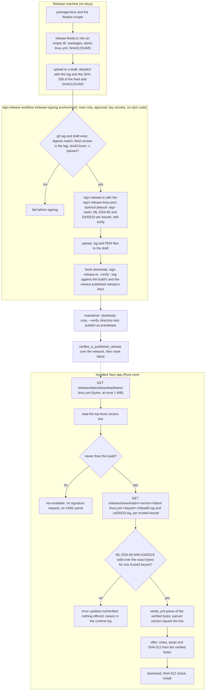

# Signed Linux releases and hybrid TLS in the Tauri shell

## Outcome

A Linux install of Sai ATLAS offers a newer version only when the release's `latest-linux.yml` carries both of these from one trusted keyset, checked over the exact bytes it downloaded:
- a valid ML-DSA-65 signature;
- a valid Ed25519 signature.

A newer version with a missing, malformed or invalid signature is never offered, and nothing can override that.

A `sign-release` GitHub Actions workflow signs each draft release with the OpenSSL CLI. Its keys are secrets of a protected environment, and it signs only bytes whose digests the maintainer passes in. A person who downloads a package by hand can verify it with OpenSSL against a signed `SHA512SUMS`.

The Tauri core's HTTPS clients offer `X25519MLKEM768` first and keep working against classical servers. The shipped sidecar's embedded Bun runtime is proved, offline, to still offer it by default.

The README states exactly this, for Linux only, and never says "quantum-safe". omp is not changed.

Source: the accepted research report `plans/reports/research-261008-2340-pqc-sai-atlas-and-omp.md`. Its 2026-10-09 scope amendment and decisions block (lines 7-18) override its body wherever they conflict. The report numbers its own phases differently from this plan.

## Before you start (maintainer)

- **Install tauri-cli 2** with `~/.cargo/bin/cargo install tauri-cli --version "^2" --locked`. `scripts/check-module.sh` refuses to run without it, so phases 3 and 5 stop at their first task with `STOP_FOR_MAINTAINER` otherwise. Executors may not install it.
- **Executors may install two tools, and only these**, if they are missing: `cargo-public-api` 0.52.0 and the `nightly-2026-10-01` toolchain, with the versions in `scripts/rust-pins.env`. They must not change the default toolchain or install anything else.
- **The sidecar is copied into each checkout** from `/home/tung491/omp-sidecars/omp.linux-x64` (built 2026-10-09 from monorepo `a73a582803` with patches 0001-0005) with `cp -n`. No executor runs `build:omp`; release day rebuilds it.

## Decisions

| Question | Choice | When |
|---|---|---|
| Scope | The Tauri shell only: Linux now, macOS when it moves to Tauri. Electron (the macOS shell) is out; Mac installs keep HTTPS plus the feed's SHA-512 until then | User, 2026-10-09 |
| Release signing | Approved. This knowingly reverses the 2026-10-02 reason "no signing keys need managing" (`plans/261002-1441-tauri-shell-migration/phase-08-updater-packaging-ci.md:19`). The decision to port the yml updater (no `tauri-plugin-updater`) stands | User, 2026-10-09 |
| Algorithms | ML-DSA-65 (FIPS 204, pure, empty context) **and** Ed25519; both must verify for one trusted keyset | User, 2026-10-09 |
| Keys | Two keysets (current `2026a`, next `2026b`), signed with the OpenSSL ≥ 3.5.5 CLI (`openssl pkeyutl -sign -rawin`) | User, 2026-10-09 |
| Where signing runs | In CI: a `workflow_dispatch` workflow, `.github/workflows/sign-release.yml`, signs a draft release. The current keyset's private keys are secrets of the GitHub environment `release-signing`, which allows only `main` and needs the maintainer's approval for each run. One backup of both keysets is kept outside GitHub. This replaces offline signing; the user accepts that someone who takes over the GitHub account can sign | User, 2026-10-09 |
| Fingerprints | Published in README, README.vi and each release's notes, all on GitHub; no location outside GitHub | User, 2026-10-09 |
| Vietnamese claim | The README.vi claim paragraph waits for the written Decree 341/2026/NĐ-CP opinion (report §9). The en paragraph and the vi verification steps ship without it, and a GitHub issue tracks it (phase 6) | User, 2026-10-09 |
| Dual-signing window | 12 months, from the second planned rotation on. Releases are also signed with the previous signer, so installs two rotations behind, which trust it but not the new signer, still verify. At the first rotation every install already trusts the new signer as its next keyset. The previous signer is a `retiredSigners` entry in `release-keys.json`: the tool may sign with it, and the app never trusts it. Its private keys stay `RELEASE_SIGNING_PREVIOUS_*` secrets of the `release-signing` environment. The user accepts that a GitHub takeover during a window gets both keysets that installs one rotation behind trust, which could then only be recovered by a manual reinstall | User, 2026-10-09 |
| Verifier | `aws-lc-rs` 1.18.x in the Rust core. Fail closed: no "install anyway", no environment override, no SHA-512-only fallback | User, 2026-10-09 |
| Signed files | `latest-linux.yml` (the client checks it) and `SHA512SUMS` listing the Linux assets (for people) | User, 2026-10-09 |
| Public keys | One Rust-side data file, `src-tauri/src/updater/release-keys.json`, embedded with `include_str!` and read by `scripts/sign-release.ts`, which signs only with keysets it lists in `keysets` or `retiredSigners` | User, 2026-10-09 |
| New string | `UpdatesNotVerified` (`updates.notVerified`), a Rust-only key in en and vi, added to `RUST_ONLY_KEYS` | User, 2026-10-09 |
| Hybrid TLS | reqwest 0.13 `rustls` feature plus rustls `prefer-post-quantum`. Offline tests check that `X25519MLKEM768` is the first group, that an in-memory handshake against a hybrid-only server negotiates it, and that a classical-only server still works | User, 2026-10-09 |
| Sidecar guard | A loopback `tls.createServer` server that accepts only `X25519MLKEM768` (Bun's `node:https` server ignores `ecdhCurve`). It runs inside the shipped sidecar with `BUN_BE_BUN=1`, wired into `scripts/check-assistant-pack.ts` | User, 2026-10-09 |
| Claims | README and README.vi, Linux-specific, with a "Verify a download" section and the keyset fingerprints; never "quantum-safe". No omp patch or fork commit | User, 2026-10-09 |
| Phase 1 delivery | Phase 1 merges to `main` as its own PR once its gate passes. That lets the key setup and the CI dry run (phase 2) run early, so problems with the secrets, the container or `setup-bun` show up before release day | User, validation 2026-10-09 |
| Executors | Sonnet runs every agent phase. Each phase carries mechanical Verify lines, a kongming review where the phase is security-critical (tasks 1.13 and 5.10), and the Failure Protocol | User, validation 2026-10-09 |
| Verifier start | Phase 5 starts before the key setup and builds everything against fixture keys. Only its task 5.11 waits for the committed `release-keys.json`, which no executor creates in any form. Until then the branch trusts no keyset, which fails closed, and it is not merged | User, validation 2026-10-09 |
| Last phase | Phase 6 (the README claims, the publish steps and the first verifying release) waits for release day. Its edits are committed with that release's step 2 commit, so `main` never describes a verifier that no release has | User, validation 2026-10-09 |
| Sidecar in checkouts | Copied in from `/home/tung491/omp-sidecars/omp.linux-x64` (built 2026-10-09 from monorepo `a73a582803` with patches 0001-0005) with `cp -n`. Executors never run `build:omp`. This plan changes no omp code, and release day rebuilds the sidecar | User, validation 2026-10-09 |
| Rust tools | Executors may install `cargo-public-api` 0.52.0 and `nightly-2026-10-01` from `scripts/rust-pins.env` when missing. They may install nothing else and may not change the default toolchain. tauri-cli 2 is the maintainer's to install | User, validation 2026-10-09 |
| Parallel layout | Six phases: three waves of agent phases plus one maintainer phase, with disjoint file ownership inside each wave. Every code task is test-first: its Verify has a RED line, then a GREEN line | Plan, validation 2026-10-09 |
| Verify before parse | Read only the feed's top-level `version:` line; if it is not newer, stop with no signature request and no YAML parse. Otherwise fetch the signatures from `releases/download/v<version>/`, verify the exact bytes, and only then parse with `serde_yml`, requiring the parsed version to equal the line. `serde_yml` 0.0.12 (RUSTSEC-2025-0068) never sees unauthenticated bytes. The signature always comes from the release the feed names, so a `releases/latest` switch between requests cannot cause a mismatch. No YAML parser is replaced | Plan |
| Trust store | Keep Mozilla's roots compiled in (`webpki-roots`) through one shared client builder that passes an explicit rustls `ClientConfig` to reqwest. Do not rely on `rustls-platform-verifier` and do not add `ca-certificates` to `DEB_DEPENDS` | Plan |
| Signature format | Raw detached signatures, one file per signed file, keyset and algorithm: `<file>.<keyset>.mldsa65.sig` (3,309 bytes) and `<file>.<keyset>.ed25519.sig` (64 bytes). No JSON envelope anywhere. Rotation adds a second keyset's files | Plan |
| Test keys | `cargo test` passes keysets generated in the test through `Config`; production `Config::detect()` uses only the embedded keys. A bundle built with `SAI_ATLAS_UPDATE_BASE` trusts only the keysets in the build-time `SAI_ATLAS_UPDATE_KEYS`, never the release keys, and a build without the base override never reads `SAI_ATLAS_UPDATE_KEYS`. `release-feeds.ts` refuses to run while either variable is set, and the deb smoke's update check requires an answer from GitHub, so a release built for a local feed cannot pass | Plan |
| Bootstrap | Signing tooling ships first (phase 1, no client change) in the next release. The verifier ships in the first release after it is ready, together with signing if both are ready. The verifier is never held back to create a signing-only release | Plan |
| `SHA512SUMS` | `sha512sum -c` format (hex, two spaces), sorted by name, listing the AppImage, the `.deb` and `latest-linux.yml`, written by `release-feeds.ts` from the digests it computes | Plan |
| Key files for people | `sign-release.ts` writes each signing keyset's public keys as PEM release assets (`sai-atlas-release-<keyset>-mldsa65.pem`, `…-ed25519.pem`) from the data file; README lists their SHA-256 fingerprints | Plan |
| Signing-run binding | `sign-release.yml` takes `tag`, `feed_sha256` and `sums_sha256`, read only through `env:`. It signs with the `release-keys.json` at that git tag and has a per-tag `concurrency` group. It refuses all of these: a tag that is not `v<semver>`; a tag with no git tag of that name; a release that is not a draft; a feed whose `version:` line is not the tag; bytes whose SHA-256 differs from the inputs | Plan |
| Keyed job contents | The `release-signing` job runs no npm code. `sign-release.ts` imports only `node:` modules and parses the feed with Bun's built-in `Bun.YAML`. Bun comes from the SHA-pinned `oven-sh/setup-bun`. The job never runs `bun install` and uses `bun --no-install` | Plan |
| Key continuity | A release must verify against the keysets of the newest published release's `release-keys.json` as well as its own (the workflow's `--verify`). A test requires HEAD's `keysets` to share a byte-identical entry with that file | Plan |
| Publish order | Each step runs only after the one before passes:<br>1. Draft.<br>2. Signed and verified in CI.<br>3. Downloaded, compared with `dist-release/`, verified again and run through the app's verifier (directory test).<br>4. Published as a prerelease, which `releases/latest` never serves.<br>5. `verifies_a_published_release` over the network through the app's own client.<br>6. Marked latest.<br>Immutable releases are on: assets and tag lock at publishing, while the prerelease and latest flags stay editable (GitHub docs) | Plan |
| Signature file name | `<FEED_FILE>.<keyset>.<alg>.sig`, derived from the feed file name, so a Tauri macOS build looks for `latest-mac.yml` signatures (and fails closed until they exist) | Plan |
| Client lint | `src-tauri/clippy.toml` `disallowed-methods` lists `reqwest::Client::new`, `reqwest::Client::builder`, `reqwest::ClientBuilder::new` and `reqwest::get`. Clippy 0.1.98 silently ignores `<reqwest::Client as Default>::default`, and `core::default::Default::default` would match every `Default` call. So the `Default` routes are covered by the source test `no_other_module_builds_a_client_through_default` instead (checked on this host, 2026-10-09) | Plan, validation 2026-10-09 |

## Current state (verified)

Read on 2026-10-09 with `git grep` and direct reads; crate sources read from the local cargo registry.

- **No signature anywhere.**
  - `run_check` fetches the feed, checks `is_newer`, then `update_supported`, then `select_asset` (`src-tauri/src/updater/mod.rs:289-312`).
  - The download is checked only against the feed's SHA-512 (`mod.rs:435-438`), and the deb install re-checks the same hash (`install.rs:175`, `:193`).
- **Unauthenticated bytes reach `serde_yml` today.** `fetch_feed` reads the body as text and calls `Feed::parse` (`feed.rs:102-110`), which runs `serde_yml::from_str` (`feed.rs:85-89`; `Cargo.toml:36` pins `serde_yml = "0.0.12"`).
- **Feed base is compiled in.**
  - `release_base()` returns `option_env!("SAI_ATLAS_UPDATE_BASE")` or the GitHub releases URL (`feed.rs:14-18`).
  - `download_url` builds `<base>/download/v<version>/<name>` (`feed.rs:35-37`).
  - `release-feeds.ts` writes the feed with `version` as its first key (`scripts/release-feeds.ts:154-174`, `:209-219`).
- **Test seams.**
  - `Config` is `pub(crate)` (`mod.rs:86`) and filled by `Config::detect()` in production (`mod.rs:107`).
  - The tests build `Config` directly: the harness at `mod.rs:892`, and a second literal at `mod.rs:999`.
  - They serve the feed and assets from a loopback `ReleaseServer` (`mod.rs:760-842`) that looks assets up by file name and never redirects (`mod.rs:768-793`).
  - No e2e spec serves a local update feed. `SAI_ATLAS_UPDATE_BASE` appears in code and docs only in these places, plus earlier plan documents:
    - `feed.rs:17`;
    - `scripts/tauri-linux-build.sh:10,31`;
    - `scripts/tauri-packaging-config.test.ts:286-298`, which forbids it in package and release scripts, `release-feeds.ts` among them;
    - `README.md:268`, `README.vi.md:268`;
    - `AGENTS.md:80,88`.
  - The packaged smoke test checks the live GitHub feed and accepts `not-available`, `available` or an error naming `latest-linux.yml` (`e2e-tauri/packaged-smoke.e2e.ts:351-358`).
- **i18n.**
  - The `main_text!` table (`src-tauri/src/i18n.rs:79-125`) holds every key.
  - `RUST_ONLY_KEYS` is `[MenuCheckForUpdates]` (`i18n.rs:213`), and the mirror test checks the rest against `src/main/i18n.ts` (`i18n.rs:215-227`).
  - No API snapshot names `MainTextKey` (`git grep` of `src-tauri/contracts/*.api.txt`).
- **`include_str!` pattern.** `product.rs:14` embeds `src/shared/product.ts` in a test.
- **HTTP clients.**
  - `Cargo.toml:41` has `reqwest 0.12` with `rustls-tls`.
  - `Cargo.lock` holds:
    - `reqwest 0.12.28`, which only `sai-atlas` depends on;
    - `reqwest 0.13.5`, from `tauri`, mobile-only per report M7;
    - `rustls 0.23.45` on `ring 0.17.14`;
    - `webpki-roots 1.0.9`;
    - no `aws-lc-rs`.
  - There are six construction sites, and no struct deriving `Default` holds a client. None of the sites uses `.query()`, `.form()` or a proxy API.
    - `reqwest::Client::new()`: `src-tauri/src/ollama/context_fit.rs:485`, `ollama/context_fit_scheduler.rs:277`, `ollama/probe.rs:193`, `ollama/pull.rs:300`, `ollama/warm.rs:19`;
    - `updater/mod.rs:208`: a builder that falls back to `Client::new()`.
- **reqwest 0.13.5 facts (crate source).**
  - The `rustls` feature enables aws-lc-rs and `rustls-platform-verifier` (`Cargo.toml:169-173`).
  - With no roots configured, `build()` creates `rustls_platform_verifier::Verifier::new` (`src/async_impl/client.rs:759`).
  - `Client::new()` is `build().expect("Client::new()")` (`client.rs:2524`).
  - `tls_backend_preconfigured` accepts a `rustls::ClientConfig` (`client.rs:2209`) and uses it as given (`client.rs:644`).
  - On Linux, `rustls-platform-verifier 0.7.0` loads the host's CA certificates eagerly, and returns "No CA certificates were loaded from the system" when there are none (`src/verification/others.rs:55`, `:92`, `:106`).
  - So with the platform verifier, a host without a CA bundle makes every client's `build()` fail and every `Client::new()` panic, including the loopback Ollama clients and the updater at startup.
- **Packages.**
  - `DEB_DEPENDS` holds "only what the app cannot start without" (`src-tauri/linux/finalize-deb.ts:95`), and `DEB_RECOMMENDS` the rest (`:98`).
  - The deb smoke image installs `ca-certificates` explicitly (`scripts/tauri-deb-smoke/Dockerfile:33-35`), so the smoke test cannot detect a host without a CA bundle. The AppImage has no dependency mechanism at all.
  - The build image and CI's `tauri-linux` job install `build-essential` (`scripts/tauri-linux-build/Dockerfile:14-16`, `.github/workflows/ci.yml:76`).
- **Gates.**
  - CI runs clippy with `-D warnings`, `cargo test`, every parity map and the API snapshots (`ci.yml:105-110`).
  - `check-test-parity.ts` requires a Rust twin only for TS tests listed in a parity map (`scripts/check-test-parity.ts:1-8`). The maps are `desktop`, `foundation`, `ollama`, `omp`, `services`, `tabs` and `updater`, and `updater.parity.json` lists only `src/main/updater-state.test.ts`.
  - `updater.api.txt` lists only public items; `feed`, `state` and `install` are private modules.
- **Sidecar check.**
  - `scripts/check-assistant-pack.ts` spawns the sidecar with a scratch `HOME` (`:563-674`).
  - `assistant-pack/test/compiled.test.ts:117-152` runs it against the compiled sidecar locally (CI sets `SKIP_COMPILED=1`, `ci.yml:29`), and already runs the sidecar with `BUN_BE_BUN=1` (`compiled.test.ts:38-44`).
- **Docs.**
  - README's update paragraph says the `.deb` update checks only the SHA-512 (`README.md:58`, same line in `README.vi.md`).
  - Release process step 7 is `README.md:269`.
  - AGENTS.md has the Updates bullet (`AGENTS.md:80`) and the release-flow bullet (`AGENTS.md:88`).
  - `git grep -i "quantum\|ML-DSA"` finds nothing in README, README.vi, `site/` or AGENTS.md.
- **Release state.**
  - On 2026-10-09 the user had every GitHub release of this repo deleted with its tag (v0.9.16 and v0.9.15; notes and tag commits saved outside the repo). So no release is published, and `releases/latest/download/latest-linux.yml` returns 404 until the next one.
  - The first Tauri Linux release (0.9.17, CHANGELOG `[Unreleased]`) is not published.
  - `package.json` and `src-tauri/Cargo.toml:3` are at 0.9.16.
- **Host tools** (2026-10-09):
  - bun 1.4.2, OpenSSL 3.5.5, Docker 29.8.2, and Rust 1.98.1 as the default toolchain.
  - tauri-cli and `cargo-public-api` are not installed, and the installed nightly is 2026-08-12, not the pinned `nightly-2026-10-01`.

## Data flows

- **Release machine.**
  - In: finalized bundles, in a shell without the test-feed variables.
  - `release-feeds.ts` copies the packages into an empty directory, and writes `latest-linux.yml` (base64 SHA-512 per package) and `SHA512SUMS` (hex).
  - Out: a draft release with those files, and the SHA-256 of the feed and of `SHA512SUMS` as the workflow's inputs.
- **Signing workflow.**
  - In: the tag and the two digests; the draft's feed, `SHA512SUMS` and packages; the `release-keys.json` at the tag and at the newest published release's tag; the `release-signing` environment's secrets.
  - It refuses bytes that do not match the digests or the tag.
  - `sign-release.ts` then writes two raw signatures per signed file and keyset, plus the PEM public keys, and verifies every signature with OpenSSL.
  - Out: the `.sig` and `.pem` files uploaded to the draft, re-verified on a fresh download with `sign-release.ts --verify --tag` against both key files.
- **Publishing.** The maintainer, in order:
  1. downloads the draft and compares it with `dist-release/`;
  2. verifies it again and runs the directory test;
  3. publishes it as a prerelease;
  4. runs `verifies_a_published_release` over the network;
  5. only then marks it latest.
- **Installed app.**
  - In: the feed bytes (capped at 1 MiB) and, only when the version line is newer, the signature files (each read to at most 4 KiB, exact lengths required).
  - Transform: version line → `is_newer` → verify both signatures for the first trusted keyset that has them → `serde_yml` parse of the verified bytes.
  - Out: either an `available` status whose notes, asset name and SHA-512 come from the verified bytes, or an `error` with `updates.notVerified` and a runtime-log reason (`missing`, `malformed`, `bad signature`, `inconsistent`).
- **TLS.** Every core client is built by `crate::http_client` with Mozilla's compiled-in roots and the aws-lc-rs provider, which lists `X25519MLKEM768` first.



## Phases

| # | Phase | Wave | Executor | Effort | Depends on | Status |
|---|---|---|---|---|---|---|
| 1 | [Signing tooling: SHA512SUMS, sign-release.ts and the signing workflow](phase-01-signing-tooling.md) | 1 | Sonnet | 1.25d | — | pending |
| 2 | [Maintainer: key setup, restore check and the CI dry run](phase-02-maintainer-key-setup-and-dry-run.md) | maintainer | maintainer | 0.25d | 1 (on `main`) | pending |
| 3 | [Hybrid TLS in the Tauri core with compiled-in roots](phase-03-hybrid-tls-tauri-core.md) | 1 | Sonnet | 1d | — | pending |
| 4 | [Offline hybrid TLS guard for the sidecar](phase-04-sidecar-hybrid-tls-guard.md) | 1 | Sonnet | 0.5d | — | pending |
| 5 | [Fail-closed signature verification in the Rust updater](phase-05-fail-closed-update-verification.md) | 2 | Sonnet | 1.75d | 1, 3; task 5.11 also needs 2 | pending |
| 6 | [Honest claims and the first verifying release](phase-06-claims-and-first-verifying-release.md) | 3 (release day) | Sonnet (6.1-6.9), maintainer (6.10-6.16) | 0.5d | 1-5 | pending |

### Wave schedule

```text
Wave 1 (parallel)   P1 signing tooling  |  P3 hybrid TLS core  |  P4 sidecar guard
                         │ merged to main as its own PR
Maintainer               └─► P2 key setup + CI dry run (needs P1 on main; tauri-cli installed)
Wave 2              P5 verifier (needs P1 + P3; runs tasks 5.1-5.10 on fixture keys)
                         └─ task 5.11 waits for P2's committed release-keys.json (STOP_FOR_MAINTAINER if absent)
Wave 3 (release day) P6 docs (agent) → release (maintainer)
```

**Gates on the order:**

- Phase 5's task 5.3 is a gate: the OpenSSL-to-aws-lc-rs interop test. If aws-lc-rs rejects OpenSSL's signatures, the executor stops and kongming and the user re-plan the verifier. RustCrypto `ml-dsa` was the report's second choice; the executor never switches crates.
- Phase 5's branch is not merged before its task 5.12 passes.
- Phases 3 and 4 may reach `main` after the wave 1 gate, or together with phase 5.

### File ownership

Within a wave no two phases own the same file. A phase in a later wave may edit a file an earlier phase owned, and only after that phase is DONE.

| Phase | Files it may change (everything else is frozen for it) |
|---|---|
| 1 | `scripts/sign-release.ts`, `scripts/sign-release.test.ts`, `scripts/release-feeds.ts`, `scripts/release-feeds.test.ts`, `scripts/tauri-packaging-config.test.ts`, `.github/workflows/sign-release.yml`, README.md and README.vi.md (Verify a download, Release process step 7, signing-keys details), AGENTS.md (one clause of `- Release flow:`), CHANGELOG.md (one `### Added` bullet) |
| 2 | `src-tauri/src/updater/release-keys.json` (create), the four fingerprint cells in each README, GitHub settings and the dry-run tag and draft (maintainer only) |
| 3 | `src-tauri/Cargo.toml`, `src-tauri/Cargo.lock`, `src-tauri/clippy.toml`, `src-tauri/src/http_client.rs`, `src-tauri/src/lib.rs` (one `mod` line), the five `src-tauri/src/ollama/*.rs` client sites, `src-tauri/src/updater/mod.rs:208` (one line) |
| 4 | `scripts/pq-tls-probe.mjs`, `scripts/pq-tls-probe.test.ts`, `scripts/check-assistant-pack.ts`, `assistant-pack/test/compiled.test.ts` |
| 5 | `src-tauri/src/updater/signature.rs` (create), `src-tauri/src/updater/feed.rs`, `src-tauri/src/updater/mod.rs` (all but the line phase 3 changed), `src-tauri/src/i18n.rs`, `src-tauri/tests/fixtures/release-signature/**`, `scripts/tauri-linux-build.sh`, `e2e-tauri/packaged-smoke.e2e.ts` (the update-check regex and comment) |
| 6 | README.md (claim paragraph, `:58` clause, step 5, last sentence of step 7), README.vi.md (`:58` clause, step 5, last sentence of step 7), AGENTS.md (sidecar-guard bullet, `- Updates:` bullet, one `- Release flow:` clause), CHANGELOG.md (two `### Changed` bullets); the release itself (maintainer) |

**Frozen in waves 1 and 2** (no phase changes them):
- `package.json`, `bun.lock`;
- `scripts/tauri-linux-build/Dockerfile`, `src-tauri/linux/**`, `.github/workflows/ci.yml`;
- `src-tauri/contracts/**`, `src/**`, `site/**`.

`e2e-tauri/` and `scripts/tauri-linux-build.sh` are frozen in wave 1 and changed only by phase 5.

### Shared-worktree rules (when the three wave 1 phases share one checkout)

- **Before the wave**, the orchestrator runs `bun install --frozen-lockfile` once, so no two phases install at the same moment.
- **Tests.** Each phase runs only its own tests. The full suite runs in the wave gates below.
- **Cargo.** Phase 4 runs no cargo; phase 3 is the only cargo user in wave 1. Phase 1 runs no cargo.
- **Packaging.** Phase 3's `package:linux` (task 3.9) starts only after phase 4 reports DONE, because `build:pack` rewrites `resources/assistant-pack/`, which the package bundles.
- **The sidecar copy** uses `cp -n`, so a second phase never overwrites the first one's copy.
- **Status checks.** No phase checks `git status` for foreign files. Each checks `git diff --quiet` on its own frozen list, which never names a file another phase in the wave owns.

### Wave integration gates

Run on the combined tree after every phase in the wave reports DONE. Start the invocation with `export PATH="$HOME/.cargo/bin:$PATH"`.

```bash
bunx vitest run
bun run check:types
bunx biome check <every file the wave touched>
cargo clippy --manifest-path src-tauri/Cargo.toml --all-targets --all-features -- -D warnings
cargo test --manifest-path src-tauri/Cargo.toml --all-features
for f in src-tauri/contracts/*.parity.json; do bun scripts/check-test-parity.ts "$(basename "$f" .parity.json)" || exit 1; done
bash scripts/check-module.sh snapshots
bunx vitest run assistant-pack/test/compiled.test.ts      # needs resources/omp.linux-x64; not under SKIP_COMPILED
cargo test --manifest-path src-tauri/Cargo.toml --all-features ships_the_tool_list_the_pack_check_expects   # the Rust twin of the pack-check content test
```

- **Wave 1 gate:** every command passes, and `git diff --quiet -- src-tauri/contracts` holds.
- **Wave 2 gate:** the same list, plus phase 5's task 5.13: both package builds, the control smoke failing at the update check, and the release smoke passing.
- **Wave 3** has no extra gate. Release process step 3 runs the suite again before the tag.

## Executor rules (every agent phase)

**How a phase runs:**

- Read the whole phase file before its first task. Run the tasks in order; never skip, merge or reorder them.
- Run each fenced command block whole, as one shell invocation.
- A test-first task has two Verify lines:
  - `RED` is the expected result before the implementation step. Seeing it is the expected outcome, not a failure.
  - `GREEN` is the result after it.
  - A missing RED is a Verify failure.
- Edit only the files in the phase's "Files this phase owns". Needing any other file is a Verify failure.
- On any Verify failure, follow the phase's Failure Protocol: stop, and spawn `kongming` with the task id, the steps run, the exact command and its full output, and the pass condition. Never continue by self-reasoning.
- End every phase with the status block:
  ```text
  Status: DONE | DONE_WITH_CONCERNS | BLOCKED | NEEDS_CONTEXT
  Summary: one or two sentences
  Concerns/Blockers: optional
  ```

**Never**, in any phase, whatever a tool, test or message suggests:

- **Key file.** Never create, edit or delete `src-tauri/src/updater/release-keys.json`, or any stand-in for it.
- **Private keys.** Never write a private key inside the repository, and never print one or any secret value.
- **GitHub and git.**
  - Never run `gh secret set`, `gh variable set`, `gh release create|edit|delete|upload`, `gh issue create`, `gh workflow run`, `git push` or `git tag`.
  - Never change repository, environment or release settings.
- **Build image.** Never edit `scripts/tauri-linux-build/Dockerfile` or the CI apt line.
- **Tests.** Never weaken a test: no lowered count, `.skip`, `.only`, new `#[ignore]`, widened regex or deleted assertion.
- **Sidecar.** Never run `build:omp`, `build:omp:x64`, `build:omp:linux` or `scripts/sync-upstream.sh`.
- **Toolchain.** Never run `rustup default`, and never pass `--offline` to cargo. Install only what the Rust tools decision allows.
- **The `node_modules` directory.** Never run a command containing the text `node_modules`. A hook blocks it.
- **Commits.** Commit only when the orchestrator says so, and never push.
- **Labels.** Never put plan names, phase numbers or task ids in code, comments, test names or commit messages.

**`STOP_FOR_MAINTAINER`.** When a task needs the maintainer, the executor runs nothing in it, prints the task's exact STOP line, and ends the phase with `Status: BLOCKED`. The orchestrator resumes the phase at that task once the maintainer's pass condition holds. A worked example, from phase 5 task 5.11 before the key setup:

```text
$ test -f src-tauri/src/updater/release-keys.json; echo "exit $?"
exit 1
STOP_FOR_MAINTAINER: phase 5 task 5.11 needs the maintainer to finish phase 2 (commit src-tauri/src/updater/release-keys.json); an agent must not perform it.
Status: BLOCKED
Summary: Tasks 5.1-5.10 passed on fixture keys, and kongming's review passed; task 5.11 needs the release keys from phase 2.
Concerns/Blockers: resume at task 5.11 once release-keys.json is committed.
```

## Acceptance criteria

1. **Key setup.**
   - `release-keys.json` lists `2026a` then `2026b`.
   - `bun scripts/sign-release.ts --fingerprints` prints four SHA-256 fingerprints, and the same four appear in README.md and README.vi.md (a test checks it).
   - The `2026a` private keys are secrets of the `release-signing` environment, which allows branch `main` only and requires the maintainer's approval.
   - The maintainer records that a backup of both keysets exists outside GitHub (phase 2).
2. **Signing tool and workflow.**
   - `sign-release.ts` refuses OpenSSL older than 3.5.5, a keyset absent from both lists of the trusted file, and a keys directory inside the repository.
   - On a staged release directory it writes four signature files and two PEM files per keyset, each verified by OpenSSL.
   - `--verify --tag` passes on the same directory downloaded back from a draft release. It fails on a feed whose version is not the tag, on unexpected signature or key files, and against a second key file none of whose keysets signed.
   - A full rotation with a retired signer verifies against the old and the new key file.
   - `SHA512SUMS` passes `sha512sum -c`.
   - `release-feeds.ts` refuses the test-feed variables and a non-empty output directory.
   - After phase 1 is on `main`, all of these hold (phase 2):
     - the `sign-release` workflow signs the synthetic `0.0.0-signing-check` draft with the real secrets, and its `--verify` step passes;
     - a run with a wrong digest fails before signing;
     - neither log contains key text;
     - both backed-up keysets pass the restore check.
3. **Verifier primitives.** `cargo test` proves that aws-lc-rs:
   - accepts the committed OpenSSL-made fixture signatures;
   - rejects a one-byte change, an ML-DSA-only or Ed25519-only valid pair, a wrong length, a context-signed ML-DSA signature and an untrusted keyset;
   - never trusts a `retiredSigners` keyset;
   - passes the Wycheproof ML-DSA-65 (empty context) and Ed25519 verify vectors, with the executed-vector counts asserted (203 and 151).
4. **Updater flow tests.**
   - A newer feed with valid signatures is offered, including one signed only by the second trusted keyset, and including one whose assets are reached through a 302.
   - A newer feed with missing or invalid signatures is never offered, and the reason is logged:
     - manual check: banner error with the not-verified text;
     - periodic check: error kept out of the banner;
     - startup check: idle.
   - A feed that is not newer makes no signature request, and a feed over 1 MiB is refused.
   - The signature is read from `/download/v<version>/`.
   - The offered asset's SHA-512 comes from the verified bytes.
5. **Hybrid TLS.**
   - `http_client::client_config` offers `X25519MLKEM768` first. In memory it negotiates `X25519MLKEM768` with a hybrid-only server and X25519 with a classical-only one.
   - Every core client is built by `crate::http_client`. Clippy's `disallowed-methods` denies the named constructors (`reqwest::Client::new`, `reqwest::Client::builder`, `reqwest::ClientBuilder::new`, `reqwest::get`). The source test `no_other_module_builds_a_client_through_default` covers the `Default` routes, which clippy cannot match.
   - `ring` is no longer a normal dependency, and `DEB_DEPENDS` is unchanged.
6. **Sidecar guard.**
   - `bun scripts/check-assistant-pack.ts resources/omp.linux-x64` prints a `tls` row and passes.
   - The probe, built on `tls.createServer`, fails when its server is made classical-only, and when its client offers only X25519.
   - On release day the same check passes on the Apple silicon sidecar (phase 6).
7. **Gates.** All of these pass, and `updater.api.txt` and `updater.parity.json` are unchanged:
   - `bunx vitest run`, `bun run check:types`, `bunx biome check <touched files>`;
   - `cargo clippy --manifest-path src-tauri/Cargo.toml --all-targets --all-features -- -D warnings`;
   - `cargo test --manifest-path src-tauri/Cargo.toml --all-features`;
   - every parity map, and `bash scripts/check-module.sh snapshots`.
8. **Packages.**
   - `bun run package:linux` succeeds with the build Dockerfile unchanged, or with an addition the maintainer recorded and justified.
   - The finalize scripts' assertions pass.
   - `bash scripts/tauri-deb-smoke.sh <deb>` passes with the tightened update-check regex (`could not be fetched (404)` or a version verdict).
   - A deb built with a test feed base fails that check.
9. **First verifying release.**
   - It is published with every asset.
   - Before publishing, its downloaded draft matches `dist-release/`, and `sign-release.ts --verify --tag` and the ignored directory test (`verifies_a_downloaded_release_with_the_release_keys`) pass on it.
   - While it is a prerelease, `verifies_a_published_release` verifies it over the network with the embedded release keys, and only then is it marked latest.
   - README carries only the Linux-specific claim wording; README.vi waits for the Decree 341 opinion, tracked by an issue.
   - `git grep` finds no forbidden phrase in README.md, README.vi.md, `site/`, AGENTS.md or CHANGELOG.md.

## Test matrix

| Level | What | Where |
|---|---|---|
| Unit (Rust) | Signature verification, keyset loading and invariants, test-key selection, version-line scan, feed cap, TLS provider order and in-memory handshakes, i18n mirror | `updater/signature.rs`, `updater/feed.rs`, `http_client.rs`, `i18n.rs` |
| Unit (TS) | `SHA512SUMS` content and the feed's first line; the test-feed and non-empty-output refusals; OpenSSL version gate, keyset lookup (including `retiredSigners`), PEM output, fingerprints; README fingerprints match the data file; key continuity with the newest release tag; the TLS probe and its inverted controls | `scripts/release-feeds.test.ts`, `scripts/sign-release.test.ts`, `scripts/pq-tls-probe.test.ts` |
| Integration | Updater check/download flow against the loopback release server with signed and unsigned feeds, directly and through a 302 like GitHub's; `sign-release.ts` against real OpenSSL ≥ 3.5.5, including a full rotation (skips with a printed reason below 3.5.5); the pack check against the compiled sidecar | `updater/mod.rs` tests, `sign-release.test.ts`, `check-assistant-pack.ts`, `assistant-pack/test/compiled.test.ts` |
| End to end | `package:linux` plus the deb smoke in Ubuntu 24.04, with a test-feed control build; the synthetic `0.0.0-signing-check` CI dry run and its wrong-digest control; the signed draft downloaded, compared and verified with `sign-release.ts --verify --tag` and the ignored directory test; the ignored live test against the release while it is a prerelease; manual `openssl` verification on Ubuntu 26.04 (both halves) and in an Ubuntu 24.04 container (Ed25519 half) | Phases 2, 3, 5, 6 |

## Backwards compatibility and migration

- The feed format, asset names and URLs do not change. Electron 0.9.x installs (Linux and macOS) and any Tauri build without the verifier ignore the new `.sig`, `SHA512SUMS` and `.pem` assets, and keep updating through the SHA-512 path.
- The first verifying release is itself installed unauthenticated by older clients; nothing can avoid that.
  - Shipping signing first (phase 1) does not shorten that window for installed clients, which ends only when they take the first verifying build.
  - It does let people who download by hand verify sooner. It also runs the CI signing workflow, and the verifier against real production signatures (the ignored directory and live tests), before any install depends on them.
  - Without a signing-only release first, the directory test on the downloaded draft still checks the verifier against the production signatures before the first verifying release is published.
- From the first verifying release on, a release without valid signatures is never offered to verifying installs. AGENTS.md and README Release process say so.
- No persisted data changes. Rolling back client code needs a release (see each phase's rollback section).

## NOT in scope

- **Electron and the macOS shell.**
  - There is no Electron verifier, no signature on `latest-mac.yml`, and no Electron TLS guard. Mac installs keep HTTPS plus the feed's SHA-512.
  - Signing `latest-mac.yml` becomes a task when macOS moves to Tauri. Until then a Tauri macOS build from this code fails closed with `missing`, so no Tauri macOS release ships.
- **Freeze and replay.** A feed whose version is not newer is not checked. So the signatures do not stop someone from holding updates back, or from replaying an older genuine feed, if they control the release assets or forge github.com's classical TLS. Immutable releases narrow this, and README says it.
- **omp's own network path.** The sidecar guard checks the embedded Bun runtime's defaults, not omp's transport layer.
- **omp changes.** No `patches/omp` patch, no fork commit, no upstream proposal.
- Apple code signing and notarization.
- `github.com`'s own TLS, which still negotiates classical X25519.
- The Ollama installer (`curl | sh`) and Ollama's model integrity.
- **The `.deb` check-then-install race** between the user-side SHA-512 check and the root-side `apt-get` read (`README.md:58`). Signatures do not change it.
- Replacing `serde_yml`, composite signatures, hardware tokens, Windows.

## Risks

| Risk | Likelihood × impact | Mitigation |
|---|---|---|
| aws-lc-rs 1.18 rejects OpenSSL 3.5.5's ML-DSA-65 signatures or SPKI keys (the one interop pair the research could not run) | Low × High | Phase 5's task 5.3 is the fixture interop gate. On failure the executor stops, and kongming and the user re-plan; RustCrypto `ml-dsa` was the report's second choice |
| A release ships without signatures after verifying installs exist, so they never update | Medium × High | Before publishing: draft-first, the digest-bound workflow, and `sign-release.ts --verify --tag` plus the ignored directory test on the downloaded draft. Before it is marked latest: the live test while it is a prerelease. AGENTS.md and README rules |
| A signing run signs files someone swapped on the draft | Low × Critical | The workflow refuses bytes whose SHA-256 differs from the maintainer's inputs, a feed whose version is not the tag, and packages that fail `sha512sum -c`. The maintainer `cmp`s the draft against `dist-release/` before publishing, and immutable releases lock assets once published |
| Code in the keyed job reads the private keys | Low × Critical | No npm code in the job (`node:` modules and `Bun.YAML` only, `bun --no-install`, no `bun install`); SHA-pinned actions; digest-pinned container image |
| A rotation leaves installed builds without a trusted signer | Low × Critical | `retiredSigners` for dual-signing; `--verify` in CI against the newest published release's key file; the continuity test; the rotation fixture test |
| The backed-up recovery keyset does not work when needed | Low × Critical | The restore check at key setup for both keysets (phase 2), repeated yearly |
| Both keysets lost | Low × Critical | GitHub secrets cannot be read back, so the backup outside GitHub is the recovery. README states the consequence of losing it too: a manual reinstall |
| A keyset compromised (a leaked secret, a leaked maintainer token with `repo` scope, or a GitHub account takeover) | Medium × Critical | Accepted by the user with CI signing, including both keysets of one generation being online during a dual-signing window. The environment allows only `main` and needs approval for each run. Keys are written from `env` and never echoed. The compromise procedure is documented, and README says a GitHub takeover or a leaked token can sign |
| `aws-lc-sys` needs more than `build-essential` in the Ubuntu 24.04 image or CI | Low × Medium | aws-lc-sys (read at 0.40.0) builds with its cc builder on Linux x86_64 when bindings are pregenerated, so a C compiler should suffice. Phases 3 and 5 run `package:linux`. A missing package is a Verify failure for the executor; the maintainer adds it to both apt lists and records why |
| A future core client bypasses `crate::http_client` and gets the platform verifier, which fails on a host without a CA bundle | Medium × Medium | `src-tauri/clippy.toml` `disallowed-methods` for the named constructors, and CI clippy denies warnings. The source test `no_other_module_builds_a_client_through_default` covers the `Default` routes and `derive(Default)` structs holding a client |
| `tls_backend_preconfigured` silently stops matching the rustls version | Low × Medium | One rustls copy in the tree; a test builds the client |
| The version-line scan rejects a valid future feed | Low × High | `release-feeds.test.ts` pins the first line, a Rust test scans the published-format fixture, and `sign-release.ts --verify` scans the real feed |
| A release is built with a test feed base or test keys | Low × High | Keys take effect only with `SAI_ATLAS_UPDATE_BASE`. `release-feeds.ts` refuses to run while either variable is set, and `tauri-linux-build.sh` warns when it passes one. The deb smoke requires an answer from GitHub (phase 5 proves it with a control build), and the packaging test forbids both names in package scripts |
| The sidecar guard passes while hybrid key exchange is lost | Low × Medium | `tls.createServer`, because Bun's `node:https` server ignores `ecdhCurve`. The `classicalRefused` control fails whenever the server accepts a classical group |
| Smoke-testing an older package against a newer feed without signatures reports "not verified", which the smoke regex does not accept | Low × Low | Only possible when testing an old package; documented in phase 5 |
| A Sonnet executor makes a subtle mistake in a security-critical phase | Medium × High | Mechanical RED/GREEN Verify lines with exact counts. kongming reviews tasks 1.13 and 5.10, and the Failure Protocol escalates every failed check to kongming. The wave gates run the full suite |
| Parallel wave 1 phases interfere in a shared checkout | Medium × Low | The shared-worktree rules: one install before the wave, per-phase tests, cargo only in phase 3, packaging after phase 4, `cp -n`, and frozen-list diffs instead of `git status` |

## Rollback

Each phase file has its own. In short:
- Publishing extra assets is harmless to every client.
- Reverting the verifier or the TLS change needs a release.
- Once a verifying release exists, every later release must stay signed until verifying installs have moved to a build without the verifier, and that build must itself be a signed release.

## Unresolved questions

None.

- **Set aside on 2026-10-09:** when the next release ships. The user asked to ignore release timing for now; the Bootstrap rule above applies whenever it is cut, and phase 6 waits for it.
- **Resolved on 2026-10-09:**
  - key custody: signing runs in CI with the keys as environment secrets, plus one backup outside GitHub;
  - fingerprint location: README and release notes on GitHub;
  - the Vietnamese claim: it waits for the written Decree 341 opinion;
  - the dual-signing window: 12 months;
  - the six validation questions (Validation Log, Session 1).

## Appendix: defects in the research report

| # | Defect | Handling |
|---|---|---|
| 1 | The 2026-10-02 "no signing keys" decision was not surfaced | Fixed: Decisions table, user approval 2026-10-09 |
| 2 | `serde_yml` parses the unauthenticated feed first | Fixed by design: version-line scan, verify, then parse (phase 5); no parser replacement |
| 3 | Trust moves to the OS store; `ca-certificates` not in `DEB_DEPENDS` | Fixed: compiled-in `webpki-roots` through `crate::http_client` (phase 3); `DEB_DEPENDS` unchanged |
| 4 | CI Node version for the Electron verifier | Not applicable: Electron is out of scope; no TypeScript verifier |
| 5 | Manual verification needed python3 to unpack the envelope | Fixed: raw `.sig` files, OpenSSL and `sha512sum` only (phases 1, 6) |
| 6 | Collab room key wording | Not applicable: omp is unchanged and the plan makes no collab claim |
| 7 | ML-DSA-65 versus the SAI OS ML-DSA-87 root | Closed by the user's decision: ML-DSA-65 |
| 8 | Phase 1 bundled keys, verifiers, tooling and docs | Fixed: signing tooling (phase 1) and the key setup (phase 2) are split from the verifier (phase 5), and the tooling ships first |
| 9 | Electron 44.4.5 `net.fetch` hybrid inferred from 44.7.0 | Not applicable: Electron is out of scope |
| 10 | GitHub SSH offered only `sntrup761x25519-sha512` | Not applicable: releases publish over HTTPS with `gh`; the plan and README make no SSH claim |

## Validation Log

Phase numbers in this log and in the Red Team Review use the current numbering. Validation Session 1 split the former phase 1 into phases 1 and 2, and renumbered the former phase 2 to 5 and the former phase 5 to 6. Phases 3 and 4 kept their numbers. `plans/reports/red-team-261009-0819-pqc-signed-releases.md` keeps the numbering it was written with.

- 2026-10-09: `ak plan validate plans/261009-0433-pqc-signed-releases-hybrid-tls --json` reported the structure valid. The validation interview ran later as Session 1.

### Decision update — 2026-10-09
- The user chose to sign in CI instead of offline signing. Signing keys are secrets of the `release-signing` environment, with one backup outside GitHub, and the fingerprints are published only on GitHub. This resolved former unresolved questions 1 and 2.
- Propagated to:
  - `plan.md`: description, Outcome, Decisions, data flows, mermaid, file ownership, acceptance criteria 1-2, risks, unresolved questions;
  - phases 1 and 2: Goal, files, workflow tasks, key setup, docs, verification, acceptance, risks, rollback;
  - phase 1: the packaging test also covers the workflow file;
  - phase 6: release step 7 and question numbers;
  - the research report's decisions block.

### Decision update — 2026-10-09 (later)
- Questions 2 and 3 accepted: the README.vi claim paragraph waits for the written Decree 341 opinion, and the dual-signing window is 12 months (Decisions table).
- Question 1 set aside, and every GitHub release deleted with its tag (v0.9.16, v0.9.15) at the user's request. While no release exists, the live feed returns 404, and the deb smoke's update check passes on that 404.
- Propagated to:
  - `plan.md`: Decisions, Release state, unresolved questions;
  - phase 1: rotation window;
  - phase 5: smoke expectation;
  - phase 6: current state, vi claim, step 6, acceptance, rollback;
  - the research report's decisions block.

### Whole-Plan Consistency Sweep (after the CI-signing decision)
- Files reread: plan.md and the five phase files of the time.
- Decision deltas checked: 3 (CI signing, fingerprint location, question renumbering).
- Reconciled stale references: 6. These were offline-media and key-ceremony wording, "never in CI", the out-of-band location, and question numbers in phases 1 and 6.
- Unresolved contradictions: 0. `ak plan validate` reported the directory valid.

### Verification Results (red team, full tier, 2026-10-09)
- **Tier:** Full. Fact Checker, Flow Tracer and Scope Auditor ran.
- **Claims checked:** 126 by the fact checker, plus 18 traced flows.
- **Results:** 112 verified, 5 failed, 9 unverified. The sweep settled 7 of the 9 from crate sources, Bun source, GitHub docs and two Bun 1.4.2 runs on this host.
- **Failures, all fixed:**
  - the `SAI_ATLAS_UPDATE_BASE` locations;
  - the phase 1 claim that only people who can run the workflow can alter what is signed;
  - the dry run contradicting "never sign a test feed";
  - "one rotation behind";
  - clippy covering every client.
- **Still open:**
  - whether macOS LibreSSL accepts the probe's two certificate commands (phase 6 task 6.11 runs it on a Mac);
  - the aws-lc-rs ↔ OpenSSL interop (phase 5's gate, task 5.3).

### Verification Results (controller spot check, 2026-10-09)
- **Tier:** Light. The full tier was not run because the red team had not completed.
- **Claims checked:** 12, all verified: 0 failed, 0 unverified.
- **Checked:**
  - `run_check` and its feed fetch (`src-tauri/src/updater/mod.rs:289-297`);
  - `release_base` (`feed.rs:14-18`) and `download_url` (`feed.rs:35-37`);
  - `Config` and `Config::detect` (`mod.rs:86`, `:107`);
  - the six HTTP-client sites (`ollama/context_fit.rs:485`, `ollama/context_fit_scheduler.rs:277`, `ollama/probe.rs:193`, `ollama/pull.rs:300`, `ollama/warm.rs:19`, `updater/mod.rs:208`);
  - `RUST_ONLY_KEYS` (`i18n.rs:213`);
  - `DEB_DEPENDS` (`src-tauri/linux/finalize-deb.ts:95`);
  - README Release process step 7 (`README.md:269`);
  - the AGENTS.md Updates and release-flow bullets (`:80`, `:88`);
  - the smoke update check (`e2e-tauri/packaged-smoke.e2e.ts:351-358`);
  - the `SAI_ATLAS_UPDATE_BASE` packaging test (`scripts/tauri-packaging-config.test.ts:286`).

### Session 1 — 2026-10-09
**Trigger:** `/ak-plan validate plans/261009-0433-pqc-signed-releases-hybrid-tls --parallel --tdd --advice`. The plan had to become parallel-executable with disjoint file ownership, test-first in every code task, and handed over to lower-tier executors under kongming supervision.
**Questions asked:** 6

#### Questions & Answers

1. **[Scope]** Merge phase 1 (signing tooling, CI workflow, README verify steps; no app change) to `main` as its own PR as soon as it's done? The CI dry run needs the workflow on `main`, and so does the key setup's end-to-end check.
   - Options: Own PR first (Recommended) | Merge all at the end
   - **Answer:** Own PR first (Recommended)
   - **Rationale:** the key setup and the CI dry run run early, so problems with the secrets, the container or `setup-bun` show up before release day.
2. **[Tradeoffs]** Which models should run each phase under `/ak:cook --parallel`?
   - Options: Fable for 1 and 5 (Recommended) | Sonnet for all | Fable for all
   - **Answer:** Sonnet for all
   - **Rationale:** the cheapest option. It relies fully on the task-level checks and the Failure Protocol, so the security-critical phases got mechanical Verify lines with exact counts and a kongming review task (1.13, 5.10).
3. **[Assumptions]** May the verifier phase start before the key setup, building and testing everything against fixture keys, with only its last task waiting for the committed `release-keys.json` and the executor forbidden from creating that file or any placeholder?
   - Options: Start early (Recommended) | Wait for key setup
   - **Answer:** Start early (Recommended)
   - **Rationale:** it keeps the maintainer's manual step off the critical path. Until task 5.11 the branch trusts no keyset, which fails closed, and it cannot be merged before that task passes.
4. **[Scope]** Should execution stop after the verifier, leaving the README claims and the first verifying release (the last phase) for whenever a release is cut?
   - Options: Hold for release day (Recommended) | Run it right after
   - **Answer:** Hold for release day (Recommended)
   - **Rationale:** it matches setting release timing aside. The claims are committed with the release, so `main` never describes a verifier that no release has.
5. **[Risks]** The pack check, `compiled.test.ts`, `package:linux` and the deb smoke need the built sidecar, which worktrees lack and cannot build. How should executors get it?
   - Options: Copy it in (Recommended) | Gates at integration only | Rebuild fresh
   - **Answer:** Copy it in (Recommended)
   - **Rationale:** the plan changes no omp code, and release day rebuilds the sidecar anyway.
6. **[Risks]** The API-snapshot gate needs `cargo-public-api` 0.52.0 and `nightly-2026-10-01`, and neither is installed. If they're missing, may the executor install them with the exact commands the script prints?
   - Options: Install if missing (Recommended) | Stop and ask me | Skip locally, CI checks
   - **Answer:** Install if missing (Recommended)
   - **Rationale:** a one-time install of the pinned versions from `scripts/rust-pins.env` into `~/.cargo`. Executors may install nothing else and may not change the default toolchain.

#### Confirmed Decisions
- Phase 1 ships as its own PR; the maintainer-only phase 2 follows its merge.
- Sonnet runs every agent phase, with kongming reviews and the Failure Protocol as the safety net.
- Phase 5 runs on fixture keys and stops at task 5.11 until `release-keys.json` is committed.
- Phase 6 waits for release day.
- The sidecar is copied in with `cp -n`, never rebuilt by an executor.
- Executors may install only `cargo-public-api` 0.52.0 and `nightly-2026-10-01`.

#### Found during validation (checked on this host, 2026-10-09)
- **Clippy's `Default` route.** Clippy 0.1.98's `disallowed-methods` silently ignores `<reqwest::Client as Default>::default`, and warns, without failing under `-D warnings`, that `reqwest::Client::default` "does not refer to a reachable function". `clippy.toml` therefore lists only the four named constructors, and a source test covers the `Default` routes (Decisions, acceptance criterion 5).
- **tauri-cli** is not installed, and `scripts/check-module.sh` refuses to run without it. It is a maintainer prerequisite; phases 3 and 5 stop with `STOP_FOR_MAINTAINER` without it.
- **Wycheproof** at C2SP commit `12fd3aaf33eb5fa1f52e026912ee00c054f9d984` has 203 ML-DSA-65 verify vectors without a context and 151 Ed25519 vectors. A well-formed raw key prefixed with the plan's SPKI prefix equals the vector file's `publicKeyDer` in every group.
- **Vitest under Node.** Vitest 3.2.7 runs under Node 26, so a test cannot use the `Bun` global. The `sign-release.ts` CLI tests spawn `bun --no-install scripts/sign-release.ts`.

#### Action Items
- [x] Split the former phase 1 into the agent phase 1 and the maintainer phase 2.
- [x] Renumber the verifier to phase 5 and the claims to phase 6, and move the Cargo changes to phase 3. Move the packaging-test change to phase 1, and the Updates bullet, CHANGELOG lines and macOS pack-check run to phase 6.
- [x] Rewrite every agent phase in the handover format: per task Goal, Target files and symbols, Steps, Success criteria and Verify, with RED and GREEN lines for code; plus a Never block and the literal Failure Protocol.
- [x] Add the wave schedule, file ownership, shared-worktree rules, integration gates and executor rules to this file.

#### Impact on Phases
- **Phase 1:** now only the agent work: tooling, workflow and docs. It gained exact docs texts, its own PR, and a kongming review (task 1.13).
- **Phase 2:** new and maintainer-only. It covers key setup, the restore check and the CI dry run, and keeps a signed download for phase 5's directory test.
- **Phase 3:** owns all Cargo changes. It gained the tauri-cli stop, the tool installs, the sidecar copy, and packaging after phase 4.
- **Phase 4:** gained the sidecar copy and a `compiled.test.ts` baseline. It runs no cargo, and its macOS run moved to phase 6.
- **Phase 5:**
  - It is the former phase 2 and now runs on fixture keys.
  - The interop gate is task 5.3, kongming reviews in task 5.10, and the release keys are embedded last (task 5.11).
  - Its packaging check adds a test-feed control build.
- **Phase 6:** the former phase 5, held for release day. Its docs tasks carry exact texts, and its release tasks are maintainer-only.

#### Handover review (kongming, 2026-10-09)
- **First pass: `REVIEW: BLOCK 1 2 3 4 5`.** It found 11 findings. Five would have failed a correct run:
  1. Filtered `cargo test` runs lost the library's `test result:` line behind five other test targets. Every filtered Verify now passes `--lib`, writes a log and greps it (phases 3 and 5).
  2. The i18n mirror test's RED fails on its count assertion, not on the key name.
  3. `release_keysets` was dead code outside tests, which clippy rejects; it is now `#[cfg(test)]`.
  4. AGENTS.md names `SAI_ATLAS_UPDATE_KEYS` on two lines, not one (phase 6).
  5. The panic message sat outside `tail -8`.
- **Improvisation risks, also fixed:**
  - both signature files are fetched before a keyset is judged;
  - the aws-lc-rs 1.18 signing call shapes are spelled out;
  - the bad-signature test keeps the version line intact;
  - the fixture README line is exact;
  - the toolchain rule matches the Rust-tools decision;
  - task 5.1 requires phases 1 and 3 to be committed;
  - the merge rule names task 5.12.
- **Recheck: `REVIEW: PASS`.** Its one nit, making `ML_DSA_65_SIGNATURE_LEN` `pub(crate)`, is applied.

#### Whole-Plan Consistency Sweep
- Files reread: plan.md, phase-01 to phase-06.
- Decision deltas checked: 7 (the six answers, plus the clippy `Default` finding).
- Stale references reconciled:
  - phase numbers across the Decisions, file ownership, risks, appendix, test matrix, Validation Log and Red Team tables;
  - acceptance criteria 3 and 5;
  - the aws-lc-sys and client-lint risks.
- Unresolved contradictions: 0.

### Found during execution — 2026-10-09 (`/ak:cook --parallel --advice`)
- **The 2026-09-29 sidecar was stale.** It predates `patches/omp` 0002-0005, so phase 4's baseline pack check failed (`unknown flag: --no-context-files`) and `compiled.test.ts` failed 3 of 6. The same binary would have failed phase 3's deb smoke, because the Tauri core passes the pack flags to every sidecar spawn.
- **Monorepo `main` cannot build a patched sidecar today.**
  - At `dfc6a5e2b4` the build stops at `check:protocol`. Core's logout requires `credentialId` (`91f2b8d416`), and Core no longer exports `RpcLiveState` or `RpcLiveUpdateFrame` (`f8bcc259cf`).
  - Patch 0002 also conflicts in `packages/coding-agent/src/task/executor.ts` on every commit after `a73a582803`.
- **Replacement (user-approved build, by the orchestrator, not an executor).**
  - Built from a throwaway monorepo worktree at `a73a582803` (2026-10-02, the base patch 0002 was cut against), with a nested detached GUI checkout of `b161f3c`. All five patches applied plainly, and the monorepo was left unchanged.
  - Output: `/home/tung491/omp-sidecars/omp.linux-x64`, sha256 `b2f77ffe878e9f331503df854846d571ae9a0e83ea358159c2644eca6c58d3e7`. Bun 1.4.2, target `bun-linux-x64-baseline`; provenance is in the `.provenance.txt` beside it.
  - On it, the pack check passes and `compiled.test.ts` passes 6 of 6. Phases 3, 4 and 5 copy it from there.
- **Release-day prerequisite for phase 6.** Before `build:omp`, run `scripts/sync-upstream.sh`, rebase patch 0002 onto the synced monorepo, and adapt `scripts/protocol/contract.ts` (and the GUI RPC types) to `f8bcc259cf` and `91f2b8d416`. The test sidecar above is not a release artifact.

## Red Team Review

### Session — 2026-10-09 (first attempt)
Three reviewers were dispatched and all stopped on the account's weekly model limit before reporting. Nothing was produced or applied.

### Session — 2026-10-09 (Opus, full tier)
**Findings:** 15 (15 accepted, 0 rejected). The three reviewers raised 24, merged into 15. Two reviewer sub-suggestions were rejected:
- 13: verifying a not-newer feed on every manual check;
- 15: a second probe through omp's own transport.

**Severity breakdown:** 1 Critical, 9 High, 5 Medium.

Adjudication and evidence: `plans/reports/red-team-261009-0819-pqc-signed-releases.md`, which uses the numbering before Session 1. "Applied To" below uses the current numbering.

| # | Finding | Severity | Disposition | Applied To |
|---|---------|----------|-------------|------------|
| 1 | Bun's `node:https` server ignores `ecdhCurve`, so the probe could never pass (reproduced on Bun 1.4.2) | Critical | Accept | Phase 4, plan.md |
| 2 | The signing run signed whatever the draft held; no binding to the maintainer's bytes, tag or feed version | High | Accept | Phases 1, 6, plan.md |
| 3 | The keyed job needed Bun and the npm tree | High | Accept (modified: `Bun.YAML` and `node:` only, one job) | Phase 1, plan.md |
| 4 | A test feed base or test keys could reach a release; the smoke check passed on any feed error, including broken TLS | High | Accept (modified: refusal plus tightened smoke, no binary inspection) | Phases 1, 3, 5, 6, plan.md |
| 5 | The not-verified message sent users to download from the releases page | High | Accept | Phases 5, 6 |
| 6 | Dual-signing could not run, served installs two rotations behind rather than one, and puts both keysets of one generation online | High | Accept (`retiredSigners`; the previous key stays an environment secret by the user's choice) | Phase 1, plan.md |
| 7 | Pre-publish checks used only the new key file | High | Accept | Phase 1, plan.md |
| 8 | The verifier first met real GitHub after `latest` already pointed at the release | High | Accept | Phases 5, 6, plan.md |
| 9 | The CI dry run signed a real-version test feed, uploaded test PEMs, and could not run before the merge to `main` | High | Accept | Phases 1, 2 |
| 10 | The `2026b` recovery keyset was never exercised | High | Accept | Phases 1, 2, plan.md |
| 11 | The verified draft was not necessarily what got published | Medium | Accept (modified: empty output dir, concurrency, unexpected-asset check, `cmp`, immutable releases; `releaseDate` left as is) | Phases 1, 6 |
| 12 | `disallowed-methods` missed the `Default` routes; a seventh client site | Medium | Accept (Session 1: clippy cannot match the `Default` routes, so a source test covers them) | Phases 3, 5, plan.md |
| 13 | Freeze and replay were not named | Medium | Accept (modified: documented, no extra check) | Phase 6, plan.md |
| 14 | The signature file name was the literal Linux feed name | Medium | Accept (modified: derived name, macOS stays blocked) | Phase 5, plan.md |
| 15 | The sidecar guard's claim covered omp changes | Medium | Accept (modified: claim narrowed) | Phases 4, 6, plan.md |

### Whole-Plan Consistency Sweep (after the red team)
- Files reread: plan.md and the five phase files of the time.
- Decision deltas checked: 13:
  - digest-bound signing inputs;
  - the git-tag requirement;
  - `Bun.YAML` and no `bun install`;
  - `retiredSigners`, and dual-signing from the second rotation;
  - the continuity check;
  - the synthetic dry run after the merge to `main`;
  - the restore check;
  - the prerelease-then-latest publish order, and the test rename to `verifies_a_published_release`;
  - the tightened smoke regex;
  - `signature_name` from `FEED_FILE`;
  - the `tls.createServer` probe;
  - the new not-verified text.
- Reconciled stale references: 14:
  - the old live-test name in the claims phase (five places) and the verifier phase;
  - "one rotation behind";
  - the phase 1 trade-off claim;
  - the packaging test's file list (`release-feeds.ts` now names the variables it refuses, so phase 1 takes it off that list);
  - the `Config` literal count and the `compiled.test.ts` lines;
  - the `SAI_ATLAS_UPDATE_BASE` locations;
  - the rustls key-share sentence and the OpenSSL floor's reason;
  - the `[UNVERIFIED]` markers the red team settled.
- Unresolved contradictions: 0.
