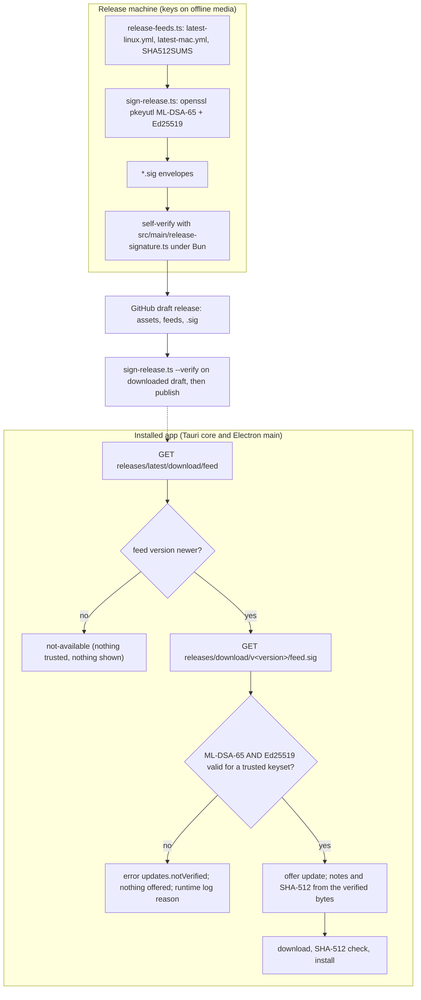

# Post-quantum cryptography for Sai ATLAS and omp: inventory, decisions and phased plan

**Research timestamp:** 2026-10-08, Asia/Seoul
**Scope:** the GUI repo `tung491/oh-my-pi-gui` (branch `pqc`, Tauri shell on Linux, Electron on macOS), its release, update and packaging chain, and the omp agent as compiled into the sidecar (monorepo at `/home/tung491/omp-monorepo`, HEAD `81b9f2507f`).
**Inputs:** the controller's evidence packet, the 2026-09-29 SAI OS PQC report (standards table §4, threat model §5, CVEs §12, Vietnam §15), the two repositories, primary web sources, and local measurements listed in §2.

> **Scope amendment, 2026-10-09 (user decision).** Electron, the macOS shell, is out of scope. The PQC work targets the Tauri shell only: Linux today, and macOS once it moves to Tauri. The body below is the verified report, kept as it was selected. Where it conflicts with this amendment, the amendment wins.
>
> - **Dropped:** the Electron verifier (`src/main/release-signature.ts`, the `src/main/updater.ts` wiring, the in-Electron CI test); signing `latest-mac.yml`; `src/shared/release-keys.ts`; the Electron guards in Phase 3 (vitest probe and Playwright `net.fetch` spec); the macOS migration and electron-builder 27 notes in §4.8; the Electron watch items in Phase 5; the CI Node-version question (unresolved question 5); appendix defects 4 and 9.
> - **Keys:** one data file on the Rust side holds each keyset's base64 SPKI. The Rust verifier embeds it with `include_str!`, and `scripts/sign-release.ts` reads it to refuse unknown keysets.
> - **Signed files:** `latest-linux.yml` and a `SHA512SUMS` that lists the Linux assets.
> - **Signing self-check:** `sign-release.ts` verifies each envelope with `openssl pkeyutl -verify` against those keys. `cargo test` proves that `aws-lc-rs` accepts OpenSSL-made signatures, using the fixtures, and that remains the first gate.
> - **Tests:** the new tests are Rust-only, in `src-tauri/src/updater/signature.rs`. `scripts/check-test-parity.ts` only requires a Rust twin for each TypeScript test, so `updater.parity.json` stays unchanged.
> - **i18n:** `UpdatesNotVerified` is a Rust-only key, added to `RUST_ONLY_KEYS` in `src-tauri/src/i18n.rs` like `MenuCheckForUpdates`. `src/main/i18n.ts` stays unchanged.
> - **Phases after the cut:** Phase 1 covers signed Linux releases with the Rust verifier. Phase 2 brings hybrid TLS to the Tauri core. Phase 3 keeps only the sidecar guard in `scripts/check-assistant-pack.ts`. Phase 4 makes the claims specific to Linux. Phase 5 gains one trigger: sign `latest-mac.yml` when macOS moves to Tauri.
> - **Consequence:** until macOS moves to the Tauri shell, Mac installs keep the current trust model, which is HTTPS from GitHub plus a SHA-512 from the feed.
>
> **Decisions, 2026-10-09 (user).** Release signing is approved. This knowingly reverses the 2026-10-02 reason "no signing keys need managing" (`plans/261002-1441-tauri-shell-migration/phase-08-updater-packaging-ci.md:19`); the decision to port the yml updater still stands. The signatures use ML-DSA-65 with Ed25519, which closes unresolved question 1. Later the same day the user chose to **sign in CI**, with the private keys stored as secrets of a protected GitHub environment, instead of offline signing (§4.5–4.6). The fingerprints are published only on GitHub, in the README and each release's notes. The user accepts that someone who takes over the GitHub account can then sign releases too. The user also accepted holding the Vietnamese claim for the written Decree 341 opinion and a 12-month dual-signing window, set release timing aside, and had every existing GitHub release of the repo (v0.9.16, v0.9.15) deleted with its tag.

## Table of contents

1. [Executive summary](#1-executive-summary)
2. [Method and evidence](#2-method-and-evidence)
3. [Inventory and verdicts](#3-inventory-and-verdicts)
4. [Update and release authenticity](#4-update-and-release-authenticity)
5. [Rust core TLS](#5-rust-core-tls)
6. [Regression guards for what is already hybrid](#6-regression-guards-for-what-is-already-hybrid)
7. [omp: is a change needed?](#7-omp-is-a-change-needed)
8. [Outside our control, and honest claims](#8-outside-our-control-and-honest-claims)
9. [Regulatory questions (Vietnam)](#9-regulatory-questions-vietnam)
10. [Phased roadmap](#10-phased-roadmap)
11. [Concrete next steps](#11-concrete-next-steps)
12. [Limitations of this research](#12-limitations-of-this-research)
13. [Unresolved questions](#13-unresolved-questions)
14. [Sources](#14-sources)

---

## 1. Executive summary

**Outcome.** Sai ATLAS needs exactly one substantial piece of post-quantum work: **a hybrid publisher signature on its release feeds, verified by both updaters before any update is offered.** Everything else is either already post-quantum hybrid, symmetric-only, carries no secret data, or is outside our control. **omp needs no change.**

**Why signatures come first, even though signature forgery needs a quantum computer at attack time.** Today there is no publisher signature at all. The Linux and macOS updaters trust whatever SHA-512 the release feed lists, so anyone who can change the release assets (a stolen GitHub token, a compromised maintainer account) can ship code to every install right now, with no quantum computer. A signature fixes that classical gap. Making it post-quantum from the start matters because the trust anchor is compiled into installed clients and can only be replaced by an update that the old anchor still accepts. The anchor must therefore be post-quantum years before a cryptographically relevant quantum computer exists, and the cheapest moment to do that is when the anchor is first introduced.

**Recommended design (ranked first of seven options in §4.1).**

- Sign the exact bytes of `latest-linux.yml`, `latest-mac.yml` and a new `SHA512SUMS` with **two independent signatures, both required: ML-DSA-65 (FIPS 204, pure mode, empty context) and Ed25519**. This is the "concatenation, all must verify" hybrid that BSI TR-02102-1 (2026-01) recommends for quantum-safe signatures, and the same algorithm pair that RFC 9980 makes mandatory for OpenPGP.
- Ship each signature pair in a small JSON envelope, `<file>.sig`, next to the file in the same GitHub release. The envelope can hold several keysets, which is how rotation works.
- Sign at release time with the **OpenSSL 3.5 CLI** (`openssl pkeyutl -sign -rawin`), which the maintainer's host already has (3.5.5). Keys live offline, never in CI.
- Verify in the **Tauri core with `aws-lc-rs` 1.18.1**, whose ML-DSA API became stable on 2026-08-07 and whose implementation is the CBMC-checked mldsa-native. Verify in the **Electron main process with built-in `node:crypto`**. Electron 44.4.5 verifies OpenSSL-made ML-DSA-65 and Ed25519 signatures and passed all 210 Wycheproof ML-DSA-65 verify vectors and all 151 Ed25519 vectors in this research. No new npm dependency is needed.
- Verify then trust. When the feed offers nothing newer, nothing is verified, because nothing is acted on. When it offers a newer version, a missing or invalid signature means **no update is offered** (fail closed), with one new main-process string in English and Vietnamese.

**Rust core TLS.** The Tauri core's only TLS traffic is the update check and download, which are public data, so post-quantum key exchange there protects nothing secret. Switch it anyway, as Phase 2, because it is a Cargo-only change once Phase 1 has added `aws-lc-rs`, and it lets the app say that all of its own TLS clients offer hybrid key exchange. A subtle trap was found: reqwest 0.13's `rustls` feature uses aws-lc-rs but does **not** turn on rustls's `prefer-post-quantum`, so it would still send an X25519 key share first. The fix is one feature flag plus a unit test that asserts `X25519MLKEM768` is the first group.

**Already hybrid, needs only a guard.** The Bun sidecar (measured inside the compiled `omp.linux-x64` binary) and the Electron main process both negotiate `X25519MLKEM768` by default and still fall back to classical servers. An offline loopback TLS server that accepts only `X25519MLKEM768` proves this without network access, and it works in all three runtimes (§6).

**What must not be claimed.** "Quantum-safe", "quantum-proof", "kháng lượng tử", "FIPS-validated" and "end-to-end post-quantum" must not be claimed. Apple code signing, `github.com`'s own TLS (still classical X25519), Ubuntu 24.04's system crypto, the Ollama installer and Ollama's model integrity are outside our control and stay classical or unsigned.

**Regulatory.** Hybrid TLS from upstream libraries raises no new question. Whether an app that embeds signature verification counts as a "civil cryptography product" under Decree 341/2026/NĐ-CP Annex I is **unresolved** and needs a written legal opinion before the product is marketed as post-quantum in Vietnam (§9).

---

## 2. Method and evidence

Code was read with `git grep` and direct reads in both repositories. Crate sources were downloaded from `static.crates.io` and read, versions were taken from the crates.io and npm registries, advisories from the RustSec advisory database and GitHub security advisories, and standards status from the IETF datatracker API and NIST CSRC. No `cargo`, `bun install`, build or packaging was run.

Measurements made in this research (host Ubuntu 26.04.1, OpenSSL 3.5.5, Bun 1.4.2, Electron 44.4.5 run with `ELECTRON_RUN_AS_NODE=1`, compiled sidecar `/home/tung491/omp-monorepo/packages/gui/resources/omp.linux-x64` built 2026-09-29):

| # | Measurement | Result |
|---|---|---|
| M1 | Electron 44.4.5 `node:crypto` key types | `ml-dsa-65` and `ml-dsa-87` generate, sign and verify; `slh-dsa-sha2-128s` is rejected as an unsupported key type; WebCrypto `ML-DSA-65` works with an "experimental" warning. `process.versions.openssl` is `0.0.0` (BoringSSL). |
| M2 | OpenSSL 3.5.5 → Electron 44.4.5 interop | An ML-DSA-65 signature from `openssl pkeyutl -sign -rawin` and an Ed25519 signature verify with `crypto.verify(null, data, spkiKey, sig)`; a one-byte change to the data fails; a signature made with a context string verifies only when the same context is passed. Raw 1,952-byte public keys import with `format: 'raw-public'`. |
| M3 | Bun 1.4.2 interop | Same results as M2, except that Bun rejects the `context` parameter ("Context parameter is unsupported"), and Bun cannot load OpenSSL 3.5's default ML-DSA private-key encoding (`PRIVATE_KEY_WAS_NOT_SEED`). |
| M4 | Wycheproof (C2SP, `testvectors_v1`, fetched 2026-10-08) | Electron 44.4.5: ML-DSA-65 verify 210/210, Ed25519 151/151. Bun 1.4.2: 203/203 ML-DSA-65 vectors without a context (7 context vectors skipped), Ed25519 151/151. |
| M5 | OpenSSL 3.5.5 key handling | ML-DSA-65 SPKI DER is 1,974 bytes (OID `2.16.840.1.101.3.4.3.18`); a signature is 3,309 bytes. `genpkey -aes-256-cbc` writes PBES2 with only 2,048 PBKDF2 iterations; `pkcs8 -topk8 -scrypt` writes scrypt (N=16384). Re-creating a key from its 32-byte seed with `-pkeyopt hexseed:` gives an identical public key. |
| M6 | Offline hybrid-only TLS server (`node:tls`, `ecdhCurve: 'X25519MLKEM768'`, TLS 1.3, loopback) | The default client succeeds and an X25519-only client fails with a handshake alert, in Bun 1.4.2, in Electron 44.4.5 (which reports `{"type":"TLSGroup","name":"X25519MLKEM768"}`) and **inside the compiled sidecar** via `BUN_BE_BUN=1`. The sidecar's `fetch` also still reaches an X25519-only server. |
| M7 | `src-tauri/Cargo.lock` | `reqwest 0.13.5` comes from `tauri 2.12.1`, whose Cargo.toml declares it only for `cfg(any(target_os = "android", iOS))`, so it is not compiled for Linux or macOS. `quinn` appears only through reqwest 0.12's weak `quinn?/ring` feature. `ring 0.17.14` is reached through `rustls`, `rustls-webpki` and `quinn-proto`. |

---

## 3. Inventory and verdicts

Two threats are kept apart throughout. **Harvest-now-decrypt-later (HNDL)** applies to key exchange that protects secret data recorded today. **Forgery** applies to signatures and TLS authentication and needs a quantum computer at the moment of attack. Classes: **PQ-hybrid**, **symmetric/hash-only** (Grover at most halves the security level), **classical, fixable by us**, **classical, outside our control**, and **N/A** (no cryptography or no network).

### 3.1 GUI repo

| Surface | What it does today | Class | Real threat | Verdict |
|---|---|---|---|---|
| Release authenticity (both updaters, manual downloads) | Feed lists base64 SHA-512 per asset; nothing signs the feed (`feed.rs`, `updater.ts`, `release-feeds.ts`). | **No signature at all** (classical gap today) | Anyone who can change release assets ships code now; with a future CRQC, forging any classical signature added later. | **Fix: Phase 1**, hybrid ML-DSA-65 + Ed25519 (§4). |
| SHA-512 of artifacts | `sha512_file_base64` / `sha512FileBase64` before install. | Hash-only | None (256-bit preimage resistance under Grover). | Keep. |
| Tauri core TLS (`reqwest 0.12.28`, `rustls 0.23.45` on `ring`, `webpki-roots 1.0.9`) | Update feed and package download over HTTPS. | Classical X25519, **fixable by us** | HNDL: nothing secret (public release files; SNI and sizes already leak which file). Forgery: needs a real-time CRQC MITM, and Phase 1 signatures make TLS authentication defence-in-depth only. | **Fix: Phase 2** (low benefit, low cost; §5). |
| Tauri core Ollama clients (`ollama/*.rs`) | Plain HTTP to loopback. | N/A | None off-machine. | No action. |
| Electron main updater (electron-updater 6.8.9 over `net`; DMG via `net.fetch`) | Feed check and DMG download. | **PQ-hybrid** client (controller measured `X25519MLKEM768` on 44.7.0) | As for the Tauri core. | Guard (Phase 3). |
| Electron main `node:https`/`node:tls` | Not used for remote traffic today. | PQ-hybrid (M6) | None. | Guard (Phase 3). |
| Electron proxy probe (`src/main/index.ts:206`) | `session.resolveProxy("https://chatgpt.com")` only evaluates proxy/PAC configuration; it opens no TLS connection to that host. | N/A (correction to packet §3) | None. | No action. |
| Webviews (WebKitGTK → GnuTLS 3.8.x; Electron renderer) | CSP `connect-src 'self'` in both shells (`tauri.conf.json`, `packaging-config.test.ts`). | N/A | None. | Keep the CSP tests. |
| macOS code signature | Ad-hoc (`identity: "-"`, `notarize: false`): a hash seal with no certificate. | Hash-only; no publisher identity | Gatekeeper authenticates no publisher today, classical or PQ. | Outside our control for PQ (§8); Phase 1 covers in-app updates. |
| Linux `.deb` / AppImage | Unsigned; apt reads the user-cached file (README TOCTOU note). | No signature | Covered for in-app updates by the signed feed; manual downloads by signed `SHA512SUMS`. The TOCTOU between the user-side check and root-side install is **not** changed by signatures. | Phase 1. |
| Linux "Install Ollama" remedy (`remedy.rs:27`) | Host `curl` → `ollama.com` (classical, measured) → `github.com` (classical) → release assets (hybrid). The script verifies no checksum or signature (0 matches in the 455-line `install.sh` fetched 2026-10-08). | Classical, **outside our control** | No secret data; integrity rests on classical TLS authentication (real-time quantum MITM only). | Document (§8). |
| Build and CI | Actions pinned by commit SHA; `bun install --frozen-lockfile` with SHA-512 integrity; `registry.npmjs.org` is TLS 1.2 classical (measured); the Dockerfile fetches the Bun installer, rustup and the `cargo-tauri` tarball with no pinned checksum. | Hash-only plus classical TLS, mostly outside our control | Integrity of unpinned downloads rests on classical TLS authentication during the build (real-time quantum attacker only). | No PQC action required. Pinning SHA-256 of downloaded tools would remove the classical dependency; optional, low priority. |
| Release publishing (`gh` uploads to `github.com`) | Classical TLS, token auth. | Classical, outside our control | HNDL of a short-lived token is negligible. GitHub's SSH endpoint has offered `sntrup761x25519-sha512` since 2025-09-17, so `git` over SSH is already hybrid if wanted. | Note only. |
| Settings, sessions, stdio IPC | Unencrypted local files; stdio JSON. | N/A | Local only. | No action. |
| Public site (`site/`, GitHub Pages) | `tung491.github.io` hybrid; the page reads `api.github.com` (classical) from the visitor's browser. | Outside our control | Public data. | No action. |
| Docs and claims | README/site make no PQ claims today (grep for quantum/PQC/ML-KEM found none). | — | Risk is over-claiming later. | Phase 4 wording (§8.2). |

### 3.2 omp (as shipped in the sidecar, plus features reachable without the pack's restrictions)

The packet's claim that omp has no app-level asymmetric key exchange or signing was **verified with one refinement**: the only asymmetric operations are provider-mandated RS256 signing for Google service accounts, Apple DeviceCheck tokens (macOS, native), and the WebRTC DTLS handshake inside the native voice engine. No omp TypeScript sets `ecdhCurve`; it sets only `ciphers` (`anthropic.ts:1269`, `cowork-fetch.ts:86`), which does not affect key-exchange groups.

| Surface | Primitive | Reachable in Sai ATLAS? | Class | Verdict |
|---|---|---|---|---|
| Sidecar transport (Bun `fetch`, WebSocket, `node:tls`; BoringSSL) | `X25519MLKEM768` by default (M6 inside the compiled binary) | No off-machine traffic in pack sessions (egress audit 2026-10-07) | **PQ-hybrid** | Guard (Phase 3). |
| Provider APIs (Anthropic, OpenAI, Google) | Hybrid on the server side (packet §5) | No (`modelPolicy.localOnly`) | PQ-hybrid | None. |
| Collab live sessions (`collab/crypto.ts`) | AES-256-GCM; 32-byte room key only in the link fragment; relay over `wss://` | No (no UI caller of `collabStart`/`collabJoin`) | Symmetric-only | None. The HNDL exposure is whatever channel the user pastes the link into, not omp. |
| Share links (`export/share.ts`) | gzip + AES-256-GCM, key in the fragment | No (no UI caller of `shareSession`) | Symmetric-only | None. |
| Auth-broker snapshot cache | AES-256-GCM, key = SHA-256(token) | No | Symmetric/hash | None. |
| Secrets, tokens, PKCE, SigV4, HMAC uploaders | CSPRNG, SHA-256, HMAC-SHA256/SHA-1 | No | Symmetric/hash | None. |
| Google service-account auth | RS256 JWT (`google-auth.ts`) | No | Classical, outside our control (Google's protocol) | None; forgery needs a real-time CRQC. |
| SSH capability | System OpenSSH: 9.6p1 on Ubuntu 24.04 defaults to `sntrup761x25519-sha512`, 10.x defaults to `mlkem768x25519-sha256` | No (tool not loaded) | Hybrid KEX by default; host keys classical | Outside our control; none. |
| Codex live voice (`pi-voice` → `webrtc` 0.17.2 → `dtls` 0.17.2, `x25519-dalek`) | DTLS 1.2 ECDHE | No (needs OpenAI OAuth) | Classical, outside our control (upstream webrtc-rs) | Note: voice audio would be HNDL-exposed if a user ran it outside the pack. |
| Codex attestation | Apple DeviceCheck (native) | No (macOS, cloud provider) | Outside our control | None. |
| npm self-update, plugins, natives download | `registry.npmjs.org` TLS 1.2 classical; SHA-512 integrity | Removed from the GUI (egress audit) | Classical, outside our control | None. |

---

## 4. Update and release authenticity

### 4.1 Options and ranking

| Rank | Option | PQ | Verifier dependencies | Signing tool | Manual check | Standardised format | Complexity |
|---|---|---|---|---|---|---|---|
| **1** | **Hybrid ML-DSA-65 + Ed25519, both required; raw detached signatures in a JSON envelope over the feeds and `SHA512SUMS`** | Yes, hedged | `aws-lc-rs` (already needed for Phase 2); Electron built-in | OpenSSL ≥ 3.5.5 CLI | OpenSSL ≥ 3.5 (Ed25519 half on any OpenSSL) | Algorithms and key encodings yes (FIPS 204, RFC 8032, RFC 9881); envelope is ours | Low |
| 2 | ML-DSA-65 only, same envelope | Yes | Same | Same | Same | Same | Lowest |
| 3 | SLH-DSA-SHA2-128s only (BSI allows hash-based alone) | Yes, most conservative | Not in BoringSSL (M1) or aws-lc-rs → `@noble/post-quantum` plus RustCrypto `slh-dsa` | OpenSSL 3.5 | OpenSSL 3.5 | FIPS 205 | Medium |
| 4 | CMS detached `.p7s` (RFC 9882), as the SAI OS report uses for ISOs | Yes | A CMS parser in both apps; AWS-LC had two `PKCS7_verify` bypasses in 2026 (RUSTSEC-2026-0046/0047) | OpenSSL 3.5 | OpenSSL 3.5 | Yes | High |
| 5 | OpenPGP RFC 9980 composite ML-DSA-65+Ed25519 | Yes | `sequoia-openpgp` (LGPL-2.0+, heavy); no OpenPGP in BoringSSL | `sq` | `sq`/`sqv` (not PQ in Debian 13 per the SAI OS report) | Yes | High |
| 6 | electron-builder 27 signed manifests (Ed25519, embedded `signatures` list) | **No** | electron-updater 7 only; Rust would reimplement its canonical form | electron-builder | None | Tool-specific | Medium; 27.0.0 is still alpha (`next` = 27.0.0-alpha.9) |
| 7 | minisign / tauri-plugin-updater | **No** | Plugin's own feed format, incompatible with 0.9.x clients' electron-builder feeds | minisign | minisign | Tool-specific | Medium |

**Why hybrid over ML-DSA alone.** ML-DSA verifiers are young. `libcrux-ml-dsa` had four advisories in 2026, including an AVX2 `use_hint` edge case that accepted signatures it should reject (RUSTSEC-2026-0125, found through new Wycheproof vectors) and an incorrect norm check during verification (RUSTSEC-2026-0077). RustCrypto `ml-dsa` had a signing timing leak (RUSTSEC-2025-0144). `@noble/post-quantum` states it "has not been independently audited yet". Requiring an Ed25519 signature as well means an attacker needs to break both, and the cost is one more 32-byte key and about twenty lines per verifier. BSI TR-02102-1 (version 2026-01, §5.3.4) recommends exactly this: quantum-safe signatures "only in combination with a classic signature scheme", with concatenation where all signatures must be valid, and key material dedicated to the hybrid use. This differs from NIST and NSA, which accept pure ML-DSA, and the difference is explained by implementation risk rather than by doubts about the algorithm.

**Why ML-DSA-65 and not ML-DSA-87.** Category 3 is ample, and ML-DSA-65+Ed25519 is the pair RFC 9980 makes mandatory. The SAI OS report pins ML-DSA-87 for the OS release root (CNSA 2.0 alignment). If VIF wants one level across products, switching is a constant change (signature 4,627 bytes instead of 3,309; Electron, aws-lc-rs and OpenSSL all support ML-DSA-87). This is listed as an unresolved question.

**Why not composite signatures.** `draft-ietf-lamps-pq-composite-sigs` is in the RFC Editor queue (rev 19, 2026-10-02), and none of OpenSSL 3.5, BoringSSL in Electron or aws-lc-rs 1.18 exposes it (**unverified** for AWS-LC internals). Two independent signatures give the same AND-security with tooling that exists now. The envelope's `version` field allows a later move.

### 4.2 What is signed, and why not each artifact

The signed files are `latest-linux.yml`, `latest-mac.yml` and `SHA512SUMS`, each as exact bytes, with signatures in `latest-linux.yml.sig`, `latest-mac.yml.sig` and `SHA512SUMS.sig`.

- **The feeds** bind version, file names, sizes, SHA-512 values, `minimumSystemVersion` and release notes in one signature. Signing artifacts alone would leave a downgrade hole: an attacker could publish a feed claiming version 9.9.9 that points at an old, correctly signed AppImage or DMG. apt refuses that downgrade with `-y`, but the AppImage swap and the macOS Finder hand-off would not. Signing the raw bytes also authenticates the release-notes excerpt the banner shows.
- **`SHA512SUMS`** (hex, `sha512sum -c` format, every published asset including both feeds) serves people who download by hand. `release-feeds.ts` already hashes every file, so it writes this file from the same digests.
- **Small files only.** CVE-2025-15469 (OpenSSL, Low, 2026-01-27) showed that `openssl dgst` silently truncated one-shot ML-DSA/Ed25519 input above 16 MB before 3.5.5. Signing small manifests with `pkeyutl -rawin` avoids that class entirely; still require OpenSSL ≥ 3.5.5.

### 4.3 Key and signature formats

- **Private keys:** OpenSSL PKCS#8 (RFC 9881 for ML-DSA, RFC 8410 for Ed25519), one ML-DSA-65 and one Ed25519 key per keyset, used for nothing else (BSI's separation rule).
- **Public keys:** base64 SPKI DER, compiled into both apps from one source file, `src/shared/release-keys.ts`. The Rust core mirrors it, with a test that reads the TypeScript file through `include_str!`, the pattern `product.rs` already uses for `product.ts`. Both `aws-lc-rs` and `node:crypto` accept SPKI DER for both algorithms (read in `aws-lc-rs` 1.18.1 `pqdsa.rs` and `ed25519.rs`; M2).
- **Envelope** (`<file>.sig`, UTF-8 JSON, at most 64 KiB):

```json
{
  "format": "sai-atlas-release-signature",
  "version": 1,
  "signatures": [
    { "keyId": "2026a", "mlDsa65": "<base64 of 3309 bytes>", "ed25519": "<base64 of 64 bytes>" }
  ]
}
```

- **Acceptance rule (identical in Rust and TypeScript):** the file is authentic if and only if at least one entry names a trusted `keyId` and **both** its ML-DSA-65 signature (pure, empty context) and its Ed25519 signature verify over the exact file bytes with that keyset's public keys. Entries with unknown key ids are skipped, unknown JSON properties are ignored (room for a future algorithm), and wrong lengths, bad base64 or an oversized file reject.
- **Empty context is deliberate.** aws-lc-rs supports only the empty context, and Bun rejects the parameter (M3). Domain separation comes from keys dedicated to this purpose.

### 4.4 Libraries

| Runtime | Choice (rank) | Version, date | Maturity and assurance | Advisories in the last 18 months | Adoption risk |
|---|---|---|---|---|---|
| Rust (Tauri core) | **`aws-lc-rs` (1)** | 1.18.1, 2026-09-01; `aws-lc-sys` 0.45.0 | ML-DSA API stable since 1.18.0 (2026-08-07), "pure" mode, empty context, raw or SPKI keys. AWS-LC's ML-DSA is imported from mldsa-native (CBMC proofs of memory and type safety for the C code, HOL-Light proofs for some assembly) and is tested against Wycheproof `mldsa_65_verify_test`. FIPS 4.0 module includes ML-DSA (the non-FIPS build is used here, so no FIPS claim). | `aws-lc-sys` RUSTSEC-2026-0044 to 0048 (X.509 name constraints, AES-CCM timing, two PKCS7 bypasses, CRL scope); all fixed by 0.39, none in code paths used here. | Low abandonment risk (AWS, ~250 M downloads). API churn is real: 1.18.0 renamed `to_pkcs8`. Adds a C build (§5.3). |
| Rust | `ml-dsa` 0.1.1 + `ed25519-dalek` 3.0.0 (2) | 2026-06-05; 2026-07-06 | Pure Rust, first stable `ml-dsa` release in May 2026. No independent audit found (**unverified**). | RUSTSEC-2025-0144 (signing timing; does not affect verification). | Reasonable fallback if a C dependency must be avoided. |
| Rust | `libcrux-ml-dsa` 0.0.11 (3, reject now) | 2026-10-07 | Formal-verification goals, pre-1.0. | Four in 2026, two of them verification-correctness bugs. | Revisit after 1.0. `fips204` 0.4.6 is rejected: no release since 2024-12. |
| TypeScript (Electron main) | **`node:crypto` in Electron 44 (1)** | Node 24.21.0 / BoringSSL in Electron 44.4.5 | Node added ML-DSA keys and signing in v24.6.0 and the context parameter in v24.8.0. Measured M1, M2, M4. | No BoringSSL ML-DSA advisory found in this research. | Electron does not document ML-DSA under BoringSSL (**unverified** as a commitment); an Electron upgrade could regress it, so Phase 1 adds a test that runs the verifier inside the installed Electron binary. |
| TypeScript | `@noble/post-quantum` 0.7.1 + `@noble/curves` 2.4.0 (2, fallback) | 2026-08-27 | Pure JS, ACVP and Wycheproof tests; self-audited at 0.6.1; "not independently audited yet". | No GitHub security advisories. | Use only if a future Electron drops ML-DSA. |

### 4.5 Release-time signing

Order matters because the signature covers final bytes: build → finalize scripts → `bun scripts/release-feeds.ts` (now also writing `SHA512SUMS`) → `bun run check:mac-update-floor` → **`bun scripts/sign-release.ts`** → draft release upload → verify the uploaded draft → publish.

`scripts/sign-release.ts --keys <offline dir> --keyset 2026a dist-release/` does four things:

1. It refuses OpenSSL older than 3.5.5 and a keyset that is not in `RELEASE_KEYS`, so it can never publish signatures the shipped clients cannot verify.
2. For each of the three files it runs:

```bash
openssl pkeyutl -sign -rawin -inkey "$KEYS/2026a-mldsa65.key" -in latest-linux.yml -out mldsa.bin
openssl pkeyutl -sign -rawin -inkey "$KEYS/2026a-ed25519.key"  -in latest-linux.yml -out ed25519.bin
```

3. It writes the envelope `latest-linux.yml.sig`.
4. It re-verifies every envelope by importing `src/main/release-signature.ts` under Bun, whose `node:crypto` verifies ML-DSA without a context (M3, M4). The app's own verification code therefore checks every signature before upload. `--verify <dir>` runs only this step, against the assets downloaded back from the draft release with `gh release download`.

Signing stays in OpenSSL rather than Bun because OpenSSL handles the encrypted key files and Bun cannot load OpenSSL's default ML-DSA private-key encoding (M3).

### 4.6 Key lifecycle

| Step | Recommendation |
|---|---|
| Generation | On the release machine with networking off, OpenSSL ≥ 3.5.5, `umask 077`. Generate **two keysets at once**: `2026a` (current) and `2026b` (next, never used until needed). `openssl genpkey -algorithm ML-DSA-65 -out 2026a-mldsa65.key`; `openssl genpkey -algorithm ED25519 -out 2026a-ed25519.key`; export each public key with `openssl pkey -pubout -outform DER \| base64 -w0`. |
| Trust list | Every release trusts `[2026a, 2026b]`. This is also electron-builder's documented steady state ("always trust the next key"), an independent design that converges on the same approach. |
| Custody | Private keys stay on LUKS-encrypted removable media, mounted only while signing; never in GitHub secrets, CI or the repo. The current and next keysets live on different media. If PKCS#8 encryption is used as well, re-wrap with `openssl pkcs8 -topk8 -scrypt`, because `genpkey`'s default PBKDF2 uses only 2,048 iterations (M5). No affordable hardware token with ML-DSA support was confirmed (**unverified**). |
| Backup | Two copies of each medium in two places. A paper backup of the 32-byte seeds is possible: `openssl pkey -text` prints the ML-DSA seed, and `openssl genpkey -algorithm ML-DSA-65 -pkeyopt hexseed:<64 hex>` restores the identical key (M5). Ed25519 restores from its 32-byte private key with the RFC 8410 PKCS#8 prefix. |
| Out-of-band anchor | Publish the SHA-256 fingerprint of each SPKI in README (both languages) and on the site, and, if VIF agrees, in the SAI OS `sai-archive-keyring` package the SAI OS report proposes. |
| Rotation | Planned: promote `2026b` to signer, add a new next keyset, and keep dual-signing (both entries in each envelope) for one support window. On algorithm change (for example a Vietnamese national standard under Decision 125/QĐ-TTg): add the new algorithm's field to new keysets; old keysets keep working. |
| Revocation | No online revocation list (it would need its own signed, fresh feed). A keyset is revoked by a release that drops it from `RELEASE_KEYS`; installs that took that release reject it from then on. |
| Compromise | First lock down publishing credentials (GitHub tokens, sessions). Sign the next release with `2026b` only, drop `2026a`, add a new next keyset, and tell users. Until an install updates, an attacker holding `2026a` **and** able to serve assets (GitHub access or a TLS MITM) can still push a "newer" version to it; the no-downgrade rule limits only rollbacks. |
| Loss | Losing `2026a` alone means promoting `2026b`. Losing both means every verifying install stops updating and needs a manual reinstall; the README must say so. |

### 4.7 Client behaviour, fail-closed UX and i18n



- **Tauri core.** `fetch_feed` returns the raw bytes and the parsed `Feed`. After `is_newer`, the core fetches `download_url(base, version, "latest-linux.yml.sig")` and calls `signature::verify(feed_bytes, envelope, RELEASE_KEYS)`. Only then does it select the asset. The feed is not fetched twice, and the signature comes from the release the feed names, so a "latest" switch between requests cannot cause a mismatch.
- **Electron main.** `update-available` gives only electron-updater's parsed `UpdateInfo`. Before broadcasting `available`, the handler fetches `RELEASE_DOWNLOAD_BASE + v<info.version>/latest-mac.yml` and its `.sig` with `net.fetch`, verifies them, parses the verified bytes with `yaml` (already a bundled runtime dependency in `MAIN_BUNDLED_DEPS`), requires the verified `version` to equal `info.version`, and passes the verified `files` to `selectMacInstaller`. For certificate-signed builds that use Squirrel, it additionally requires the verified ZIP entry's SHA-512 to equal electron-updater's before `downloadUpdate()`.
- **Not newer means no verification.** An unauthenticated "nothing newer" is no worse than an attacker blocking the network. It also keeps the packaged smoke test (`e2e-tauri/packaged-smoke.e2e.ts`, which checks the live feed of the previous, unsigned release) green for the first signing release.
- **Fail closed.** There is no "install anyway", no environment override and no fallback to the SHA-512-only path. Passive checks follow the existing pattern (`show_in_banner: false`); an explicit Settings › Updates check shows the message. The runtime log records the reason (`missing`, `malformed`, `untrusted key`, `bad signature`).
- **One new main-process string**, added to `src/main/i18n.ts` and mirrored in `src-tauri/src/i18n.rs` (`MainTextKey::UpdatesNotVerified`; the existing mirror test enforces both). No renderer locale change is needed, because the message travels in the status.
  - en: "This update could not be verified, so Sai ATLAS did not offer it. Download Sai ATLAS from the releases page instead."
  - vi: "Không xác minh được bản cập nhật này nên Sai ATLAS không đề xuất cài đặt. Hãy tải Sai ATLAS từ trang phát hành."

### 4.8 Migration for installed clients

- **0.9.x Electron clients (macOS and older Linux) and the installed 0.9.16 Tauri build do not verify.** The feed format does not change, and the extra `.sig` and `SHA512SUMS` assets are ignored, so they keep updating through the SHA-512 path. The `omp-` bridge DMGs and `minimumSystemVersion: 22.0.0` stay as they are, and the combined `latest-mac.yml` is signed as a whole.
- **The first verifying release is itself installed unauthenticated** by those clients. This bootstrap cannot be avoided; electron-builder's own documentation states the same limit ("full protection arrives one release after adoption"). Shorten the window by shipping Phase 1 soon, and let careful users verify that release by hand (§4.9).
- **A release without `.sig` files breaks updates for every verifying install**, just as a missing `latest-mac.yml` does today. Add it to AGENTS.md's release-flow rules and to README Release process step 7.
- **electron-builder 27** (alpha today) will refuse to publish manifests without an Ed25519 key unless `updateManifest: false`. When the repo upgrades, either set `updateManifest: false` (the hybrid signature stays the single authority, which is the DRY choice) or keep its Ed25519 signature as an extra classical layer. Decide at upgrade time.

### 4.9 Manual-download verification

README (both languages) gains a short "Verify a download" section with the keyset fingerprints, the PEM blocks for the current keyset (a test checks that they match `src/shared/release-keys.ts`), and:

```bash
python3 - <<'EOF'
import base64, json
e = json.load(open("SHA512SUMS.sig"))["signatures"][0]
open("SHA512SUMS.mldsa65", "wb").write(base64.b64decode(e["mlDsa65"]))
open("SHA512SUMS.ed25519", "wb").write(base64.b64decode(e["ed25519"]))
EOF
openssl pkeyutl -verify -rawin -pubin -inkey sai-atlas-2026a-mldsa65.pem -in SHA512SUMS -sigfile SHA512SUMS.mldsa65
openssl pkeyutl -verify -rawin -pubin -inkey sai-atlas-2026a-ed25519.pem -in SHA512SUMS -sigfile SHA512SUMS.ed25519
sha512sum -c --ignore-missing SHA512SUMS
```

The ML-DSA half needs OpenSSL ≥ 3.5: Debian 13 / SAI OS and Ubuntu 26.04 (3.5.5) have it, Ubuntu 24.04 (3.0.13) does not. On 24.04 only the Ed25519 half can be checked, which gives classical assurance; the README must say this plainly. On macOS (LibreSSL), use Homebrew OpenSSL ≥ 3.5 or Node ≥ 24.6.

### 4.10 Tests

- **Shared fixtures** in `src-tauri/tests/fixtures/release-signature/`: two throwaway keysets' public keys, a sample feed, and envelopes made once with OpenSSL 3.5.5 (valid, tampered feed, ML-DSA-only valid, Ed25519-only valid, unknown key, two entries for rotation). The private keys are discarded, so none is committed. Vendor Wycheproof `mldsa_65_verify_test.json` and `ed25519_test.json` (Apache-2.0, about 1.8 MB together).
- **Same test names in both suites:** `src/main/release-signature.test.ts` and `src-tauri/src/updater/signature.rs`, registered in `src-tauri/contracts/updater.parity.json` so `scripts/check-test-parity.ts updater` enforces the twins. Cases: accepts a trusted keyset; rejects when either signature fails; rejects an unknown key id; rejects a malformed or oversized envelope; accepts either trusted keyset during rotation; passes the Wycheproof ML-DSA-65 vectors without a context; passes the Wycheproof Ed25519 vectors; the production keys exclude the fixture keys; the Rust key list mirrors `release-keys.ts`.
- **Shipped-runtime check:** a vitest case runs the fixture verification inside the installed Electron binary with `ELECTRON_RUN_AS_NODE=1`, so an Electron upgrade that loses ML-DSA fails CI rather than every Mac's updater. CI's `linux` job already installs Electron. vitest itself runs under the runner's Node (`bunx` honours the `node` shebang; **unverified on CI**), and ML-DSA needs Node ≥ 24.6, so pin Node 24 with a SHA-pinned `actions/setup-node`.
- **Updater flow** (Rust `mod.rs` tests and their Electron twins where the parity map requires them): newer feed with a valid signature → available; newer feed with a missing or bad signature → error, never available; feed not newer → not-available with no signature request; the asset hash comes from the verified bytes.
- **Release check:** `scripts/sign-release.ts --verify` on the downloaded draft before publishing.
- Keep `cargo clippy -D warnings`, `cargo test`, test parity and API snapshots green. The new module stays `pub(crate)`, so `updater.api.txt` should not change.

---

## 5. Rust core TLS

### 5.1 Honest benefit

The Tauri core sends nothing secret over TLS. Its only HTTPS traffic is the update feed and the package download, both public. The first hop, `github.com`, negotiates classical X25519 whatever the client offers (packet §5), and Phase 1 signatures make TLS authentication defence-in-depth rather than the integrity mechanism. The benefit is therefore consistency and hygiene, not confidentiality: one statement ("every TLS client in the app offers hybrid key exchange"), readiness if the core ever carries private data, and one crypto library (AWS-LC) instead of two once `ring` drops out. The cost is low only because Phase 1 already brings `aws-lc-rs` in. Without Phase 1, doing nothing would rank above it.

### 5.2 Options and the exact change

| Rank | Option | Code change | Roots | PQ-first guaranteed by | Risk |
|---|---|---|---|---|---|
| **1** | **reqwest 0.13.5 `rustls` feature (aws-lc-rs + `rustls-platform-verifier`) plus a direct `rustls` dependency that enables `prefer-post-quantum`** | Cargo only, plus two tests | OS store (Linux: system CA bundle via `rustls-native-certs`/`openssl-probe`; macOS: Security.framework) | Feature unification on the single `rustls` crate, asserted by a test | 0.12 → 0.13 migration (no `.query()`/`.form()` use found; compile is **unverified**) |
| 2 | reqwest 0.13.5 or 0.12.28 with `rustls-no-provider` and one shared builder that passes an explicit `rustls::ClientConfig` (explicit kx order, `webpki-roots`) through `tls_backend_preconfigured` / `use_preconfigured_tls` | A helper plus replacing six `reqwest::Client::new()` sites | Static Mozilla roots, as today | Code | More code; every client must use the helper or reqwest panics ("No provider set") |
| 3 | Leave `ring` and X25519 | None | As today | — | None, but an inconsistent claim |
| 4 | reqwest 0.12.28 + `aws_lc_rs::default_provider().install_default()` at startup | One line in `main` | As today | Global state | Ordering hazard; unit tests that build clients without `main` panic |

Two source facts drive this ranking. reqwest 0.12.28 uses `CryptoProvider::get_default()` and otherwise falls back to `ring` (`async_impl/client.rs:763-771`), so adding aws-lc-rs alone changes nothing. reqwest 0.13.5's `rustls` feature enables `rustls?/aws-lc-rs` but its `rustls` dependency is declared with only `std` and `tls12`, and rustls 0.23.45 puts `X25519MLKEM768` first in `DEFAULT_KX_GROUPS` only under `prefer-post-quantum` (`crypto/aws_lc_rs/mod.rs:247-255`). Because rustls sends a key share for the first group only (`client/tls13.rs:310-331`), plain reqwest 0.13 would still open with X25519. The reqwest 0.12 line also has had no release since 0.12.28 (2025-12-22).

Recommended `src-tauri/Cargo.toml` change:

```toml
reqwest = { version = "0.13.5", default-features = false, features = ["json", "stream", "rustls"] }
# Only to turn on rustls's prefer-post-quantum (X25519MLKEM768 first) for the one rustls in the binary.
rustls = { version = "0.23.45", default-features = false, features = ["aws_lc_rs", "prefer-post-quantum", "std", "tls12"] }
# Phase 1 already adds this for ML-DSA/Ed25519 verification; rustls resolves to the same copy.
aws-lc-rs = "1.18.1"

[dev-dependencies]
rcgen = { version = "0.14.10", default-features = false, features = ["aws_lc_rs"] }   # exact features: confirm when implementing
```

`tauri`'s own `reqwest 0.13.5` stays mobile-only (M7) and needs nothing. Acceptance includes `cargo tree -i ring` returning nothing and `cargo tree -i aws-lc-rs` showing one version; ring's disappearance is inferred from the lockfile, not run (**unverified**).

### 5.3 Build impact

- **Toolchain.** `aws-lc-sys` 0.45.0 picks its `cc` builder when pregenerated bindings exist, which they do for `x86_64-unknown-linux-gnu` and both Apple targets (`builder/main.rs:532-576`), so it needs only the C compiler from `build-essential`. No CMake, Go or NASM is needed on Linux; `prebuilt-nasm` matters only on Windows. The `ubuntu:24.04` Dockerfile and CI's `tauri-linux` job already install `build-essential`, so neither changes.
- **glibc floor.** AWS-LC is linked statically and compiled inside the 24.04 container against glibc 2.39, so `glibc-floor.ts` keeps passing. `finalize-deb.ts`'s exact `Depends` does not change, because nothing new is dynamically linked.
- **Size and time.** Expect a few MB more in the binary and a slower clean build while AWS-LC's C sources compile (**unverified**; measure the `.deb` size delta and the clean-build time in Phase 2). Against a ~178 MB `.deb` that carries a ~285 MB uncompressed sidecar, this is noise.
- **Trust-store change.** With option 1 the core trusts the OS CA store instead of compiled-in `webpki-roots`. Enterprise TLS-inspection roots then work, and with signed feeds such a proxy cannot alter an update. An AppImage on a host without a CA bundle would fail its update check, but stock Ubuntu desktops have one.

### 5.4 Offline verification in a test

Add two Rust tests, no network. The first asserts `rustls::crypto::aws_lc_rs::default_provider().kx_groups[0].name() == NamedGroup::X25519MLKEM768`; this is the provider reqwest 0.13 falls back to (`default_rustls_crypto_provider`) when none is installed, so the test catches feature unification ever regressing. The second performs an in-memory handshake between a `rustls::ClientConnection` built from that default provider plus an `rcgen` test root and a `ServerConnection` whose provider lists only `X25519MLKEM768`. It asserts `negotiated_key_exchange_group()` is `X25519MLKEM768`, and repeats against an X25519-only server to prove the classical fallback `github.com` needs. An `#[ignore]` live test against `https://pq.cloudflareresearch.com/cdn-cgi/trace` expecting `kex=X25519MLKEM768` can serve as an optional release-smoke step.

---

## 6. Regression guards for what is already hybrid

All three guards reuse one probe script (DRY), for example `scripts/pq-tls-probe.cjs`. It generates a throwaway P-256 certificate with the `openssl` CLI (3.0 is enough), starts a loopback `node:tls` server with `ecdhCurve: "X25519MLKEM768"` and `minVersion: "TLSv1.3"`, and checks three things: default `tls.connect` succeeds, default `fetch` succeeds, and a control client forced to `X25519` **fails**, which proves the server really refuses classical groups (M6).

| Runtime | Where the guard runs | How |
|---|---|---|
| Bun sidecar (exact shipped binary) | `scripts/check-assistant-pack.ts <sidecar>`, the existing release gate that already executes the sidecar | `BUN_BE_BUN=1 <sidecar> scripts/pq-tls-probe.cjs` runs the probe inside the sidecar's embedded runtime (M6). This catches a Bun upgrade that changes default groups, the case `build:omp` cannot catch. |
| Electron main, Node stack (`node:tls`, `node:https`, `fetch`) | GUI vitest (CI `linux` job, which installs Electron) | Spawn the installed Electron with `ELECTRON_RUN_AS_NODE=1` running the same probe, and also assert `getEphemeralKeyInfo().name === "X25519MLKEM768"`. |
| Electron main, Chromium stack (`net.fetch`, used by electron-updater and the DMG download) | Playwright Electron e2e (`e2e/`), run locally on the virtual display and in release smoke | `electronApp.evaluate` with `session.setCertificateVerifyProc` accepting only the test certificate on `127.0.0.1`, then `net.fetch` to a hybrid-only server started by the test (host Node 26 can start one; M6 used Node 26.8.2). |
| Tauri core | `cargo test` (§5.4) | In-memory rustls handshake. |

The guards are offline and deterministic, so they belong in tests and the sidecar gate rather than in a network smoke test.

---

## 7. omp: is a change needed?

**No.** Evidence:

- In Sai ATLAS the sidecar makes no off-machine connection (egress audit, 2026-10-07). Its transport is Bun's BoringSSL, which offers `X25519MLKEM768` by default, measured inside the shipped binary (M6), and no omp code overrides key-exchange groups (§3.2).
- omp's own cryptography is symmetric or hash-based (AES-256-GCM with 256-bit keys, SHA-256, HMAC, CSPRNG tokens) or provider-mandated classical signing (Google RS256), which omp cannot change.
- The classical pieces that do exist (WebRTC DTLS in `pi-voice`, npm's TLS 1.2, Google's RS256, SSH host keys) belong to upstream projects or services, and none is reachable in pack sessions.
- Therefore no `patches/omp/*.patch`, no fork commit and no upstream proposal is needed. The Phase 3 sidecar guard is GUI-repo code that only runs the sidecar.

**What would change this answer:**

- an omp feature that exchanges or signs with asymmetric keys, for example public-key collab invites, signed skills, extensions or plugins, a sync service, or a remote auth-broker handshake;
- omp pinning TLS groups (`ecdhCurve`), or a Bun release whose defaults drop hybrid groups (the sidecar guard catches this);
- the pack enabling a cloud provider, `/collab`, share links or live voice. Voice would then expose audio to HNDL through webrtc-rs DTLS 1.2, and that would be an upstream issue for webrtc-rs and can1357/oh-my-pi, not a GUI patch.

---

## 8. Outside our control, and honest claims

### 8.1 Items we cannot fix

| Item | State (as of 2026-10-08) | What we do |
|---|---|---|
| Apple code signing and notarization | Builds are ad-hoc signed and not notarized. Apple's Developer ID PKI is classical (**unverified** for 2026 changes). | Nothing for PQ. In-app updates are covered by Phase 1. |
| `github.com` TLS | Classical X25519 (packet §5); GitHub's PQ work covers SSH only, and its own post says it "doesn't impact HTTPS access at all". Release assets and Pages are hybrid. | State it plainly. Moving hosting is not justified, because Phase 1 makes the feed's integrity independent of TLS. |
| Ubuntu 24.04 system crypto | OpenSSL 3.0.13 (no ML-KEM/ML-DSA), GnuTLS 3.8.3, curl 8.5.0; OpenSSH 9.6p1 is hybrid (sntrup761). Ubuntu 26.04 has OpenSSL 3.5.5. | Affects only the Ollama installer's `curl` and manual ML-DSA verification (§4.9). |
| Ollama's TLS and model integrity | Ollama is built with Go 1.26, whose `crypto/tls` enables `X25519MLKEM768` by default (since Go 1.24); `registry.ollama.ai` and `hf.co` negotiate it. Blobs are checked against SHA-256 digests (`verifyBlob`, `errDigestMismatch`), but manifests are unsigned. | Not our feature. Do not present it as Sai ATLAS security. |
| `curl \| sh` Ollama installer | `ollama.com` is classical; the script downloads from `ollama.com/download` (redirected to GitHub releases) and verifies no checksum or signature. | Document it next to the "Install Ollama" remedy. A pinned hash is impossible because Ollama versions move. |

### 8.2 Claims, wording and where they live

**Where.** The repo has no docs tree, only `docs/screenshots/`, so do not create one. Put user-facing text in **README.md and README.vi.md**, in Install & start next to the existing SHA-512/TOCTOU paragraph, plus the "Verify a download" subsection. Put maintainer steps (signing, custody, rotation) in **README → Release process** and the release-flow bullet of **AGENTS.md**. The site needs no change, because it shows only version and links.

**May be claimed, after Phases 1 and 2 ship:**

- en: "Before Sai ATLAS offers an update, it checks two signatures on the release: ML-DSA-65, the post-quantum signature standardised by NIST in FIPS 204, and Ed25519. An update that fails either check is not offered. Update checks use hybrid post-quantum key exchange (X25519MLKEM768) wherever GitHub's servers support it; github.com itself still uses classical key exchange. Your conversations never leave this computer."
- vi: "Trước khi đề xuất một bản cập nhật, Sai ATLAS kiểm tra hai chữ ký trên bản phát hành: ML-DSA-65, chữ ký hậu lượng tử được NIST chuẩn hóa trong FIPS 204, và Ed25519. Bản cập nhật không vượt qua một trong hai kiểm tra sẽ không được đề xuất. Việc kiểm tra cập nhật dùng trao đổi khóa lai hậu lượng tử (X25519MLKEM768) ở những máy chủ GitHub hỗ trợ; riêng github.com vẫn dùng trao đổi khóa cổ điển. Cuộc trò chuyện của bạn không bao giờ rời khỏi máy tính này."

**Must not be claimed:** "quantum-safe", "quantum-proof", "post-quantum secure app", "an toàn trước máy tính lượng tử" or "kháng lượng tử" for the product; "FIPS-validated" (non-FIPS AWS-LC build, BoringSSL not in FIPS mode); "end-to-end post-quantum"; anything implying that the macOS signature, the Linux packages themselves, Ollama, models or the installer are post-quantum. Avoid calling the release signature "chữ ký số" without qualification, because in Vietnamese law that term implies a licensed-CA signature (§9).

---

## 9. Regulatory questions (Vietnam)

This section builds on the SAI OS report's §15, re-checked on 2026-10-08. A Cần Thơ government summary of Decree 341/2026/NĐ-CP repeats the same broad definition and mentions no exemptions. This is not legal advice.

| Instrument | Effect on this plan |
|---|---|
| Decree 341/2026/NĐ-CP (effective 2026-09-01) | Defines civil cryptography products broadly ("phần mềm … để bảo vệ thông tin không thuộc phạm vi bí mật nhà nước"), requires a business licence for Annex I products and pre-market conformity certification, and import/export licences for Annex II. **Unresolved:** whether an assistant app that embeds upstream TLS and verifies signatures on its own updates is an Annex I product, and whether marketing it as "post-quantum" changes that. The Annex I text was not readable in this research either. |
| Decree 23/2025/NĐ-CP, Circular 15/2025/TT-BKHCN | Govern legally effective e-signatures and the software that makes them (RSA ≥ 2048 / ECDSA ≥ 256). Release signatures are integrity seals for VIF's own software, not e-signatures for users, so these do not apply. Use wording that does not imply legal e-signatures. |
| Cybersecurity Law 116/2025/QH15 | The parent law of Decree 341 since 2026-07-01; no separate effect found. |
| Decision 125/QĐ-TTg (2026-07-06) | National quantum-resistant cryptography programme to 2035; algorithms not yet specified. The envelope's keyset model allows adding a national algorithm without breaking installed clients. |

**Hybrid TLS** is upstream library behaviour (Chromium/BoringSSL, Bun, rustls) and raises no new question.

**Needs legal confirmation, in writing, from Ban Cơ yếu Chính phủ or counsel, before any marketing of PQ features in Vietnam:** (1) whether Sai ATLAS with update-signature verification falls under Annex I; (2) whether "post-quantum" in marketing triggers classification as a security product; (3) whether distributing builds from GitHub to users in Vietnam is an Annex II import; (4) whether VIF, as the distributor, is the regulated business.

---

## 10. Phased roadmap

Ordered by value. Each phase updates the docs it affects, in both languages where users see them.

### Phase 1: signed releases, verified in both updaters (highest value)

**Files:** `src/shared/release-keys.ts` (new), `src/main/release-signature.ts` (+ test, new), `src/main/updater.ts`, `src/main/i18n.ts`, `src-tauri/src/updater/{signature.rs (new), feed.rs, mod.rs}`, `src-tauri/src/i18n.rs`, `src-tauri/Cargo.toml` (`aws-lc-rs`), `src-tauri/contracts/updater.parity.json`, `src-tauri/tests/fixtures/release-signature/`, `scripts/release-feeds.ts` (`SHA512SUMS`), `scripts/sign-release.ts` (+ test, new), `.github/workflows/ci.yml` (Node 24 pin if needed), README.md, README.vi.md, AGENTS.md.

**Acceptance criteria:**
- The key ceremony is done (`2026a` current, `2026b` next), fingerprints are recorded, and the private keys exist only on offline media.
- Rust and TypeScript verifiers pass the same named tests, including both Wycheproof suites and the cross-language fixtures, and `bun scripts/check-test-parity.ts updater` passes.
- The verifier inside the installed Electron binary passes in CI.
- A newer feed with no valid signature is never offered in either shell; a feed that is not newer triggers no signature request; the asset hash comes from the verified bytes.
- `sign-release.ts` refuses OpenSSL < 3.5.5 and unknown keysets, and its `--verify` passes on the downloaded draft assets.
- `cargo clippy -D warnings`, `cargo test`, vitest, `check:types` and API snapshots pass.
- The first signed release is published with all `.sig` files and `SHA512SUMS`, and both packaged smoke tests pass.

**Rollback:** publishing `.sig` files is harmless to old clients. Reverting the client code needs a release; until then, keep signing.

### Phase 2: hybrid TLS in the Tauri core (low benefit, low cost after Phase 1)

**Files:** `src-tauri/Cargo.toml`, `src-tauri/Cargo.lock`, a test module beside `updater/feed.rs`.

**Acceptance criteria:**
- The two tests in §5.4 pass.
- `cargo tree -i ring` is empty and `aws-lc-rs` resolves to one version.
- `bun run package:linux` succeeds with the Dockerfile unchanged, `glibc-floor.ts` and `finalize-deb.ts` assertions still pass, and the `.deb` size and clean-build time deltas are recorded in the PR.
- `scripts/tauri-deb-smoke.sh` passes, including the update check.

**Rollback:** revert the Cargo lines.

### Phase 3: regression guards for the hybrid runtimes

**Files:** `scripts/pq-tls-probe.cjs` (new), `scripts/check-assistant-pack.ts`, one vitest file, one Electron e2e spec.

**Acceptance criteria:**
- Each guard fails when the probe's control is inverted (hybrid-only server with an X25519-only client) and passes on Bun 1.4.2, the current sidecar and Electron 44.
- README's release process lists the sidecar check.

### Phase 4: honest claims

**Files:** README.md, README.vi.md.

**Acceptance criteria:**
- Only the §8.2 wording appears, and only after Phases 1 and 2 are released.
- No forbidden phrase appears in README, README.vi or `site/`.
- The written legal opinion from §9 exists before any PQ marketing in Vietnam.

### Phase 5: watch list (no code until a trigger fires)

- electron-builder 27 leaving alpha: decide on `updateManifest: false` (§4.8).
- The macOS Tauri switch: the Rust verifier already covers it; drop the Electron verifier with the Electron shell.
- `draft-ietf-lamps-pq-composite-sigs` becoming an RFC with library support: consider envelope version 2.
- Electron releases that drop ML-DSA in `node:crypto`: the CI guard fires; fall back to `@noble/post-quantum`.
- `github.com` adding hybrid TLS: update the claim sentence.
- The omp triggers in §7.
- Vietnamese national PQC algorithm choices (Decision 125).
- Optional: pin SHA-256 checksums for the Dockerfile's tool downloads (§3.1).

---

## 11. Concrete next steps

1. The maintainer decides three parameters: ML-DSA-65 or ML-DSA-87 (§4.1), who holds the offline media, and where the fingerprints are published outside GitHub (§13).
2. Run the key ceremony in §4.6 for `2026a` and `2026b` with networking off, and write `src/shared/release-keys.ts` from the base64 SPKI outputs.
3. Generate the fixture envelopes with throwaway keys and OpenSSL 3.5.5, vendor the two Wycheproof files, and discard the throwaway private keys.
4. Implement the Rust verifier first (`aws-lc-rs` 1.18.1, `ML_DSA_65` and `ED25519` through `UnparsedPublicKey`). Confirming OpenSSL ↔ aws-lc-rs interop on the fixtures is the first gate, because it was the one interop pair this research could not run.
5. Implement the TypeScript twin with `node:crypto`, add the parity entry and the in-Electron test, then wire both updaters as in §4.7.
6. Add `SHA512SUMS` to `release-feeds.ts`, write `sign-release.ts`, and update README Release process step 7 and the AGENTS.md release-flow bullet.
7. Cut the first signed release. Then do Phase 2 (one PR), Phase 3, and finally the Phase 4 wording, once legal has answered.

---

## 12. Limitations of this research

- No `cargo` was run, so aws-lc-rs verification of OpenSSL-made signatures, the reqwest 0.13 migration, the `ring` removal, and binary size and build time are inferred from source and docs, not executed. Next-step 4 is the first gate for that reason.
- Electron was probed in `ELECTRON_RUN_AS_NODE` mode on 44.4.5. The Chromium `net` stack's hybrid result comes from the controller's measurement on 44.7.0.
- Whether vitest runs under Node or Bun on CI, and the runner's Node version, were not checked.
- Apple's 2026 code-signing algorithms, hardware tokens with ML-DSA, and the text of Decree 341's Annex I were not verified.
- The packaged `.deb` updater path was read, not exercised with signatures. The TOCTOU between the user-side check and the root-side install is out of scope and unchanged.
- Windows was out of scope. The `WindowsInstaller` code paths would inherit the same verification.

## 13. Unresolved questions

1. ML-DSA-65 (recommended) or ML-DSA-87 to match the SAI OS release root?
2. Who holds the current and next keysets, and is one maintainer enough, or does VIF require two people for rotation?
3. Where should the key fingerprints be published outside GitHub (VIF website, SAI OS `sai-archive-keyring`, both)?
4. Should the first signed release wait for Phase 2? This report says no.
5. Does CI's `ubuntu-latest` Node support ML-DSA, or is a `setup-node` pin required?
6. Will Electron keep ML-DSA in BoringSSL-backed `node:crypto`? The guard detects a regression, but the commitment is unknown.
7. Legal: the four questions in §9.
8. Should the separate, non-PQ `.deb` TOCTOU (user-side check, root-side install) be closed? That is a different decision.

---

## 14. Sources

All accessed 2026-10-08.

**Standards and guidance**
- NIST FIPS 204 (final, 2024-08-13): https://csrc.nist.gov/pubs/fips/204/final
- NIST IR 8547 (still the initial public draft; `/final` returns 404): https://csrc.nist.gov/pubs/ir/8547/ipd
- RFC 10024, PQ/T hybrid key agreement for TLS 1.3 (Proposed Standard): https://datatracker.ietf.org/doc/rfc10024/ and https://www.rfc-editor.org/rfc/rfc10024.txt
- RFC 9980, PQC in OpenPGP (ML-DSA-65+Ed25519 MUST): https://www.rfc-editor.org/rfc/rfc9980.txt
- RFC 9881, ML-DSA in X.509: https://datatracker.ietf.org/doc/rfc9881/
- draft-ietf-lamps-pq-composite-sigs (RFC Editor queue): https://datatracker.ietf.org/api/v1/doc/document/draft-ietf-lamps-pq-composite-sigs/?format=json
- BSI TR-02102-1, version 2026-01, §5.3.4: https://www.bsi.bund.de/SharedDocs/Downloads/EN/BSI/Publications/TechGuidelines/TG02102/BSI-TR-02102-1.pdf
- OpenSSL release strategy (3.5 LTS to 2030-04-08): https://openssl-library.org/policies/releasestrat/index.html
- OpenSSL vulnerabilities (CVE-2025-15469): https://openssl-library.org/news/vulnerabilities/index.html

**Libraries, versions and advisories**
- crates.io API (aws-lc-rs, aws-lc-sys, rustls, reqwest, ml-dsa, slh-dsa, libcrux-ml-dsa, fips204, ed25519-dalek, ring, rustls-webpki, webpki-roots, tauri, hyper-rustls, rcgen): https://crates.io/api/v1/crates/
- Crate sources read: https://static.crates.io/crates/{aws-lc-rs/aws-lc-rs-1.18.1, aws-lc-sys/aws-lc-sys-0.45.0, rustls/rustls-0.23.45, reqwest/reqwest-0.12.28, reqwest/reqwest-0.13.5, tauri/tauri-2.12.1, ml-dsa/ml-dsa-0.1.1}.crate
- aws-lc-rs releases (ML-DSA stable in v1.18.0; mldsa-native backends in v1.17.1): https://github.com/aws/aws-lc-rs/releases
- mldsa-native (CBMC, HOL-Light): https://github.com/pq-code-package/mldsa-native
- RustSec advisory database (ml-dsa, aws-lc-sys, rustls, ring, libcrux-ml-dsa, rustls-webpki): https://github.com/rustsec/advisory-db/tree/main/crates
- rustls-platform-verifier README (Linux trust store): https://github.com/rustls/rustls-platform-verifier
- npm registry (@noble/post-quantum, @noble/curves, @noble/hashes, electron, electron-updater, electron-builder): https://registry.npmjs.org/
- noble-post-quantum README, Security section: https://github.com/paulmillr/noble-post-quantum
- Node.js 24 crypto docs (ML-DSA in v24.6.0, context in v24.8.0): https://nodejs.org/docs/latest-v24.x/api/crypto.html
- Wycheproof ML-DSA and Ed25519 vectors: https://github.com/C2SP/wycheproof/tree/main/testvectors_v1
- electron-builder docs: auto-update, signed update manifests, key rotation: https://github.com/electron-userland/electron-builder/tree/master/website/docs/features

**Ecosystem facts**
- GitHub, "Post-quantum security for SSH access on GitHub": https://github.blog/engineering/platform-security/post-quantum-security-for-ssh-access-on-github/
- GitHub changelog, SSH changes (2026-09-22): https://github.blog/changelog/2026-09-22-security-improvements-for-ssh
- Go 1.24 release notes (X25519MLKEM768 default): https://go.dev/doc/go1.24
- Ollama `go.mod` (Go 1.26): https://raw.githubusercontent.com/ollama/ollama/main/go.mod
- Ollama `server/images.go` (`verifyBlob`): https://raw.githubusercontent.com/ollama/ollama/main/server/images.go
- Ollama installer: https://ollama.com/install.sh
- OpenSSH 9.0 and 10.0 release notes: https://www.openssh.com/txt/release-9.0 and https://www.openssh.com/txt/release-10.0
- Launchpad published sources for noble and resolute (openssl, gnutls28, curl, openssh, glib-networking, libsoup3): https://api.launchpad.net/1.0/ubuntu/+archive/primary?ws.op=getPublishedSources

**Vietnam**
- Cần Thơ legal-education portal, Decree 341/2026/NĐ-CP summary: https://pbgdpl.cantho.gov.vn/quy-dinh-ve-san-pham-dich-vu-mat-ma-dan-su
- Prior SAI OS report §15 (sources listed there): `/home/tung491/pqc_saios/plans/reports/research-260929-1030-sai-os-pqc-deb-package.md`

**Repository evidence**
- GUI repo files: `AGENTS.md`, `README.md`, `src-tauri/Cargo.toml`, `src-tauri/Cargo.lock`, `src-tauri/src/updater/{feed,mod}.rs`, `src-tauri/src/i18n.rs`, `src/main/{updater,index,i18n}.ts`, `electron-builder.yml`, `electron.vite.config.ts`, `scripts/{release-feeds,check-test-parity,check-main-bundle,build-bundled-omp}.ts`, `scripts/tauri-linux-build/Dockerfile`, `.github/workflows/ci.yml`, `assistant-pack/config.yml`, `plans/reports/egress-audit-261005-everyday-work-rebrand.md`
- omp files: `packages/coding-agent/src/{collab/crypto.ts,export/share.ts,live/transport.ts,live/attestation.ts,ssh/connection-manager.ts}`, `packages/ai/src/{auth-broker/snapshot-cache.ts,providers/google-auth.ts,providers/aws-sigv4.ts,providers/anthropic.ts,providers/cowork-fetch.ts}`, `crates/pi-voice/`, `Cargo.lock`
- Local measurements M1–M7 (§2).

---

## Appendix: best-of-5 selection (`--ultra`)

This report was chosen unchanged from five independent candidate reports. All five had the same evidence packet, and an Opus-tier researcher wrote each one. A Fable-tier verifier then scored the anonymised set against a five-criterion rubric (sources, cross-verification, coverage, actionability, honesty and threat realism; 1–20 each) and five hard constraints. Every candidate passed every hard constraint.

| Candidate | Sources | Cross-verification | Coverage | Actionability | Honesty | Total |
|---|---|---|---|---|---|---|
| **This report** | 19 | 19 | 19 | 17 | 17 | **91** |
| Runner-up | 17 | 16 | 18 | 18 | 19 | 88 |
| Third | 17 | 18 | 18 | 17 | 17 | 87 |
| Fourth | 18 | 18 | 18 | 16 | 16 | 86 |
| Fifth | 17 | 17 | 17 | 14 | 16 | 81 |

**Why this report won.** It has the deepest primary-source base and the strongest verification of its most load-bearing choice: Electron's built-in `node:crypto` passed the Wycheproof ML-DSA-65 and Ed25519 suites. It is also the only report that bakes CVE-2025-15469 into the signing script and that explains, with source lines the verifier confirmed, why reqwest 0.13 needs rustls's `prefer-post-quantum`. The runner-up scored higher on actionability and honesty, chiefly because it alone surfaced the user's 2026-10-02 updater decision (defect 1 below). All five candidates reached the same architecture, so the margin is low: the choice was about depth, not direction.

**Known defects in this report.** These are recorded here because the report itself was not edited.

1. **It does not surface a recorded user decision.** On 2026-10-02 the user chose to port the yml updater, and one recorded reason was that "the trust model stays as it is today (HTTPS from GitHub plus a sha512 from the feed); and no signing keys need managing" (`plans/261002-1441-tauri-shell-migration/phase-08-updater-packaging-ci.md:19`; `plan.md:33`, `:139`). Phase 1 reverses that reason, so the user must approve it before planning starts.
2. It does not mention that `serde_yml 0.0.12` (RUSTSEC-2025-0068, unsound and unmaintained) parses the unauthenticated feed before verification in the "verify only when newer" flow. Treat that as a separate, non-PQC fix.
3. With reqwest 0.13 and `rustls-platform-verifier`, trust moves to the OS certificate store, but `ca-certificates` is not in `DEB_DEPENDS` (`src-tauri/linux/finalize-deb.ts`). The implementer must either add it (editing `DEB_DEPENDS`, never the assertion) or keep `webpki-roots` with an explicit config.
4. The CI Node question is answered now. Node 22.23.x, which bundles OpenSSL 3.5.x, verifies ML-DSA through `crypto.verify(null, …)` with a PEM key, but it cannot generate ML-DSA keys. Fixture-based verify tests therefore pass on the runner's Node 22.23.3 without a Node 24 pin. Only tests that generate keys or assert `asymmetricKeyType` need Node 24.6 or later.
5. Manual verification needs a python3 snippet to unpack the JSON envelope. Raw `.sig` files would be simpler for end users.
6. It repeats the packet's statement that the collab room key sits in the link fragment. In fact the key is dot-joined into the collab link (`packages/coding-agent/src/collab/protocol.ts:123–190`), and the relay URL carries only `/r/<roomId>`. The two are security-equivalent, but the wording is out of date.
7. It picks ML-DSA-65, while the SAI OS report pins ML-DSA-87 for the OS release root. The report leaves this as unresolved question 1.
8. Phase 1 bundles keys, both verifiers, release tooling and docs together. Other candidates split out an earlier, app-unchanged "publish signed assets" phase, which shortens the window before verifying clients ship.
9. That Electron 44.4.5's `net.fetch` uses hybrid key exchange is inferred from a measurement on 44.7.0 (same Chromium line); that exact patch release was not run.
10. GitHub's SSH endpoint was measured on 2026-10-08 offering only `sntrup761x25519-sha512`, not `mlkem768x25519-sha256`, despite GitHub's 2026-09-22 changelog.

ultra: picked=4/5 margin=low unanimous=no rejected_all=no
